Impact of Gun
================
Zhengyun Dou
5/9/2018

1.Introduction
--------------

Based on the records on [MotherJones](https://www.motherjones.com/politics/2012/12/mass-shootings-mother-jones-full-data/), from 01-01-2017 until now, there are totally 14 mass shootings (with fatalities 3 or above).

Table 1. Mass Shooting in US (01-01-2017 till now)

    ## # A tibble: 14 x 4
    ##    Location                 Date       Summary                  Fatalities
    ##    <chr>                    <date>     <chr>                         <int>
    ##  1 Yountville, CA           2018-03-09 Army veteran Albert Che…          3
    ##  2 Parkland, Florida        2018-02-14 Nikolas J. Cruz, 19, he…         17
    ##  3 Melcroft, PA             2018-01-28 Timothy O'Brien Smith, …          4
    ##  4 Rancho Tehama, CA        2017-11-14 Kevin Janson Neal, 44, …          5
    ##  5 Sutherland Springs, TX   2017-11-05 Devin Patrick Kelley, a…         26
    ##  6 Thornton, CO             2017-11-01 Scott Allen Ostrem, 47,…          3
    ##  7 Edgewood, MD             2017-10-18 Radee Labeeb Prince, 37…          3
    ##  8 Las Vegas, NV            2017-10-01 Stephen Craig Paddock, …         58
    ##  9 San Francisco, CA        2017-06-14 Jimmy Lam, 38, fatally …          3
    ## 10 Tunkhannock, PA          2017-06-07 Randy Stair, a 24-year-…          3
    ## 11 Orlando, Florida         2017-06-05 John Robert Neumann, Jr…          5
    ## 12 Kirkersville, Ohio       2017-05-12 Thomas Hartless, 43, sh…          3
    ## 13 Fresno, California       2017-04-18 Kori Ali Muhammad, 39, …          3
    ## 14 Fort Lauderdale, Florida 2017-01-06 Esteban Santiago, 26, f…          5

#### Our analysis consists of two parts,

-   if the stock prices of the gun manufactuers were affected after mass shooting,
-   and what the public talked about on guns after mass shooting.

There are four major gun manufacturers in the US that go public, namely,

Table 2. Gun Manufacturers

| Company Name            | Stock Symbol |
|-------------------------|--------------|
| American Outdoor Brands | AOBC         |
| Sturm, Ruger            | RGR          |
| Vista Outdoor           | VSTO         |
| Olin                    | OLN          |

Below is a general overview of the stocks of these four companies from 2017-01-01 to 2018-04-25.

    ## [1] "AOBC" "RGR"  "VSTO" "OLN"

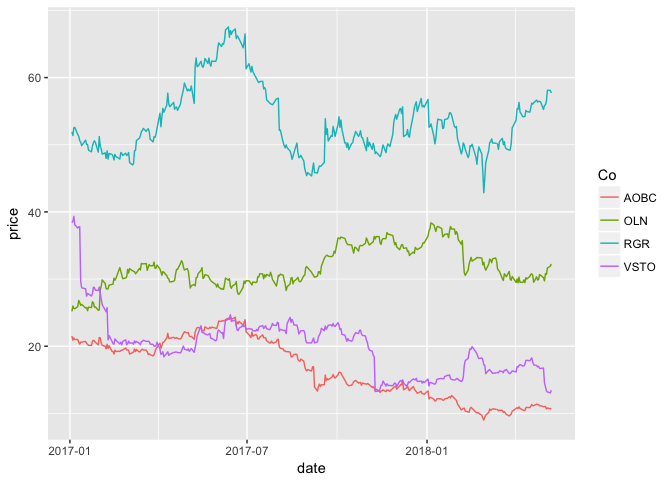

2. Stock Changes after Mass Shooting
------------------------------------

### 2.1 Stock Price Change Analysis

We selected stocks of the four companies on the massing shooting date and the following one week of each mass shooting case. Intuitively, We plot the stock prices for each case in that one week to see if there is a big difference.

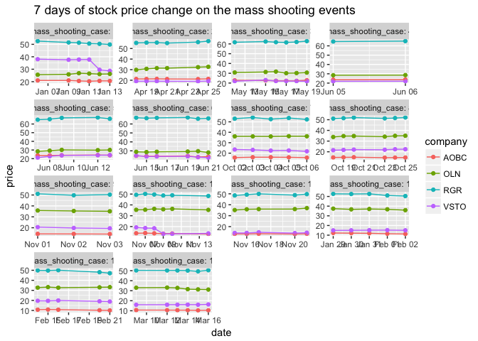

From this plot, we can see, basically, the stock prices after one case is centralized, which means there is no big change on the stock prices, apart from cases 1 and 10 for VSTO.

Alternatively, we examine the price variance for each case in the selected one week period, to see if there is a big variation on the stock price.

Table 3. Stock Price Variance

    ## # A tibble: 14 x 5
    ##    shootingcase varianceAOBC varianceRGR varianceVSTO varianceOLN
    ##           <int>        <dbl>       <dbl>        <dbl>       <dbl>
    ##  1            1      0.0723       0.931      20.1         0.193  
    ##  2            2      0.00619      0.458       0.00722     1.11   
    ##  3            3      0.0706       0.259       0.209       0.384  
    ##  4            4      0.00845      0.0986      0.00320     0.00815
    ##  5            5      0.0322       1.13        1.57        0.499  
    ##  6            6      0.242        0.286       0.629       0.253  
    ##  7            7      0.0418       0.599       0.452       0.0111 
    ##  8            8      0.0235       0.168       0.128       0.206  
    ##  9            9      0.00823      0.416       0.316       0.131  
    ## 10           10      0.0996       0.496       8.73        0.192  
    ## 11           11      0.0100       0.361       0.0845      0.402  
    ## 12           12      0.198        1.18        0.0104      0.348  
    ## 13           13      0.142        1.73        0.187       0.0722 
    ## 14           14      0.0111       0.164       0.0160      0.846

Based on this table, we are able to see, apart from the varianceds of VSTO in case 1 and case 10, the other variances are comparablly small, which means there is no big price change. We take a closer look at these two cases with big variances only..

Table 4 and Table 5. Detailed Stock Prices in Cases 1 and 10

    ##             VSTO
    ## 2017-01-06 38.08
    ## 2017-01-09 37.59
    ## 2017-01-10 37.77
    ## 2017-01-11 37.79
    ## 2017-01-12 29.58
    ## 2017-01-13 28.70

    ##             VSTO
    ## 2017-11-06 19.24
    ## 2017-11-07 18.64
    ## 2017-11-08 18.43
    ## 2017-11-09 13.25
    ## 2017-11-10 13.28

Even though there were big changes on these two cases, but the changes happened after 3 days of the mass shooting, so we don't see this change is directly related to the mass shooting.

### 2.2 Volatility Analysis

In order to further analyze this problem, we use volatility analysis to see if there is any impact.

The following part is for the volatility analysis. we build ARIMA model and extract the residuals from it. we regarded the $residual^2$ as the volatility.

We choose AOBC, RGR, VSTO, OLN top four gun company stock adjusted price as our data. The data are all from 2017-01-03 to 2018-04-18.

For the four company seems like they all have unit root and we need to take difference.

After differentiation the RGR and VSTO are already convert to stationary with no ACF and PACF in series. Thus we treated the diff.adjusted.price^2 as volatility.

As for the rest two series which is AOBC, OLN. After differentiation we fited ARMA model to get the residuals and treated residuals^2 as volatility.

Above four chunks are used to get the volatility of each company. Since we will visulize these volatility, we hide the output from them.

Below are the visualizations of the four volatilities.

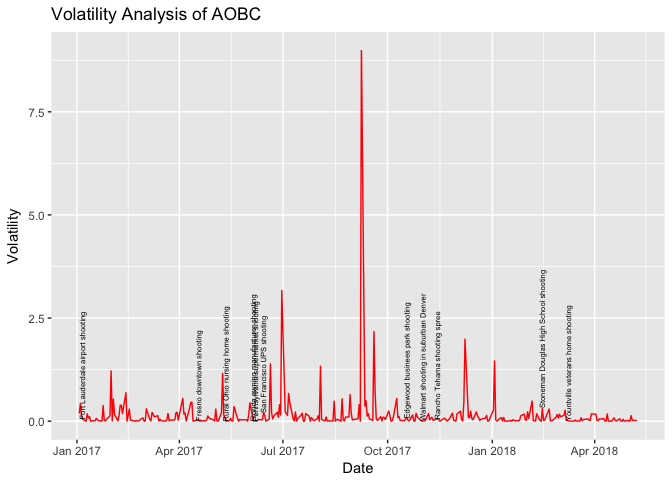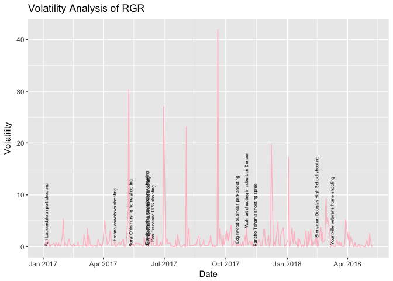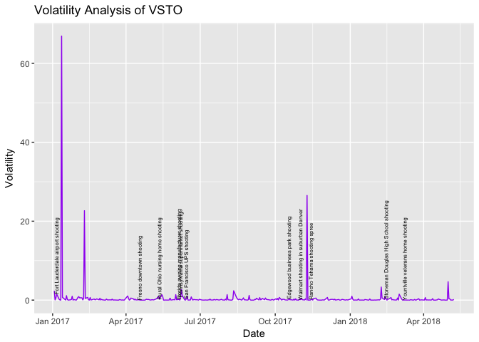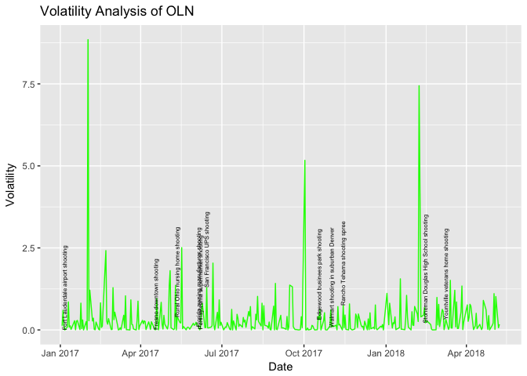

### 2.3 Conclusion

Thereofore, based on our analysis, we conclude mass shooting has no impact on the gun manufacturers stocks.

### 2.3 Summary

Thereofore, based on our analysis, we conclude mass shooting has no impact on the gun manufacturers stocks.

3. Public Opinion on Guns
-------------------------

In order to understand people's opinions towards guns after mass shooting, we planned to explore what people talked about on guns on Twitter. However, because of [Twitter API limit](https://developer.twitter.com/en/docs/tweets/search/overview), we could only get tweets no earlier than the past 7 days. Therefore, we turned to explore public's opinions on guns in general.

In total, we extracted 100,000 tweets pertaining to guns on 04-20-2018. 04-20 is the 19th anniversary of the Columbine Massacre, as well as National Walkout Day. [National School Walkout](https://www.nationalschoolwalkout.net) is a movement powered and led by students across the country. They were protesting congressional, state, and local failures to take action to prevent gun violence. Students walked out of their classrooms on this day for those who lost their lives to gun violence, and to promote solutions to gun violence.

### 3.1 Frequent Word(s)

In order to find the most frequent words in these tweets, which also conveys meaningful values, we firstly cleaned the tweets to
- exclude the stop words such as RT (if that tweet is retweeted), amp (used for symbol &), and the stop words dataset in tidytext, etc.
- remove the symbols of punctuations, e.g. @,."",etc.
- covert all words to small letters to avoid the same word is treated as two different words due to small or capital letters, for example, Gun and gun
- eliminate all the emojis, filter all the strings whose encoding system is not ASCII.
- delete all the hyperlinks (http/https) in order to avoid http might be the top word.

After cleaning the tweets, we analyzed the most frequent word people discussed the most.

#### 3.1.1 Single word

Below plot shows the words with frequency more than 5000.

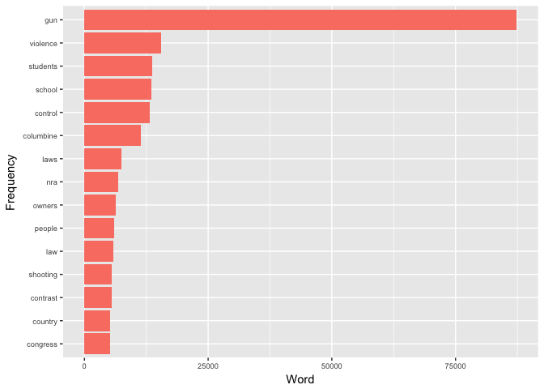

Gun ranks the first, because that is our search key word. It is followed violence, control, laws and so on, which are the commonly discussed topics related to guns. Also, other words such as students, school and columbine, which represent the event happened on that day.

However, the word "contract" ranks 13 is confusing, what it means, this also reveals the problem of single word frequency, that we could not see the real meaning based on a single word.

#### 3.1.2 Word Group

Therefore, in addition to the single word, we are also interested in the word groups. e.g. for the most frequent words in the above sections, do they occur together or seperately, which of their combinations occur the most will give us a futher idea of what people are talikng about.

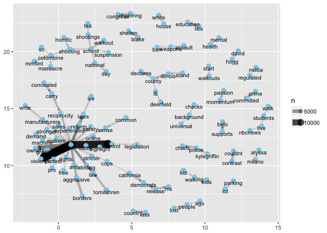

Based on this diagram, we are able to see, there are two major groups of words. One is linked with gun and the other is linked with school. This is in line with our findings in the single word frequency.

The thickness of the lines connected two words represent the frequency of the word combinations. Still, gun violence, gun control are the top two topics followed by gun owners, gun laws and so on.

    ## # A tibble: 10 x 3
    ##    word1      word2          n
    ##    <chr>      <chr>      <int>
    ##  1 gun        violence   14825
    ##  2 gun        control    12793
    ##  3 gun        owners      6245
    ##  4 gun        laws        4209
    ##  5 law        abiding     2779
    ##  6 aggressive gun         2762
    ##  7 contrast   couldnt     2754
    ##  8 beto       supports    2751
    ##  9 borders    aggressive  2751
    ## 10 abiding    gun         2550

Similarly, in the top 10 most frequent word combinations, "contrast couldnt","beto supports","borders agreesive" do not provide a clear meaning and make us confused what they are talking about.

Based on Singular Vector Decomposition (SVD) analysis, in the second eignvector, we found the tweet which could explain the words "contrast" from single word, as well as the three word combinations we just found. This is a tweet from Ted Cruz, who is Candidate for the Republican nomination for President in 2016. This is also the tweet being retweeted the most in our dataset.

    ## [1] "The contrast couldn’t be greater: Beto supports open borders, aggressive gun control &amp; impeaching the President. In contrast, like most Texans, I’m glad for policy victories under Trump: low taxes, less regs &amp; more jobs. And what’s “fun to watch” is the MSM losing their minds. https://t.co/x20JeMtMB1"

### 3.2 Sentiment Analysis

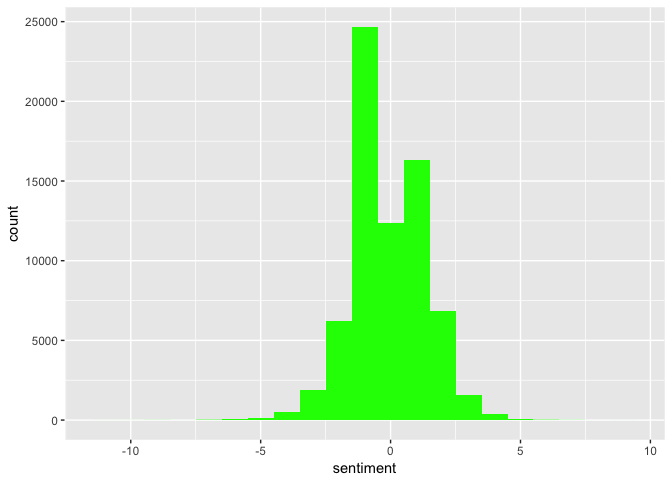 The overall sentiment is negative.

### 3.3 Topic Modeling

    ## A LDA_VEM topic model with 4 topics.

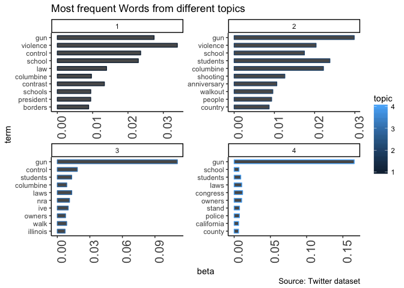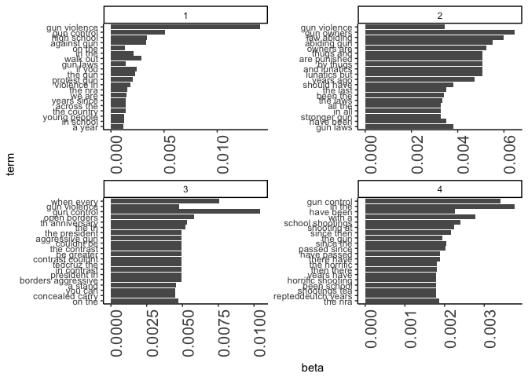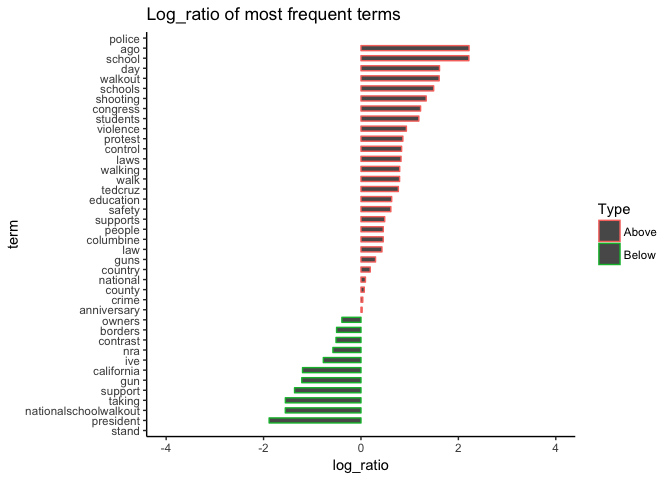
