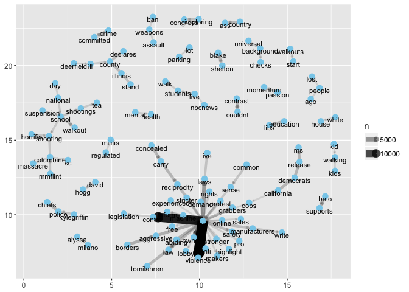

Guns
================
Zhengyun Dou
4/30/2018

``` r
#list of required packages
library(devtools)
library(rvest)
library(tidyverse)
library(stringr)
library(quantmod) #financial package
library(rtweet)
library(lubridate)
library(tidytext)
library(widyr)
library(igraph)
library(ggraph)
library(tm)
library(wordcloud)
library(wordcloud2)
library(Matrix)
library(rARPACK)
library(data.table)
library(tidyr)
library(aTSA)
library(TSA)
library(topicmodels)
library(NLP)
library(plotly)
```

1.Introduction
--------------

Based on the records on [MotherJones](https://www.motherjones.com/politics/2012/12/mass-shootings-mother-jones-full-data/), from 01-01-2017 until now, there are totally 14 mass shootings (with fatalities 3 or above).

Table 1. Mass Shooting in US (01-01-2017 till now)

``` r
mass=read_csv("Mother Jones' Investigation_ US Mass Shootings, 1982-2018 - US mass shootings.csv")
# from https://www.motherjones.com/politics/2012/12/mass-shootings-mother-jones-full-data/
# str(mass)
# head(mass)
mass2017=mass %>% 
  mutate(Date=mdy(mass$Date)) %>% 
  filter(Date>="2017-01-01") #covert the date to be the same format as in stock[]

mass2017[,c(2,3,5,6)]
```

    ## # A tibble: 14 x 4
    ##    Location                 Date       Summary                  Fatalities
    ##    <chr>                    <date>     <chr>                         <int>
    ##  1 Yountville, CA           2018-03-09 Army veteran Albert Che…          3
    ##  2 Parkland, Florida        2018-02-14 Nikolas J. Cruz, 19, he…         17
    ##  3 Melcroft, PA             2018-01-28 Timothy O'Brien Smith, …          4
    ##  4 Rancho Tehama, CA        2017-11-14 Kevin Janson Neal, 44, …          5
    ##  5 Sutherland Springs, TX   2017-11-05 Devin Patrick Kelley, a…         26
    ##  6 Thornton, CO             2017-11-01 Scott Allen Ostrem, 47,…          3
    ##  7 Edgewood, MD             2017-10-18 Radee Labeeb Prince, 37…          3
    ##  8 Las Vegas, NV            2017-10-01 Stephen Craig Paddock, …         58
    ##  9 San Francisco, CA        2017-06-14 Jimmy Lam, 38, fatally …          3
    ## 10 Tunkhannock, PA          2017-06-07 Randy Stair, a 24-year-…          3
    ## 11 Orlando, Florida         2017-06-05 John Robert Neumann, Jr…          5
    ## 12 Kirkersville, Ohio       2017-05-12 Thomas Hartless, 43, sh…          3
    ## 13 Fresno, California       2017-04-18 Kori Ali Muhammad, 39, …          3
    ## 14 Fort Lauderdale, Florida 2017-01-06 Esteban Santiago, 26, f…          5

#### Our analysis consists of two parts,

-   if the stock prices of the gun manufactuers were affected after mass shooting,
-   and what the public talked about on guns after mass shooting.

There are four major gun manufacturers in the US that go public, namely,

Table 2. Gun Manufacturers

| Company Name            | Stock Symbol |
|-------------------------|--------------|
| American Outdoor Brands | AOBC         |
| Sturm, Ruger            | RGR          |
| Vista Outdoor           | VSTO         |
| Olin                    | OLN          |

Below is a general overview of the stocks of these four companies from 2017-01-01 to 2018-04-25.

``` r
data=tibble(company=c("American Outdoor Brands","Sturm, Ruger","Vista Outdoor","Olin"),
            symbol=c("AOBC","RGR","VSTO","OLN"),
            agency=c("NASDAQ","NYSE","NYSE","NYSE"))

getSymbols(data$symbol,from="2017-01-01",adjust=TRUE) #all the four companies  
```

    ## [1] "AOBC" "RGR"  "VSTO" "OLN"

``` r
stock=Cl(get(data$symbol[1])) #close column of AOBC
for(i in 2:length(data$symbol))
  stock=merge(stock,Cl(get(data$symbol[i]))) #closure stock price for all four companies     
colnames(stock)=data$symbol
# tail(stock)
stockchange=stock%>% diff
#head(stockchange)

stock%>% as.tibble() %>% 
  mutate(date=index(stock))  %>%  
  gather('AOBC','RGR','VSTO','OLN',key="Co",value="price") %>% 
  ggplot(aes(y=price,x=date))+geom_line(aes(color=Co))
```


2. Stock Changes after Mass Shooting
------------------------------------

### 2.1 Stock Price Change Analysis

We selected stocks of the four companies on the massing shooting date and the following one week of each mass shooting case. Intuitively, We plot the stock prices for each case in that one week to see if there is a big difference.

``` r
mdays=function(a,x){
  day=matrix(nrow = x,ncol=length(a))
  for (i in 1:x){
    day[i,]=a+i}
  c(a,day)}
#create a function to extend the mass shooting date to the following x days

daterange1=mdays(mass2017$Date,7)
case=rep(1:14,c(6,6,6,2,5,6,5,6,3,6,5,5,5,6)) %>% as.tibble()

stock[daterange1] %>% as.tibble() %>% 
  mutate(date=index(stock[daterange1])) %>%cbind(.,case) %>%  
  gather('AOBC','RGR','VSTO','OLN',key="Co",value="price") %>% 
  ggplot(aes(y=price,x=date))+
  geom_point(aes(color=date))+scale_fill_continuous(limits=c(17200, 17600), breaks=seq(17200,17600,by=0.25))+
  facet_grid(Co~value)
```


``` r
#stock%>% diff %>% .[mdays(ymd("2017-01-06"),7)]
#stock%>% diff %>% .[mdays(ymd("2017-11-05"),7)]
```

From this plot, we can see, basically, the stock prices after one case is centralized, which means there is no big change on the stock prices, apart from cases 1 and 10 for VSTO.

Alternatively, we examine the price variance for each case in the selected one week period, to see if there is a big variation on the stock price.

Table 3. Stock Price Variance

``` r
variance=stock[daterange1] %>% as.tibble() %>% 
  mutate(date=index(stock[daterange1])) %>%
  cbind(.,case) %>% rename(shootingcase=value) %>% 
  group_by(shootingcase) %>% 
  summarise(varianceAOBC=var(AOBC),varianceRGR=var(RGR),
            varianceVSTO=var(VSTO),varianceOLN=var(OLN)) %>% 
  mutate(date=sort(mass2017$Date)) %>% select(shootingcase,date,varianceAOBC:varianceOLN)

variance[,c(1,3,4,5,6)]
```

    ## # A tibble: 14 x 5
    ##    shootingcase varianceAOBC varianceRGR varianceVSTO varianceOLN
    ##           <int>        <dbl>       <dbl>        <dbl>       <dbl>
    ##  1            1      0.0723       0.931      20.1         0.193  
    ##  2            2      0.00619      0.458       0.00722     1.11   
    ##  3            3      0.0706       0.259       0.209       0.384  
    ##  4            4      0.00845      0.0986      0.00320     0.00815
    ##  5            5      0.0322       1.13        1.57        0.499  
    ##  6            6      0.242        0.286       0.629       0.253  
    ##  7            7      0.0418       0.599       0.452       0.0111 
    ##  8            8      0.0235       0.168       0.128       0.206  
    ##  9            9      0.00823      0.416       0.316       0.131  
    ## 10           10      0.0996       0.496       8.73        0.192  
    ## 11           11      0.0100       0.361       0.0845      0.402  
    ## 12           12      0.198        1.18        0.0104      0.348  
    ## 13           13      0.142        1.73        0.187       0.0722 
    ## 14           14      0.0111       0.164       0.0160      0.846

Based on this table, we are able to see, apart from the varianceds of VSTO in case 1 and case 10, the other variances are comparablly small, which means there is no big price change. We take a closer look at these two cases with big variances only..

Table 4 and Table 5. Detailed Stock Prices in Cases 1 and 10

``` r
stock$VSTO[mdays(ymd("2017-01-06"),7)]
```

    ##             VSTO
    ## 2017-01-06 38.08
    ## 2017-01-09 37.59
    ## 2017-01-10 37.77
    ## 2017-01-11 37.79
    ## 2017-01-12 29.58
    ## 2017-01-13 28.70

``` r
stock$VSTO[mdays(ymd("2017-11-05"),7)]
```

    ##             VSTO
    ## 2017-11-06 19.24
    ## 2017-11-07 18.64
    ## 2017-11-08 18.43
    ## 2017-11-09 13.25
    ## 2017-11-10 13.28

Even though there were big changes on these two cases, but the changes happened after 3 days of the mass shooting, so we don't see this change is directly related to the mass shooting.

### 2.2 Volatility Analysis

In order to further analyze this problem, we use volatility analysis to see if there is any impact.

The following part is for the volatility analysis. we build ARIMA model and extract the residuals from it. we regarded the $residual^2$ as the volatility.

We choose AOBC, RGR, VSTO, OLN top four gun company stock adjusted price as our data. The data are all from 2017-01-03 to 2018-04-18.

For the four company seems like they all have unit root and we need to take difference.

After differentiation the RGR and VSTO are already convert to stationary with no ACF and PACF in series. Thus we treated the diff.adjusted.price^2 as volatility.

As for the rest two series which is AOBC, OLN. After differentiation we fited ARMA model to get the residuals and treated residuals^2 as volatility.

``` r
dataset1<-data.frame(volatility=as.vector(volatility1),idx = index(volatility1), label=index(volatility1))
dataset2<-data.frame(volatility=as.vector(volatility2),idx = index(volatility2), label=index(volatility2))
dataset3<-data.frame(volatility=as.vector(volatility3),idx = index(volatility3), label=index(volatility3))
dataset4<-data.frame(volatility=as.vector(volatility4),idx = index(volatility4), label=index(volatility4))

ggplot(dataset1, aes(x= idx, y= volatility, color="pink", label=label, size=3))+
geom_point(color = "darkblue", size = 2) + 
geom_text(aes(label=ifelse(volatility>5,as.character(label),'')),hjust=0,vjust=0)+
ggtitle("AOBC's volatility") +
xlab("year") + ylab("volatility")
```


``` r
ggplot(dataset2, aes(x= idx, y= volatility, color="pink", label=label, size=3))+
geom_point(color = "darkblue", size = 2) + 
geom_text(aes(label=ifelse(volatility>30,as.character(label),'')),hjust=0,vjust=0)+
ggtitle("RGR's volatility") +
xlab("year") + ylab("volatility")
```


``` r
ggplot(dataset3, aes(x= idx, y= volatility, color="pink", label=label, size=3))+
geom_point(color = "darkblue", size = 2) + 
geom_text(aes(label=ifelse(volatility>10,as.character(label),'')),hjust=0,vjust=0)+
ggtitle("VSTO's volatility") +
xlab("year") + ylab("volatility")
```


``` r
ggplot(dataset4, aes(x= idx, y= volatility, color="pink", label=label, size=3))+
geom_point(color = "darkblue", size = 2) + 
geom_text(aes(label=ifelse(volatility>5,as.character(label),'')),hjust=0,vjust=0)+
ggtitle("OLN's volatility") +
xlab("year") + ylab("volatility")
```


### 2.3 Conclusion

Thereofore, based on our analysis, we conclude mass shooting has no impact on the gun manufacturers stocks.

3. Public Opinion on Guns
-------------------------

We planned to explore what people talked about on guns after mass shooting, however, because of [Twitter API limit](https://developer.twitter.com/en/docs/tweets/search/overview), we can only get tweets for the past 7 days. Therefore we decide to explore people's opinion on guns in general. In total, we extracted 100,000 tweets pertaining to guns on 2018-04-20.

### 3.1 Frequent Word(s)

After cleaning the text, we analyzed the frequent word(s) people discussed the most.

#### 3.1.1 Single word

Below plot shows the words with frequency more than 5000.

``` r
twitters=read_csv("gun.tweets.csv",col_types = cols(.default = col_character())) %>% as.tbl()
#dim(twitters)

twitters$text=sapply(twitters$text,function(row) iconv(row, "latin1", "ASCII", sub=""))

cleantext <- function(tx){
  tx= gsub("htt.{1,20}", " ", tx, ignore.case=TRUE)
  tx = gsub("[^#[:^punct:]]|@", " ", tx, perl=TRUE, ignore.case=TRUE)
  tx = gsub("[[:digit:]]", " ", tx, ignore.case=TRUE)
  tx = gsub(" {1,}", " ", tx, ignore.case=TRUE)
  tx = gsub("^\\s+|\\s+$", " ", tx, ignore.case=TRUE)
  return(tx)
}

twitters$text=lapply(twitters$text, cleantext)

stop_words=rbind(stop_words,c("rt",""),c("amp",""))
#twitters$text=str_replace_all(twitters$text,"^suppo$","support")

#head(twitters$text)
cleaned=twitters  %>% 
  select(text) %>% 
  unnest_tokens(word,text) %>% 
  anti_join(stop_words) 

frequency=cleaned %>% 
  count(word,sort=TRUE) 

#frequency$word=str_replace(frequency$word,"^suppo$","support")

frequency %>% filter(n>5000) %>% 
  ggplot(aes(x=word, y=n)) + geom_bar(stat="identity",aes(fill=n)) + coord_flip() + theme(axis.text=element_text(size=7))+coord_polar(start=1.8,direction=1)+theme_light()+scale_fill_gradient(low='red', high='white', limits=c(5000,100000))+aes(reorder(word, n))+theme(axis.text.x = element_text(angle=-20))+ labs(x = NULL, y = NULL)
```


They are the top 15 words.

``` r
top15=frequency%>% top_n(15) 
top15
```

    ## # A tibble: 15 x 2
    ##    word          n
    ##    <chr>     <int>
    ##  1 gun       87316
    ##  2 violence  15577
    ##  3 students  13762
    ##  4 school    13596
    ##  5 control   13129
    ##  6 columbine 11463
    ##  7 laws       7403
    ##  8 nra        6791
    ##  9 owners     6313
    ## 10 people     6062
    ## 11 law        5910
    ## 12 shooting   5586
    ## 13 contrast   5510
    ## 14 country    5169
    ## 15 congress   5121

Gun ranks the first, because that is our search key word, followed by violence, students, school and control. Other top words are also easy to understand, e.g. Columbine is a student name, where a mass shooting happened 19 years ago, and April 19 is the anniversary. However, the 13th word, "contrast", which is confusing and this will be explained later.

#### 3.1.2 Word Group

In addition to the single word, we are also interested in the word groups, e.g. what words occur with gun together mostly.

``` r
cleaned_two=twitters%>% 
  select(text) %>% 
  unnest_tokens(words,text,token="ngrams",n=2,collapse = FALSE) 


separated=cleaned_two %>% 
  separate(words,c("word1","word2"),sep=" ")

filtered=separated %>% 
  filter(!word1 %in% stop_words$word) %>% 
  filter(!word2 %in% stop_words$word) %>% 
  count(word1,word2,sort=TRUE)

filtered %>% top_n(10)
```

    ## # A tibble: 10 x 3
    ##    word1      word2          n
    ##    <chr>      <chr>      <int>
    ##  1 gun        violence   14825
    ##  2 gun        control    12793
    ##  3 gun        owners      6245
    ##  4 gun        laws        4209
    ##  5 law        abiding     2779
    ##  6 aggressive gun         2762
    ##  7 contrast   couldnt     2754
    ##  8 beto       supports    2751
    ##  9 borders    aggressive  2751
    ## 10 abiding    gun         2550

Gun violence, gun control, gun owners and gun laws rank the top 4.

For the word groups 7-9, we will explain them later.

We also plot this result in a diagram to show the most connected two words (frequency over 500).

``` r
a=grid::arrow(type = "closed", length = unit(.02, "inches"))
filtered %>% filter(n>500) %>% 
  graph_from_data_frame() %>% 
  ggraph(layout="fr")+
  geom_edge_link(aes(edge_alpha=n,edge_width=n),arrow=a,end_cap = circle(.07, 'inches'))+
  geom_node_point(color = "skyblue", size = 3) +
  geom_node_text(aes(label = name), vjust = 1, size = 3)+xlab(NULL)+ylab(NULL)
```



#### 3.1.3 SVD

We use SVD to analyze the tweets. We define the number of singular values is 10. Below is a plot of all the 10 left singular vectors.

``` r
textdf=data_frame(tweet=1:nrow(twitters),text=unlist(twitters$text))
tword=textdf %>% unnest_tokens(word,text) 


dt1 = cast_sparse(tword,tweet,word)

A1 = dt1; Dl1 = Diagonal(nrow(A1), 1/sqrt(rowSums(A1)+10)); Dr1 = Diagonal(ncol(A1), 1/sqrt(colSums(A1)+10))
L1 = Dl1%*%A1%*%Dr1
s1 = svds(L1, k = 10)
#plot(s$d)
u1 = s1$u


#plot(as.data.frame(u1[sample(nrow(A1),10000),]), pch = ".")

#plot(u1[,2])

colnames(u1)=c("v1","v2","v3","v4","v5","v6","v7","v8","v9","v10")

u1 %>% as.tibble() %>% select(v1:v10) %>% 
  gather(v1:v10,key="vector",value="value") %>% 
  ggplot(aes(y=value,x=1:length(value)))+
  geom_point(aes(color=vector))+aes(reorder(vector,value))+xlab("Left Singular Vector")
```


Based on this plot, we check some lowest or highest vector values in certain vectors, e.g. -0.015 in vector 2. We find some tweets that occur multiple times. After checking, those are the tweets being retweeted most.

#### 3.1.4 Conclusion

Regardless of people's attitue to guns, gun control is a hot topic on gun.

### 3.2 Sentiment Analysis

``` r
data1=read_csv("gun.tweets.csv",col_types = cols(.default = col_character())) %>% as.tbl()
text_df1 <- data_frame(tweet = 1:nrow(data1), text = data1$text)
tt1  = text_df1 %>% unnest_tokens(word, text)
#without matrix
tt2=tt1 %>%group_by(tweet)%>%left_join(get_sentiments("bing"))%>%left_join(get_sentiments("afinn"))%>%count(sentiment)%>%
ungroup()%>%spread(sentiment, n, fill = 0)%>% mutate(sentiment = positive - negative)
tt2<-tt2[,-4]
tt2%>%ggplot(aes(x=sentiment))+geom_histogram(binwidth = 1,fill="pink")
```


``` r
#removng columns with both positve and negative as zero
tt3<-tt2[tt2$negative!= 0 | tt2$positive!= 0, ]
tt3%>%ggplot(aes(x=sentiment))+geom_histogram(binwidth = 1,fill="green")
```


### 3.3 Topic Modeling

``` r
#dim(twitters)
twitters2=read_csv("gun.tweets.csv",col_types = cols(.default = col_character())) %>% as.tbl()
twitters_wenhao = cbind(twitters2,c(1:nrow(twitters2)))
colnames(twitters_wenhao)[43] = "TweetIndex"
twitters_wenhao$text=sapply(twitters_wenhao$text,function(row) iconv(row, "latin1", "ASCII", sub=""))

twitters_wenhao$text=lapply(twitters_wenhao$text, cleantext)

stop_words=rbind(stop_words,c("rt",""),c("amp",""),c("iphone",""),c("android",""),c("twitter",""))
#twitters$text=str_replace_all(twitters$text,"^suppo$","support")

#head(twitters$text)
cleaned_wenhao=twitters_wenhao  %>% 
select(text,TweetIndex) %>% 
unnest_tokens(word,text) %>% 
anti_join(stop_words) %>%
group_by(word)%>%
filter(n()>20)%>%
ungroup()

twitters_t <- cleaned_wenhao %>%
count(TweetIndex,word, sort = TRUE) %>%
ungroup()

t_dtm <- twitters_t %>%
cast_dtm(TweetIndex,word, n)

t_lda <- LDA(t_dtm, k = 4, control = list(seed = 1234))
t_lda
```

    ## A LDA_VEM topic model with 4 topics.

``` r
t_lda_td <- tidy(t_lda)

ttop_terms <- t_lda_td %>%
group_by(topic) %>%
top_n(10, beta) %>%
ungroup() %>%
arrange(topic, -beta)

theme_set(theme_classic())
ttop_terms %>%
mutate(term = reorder(term, beta)) %>%
ggplot(aes(term, beta,color=topic)) +
geom_bar(stat = "identity",width = 0.5) +
facet_wrap(~ topic, scales = "free") + 
labs(title="Most frequent Words from different topics ", 
caption="Source: Twitter dataset") +
theme(axis.text.x = element_text(size = 15, angle = 90, hjust = 1))+
coord_flip()
```


``` r
# bigram
tcleaned=twitters_wenhao  %>% 
select(text,TweetIndex)

tcleaned$text = unlist(tcleaned$text)
t_bigrams <- tcleaned %>%
unnest_tokens(output = bigram, input = text, token = "ngrams", n = 2,collapse = TRUE)%>%
filter(!str_detect(string = bigram,pattern="twitter|android|twitter"))

b_t <- t_bigrams %>%
count(TweetIndex,bigram, sort = TRUE) %>%
ungroup()

bt_dtm <- b_t %>%
cast_dtm(TweetIndex, bigram, n)

bt_lda <- LDA(bt_dtm, k = 4, control = list(seed = 1234))
bt_lda_td <- tidy(bt_lda)

bttop_terms <- bt_lda_td %>%
filter(beta>8.007085e-07)%>%
filter(!str_detect(term, "twitter"))%>%
filter(!str_detect(term, "iphone"))%>%
filter(!str_detect(term, "android"))%>%
filter(!str_detect(term, "to"))%>%
filter(!str_detect(term, "for"))%>%
filter(!str_detect(term, "of"))%>%
filter(!str_detect(term, "m"))%>%
filter(!str_detect(term, "from"))%>%
filter(!str_detect(term, "rt"))%>%
filter(!str_detect(term, "my"))%>%
filter(nchar(term)>5)%>%
group_by(topic) %>%
top_n(20, beta) %>%
ungroup() %>%
arrange(topic, -beta)

ap_lda <- LDA(bt_dtm, k = 2, control = list(seed = 1234))
ap_topics <- tidy(ap_lda, matrix = "beta")

beta_spread <- ap_topics %>%
mutate(topic = paste0("topic", topic)) %>%
spread(topic, beta) %>%
filter(topic1 > .001 | topic2 > .001) %>%
mutate(log_ratio = log2(topic2 / topic1))


# 4 topics research on biagram text

bttop_terms %>%
mutate(term = reorder(term, beta)) %>%
ggplot(aes(term, beta),fill = factor(topic)) +
geom_bar(stat = "identity") +
facet_wrap(~ topic, scales = "free") +
theme(axis.text.x = element_text(size = 15, angle = 90, hjust = 1))+
coord_flip()
```


``` r
# 2 topics comparison 

cleaned_wenhao1=twitters_wenhao  %>% 
select(text,TweetIndex) %>% 
unnest_tokens(word,text) %>% 
anti_join(stop_words) %>%
group_by(word)%>%
filter(n()>3000)%>%
ungroup()

twitters_t1 <- cleaned_wenhao1 %>%
count(TweetIndex,word, sort = TRUE) %>%
ungroup()

t_dtm1 <- twitters_t1 %>%
cast_dtm(TweetIndex,word, n)
ap_lda1 <- LDA(t_dtm1, k = 2, control = list(seed = 1234))
ap_topics1 <- tidy(ap_lda1, matrix = "beta")

beta_spread1 <- ap_topics1 %>%
mutate(topic = paste0("topic", topic)) %>%
spread(topic, beta) %>%
filter(topic1 > .001 | topic2 > .001) %>%
mutate(log_ratio = log2(topic2 / topic1))

beta_top_terms1 = beta_spread1 %>%
mutate(position = ifelse(log_ratio< 0, "below", "above"))%>%
mutate(term = reorder(term, log_ratio)) %>%
ggplot(aes(x=term, y=log_ratio,color = position),fill=cond) + 
geom_bar(stat = "identity",width = 0.5) +
scale_color_manual(name="Type", 
labels = c("Above","Below"), 
values = c("below" = "#00ba38", "above" = "#f8766d")) + 
labs(title="Log_ratio of most frequent terms") + 
ylim(-4, 4) +
coord_flip()
beta_top_terms1
```


``` r
theme_set(theme_classic())
```

This is made together with Peijin Li, Wenhao Zhang, Stuti Pandey, and Soyoung Kim.
