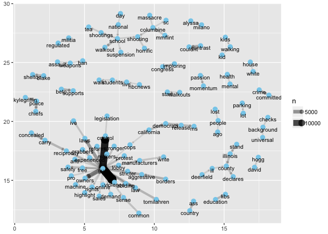

##1.Introduction

Based on the records on [MotherJones](https://www.motherjones.com/politics/2012/12/mass-shootings-mother-jones-full-data/), from 01-01-2017 until now, there are totally 14 mass shootings (with fatalities 3 or above).

Table 1. Mass Shooting in US (01-01-2017 till now)


```
## # A tibble: 14 x 4
##    Location                 Date       Summary                  Fatalities
##    <chr>                    <date>     <chr>                         <int>
##  1 Yountville, CA           2018-03-09 Army veteran Albert Che…          3
##  2 Parkland, Florida        2018-02-14 Nikolas J. Cruz, 19, he…         17
##  3 Melcroft, PA             2018-01-28 Timothy O'Brien Smith, …          4
##  4 Rancho Tehama, CA        2017-11-14 Kevin Janson Neal, 44, …          5
##  5 Sutherland Springs, TX   2017-11-05 Devin Patrick Kelley, a…         26
##  6 Thornton, CO             2017-11-01 Scott Allen Ostrem, 47,…          3
##  7 Edgewood, MD             2017-10-18 Radee Labeeb Prince, 37…          3
##  8 Las Vegas, NV            2017-10-01 Stephen Craig Paddock, …         58
##  9 San Francisco, CA        2017-06-14 Jimmy Lam, 38, fatally …          3
## 10 Tunkhannock, PA          2017-06-07 Randy Stair, a 24-year-…          3
## 11 Orlando, Florida         2017-06-05 John Robert Neumann, Jr…          5
## 12 Kirkersville, Ohio       2017-05-12 Thomas Hartless, 43, sh…          3
## 13 Fresno, California       2017-04-18 Kori Ali Muhammad, 39, …          3
## 14 Fort Lauderdale, Florida 2017-01-06 Esteban Santiago, 26, f…          5
```


####Our analysis consists of two parts,

+ if the stock prices of the gun manufactuers were affected after mass shooting,
+ and what the public talked about on guns after mass shooting.


There are four major gun manufacturers in the US that go public, namely,

Table 2. Gun Manufacturers

Company Name  | Stock Symbol
------------- | -------------
  American Outdoor Brands   | AOBC
Sturm, Ruger     | RGR
Vista Outdoor   | VSTO
Olin     | OLN

Below is a general overview of the stocks of these four companies from 2017-01-01 to 2018-04-25.


```
## [1] "AOBC" "RGR"  "VSTO" "OLN"
```

<!-- -->

##2. Stock Changes after Mass Shooting

### 2.1 Stock Price Change Analysis

We selected stocks of the four companies on the massing shooting date and the following one week of each mass shooting case. Intuitively, We plot the stock prices for each case in that one week to see if there is a big difference.


<!-- -->

From this plot, we can see, basically, the stock prices after one case is centralized, which means there is no big change on the stock prices, apart from cases 1 and 10 for VSTO.

Alternatively, we examine the price variance for each case in the selected one week period, to see if there is a big variation on the stock price.

Table 3. Stock Price Variance


```
## # A tibble: 14 x 5
##    shootingcase varianceAOBC varianceRGR varianceVSTO varianceOLN
##           <int>        <dbl>       <dbl>        <dbl>       <dbl>
##  1            1      0.0723       0.931      20.1         0.193  
##  2            2      0.00619      0.458       0.00722     1.11   
##  3            3      0.0706       0.259       0.209       0.384  
##  4            4      0.00845      0.0986      0.00320     0.00815
##  5            5      0.0322       1.13        1.57        0.499  
##  6            6      0.242        0.286       0.629       0.253  
##  7            7      0.0418       0.599       0.452       0.0111 
##  8            8      0.0235       0.168       0.128       0.206  
##  9            9      0.00823      0.416       0.316       0.131  
## 10           10      0.0996       0.496       8.73        0.192  
## 11           11      0.0100       0.361       0.0845      0.402  
## 12           12      0.198        1.18        0.0104      0.348  
## 13           13      0.142        1.73        0.187       0.0722 
## 14           14      0.0111       0.164       0.0160      0.846
```

Based on this table, we are able to see, apart from the varianceds of VSTO in case 1 and case 10, the other variances are comparablly small, which means there is no big price change. We take a closer look at these two cases with big variances only..

Table 4 and Table 5. Detailed Stock Prices in Cases 1 and 10


```
##             VSTO
## 2017-01-06 38.08
## 2017-01-09 37.59
## 2017-01-10 37.77
## 2017-01-11 37.79
## 2017-01-12 29.58
## 2017-01-13 28.70
```

```
##             VSTO
## 2017-11-06 19.24
## 2017-11-07 18.64
## 2017-11-08 18.43
## 2017-11-09 13.25
## 2017-11-10 13.28
```

Even though there were big changes on these two cases, but the changes happened after 3 days of the mass shooting, so we don't see this change is directly related to the mass shooting.


### 2.2 Volatility Analysis


In order to further analyze this problem, we use volatility analysis to see if there is any impact.

The following part is for the volatility analysis. we build ARIMA model and extract the residuals from it. we regarded the \$residual^2$ as the volatility.

We choose AOBC, RGR, VSTO, OLN top four gun company stock adjusted price as our data. The data are all from 2017-01-03 to 2018-04-18.

For the four company seems like they all have unit root and we need to take difference.

After differentiation the RGR and VSTO are already convert to stationary with no ACF and PACF in series. Thus we treated the diff.adjusted.price^2 as volatility.

As for the rest two series which is AOBC, OLN. After differentiation we fited ARMA model to get the residuals and treated residuals^2 as volatility.


<!-- --><!-- --><!-- --><!-- -->


### 2.3 Conclusion

Thereofore, based on our analysis, we conclude mass shooting has no impact on the gun manufacturers stocks. 

##3. Public Opinion on Guns

We planned to explore what people talked about on guns after mass shooting, however, because of [Twitter API limit](https://developer.twitter.com/en/docs/tweets/search/overview), we can only get tweets for the past 7 days. Therefore we decide to explore people's opinion on guns in general. In total, we extracted 100,000 tweets pertaining to guns on 2018-04-20.

### 3.1 Frequent Word(s)

After cleaning the text, we analyzed the frequent word(s) people discussed the most.

#### 3.1.1 Single word

Below plot shows the words with frequency more than 5000.

<!-- -->

They are the top 15 words.


```
## # A tibble: 15 x 2
##    word          n
##    <chr>     <int>
##  1 gun       87316
##  2 violence  15577
##  3 students  13762
##  4 school    13596
##  5 control   13129
##  6 columbine 11463
##  7 laws       7403
##  8 nra        6791
##  9 owners     6313
## 10 people     6062
## 11 law        5910
## 12 shooting   5586
## 13 contrast   5510
## 14 country    5169
## 15 congress   5121
```

Gun ranks the first, because that is our search key word, followed by violence, students, school and control. Other top words are also easy to understand, e.g. Columbine is a student name, where a mass shooting happened 19 years ago, and April 19 is the anniversary. However, the 13th word, "contrast", which is confusing and this will be explained later. 

Alternatively, we use word cloud to display the frequent words. (note, the left part is a hand with a gun, and right part is a person.)

<!--html_preserve--><div id="htmlwidget-7e134ca2620f30d08e1f" style="width:672px;height:480px;" class="wordcloud2 html-widget"></div>
<script type="application/json" data-for="htmlwidget-7e134ca2620f30d08e1f">{"x":{"word":["gun","violence","students","school","control","columbine","laws","nra","owners","people","law","shooting","contrast","country","congress","anniversary","walk","walkout","stand","guns","nationalschoolwalkout","schools","county","police","national","education","support","protest","walking","president","borders","day","tedcruz","supports","safety","ago","ive","california","taking","crime","carry","democrats","kids","couldnt","time","pass","abiding","aggressive","beto","impeaching","illinois","parkland","tomorrow","release","concealed","student","walkouts","committed","tomilahren","chiefs","ms","dont","punished","thugs","sanctuary","libs","reform","lunatics","reciprocity","grabbers","kiss","ass","grizzlemeister","action","amendment","momsdemand","shot","attempt","trash","blake","fu","shelton","sense","shootings","ill","lives","children","demand","book","kylegriffin","declares","common","kylekashuv","don","write","change","manufacturers","ban","america","rights","friday","senfeinstein","passed","left","imploring","yo","foxnews","legislation","live","advocating","david","remember","weve","vote","white","davidhogg","stronger","momentum","mmflint","fight","stop","passion","class","dedication","call","lost","held","weapons","obama","car","pro","teachers","black","anti","victims","regulated","repteddeutch","im","jail","house","hogg","banned","word","horrific","days","person","join","poll","news","protect","sales","start","tea","killed","burned","censored","dissenter","background","public","florida","themarkpantano","kid","plan","reminder","april","coming","giffordscourage","assault","rally","abc","government","care","experienced","classes","generation","online","checks","thousands","massacre","health","americans","drug","lot","leaders","world","free","trump","sc","guy","scheduled","watch","deerfield","mass","violation","bill","amendm","safe","american","survivor","city","love","youth","weapon","listen","mother","research","youtube","fe","father","proud","heard","thehill","history","raised","nbcnews","sad","mental","cops","read","mark","issue","gop","missed","takes","registry","texas","court","post","sch","front","shoots","participating","morning","march","continue","hold","lauraloomer","honor","makers","candidate","suspension","buy","prevent","forget","st","cotd","survivors","won","video","deaths","life","hard","illegal","voters","nationwide","republican","officials","parking","universal","fix","times","dealer","sitting","stricter","political","didn","fucking","murder","breaking","yall","alyssa","orange","aletweetsnews","barackobama","lobby","milano","machine","expected","calling","names","tragedy","shoot","owning","funding","militia","protesting","lawmakers","rifle","realdonaldtrump","agenda","reduce","domestic","money","nineteen","talk","upset","youre","fire","impossible","calls","criminals","efforts","abcpolitics","ar","fired","responsible","relationship","ht","schoolwalkoutus","facing","story","politicians","cdc","reagan","chicago","office","participate","kill","ties","aynrandpaulryan","hoggs","purpose","feel","cnn","hitler","rules","highlight","tonyposnanski","bad","overdose","dianteyarber","nation","capitol","neveragain","selling","demands","home","activists","store","raising","push","irishrygirl","media","shannonrwatts","teens","dies","sda","smoking","dmv","primary","real","top","lose","wandawbrown","arms","boycott","movement","planned","family","average","gathered","called","firearms","financial","implore","sound","loved","owillis","bring","cbsnews","theroot","ready","seller","ownership","require","pregnant","running","ve","yesterday","mom","events","loaded","wellsfargo","confiscation","liable","hope","nationalwalkoutday","defense","bulldoghill","check","fighting","marklevinshow","campaigning","aftunion","advocate","walmart","organization","allowed","impeachin","pressure","demanding","heres","owner","die","viol","child","americas","barred","isn","park","told","rifles","argument","hall","head","washington","volunteers","association","gov","act","womensmarch","wearing","gt","thursdaythoughts","week","citizens","bear","doesn","chap","elected","abortion","voices","marks","biggest","washingtonpost","sandyhook","letter","birthday","access","accountable","activist","energy","folks","joe","happened","dangerous","happening","hundreds","genprogress","message","failed","pushed","fox","conservative","educators","nytimes","standing","protection","educated","hate","hs","light","matthewwolfff","zones","aloud","toddler","solidarity","followers","dloesch","increased","benshapiro","bullets","hands","beginning","talking","event","conservatives","blue","isnt","archie","woman","minutes","set","walked","bank","happen","mlkeheadly","redtraccoon","blackrock","degenerates","effingham","joining","inspiring","rest","wear","kharyp","kwilli","makes","report","classroomsto","studentswill","guys","rogan","run","reason","due","half","helped","smoke","wa","watching","fl","sporting","nations","severed","teacher","single","war","death","debate","federally","hand","fourths","malmet","midst","officers","words","dc","guess","senate","educate","ocala","pod","speaking","ll","percent","liberals","priority","range","growing","leading","magazine","adults","cat","taxes","tide","yeah","speakerryan","lauren","agree","finally","invest","nprpolitics","nebraska","ho","issues","son","bluewave","founder","freedom","follow","fortnite","voted","friend","legal","economic","arrested","dansnyderfox","game","hitlers","redpillrekt","prote","moveon","shooter","stay","win","doesnt","popular","filed","hit","red","maryland","talked","possession","banks","id","wrong","dad","handling","refuse","shit","adolf","million","water","wing","killing","women","challenge","industry","lol","powerful","table","mariah","runnin","super","al","daughter","federal","wont","boost","hey","skyrocket","girl","idea","jali","meeting","vermont","collinrugg","usage","business","eno","mattxred","wife","dashannestokes","igorvolsky","increas","representing","dead","awe","usc","shame","taught","urges","armed","determined","lies","local","save","goodread","majority","musket","shots","credit","leadership","cmclymer","detroit","gu","investors","robert","cloud","friends","repdonbeyer","hear","undetermined","voting","speak","thisdayinhistory","wave","banning","crowd","marchforourlives","promote","community","sancuary","understand","advocates","learn","reforms","republicans","solutions","ahead","cameron","daily","color","involved","marching","living","teen","deal","knife","prohibits","dicks","jtm","kasky","military","parentsmagazine","yva","experience","host","justice","mrcolionnoir","eventually","polling","village","hurt","ba","moms","deerfields","parents","asinine","bills","livestream","legalized","newtown","nigga","ranttmedia","eleven","flag","politvidchannel","brennademands","college","communities","vanguard","ca","fo","jasonkander","matter","gunowners","lanemurdock","nratv","su","counter","easier","fans","john","sale","truth","fear","confiscate","gabbygiffords","stupid","calm","fred","crisis","donations","gather","started","wapo","donate","enoughisenough","guncontrol","tyeducatinglibs","andrewpollackfl","means","tech","vigil","individual","choose","liberal","amymek","bringing","spoke","virginia","didnt","gonna","sign","fbi","tribute","blame","receive","weak","cop","statement","lawsuit","policies","share","goals","inspired","leave","opposing","podcast","speaker","honored","policy","threatened","town","bernie","ourlives","sanders","wo","firearm","god","hasnt","rpetty","steps","effort","gunreformnow","amarch","baby","door","play","scott","attack","pens","pick","true","absolute","custody","found","locked","rate","xw","fires","gavinnewsom","including","urge","bike","finding","idiots","stock","twitter","conversation","fargo","happy","riding","barack","goodnight","playing","manufac","review","ab","changed","maga","united","wouldn","address","advocacy","age","families","forest","handgun","wearin","defend","moment","theyre","easy","hail","legislators","shaping","comey","restrictions","silence","creating","guttenberg","social","west","attention","campaign","prevention","holding","sick","art","enforcement","strict","accidentally","emma","hell","north","npr","pulled","radical","power","victim","wow","companies","job","risk","security","abusers","chip","criminal","contents","kazweida","recommendations","street","dear","kenidrarwoods","tells","aims","future","initiative","protectourschools","shop","york","enoughise","fun","gunsense","civilian","nyc","reckless","regulation","chance","wait","cities","horror","mentally","rogans","tougher","afraid","aren","brought","charge","confederate","night","nora","starting","study","wanna","defeat","injured","theory","ericholder","forward","kyle","oregon","violent","hook","sandy","spur","cr","price","kelly","staff","threat","walmarts","deadly","program","besmart","breitbartnews","meet","protests","voter","border","controlled","culture","dfbharvard","panthers","pull","defended","evidence","nomore","noon","qualifications","unloaded","distinction","excuse","expect","inside","joy","rep","senseless","ag","elementary","encroachment","nras","ppact","shouldnt","voice","wouldnt","bc","boy","lead","progress","reading","signs","carrying","na","patriots","planning","de","epidemic","favor","nationalschoolwalkoutday","panther","presidential","november","party","pm","separate","enacting","fund","pushing","bil","fine","tactical","died","discuss","fuck","il","investigation","johnfeinblatt","line","list","philosophy","stood","supporters","activism","cost","dailycaller","joyannreid","training","bitch","field","fmoniteau","hes","latiffani","mind","speech","tampa","ur","bb","senblumenthal","crazy","grabbing","paying","zone","allowing","govs","inaction","jam","organizers","article","chrisjzullo","count","crumbles","dems","everytown","gain","level","question","waiting","courage","jim","service","wall","campus","film","hearing","lied","minnesota","nuts","sa","supporting","target","wake","colorado","market","reasonable","aiiamericangiri","girlfriend","millions","month","olive","portfolio","pay","protected","safer","sell","arent","building","federation","system","team","usa","aiming","evanmcmurry","johnjharwood","outs","votes","connecticut","ignorant","mtv","pretty","sanantonio","tonight","abcworldnews","columbi","democrat","south","classrooms","club","mention","owe","schoolers","stream","brown","district","listening","awareness","violenceon","conc","decided","gunreform","murders","olivermcgee","union","wisconsin","arm","comeys","council","critics","hoard","renews","stands","direct","fall","girls","past","ralph","clean","hawley","healthcare","move","ri","sellers","flopped","speaks","supposed","urging","comeymemos","profits","schoo","stops","force","purchase","signed","constitutional","ny","onus","opinion","permit","romans","aint","billboards","measures","officer","tragedies","weird","crimes","immediately","joined","population","practice","suicide","constitution","douglas","effectivel","gang","hood","kil","ohio","pledge","protecting","ring","shouldn","tx","innocent","movie","pre","realize","bought","fr","htt","le","related","ryan","stalin","stopped","affected","battle","customers","disrupt","drive","major","months","sequels","thinking","congressmen","human","literally","picture","vindicate","date","mmpadellan","publication","shelley","agschneiderman","djlots","drugs","hill","immigration","leaves","sword","lack","raiseurh","rock","threatening","truefactsstated","weeks","hunting","leorules","mortgage","pres","tomborelli","vets","violenc","deputy","extreme","houston","huge","regulations","representatives","rising","society","stinchfield","stoneman","answer","damn","forced","guard","honoring","journalism","letters","ove","tragic","appeals","seat","senior","supremacist","talks","amazing","central","classmates","dude","governor","iowa","license","mock","newshour","preside","waving","absolutely","holmes","norman","nygovcuomo","private","antonioarellano","giving","tarastrong","teach","threaten","tired","update","cbs","middle","posted","socialpowerone","tags","wasn","bakari","charges","funny","ppgenaction","sheriff","submit","suspect","terrorist","todays","austin","bluewavecs","discussion","giveaway","musicrocksit","tangentsafari","twobroadstalk","abuse","ammo","arrest","ladies","nhmollykelly","politics","written","doj","failing","gopleader","style","tariqnasheed","wit","adefenders","analysis","dealers","impeachment","indiana","marched","ryanobles","violen","alternative","arming","civil","cool","department","everyday","gale","homicide","imagine","mix","represent","square","tweet","worst","charged","desperate","ensure","nice","add","bu","couple","denver","explains","games","grader","legally","pistol","tool","anjalihemphill","grade","gunviolence","heads","marxist","sit","thi","alex","board","candidates","chuckwoolery","current","dying","flees","knowing","raise","rallies","requiring","streets","close","cut","heart","hypocrisy","krayoncolorz","la","legislative","murdered","noir","pathetic","shooters","entire","led","moved","promoting","pushes","unique","barge","dailybrian","fake","largest","scared","star","transcends","waste","ya","ad","arrington","dirty","gunned","inks","investment","racist","warning","aly","dumb","duszalukasz","incident","learned","london","reveals","sheehy","ailea","based","carrielockhart","diamond","difference","election","hour","lt","potus","received","rolex","antagonize","break","classmate","lighting","loisbeckett","odd","press","sb","arizona","barely","buying","cia","grab","harm","illegally","launching","marshall","process","proven","pulls","alert","firms","nationalschoolwa","offset","oppose","ppl","strong","trumpstudents","type","ambushed","bet","maps","nbc","putting","ridgefield","rweingarten","trenton","wi","workers","air","charliekirk","colion","hot","wasnt","built","champaign","completely","dan","dealin","marion","miss","period","proof","retail","shirt","simply","special","spent","trigger","wheelin","added","confiscating","doubt","jeknee","kansas","nih","postcards","prison","shes","step","assaulted","bd","billclinton","bullet","massachusetts","moore","race","record","stage","stuff","administration","bullying","exposed","funds","nationalstudentwalkout","proving","send","stealin","trailer","urbana","blairimani","center","estranged","limousin","nationalschoolwalk","princemarcus","reporting","smart","speed","throw","troops","wrote","awesome","bum","claim","failure","hatesyou","kydeptofed","logic","nationaldayofaction","response","shootin","tomthunkitsmind","lowery","registration","strikes","worse","acting","bitches","chief","crunchyroll","decades","dvd","false","hasn","hilarious","hillary","holocaust","idiot","msnbc","pattymo","reject","blood","director","rips","acco","conduc","coverage","da","dreamers","elections","honorable","nail","results","actual","apr","losing","maker","moving","pictures","position","rational","surprise","unborn","bit","julianne","leg","mentioned","promotional","round","sort","suv","aa","atlanta","automatic","democratic","endorsed","farg","fortnitegame","glad","gotta","ignore","michael","niro","player","rallying","scene","semi","sister","unconstitutional","aag","cbcnews","drudge","jack","lawmaker","nea","politicususa","sounds","staging","statistics","stolen","supporter","truthfeednews","values","weekend","begin","derek","dozen","effect","goss","kno","massago","memory","opioid","proceed","savages","sold","tighter","vegas","view","visit","bans","beautiful","coolcatlovesyou","dare","doe","frisco","goal","james","jersey","lawyer","lcmoser","minds","mrdane","nazi","realjack","recent","repeat","season","accept","cnnpolitics","cuts","era","importance","incidents","leaving","licensing","marist","nephew","organized","peace","peaceful","respect","series","tax","thomas","va","website","allen","delaware","ed","fair","hours","mcspocky","nut","solution","teenagers","chase","depression","elect","endgunviolence","focus","hollywood","hunter","jobs","joins","kicks","king","paul","realalexjones","realsaavedra","thread","weed","bs","censorship","exclusive","insult","isaiah","lie","nat","photo","rachel","racism","shirts","whats","artists","cares","communist","east","helping","incredibly","mm","pa","personal","redford","stakes","straight","worried","bay","choice","hide","nerf","paid","sarahchadwickk","william","worry","acted","ammunition","blocked","countries","dishes","ground","judge","lock","marking","neatoday","politicalshort","prayers","realdailywire","simple","thursday","blaming","boys","est","eyes","legislature","low","mainstream","nashville","nationalwalkbackintoclass","piece","protectin","senatedems","stocks","tuesday","venezuela","anxiety","citycollegeny","create","daniel","explain","fieldandstream","glue","guncontrolnow","loudobbs","possibly","releases","starts","teenage","tomorrows","totally","boyfriend","brave","bunch","deputies","fading","fan","honestly","increase","kasich","met","mexico","responding","role","slams","steve","terrible","theyll","trained","citizen","considered","definition","dropped","fed","football","insane","jcole","jilevin","kills","marathon","membership","organizer","perfect","questions","reality","shopsoarblue","toting","account","actions","australia","basi","brother","cruz","data","dick","explained","lunch","metal","philadelphia","platform","punish","rating","stance","vemvintage","wallet","worth","ap","ccny","dcexaminer","fellow","friendly","gallagher","hunt","itsmarguerita","narrative","owned","purchases","recognized","russian","canada","commit","created","demonstrations","dubiski","governments","heartbroken","holder","jumped","manufacturer","mediajuggernaut","memorial","mike","momentarily","register","reports","royale","tim","tv","vice","accidents","armslist","barrel","breitbart","convictions","correcting","lifetime","ran","residents","trust","attacks","chevy","complain","concerned","corey","deletion","draw","educator","excited","fugitives","matthew","participated","permits","profile","prom","san","suicides","tedalcorn","wtf","basically","blasts","capacity","commonsense","decade","jessefferguson","lmao","macq","primarily","steven","strengthen","unarmed","van","wplglocal","chris","corporate","facebook","fewer","foot","jeremiahmoore","learning","los","lying","ma","provide","resist","road","tough","bluelivesmatter","delivered","driving","evil","grant","handguns","info","jump","lots","occur","page","pair","pelosi","performance","raped","starbucks","walshfreedom","bluelivesmtr","constituents","dave","designates","erichmpratt","filled","highlighting","ignorance","jury","lincoln","lone","mueller","nonsense","pacelattin","pat","quick","unamerican","waging","wan","bankofamerica","bethesda","body","bowdich","bradybuzz","cassie","destroy","dmregister","enacted","inst","keeping","main","marijuana","mor","nikta","philly","playlist","solve","studying","total","apparently","bi","cuomo","curb","declared","deep","details","faculty","fast","hammer","hearts","hoping","include","ks","mode","prepare","quinnipiac","russia","threw","voxdotcom","winning","attacking","bullshit","cardboard","classroom","daveminca","dozens","drop","em","encourages","green","insurance","mile","minute","notice","precious","rates","resistance","situation","thx","usatoday","viole","wsj","bump","chuck","climate","danger","decision","delgadosaurus","eating","effective","express","harleyrouda","mad","midterm","mn","official","trade","unit","backtheblue","baltimore","bruce","clinton","contract","cou","cutout","deitsch","dog","easily","enact","exist","floor","grocery","guards","injury","jurors","leanne","lobbying","noted","pray","reasons","repjudychu","required","sprint","telling","tree","waves","ac","cars","empower","enforce","firing","form","memberships","newsweek","phone","prove","reach","recently","runner","shotgun","tenacity","views","voguemagazine","christheviking","christian","company","congressional","fell","injuries","island","lawyerrogelio","marcorubio","niggas","propaganda","sat","stores","strategy","suspected","title","workplace","bac","dealt","deserve","elliottrhams","entrenched","fivethirtyeight","grow","keribrary","knives","metro","music","ncb","oil","petition","retweet","rounds","stopping","sue","ted","theblaze","valley","accounts","affect","backpack","dennis","disarm","dnt","double","enemy","engaged","foundation","handle","holster","licensed","majorities","marches","min","october","overriderauner","property","proponent","rabbit","similar","summer","texmciver","theellenshow","tom","yr","amount","angeles","anymore","camedwards","cover","discussing","electing","equal","fighter","grown","marjory","meth","nbcwashington","pitched","rid","sharicedavids","spend","toy","yrs","active","chrisloesch","clinteastwoodla","columbia","cowardly","demonstrators","depleteduranium","fian","forrest","ins","irs","jessphoenix","massive","mcdermott","mustnt","novitiate","saturday","sex","song","stu","wage","choosing","comprehensive","couldn","dianeri","endgunviolenc","fools","grew","homicides","impact","johnkasich","meadows","mil","op","original","ridiculous","sentenced","smh","source","stun","tdpga","thenation","vehicle","accidental","administrators","adult","af","cal","galvanizing","harder","ideas","lil","michigan","occasions","pahubb","poor","registered","science","threats","topic","backseat","dumps","extremely","governorva","gretchenwhitmer","haven","ice","information","lands","magazines","meaningful","paidtiara","plenty","responsibility","rick","robbery","setting","short","term","university","vio","worthy","allegedly","believes","complete","dads","dem","ga","guest","gunporn","indirect","jjdancen","krassenstein","lovers","movies","nasty","nypd","organize","owns","parent","pendleton","suppression","theiacp","uk","writing","attend","basic","billboard","chaos","columbineit","destroyed","flip","guilty","hadiya","incumbents","kashuv","lesson","link","loving","marchers","operator","played","positive","pressur","sh","shared","spread","stories","stricte","supported","wild","agreed","allies","awrhawkins","colleagues","cynthiamckinney","difficult","favorite","gangs","gundeaths","jacob","johnpavlovitz","mnleg","nationalwalkou","neleg","note","org","panel","peers","protects","psa","recognize","reducing","rise","serve","shake","symbo","version","warn","abandoning","babies","badassteachersa","begins","brat","bully","celebrating","citibank","dineshdsouza","effectively","eric","final","ft","gcsoflorida","ha","indivisibleden","joanwalsh","joke","las","lower","occupy","plans","slippery","slope","southern","trafficking","vast","btw","build","closed","continues","damage","driver","fault","jumping","killian","kucinich","male","meant","miami","mission","pr","proceeds","ps","remembrance","scary","senator","tap","targets","task","terrorists","test","thomaskaine","wounds","amendme","banking","bats","caught","colum","console","contact","ct","essay","filling","golden","liberty","maverick","nj","olds","protesters","represents","respond","senschumer","tackle","unite","vanjones","yea","accessories","advanced","aim","army","expec","fathers","forum","icymi","incredible","jake","lays","legitimate","mandatory","mary","monopoly","navy","nh","opportunity","pbs","polls","powertobeheard","prepared","product","rape","sexually","shut","subject","teaching","apply","ariberman","chill","committee","deported","fit","flare","haul","hero","illness","immigrant","inch","indiewire","jayinslee","naomi","passing","principal","progressive","pulling","ranges","refinery","regret","retweeted","skin","teams","television","wallacearsen","washtimes","wh","amandamarcotte","andrewjasper","beat","block","books","bro","commitment","donald","endorsing","exacerbated","fundraiser","gathering","kinda","lady","limit","mayor","msd","nature","nbcnightlynews","paintball","prageru","rednationrising","repeal","revolution","ruger","steal","tyranny","urban","weinsteinlaw","arlington","bostonpolice","changing","combat","comments","continued","cutting","disagree","drivers","emforchangexo","employees","episode","eve","guncontolnow","heights","inactions","interview","leftist","louis","mine","mpetchenikwsb","naked","nationalsch","observing","reinstated","restrict","sturm","suing","sunday","travels","unlv","vi","alive","attacked","bigfatdave","bolt","chose","crush","duty","ebay","educationweek","embarrassing","feeling","havent","jaclyncorin","leader","leads","melbarrington","michaelmalice","mini","mouth","preventable","quickly","rachellebalch","scandalfinale","shoul","skip","smith","standard","stats","stl","strat","supplies","text","tools","votethemout","warned","weaponized","youll","affects","appears","approved","bornabrit","bugs","convince","dayofaction","defending","disease","dlbgyd","doobie","dr","dubstep","duly","emmagonzalezusa","endeavor","factor","gunsngod","lee","loss","matters","natural","nickponticello","pennsylvania","personally","preventing","previously","ray","reached","thedemcoalition","unstab","versus","window","woke","apsvirginias","arguing","baker","behalf","bout","box","capital","detective","doctrine","endorsement","evesuzanne","glock","israel","jesus","kcsct","killer","letting","neighborhood","nullify","pattymurray","pol","popehat","rawstory","robbed","sacramento","senators","shares","sonofliberty","tgpalmer","track","weather","attacker","awards","aware","base","bhs","bpdinthenews","broken","bunny","capable","celebrities","clintonmsix","coast","cohen","critical","csgv","detectors","embark","enter","equality","errand","fetish","fly","giant","jamaicagleaner","luck","massacreanother","meaning","mersmom","multiple","nationa","object","researchers","spot","surrounded","tcot","till","treat","wars","acampanajjar","annual","answers","atf","auto","bed","betoorourke","born","boston","brady","categories","code","columbinehighschool","commemorate","connorissweet","cunning","democracy","devious","investigate","irresponsible","journal","kodak","lmg","looked","martin","michaelskolnik","model","nc","oath","organizing","photos","pot","propose","proposed","radar","reg","scandal","shocking","space","stored","tedtalks","tracybeanz","watched","angers","arightsshallnotbeinfringed","busylizzie","classic","clip","consequences","convicted","corporatocracy","correct","display","divided","en","ewerickson","fail","flipthe","heavy","hrc","huh","hypes","immigrants","incorporation","internet","laugh","lockdown","marcus","marisakabas","mo","ou","outrageous","pension","praises","radio","repanthonybrown","result","saving","senbooker","shipping","siblings","thomaswictor","trace","trevor","unveiling","voluntary","amid","beholden","blow","bomb","bottom","century","controls","curious","deserves","enjoy","figure","foreign","foxfriendsfirst","intersectional","lend","msdstrong","nato","nirvanadev","noah","patriot","pays","pols","project","proves","published","quiet","reps","roughly","rule","scottrickhoff","seanhannity","storage","suspicious","trailblazers","tusoonshakur","variety","votecourage","waiter","accessing","aclu","arkansas","attorney","az","carolina","ccw","cell","chanting","cold","connection","crap","davidjollyfl","deeply","demonstration","documentary","drawn","earth","eat","emotional","expert","frey","fridayfeeling","german","hang","henricoblue","independence","isaac","jeffriesallen","june","lax","leftists","lily","lobbyists","loophole","mar","mi","negroes","netanyahu","network","nope","normal","obtained","phoenix","remain","remembering","remind","requires","seats","spell","suggestion","supreme","tex","traffic","youbecause","aimed","anne","bigger","blacklivesmatter","blockbuster","brings","broke","bust","earlier","feelings","felon","finance","finger","gameplay","golf","gunman","joseph","land","mciver","nyt","omg","pocket","quitting","reported","rich","rob","saved","search","secret","silent","spending","superb","swoop","ucsf","unlike","womensmarchy","ability","academy","activity","airport","asksusu","assume","belong","commonsen","cont","decide","doors","downtown","drunk","dworet","emoji","faced","feels","felons","food","forever","gear","housegop","hq","hundred","jeff","joerogan","key","logical","medicare","memos","movements","navys","ndamendment","neighbor","pants","pb","precedent","prevented","racy","recommend","restaurant","reuters","rot","spring","tod","trouble","waking","whos","abused","african","aft","agjoshhawley","baldwin","buhari","caller","career","cassandrarules","caused","charlesgitnick","childrens","church","clue","commo","corrupt","countless","cult","dat","dedicated","designed","destroyer","dnc","fisd","fla","foxnewsinsider","hoggwash","homes","honest","includes","ingrahamangle","jeremyschulman","jews","joeybirlem","johnfromcranber","junior","lake","late","laura","limited","lobbyist","loves","lucky","makada","mbuhari","msm","ngrpresident","outdoor","phrase","pit","powder","released","reviews","richcordray","rokita","ruling","shifts","tfi","tommy","truck","tune","types","users","wins","youthempower","actors","acts","ak","angry","badge","bluewaveyes","bostonglobe","boulder","busy","chadhgriffin","changetheref","christmas","compliance","di","drdamages","dream","erinheff","fort","george","individuals","ironic","moco","nationalwalkout","nypost","peop","peter","pieces","politically","requirements","returning","ricky","satire","shy","specific","stealth","storm","warns","accused","adding","anger","armedfeminine","atnj","authorities","behavior","bigbrother","boa","braylennapier","brycetache","carried","cuz","decency","essays","flags","gatling","georgewbush","gma","gunsafety","husband","illegals","influence","instances","jones","loose","mas","mercy","michellebeale","monday","moves","nov","opposition","pollackhunter","portland","quit","redfords","secure","stomped","theater","underway","walks","watc","alfonsoflores","bearingarmscom","beer","british","bullies","bush","casforachange","ceo","challenging","chattanoogaslc","click","comfortable","complains","compromise","courts","dailymail","dark","declined","define","delaneytarr","encourage","figured","file","fortunemagazine","fucked","govt","grease","grip","hates","henry","holdings","integrity","isis","maggiejordanacn","majo","missing","missouri","moments","muslim","nevada","nydailynews","packed","passenge","pundit","random","remove","runs","savings","seattle","sentencing","shocked","sir","snow","solidari","soros","specifically","sports","strawgirl","stressed","strictest","successful","summit","texans","throwing","trauma","tweets","album","arleg","claims","confused","courthouse","coward","cross","demanded","drives","email","flgovscott","flori","hills","isd","joebiden","lines","macarthur","modern","murderers","nah","named","nationalschoowalkout","ne","ooh","opinions","passionate","persons","pheasant","plain","poster","profit","pubg","purchased","rampant","rare","roadblocks","scare","sharp","soap","stick","terrorism","thefilmstage","tillmantweets","vp","washing","yout","youthradio","addressing","alien","amalgamated","andrew","app","arguments","backpacks","boss","buffoons","buildings","card","cbsmiami","chronjacob","corruption","cry","dbongino","defends","developed","doctors","dougducey","dreamed","dumbass","elliottwoods","falling","female","furious","gay","gold","heading","hire","horrible","horrifying","increases","ingraham","investments","lalalivia","lefts","manufactures","md","occurred","offer","paint","paper","politicussarah","presence","reference","remembered","resources","screaming","sharing","shocks","stupidity","suffering","swear","swollen","technology","ten","theft","tho","toad","trial","twist","unlocked","unsilent","updates","usmc","waynedupreeshow","youve","admit","alamo","andrewgillum","andrewklavan","approach","ave","backyard","belt","catch","channel","chapel","chicagotribune","consistent","conversations","database","departments","destruction","dictate","download","enforced","equally","europe","february","flooded","haha","hat","haverford","heat","hip","holds","hole","hosting","insight","justjen","kicked","league","mc","moral","moron","mothers","nicholas","opposite","perfectly","picking","pilot","properly","realjameswoods","remy","resolution","sen","senbobcorker","sergeant","shelby","shotguns","shout","splatoon","spray","station","strange","strip","sucks","teamtrace","unsafe","videos","wearorange","wr","yarmouth","aggressively","alcohol","americafirst","bash","bathroom","bible","blk","boycotting","bull","buyers","civilians","concern","content","conversat","countrys","dallas","disability","dreamdefenders","duck","evrybodyvstrump","fades","favourite","fights","focused","foxsearchlight","google","graymottola","gunfire","improve","indianapolis","jennjacques","loca","movemen","nraila","obvious","organizations","paine","peoples","pittsburgh","postpolls","preparing","prior","proudly","qanon","repsteveisrael","risking","roll","served","sink","site","sp","statewide","suburb","survived","thebrandonmorse","thisisityall","toughest","trending","wisdom","wounded","writes","youlivethrice","admitted","alisand","andrewtowers","ankle","annaapp","applaud","artist","asheville","ball","bef","ben","bobby","chucknascar","claimed","comment","counties","covered","creates","custom","customer","dealing","diego","effects","explanation","films","forbes","forgot","fought","grateful","gunsmith","headquarters","hiding","hired","inanimate","intended","jefferson","kevin","library","likes","lived","location","loud","lowest","marshallproj","mel","method","richmond","safet","scrowder","shops","socialist","soldier","sponsored","squad","stony","sylvesterturner","thornwood","viable","violenceand","yep","youd","ae","ann","announced","announcements","belief","blacks","bullied","bus","camera","cash","clark","colleague","conspiracy","deer","delta","demonstrate","directly","discount","discusses","doctor","dogs","draconian","drew","encouraged","environment","fro","historical","idk","images","increasing","issued","justin","kick","knowledge","larger","larryislegend","lilacisms","limits","loganinsp","massacres","max","miles","mutual","mystery","nbcsandiego","pain","percentage","posts","potential","realized","removing","repmarkpocan","return","russians","shoes","size","spliff","springfield","stuck","studies","syria","tears","thescottcharles","theyve","tied","traumatic","unacceptable","vt","abt","ain","ammosexuals","argue","attempted","ausa","bar","beast","benefit","bless","bravenakblog","caliber","callara","client","closing","concerns","counters","directed","djpeterson","eggs","eliminate","exercise","falls","fatalities","foxandfriends","gunse","hays","haysfreepress","heshmatalavi","huffpostpol","imp","imposes","included","jamy","janet","joetalkshow","kantbot","kroger","laughing","lay","lindse","match","metoo","mog","nove","np","numb","oakland","offenses","outrage","outta","privilege","ralphnorman","recall","relatives","resolve","rod","sailroll","silences","slow","soundtrack","spy","stacyontheright","staged","statehouse","strike","suit","supply","tactics","theactionnet","touch","townhallproject","travel","useless","virginias","weren","wide","wondering","aarondfordnv","abigail","actio","adopted","advice","agreement","anita","avoid","blog","bright","carter","cassette","celebrate","chances","charles","charts","christianity","cleveland","complex","constantly","custodians","daca","deny","dollar","dtruth","elite","evide","existence","felony","fence","flying","formed","freezing","friendliest","glory","grace","headline","heroes","hits","irony","jackson","january","joncaldara","josh","killers","leap","mccallum","measure","mirror","mississippi","mnjeffjohnson","murdering","nlfisker","noticed","obtain","overwhelmingly","parenthood","peacefully","phxmarch","pjnet","pleasantandy","port","prisoners","rabbitsor","rage","reminds","rocket","sane","sean","sneak","sparked","suggest","taylor","tiger","tight","tnsenatedems","train","treated","understanding","utah","viral","xp","abbie","accepts","activities","addressi","agencies","ah","aworldoutofmind","bag","bauer","bholmesnl","blames","camila","ccr","chant","clement","cole","conviction","counselors","davis","defensive","destroying","drink","extension","extra","focusing","founding","giants","greed","han","handsome","harris","highschool","houstons","imma","itsnotjuan","katiecouric","killings","lawn","lovehateallemot","mamareg","matt","mccabe","morons","orbis","pajjr","porn","posters","predicted","princessrmoss","protec","punishment","purchasing","rapidly","reallyjustagirl","refused","registering","resort","revoking","river","root","sadly","searchlight","shad","sheabrowning","shomaristone","sissy","statements","stepping","tardies","teeth","terrifying","tha","theon","thousand","token","trip","votephilmoore","wbanusall","wig","wiley","wonderful","wound","alt","andy","arrive","assembly","backwards","barbara","bf","blm","brain","bridge","brutality","cared","celebratory","compared","concept","conference","cookpolitical","creid","crybaby","daddy","daeoe","dana","defenseless","demonstrating","disarmed","disruption","dreadful","england","executive","expired","fits","flawed","fraud","giffords","gladly","grand","guntalk","hangs","haroldb","haysco","helps","homemade","huffpost","introduced","ju","juvenile","kcstar","kmiranda","leather","nazis","nevadans","oscar","overly","pdmcleod","phillydotcom","pic","picked","pissed","prosecutor","pump","purse","realistic","regulate","reinforce","representative","requirement","revolutionary","rnd","rootin","seeks","segment","services","shed","sheriffs","sleet","soul","struck","sun","superintendent","surged","suspended","tag","terrified","theoldmanandthegun","tootin","vettingbernie","vlwigg","wise","wjz","wral","xxl","analysisnytimes","antonia","apologizing","apple","areasonablemom","attended","auclair","backers","beliefs","booth","brilliant","brokerage","catonsville","cc","chapter","citi","cleaning","clown","coffee","collecting","conceal","covering","crying","crystaldark","cute","dance","decisions","determination","disgusting","downloaded","drills","encouraging","endorse","exact","fat","gbye","germany","governm","governortomwolf","hair","hanks","headlines","heed","helmerva","highcountrynews","highly","independent","indoor","kindness","ktvu","labor","levels","liz","loathsome","loconservative","marketed","marriage","marshablackburn","midterms","mills","mistake","nails","nest","noise","okafor","operation","path","pc","pellet","periods","pistols","pittsburg","pressing","programs","promise","republic","resilience","samwithans","sending","sheep","shell","shill","signing","smile","sofiewhitney","soft","starring","terms","thymes","toys","tribune","um","unable","workable","xlexyxx","aborts","accident","aclutx","actbrigitte","adam","agent","aka","amprog","angierodr","animal","articulate","barnardfox","baseball","bayarea","biazingxmexican","bipartisan","blamed","buds","butt","cabello","cap","capita","cnnbrk","cnnnewsroom","comstock","coopercityhigh","criticizes","cyber","dade","defendthesecond","drmann","empty","epic","faster","followback","forcing","guardian","gundealscom","gunsmithing","holy","hunters","impressed","inform","infowars","infringed","item","jbpritzker","jew","kxan","mall","mammalon","mature","medical","minority","mjfree","nassp","ninja","notonemore","offended","offers","os","palm","poem","possessing","praising","preview","prop","purple","quote","regular","religion","roseperson","rural","scheer","schoolwalkout","seek","shaped","silenced","slashing","sophomore","status","stem","stevenfellwock","sues","surprised","syracuse","tattoo","tb","thompson","traumadocsf","turnout","ugh","unchecked","unconstitutionally","updated","vegan","vintage","wayne","wielding","wildlife","worker","wtop","yahoonews","zumwalt","amy","appt","band","bang","basis","benandjerrys","bot","brainwashed","carrier","ch","classified","coalition","commercial","context","counsel","cramer","decent","decides","design","directs","documents","dollars","electrahhh","employee","excellent","exists","feed","fervor","ffl","flat","forefront","freeyourmindkid","frustrated","gabby","garythecynic","gunrights","gwhs","hamilton","hanksmedia","harmony","heartbreaking","hickorymtnman","hmm","ignoring","implement","incited","inflicted","intent","itll","jimcarrey","kabbfox","keenly","keith","launched","lizyerian","loses","louisiana","manufact","millennials","obey","opposed","option","pack","phil","phones","politician","prefer","reaching","repstephmurphy","request","revolver","rubio","safely","salutes","sam","sarah","shanks","shouting","sigh","spared","spark","stemming","strength","stunning","supplying","symbolic","tf","tickets","upcoming","vehicl","voteforourlives","whitneyleann","yelling","absence","alma","ayankowsky","beretta","bias","bitchmedia","blocking","brezzo","broadcast","buyer","careful","checkout","churches","concord","confronting","congressman","cowards","cowboy","dallasnews","danbidondi","demonstrates","diligence","discover","division","dossier","dreams","dub","enforcing","enjoyed","firepfeiffer","fladems","fool","forcefully","gaming","garretthaake","gd","global","graphic","guampdn","guinz","harvard","havi","headed","heck","hoodie","impressive","indy","inequality","invite","jennifer","kc","keller","lane","laser","lib","lit","lizzie","machete","mcricker","mei","mikejohnstonco","minorities","mlk","momsdemandaction","myinfo","nashvilledems","nysut","objects","odds","ontargetmagazin","originally","orlando","orleans","overwhelming","parklandshooting","parklandstudents","participants","patrick","perspective","pet","pics","pleaded","poc","pos","proper","racial","randrewwhite","ranger","rap","rarely","ratings","rebopine","refuses","reinstates","remains","removed","rhetoric","rhilmoe","rip","robber","robport","rochester","rsac","rumors","secondamendment","senatemajldr","serial","shapiro","shawnabner","shining","slammed","stealing","stole","sued","supplyi","swat","tear","terrence","terror","texting","timothykenison","tips","trayvon","treemunsh","tyrannical","unnecessary","volunteer","whining","wind","wishes","yup","accountability","actor","addition","affordable","amazon","armmewith","ashallnotbeinfringed","asleep","assuming","atlantafx","beach","begun","biden","blaster","br","bradhoylman","breitbartne","bystanders","caring","carl","cathymyerswi","cd","chrispappasnh","christina","closet","coach","compl","concrete","conserv","core","corporations","crosman","davidlarter","deranged","dismissing","donated","drone","dropping","duluthgapolice","earn","enemies","episodes","evening","expands","fenton","fresh","fruit","gartrelllinda","gary","gauge","genocide","grabber","grantpark","guarantee","humans","idaho","infringe","interrupt","japan","jay","jentusch","jesse","joaquin","kag","karlcatarata","kee","kennedy","ling","listened","load","mackenzie","manufacturing","marielys","mater","michaelianblack","minnpatriot","mislabeled","mob","motorcyclist","naturalshocks","nowchicago","nw","paranoid","pe","pen","practices","prioritizing","profiting","progressives","publicity","quality","quietly","redu","reloading","rephagan","responsibili","retailers","safes","safest","saint","sarasota","scientifically","severely","shift","silver","singer","slave","smell","smithkyren","som","sons","striker","strongly","swing","tbt","tharambe","theatre","thelongversion","therickydavila","titusthemutt","tons","torn","trap","tri","tutorial","typical","uh","unity","wearecta","werent","yard","accurate","acknowledge","amber","animals","apos","articulating","assertion","award","balls","bat","benefits","biblical","billy","bonus","boycottvanguard","broward","businesses","cannoli","character","cheaper","checked","claiming","coincides","collection","collective","committing","creek","dangers","dcfs","deenie","devastating","dinner","disgrace","districts","diy","engaging","entry","established","experts","eye","fam","federalbureauofinvestigation","forgotten","fyi","gal","gas","gentleman","goo","gordon","hagan","hometown","hr","hrs","infographic","infringement","ink","installing","invested","jdupnackfox","jerry","justify","justinjm","knightking","lafayette","lalanamour","language","liar","lissa","littleton","logo","loopholes","madness","mail","marty","math","mess","mikebloomberg","mins","mp","natresources","nhpolitics","nowplaying","nvdems","oldthingsiwantback","opt","partisan","pd","peltzmadeline","physical","plays","presidency","probation","productive","protectourschoo","punishing","pussy","putin","rachelreddick","randy","reaganbattalion","recognizing","records","religious","replace","reportedly","restore","retired","righ","robprovince","sac","sake","saudi","savage","screen","scs","september","shuttlecdrkelly","siege","silly","situations","skipping","slim","smarter","socialism","sport","sr","stable","stat","surrounding","sweet","teenager","thebradfordfile","themrcr","tn","trains","transnational","trickfreee","tryna","txlege","veterans","violates","voss","wagv","walls","walther","watchingfoxes","wesson","whokares","whyte","wine","wire","additional","advisory","ages","amnesty","anabel","anticipated","apartment","armory","armytanker","arrived","artacevedo","asshole","attachments","attitudes","backlash","banassaultweapons","beckemp","billpascrell","blind","bodies","bow","breaks","brothers","browns","bryan","buddy","burglar","bye","cacoethes","canadian","carnage","carolyn","carpe","carriers","channels","charter","chicag","chicagoscanner","china","chooses","clayton","coincidence","comprohensive","corner","crossingbordas","ctdems","deals","def","demforce","deoliver","detroitnews","dezaffiliated","direction","directions","dismissed","displayed","ecgolc","edition","esp","faahstar","familiar","features","feet","flash","frame","fre","funded","georgia","glitch","grabbed","gray","gunfortunate","gunny","heavily","hospital","hou","housedemocrats","houses","idiotic","imo","items","janice","jessekirschabc","jessmallettar","jimtoomey","kafkaesque","kevinyoder","kim","kylemyers","lawful","lethal","maddow","marco","marines","marymhuber","mcneil","mill","minor","missloreleilee","missm","nati","natio","neighbors","newgroundsri","notes","nowthisnews","obsessed","openi","options","override","pas","pawn","picket","picks","po","poi","potter","prime","prohibition","qb","redneck","reprokhanna","requests","ride","rocks","roots","rple","rudy","scares","seattletimes","section","session","sexual","shifting","shoulder","sight","signal","significant","skill","slpng","snowflake","soldiers","stalked","studentsdemandaction","stunts","supplier","surveillance","survival","suzanne","tammyduckworth","terry","thebeasmith","tongue","toured","toxic","tragically","twitchtvonline","twittermoments","unsecured","vict","waco","welllllll","western","wscagv","ww","addresses","admin","advance","airsoft","alabama","alarm","allabenartist","armor","bailedireachmom","bars","billion","bob","brains","button","cameras","camp","captain","cdnpoli","cheetos","christians","chrisvanhollen","clevelanddotcom","closer","cod","col","coloradogirl","compare","comparison","competition","complicit","congratulations","contrary","convention","correctly","davidmweissman","desk","disguised","disproportionately","domains","eagle","earned","easiest","exit","expectus","factory","faith","fatal","featured","feeding","feminist","fixed","forecast","frank","freaking","freeblm","freshman","fri","funeral","garner","ghost","godaddyhelp","gp","grief","gwyntalexander","hack","harvey","hounews","houstonchron","hurts","identify","image","informed","invasion","involving","joey","joshuaissa","jrsalzman","keithan","lenin","lof","maddogpac","maintain","manhattan","marked","mauricegilbert","merc","momma","natl","negligence","nraisaterroristorganization","ohiosenatedems","olivia","opponents","outnumber","panic","papers","passes","passionately","patrickruffini","pee","penalized","permission","pilots","pink","players","prayer","pride","provided","ptsd","rack","realcandaceo","region","relevant","repmikecoffman","rightwingwatch","rsshootinggirl","scenes","seeking","senategop","senronlatz","sentences","serving","sevenmonthspuertorico","sharpecostumes","shaw","shown","sierrawhiskee","sky","slandering","sleep","sniper","soundcloud","spa","speakers","spee","spin","stated","statesman","steph","sticks","stray","stud","substantiv","survive","tbh","tbogg","thegunblog","thepatriot","theresistance","threatens","tilted","tiny","tm","tolerance","tomniermann","treating","trl","tweeted","twitchyteam","vigilante","vladimir","wcvb","weaponizing","websites","whitmire","woai","workday","wvjoe","wx","zings","abcnews","abo","acceptable","ads","agents","aginorr","ala","alpha","amanda","announce","ashalln","assistant","atfhou","attitude","authority","badboy","ballot","bca","bcb","bears","beca","bird","brian","briefing","brittain","broad","brookedatz","bubble","buyback","cancelled","cannat","cards","casey","classifieds","closest","clueless","cm","colonel","colour","considers","covfefe","dadpool","dafttaengk","dakota","davidson","daycare","decrease","dialogue","diane","diaz","dispense","disproportionate","drove","enddeportations","enthusiasts","exchange","existing","fakenewscnn","famous","fascist","forms","gee","gilchrist","ginnymontalbano","goalupdate","gonzalez","govphilscott","gunsmiths","hampshire","hawaii","heritage","hillaryclinton","holders","huffpostcomedy","hypocritical","ima","impacted","income","institute","jackjonesbabe","jmgaylord","kaitlandiaoky","ken","kit","libtards","licenses","litechs","littlesigp","luther","machinegunkelly","mankato","manuf","marine","mdblanchfield","memo","mentalillness","merchandisers","messages","mid","milvio","mlive","molonlabe","mus","muskets","nameredacted","necessarily","nervous","neveragainmsd","nose","obamas","occupywallstnyc","operators","pac","palestinian","parenting","pauliesas","penalize","penalty","pew","phans","phony","pods","politicalhedge","pop","positions","precision","pretending","profess","professional","projects","proposal","protested","psychos","puerto","ramrants","reaction","recorded","reduced","redvelvet","removes","restricts","rn","salute","samstein","schotts","sciencenews","se","seulgi","sf","sheriffclarke","shing","shootisttx","simon","slain","sleeping","solida","southerngirl","southgatehighschool","speeches","splitthisrock","steel","stonemandouglas","sundaymorning","supremacy","switch","taser","thug","tomarnold","tour","tracking","triggered","tsgnews","tucker","twistedhumor","ugly","uneducated","upper","usamn","uspatriotbrig","uss","venison","waist","wednesday","wesaynomore","winter","witness","wore","worthless","wwii","yee","adamschefter","adopt","afuture","alamoontherise","alaphiah","apparent","apuchine","archkennedy","arts","attorneys","australian","bamawatchtower","bastactivists","believing","belitsky","billionaires","blacksburg","blast","blazes","bombs","boycottnra","boycotts","brennan","brevard","brittiself","bschapiro","burglary","burn","chamber","chattanooga","chef","chest","chs","clubs","coffers","condemns","conf","correlation","cosbo","courageous","csmcgrl","dart","davidchipman","dcpolicedept","deniro","devil","distraction","drinking","ducks","educational","eleanornorton","embracing","endangering","engagement","er","expensive","fails","fiction","finished","firebombs","fish","flannel","flexing","forces","foreignoffice","frustration","gabrielle","gazans","genius","ghostofhhs","grassroots","gungiveaway","hahaha","hbronnenberg","hickok","holmeshs","honey","hyper","iconic","ig","implemented","index","indivisibleteam","instagram","instructions","intense","interactive","inthemirror","invented","inventory","involve","jhenya","joegruters","joint","joncoopertweets","jr","justinmickanen","kidding","kites","labella","lea","letsgetsomehits","li","liability","libe","linksinc","llc","lord","ltm","luv","mailonline","makerswomen","managers","mann","marinafang","maxwell","mere","minimum","ndamen","negligent","nics","nonwhite","normangoldman","oakwood","obstruction","offering","oliver","oregonian","outraged","owhnews","partnership","pastor","pcphoto","personnel","pill","pipe","placing","pockets","popping","posting","professor","progressiowa","props","punk","puppets","queen","recognition","repstickland","restriction","rmhs","royal","rsvp","salesman","sand","sells","severity","shadow","shelbycountysch","sirajahashmi","skills","smartdissent","southeast","sparking","spike","squirt","ss","stan","stars","statue","suppose","surely","symbol","tank","tedlieu","testing","therapist","therapists","thrilled","timeline","topics","transgender","tub","tuckercarlson","underwater","unified","unm","upping","usrc","viewing","virtue","votecarrigan","watershed","weaken","weareunidosus","whites","wholesale","whores","wolf","xaviier","ywcausa","zacjanderson","accepting","alongside","anneleaderegval","anoka","armywife","articles","assholes","ate","attempting","attending","automatically","backfiretrump","berniesanders","bonczar","boycottblackrock","bpolitics","bragg","brand","brandishing","cabinet","cancer","careless","carmen","carroll","cats","causing","chain","champion","christ","civic","collis","colu","columbus","con","conclusively","constant","controlling","crpanews","deadliest","deadline","debating","denverpost","deploy","dickey","disqualified","distributing","distributors","divest","draws","drops","editor","englishteach","escort","excuses","expelled","fairfax","fairmont","fantasy","fatally","fill","floodgates","flushtrumptoday","folk","fraction","frederick","fundamental","funder","gallatin","gamenut","generations","gift","goodness","gps","greyweakk","gritting","hannity","hating","hayssocialists","horrified","houstonpolice","houstonyouthwalkout","huntermw","iheartmindy","inslee","inspire","intelligent","intolerance","investigating","invited","irrelevant","jamiel","jennijoycetv","jennings","jordan","kaitlynross","katie","kdeleon","kinds","kodakblack","lastwave","lazy","lean","leaning","lexington","libertarians","libertytarian","lifemm","lindseyforus","lineman","ludicrous","manager","master","mexican","milk","mnbackgroundchecks","mobile","moderate","moon","mpuccinellicbs","myers","myth","nancypelosi","ncrmuseum","neianaked","newark","newscpr","nicodudc","nrabloodmoney","nuclear","occurs","offense","opioids","ops","painting","partner","peta","plastic","plaza","potentia","premier","prep","prepares","prez","principals","proposals","protectourschool","providing","punks","ra","radars","radleybalko","ranking","recoil","regs","remington","repwilson","resident","responded","responses","retailer","rewind","ribbon","runn","sallyalbright","sammynavarro","sector","sensanders","sentence","sexy","shaken","shameful","socialists","solved","sondersheridan","sources","spirit","spokane","sta","sticking","stress","success","sums","ta","thankful","thescoop","throwbackthursday","toddlers","toilet","tolerate","toll","townhallforourlives","tragaversies","transforms","twit","twitch","ty","ufc","ultimate","understood","undocumented","vet","vile","volumes","warsawghettouprising","wbz","whitehouse","wisconsingodspl","wouldve","wrap","wrot","xd","acc","accomplished","actioncookbook","adampiersen","addressed","ahem","aid","albany","alexjones","alright","anchors","antifa","applies","attempts","austins","author","autonomous","avenatti","avoiding","awful","behold","bloomberg","bold","boom","breitbartn","brentscher","britain","bryandawsonusa","campaigns","capa","catoinstitute","cecil","charlottesville","circle","clairemcinerny","closely","cloydrivers","columbin","concealedcarry","conflict","consmilitia","cook","corridor","cow","cruise","csmonitor","daisy","daniellanbcla","dayofservice","dcs","deadmetalheart","debut","deciding","defund","deliver","demonstrab","dept","disrespectful","disturbing","drifter","dt","dylan","editorials","educations","el","embrace","emilyforco","exciting","executed","exercising","fallen","feat","feb","filmstruck","fingers","flooding","forbid","fortunate","freaks","garden","gen","germanrlopez","grandpa","grumpyindy","guide","hearings","hendrey","highlights","hitting","holsters","housing","hsu","hypocrite","iceman","indoctrination","interviewing","jaketapper","jeanne","jeremy","jreynolds","judiciary","kcur","knee","knight","ktumulty","kudos","laying","lewis","libsolomon","lmfao","mag","maglev","managed","mandate","meets","meganstielstra","merrillville","messed","milanowski","milwaukee","morningedition","mountain","murderous","nchswalkout","ndamendmentrights","neck","needless","negative","nerve","newyork","nfl","nfldraftinsider","nia","nichole","nick","northern","northwest","oak","omaha","openly","opposes","orlandosentinel","ourth","outlaw","overdoses","oz","parks","passport","patch","patrol","penalties","penis","perez","pills","pitch","planet","plant","pleasanton","pretend","prosecutorsagv","protesteasyguns","protestor","pulse","pure","rapists","recover","refusing","restricted","rookie","rsy","sally","scale","scandalabc","scottpresler","screw","scsk","scumbag","seize","senatedfl","senstabenow","shmurda","shooti","sidewalk","sits","siwatu","socworkpodcast","someones","spencer","spontaneous","spotlight","srfbshowcase","startribune","steadily","studentwalkout","suddenly","suffer","sunny","tackled","tammy","targeting","te","tend","thedemocrats","tip","tpm","traitor","trea","triangle","troll","turkey","turret","tylerle","ultra","ultrasound","underestimate","unsold","urlives","usual","uwdhouston","valentineshow","vixenwithawhip","wears","wheeler","wheres","whoisachristian","womens","wonkette","wou","ye","zombie","accomplish","accuracy","acid","acp","adds","alialahmed","alot","alternativemedia","ambiej","archery","ars","asap","atfhq","atx","availability","badass","bail","banner","bannerite","barry","battles","begging","blank","blissreflection","boot","bother","brands","brasilmagic","bribes","brownells","budget","burst","buzzfeednews","calibers","cancels","cardbrdcoffman","carlson","cartels","cbiemiller","centered","certified","chantyflaps","charleston","choices","chrisperritx","cindy","citibanks","cliff","cocaine","collusion","colonialism","coloradans","comdr","commemorating","commongunsense","communism","comply","condition","condom","copy","cordray","costly","counted","cousin","coyote","cpd","cpdennise","crack","crew","critically","curnow","dangerousturner","daveydaisy","democratsbeingdemocrats","demographic","deplorable","deregulate","disabled","disingenuous","docrocktex","ease","eli","emily","engage","environmental","ericgarland","essentially","expanding","facilitated","faux","fb","finnish","fireheather","fornite","freddie","freedoms","funde","gadsdendtom","genuine","gerryblevins","gg","giuliani","grave","gregbatenhorst","guessing","gunlegtrack","gunviolenceprevention","hardballchris","heytammybruce","hillsborough","hoffman","hollar","hollyedexter","homies","hop","hopes","iamjermainew","ii","indivisiblefrr","inspiteoftrump","intention","jailed","jamesfourm","jason","jbendery","jeans","jerk","julesitter","juliancastro","jumps","katiepavlich","kellysue","kindergarten","kubkrzt","laid","lakewood","laptop","lasting","legalization","legislate","lesser","lex","lexforchange","lisaringga","liv","longreads","lori","loser","lsmt","maccabee","madison","maine","mainstreammedia","map","masculinity","masonj","mattobrienct","mayfield","medicine","miaminewtimes","michaelbeatty","millenial","miller","millfam","mindfulmajority","misguided","missdannibba","mk","morals","morgan","mounted","movingusforward","mph","multi","mvhs","mydoggyruss","naperville","nationalaction","neighborhoods","newsy","nhyoungdems","nightmargin","ninoguapo","nodegree","nyjooo","occurring","octaviojones","ogcorlin","oklahoma","ongoing","pairs","patriotic","pdmcle","pennyhicks","pittsburghpg","poison","popularity","portal","pose","praying","preaching","prevents","products","promised","promotes","prophecy","prosecuted","province","puppet","quarter","quest","races","ramming","rated","raz","realizing","referring","reload","repair","reply","repost","repsanfordsc","retrieved","rfist","rig","robinson","rogue","ruined","runners","rva","samriegel","sarcasm","scenario","seanlblevins","seanwontshutup","seniors","shape","shopping","shortly","simardcasanova","slam","split","stamped","stephen","streng","strongest","stucam","studentswalkout","suburban","suicidal","sweep","symptom","systemic","taxpayers","techhelp","tens","thirdwaytweet","titusnation","tomjohnson","toronto","trolling","trucks","tuned","twelve","uniform","unlimited","unloads","unprecedented","uphill","vacant","vachellindsay","vietnam","virtually","virtuous","wal","ward","waterspryt","waynelapierrejr","wdsu","whove","winchester","winner","aasahq","abortions","absorb","accepted","acevedo","achieve","adamking","advantage","afternoon","aide","alaska","albemarle","alleged","annalee","antigun","arczar","arnold","asses","aurora","averybambam","aycox","azcentral","badly","bailed","balance","batb","batbmagic","bbs","beavis","belongs","bencardinformd","bewkes","bloody","boca","bombing","bone","breath","brimmer","britchic","broader","brucebartlett","buys","camas","caoutcast","carbine","catherine","cb","cbc","celebs","cents","cfisdcylakes","chem","cicero","clips","coat","column","combine","communists","compassion","condailypost","conduct","confiscated","congrats","connected","connections","conroy","constituent","continuing","costs","counting","cu","cup","cz","deaf","dealbook","delusional","destroys","detention","development","dhs","differences","discrimination","divide","dose","doug","drama","dreadpirateyoda","drill","dudeasincool","dudes","duh","dwstweets","economy","effinghamcounty","english","entertainment","etsy","experimentation","explore","expressing","finish","finnishwarpics","flakfiregaming","flew","fliers","flies","fom","footage","ford","freebeacon","gap","garbage","gays","gearing","genz","georgwebb","germantown","gfs","glockinc","goa","gon","gr","greg","grieving","gypsyphoenixx","hallinan","handed","heal","homework","homie","honeyspctacular","hookers","horse","hose","hotline","impeach","indoctrinate","industrial","ineffective","infantile","inna","insanity","introduce","invisible","inviting","jeremygibson","johnthewolf","journalists","kamalaharris","keepgoing","kris","kristin","ksleg","kurtschlichter","kut","lauderdale","lawless","lawyers","legit","liberalismisamentaldisorder","lieutenant","locks","loop","mage","males","marie","markets","massacreto","mayawiley","mayorlevine","mccarthy","mellie","melt","meme","memes","memphis","merica","michaelcburgess","mikehersh","molratty","monthly","motive","murderer","myths","naive","nas","natalie","nathanerbland","nced","neontaster","net","nm","nonpartisan","nvgov","ohsunews","oops","optimistic","ov","package","paco","partake","pdafox","pdamerica","philando","pl","plane","plot","pls","possibility","potomac","poverty","primer","production","profession","promoted","providence","psychology","publichealth","quarles","realdonaldtrumps","recap","refo","reikatalle","releasing","reliable","repealing","repeatedly","rephultgren","replica","repsmucker","respectful","responders","restraining","rhode","rode","rodneywhite","roxxxygurl","rts","scapegoat","scho","sclool","senjohnkennedy","shawty","sho","shoved","silicon","sing","skies","slaughter","slaughtered","slightly","smartnews","sole","solo","spd","sponsor","stakeholders","stall","starve","statistically","stllives","sto","stormydaniels","streaming","successfully","suck","suggesting","survives","swamp","syvri","tape","taste","taunton","temple","tests","thaw","theyd","ticket","til","timber","timed","tjemery","todaythe","tone","tonights","toughness","traumatized","treatment","trolls","trustees","tweeting","uae","ubc","umn","uncomfortable","unused","uscca","vans","vehicles","verdict","vlonejorge","warner","warship","wasting","weakness","westvirginia","wiseiq","witch","worlds","abolish","acti","addiction","afte","agitator","analyzed","angelawgirl","anniela","announces","apathy","arifleischer","arimelber","arresting","arrow","artillery","atty","autoharper","bakersfield","bckgrd","beacon","bearingtruth","bir","bl","blah","blaze","bloodshed","bloomington","bobbyscott","bottle","bowie","brags","brett","brettacuda","brianna","bucks","bud","bug","bundleupnyc","camandcompany","campuses","canadianwine","carjacking","castile","catzingano","charlotte","cheap","cherylohellno","childish","chokes","chosen","chriscoxnra","chrysler","cindisplace","civics","ckirmser","cleflore","clock","cmpd","command","commissioners","como","comparing","computers","concert","confront","conjunction","corbiecrow","cowens","crosses","crowds","cs","cspanwj","ctgop","cultural","delivery","democratliesm","demolish","deplorabletx","detonicsmkv","digital","dimplenut","disappointed","disarming","discovered","donnasicko","draft","ear","efficient","elliott","epicgames","especi","estimated","evanscinbanjo","evilzoraklives","evolv","expecting","experiencing","exploiting","extremists","fairview","famil","fanatics","fantastic","fascinating","federalreserve","fees","fireman","fishing","fist","flight","founded","freemygrapes","frothyfatcoffee","fuskifiedperson","gallery","garlandnixon","gate","gated","genomic","gia","ginger","gio","giovanngiaguns","glove","godaddy","graduation","grey","gunco","guts","hacked","handled","hanksturmfas","happiness","heroin","hidden","hispanic","hitechcj","holes","hoosiers","hopeful","hows","humanity","iadiserniajosie","ideologies","illogical","imperialist","implicitly","indivisiblearap","indivisibleatx","indivisibleco","indivisiblehrco","industries","injuring","inspiration","instantly","intend","interviewed","inthebronx","investigators","invitation","involves","iq","itsn","itsyou","janskay","jedimasterdre","jeffbealsny","jenn","jerrybrowngov","jhlc","jj","johnwoodrowcox","journalsentinel","jtda","keepgunsoffcamp","kitten","kristen","lagrange","lalatellsastory","latinosthe","legacy","limiting","listed","lnwalkout","locally","locker","loltoday","mainstreetmuse","malls","manner","markmccoy","mateo","maximum","meek","methodlead","mimikennedyla","modernize","morally","mouaz","mourn","moustafa","movem","msg","muskokamoneybag","muslims","newsletter","noises","norm","nraam","nssf","objective","oct","organizatio","ourrevolution","overcast","parties","partners","patapsco","paula","perpetual","pervasive","pete","pie","piersmorgan","planting","pledges","poets","positivevibesbh","postlocal","potato","potentially","powered","pph","practical","proclaimed","produced","prolly","promises","promotion","protestors","psycho","quo","rain","rauner","readers","realstevemries","rebeccaknier","rebelms","reduces","refer","reflective","relax","renewed","repdarrensoto","repdianadegette","repjohndelaney","repraskin","represented","researching","resisting","resource","restrictive","returns","rice","rico","risen","risks","rockprincess","rogermanno","rolling","roof","rotary","ruins","safetenn","samfasanella","santa","scientist","scope","scores","scream","screwed","secured","seeds","semiautomatic","senjackreed","settler","sfpelosi","shariv","ship","shitty","shondarhimes","shouldve","signifies","silencers","sisters","skins","slavery","slowly","smg","smuggling","snowflakes","solid","sooo","souls","spoonts","stanforded","starsandstripes","staying","stefaniafox","stone","stormy","straczynski","strapped","stvcurrey","suffered","suppor","symbolize","tam","tcabuddy","testimony","texan","thankfully","theaters","thefinalscandal","thegreatiam","themanfronuncle","thin","thr","ticticktock","tipartate","tornado","towns","tractor","tru","uhhh","uncle","underground","unfortunate","unspeakable","unstable","unstoppable","usaf","usm","usnews","vagneybradley","vanhollenformd","veto","vtweremember","warm","warrant","welfare","whiteskin","wil","windycitybilly","wlos","worship","yammosk","yell","yna","yoder","yoga","zoe","abdicated","absurd","actively","afford","ags","alanalb","aliens","andreagonram","announcement","anonymous","apcentralregion","approached","argum","arthur","assassinated","assure","avoided","bab","babe","bags","balloon","barrage","bedroom","beth","bin","bla","blair","blairarthur","blatantly","blizzard","boomers","boots","bounce","bradycenter","bravo","breathe","brooklyn","bros","burning","byronlorrier","calebzutavern","cantwell","cape","capitols","carmenr","castle","cbsla","cbslaelsa","celebrity","cellphone","challenged","challenges","characters","chased","chelseytrahan","chillibeanboy","cincinnati","clothes","coaches","colonized","colt","conclusion","condoms","contacting","contributions","corecivic","cosplay","counts","courses","cove","cri","crooked","crowarrowinc","cycle","dailyaction","dailyvoice","damned","datofreddy","dbw","debates","debbieaaldrich","deck","declaring","defeated","deliberations","demonize","denied","description","dianeravitch","dirt","disrespect","dissidents","document","documented","doktorzoom","dope","dramatically","dress","drgenius","driven","drivin","dry","eastwood","editorial","electric","endless","error","escape","eternalritewing","eu","exair","excessive","expo","extended","fade","fakenews","fame","farcry","fashion","fbisanfrancisco","fearing","featuring","feud","flames","flashing","fleeing","fridays","gamestruck","gaza","gender","genx","getongab","glowsinmyheart","golfnut","goodbye","governors","govricketts","graamerica","grabs","grenade","grimreaperlll","gunsensecandidate","gunshot","hardest","hateful","helpful","hendren","homeowner","homer","homophobic","hosted","hotel","howard","hung","ideology","ifvme","imlivert","improved","incapable","influential","ing","inkdarmedbeauty","inquirer","insecurity","insert","intelligence","international","intrigued","investor","irrational","izaiahab","jaime","janaecamri","jessica","jet","jewish","jfc","jfk","jhunter","jimmykimmel","johnheltman","johnny","judges","judicial","jus","justified","jwgop","kat","kcar","kenneth","kenny","kent","keranews","khou","kpiercetv","kthompson","kwestsavali","laddeveritt","lecture","legendary","leo","livingtrust","located","loesch","lolololol","loyalforeverahs","lupevaldez","mac","magnum","mandated","masiakos","medium","megaholt","memoir","mentions","merciless","mfolhouston","mfs","minded","minus","mobilized","muse","nancy","nationally","nbcnewyork","ncpol","neg","niagara","noticeable","nravikki","nsbacomm","nugent","nuzzel","nyagv","nycgov","nystatebats","objection","officialjoelf","ohgov","operated","opiate","opponent","orchestrated","outdoornetworks","overpowered","overturned","painfully","par","passage","perpetrators","petrameintrock","piss","pistolgrip","planes","plead","poetic","poli","polishprincessh","popresistance","portage","possibilities","priorities","produce","projectmuse","prosecution","prosecutors","protective","protesti","proved","punch","quinn","racists","rafael","raleigh","rapid","rationalize","ravemandin","realities","rebeccabellmd","recovered","reflect","reflection","rei","rem","removal","rent","repmaxinewaters","reporter","restricting","revere","rinavicoria","roads","robbing","romanello","rose","rosenfornevada","rotc","rotten","rubytwill","rudd","ruthjccassidy","safathemonkey","sagarcher","sailors","sanity","satchalistic","scaramucci","schematics","schumer","script","searched","sebgorka","shareholder","sheer","shlomoindiana","shock","shootingillustr","shrug","sickening","singing","skewed","skyeye","slamme","slate","smugglers","socialistdogmom","societal","spc","sponsoring","sq","stevens","stickers","stopccr","stopgunviolence","string","struggle","suggestions","suicdie","susansarandon","suspects","tats","taurus","tchstalon","tested","thirteen","thisisnelli","thoughtful","througho","thumb","tmurph","toby","touches","translation","trumps","trusting","tt","tucson","twitchraid","twitchtvgaming","ummm","unconcious","unions","ups","urgency","utterly","uva","vanjonesshow","verify","vgliatti","viewers","violate","violating","visited","wade","wandaisback","warhistoryol","warnings","wed","wedding","weekly","whatsoever","wheel","widespread","wildly","wileys","wipe","withering","xbox","yay","youthdriven","youthsolutions","youtubegaming","yt","zoom","aaron","aboard","aboutourvote","abq","accessible","acknowledging","activ","additiona","adopting","agen","ai","airgun","ajplus","alliance","allisongeroi","ames","amounts","analogy","anearformen","angle","annameiler","apology","appeal","armastrangelo","arneduncan","arriving","artie","athens","atherice","atm","atpeacewithnoguns","attachment","audience","authorized","aviator","aydre","azleg","banners","barbie","bashing","battlefield","beard","befo","believed","beloved","bent","billbolton","blandark","blatant","blazingxmexican","bleeding","blogger","bo","boring","bribery","brkfst","brontyman","browardsheriff","browning","bwestbrookaz","cabin","cable","cali","cannon","cent","chair","chapters","cheese","chick","choco","choke","christopher","cjdtwit","cl","clerk","clowns","coachella","cocked","collier","colsbols","combined","comm","commie","commonsensegunlaws","concealedcarryreciprocity","confronts","consistently","construction","controllers","convo","coordinated","copolitics","corp","corps","counterfeiting","coupon","couric","craig","craigrsawyer","dai","dale","dallasisds","dang","daylight","dean","declare","deem","delay","deletes","delivering","denying","describing","diesel","dis","displaying","dispute","distance","divisive","divisiveness","dmashak","doncheadle","dontcavitate","doubled","dragon","dundalk","eastmustangs","eavesdropann","educating","eduff","egavactip","electron","elsik","entering","ep","equate","erika","essence","estate","eternal","ethics","evamarieayala","everytime","experiences","exposure","fears","fetus","finishing","firm","flagged","flagpole","flynn","forgetting","fortune","founders","franklin","frightened","fuckin","fucks","fwayzze","gainesville","genuinely","glass","gloriaabc","gods","goose","graham","graveybongos","guncon","gunslanginrepub","hadn","hanging","hartford","hashtag","hasting","hawleymo","heaven","henrico","herald","hhs","hides","hint","historic","hmmm","identity","ikudayisi","imbecile","incest","instinct","int","interviews","intruders","inversedotcom","investigated","involvement","iraq","iron","ironically","jacket","jackstar","jacobarias","japanese","jeanpetersbaker","jehadfromzblad","jenny","jerrydunleavy","joann","johnrlottjr","johnson","jpodhoretz","jskylerinc","juro","jussue","kathylwebb","kentucky","kings","kjoerwin","kpshare","lab","lakeside","landon","lap","launch","lauraleebordas","laurenonthehill","lebanon","lessons","lgbtq","libtard","lifted","linked","lips","ljt","loads","lobbys","loyalty","luger","magazinefed","manage","marchforourkids","marketing","marstraveler","masters","mayorkeller","mckelmer","mf","miamiherald","minors","mistakes","monsters","morality","mutually","nada","nascar","needle","nelson","nicely","niece","nikkki","nmdems","nonramoney","northwestern","notion","nvag","nycnavid","nycspeakercojo","nypmetro","obligated","obscene","occdemparody","optimus","outcome","overdue","packing","painted","panels","paranoia","patent","patriottamme","pattern","payer","penceconscience","perezhilton","pjmedia","plato","pleased","pointless","politicize","politico","pompeo","pool","portrait","postrecordnews","powers","prejudging","premise","pressures","previous","prextex","proficiency","progressivetex","prolife","pub","publics","pursuit","rachael","rachelzeiden","rammed","rcooley","reactions","rebeccarivas","recipients","reciprocal","recovery","rednecks","reign","repchuck","reporters","responder","responsibly","resulting","reverse","reviewed","reward","ricardoforrep","richard","rickritterwjz","rlp","rodstryker","ron","roundtable","row","roxlynchsartori","ruin","sabo","sacrifice","salama","salvos","sammy","sayin","scanuarycounty","schedule","scholars","screening","securely","selfdefense","selfie","senselessly","sgt","shady","shaunking","shield","shits","shorts","shoutgamers","shove","sided","sketch","snapchat","spots","spree","springs","stating","statist","statistic","steak","stevenrosenblum","sticker","stopccra","stormresist","stranger","stripped","strips","studen","submachine","sudden","superman","supposedly","sweden","switzerland","syqau","systems","tay","tbeaux","tel","temi","thanking","thedailybeast","thelibertydoll","themselve","theview","thief","thieves","thinkprogress","throws","throwthemout","thurber","thursdaythought","tiernes","timetravelpast","tomi","tony","touched","tower","tr","trader","trinityresists","trumpslide","turf","uhh","unregistered","unwanted","valid","verified","veteran","victory","visiting","void","volve","voteblue","vowing","vpcinfo","vr","vulnerable","waiving","wane","wash","weaponry","web","wewontallthesmoke","wgme","wha","whoa","wick","wilson","wlwt","wolfforpa","workshop","yahoo","zat","zimmerman","absent","acoupleokooks","acquire","admits","advertising","affecting","agency","agrees","agst","alainnfocail","alecbaldwin","amending","anchor","angelz","annie","annoying","answered","anthony","antigopactivist","antonio","anyones","anytime","applied","approves","arazel","archives","arena","asset","attached","attackers","auburn","auctioned","autoengmike","averywgardiner","aw","babykitty","backup","bam","bankruptcy","barnett","beauty","bee","believer","bell","besieged","betsyamc","bg","biased","billions","billkristol","biochemdareon","bipartisanship","birth","blackwhiteband","blindly","blowbyme","bobbyf","borisdirnbach","bprincess","brandished","bronco","brutally","bsa","bucky","budbiddle","bungie","burden","butler","cadet","caitlynn","cake","camaromullett","camelbak","cannabis","carolburris","carries","cartel","casualties","catholic","cave","cease","cha","changemakerpr","charlieintel","checking","chelsea","cheltenham","childlikefaaith","childrenunderattack","chinadailyusa","chloeleshner","circumstances","cited","civicaction","cj","ck","clackamas","classm","clearances","clinteastwood","clothing","cnbc","cock","cocks","colecuster","collectors","colleenschlegel","commissioner","compiled","complaining","complicated","conditions","condolences","condor","confrontations","conn","connect","connotation","conservalidity","contagious","contest","convinced","countys","courtesy","creat","creative","criminologists","crow","culberson","custos","cwl","cws","dallasschools","danfoc","daniru","dannynola","darling","davepinto","debated","defined","delawareonline","delighted","delus","demo","demolition","denzel","depend","dershytwitmo","designated","desire","detail","determine","disappointing","disarmament","disc","discharged","disgraceful","disgust","dismal","disrupted","dist","donation","drake","dramatic","drmfoc","drum","dumber","dunk","editors","edprogress","elainedimasi","elderlansing","elderly","elites","emergency","endangerment","enjoying","erullmoss","establishment","evils","exceptions","exhausted","expand","expe","explodes","facility","failures","farquhar","fav","fbiwfo","feared","fee","ffs","fi","figures","flint","flower","fm","focuses","foolish","fortnitebattleroyale","fortnitebr","foster","foul","fpmag","franksan","freeformtv","frogdirt","frugality","frvnkwoods","fueled","functional","garmom","gaytrappunzel","geared","gipper","goddess","golfing","govabbott","graders","grieve","gruvedawg","guaranteed","gunss","gvms","halo","handful","handler","happeningtoday","hardware","harrisburg","hated","haters","hawes","hawk","hedwiggraymalk","helena","heroassange","hikes","hiring","holiday","hrenee","hurting","huth","iacp","ian","iea","ignores","ilene","ilk","impeached","implementing","importantly","impose","inevitable","informing","initial","insightful","insist","instance","intimate","intruder","investing","ish","itsmecathi","jackreacho","jamaica","jannawilkinso","jenpignolet","jessicalipscomb","jguybee","jluns","joel","johngramlich","justphilthetip","kansaskimk","kassydillon","kate","kathleen","keepny","keepussafe","kemp","keque","khswalkout","ki","kindergartners","kiro","klebold","koch","koebel","kon","krause","krugerrantlives","ksatnews","ky","label","lancasterscdems","landed","landscape","lasts","lauraingraham","lefty","lindarockers","links","lopez","lostcauze","lowered","lte","lunatic","machines","mags","mairworld","mama","manning","mannjoe","mans","mao","markhollandlib","married","marshapeters","martuk","marxism","marybtinker","mauredmond","maximunspeed","maxine","mbmk","mcm","mcveigh","mdixon","meat","mechanical","meltdown","mindy","mineifiwildout","misuse","mixed","modified","mollyjongfast","momsdeman","monitor","montpelier","mothe","motivation","motorcycle","mount","mourned","narrow","natbotkov","nationalhighfiveday","native","nearhodeisland","netsocialrt","newspaper","nhswalkout","nickpwing","nights","nightstand","nikogonz","nikolas","nixon","nohomoimgay","ntoy","nv","nycityalerts","occupied","offenders","offensive","okc","olathe","operate","operations","opp","outstanding","pacpalsue","pamelaosborne","paperwork","pappiness","pardon","partic","participates","passenger","pavlov","peddling","peer","pellets","pepper","pierre","piers","pitchmywalkman","plunge","poems","policing","poo","poorly","powerless","pressuring","prioritize","prizes","profx","prohibited","proudcapatriot","proudliberal","pumped","punishable","purposes","pursue","pus","pwm","qualified","quidprowtf","rachels","racks","radiofreetom","raffles","rainesford","rallied","randomly","ranting","rapper","realdarrylsmith","realdlhughley","rece","recruit","regard","regisroberts","rekoilz","reneeurzo","repeatair","replaced","replied","replloyddoggett","reproductive","residue","returned","revjmcguire","rewards","rhoda","richtanderson","rider","rides","riots","robbonta","robcarlson","robertowinssher","roundhouse","route","roycoopernc","ruled","rum","ruth","ryanj","sacrificed","samswey","sayachi","sayshummingbird","scam","schneiderman","scum","sebmobb","securing","seldom","severa","shah","sherrie","simultaneously","sincere","skirt","smoked","snarbi","spaces","spatterson","spokesperson","sportsman","spreadbutter","spying","standards","stanford","stark","steals","stemmed","stewarthaasrcng","stldemandact","stoked","stomach","stossel","straw","stringent","suits","sumergomonstro","suntimes","surrender","susceptible","svt","swatwritersroom","swindon","sydneychaffee","tactic","tallahassee","tammybaldwin","tanks","targeted","tasked","taxpayer","teaches","teamdl","teamr","technically","theories","therealmraleem","theslammmmer","thespybrief","theyoungturks","thomasschuback","throat","thrown","tippi","ton","topgunjags","townhallcom","tranq","trick","trumpence","trusted","txwebbo","underfunded","unfit","universe","unloading","unwavering","usacsmret","violations","visible","vision","vista","wages","waters","weaker","weight","wendydavis","wet","wews","widely","wilytone","windows","wlhs","woods","wosunews","writ","writers","wshsscroll","wsoctv","wsyx","wv","xx","abide","aca","accounted","achieved","actresses","adamlaxalt","adams","additionally","adkins","affleck","ajanpatel","alexhaxton","alidee","almostjingo","ambush","amen","amo","amyfaistlynch","amygorel","ananya","andrewasfse","andrews","annemccloynews","anniv","apologies","application","applications","approaching","approximatel","arcade","architecture","argued","arielle","armored","arrests","arrives","arsenal","ashamed","atl","awake","aye","bacon","ballots","banging","bankrupt","bare","basketball","bbc","beg","bella","bestfriend","birds","birmingham","bitcoin","bite","bizarre","blanc","blanchard","blessed","blonde","blowing","blown","blues","bmckenzie","bmsg","bond","bonnie","boo","boringcereal","bowiemermaid","bozo","bp","breakingnews","breeding","brenda","brer","briarcliff","brookdale","brookingsinst","brucegreig","bruh","brutal","btwhspva","buckywtgoodhair","builder","bumper","bunker","burien","busby","buttons","buzzfeed","campbell","camps","candy","captured","cardi","carob","carol","carolinenbc","carrolltigers","chan","chat","cheers","chicagosfines","chil","chriscoons","chriscuomo","cite","citing","citizenship","cknonnac","clarify","cnnsbroken","collect","colleges","collins","comic","commission","commonwealth","compassionate","competitive","complacency","complaints","composition","concealment","concerts","condemn","confronted","congresswoman","consideration","constiuent","coral","couch","countrysherry","courag","coworker","craft","cronkitenews","crossing","crowder","crpa","crystal","cxpage","dairy","dani","dates","daughters","daveweasel","dearborn","deb","debadadj","debary","debt","decreased","decreasing","deman","denverchannel","depending","describe","deter","determining","dfl","diapers","diary","differing","dignity","dings","disaster","discharge","discourse","discriminate","dj","dm","dodge","drawing","drbohammer","drellenbrandt","drhanskeirstead","ducey","dumbasses","ears","eastside","ecepolicyworks","economists","edchat","ejmontini","elastigirl","electorate","elephant","eloquence","embarrassed","employeesfrom","enable","endanger","enforcingany","engine","entered","enthusiast","entitled","epitome","ericachenoweth","erwindean","essential","evangelical","evangelicals","ewing","exception","explaining","explosion","explosive","expose","fab","facilitating","fascism","fatdragonfiesta","fbr","fearlessinthefight","feature","financing","firsthand","fixes","fixing","fltdecker","foam","forrestorme","fortniteclips","fostering","fountain","foxheadlines","foxnashville","francisco","frankly","freeziiii","french","friendship","fries","function","gals","gamecock","garage","geismar","geoffmiami","georgetakei","getby","getrachelel","ghs","gi","glen","gloves","goodvibeslib","grenades","grind","guardianus","guided","gunlaws","gunsafet","gut","haleylive","harassmen","harmed","hatred","hazelmadox","hazing","hboulware","healing","healthy","heinonline","heller","heretofight","heroic","historbilia","historically","hm","hms","hobby","hoe","homeless","honorary","hooley","housenewdems","hug","hunger","hv","hypocrites","iabellul","illustration","inaccurate","incorrect","indian","indicted","infamous","influenced","inherently","inspectorladytx","insulting","intentions","internal","intimidate","intimidation","invisiblepatrio","invoke","iphone","ittas","jackposobiec","jacksonleetx","jdhess","jhftadmint","jimabeler","jo","johnswinney","jonathan","jorgelawdawg","journalist","judgment","ka","karaweisenstein","karl","kctv","kelliwardaz","kettering","kibler","kmbc","knock","knocked","kobach","koolkaryn","krisb","lachandlar","lambsummerml","lame","lance","lapd","lapierre","larry","lauding","laughed","laurakkirk","leapt","legend","leland","lever","lgbt","liberallogic","libertarian","lifting","lighter","lisa","litmke","liuba","livewxradar","lmischiefl","lockdowns","locking","lodi","longtime","lookout","loony","loosened","lottery","lovely","lover","lovin","lrbitisnot","lucymcbath","lucyyraccoon","lyndonws","magafrank","magic","magpul","mak","makeamericasafeagain","maleg","marc","marcgriff","mariniorblx","mario","markts","marwanhishampen","mate","mccartney","mcclintock","mcconnell","mcginty","mcnally","mcsoflorida","megan","meghan","memorialize","memories","memphonewslady","mentality","messaging","methods","mic","mick","midnight","mightve","mirandadevine","missvwaters","misunderstandings","mkolken","mnycollective","modpizza","mollycrabapple","momsrising","mon","monicaball","monkey","monteajp","moronic","motherjones","mounties","mouse","mouths","mt","murdoch","murdock","nan","nancyrog","nasa","naval","nbcphiladelphia","nchs","ncph","nefarious","netsocialreview","neverforget","newcoolhandle","nightside","nishamanand","nooope","novem","nurse","obamacare","observe","ocxchris","offered","og","ohsusom","oneworldlit","onl","optics","orchestraartist","orga","orgs","oswald","oudaily","outfit","outlawed","pages","parklandschoolshooting","parklandstrong","participation","partly","patriciadoiron","pcstuvoiceteam","percentof","pervading","petty","phantom","phar","pharma","phillyinquirer","pixel","plagues","plano","pleasant","plucas","poisoning","positioning","possesses","pp","precinct","prince","prod","prof","promising","promptly","protocol","pruett","psybrchick","publiced","questioning","quotes","qz","rachelforohio","rahm","rapist","readings","realise","realmattcouch","realtor","rec","recipe","redstate","reflecting","regime","rejected","relates","remembers","renew","repealed","repu","resign","respects","revenge","rhodeisland","rmhswalkout","robinroberts","robot","roc","ronin","rope","roy","russianbear","ryanhillmi","ryder","saf","sahinchcliffe","salt","samora","sarahpalinusa","satanic","scanner","scheme","scholar","schoolshooting","scooter","score","scotus","screams","sdut","seabee","seal","searchi","semester","sends","serves","shakerschools","shanondelancey","shawn","shifted","shills","shoe","shopped","signaling","significance","sigsauerinc","sjcloobeck","skull","skywalker","slinger","smack","snake","snap","snatched","snipers","sobering","solely","soooo","sophetweets","southwest","spade","spare","spaulding","spawn","spotnewsonig","sprea","spryguy","spurs","standpoint","stanley","staple","staring","startelegram","stations","stayed","stays","steam","steeped","stephanie","stfu","stopsharialaw","strategies","strathearnrose","structures","studentactivism","stunt","subscribe","succeed","suggested","suici","supportsmallstreamers","surprising","surviver","tables","tadikonda","tail","talya","tantrum","tda","teammates","temporarily","teresabutler","terminator","thatericalper","thatmarciaclark","thatoneted","thcrusader","thepeople","ther","thereval","theswprincess","thinkimconfused","thunder","ti","timmons","titanfall","tj","todd","toe","tomorro","totin","tracks","traitors","transfer","transportation","triple","tripping","truancy","truejosephmwii","twitchkittens","tyrants","tyrone","ultimately","unconstituti","undercover","unlawful","unregulated","upholding","uptick","usacarry","user","vagina","vance","vartian","vbucks","vendors","veronicaresists","vo","vocal","vogue","volume","vow","vows","vox","wabats","wannabe","warfare","wasted","watson","wbur","welp","whomst","whore","whowolfe","whs","wilkersoncbs","williamjdillon","williamlegate","williams","winnie","wishing","wlforchange","womenoftheelca","wood","wreck","yearly","yomeliss","yu","zacuto","zombies","aaloguirato","aasa","absolutele","abstinence","academic","accord","accurately","addicts","adm","administrativeagencies","admire","adv","agendas","ahhh","aids","aircraft","aisd","alana","algouhti","aliciatolbert","alike","alphabet","altogether","altrockaddict","amd","amend","amendments","amene","anakin","anderson","andywightman","ange","angel","anni","apologize","appalling","approaches","approval","approve","ashagony","ashallnotbeinfringe","aspaton","assist","atalkingpt","athenaatsides","august","banker","barricade","bass","bbykarlin","bbystxrr","beauwillimon","beckatron","beef","behave","bei","bemyself","berkeley","betsydevosed","bigots","blend","blight","boards","boroughs","bothered","breakdown","briarsthorne","brick","brokers","brush","bts","buffalo","buffoon","burbank","burke","buybuydandavis","calendar","calif","californians","cancel","capitalist","carbon","carrieksada","cast","castille","cbsphilly","ccoddcbs","chairman","charlie","charm","chases","cheer","chestnut","chicken","chinese","chrisgpackham","chrislhayes","christie","christoferb","cigarettes","cinco","circles","civilized","ckcs","clairecrouch","clarity","clay","climb","closures","cmon","collections","colllege","combo","comfort","commies","comparable","confi","confirm","connor","continu","contribute","controversial","cooper","coronado","corrected","cough","coughing","covers","crazed","cried","crikkt","criticized","crushing","cta","cubs","cultists","dam","daniels","danny","databases","dating","davkat","dawg","deat","deemed","deeper","deleted","deliberate","democraticags","demographics","denmark","dentonhighrally","deployed","des","desert","desmondtutupf","deterrent","detroitmisery","develop","device","devin","dholbrook","dig","dignityinschool","dihaggis","dilaraesengil","discipline","disgraced","disobedience","donating","donor","donors","dosomething","dowens","dthomicide","dumocrat","dumocrats","dump","duncan","dy","ebehrman","edge","effected","eh","eiffeltyler","electoral","electpastorwest","emailed","emanuel","enraged","enrico","enters","equation","equip","equipment","ericbolling","espresso","esu","eugenegu","eveewing","everyones","examples","excitingads","exec","expanded","expansion","explode","extensive","extremist","fairgrounds","fairly","fallacy","fallentwitch","falloutboy","fartydoyle","fastandfurious","fastest","favors","fcn","fetishists","fil","filing","filmcriticone","financially","fingerprint","fists","fitting","fled","fork","forums","fps","france","franktmcveety","fraysercs","freakin","frednewspost","fresno","frog","fs","funfact","funk","furrden","garyrsimcox","geez","gilbert","globeandmail","gmahoganyx","gmarz","golfinggary","gonzlez","gore","governing","graceisnotgiven","grains","grandfather","grandma","granted","grass","grav","greedy","greysanatomy","gross","grounds","guarantees","gubernatorial","gunfight","gunsamerica","gunsayings","gunsensenow","gunshow","hadnt","halting","hamper","handg","happeningnow","harry","harsh","helmet","helmsmedia","helpless","henery","hexsin","hfhghf","hid","highs","highway","hiira","hmmmm","honesty","hoops","hoosiernewshoun","hrtablaze","hub","hume","humor","hyatt","hyon","icegov","idc","identified","ieanea","illustrating","imaginary","immunit","impacts","impeachtrump","incidences","increasingly","indigoace","infrastructure","infringing","insider","intentional","interpretation","interrupted","inthethickshow","intoxicated","invictus","iran","isalara","iss","itsdrawinges","itssimply","iv","jackass","jadufrene","janelkhou","jc","jealous","jeffsessions","jeisrael","jennie","jenniferreadytv","jewelry","jjmacnab","joeschiavoni","johnmuyskens","johnsonshop","jordanelite","jordansl","joyce","jozieozie","julielillpie","juveniles","kalamazoo","kanye","kashjackson","kathykltran","katiejustiniani","katthehammer","kealing","kellysalasin","kenmills","kf","kierraelfalantv","kimber","kirkmin","kits","knocking","knowledgeable","korea","krem","kriseman","krisparonto","ksmainstream","kwu","lacking","laden","lament","lancasteronline","lastly","lawrence","laztar","leadi","leannakijan","leighmartineztv","lemme","leni","leningrad","lgt","lifestyle","lingering","linn","lists","littlerockmayor","lmaoo","loading","locations","lolhsprincipal","longform","loosing","lou","maalford","maggiebullerman","makaylatendall","malicious","mandating","mapoli","marawilliamskc","marcusnbc","markruskell","martial","marvel","mast","matching","material","mcburney","mccain","mcdonalds","mcq","megwagner","melted","memphisnews","mendacious","mexicans","mfg","midwest","minimize","minnesotans","misinformed","mj","mmeans","mobilization","moderates","moines","moleg","molly","mongering","monster","montefrankct","moose","mop","motion","motivated","mound","mow","mpls","mrjoshcharles","msakas","muhammad","mum","murphy","musical","myfamous","mystars","nadegegreen","neanderthals","neo","nephial","netflix","neveraskanangrywoman","newrepublic","newsnowomaha","nicolasturgeon","njh","nocturne","notanac","nsw","ntv","numerous","nypdnews","nytnational","ocalapd","occidental","ohnoshetwitnt","ole","omnibus","onyeri","oppositionin","ordinary","outatanding","outdoors","pace","pacmanface","pakistan","palmyra","panelists","parked","parkermolloy","parkersburg","patreon","pavlovsk","pawns","pdx","pediatricians","pep","perform","performed","petersburg","philip","physically","pictured","piercethomaswer","piercing","pile","pitiful","plots","plourde","pnewman","pole","policeman","policeofficer","politicsreid","pollard","popsknox","populace","portion","positively","practically","praise","premium","presentation","priceless","prices","prisonplanet","privately","professionals","prompted","prone","proposing","prosecutions","protectchildrennotguns","protections","protes","psych","psychological","psychotic","pts","ptsbrian","publish","pun","quad","quicker","racer","raises","rampage","rana","randrewcastel","rapids","rapping","raptorpersscot","rat","ratisbonejr","react","reasoning","reasonlives","receiver","recog","recrise","redwood","references","referred","rejects","remembercolumbine","renewing","rental","repairs","repcomstock","repeating","replujangrisham","republ","resists","restroom","resurgent","reveal","ribbons","richardsonisd","rickscottahole","rickscottisanasshole","righteous","riot","risky","robinmeiers","rocky","rolled","roosevelt","routine","rtdnews","ruining","saints","salon","samuel","sandra","sasha","saves","scandals","scenarios","schaeffer","schoolchildren","scotraptorstudy","scout","scratchhere","secretary","seized","selfish","senatorbaldwin","senduckworth","senkamalaharris","sets","setup","seventeen","shadowbanned","shadowelk","shanirgilchrist","shannonleako","sharply","sheesh","shgames","shiny","shipped","shootn","shoutouts","shuts","si","sig","simplistic","sincerely","sites","slob","slot","slurs","smartgun","smileyt","smythradio","snopes","snorting","solves","somethingawful","songs","sonic","sounded","southjersey","southwind","soviet","spac","span","spoken","squeeze","stab","stabbed","stacymichelleb","stances","statistical","staywoke","steadfast","steady","steinle","stella","stepped","stevenpkramer","stevesisolak","stodola","stoner","strangesttrip","stresses","stripping","studio","substance","sugar","suggests","sukismiller","superkaish","surface","surplus","surround","sweeney","sweeping","sydkat","syrian","tale","talkin","tan","tednugent","teenvogue","tennessee","terminology","texasappleseed","thatsri","theberkeeffect","thebestcloser","thenatlinterest","theperezhilton","thequadwcu","theseancampbell","thisismelissah","thornwo","thumbs","tie","timely","timesfreepress","tires","titty","topeka","toss","tovetalk","towers","tracey","traditional","traffickers","trail","trees","trickle","trio","truncale","ts","tsukkiu","tube","tunedin","turnmnred","twin","twins","typically","ue","uevansville","ug","unauthorized","unciop","unhinged","uninformed","unintentional","unknown","unlicensed","unlock","usrealitycheck","utopia","vac","vaccinations","vague","valued","verba","vest","vfl","vic","vicbergeriv","villain","vilmapacheco","voiced","volusiasheriff","vtpoli","wagner","warped","wbaltv","wchlchapelboro","wealthy","weshould","westcapitolpark","wethepeople","willingness","wingers","withdr","witnessing","wor","worries","woul","xdelmar","xxzxcuzxme","yarber","yards","yelp","yikes","younicks","abobrow","abydonian","academics","acampbelliii","accessed","accusing","acro","acta","actupspeakout","adamdoesse","adamjohnsonnyc","adamparkhomenko","addicted","adjustments","advertise","advertisement","advertisers","affair","affor","africa","againstfascism","aged","ahaysan","airline","airlines","airplane","airplanes","airports","aj","ajclark","akita","alarmed","alec","alina","alivelshi","almighty","alter","alternate","alternatives","alternet","alum","amalgamatedbank","ambiguous","amended","amirite","amjoyshow","ammendment","andromodid","angels","angiecoiro","anime","anniereilly","anthropology","antics","antique","aoi","appohigh","appointed","apposchools","apt","apwestregion","aquietplace","arbor","ark","armalite","ashleyalese","aspect","assembling","astro","atazer","atrupar","att","attendance","auroraflores","austinfilm","automatics","av","axe","backfires","bae","bake","balanced","balete","ballisackski","bancarsnow","bandwagon","barber","barbour","barbprindle","battleofever","battleroyale","beam","becca","becher","bend","benresiststrump","bermuda","bes","bettymccollum","bidding","bigbaldron","bigotry","billdeblasio","billofrights","birdle","bitching","blanks","blavity","boat","bobdohertyacp","boi","bombshell","boogieshmooo","bootn","bound","bows","boxes","boxing","bracelet","branch","breed","brenna","brennaspencer","brevardschools","bridget","briefcase","brightest","broker","brut","buddies","bun","burks","burner","buybacks","calideplorable","callofduty","calmly","candacesmom","carefully","careng","casually","centers","centraltimes","chainsaws","chalk","chambers","chandlerunified","charliedaniels","charlton","charmeckschools","chart","chasing","chattanoogapd","che","cherry","chesapeake","chi","chibondfund","chicagosmayor","childdefender","childs","chime","cho","choo","chriscoxn","chronicle","citiban","clarke","clever","clintonmurders","clt","cnewf","columbinehere","columbinemassacre","comedy","commen","commend","commits","communication","communications","competent","complained","complaint","complied","components","comprehend","condemned","conducting","confiscations","connorsdale","conscience","consciousness","consent","consequence","constitutionally","consumers","conveniently","conver","copperhead","cordova","corona","correction","couldve","counseling","counselor","counterchekist","courtiswlwt","cpaige","cplx","cracked","cracks","cradle","crashes","credential","credibility","credible","crhscountyline","crooks","cru","curse","cymet","dalai","danas","danascottlo","dancing","danderup","das","davidjones","dawn","dayquil","dcclothesline","debbie","debbiesideris","debr","deceptive","defeats","defines","degreeofhonesty","delays","demandi","demonstrated","denial","depends","deport","depot","deray","desks","despicable","despising","deterred","diabetes","dictator","dictatorship","dime","dinesh","dipshit","disagrees","disconnect","discretionary","discriminated","discussions","disgusted","disposal","distracted","distribute","disturbed","ditch","div","divesting","dmartosko","dn","donna","dorismatsui","dover","dp","dracon","drawandstrike","dressed","dschatz","dual","duels","dunham","dvdinfatuation","dwoodward","dyk","eagles","eb","edit","edkrassen","educationmn","eir","elbow","electronics","els","elses","emails","emotion","emotions","emphasize","endure","enlighten","enoug","enterprise","environments","equalizer","equipped","ericschultz","erik","escalates","establish","european","evolution","exaggeration","exhibit","explicitly","expression","extend","eyepiece","facial","factors","factual","familys","fancy","farragop","fastcompany","fastshipping","fayetteville","fazejev","fcpsnews","fdlepio","fearful","fearless","feds","feedly","females","ff","fiancee","fictional","filming","filthy","finale","fisher","flashbackfriday","flashlight","flaw","flee","flinch","flu","fogg","fortesalatifi","freak","freed","freely","fundraising","gabegutierrez","gag","gagnoguns","galaxy","gallup","gamerbabe","gasp","gavin","gaye","gayrepublicswag","gazette","gb","gbhswalkout","ge","gems","germans","gettysburg","gf","gfschool","gh","gifs","gilbmarie","gimme","ginaortizjones","gir","gleefully","glenn","globeopinion","glorification","glorifying","gmoomaw","goin","goldenlawsuze","gopchairwoman","govern","governmental","govphi","gratical","greeneville","grifftheimpaler","grips","grows","gstephanopoulos","guitar","guncontro","gundersons","gunners","hacks","hal","hallway","handcuffs","handy","harassment","harms","hayes","hazel","hc","hearstudentvoices","heinous","herreria","heston","highe","highschoolers","hillbilly","hittin","hmasimoncollis","holland","hollingsworth","hollow","homegrownmae","honestlyna","honors","hubbard","hughes","hwillracke","hwt","iamcardib","iamthenra","ideals","iftaft","ifunnyprequels","iii","ik","ila","illicit","impression","inciting","includin","inclusive","inclusiveness","india","inducing","indystar","infernaltruth","innocence","innocents","inschool","instant","institutions","instructor","insurers","interactions","intervene","intro","invasions","iowan","ipa","irvington","isaiahgodby","islamic","islanders","isthe","italian","jacobs","jacquelinehine","jagnation","jamie","janedmunds","janrobinjackson","jarheadnfive","jct","jenniferwexton","jenpalm","jerseygirl","jessekellydc","jessiejaneduff","jillianxcasto","jimdwrench","jimmy","jive","joan","joannetirado","joelotruglio","joemaczim","joetiso","johnbouchell","johncarneyde","joi","jointhefight","jokes","joking","jon","joshua","joshuahol","judgement","judicialwatch","julie","jumpinjonnydee","justification","justinbrannan","justinwlos","kamakuraotoko","keemstar","keeptexasred","kennykwh","kevinbarstowjr","kfiam","kicking","kirby","kitchen","kneelers","knocks","kosichjohn","krazywerewolf","krweid","lama","langton","latinos","laundering","laxalts","ldaught","lechatnoire","legs","lenient","liberaldemida","liberties","lightning","lined","lining","linkshr","liquor","literal","litmus","lmechegaray","loans","lockstockguns","log","loon","looney","loot","losses","louder","lounge","loyal","luzon","lwvil","lynn","magnitude","maintaining","makeamericasaneagain","malavemark","mamakin","management","manchester","mania","maniac","manipulated","manson","manufacture","manufactured","marcr","mariana","markrocon","masses","mates","mcdonald","meaningless","medford","mediums","meetings","melee","menifee","merylmeyer","mesa","messing","mhscavspride","michaelberrysho","michellelegro","mighty","mikedenardo","minho","minimal","miserez","misleading","misogynist","missile","mistaken","mitch","mitchbehna","modest","mollyfprince","mommy","moni","monroe","monte","mood","moscow","motives","naa","nac","narratives","nationalist","nationalschoolwalkou","naturally","nbcbayarea","nbcnewsthink","nbcpolitics","neanhrally","nearby","neekobcnu","negrin","neighboring","neilclark","neoavatara","nevinemelikian","newly","nghappechaos","nhpr","nightline","nocturnal","nodrycounty","noelcour","norwalk","notme","novelty","npiasecki","nprhealth","nracarryguard","nratopmodelloesch","nro","nrps","nude","nurses","nwo","nycmayor","nypdoneill","oaks","obligation","obsession","obstruct","offical","officeofsteve","offices","olgagrigory","oliviamesser","olympic","onecaliberal","opportunist","orchestrate","ordinance","otd","oval","overcome","overflowing","owhpictures","owngun","packages","packerbrooklyn","paddock","palace","papa","parade","pardoned","parrish","partially","patient","patrickmwilson","patrickpetty","paulobrienusa","pbpost","pburkevt","peaches","peckinpah","pegasus","pence","penn","penny","perceived","perceptions","persecution","peters","pets","pewpew","peytondealo","phase","philadao","pickup","pig","pimp","pkunkorz","plate","platinum","plea","pledged","plz","pnstudentsagv","poetry","poisoned","policemans","politicallyryt","pony","pooh","populations","porch","porter","poss","predator","preps","presidents","priced","princess","principalsadvocate","principle","print","prize","procedure","processing","producers","profiling","progressflorida","prohibit","proponents","pros","prosecute","protectmn","prou","providers","pt","pubed","publicly","pundits","purely","putnam","puzzle","queenemagdalene","queer","questionable","quinnipiacpoll","radicals","raffle","rail","ramp","ranch","rappers","ravioliformuolo","raynham","reacts","reader","reads","realonlinejack","rebeccawsmv","recite","redacted","reduction","reevesg","reformedbroker","refugeewatcher","registere","registertovote","registrar","relate","relationships","relative","relinquishment","rely","remarks","reminded","reminding","ren","reno","reopen","repadamschiff","repbera","repchriscollins","repdebdingell","rephuizenga","replacing","replying","repyvetteclarke","respo","restorationgame","retire","retirement","reversing","revolvers","rewatching","ricans","rickrwells","ridgeway","rnc","rnrflorida","ro","robertwruncie","robynyourbank","romance","ronald","rosa","rosie","rude","rufusgifford","rumpus","ruthawad","ryuusei","saheedvassell","salem","salona","saloon","sara","sarahksilverman","satan","satisfied","sbhsvt","sbr","scalia","scars","schrodingrsdog","scopes","screamed","screws","scrubbed","sec","secondary","semblance","senatordurbin","senrobportman","sentoomey","settle","severe","sexist","sfgate","shadows","sheeple","shellym","shhs","shoo","shootback","sibling","siegethedaykev","silewconsulting","siskind","sjpeace","skeletor","ski","skillz","sl","slap","slaves","slimy","slingin","slip","slump","smdh","smuggled","snipe","snohomish","societies","somet","songbir","sonyprousa","soup","spanish","speeding","spew","spooks","sportsmen","spotted","spouting","spreading","spreads","squads","stabbing","staceynewman","stake","stamos","stank","starter","stems","stephan","stephenkapalko","stevieswinn","stillgray","stirring","stomp","stoned","str","strap","strengthening","stretch","strohcunningham","strugachik","studentwalkouts","styx","subconscious","subs","subscribers","substantially","sum","sunshine","superior","superlarryog","supervision","supportsmal","supremacists","suptchat","survey","susanhershsmith","sw","swankthink","sweetie","swimchick","swords","sympathy","tac","tackling","tainteddemo","tall","tankcarder","tariqq","tattoos","taxing","teammoser","techniques","tee","teenaged","tenneys","terence","terrycrews","thatchriswalker","theoffender","theququ","therealro","thered","thetbreporter","thetwogun","thetxembassy","thirds","tht","tighten","timeoutnewyork","timkaine","timothy","tire","titles","tix","toddrokita","tooled","topropetravis","tops","transport","trashes","traveled","travis","trend","trendingnow","trevorkoin","tricks","triggers","truckin","trumpsblonde","trunk","turner","twisted","twitchsharing","tysons","uhhhhhhhh","ukinsaudiarabia","uld","umm","unaware","unbiased","understands","undoc","unexpected","unfold","uniteblue","universa","unklemikey","unscriptedmike","uph","urged","usarmy","usms","uzi","vasectomy","velocity","vererr","vetaction","vid","villages","virginiahughes","virginiatech","vital","vodkasugarplum","vortex","vrob","waffle","wakeup","warming","waterfowl","waterloo","watt","wcpo","weara","weca","wemeantwell","westport","wftv","wga","whiotv","willd","williamsforga","wingate","wingswoody","winterhawk","wisc","witnessed","wjon","wmur","wtae","wwg","wwmtnews","wymer","wyoming","xenophobic","xtinamolina","yashar","yellow","yesterdays","yorktown","ysleta","yuna","zackfox","abhorrent","abuser","abusive","achievement","acquainted","adamcbest","adjustable","admission","adventurer","advisers","affairs","afghanistan","aga","aging","ahold","akin","aks","albeit","aldenjl","aldotcom","alexallorenzo","alexsafeschools","ali","alley","allisonnbc","allmoco","allowthevote","ally","amazes","americ","aminasyeda","amyca","amyschumer","andrewdecker","angelina","angles","animations","annakatclarke","annoyed","annrother","anzio","apathetic","ape","applenews","apples","applying","appointments","appreciation","approximately","aps","arc","archive","ashallnotbein","aspeninstitute","assessing","associate","associations","assumptions","astronaut","athlete","atives","atomic","attendants","attn","audio","augiejourno","authoritarian","autos","averages","aww","aylamorian","backgrou","badges","badkittysub","ballistic","ballsdeepstate","baltimoresun","banar","banksters","barb","barnes","barrell","barrels","barricaded","bases","bbusa","bcdschool","beating","beatles","beautifully","beaver","becau","becuse","belts","bending","beneath","benghazi","berknerhs","betofortexas","betsy","beyer","bhwilliamsmd","biscuits","bisson","bkrapabitch","blacker","blackguyt","blackswan","blade","blanket","blanksslate","blazer","blisstabitha","bloodmoney","blows","bluetsunami","blunt","bmp","boarder","bobnbc","bobtheis","boone","boquist","bored","borrow","bosch","bowes","bpd","bradashford","brandon","bretbaier","brevardsheriff","brittmchenry","bron","bronx","bronxville","brookerwgme","browardschools","browne","buck","burger","burton","burying","busted","buzzzz","bvnwnews","caeleydodson","calvinquick","camianns","camouflage","canceled","candid","canisters","canslp","capito","capture","cara","caroline","carranza","carriedaway","cartoon","cartridge","cartridges","casiichandler","casing","category","cbradleyxxx","cdcgov","celebration","certificate","certification","cf","challenger","champions","chandlar","chants","chaplinlives","charging","charity","chewing","chicagocatholic","chicagoreporter","chicksonright","chriskingfl","chrismurphyct","chriswasson","cindymumz","circa","cites","cityattorneyla","cityofhoboken","civicdocket","cko","claudia","cleaned","clearer","cleary","climatechange","clinics","clint","closure","cma","coastal","cody","coil","coin","colina","collector","columbines","comics","commiedropper","comminsanity","communit","compartment","compensation","completed","complexities","concea","concentration","conducted","confirmation","confusing","consensus","constitutionconvention","construct","constructive","continuation","contra","contracts","coolest","cope","cordless","coreylmjones","cornell","corybooker","coryymckenzie","costing","courierjournal","cousins","cowboytexas","coyotes","cpr","crappy","crash","cream","criteria","criticize","cryptid","cssa","cuba","cullyhamner","cultures","dagank","dammit","damongriff","damselx","dandy","danielrubalcav","dared","daring","darkangelc","darkest","darkmatter","davidleyonhjelm","davidmdaniels","davidyankovich","dayton","dccc","deanbc","deblasio","debunked","declining","deco","deepinthehills","deerhunting","deers","deerseason","defence","deficiency","deflect","dembff","dememtia","demon","demonizing","demorats","denisemmurray","density","dentoncountyda","deplorables","depressed","designs","desperately","detailed","detecting","detectives","devalua","devastation","devestated","devils","devonshire","dewine","dewitt","dianneinindiana","diarrhea","dickinson","dickssportinggoods","discourage","discretion","disdpd","dish","dismissive","diversity","dlhay","dmaloneytv","dna","dob","doc","docthompsonshow","doctorow","dodging","dong","donnie","dot","dotard","dougiepen","downwithtyranny","dragging","draintheswamp","drastically","drawer","dreaming","drones","droves","drumpfgldnshwr","dshoward","dubiousfactoids","ducked","duhgooch","dumbest","dumpster","dunblane","dunno","duped","dv","eaboender","earthquake","edc","edgarofthemoors","edhenry","eduardomtz","edvotes","edwardpdeveau","eecu","eff","ego","eisenhower","elder","electronic","elise","elitist","emersenlee","emilycschrader","emlang","empathy","employer","employers","empowered","enabler","enabling","encounter","endcitizensunited","enquirer","enslaved","entrance","equates","equity","ercboxoffice","ericbuscemi","erickson","esq","essex","estimates","ethan","eugene","eva","evaluation","evan","eventful","everybodys","evictatty","evolved","examine","excluding","excused","execution","exercised","existed","exoticgamora","expense","expressed","extor","extraordinary","fa","fairfaxcountypd","fallonfalsmr","fate","favored","fax","fefaky","felexsanders","fencing","fenthis","fernando","fightnowamerica","figuring","filmmakers","fireball","firepower","fireworks","firmly","flame","flood","flow","flowermound","folds","foods","fordfischer","forgets","forgiveness","fragile","francisxcarmody","frankie","freeman","freeze","frequency","froze","ftlfridays","funniest","futuristic","gaetasusan","gaiiaxi","gamemode","garry","garthlever","gaslighting","gates","gateway","gayleasher","gdoretich","genera","generate","generic","georgiastitt","gerrymandering","ghardstark","ghostknife","gil","girlclassy","gitgud","glasses","globalist","globe","glocks","goddamn","goddoesnt","gotham","gra","gracevsabrams","grady","grandmother","grants","grappling","gravity","greek","gretchentg","greys","griffinsshoes","grim","gspot","gta","guise","gulf","gundeathpunch","gunpowder","gunshots","guttenbe","gym","hahahaha","halifax","halloween","halls","hans","hansauf","haralsonsheriff","harass","harassing","harden","harmful","harper","haveawordm","hayesswhite","heated","heating","hed","helmets","henley","herring","hesitated","heytana","hick","hints","hog","hononegah","hoot","hopped","horrendous","horrifyingly","hostile","hosts","households","hp","hshermd","huma","hun","hungry","hunts","huron","hurry","iam","iamjohnoliver","iamthewarax","identical","idol","ieara","ifindkarma","illegalaliens","ills","imbrendanking","immature","immoral","immune","impassioned","implying","impress","inches","incite","incl","incompetent","incorrectly","incumbent","ind","indictment","indie","indiedev","indivisibleil","indivisiblev","inexcusable","infinite","infinity","injustice","insta","institution","institutional","instruments","instyle","insulted","intellectual","intensity","intentionally","intimidating","introducing","investigations","investigative","investigator","invites","iops","ironman","isolated","isolation","israeli","itching","ithaca","izianikapani","jackie","jak","jamalraad","jammed","jamming","jan","jane","jaredlholt","jaren","jasonantrosio","jasonwstanley","jb","jbspeak","jcolenc","jean","jeffreyyarbrou","jenpallante","jeopardy","jess","jill","jillenders","joeatalbot","johnnynaugahyde","jonbouch","jonhill","jonst","jorge","jose","josepheicher","journey","jrbcnchz","js","jsolo","jtpattenbooks","juddapatow","july","juniors","jurassic","justinlblackman","jw","kaamiljones","kagrox","karawrite","karen","karenaboylan","karenattiah","kassandraseven","kathy","katiedid","kayleighmcenany","kcrg","keen","kelloggsnax","kelsey","kelseyanderson","kennesaw","kennyyuko","kes","ketchikan","ketv","kevinh","keys","kgmcwilliams","khalifa","kickstarter","kinney","kirkpwatson","kissing","kissstephanie","kiva","kiwi","kjournalist","koconews","kod","kokomothegreat","koltenparker","kvue","kwwl","ladymhere","ladyredstorm","lag","lankford","larrypolya","lauraladida","lawfully","lawsuits","lazer","lb","leahmcelrath","leahrboss","leahvukmir","leaking","leaks","leans","leawood","lebron","legends","lending","length","leoniehaimson","leos","letthemlead","levin","ligiahojda","lilcoon","lilyconable","limp","lindy","listens","listing","literary","liveatmgm","liwalkouts","loc","logan","logistics","lonnie","lookin","lorik","lornereid","lough","lpoolwalkout","lr","lube","luckily","lulzxxx","luncheon","luxmediamsu","lyrically","lyrics","madiellsworth","mafia","maggie","makin","manipulate","marchandsteve","maria","mart","marvin","marysville","masculine","masenate","mask","mattyglesias","mattyspice","mcavoyxx","mcdanieljustine","mcso","meantime","medaillecollege","meissa","melville","mena","mentalhe","mercers","merchants","mgmgrand","michaels","michaelziglar","michelle","mickywhitenv","midtown","miestronumber","migold","mikebattuello","mikeokuda","mikepeltonabc","millennial","millersvilleu","minigun","minorityawkward","mister","mistook","mnn","moates","mobster","mod","modeling","modernmindspsy","modes","monicaulm","monument","morethanmysle","mornings","mortality","motthallschool","mourning","mowing","mprnews","mstriai","mtaylor","mu","mukwonago","murica","muzzle","mw","mybfismytwin","nanconv","nancygrace","naos","naples","narcotics","nascarfanaddict","nastylady","nazarethlgp","ncga","nckhui","neanhnews","nebraskans","necks","neil","neko","networksmanager","newsbusters","newsday","newyorker","niagfallscsd","niagregpolice","nicolejacobstv","nicolette","nicolledwallace","nidhisubs","nightclub","nightmare","nikolaiag","nineinchnails","nonetheless","normality","northhighoracle","northjersey","notarusskie","notcondoleezza","nothings","notorious","novusvero","nraboycott","nsfwsu","nt","nudge","nutjob","nutshell","nydnbenchapman","obeying","obtaining","offends","officially","okotoks","oleson","oliviachanze","oliviaresists","oltz","omgitsalia","ontario","oppression","oprah","opsveracity","orangeresistanc","organi","oso","ounce","outdated","outlawing","outlets","owes","owing","packs","painful","pallazzo","pallet","paradox","paraphernalia","parklandbullies","patrioticdan","paulamarketos","paulmccartney","pbl","pearl","peeing","peopl","perception","performs","permanent","permitted","perpetrator","persecuted","perspectives","peterroskam","petersweden","petitemort","pg","phillip","phillypal","phlubup","phx","pimps","pin","pipeline","piperperabo","pistolpages","pity","pizza","plates","plowshares","ploy","plunged","poaxify","politikmasfina","poop","popdemoc","popped","populous","porpentina","portraits","possess","possessed","potustrumpnews","powell","prayed","premises","prescription","preservation","prevalent","principles","printer","prints","prioritizes","privileged","prob","probe","problematic","proceeded","producing","profound","progcongress","progun","prompt","prophetic","prosecuting","protectourchildren","protectthesecond","pslpolice","psychopath","pu","puppy","purchasers","purity","purported","pursuing","putriscool","pway","pwshwalkout","queens","questioned","quoting","rams","randi","randpaul","ranked","rationale","raw","rbchoopmas","rds","reaches","reactionary","realamyedwards","realcoketaste","realeaglewings","realikamusume","realjunsonchan","realmjjohnson","realtbhicks","reattach","rebecca","receiving","recklessly","recording","recreational","redsexkitten","redwoodcitypd","reelection","reflects","refreshing","refusal","regional","regis","regulating","relief","remeber","remote","reparations","repdesantis","repjimmygomez","repjohnfaso","replawrence","replicas","repralphnorman","reputation","researched","revenue","reversetownhall","reyes","rices","ridden","riders","ridgefieldhs","ridgefieldpress","rielletvnews","rightly","rings","ripper","robberies","rocking","rodney","rodneydavis","rollingstone","rolls","romania","ronnied","ronwyden","rosen","roses","ross","roth","rouge","rpo","rubis","ruby","rugers","rumor","runestad","rush","rv","rwpusa","ryans","saheed","saisd","sample","sanctioned","sandratxas","sanmateogirl","santanaforva","santos","saratoga","saysomething","scarred","scholarship","schoold","schoolsafety","schoolwa","sci","scientific","screenings","scumbags","sdutideas","seanquigley","seckman","select","semifinalist","senalexander","senatorburr","senatorhassan","senbobcasey","sengillibrand","sericksonacp","sexyfacts","sfhswalkout","sgaxavier","shadowmasters","shaking","sharon","shaydozer","shelf","shibanimahtani","shields","shine","shootout","shorty","shoulders","shoutout","showard","shower","shults","sights","signature","silently","simplest","simpsonsgreats","sin","singers","sirajahas","sis","sizes","sk","skeet","skipped","skyrocketed","skyrod","slac","slashi","slay","slide","slightest","slime","slogan","slta","smuggle","snbonaccorsi","sneaky","soar","soccer","socialmedia","someday","sooners","sooooo","sought","sour","southwindhs","sox","soy","spacek","sparklesoup","sparks","spec","specialreport","spencerreports","spends","spinning","spoiled","sreports","sswatson","stabbings","staggering","stainless","stairs","stalking","starga","statedept","steele","stefhen","stephenathome","stephnthecity","stepp","stevenss","stewart","stiff","sting","stltoday","stopthenra","storing","strangers","streamer","studentmarches","stump","stupidly","subdue","suburbs","suevee","sullivanmccarty","summerlvn","suneel","superconducting","supernatural","supportive","suppressors","surge","surgery","surviving","susan","suspend","swastikas","sweating","sweatshirt","sxsw","sydney","sylviaadamss","symptoms","systematically","tailspin","tamir","tat","tatiana","taunto","taxed","taylordobbs","teaparty","tearing","technical","temper","tent","testified","texts","tgit","thejusticedept","theme","themingford","therapy","thesamspo","thesarahdtaylor","thesteelshark","thetoddwilliams","thinkers","throwthegun","thrust","tia","timing","tinu","titan","tobacco","toda","tommillze","tommyvitolo","tomnamako","torture","toters","townhall","township","toxicity","tradition","trainer","trans","translate","transparent","traveling","treason","trevorbland","trim","troopers","trumpgirl","tu","tuition","turkeys","tvs","tw","tweettruth","tweety","twenty","twitchclips","umbrella","unanimously","unbelievable","underlying","unfettered","unimaginable","uninterrupted","universitys","unjust","untrained","unveiled","upinthehills","usefulidiot","usmcsmm","utsantaclara","vacuums","vain","valuables","vanishing","vassell","vcu","vegemite","venice","vetsforgunreform","viderichocolate","viking","violently","visitors","voiceofscs","voicing","vortexoptics","votenewdems","vvfordelegate","wackos","waited","walker","walkin","walkway","walter","waning","wareaglefan","wat","watered","wbkonews","wbkotv","weaknessvermont","weaponize","weav","westerville","wfc","wgbhnews","whilst","whine","whip","whiteprivilege","widescreen","wilkowmajority","willful","windsormann","winnacunnet","wished","witnesses","wiz","wkow","wmwallace","wokenancy","womensmarchmn","wonders","wpxi","wrist","writer","wtfagenda","wthrcom","wusa","www","xavier","xrowanavalon","yadoeinwindir","yelled","yer","yield","yochrisjames","yourefingout","yoursouthflorida","youthdemand","zach","zjemptv","zo","zollo","zzzzzz","aasadan","abby","abettermn","abolishment","aborted","abound","abroad","abs","abysmal","acceptance","accessory","accuse","achieving","acnewman","acolytes","acquiring","activated","actress","adafruit","adefender","admittedly","admitting","adolescents","adolph","adrianabug","advised","advisors","advoca","advocated","aerosmith","afa","affirm","affirmingflame","aftermath","agbor","aggravated","aguynamednam","aisle","akiterragoombah","alasedu","albertblazer","alexgurfhitch","alexis","alishareed","allinwithchris","alozras","alphamale","alpoliti","aluminum","ambassadors","ameragainstgunv","ameri","americanhotlips","ammoland","amoral","amped","amusing","ananavarro","anchorage","ancient","andrea","anecdotal","anngreiner","anniver","announcing","answe","anteksiler","anticivilrights","anyon","apbweb","apocalypse","appalachians","appeared","appease","armsevolve","arred","arrows","artifacts","artwork","aspects","aspire","assailant","assassination","assumed","astorytina","atheist","attractive","auction","aunt","aussie","authentic","autonomy","avengers","awar","azws","badproductionz","baileypittipat","bajetownreppa","bakery","bald","baldwinreports","ballistics","banana","bananas","bands","barackobamas","barnstable","barre","barricades","barriers","barthubbuch","basement","bastard","baton","battalion","battery","battlefrontbroz","battleship","bayonet","bayshore","bbcnews","bbecker","bcolbert","bday","bearcat","beats","bebe","bec","becker","beckyshairrocks","becuzthings","bedsheet","beehealingnow","bellablue","belly","beltway","bends","bertha","berwick","beta","bets","betterschoolsfl","beware","bhalla","bhlgaming","bid","bigdrewandjim","bih","biking","billmaher","birdman","birrd","bitter","biz","blackgunsmatter","blackirishi","blacq","blacsyndicalist","blades","blasting","bldg","blew","blliink","blocks","blooded","bloomingtweeps","bluepillsheep","bluewalk","boats","bobeisenhauer","boggling","boil","bolster","bolton","boosting","bootleggirl","bore","bottles","bottoms","bounty","bourbonhighky","brah","brainwash","brainwashing","brandeis","brass","braveconwarrior","brb","breach","breathes","breeze","brendon","brepairers","brettpransky","brookfield","buckedupapparel","buckle","bukowski","buried","burkewalkout","burness","burris","bushs","buts","butter","byp","bystander","byutvsports","caclarkfrieson","caf","caiiiiro","cair","calgainesphoto","caliconserv","caliconsrvative","calicrusader","callers","cam","cambridge","camille","cannolis","capability","capitalism","capitalisticpig","capitalizing","caps","caption","cardinalglennon","careers","carelessness","carey","carlossimancas","carminezozzora","carolinembach","carrigan","cartoonsdmorris","caseyparksit","catalyst","catcher","catching","cattle","caving","cbschicago","ceiling","ceremony","cert","champines","championship","championships","changethelausd","chapelhill","chargers","chats","chattano","cheque","cheriseguilfoil","chin","chitribcloutst","chrismiles","chrisser","christi","christiec","chronic","chuckle","chug","ciaogirl","cigarette","cila","cindys","circuits","citigroup","citizensrestricting","citylabhsdallas","cityofstldoh","citys","cjane","ckangiser","cktb","clarajeffery","clarkmindock","classy","claude","clearance","cleared","climax","clintons","clothed","clues","clutch","coachjacksontpw","coal","cocking","coddling","cohens","coincide","colbschmidt","coler","colin","collated","colossal","combination","comfortablysmug","commentary","commented","commerce","compass","compatriots","compelling","competitions","competitor","competitors","comprise","comrade","conclude","condone","confidence","confident","confirms","congressi","congressnm","conor","conscious","consenting","consistency","consumer","contemporary","contempt","contributed","controller","conventions","cookbooks","cooljim","cooperation","coopmike","coreystuart","correlating","cos","costume","cougars","councilor","countrymusic","coupled","couples","courtenay","courtney","courtyard","cpac","cpl","crafted","craigtimes","crawling","crazies","creation","creature","creatures","credits","creedmoor","crickets","criminalized","crook","crossroads","cruelty","crustysails","crybabies","cspan","ctpolitics","cuban","cube","cue","culprit","cumming","cust","cw","cwa","cynthia","cynthianixon","cyrus","dakotarudzik","dangchick","danminigun","dannijean","dannyonpc","darby","darecoast","darkness","darrow","darts","dash","dataeditor","davidhoggsbooktitle","daviii","daytondailynews","db","dd","deadlier","deadpool","deantrantalis","dearjhonletter","dearly","debello","debunk","dec","december","decor","deejdelo","definitelymike","deflecting","degree","delete","dell","delusion","dema","demented","demi","democr","demons","demonstrably","den","depth","depts","derby","derubeis","descend","describes","desired","destiny","destructive","devastated","devices","devise","devised","dewerff","dfw","dial","dictating","diff","diffe","difi","digging","dildaydoc","dinahellen","directors","directory","disagreeing","disallowed","disastrous","disciplinary","disciplined","disclosure","discourages","discussed","disenfranchise","dishonest","dismantles","dismiss","disney","disorder","disorders","displays","disqualify","disregard","disruptive","distaste","distract","disturbances","ditching","diva","divorce","djalexreyes","dkauti","dlc","dmitrysplane","docmartin","domain","dome","dominated","domination","donlands","donnawr","donsurber","dots","drafted","drag","drank","drastic","dre","dries","drmarykaykeller","drshayphd","dslr","dubs","duckman","duckworth","dues","duke","dukechapel","dumbfounded","dummies","dummy","dun","dunworths","duos","dust","dutton","earl","easter","easwanson","eats","ebluejay","echo","economics","ecsonews","eddie","edouard","edsilver","educationfl","effing","ejr","ek","electtippi","element","eligible","elimi","eliminated","elisafromca","elisejuska","elizabethwarwi","elizaloves","elmwood","elreymendoza","empathize","emphasis","empire","empowering","enco","endangered","endnrataxexemption","engineering","enhanced","enhancement","enlist","enormous","ent","envelopes","epbauthor","epmurphymn","epollaert","equivalent","eradicate","ericboehlert","erikloomis","erpo","escalating","esque","esuasg","ethnic","etiquette","euphemism","evans","evident","evilemilie","exam","exceptional","exclusively","existent","exonerated","experiment","exploded","exploit","exploring","extending","extent","extrem","ez","fabricated","fabulous","facilitate","facilities","fanatic","fanny","farmers","farts","fascists","fathom","fedex","feeds","feelin","feinstein","feuer","ffazio","fields","fighters","files","filipino","filmed","finances","financier","finch","findings","fined","finest","fisa","fklonsky","flatted","flavor","flaws","flea","fleshth","flex","flyingwithsara","fold","forbidden","fore","foresthighschool","foreverlogical","forparkland","fortnites","foxillinois","foxnewssunday","framed","francesrauer","freddiecruz","freelion","freespeech","frenzy","frequent","frighten","frisk","fronts","frostnhstaterep","fryberg","ftl","fubar","fucktrump","fuctupmind","fuk","functioning","fundamentally","funerals","fuss","futuromedia","gains","galick","gamestop","gangster","gangsters","garcia","garlic","garrett","garymiles","gatherings","gavinfree","gaywonk","gbcsbobcats","geddes","geesemom","genemachina","generational","genflynn","gentle","gently","georgeb","gesture","ggevirtz","ghoulemsghost","givens","glimmer","globalism","globalists","globaltom","glorify","goalline","goat","goers","gofundme","goldberg","goldieblairxxx","goldy","goodguy","goodies","goofy","gops","gorda","gorgeous","goutamjois","gpingersoll","gracieeshirley","grad","grades","grandchildren","grasp","grasping","graves","gre","greensboro","greggdragon","greggutfeld","greghinz","greitens","grendel","griswoldkmtv","grotesque","grove","grumpy","gs","gsr","gucci","guerrillaman","guidedbyvoices","guile","gullible","gum","gunclasses","gundeals","gunownersofcana","gunreforms","gunscamo","gunsensemo","gunslinger","guntrust","gunz","gunzthegamer","guyer","gvp","habs","haley","halliejackson","hallways","halt","hammering","hammers","hammerschlag","handbag","hannahrschwarz","hanson","happend","happily","hardley","harleydavidson","harming","harrypottermage","harvardmed","haspel","hater","havoc","hb","hcma","hea","hears","heartfelt","heath","heavier","heist","helicopter","hella","helmut","herbcarmen","herd","hezbollah","hialeah","highland","hillarys","hippie","hiro","histories","hmu","hoax","hockey","holstered","homeschool","homicidal","honda","hoo","horribly","horseshort","hospitals","hoss","hostage","houstonpubmedia","hteraven","hugging","humane","humper","huntington","hwy","hyped","hysteria","hytorc","ia","iamsambee","iamshametral","ib","ibtalking","iceblue","icon","ideal","identifying","idmfabf","ignited","ihascakes","illnesses","illustrated","imagined","imbeciles","imho","imminent","immoralreport","impacting","implications","implies","improper","inability","inalienable","inappropriate","independents","indivisible","infractions","ingram","inherent","initiatives","inj","insensitive","inspectorgun","instapundit","instituted","intel","intellect","interaction","internetbillofrights","intersect","interstate","intervention","invaded","invaders","invalid","inventor","iona","ip","iranians","iri","isi","isolating","isolbermann","ithinkaboutbeer","ivankatrump","iwb","iwillredpillu","ix","izzzyyyyyy","ja","jackowhite","jamiljivani","jams","janie","jar","jared","jarrett","jarrod","jawshoewah","jaycarreon","jaylen","jbenglish","jcrowder","jealousy","jeffasutherland","jeffcannata","jefferies","jeffgordon","jeffl","jeffrey","jeffymra","jem","jenniferm","jerryandersontd","jeves","jewels","jillbillydeluxe","jimmyvielkind","jingleen","jjju","joanne","joeimel","joenbc","joeyradpro","jograce","johncraigwnyt","johnjamesmi","johnwaggs","johnwusmc","jolenta","jonmarcmcd","joohyun","jordanschachtel","jordanwilso","josephaschiero","josephicastro","josephvee","jp","jrknowssports","jsipe","juan","judgejohncarter","juice","juicy","julito","justices","justintrudeau","justrocknn","kaitpopielarz","kang","kara","karaoke","kashmir","katherinek","katiekellymack","katy","kayajones","kcon","kdevil","keepamericagreat","kendrick","kevasrobert","keyboard","kgibb","kiddin","kiddos","kidnapping","kidrock","kimberamerica","kimberlylozano","kimmiesorensen","kirk","kmtv","kneeling","knees","knifes","kob","kocurek","kohler","kool","kristinemackin","ksed","ktar","kthegreat","kunmnews","kxly","lacks","ladybleach","ladyltcolumbo","lalonde","lamb","lancaster","landing","laneylane","lansing","lanza","latino","laureldavilacpa","laxalt","lcm","leemf","leftistliez","legalize","legalizing","legis","lehigh","lehmans","lenses","leon","leonahembree","leonard","lesleylebrun","leslie","lhs","liars","liberalism","liberalized","libertarianism","libertycity","libya","lifesaving","lights","lightweight","lik","likesmixednuts","lilbulli","limousine","lindsey","lineup","linking","lion","lip","listeners","livesslc","ljoywilliams","llndakay","lmaooo","lmcod","lmkornick","lo","lobbies","lockhimup","logically","longlivekcx","lonwoock","loonies","loosen","lorihaasva","lotgrinder","loudly","loudoun","lowers","lreaintherock","lschlemmerwunc","lshrug","lsjnews","lucie","luke","luminaria","lump","lumped","lunderwood","lvnancy","lyft","lyin","lynch","lynnwolf","lyric","maam","mabel","machetes","maele","maganinajo","magatammy","magatrumpgirl","maggots","magtweet","mahtomedi","maintenance","majoad","makecaliforniagoldenagain","makennavogan","maki","mal","manhunt","manipulation","manofmanychins","marceybull","margin","marianag","marilyn","maristpoll","markh","marlacaldwell","marlin","mars","marshh","maserati","mason","massshootings","matches","materials","mattroznowski","mattwalshblog","maurice","mbax","mcallister","mcbush","mcclartyjustus","mcdenimrebel","mcfie","mchastain","mcps","meal","mecgun","mechanics","mediashrink","medicaid","medication","medwoman","mega","meganwftv","meghankdka","meistersinger","melbourne","melody","melodyvacc","melrosseex","melts","mens","mentalhealth","mentnelson","mer","merced","mercenaries","merchandise","meters","meticulously","mfol","mg","mgitshutch","mgrs","miamisa","micahprettycool","michaeljweber","michaelkbryden","michaellebond","michaellucasgun","michaelsanewman","micro","mikefossey","mikewright","mikeys","militar","militias","millenpolitics","millersville","millinkov","mimasworld","mindofliz","mindset","miniature","minicrate","minu","miracle","mirandayaver","misdemeanor","miserable","misinformation","mitchell","mitigate","mmfa","mmunny","mnbackgroundcheck","mobilizing","models","moe","moffat","mommags","monica","montana","montgomery","morningsmaria","mortysmithesq","mossberg","mrsfdt","mrwhite","mschlapp","mspicuzzamjs","muenster","mulling","multitasking","municipal","museofthesouth","museum","myleg","mynews","mzmj","naacp","nana","napergals","nathan","nationalwalkday","naw","nba","nda","ndaa","nebgunreform","needtrump","negan","negotiate","neigh","nerd","nes","newfound","newnan","newsflash","newsmax","nicaraguan","nickiminaj","nicole","nicolesarahhhh","nihilistic","njcooper","njyouth","nkchornetsnest","nmc","nmpol","nmsenatedems","nn","nobodys","noctum","noltenc","nonviolent","notgivingupyet","nothin","notoplutocracy","nova","novembers","nva","nwi","nysafe","oblivious","obscures","occje","occupation","oceanside","od","odyssey","offend","offi","oglordthisdick","ogtreez","ohsu","okleg","oldnjlady","omfg","onelessgun","oneperfectshot","opiods","opportunities","optic","optional","orangeblood","orator","originalfunko","othe","outright","overlooked","overnight","ow","pains","pal","palin","palmerreport","pandering","panekbill","panhandlemusic","paolamendoza","paragraph","parker","parody","parttimecyclops","patients","patriotbeezer","patriothole","pause","pave","pawpawcc","payton","pct","peacefroggerx","peacewithnoguns","pedo","pedroanoguera","peek","pegasusworldcup","peggys","penrod","perk","perks","perpetrated","pers","persuades","pgcornwell","pheasants","phenomenal","philipgambini","pigsandplans","piper","piru","pla","platforms","plaxico","playstation","plcaa","pleads","pleasure","pledging","plum","pmag","poconomtn","pointer","poked","polish","politicalant","politicizing","politicsofone","pollack","pollackpelzner","pops","pornhub","portray","positivity","postal","potratz","pounced","powerball","ppls","prank","pratt","precise","predict","prejudice","preparation","preposterous","preserved","pressed","presses","presssec","prestige","prevail","prevalence","prick","printed","printing","prisoner","prisons","privacy","priviledge","professornati","prohibiting","proliferation","prominent","protester","proudlatinovote","provisions","psampsonhowes","pstarnes","psudain","psychic","pubgmobile","publi","publisher","publishing","pugh","punched","punchy","punta","purchaser","purposely","pwsh","pyromaniac","qcaresale","qctimes","qs","qualify","quiz","rabeka","rabid","rachaelmrrfews","racheldrice","racially","raehanbobby","raggdoll","rah","raid","raided","raiders","raids","raikesfdn","ram","rambo","ramonroblesjr","randomhouse","randyhultgren","ranging","ranks","raving","ravinranta","raviperry","razor","rbinsme","rcmp","rdeluca","rea","readily","realatomicelbow","realdickheller","realdona","realerinc","realkiradavis","realmagasteve","reaping","rebeccaah","rebel","rebelocracy","receives","recognizes","recon","reconciled","redfored","rediculous","rednek","reecemeyer","reed","reexamine","refor","refugees","regina","regularly","rekt","rel","relevance","remaining","remake","reme","remix","removetheclown","rentals","repbost","repealdickey","repeated","repgoodlatte","repjasonlewis","repkinzinger","replacement","replahood","repleezeldin","replete","representation","repshimkus","repthompson","repubs","reputable","rerelovesbooks","researcher","reserved","resistbot","resister","respectfully","respecting","responsibleon","resting","restored","restraint","retain","retaliation","retro","reunion","revealed","revolves","rewrite","rhowardbrowne","rhymes","riceudems","rickards","ricketts","ridge","ridiculously","rightwing","ringoffireradio","rino","rivals","rivet","rncincle","robbers","robertmabr","robertrobq","robin","robotic","rocketsales","roger","roles","romero","ronp","rosannascotto","rosemont","routinely","rowlettspeaks","rpm","rr","rubylovemail","rungomez","rushing","ruthieredsox","rw","rwitherspoon","ryanafournier","ryanzonline","sabrina","sachs","saddle","safeschools","saguaro","sal","salesmen","salmonid","saltfleetstorm","salty","samanthajoroth","sambyhere","sammsherm","samuelljackson","sandiego","santiago","sao","savior","savvy","scabbards","scar","schemes","schenectady","schls","schooler","schoolshootings","scifiguy","scottriddlelaw","scrap","screens","screenshot","scses","sd","sdoh","sea","seaman","searching","secupp","seed","sega","selected","selection","selfdguru","sellout","semantics","senatorcollins","senbillnelson","seni","sensitive","senwarren","separated","server","sessions","setback","settings","settled","settles","sgmills","shade","shades","shaky","shallow","shamalama","shantismurf","sheaserrano","sheet","shmodzilla","shongables","shook","sickens","sicko","significantly","silen","silencer","simpson","sixers","sixth","skeptical","sknappl","skyrocketing","slaclab","slight","sltrib","sluhospital","smacktheredout","smccinoz","smearing","smells","smiles","smiling","smooth","snapped","sneakerin","soars","sob","sober","sociali","socialized","softball","softepeach","soil","sojourners","soldie","soleselector","solving","somerset","sooner","sophisticated","sorts","sosarasaid","soundgarden","soyyoya","spanky","speakoutbrevard","specially","specifics","spewing","spiked","spikerisawesome","spinny","spite","spouse","sppdmn","spraygun","spunky","sqsinski","squirrel","stabenow","staley","stamp","standardized","starters","statehouses","statute","stc","stellaelectric","stellamchavez","sterling","stiffer","stlcitygov","stophandguns","stoppers","stoptheviolence","storytelling","stpaullibrary","strahan","strake","straps","streak","stricken","striking","strings","strive","structure","struggling","stuco","studentsstandup","studied","stunningly","subjects","subscribing","subway","sucker","sueded","suissecovfefe","suiter","sullivanradio","sumn","sunflowerjoye","supertroopers","supgvnetwork","supportstudentvoice","suppress","suppressor","surveyed","survivetheark","susanna","suspensions","sutton","swallow","swap","sweetblack","sweetfreedom","sweetjudii","swift","sworn","synagogue","syndrome","tagged","takomaparkmd","talkfilmsoc","tallahasseedictatorship","taminator","tandemkross","tanning","tanya","tanyalapree","tapestryofpeace","taping","taralsamples","targ","tarrellanderson","tasteofcountry","taw","taxi","teddy","teedisme","tempted","tenser","terrific","terrorized","tesla","thattrashthing","thebigbadgun","thecarnageretur","thedailyjournal","thedailyshow","theironengine","thelantern","theonion","thepewpewlife","thephilacitizen","thepplvsdaniel","therac","thereal","therealfazefury","therealjocook","therickwilson","thesavvypundit","theunitedfree","thick","thirty","thistallawkgirl","thogar","thoughtsandprayers","throats","thumping","thwarting","thwomp","tiayapnv","timkearney","timothyhchrist","tinting","tjholmes","tmatershow","tndp","toast","toddxena","tolerant","tombstone","tomforwi","toni","topgun","tote","touching","tracked","trackmaster","tracy","trading","trag","tranquilizer","transico","transition","trashed","trashing","treasonous","treasure","tremendous","trench","triplegun","tripped","trips","trivial","troubled","troubling","trout","trumpdailynewss","trumpsarmydawn","trumpsdc","trumptrainmra","truthout","trynna","tsm","tsukubaheart","tularecounty","tupper","turmeric","turncoat","tuscaloosa","tweetmommybop","twill","txed","tying","tyler","tyrant","uiowa","ummmmmm","undeniable","undermine","underrated","underwear","unemployment","unexpectedly","unfounded","unger","ungood","univ","unprotected","unwitting","updating","uphold","urgent","urself","utter","vacation","vacuum","valk","vancouver","variants","vcspreps","vcstar","vcwalkout","vegasone","vendetta","venezuelan","ventura","verbally","verge","vermonts","versions","vetoed","vicious","victories","viewed","viewpoint","viewpoints","villains","villanveva","vintagejoehill","violance","virtualreality","visits","visual","vnuek","voodoo","vortexnation","vpc","vrs","vted","wadcutter","waistband","walkoutatx","walsh","waltham","wander","warmerdaze","watchable","watches","wb","wbap","wbtv","wc","wcve","wea","wealth","webbernet","wecallbs","wee","weegetinvolved","weehawken","weigh","weingarten","weirdo","welcoming","wellington","wesh","westlake","wetchason","wfla","whack","whatilearnedtoday","whatsnormalnow","whee","wheels","wher","wheresmyark","whim","whiskey","wichita","wildcats","williamhiller","williamrobertl","winds","winercircle","wingedzs","winston","withhold","withoutquarter","wks","wnyt","wofford","woodardjba","wooldridge","wordactofkindness","workplaces","worrying","worshippers","worthwhile","woulda","wpxiamy","wrench","wright","ws","wsbtv","wvillewalkout","wwe","xooahd","xxrebel","yah","yahoofinance","yarn","yates","yells","ynigo","yorker","yrumarching","ysletahs","zachary","zamnly","zelda","zennginger","zip","zushaelinson","aaa","aapi","aaronfarrismn","aazz","abandoned","abefroman","abennettphoto","abes","abeshinzo","abidding","abolished","abolishing","abou","abqjournal","absences","abuses","abusing","accelerated","accent","accessibility","accomplice","accomplishing","accountabl","accusation","aceybongos","acquired","acs","adamantly","adamzaccaria","adapt","addendum","adelaide","adeweyrobinson","administrations","adoption","adorable","adore","adrianacardmag","adulthood","advances","adventure","adventuredome","aero","aeryn","aetv","affidavit","aftmichigan","aftpa","agains","aggregate","aggression","agns","agoode","agoristkitty","agreeing","aight","aijenpoo","akgovbillwalker","aksonya","akwa","alan","alandersh","alarms","alaskans","alertcenter","alerts","alexbcurrie","alextdaugherty","alfaqfour","alirshirazi","allah","allegation","allisunshine","alloutdoor","allowe","allysonchiu","alofgreengables","altercation","altern","altersol","altright","aluminium","alwayscarry","alyisandarborin","alyssaxx","amandanbc","amartinez","amauthomas","amaze","amazingdouglass","amazingly","americanhistory","americanmade","amermilnews","amiright","amish","amitavacharya","ammosexual","ammunit","amomeant","amplifies","amplifycapital","amsafavi","amyoddo","ana","ananda","andersondrlja","andr","andrewkossmusic","andrewscheer","andrxw","andyrichter","anecdote","angela","angered","angie","anglers","anglocreative","animationmerc","animatronic","anncoulter","anniversar","announcers","annually","annversary","anschutz","answering","ant","anthemrespect","antiamerican","antiquated","apa","apartheid","apollo","appalled","appearance","applauded","appreciated","apprehended","apprentice","approx","apps","apurposefultrap","aquamanthered","arbitrarily","argica","argues","aries","ariodzernbc","armaments","armas","armedfcesndwich","armenian","aroseblush","artistically","ash","ashley","ashleyschaeffr","assaulting","assaultweaponban","assaultweapons","assaultweaponsban","assemble","assembled","assignments","asst","assult","assumption","astonishing","astrid","astronomical","asura","atfunion","athletic","attach","attendees","attract","attraction","attributes","au","auctions","auditorium","auspol","austinjckson","austinkelly","authorization","avestheterrible","avg","avi","aviation","avid","avila","avlcityschools","avoidable","awan","awarded","awesomeness","awkward","awww","ax","ayyy","azana","azuraeexpance","azusiscielura","backgrounds","backroadtruckin","backround","backstoryradio","backyards","badasssery","badyoda","baffles","baidas","bailey","bait","baiting","bakers","ballpark","baloney","bama","bamboozled","bangers","bangladesh","banqchris","bargain","barnitt","barrack","barracks","barreled","barring","barron","bart","basedmonitored","basket","bastards","batting","battleground","beams","bean","bearcubs","bearing","bebykaye","behmmarc","behnke","beli","belittling","bellaire","bellatrixx","bellicoseslav","belongings","bene","bennett","bennybwai","bentley","berg","bergg","bergren","bestpatriotnews","bethkoob","bethlevin","betrayed","betsybg","bettergov","betting","betty","bettysutton","bies","bigfiga","bigot","bigshowofftn","bikini","billionaire","bingo","birdieon","biscuitrogers","bishops","bitchesalice","bitem","biting","blackacrebrewer","blase","blasted","blazing","bleacherreport","bleezking","blendtw","blessthe","blinded","blitz","blogforarizona","bloke","blondenfun","blu","bluesea","bluewaveiscoming","bman","bmangh","bmw","bnonews","boarders","boatright","bock","bodyguard","bolesta","bolts","bombed","bomber","bonafidekayaks","boneshamilton","bonkers","bonnibk","bookcase","bookreview","booksnotguns","booths","bor","boricua","boron","bortner","bosnerdley","bostelman","bostonherald","bostonnooga","bots","boundaries","bourne","bowed","bowing","bowl","boycottdicks","boycottnratv","boycottwellsfargo","boyfriends","bpl","brackets","brad","bradleedean","bradley","bradschofro","brainer","branches","brandnmrtin","brandonbep","brantley","bravery","brazen","brazier","brd","bread","breathtaking","breitbartnew","brendan","brewer","brholland","bribed","brice","bridgetkf","briefly","bristoldem","brits","brittanync","broadly","broncos","brooke","brooklynsledd","brownb","brownellsinc","brucerauner","brushed","bsgirl","bso","btwn","bubbles","buckedup","bucket","buckeyedaniel","budge","buff","builds","buildthewall","bulletproof","bummer","bumpstock","bundy","bunkers","bureau","burnt","bursts","bury","buses","businessinsider","buss","buybuckedup","buzzvideo","buzzwords","bv","bvnnews","bwtanker","byefelicia","bykelseyoconnor","bypass","cabal","cabela","calculat","caleb","calendars","caligrl","calitrumptrain","callingnormarae","calvary","calwellness","camden","camerachandler","camero","campaignbites","camping","cand","candismarie","cane","caneycreekwalkout","canoe","canolli","canvas","capabilities","capanostina","capione","capitola","capone","capt","cardinal","carlos","carmosteph","carolinebmn","carolynokeefe","carpentry","cartoonists","cashing","casings","caspmax","cassidy","casting","castlecreek","catalyzer","caters","cathy","cathymcmorris","cathyps","catos","caution","cavalry","cavalrys","cazador","cbcdougdirks","cbcworldnews","cbsdenver","cdko","cedar","cedarshoalshs","celebrated","celticlassy","centraltexas","certa","cgfx","chainsaw","chalkbeattn","changecounty","changefw","chaperone","chaplain","charade","charmed","chatsworth","cheated","cheek","cheetah","chelseacooper","chelsee","cherny","chesapeakearena","cheyenne","chicagos","chico","childhood","chills","chistudwalkout","chloewildner","choking","choptopmoseley","chriskrokshow","chrismanack","chrome","chuckschumer","chunk","churchofsatan","churro","cigar","cinema","circuit","circulation","circus","citable","citizenry","cja","cjpatruno","claireconnelly","clamp","clan","clap","clarifying","clarinda","clas","classicgaz","claudiadaquin","clearing","clicking","clients","climaxes","clockworktrump","closes","clout","cltnews","cmoa","cmorgancbs","cmte","cnni","coached","cobimb","coco","codeofvets","coercive","coldwell","coleg","coleman","colionnoir","collages","collapse","colleen","colleenflangan","colltales","colluded","colo","colombine","colonies","coloradojacket","colored","colton","columbineanniversary","columbineshooting","columvine","comcastromax","comeaux","comet","commemoration","commended","commonplace","commun","communicate","communicating","communityconvention","compact","compares","compensate","compete","competency","competing","complacent","complying","comprehension","compromised","comrades","concede","concluded","conclusions","confidential","confirmed","confusion","conquer","consciously","conservation","consi","consist","consmover","consortium","conspiratorial","constits","constitutionalist","consumerwd","consvincali","contacted","containers","continually","continuous","continuously","contributes","contributing","contro","controlstory","convene","convenient","converging","convert","convey","convincing","coody","cooke","cookies","cooks","coop","corners","corporation","corral","correlated","correlates","corsi","corvette","cosmetic","cosmicasfuck","coun","counterproductive","countryincluding","coupons","courtneygallipo","coverup","cowardice","cowgill","cows","cp","crackdown","cracker","cracking","craignigrelli","crampell","crashed","crashers","crawford","craziness","creator","cree","creed","creep","creeped","cresson","crex","crib","cries","crim","criminalize","criminally","crimminds","crisisactors","crispalomino","crit","criticism","crnhealthcare","cromer","crossbow","crossbows","crossed","crossman","crowbar","crowdpac","crown","crs","crux","csc","csd","cspanhistory","csra","ctgov","ctu","ctvmarkvillani","cubed","cuck","cucks","cudi","cuffs","culpable","cunt","cupich","cups","curly","cursed","cutters","cvillenews","cvvdiran","cybermogul","cycles","czgunslinger","dailyherald","dailysignal","dallasdave","damaged","dancovfefe","dandc","danielknightpl","danmcwgme","danwchambers","dares","darker","darksecretplace","darnold","darthxodus","dattwell","davebrevere","davefranzman","davi","davidafrench","davidhoggsnextboycott","davidwill","dawson","ddshelby","debbielesko","debdew","deborah","deborahrogan","debuting","decimating","decline","declines","dedprzdnt","dedrickrussell","deemoney","deenixon","defender","defenders","defenses","defensethey","deficit","defining","definitive","degrees","dehousedems","del","delayed","delegates","deliberately","demgovs","demmer","democraps","democratliesmatter","demolitionranch","demontito","demorat","demystify","denton","depaul","depict","deplorablannjoy","deporting","deprivation","descendants","deserved","desiireebrianna","desoldering","destined","destructoid","desyrenikol","detect","deutsche","devastatingly","dewalt","dez","dezbryant","dft","dgu","dhbrianhill","dia","dianaaitchison","dianehauschildt","dianne","diante","dickssportingss","dictators","diet","dieuson","digitalart","dildos","diminish","dinosaur","dinosaurs","directing","directive","dirtyhandman","disable","disappointment","disarmists","disciplegames","disclosed","discouraging","discriminating","discu","diseases","disheartening","dismantle","disorderly","dispatch","dispenser","disposed","disputes","disservice","dissolve","distinguished","distress","distressing","distributor","ditto","diving","djs","dobieblue","docs","doctorkaiz","dodger","doechancellor","dogfoxuk","dogg","doll","domesticviolence","domesticworkers","dominant","dominos","donaldjtrump","donaldsneckvag","donaldson","dondahlercbs","donte","dontrellchillis","donutoperator","doodisgirl","dool","doom","doomsdaychrist","doot","doppelganger","dork","dosen","doublestandards","douche","douglaslnorton","douglife","dove","dovisterr","dow","dowlerkarn","downplay","doyelforflorida","doyourjob","dps","drain","drarodga","drewjacobson","drewmoody","drifternationw","drip","driveway","drkatemarvel","drmichellelarue","droppin","drown","dsanchez","dsc","duel","dug","dumping","duo","durnan","dutch","dw","dweeb","dwi","dwight","dylanhayre","dysfunction","eaglecaphiker","ealinksinc","eashiat","eashimp","eavesdropping","ecofashion","ect","edfund","edited","edits","educationnation","edwsalyers","eellskarl","effectiveness","eger","egg","eggovereasyinc","ehow","ehsjets","ejmoosa","elcin","eldvt","electjoemiller","electwomen","elements","elevator","elguapo","elimination","eliseswain","eliteskeptic","eliza","elizabeth","elkin","embassy","emmanuelmacron","emotes","emotio","emotionally","empirical","employ","employment","endgunv","endinggunviolence","endured","energ","enfield","enloe","enslave","entertaining","eo","epa","equals","equashion","erased","eraserewind","ergo","erichacrews","erienewsnow","ermey","erpos","ers","erupts","escalated","escalation","escaped","escolas","escorted","eseehchtiwneves","esperanza","espn","establishments","estates","esthercindc","etfs","ethiopia","eugenesrobinson","eureka","europes","evacbs","evaluate","everyhumanknows","evidentiary","evilblackrifle","eviljohna","ewen","ewiley","examining","exceed","excellence","exchanges","executives","exempt","exhibition","exotic","expandable","expectations","expedite","expertise","expire","exploitation","exploited","exponentially","exports","extras","extremism","eyebrows","fabric","factsmatter","factsoverfeelings","fakes","falsely","faq","farm","farmer","farscapenow","fart","fascinated","fastball","faulty","fava","favoring","favorites","favour","fc","feartwd","featherstone","feedback","fella","fellas","fellowship","felonies","fema","femalehumanist","ferguson","fertilizer","fes","fest","festival","fetishism","fetishist","fhs","fiat","fidelity","fig","filmmaking","filmperformance","fin","finalfantasy","findyourpark","fines","finkelstein","finlinson","finna","fios","fireallrepublicans","firefaso","fireplace","fiscal","fixer","flack","fleet","flipsidernick","float","floors","flop","flopeznews","flotus","floyd","flpd","fluffyemmapie","flyer","flyers","fn","fodder","foglemankara","fooling","footloose","forensics","forks","formal","format","formation","formula","fortnitemeteor","fortnitemobile","forts","foxla","foxnewspolitics","frames","franco","franz","freeing","freestyle","freezes","freitas","frequently","friar","frigate","frightening","fringe","friscoisd","fritz","frontier","frustrating","fshagw","ftlwalkout","fucker","fuckers","fuckthe","fuckthenra","fud","fuel","fulfill","functions","fundgunresearch","fusion","fxp","fyaly","gabel","gabrielmalor","gadgets","gagriff","gaiatucson","gailestephens","gaining","gallop","galloping","gallops","galvanized","gamer","gamers","gaminglife","gamo","gapol","gardens","garethnelson","garycvb","gatewaypundit","geejamesfl","geekeliteradio","genes","genitalia","genitals","genji","gerald","gestures","getbuckedup","gettin","getty","gfacademy","ggwag","ghetto","ghettos","gibaud","gifford","gifts","gilford","gillham","gin","ginagharris","ginnielumpkin","giova","girlbakespies","gitmo","glendale","glennbeck","glennfhoward","glennwa","glenway","glowing","gm","goated","gonn","gonzales","googled","gosh","govmalloyoffice","govmikehuckabee","govmurphy","govts","grabbin","gracious","graduate","graduated","graduating","grammar","grandcentralpub","grandfathered","graphics","gratitude","gravy","greatgunmelt","greatly","greenbacks","greeneyedlucy","greenwich","gregabbott","gregcampnc","gregory","greta","grinding","grounded","growth","grr","grunt","gse","gswalkout","gtfo","guadalupe","guardians","gucker","guessed","guilt","gumtree","guncontrolnever","gunderson","gundigest","gunfights","gunfreekids","gunhillbrewery","gunna","gunnderrick","gunner","gunning","gunnut","gunpoint","gunsdaily","gunsofinstagram","gunssavelives","gunvault","gurl","gurrr","gushing","gutter","gvpedia","gwencarreric","gwengraham","gyakutennomeg","haas","hacking","hahahahaha","hakstol","halal","hale","haleniv","hallmiddle","halperin","hamsickandbrush","handcuffed","handing","handloading","handmade","handsy","handwritten","hannaford","happyinazlyn","har","harassed","harbor","harboring","hardball","harley","harmless","harrison","harsher","hartfordcourant","hartshipj","harvardiop","hascome","hashtags","hats","hausofjazzy","havea","hawks","hayden","hayesville","hazard","headass","heandb","heartache","heary","heels","heeney","height","henn","hentai","heresandrew","heros","hex","hfdquarry","hiam","highlighted","hiphop","hiphoptea","hippeedipeechic","hiral","hires","histor","historylvrsclub","hitman","hk","hnijohnmiller","hoarder","hoarsewisperer","hobo","hodge","hodlmanuts","hoes","holly","homeland","honorwithaction","hooks","hoped","horde","horizon","horns","horrid","hostility","household","hsstudents","hu","hubby","hudsonvalley","hulkshare","hump","humping","hunted","hus","hussein","hustleandsoul","hydrant","hype","hyperbole","iafangsoup","ialegis","iammarleydias","iamricpalagi","iastartingline","iastudentsunite","ibizzee","ibom","ibroxxxx","ic","iccronline","idahoindependen","iding","idle","ido","idols","ifyouwalkoutyourmomsahoe","ihatevnecks","illusion","imagination","imaging","imahealer","imgur","immelza","immigratio","impo","importation","importing","imprison","improvement","improvements","improving","impt","impulse","inadequate","inadvertent","inappropriately","inbox","incarcerated","incentive","incoming","inconvenient","indefinitely","indicator","indict","indicts","indiefilm","indiegame","indoctrinated","indoctrinating","industrialized","indyradocoin","ine","inept","inevitably","infant","infection","inforce","infringes","ingesting","ings","inject","injure","input","insanely","insecure","insights","insignificant","inspections","inspirational","installation","installed","instinctive","instruction","instructional","instrument","insults","insured","intellectually","intensified","interference","interlude","internationally","internettara","intersection","intl","invader","invading","invent","investigates","iop","ios","ir","irl","islam","israelnewslinks","issa","isyournewsreal","itchio","ithacavoice","itstheflavoring","ives","ivory","iw","iwas","jackbailey","jackets","jacksnowknows","jacobawohl","jacobsmith","jailer","jalopnik","jamesphollen","jamesreedadams","jamesxwan","jarcola","jarrettstepman","jasminmmir","jasonhalle","jasper","jass","jazzshaw","jbohannon","jcf","jcpa","jdistaso","jdolan","jeanna","jeebling","jefferyebullock","jeffreyhayden","jemelsha","jen","jennygburg","jensenpat","jeremycshipp","jessewellsnews","jessicabakeman","jessicakctv","jessicatarlov","jetpack","jgang","jheat","jihad","jimlahey","jlo","jm","jmtrht","joachim","joannachadwick","joebudden","joec","joelpollak","johncardillo","johncdick","johncornyn","johnjegan","johnleguizamo","johnlundin","johnnyblkshrt","johnnymac","johns","jong","jonofitz","jordabella","joseforchange","josiah","joulesbeltran","jpn","jre","jt","jud","juddlegum","judging","judy","julia","juliesuchard","juliette","justatadtodd","justinlumlive","justinthaskins","juul","jwjunker","jwwins","kalashnikov","kameajoy","kamm","kandissm","kane","kari","karleenaylor","karman","katherine","kathyforag","katieporteroc","katrina","kawartha","kawarthalakes","kdlmama","kdrv","keepingthemusicinmotion","keepitgreat","keg","kell","kelln","kellyavellino","kencee","kendilaniannbc","kevinlemery","kevinmontano","kevrtamidwest","keypad","khqlocalnews","khs","kickassliberal","kiddies","kidnapped","kieselaymon","killermike","kimpsonfo","kimusastrong","kin","kinetic","kingzebor","kira","kirgan","kirkland","kissmybot","kitakyushu","kitties","kittyplays","kleck","klein","klovemuscle","kmoxnews","kn","kneel","knightout","knoxnews","koat","kohl","kphsforum","krumholz","krupa","kscott","kslnewsradio","kslopez","kt","ktla","kusinews","kuzma","kvoa","kwolfy","kydex","kyleworton","kyrahsimon","laakeyt","labeling","labels","labgolden","lachance","lackey","lagging","laguna","laine","lakesidewalkout","lala","lamar","lanes","langdaleca","lantoniou","larr","larryelder","lashed","latin","latinwithtrump","lau","lauferlaw","launcher","laundry","laurabutler","lauravalente","laurelsnyder","laureniscooking","lausd","lcarry","ldd","ldf","leahrebeccauk","leahweinberger","leak","leav","lebatardshow","lebrunjames","lectures","lefties","leftwing","legionofsand","legisl","leiaresists","lens","leonhwolf","leopluradon","lerner","leroy","letsgrow","lettter","letzbe","leverage","levine","lewiswilson","lfhs","lgwyman","lia","liberalhypocrisy","liberalsoup","liberaltears","licence","lick","licking","lifes","likelihood","liking","lilly","lime","lindabartlett","lindsayewarren","lindseygrahamsc","linehan","lineslly","lions","lisamccormicknj","lisamurkowski","listenlive","listings","lite","livenation","livestock","lizard","ljohnoniii","loadout","loafymolasses","lobbied","lobbyday","localmemphis","lodged","loitering","loonan","loons","loops","loosening","looser","lorivancemiller","losangeles","losers","lostincouch","lotta","loudest","loufromct","louisemensch","lovelyjessij","lowering","lp","ls","luckyluciano","lumitrac","lust","lwayssleepy","lyle","lynching","mabardi","machinegun","mackbrazel","mackey","maddie","maddox","madea","madfiest","madisonsiriusxm","madman","magaapplepie","magakrissy","magamcfly","maggienyt","magical","magically","magicalmatt","magita","magnasco","maintained","mais","makarov","makeitrain","malcolm","maleficus","malenajbenitez","malenich","malice","mamamolly","mamas","mamievandoren","mammajane","manafort","manbearpigv","maneuver","manhattanda","maniacs","mannequinpussy","manny","manslaughter","mantis","manual","maolosmalls","maraeriddle","maramcewin","marchfo","marchforo","marchforourlivessf","marciebp","marcscaringi","margeryrich","marialeoficial","marianhigh","marienoel","mariojoinha","marionburr","marjorie","markacollett","markanthonyosb","markdavis","markdice","marmel","marthaoutlaw","marys","marytayloroh","masks","massachusettswalked","mastermorgan","mat","matrixxkhaos","mattdamononline","mattkleinsd","mattliptoncomic","mattmil","maxhayzz","maxipad","mayarose","mayhem","mayorbriley","mcd","mcdaddy","mcinnes","mcivers","mea","meaner","meanings","mechanic","mechanism","mechanisms","medi","meds","meganranney","megaphone","meh","mekumpf","melaniedeppen","melissahortman","memmarch","memorable","memphisflyer","mentaly","mentioning","menzo","mercola","merits","mersky","mesquite","messy","metaphor","methodology","metric","mexicos","mflynnjr","mgerrydoyle","mgk","micmej","mikealuebeck","mikeggibbs","mikespiesnyc","mikestuchbery","miketokes","mikkipedia","milesmore","milestogo","militarization","militi","miltshook","mindless","minigames","minister","ministry","minneapolis","minnman","minxgenie","misguidedsoul","misogynistic","misrepresenting","missbrooke","missmishasays","missourians","misssassyia","misunderstanding","mitchipediager","mjchekal","mkuneshpodein","mlb","mlkstudios","mma","mnrothbard","mobilize","mocking","modelsupplies","moderator","modifications","mods","mojozza","momsdema","monicaulmanu","monstrous","montpeli","moores","mopshell","moreno","morrison","mos","mosaic","motherfucker","motherfuckers","motions","motivate","motorhogman","motoringevents","motorist","mountains","mouthed","movingbackfrom","mowed","mower","mreiser","mrmorgan","mrsosela","msbutah","msplcdalaskan","msu","mtgs","muh","munitions","mural","muster","mvbroker","mwenger","mynbc","mysterious","mythical","mzmeekat","nacebeth","nakedgun","nameless","nanasuzanne","naskeywest","nationalism","nationalpoetrymonth","nationalschoolwal","natlparkservice","nbcla","ncae","ncberniecrat","nccchaplain","ncis","nct","ndahlberg","nebraskas","necn","ned","neglect","negotiable","neilminyard","nephews","nerds","nerfed","netde","nets","networks","neutral","nev","nevadajack","nevadan","newsaus","newschannel","newsnow","newstoday","newswatch","newt","newton","newtownaction","ng","nhlbruins","niag","niallsdaises","niche","nickafterhours","nickel","nieces","nig","niguel","nikkihaley","nintendos","ninth","nisky","nitecrawler","nitwits","njbatsa","njea","njflacko","nk","nkchs","nmpgvnow","nmschaffer","noangrychicken","noaprc","noholidayforgop","nominated","nomoreguns","nonexistent","nonpr","noodle","northeast","norway","noses","nostalgia","noting","novaton","nowadays","npc","nrl","ns","nu","nufeinbergmed","nuh","nuke","null","numbered","numrich","nun","nunez","nutjobs","nutrition","nvhs","nxt","nycpa","nycschools","nys","nyse","nytim","nyvish","nz","nzaarikhepra","nzkarit","oakallday","oakville","obam","oberlin","obesity","objectively","occasionally","occurrence","octave","ofa","offed","ohitsames","ohsuagainstgunviolence","oifvetusmc","okhouseofreps","oks","ol","oldairforcedude","olemisswalkout","olivera","omgdalton","oneself","onlyatmadison","onthisday","operating","operational","opini","oppor","oppressed","oppressive","opted","oranges","orbit","ord","ordinarygentsaz","organic","orlandoribbons","orphans","ortiz","osamabinlucchi","osimopolitical","ot","otr","ouroborus","outlander","outweigh","overreach","overrun","overwatch","ozforgovct","pahouse","paigep","palegblkcaucus","pallaton","pam","pamhemminger","pancake","pander","pandoramusic","pansy","panzerlied","paola","pap","paperboi","paperboy","paralysis","parental","paris","parkerglynn","parklandst","parole","parolees","particle","passio","password","pastors","pastula","patentsmapsmemories","patfnelson","patriotpennsy","patrols","patronbkw","patronsaintofca","patterns","paulinehansonoz","pavilion","pax","pcgamer","pcs","peacock","pearlzwaan","peashooter","pedophile","peeler","peep","peeps","peering","pegasusworld","peggytv","pencils","penelopepratts","penguins","pennsylvanians","peonrevolt","pereirawebdev","perished","permitlesscarry","permitting","perp","personalprotection","pesky","petecarroll","peterwelch","petite","pfft","phidotorg","philhollowayesq","phillej","phillips","phillipsacademy","phillybred","phillymag","phillypolice","philtaylor","phinscuseyanks","phiphiohara","physics","pi","picclick","pierce","pierced","pigs","pike","pillow","pins","pirate","pisses","pissy","pixelbot","plagued","plasma","playark","playbook","playboy","playground","playoffs","pleading","pleasesaveour","plenary","plug","plunderbund","pmartinteacher","pmelanson","pmo","pnc","pnmuntergk","poet","pof","poke","pokemon","policemen","polished","politicaljoint","politicans","politicized","polled","pompano","popcorn","poppedamarlee","poppin","populated","pornography","portable","portlandpolice","portrayed","posed","poses","posing","potshot","pour","pov","powerfu","prayerful","preach","predators","predatory","predominantly","preferred","pregnancy","preparatory","prepper","presbypolemics","prescottherzog","presently","preserve","presiden","prestigeiskey","preston","presume","preve","prey","pricklypear","primitive","principaleline","prioritiz","privateerpress","proceeding","producer","productions","prog","programme","progressnow","promotegamers","promotions","proposes","propped","prospective","prot","protectthesecondamendment","protess","protestos","prouder","proverbial","prowl","prsn","prt","pseudo","psrp","psupremeyt","psy","psyc","psychopaths","pte","pugetsound","pullin","pulp","punches","punching","punishments","purpleiscovfefe","purposefully","purring","pussies","pussiest","putahelmeton","qanonposts","qarmy","qkode","qoldier","quake","quarters","quartz","quebec","questionnaire","quickest","quinnnewstimes","quoted","qvo","rabbitohs","raccoon","rachelncorbett","rachelnuwer","racing","rackupsoon","radiantinsights","radicaljd","raelalt","railing","railroad","rails","rainbow","ramirez","ramonadear","rank","rant","rantyamycurtis","rapes","rareltd","rash","ravens","ravmoss","rayanajay","rayirwin","rcnow","reacti","reaim","realdail","realization","reallynotamoose","realm","realmal","realmoneybaggyo","realmyiq","realpresssecbot","realremyma","realziplok","reap","rebacbs","rebannedvernon","rebecat","rebeccabw","rebels","rebick","reboot","rebsallin","rebuild","recipes","reckons","recommendation","recommended","recordsreveal","redandblack","rednvegas","redsteeze","redwaverising","reexamining","referenced","referencing","refers","refinishing","reforming","refund","refus","reggie","regimes","regions","registrations","reich","reid","relatable","relating","relation","remastered","remedy","rememberance","remindering","remotely","reneecarrollaz","renewable","repbrianmast","repdonbacon","repdonyoung","repercussions","repesty","repjayapal","repkevinyoder","repmcclinton","repmimiwalters","reporteyes","reppeterfischer","reprorights","repryancostello","repub","republicansrbad","repugnant","requ","rescind","resentment","reserve","reshmasaujani","residence","resigned","resisted","resistssherlock","respected","resplendicity","responds","restonlinks","restoration","restoring","restrain","resulted","resultsboy","retard","retarded","retards","rethink","retireleo","retracted","retreat","retweets","rev","reversal","revive","revolt","rex","rexha","reynolds","ribs","richardangwin","richh","richland","richmondmag","ricown","riddim","ridiculed","ridin","rigged","rigs","ringuette","rippersnapper","ripping","rises","ritacolleen","rituals","rivers","riverside","rly","rmck","rmullen","robertredford","robertson","robinsonssnews","robots","robust","robyn","rocked","rockets","rockynickydog","roguekingz","ronvitale","roommate","rooted","rosanneborgill","rosariokkylie","rosenstein","rosiecd","rough","rowan","rowe","royblunt","rpg","rpi","rrstar","rs","rtgreen","rubber","rubbing","rube","rubes","ruckus","rufus","rug","rundown","rupchurch","rushlimbaugh","russ","ryannewyork","ryobi","sacrebleu","sacred","saddam","sadieisonfire","safearizonaschoolsplan","sagenews","salewis","samiam","samples","samsgaragesale","sanctions","sandalwood","sandrapfaff","santorum","saranaclakehs","sarcasmuch","saron","satchel","satisfying","sauce","saveourchildren","sbarrhwdsb","sbellissma","scan","scarface","scarier","scaring","scaryperryskate","schneider","schooling","schoolkids","schoolwalkouts","schuette","schwarzski","sciencehoffman","scienceshithead","scissors","scottsville","screeminmeeme","screwdriver","scroll","scrolling","scrollkart","scuba","seacoastonline","seajj","seamushughes","seanm","searches","searing","sears","seated","secretly","seemingly","segregation","seizing","selfishness","senatortimscott","sencorygardner","sendansullivan","senorrinhatch","sens","sensa","sensitivity","sensor","sentedcruz","senthomtillis","sep","separating","sepsis","setauket","sethabramson","sethmoulton","seu","sgh","sgtbear","sgvtribune","shadowban","shadowrun","shakopee","shallnotbeinfringed","shanti","shar","sharkeatsman","sharyn","shattered","shaun","shaunj","sheepdogaz","shelleybmayer","sherry","shilling","shimauma","ships","shitheads","shmr","shmurdas","shocker","shondaland","shopsmartresist","shoq","shorewood","shotshells","shoving","showscases","shrink","shundemocrats","sickguns","sickoftheswamp","sidearm","sienknox","sieze","sifill","sigsauer","silentrunning","silhouette","silicone","similarly","simmonst","simonhedlin","singled","sings","sinners","sippin","sistas","sixties","sized","skeleton","skeletons","skeptics","skinnylenny","skippy","skittles","skoomaplpe","slappysquirrel","sledgehammer","slesposito","slid","slider","sloan","slotzilla","slpage","slur","sm","smacked","smartest","smash","smashed","smashing","smiths","smm","smokes","sn","snausageofdoom","sneakers","sneaks","sniffing","snort","snrevolution","snugbucket","soaking","socalvalleygal","sociopaths","soetoro","solemn","solomongrundy","sonny","sony","sophe","sophie","sorosyouth","sos","sosofiefatale","sounding","soundness","southrncomfort","southtxgent","southwestair","sovereign","sow","spaghetti","spaine","spam","sparty","spea","specs","sped","speechboy","spelled","spelling","sperm","sphere","spicier","spider","spineless","spiritdm","spiritmoon","spiritual","spitting","spl","splatter","spokaneschools","sponge","sponsors","sponsorship","sportscenter","sportthey","sprayed","sprayer","spraying","sprout","squared","squints","squirrels","stack","stacy","stadium","staffers","staircase","stallone","stamendment","standoff","standup","stanfordlaw","starbutts","stardust","stared","starvation","stash","statepolice","stationed","staunch","stcegov","stein","stephmillershow","stephon","stephonclark","stevekingia","stevelemongello","steveteeps","stietz","stil","stinks","stir","stldemandaction","stockpile","stoners","stones","stonewall","stooges","storiesuntoldus","stormer","stoughton","strategic","straws","streamers","streams","streetmadefam","streetmedia","stretched","stubborn","studentvoice","stuffed","stuffishudsay","styles","subscribed","subsequently","substantial","subtle","succeeded","succeeding","suge","sumaria","sunflow","sunglasses","suns","sunset","superkamidaniel","supervisio","supervisor","suppliers","suppressed","surgeon","surgeons","surgeries","surv","susankim","suspending","suspicion","sustainablefashion","sustained","sutherland","swanson","swashbucklerrr","sweepstakes","sweetheart","swflin","swingleft","switched","switching","sybrinafulton","symbolism","symonedsanders","sync","systematic","tabetha","tacoma","tae","tails","tak","talents","tami","tammie","tammygornick","tammyjo","tangentially","tanner","tanyaw","tarmac","tattooed","taxation","taylorsville","tazmanian","tcdp","tchswalkout","tdcoach","tdonline","teac","teachout","teambgtx","teamroyalenemy","teapartyorg","technique","tedwheeler","teeny","tees","teletubby","teller","template","templetrauma","temporary","tendency","tennessean","tensions","tenure","teresa","terribly","terrycowgill","tess","tessastuart","testifies","testify","testifying","texasobserver","texture","tfkafka","tgradous","thaddeusrussell","thanq","theamazinglucid","theangrysooner","theaveragejoe","thebigr","theblazekeith","thebloggess","thecspn","thee","theevangelist","theflorkens","thefts","thegetupcoach","thegreatawakening","thei","theirfamily","thelastrefuge","themichaelrock","themustangmoon","thenewpunks","thenewschool","theonlykavin","theophilus","theorist","thepamelamunoz","theperimenoblog","thepioneerwjhs","theraveneffect","therealbrouhaha","therideshareguy","therightside","thesivergun","thestelian","thesun","thetexasorator","thetylt","thier","thigh","thinkcenter","thinkschultz","thirsty","thiru","thisischeltenham","thomasjh","thompsoncarolk","thou","thous","thre","thriller","throgers","throne","thwarted","tick","tightened","timesup","timothywjohnson","tinder","tipton","tiptonwheeler","tjude","tlc","tmrw","tobi","tobias","tobyonekonobe","toddmeany","toddstrasser","toes","tombstonebub","tommorow","tommygunn","tonyduheaume","toons","topanga","toriglass","tournament","tours","tpolitical","tracicdunn","traditions","trafficked","trakkerjane","transactions","transferred","trapdoor","trappin","travelers","travishswalkout","treasury","tremors","treyarch","treybundy","tricera","trillion","trillions","triracialbeauty","trollmasaaflex","trooper","troubleddays","trough","trreal","truewestmag","trujillo","trumpchic","trumper","trumpet","trumpgirlstrong","trumpman","trumpnewsz","trumpwall","trustrestored","trustthevoid","truths","tsa","tshirt","ttk","tubes","tucsonnewsnow","tuesdaythoughts","tuhs","tunes","turd","turkeyhunting","turkeykilling","turtle","tweetiatrician","twitchretweets","twitchsharer","twitters","twittersafety","txcapitolwalkout","txzeal","tylerblackwell","tyvm","uarethequeen","ucc","ucfknightnews","ucsb","ud","udpolice","ufo","umarex","ummmm","umnsph","unabashedpatri","unaddressed","unalienable","unbreakable","unconscious","unconstitutio","underage","underwood","unenforceable","unethical","unfair","unhealthy","unic","uniformed","uniforms","uninvited","uniting","unlvs","unnecessarily","unpopular","unrealistic","unreasonable","unrest","unsupervised","untraceable","untrue","unwilling","upcycle","upgrade","upgraded","upland","uproar","upscale","uptodate","uptown","uranium","usagsessions","usas","uscis","usedgov","usefulidiots","usn","uspsa","usun","ut","utilize","utilized","utleyjacobite","uttas","uuuuup","vaccines","vail","val","valois","vape","variabletruth","variations","vault","vcunews","vegetable","vegetables","vending","vendor","vengeance","venues","vermillio","veronicam","verse","vetting","viator","vibehi","vibrant","vicky","vide","vids","viewpoin","vigils","vilified","vince","violated","vistachick","vita","vitalvegas","vitriol","vl","vladeck","voicemyopinion","volt","voluntarily","volunteennation","votebluealways","votemarsha","votemorelle","voyager","vss","vulgar","wabenews","wad","wagon","wakingtimes","walkermrsetw","walkoutday","wallace","warehouse","warframe","warren","warrior","warriors","warwick","wary","washingtondc","waterdog","watergate","watering","waukee","waukesha","wbfo","wburartery","wbznightside","wcjb","wcu","wdefnews","weaponsdaily","wearerscj","weehawkwrestles","weh","weiner","weinstein","welch","wellmonyl","wen","wertfortnite","wesclimer","westerns","westhill","westtownschool","wf","wflakeslayer","wgrz","wharf","wharton","whe","wheeling","whi","whimsyvalentine","whiny","whipped","whitecoatsagainstgunviolence","whitejaegar","whitetail","whostherossboss","whywakewalks","wicked","wictorism","widow","wikileaks","wildcat","wilderness","wildfire","willeford","willfully","williesband","willis","willsome","willwebenext","winthestates","wiped","wipwordsearch","wireless","wiscon","wixq","wjhl","wkyc","wlky","wlwwarriors","wmar","wmcactionnews","wmtwtv","wolves","womensmarchct","womensvoicesstl","wondered","woo","woodland","woodlands","woodwardway","woodwork","wordfesttweets","wordplay","wordpressdotcom","worldofstu","worldoftanks","worldwide","worms","worn","worshipers","worshipping","wounding","wowt","wpro","wrapped","wraps","wrecks","wrestling","wrfiradio","writerguydell","wrongfully","wsbradio","wth","wtnh","wuss","wwwminioc","wyatt","wynn","xenophobia","xiaoding","xinar","xmatt","xo","xoxox","xplacebo","xu","xxx","yalsa","yatesdcia","yawn","yeap","yimou","yorkers","youcaring","zachlowe","zamora","zaynabu","zaynie","zealot","zee","zerowaste","zhang","zhao","zhedricktv","zill","zipline","zippo","zulu","aaah","aaihs","aamodjarrad","aaplegcon","aarongoldstein","aas","aayoung","abbott","abbyjh","abctric","abdouggg","abdullasalsaed","abe","abenas","abernethy","abiders","aborting","abphalfand","abrams","absolutes","abundance","abus","accelerating","accomplishe","accomplishments","accurizing","accusations","accustomed","accustruct","acevado","achiefjr","achievable","acknowledged","aclualabama","acquitted","acrecampaigns","actionable","activision","actuality","actuly","ada","adamweinstein","adarrington","adayo","adderall","addict","addictive","additions","addthis","adesenze","adhere","adhesive","adjunctprofessr","adjusted","adjusting","adl","admi","administer","administrative","admins","admirable","admiration","admiring","adny","adolfhitlers","adr","adultcowards","adulting","aduncanvickery","adventurehog","adversarial","adverse","advertisements","advise","advoc","ady","adybarkan","aerial","afdinofrio","affection","affiliate","affiliation","afforded","aflcomau","afriforum","afscinema","afterburn","afterschool","afterward","aftunions","agboola","aggies","agilehostile","aglynch","agreeable","ahamiltonspirit","ahauslohner","ahe","ahincorrect","ahsanndc","ahwu","aided","aiia","ainf","ainsleyyy","airbornechick","airbrush","aircraftspots","airforce","airtime","airwaves","ajitpaifcc","akaxochi","akdk","akkad","akluvitlivit","akoz","alanstewartcarl","alarming","alas","albanyny","albertaatnoon","alberts","alboenews","albright","albyselkie","alcoholism","alden","alejandro","alexius","alexluck","alfredomorabia","alfredoparmesan","alhanti","alicia","aliciatkcrg","alienate","alienating","align","alignment","aliner","alinsky","alissamartin","alistair","alivia","allan","allanbrocka","allenh","allens","allenwatson","allenwetzler","allianted","allills","allison","allocate","allthingsshayyy","allyouknow","almudaifer","alpolitics","alrighty","als","alsoacarpenter","altering","altleft","altnoaa","alton","altoona","alumni","alvarez","alyssaalhadeff","alyssamxrieexo","amamerica","amandafritzrn","amandalpetro","amarsinleyus","amateur","ambacheo","ambazonianrevolution","amc","amendement","ameracadpeds","americaman","americanrevolution","americanspcc","americarisefilm","americasloss","amidst","amike","amilyn","amnd","amoy","amps","amreading","amsweather","amuse","amwritingromance","amydentata","amzyvic","anaheim","analyze","anarchist","anarchy","anarchyball","anatomy","ancestors","anddd","anderseigen","andreaslupus","andreawiderword","andrewcdowns","andrewchav","andrewspappas","andrewwindsor","android","andypanda","angelbleaueyes","animaeme","ankoly","anna","annals","annaworrall","anniebelleruns","anniversaries","annproud","annualmeetings","anorlinger","anrdesignllc","anthem","anthonycody","anthonycumiacm","anticipation","antigunmama","antipathy","antiwar","antmay","antoniodelotero","antonkudin","anvrchy","anyday","anyo","apartments","apatriot","apex","apgun","apoint","apokerplayer","apolitical","apparel","appealed","appealing","applauds","applauseremixes","appli","applicator","appointment","appreci","appreciable","apprehend","appropriately","appropriation","apreciat","aprils","aproud","apsouthregion","arab","aram","arapahoe","arawnsley","arbitrary","arch","arche","archieious","arcitys","arden","arenas","arenastage","arise","arizonan","arizonans","arizonapta","arlnowdotcom","armament","armedcitizen","armoury","armygurl","arnie","arnoldcranium","arnt","arpx","arranged","arrestpodesta","arrival","arrowwriters","arse","articcat","artifact","artistmorg","arturo","artyladymsd","arvertab","asamnews","asapwavybaby","asbe","asbestos","asd","asherhuey","ashland","ashlie","ashtonreimer","asiachloebrown","askelben","askkpop","asparagus","aspen","asrose","assad","assassin","assaults","assclown","assemblyman","assert","assess","asshat","assignment","assumes","assured","asteroid","astute","atascocita","atheism","atheistrepublic","atlantans","atmosphere","atom","atompunk","atrocity","attendee","attends","attorneycrump","attracting","attribute","attributed","atviassist","audioslave","audrey","audreyjburro","augensteinwtop","auntie","aunts","aunty","aus","auschwitz","austell","austindelafrog","austinjenkinsn","australias","authoritative","authorize","authorizes","authorsingh","automobiles","autopistols","aux","ava","avalanche","avaliveradio","avenue","avenues","averted","aviahvee","avlnews","avrilmai","await","awaits","awakening","awestruckvox","awfulalpha","awhile","aworldwithyou","aworthynews","awry","awstar","axes","ayannapressley","ayslums","azcapitoltimes","azcapmedia","azramfan","azz","baba","baboon","babs","babysit","bacc","bachyns","backbecca","backfire","backgrnd","backthecops","backward","backwoods","badachie","badbreak","badguy","badzoot","baffled","baffling","baggage","bahaha","bahahaha","bahia","bailout","balancing","ballroom","bamajd","bamaperry","bamcarney","bancars","bancroft","bancroftschool","bandage","bandolera","bane","bannon","barakat","barbarannewylde","barbararacek","barbarastarrcnn","bargaining","baristas","bariweiss","barks","barley","barr","barrett","barrettrifles","barryblough","barrygartman","barrygordon","barryonash","barryweiser","barstow","barz","baseballcrank","basics","bassboy","bath","bathtub","batman","batshitnegan","batteries","battering","bayonetta","bayonne","bbcqt","bbcworld","bcause","bchapman","bcs","beaches","beads","beans","beardedbeauties","bearison","beastie","beatty","beaudailey","beazley","beeby","beefarm","beefing","beemieawards","beers","beetisbrown","begged","behar","behaving","behaviors","beijo","beirut","belgium","bellamyyoung","bellebarbs","bellefortrump","bells","belltower","belonged","bench","beneficial","beneficiaries","benefiting","bengschout","bennettwoodman","bennuwn","bens","benslighthouse","bensorensen","benthinking","berad","berle","berlin","bernies","berries","berry","bess","bestra","bestrdsp","bethdoesntexist","bethel","betrayal","betsydevos","bettierose","bevroley","bexleyhs","beyonce","bfranklin","bfree","bgtx","bhadbhabie","bhaskark","bhatt","bhp","bicycle","bigdavesrant","bigg","biggie","bigly","bigmarcel","bigoted","bigricanman","biker","bikes","billionair","billwellsmayor","billymoses","bim","bing","binxtv","bioshock","birddog","birs","bishop","bites","bitidiot","bittrscrptreadr","bitty","biya","bizzykimmi","bkohatl","blackburn","blackcatsoda","blacklivesm","blacklivesmatters","blackr","blackservative","blacktwitter","bladder","blagenlogin","blaine","blairights","blakecostlow","blam","bleachers","bleed","blessings","blindness","blitzkrieg","blklightdisco","blo","blockch","blocs","blogging","blond","bloodbath","bloodhoundhd","bloombergtv","blowback","blubud","bluewavecoming","blugardenia","blum","blurred","bmahar","bmg","bmiles","bmwjhawk","bnprogressive","boarded","bobbyduley","bobbylaurie","bobfarrace","bobhugin","bobpricebbtx","boccella","boggles","bogo","bogus","boiling","boldpac","boldwillarise","bolingbrook","bolsters","bones","bong","bonniebailey","bonrpd","booboonyc","boogie","booker","bookrevueli","boomer","bootleg","bootnshootn","bootthurmond","booze","bop","borderline","borderwall","borges","bosses","bosslady","bostonmagazine","bostonturgy","bothers","bouldercolorado","bounces","bouncetv","bounds","bouta","boutique","bowel","bowery","boxertraxxy","boxmenot","boycoting","boycottdick","boycotted","boyd","bradall","bradmoreso","bradylovett","braids","braintree","brainxtc","brakes","brandish","brandonjsan","brandyj","branford","brats","brazil","brazilians","brbo","bre","breakers","breakfast","breakin","breast","breathing","breda","bredda","breitbar","breitbarttexas","brejin","brennantylerb","brennanwalker","bretmw","brewery","briahnicole","brianflynnus","briankavanaghny","brianlehrer","brianmannadk","brianrrs","brianstelter","brianuft","bribe","bride","bridges","briggs","brighter","brighton","brightside","brittanyglastv","briztoljeff","broadcasting","broadway","broccoli","brockkugler","brony","brooklynhanz","brooooooo","brosandprose","brosenberg","brotherhood","brough","browardcowards","browardteachers","brownes","brownsisland","browse","bru","brutalizing","brute","bryco","bsummer","btc","bub","bubbelkaze","bucked","buckets","buckley","buczek","budgets","budweiser","buggin","buh","bulk","bullcityvegan","bulle","bullhorn","bullschit","bumpstocks","bums","bundle","bung","bunky","burbs","bureaucracies","bureaucrat","burlington","burp","businessman","businesssecurity","busph","busterusmc","busting","butchered","buttahhbean","buttplates","butts","bx","byasmarco","bygones","cabelas","cabron","cache","cade","caem","cafeteria","cage","cagvnews","cairney","caitlin","calasedu","calculated","caldwell","caleg","calhoun","calibre","calis","callout","calvyn","cambodia","camilaortiketv","camino","camo","camos","campusminsvhs","cams","canadas","canadians","canadianspurs","canal","candie","candis","candlelight","canes","cannibal","cannibals","canteach","canton","canyon","capecodtoday","capipeck","capitolfax","capitulate","capstone","captainslog","captures","carancianthony","cardigan","carlatee","carlialbert","carlito","carmel","carolinafirearmsforum","carolinaliar","carowinds","carpenter","carrollton","carryon","carsonleslie","carstarphenmj","cart","cartergoodrich","carters","carts","carved","casanova","caseyatthedesk","caseytheva","cashier","cashyjay","cassavetes","cassiecasanova","casts","catastrophic","categorize","cater","cathyekoehler","cathyrusson","catlsiegel","catofp","catsf","caty","caucus","caudell","caulking","causation","caves","cavs","cbfromdc","cbseveningnews","ccdlinc","ccrook","ccsoflsheriff","cda","cdnthe","cecillammey","cedarblueprints","cellphones","cells","cement","cemetery","cenk","cennedixxnews","centtexoldcon","centuries","centurion","ceos","cept","cerakote","ceros","cfo","cfpb","cfpetrella","cgj","chach","chaconrobert","chad","chadfouillard","chadwickboseman","chafcurry","chainsawsyndicate","chairs","champ","champagne","championing","champs","chancellor","chancepease","chancla","chanews","chaney","changetheworld","changeup","chaosdrebos","chaosspectator","characterize","charlesbledford","charley","charliealpha","charliebrownsdi","charlies","charms","chas","chaste","cheat","cheater","checkin","checkingyouhos","checkpoints","checkups","cheekwhen","cheered","cheering","chefboihardy","chekhovs","chelle","chelsealiana","cherijacobus","cherished","cherryrn","cheryl","chesk","chester","chesters","chet","chew","chicks","chiller","chilling","chiming","chimney","chinesenavy","ching","chingona","chiron","chizmaga","chlorine","chocolate","choicemediatv","chokehold","chop","chrg","chrisclary","chrisevans","chrish","chrismcm","chrismcquarrie","chrisrgun","chrissalcedotx","chrissycrew","christianist","christiegelam","christinemagamd","christinenoeltv","christinestergi","christo","christywma","chrisvcsefalvay","chriswardd","chu","chuang","chuckdaly","chxpo","ci","cichon","cigars","cillizzacnn","cimaglio","cin","cinematexas","cinephile","cininnewh","cinsoindy","circular","cit","citan","citation","citizenstakeact","civicphilly","civicsnation","civilia","civilwar","cjkmedia","cking","ckjellmo","claddagh","clagerbloom","claire","clairemont","clairton","clara","clarification","classdojo","classics","classification","classify","classless","classof","claws","clays","cld","cleaner","cleanse","cleave","cleaver","cleaves","cletetorres","cletus","cliches","cliffordcolive","cliftonleaf","cline","cling","clinging","clipper","clockwork","cloning","cloobeck","clouds","cloudynoir","clpolizzi","clthames","clumsy","clutching","cmarinucci","cmbrianna","cmburgh","cmk","cmmg","cms","cnhs","cnnonsense","cnns","coas","cobbcounty","cobra","cobservations","cocacolakid","cocc","cocktail","cocky","cocoa","coded","codelmendo","codes","coding","coffey","coincidences","coinciding","coins","coke","coldairgun","colindoesntcare","collaborated","collaboration","collar","collected","collects","colleenmoreno","colleentews","collude","colonial","colony","coloradoan","colorados","colorful","colorin","coloring","colors","colson","colten","columbian","columnist","combating","combs","comeandtakeit","comeback","comeytose","comin","cominjamaica","comitting","commandments","commands","commends","commenting","comming","commonly","commu","communal","companion","comparisons","compilation","complexion","complimented","component","compose","compressor","compromising","computer","computerized","concealcarry","conceive","concludes","concur","condemning","conditioned","cone","confederation","confetti","conflicted","conflicting","conflicts","congratulated","congres","congresss","conned","connell","connie","conrol","cons","conservatism","conservitives","conspiring","constitition","constituen","constitute","constituted","constitutionkn","constitutionlo","consultant","consumed","contemplating","contender","contention","contextualized","conti","conticook","contitutionaldr","contr","contraband","contrachloe","contributors","controll","controversy","controversyafter","convenience","converge","cookie","cookmarches","coolsnareguy","cooperate","cooperating","coppell","copperas","copsplus","copycats","cord","cordlesss","corjesuacademy","cornered","cornwall","cornwallon","coroner","corpse","correla","correlate","correspondent","corroborated","corroded","corrup","corrupting","cosmetics","costed","councilmanbms","counterintuitive","counterparts","counterprogram","coupling","courierpress","courting","courtroom","covert","cower","cowhide","cpc","cpoolenyc","cps","crafting","crafts","craigco","craigg","craigslist","craigstarnes","crayons","craze","crazier","crazypastor","credence","crell","crews","creynoldsnc","cricketnews","criminalminds","criminy","critica","criticisms","criticizing","croatian","crobedeaux","croissantlol","cropped","crosschecks","crotch","crowdstrike","crucial","crucible","crucibleradio","crucified","crusade","crystalorbie","csz","ctnewsjunkie","cty","cubicle","cucked","cuffsthelegend","cull","culminate","culmination","culturesource","cummings","cunnings","cuntroll","cuomos","curbedaustin","cure","curiosity","curled","currency","cursing","curtail","curtis","curtmohawk","cus","customizable","customize","customkydex","customs","cutiepi","cutiepie","cutler","cutscenes","cvs","cwn","cx","cyndystachowiak","cyrusmmcqueen","dab","dada","daddydickbagel","dadsbreak","daff","daiilyvoice","dailycamera","dailysouthtown","daley","dalton","damcghee","damning","damnit","damsnmore","danafdarr","danaperino","danceuntilidrop","danfagin","danfischer","dangainor","dangerdunne","danialrashid","danieldimartino","daniellejprt","danielwillims","daniritxhey","dank","danlairdmd","darkmoney","darn","darrendontcare","darryl","daryl","dashboard","datasaveslives","datblaxican","dated","daveevansabc","davesgenius","davevescio","davey","davidabenner","davidbusby","davidcooke","davidfbowen","davidfrum","davidg","davidhoggwash","davidjacobschi","davidjuks","davids","davidsirota","davina","dawsen","dawsonmfol","daxrack","daxter","daybreak","daylinleach","daylyt","daysofaction","daytona","dbargen","dbnarz","dbseaton","dcarlisto","dcdemocrats","dcwritermom","ddale","ddg","ddickey","ddlovato","deadpoolresists","deandobbs","deannalorraine","debaustin","debfairbank","debnantz","debra","debsimmonsms","decals","deceive","deci","decreases","decriminalization","decriminalize","dedriannes","dee","deedotwill","deems","deepdvr","deepecologygng","deepstate","deepstateagent","defamation","defeatgop","defective","defendant","defensebut","defexpo","defies","definite","defnotgg","defundgovernment","degrasse","dekalb","dekillsage","delaineeastin","deland","delegate","deletefacebook","deliberating","delirious","delivers","demandaurora","demienews","demilitarization","demise","democ","democracies","democrates","democratrapsheet","democratshateamerica","demonic","demonization","demonized","demonrats","demunderground","denise","dennisreports","denofretweets","denotive","dens","denuribe","denverpolitics","deployment","depravity","deq","dereckwyatt","derfmilar","derrick","derrickgracetwo","derringer","derringers","derrychristy","desertdiva","deserted","desires","despise","dest","destaddict","detained","detroitk","dev","devastate","devel","developing","devestating","deviation","devinnunes","devlin","devote","dew","dewsnewz","dexter","dexterroy","dey","df","dfaaction","dfinney","dg","dgazette","dgreenbaum","dhsgov","diagnosed","diagram","diamondandsilk","dianeasmith","dianestuffer","diaper","dice","dictates","dieselpunk","dif","difficulty","digest","dighill","digitalsculpting","digiwaxx","digs","dill","dills","dillzilla","dinged","dinos","diploma","dipstick","dirk","dirtbag","dirtbike","dirtywhiteboy","disallow","disappear","disappears","disappoint","disarmhate","disasters","disband","disbarred","discern","discharges","discharging","disciplines","disclose","disco","discounts","disdpolice","diseased","disgruntled","disguise","disitinerant","dislike","dislikes","dismantling","disparaging","dispatched","dispatcher","displayname","disrespected","disrespectfully","disrupting","diss","dissenters","distinct","distinguish","distri","distrust","ditched","diverse","diversify","dividendmaster","djcip","djt","dk","dkaplanwtae","dkrwilliams","dlcompare","dleezy","dmg","dmorrissey","dmvmade","dobbs","dock","docrock","dodo","dogdayofsum","dognight","dogusainc","doin","dolla","dolts","domdomhaas","domes","domesticproduct","dominance","donaldbroom","donaldjtrumpjr","donates","donkey","donnad","donny","donsmithshow","dontstandidlyby","dontt","donuts","donwill","dooglives","doomed","doorstep","dopes","doritmi","dorm","dos","doshier","doubles","doucette","douggydoug","douglasernst","douglasrcobb","douglass","downside","downstate","dprinting","draatpva","drab","drachman","draining","dralaterdzo","dreaded","dreowyn","dressing","dretiquette","drgosaf","drhs","dried","drinkminimum","driveinmob","drivel","drjohnhorgan","drjulesb","drlovlie","dro","drool","drowning","drpaolini","drrandyfriese","dru","drudgereader","druid","drumme","drummer","drumpf","drums","drunken","drwhoisin","dryer","drying","drywall","ds","dsigningwmn","dslrfilm","dsparrow","dtom","dtrumppoll","dubbed","dubc","duchess","dudeklinda","duffield","dui","dullesexpoctr","dumagand","dumfries","dumptrump","dumpty","dundee","dunkers","duplicity","durin","dusen","dusseldorf","dustinpari","duunnn","dvdnetflix","dvwestchester","dwg","dylans","dynamic","dynorts","dysmo","ea","eachother","eager","earnings","earthborn","earthday","eastapus","eastcincymom","easts","eastwoods","eaten","eaters","eatlivetraveldr","ebbyspaws","ebettybtag","ebola","ebony","ebook","ebyzio","ec","ecirc","eckert","eclectic","eco","ecoppage","ecumenical","edanclay","eddiedonovan","eddiefortexas","eddingerjames","eden","edfocus","edged","edible","editfest","editordaveperry","edm","edmill","edmonds","edmusadvo","educatedrednekc","educolor","eelttam","effecting","efficiently","effin","efsgv","egregious","egunner","egyptian","ehmca","ei","eighteen","eighteenx","eighth","eileenwbfo","eitmonline","eject","elchivo","electcrowe","electionparty","electrical","electsharice","electwendy","elevanserica","eliminating","eliottess","elisa","elizabethjdias","elk","elliadventurer","ellis","ellisrpaine","elmer","eloquently","elpaso","elrayo","elsa","elvis","emad","emamd","emanate","emanipaynetv","embarrassment","embedded","embodies","emdev","emerged","emerging","emiliestrange","eminem","emmaaa","emmagpaley","emmanuel","emme","emorgan","emphasizes","emporia","emporiagazette","empress","emu","emulate","enablers","enables","enclosed","encountering","endmoneybail","endorsements","endorses","energize","enforceable","enforcements","enforces","engelsangle","englund","englundbob","enlightened","enlightenment","enlistment","enormously","enou","enoughcampaign","enoughi","ensemble","entertained","enthusiasm","entities","entity","entrepreneur","entrepreneurial","entrust","enuf","enumclaw","envy","eoinhiggins","epd","epidemiology","epidiah","ept","equaled","equalityunderthelaw","equivalence","erase","erica","ericarakow","ericardo","ericgershman","ericgus","erie","erin","erinnthered","erob","erode","erosion","errrica","escalate","espionage","esteem","esubulletin","eternalnyx","eternity","etf","ether","ethic","ethically","etweeetz","euroyankeeblog","evacuated","evaluations","evanston","evansville","evens","evepeyser","everesther","everyda","evewhere","evildave","evilevo","ew","ewok","exaggerating","examiner","excluded","exclusion","execs","executing","exemption","exert","exerting","exhausting","exlarson","exorbitant","exp","expansive","expedition","expenses","experimenting","expertspecter","explainer","exploding","exploitative","exploits","explosivebang","export","exposing","expunged","extendedclip","exterminated","extolled","extortion","extraordinaire","extremes","eyescoldgfuel","eyesoftexas","eyumojock","faa","fabian","fabulousmissem","facebooked","facetious","faction","facto","factoids","factories","faded","fag","failshark","fainora","fairfieldcounty","fairimmigration","fairness","fakevmart","falcon","falkentire","fallout","falsehood","falsified","famertr","familiesusa","famitoryofficia","fanart","fanatical","fanbase","fancying","fandom","fanned","fapping","farenthold","farlee","farmerg","farmington","farronbalanced","farther","fashioned","fastbreakdrizzy","fatbellybella","fateful","fave","favorably","fazed","fbrparty","fcneric","fcsanfrancisco","fda","feara","fearmonger","feces","fecklesseejit","federalism","feigned","feis","felicia","felts","feminism","fend","feral","fernbrackens","ferris","fervent","fetherston","fetishisation","fetuses","ffa","ffls","ffx","fgm","fhsstrong","fickle","fiending","fierronicole","fifteen","figment","filibuster","filmmaker","finalist","fingertips","finnegan","fiona","fionnualatweets","fir","firearmsdaily","firebunny","firefighter","fiss","fitz","fivechels","fives","fkg","fkravchuk","flagrant","flak","flakes","flambeau","flashdance","flashes","fldailypost","fleeting","fleming","flexible","flinging","flintlock","flipitblue","flippy","floating","floored","florenciavaldes","floridagunshow","floridas","floridians","flotsam","flotztildeath","floydp","flstfairgrounds","flushed","flux","flyin","flynns","foh","foid","folarin","folcon","folding","foleymarylou","follower","fondle","font","fonts","foo","fooled","footbal","foothill","footmdrph","fopa","forcibly","forealiously","forefathers","forehead","foreigner","foren","forestbathing","forester","forfeiture","forge","forgive","forgivemelvrd","forhd","forming","forreal","forsyth","fortitude","fortniteagents","fortnitecomet","fortnitelive","fortnitemet","fortunately","forty","forza","fosters","founds","fourbitfriday","fourteenth","foxbaltimore","foxnrl","fpc","fpf","fpptim","fpssuccess","fracking","frameworksinst","framing","franciscanmedia","frangeladuo","frankneveragain","fraternity","frayser","frazepavilion","freebeecee","freebobbyshmu","freep","freesiwatu","freestate","freundlich","frfr","fridayreads","fridge","friedan","friendsselect","frightclub","fritzy","frogs","frontpage","frosty","fruitcake","fry","fryer","fswcollege","ftlaudfire","ftlcitynews","ftr","ftw","fucken","fuckery","fueling","fullest","fundraisers","funky","funnier","furry","gabbbs","gabbyfrancots","gaga","gagm","gained","gaines","gaiustiberius","galle","galling","gallon","gallows","galswander","gamadores","gamble","gambling","gameart","gamedev","gamepla","gamevice","gamingtoolong","gander","gangbangers","gangsta","ganja","gannon","garbo","garethtrhodes","garysinise","gash","gaskill","gasoline","gattling","gauges","gaysupporttrump","gazettedotcom","gazooly","gbloomeh","gbmnyc","gbv","gdinst","gears","geincolo","gelderbailey","geminigabbytx","gena","gene","generating","generous","genetics","genocidal","gentlemen","gentlemens","georgec","gerhardt","gerispinney","getcivic","getsyoukilled","getup","geyserville","gfz","ggo","ghastly","ghostwriter","ghoul","ghouta","giannibertoglio","giantstep","gif","gigantic","giggles","gii","gilliam","gilliangracee","gina","girlhasnoname","girlsreallyrule","girly","giro","giss","giulani","giunchigliani","gk","gkhscogs","gl","gladiators","glaring","glassman","glassriverjewel","glitched","glitches","globa","globally","globalsaskatoon","glomarneverdies","gloucestershire","gluten","gluty","glyphwizard","gmail","gnarlycanary","gobbler","godblessamerica","godblesstexas","godfather","godfuckingdamn","godisgood","godless","godofwar","godspeed","godzilla","goldensunroses","goldmoufgamertv","goldstein","golfers","goliath","gomes","goodday","goodfellas","goodtimejolly","goofing","googleadwords","googlegestapo","goon","goons","goparks","gopcomplicit","gopcorruption","gope","goper","gopers","gopros","goshit","gospel","gotcha","gotspeed","gove","governormattmead","govinslee","govtstheproblem","gpa","gpsjenn","grabanoar","grabbe","grampaharold","grams","granddaddy","granddaddys","grandkids","grandmas","grandmothers","grandpapjoe","grandson","grandstanding","granger","granting","grapevine","gratuitous","gravydanials","greatdismal","greedo","greenhills","greensleeves","gregsteube","grettamaebert","grid","grievance","griffin","grinder","grinnell","grinner","grizzly","grnlakegirl","groping","grotto","grou","groundbreaking","grouse","growup","gruel","grumpyolman","gsd","guarding","guardsman","guesswork","guidance","guidelines","gumball","gunalizer","gunban","guncarrierusa","gunconfiscation","guncrafter","guncrafterindustries","guncrime","gundebate","gunfreezone","gungrabber","guni","gunless","gunlife","gunlistings","gunnuts","gunoftheday","gunowner","gunpolicy","gunproblem","gunrange","gunsafetynow","gunsdown","gunshop","gunshows","gunsmoke","gunsofig","guntrafficking","gunviol","gusburns","gust","guthat","gutzylo","guv","gvro","gwen","gwupoe","gwvrebels","habit","habits","habitual","hackswithhaggs","hahah","hahahah","haikudiva","hailee","haililibunnie","haktansuren","halhefner","halkubrick","halted","hammered","hammond","hampton","hamstrung","handlers","handsoffdc","hanes","hangout","hankghatdanghil","hannah","hannahkliger","hanrahan","happenings","happypete","harbison","hardened","harlem","harrell","harrington","harvest","hatebabylon","hath","haunkyssss","haunt","haunz","hav","haverfordsd","hawt","hazeleyesgirl","hbm","hbo","hd","hdbob","headliners","headshots","healthliteracy","healthnewsflash","heardand","hearingw","heartattack","hearted","heathermoraitis","heckingrace","hee","heeding","heir","hel","helen","hellenic","hematite","hemenway","henchman","henningtveit","henrypatrick","hercampus","hereandnow","herefortharide","herpes","herseth","hertfordshire","hesitate","hesitation","heymynameislulu","hg","hhlifestyletrav","hickman","highlighters","highnote","highsteppin","hijacked","hijacking","hilary","hilbert","hillcrest","hilll","hiphopscypher","hippies","hippygranny","hiprc","hipsters","hiredguntrio","hisd","hispanicstrump","historian","hitched","hitlerhogg","hlntv","hlward","hmg","hmmmmmm","hobbyist","hoedeehoe","hofmann","hogglet","hoggy","hogs","hol","holdo","holidays","hollandmaggie","holler","hollyconrad","hombres","homegrown","homelessness","homeowners","homeschooling","homesecurity","homosexuality","honeyblood","honneylove","hono","hoodwinked","hooky","hoosiemommy","hoover","hopeless","hopestudents","hopper","horizontally","horn","hornady","hornecke","hornecker","horses","horseshit","hospitalized","hotness","houmanitarian","houptjason","hous","houseparty","howdy","howdyfrom","howling","hrn","hsc","htn","hubert","hubristic","hubs","hud","hues","hugh","hughhewitt","hugo","hugoibarra","hui","humble","humbled","humboldt","humerus","humiliation","humongous","humpty","humvee","hungjury","hunk","huntershayes","huntsville","hurdles","hurrrr","hurtamerica","hurysz","husbands","husein","hush","hyderade","hydra","hyltonrobin","hyperbolic","hyperrts","hyung","iagox","iambatgirl","iamcmaxwell","iamjamena","iammgraham","iammoreatari","iamthemajority","ibitchhere","icarus","icecream","ida","idansimpson","ide","ideally","identification","ideological","idgaf","idlot","idly","idpa","idubbbztv","idvet","idyllwild","idyllwildarts","ieastronger","ieshasekou","ifc","igguns","ight","igrowchi","ih","ihate","iif","iightsfire","iiinrt","ijrred","ilgov","illa","illegitimate","illustrate","illustrates","ilyseh","imagen","iman","imbalance","imcraigstevens","imfromcle","imightbekd","immense","impac","impactful","impairing","impatient","imperative","imperialrhino","implicated","implied","imply","imposed","imposing","imposition","impotent","impoverished","impressionable","imprisoned","improperly","improves","imyagirleva","ina","inadvertently","inb","inbound","incapacitate","incarceration","incase","incidence","inclined","inconvenience","incrementally","incriminating","incumben","inde","indelible","independentusoa","indi","indians","indicating","indictments","indigenous","individually","indivisibleomah","indivrivertowns","indulge","industrys","inf","infantry","infected","infectious","infer","inferred","infiltrated","inflamed","inflating","inflict","influenceget","infpfortrump","infrared","ingredients","initially","initiate","initiated","initiation","injamaica","injections","injunction","injures","inked","inline","inmate","inn","innocentluna","innovative","insanityisfree","insecurities","insisted","insisting","instaart","insteadofthoughtsandprayers","instructed","instructors","instrumental","insure","intellwatch","intending","inter","interconnected","interpret","interrogation","intersectionality","interventions","intricacies","introduces","intwitter","invade","invalidate","invention","invests","invokes","invoking","involuntary","ionaprep","iowacityschools","iowans","iowas","iowastatedaily","ipod","ipolitical","iranian","irasiwecki","iredell","ireland","irish","irlbeck","irons","irresponsibility","irritates","irritation","irving","isabella","isla","islamabad","ism","ismailroyer","isnoahgomez","isp","issuelab","issuing","ist","istandwithisrael","isu","isuwalkout","itakanana","iteration","itra","itrooth","itsapeopleproblem","itscaseydambit","itsjustme","itsmedariust","itsmepanda","itsnhil","itsnotagunproblem","itsrobballen","ittime","itty","itunes","izogadventure","izombie","izuku","jabaris","jackandean","jackhammer","jackhorror","jackhoward","jackieejacobson","jacking","jacktripper","jaclyn","jaclyncangro","jacobgalvarez","jacobxlexander","jacquelinedora","jaeborou","jaelynn","jahlil","jahovaswitniss","jaimeeswift","jakejohnson","jakobe","jamesagagliano","jamescomey","jamesdsass","jamesgn","jamesgoodall","jameswhite","jamielshaw","jamiie","jancarabeocbs","janea","janeymackwriter","jang","janicetxblessed","janiscjmscj","janschakowsky","jaredsheridan","jarred","jarue","jasonchow","jathomas","jatikaspeaks","jato","jawfreelok","jaws","jax","jayanddan","jayandsteve","jaychpjones","jaydesh","jaylaaford","jayt","jaywalking","jbiddenstadt","jbird","jcamilizer","jchambers","jcrc","jdis","jdw","jeanniedvm","jedi","jediasu","jeep","jeepsuzih","jeez","jeffcaplan","jeffco","jeffersonianguy","jeffflake","jeffkasky","jefflee","jeffmbourne","jellyk","jemelehill","jenchuang","jenkins","jennlahmers","jeralibu","jeremykelleyddn","jerks","jerome","jessicaisaak","jessicataylor","jessmosk","jesyq","jets","jetsam","jettisoning","jewhaditm","jfkmarch","jgao","jglewis","jhs","jillbernadette","jillianne","jillibean","jillwinebanks","jimenez","jimmyflannigan","jimmylee","jimrohde","jimsgooddog","jimwhitten","jitters","jjb","jjhs","jk","jkbloom","jkebeans","jkellyca","jlg","jmat","jmeowmeow","jncordeiro","joannabouras","joannemis","joanpennnative","jockeying","jodibaldwin","joecrowleyny","joefreedomlove","joesilverman","joethemorton","johnargyle","johnastoehr","johnbcool","johnbechard","johndavisbooks","johndennisweei","johndstocker","johnnyb","johnrenison","johnroderick","johnscusick","johnwdean","joinus","jonahnro","jonjustice","jontwothreefour","jonwolfe","jopoleski","jordanacomiter","jordanclarksons","jordanwjhl","jorica","josefin","josephdeleeuw","josephscrimshaw","joshbutnerca","joshschr","joshuamblank","jour","joykob","joystick","jpharley","jpo","jpradiomofo","jptoner","jraproductions","jrgator","jrotc","jsingletonphoto","jtfarnsworth","jtroane","juanittabarnes","judgements","judith","judson","jugs","juicyjackson","juliegw","juliettewithher","julietvieth","jumbo","jumpin","jumpman","junk","jupin","jupiter","juries","juror","jussiewow","justaboutglad","justalatina","justinb","justine","justjanedoee","justlolatalkin","justmosier","justsayin","jver","jvillesvik","jwally","jwalters","jynerso","kabul","kadri","kagriffin","kaiser","kaivanshroff","kalarigamerchic","kami","kamvtv","kanew","kansascity","kanyewest","kappadeltapi","karacalavera","karagearner","karenfox","karenl","karenpinkham","karibray","karidziedzic","karlacamilalove","karlfdean","karmictimes","karolina","kartel","karynplunk","kasandraalv","katahdin","katana","katdelrio","kateee","katharine","kathi","kathwertheim","kathydiaz","kathyinmissouri","katieemeyer","katiewgme","katmcbeez","katystoll","kautz","kay","kayak","kaycolesjames","kaylaadoll","kaylee","kayp","kbamwillis","kbaum","kcathletics","kccinews","kcirtap","kcmilleredu","kconusa","kcoykeith","kdka","kdotjohnson","kdvr","ke","keating","keck","ked","keeler","keeper","keithosmun","kel","kelkelsc","kellaspicture","kellenbrooks","kellogg","kellyannepolls","kellydetoni","kellygirl","kellyoleksak","kelsin","kenjaques","kenjeong","kenklippenstein","kennedyhdnation","kenner","kenoyerkelly","kentuckians","kenyoncollege","kerrypetter","kevinboughton","kevlar","keystonecity","kfhsprincipal","kfwinter","kgray","kgwnews","khanders","kharly","khleothomas","khn","khyber","kiara","kidcasteel","kidnap","kidrl","kidwho","kikiphillip","kilfoyle","killa","killin","kilter","kimberlyolson","kimmel","kindcutesteve","kinder","kindergar","kindly","kingcosheriff","kingdom","kingkrankor","kingwood","kinthenorthwest","kipp","kippkipperme","kir","kirklandontow","kirks","kittensatpooti","kitty","kjgillenwater","kjzzphoenix","kkjn","kkk","kl","klamath","klan","klaus","klbeas","klhirst","klif","klinger","klonsky","klz","km","kneecaps","knifing","knights","knob","knoooowwww","ko","kohli","kommandant","konwheels","koobjulie","kooks","kooky","koolaid","koombazz","koreas","kpixtv","kprc","kremdanamarie","kriss","kristeneskow","kristigrosswink","kristinakay","kristindgaspar","kristioconnor","krobin","kron","ksamchi","ksnavman","ksrifleassn","ktlamorningnews","ktoltz","ktvn","kua","kumbaya","kurtinitis","kurtjohnr","kusi","kwch","kwong","kyhousegop","kylehboc","kylejameshoward","kylerstucker","kylesgibson","kymberly","kyreneschools","kysenategop","kzrg","laartstudent","laboratories","labs","lace","lacimeh","ladbrook","ladder","ladyswood","lafleur","lahren","lakelouise","lakenonahigh","laker","lakotaguidinger","lalaruefrench","laliczl","lam","lamentable","lan","landonqb","landriepierce","landslide","lanemu","laneypo","langley","lapdhollywood","lara","larissa","larkinsomnia","larp","larryhumphries","laruse","lass","lasted","lastraight","lastvoicespeaks","lasvegasshooting","latimes","latrell","laughs","lauhope","launchers","launches","lauracarno","laurelwamsley","laurenbaer","laurenfoxil","lawbreakers","lawlessness","layers","lbj","lbjkyrie","lbs","lc","lcr","leagues","leah","leahmwillingham","leaned","learnt","leash","lebaronturbo","lebowski","lecturing","leefeldman","leesville","leetoddchris","leftie","leftisthysteria","leftover","leftsentthis","leftypatriot","legality","legisla","legislating","legislator","legislatures","lemmings","lemonade","lenders","lends","lengths","lennox","leno","lenon","leofamily","leohohmann","leomonkeyrh","leonardo","leonyc","lesbian","lessor","letsbeweirdos","letsconsider","letssuefacebook","lettin","lev","levi","levy","lewisville","lewoo","lexflare","lexiephilpott","lhshumanities","liamthebrewer","liarscroo","libbster","liberalismisamental","liberalismisamentaldisease","liberalismisamentaldisorde","liberalprivilege","libertytosay","librals","libraries","libruls","libsfor","libsindiapers","lickawitch","lid","lifelong","lifeonahorse","lift","lightsaber","liglycnsrvatari","likable","likg","lillianlitz","lilsadberry","lilsouljamads","lima","limakeelo","limbo","limitgovt","lincolnspeedway","linda","lindsay","lingefelttodd","linnmar","lis","lisaclair","lisadaugh","lisamei","lisasavagetc","listener","literacy","literate","literature","lithium","litigation","litter","littlebitolisa","littletramp","littttttt","livable","livedesk","livelyceo","livepd","livin","livingstondaily","livsamm","lizerenity","llenn","lmaoooo","lmaooooooo","ln","lnk","loan","lobb","lockhart","lodix","logansmalls","loggins","loght","logicalecon","logistically","logs","lois","lollie","lonely","loner","lonesome","longfellow","lookie","lopezgovlaw","lords","lore","loren","lorenaaintshit","loridorfman","loriinutah","loristokes","lott","loudmouthkid","loudmouths","lovz","lowbraudc","lowrey","lpga","lq","lrosbrow","lsatragni","lschmitt","lubbock","luca","lucasherbb","lucidunity","lucifer","luckiest","luctrician","lukeparaa","luma","lumpia","lumping","lun","lunches","lurking","lurocp","lutheran","luxlotus","lv","lvgw","lvl","lwrc","lwvgrcleveland","lyn","lynchings","lynne","lyon","lyricoldrap","lzzy","mach","machovellian","macmallymma","maddening","maddi","madeinusa","madhattersnyc","madly","madsamarxist","magnet","magnus","maher","mahometwalkout","mahoney","maid","mailing","mails","maj","majinacolyte","makeroom","makeroommovie","makeup","malala","malaria","malcolmnance","malcolmoutloud","malcontent","maliciously","mallardforva","mallorynoepayne","mamabear","mamaphoenix","mandyfwhitt","mane","manifest","manly","mannered","manor","mansion","mansions","mantia","mantle","manufacturered","manure","manyu","manzoor","mapelba","maplewood","marcboomin","marchforourrights","marciaclarkfirst","marcos","marcusmescher","marcywriter","marengo","marginalized","margins","mariatrumpican","maridahcosplay","marietta","mariewilson","marilynlavala","marilynmanson","marin","marina","marjorystonemandouglas","marjorystonemandouglashighschool","markbuzz","markdjewell","marker","marketwatch","markfanpatriot","markjarthur","marklarflash","marklu","marklutchman","markmpburgwv","markpaulantho","markpoloncarz","marla","marley","marquette","marquis","marriages","marry","marsh","marsha","marshal","marshalls","marsico","martadam","martinez","martinheinrich","martinrios","marx","marxists","marybro","marybush","marygscully","marykeithbare","marylandnursing","marylands","marymason","maryville","masacre","maser","mashes","massa","massacred","massappeal","masse","massimomessina","massliv","mastermind","mastery","mateen","matera","mathema","mathison","matic","mattcalcara","mattdorf","matte","mattered","mattgeewilliams","matthews","mattpetrillo","mattsideashop","mattsoursemite","mattybennn","maugustinekmbc","maureen","maxinewaters","maxvalley","maxwellwise","mayon","mayors","mazkanata","mazurekrob","mbrs","mcclatchy","mccumbercolten","mcdaniel","mcder","mcgillis","mckibben","mclean","mclozano","mcneill","mcqueen","mcrewss","mct","mcvey","mdcpscommunity","mdgunchat","meals","meanin","meaningfully","measurable","meatball","mechashotei","mechrischambers","mediarival","medic","mediocre","medwaytories","mefan","megaphonethat","melanin","melic","melissataboada","mellen","mellies","melmargon","melvan","memorabilia","menace","menacing","mend","menswear","mentor","meow","mepolitics","mercedes","mercenary","mercury","meredithgould","merit","merlinthormaxim","mermer","merryanarchy","messiah","meter","metrotimes","metrouk","mexicaninja","mezzsingchur","mgm","mharr","mhenrylaw","mhgal","mhm","mhs","mhuntjr","mia","miamiheat","miamisup","miavossonthego","micaela","micalbf","michaelcrawley","michaeljam","michaelkeyes","michaelpannit","michaelperoff","miched","michellefishman","michellemalkin","michelleobama","michikokakutani","mickey","mickeyblowtorch","microphone","microwave","midday","middleton","midlands","mids","midtermelections","midwayusa","mightykindness","migop","miguel","mikanojo","mikaromaniello","mikebara","mikedrucker","mikelevinca","mikeymike","mildly","milenaac","mileslikemartin","milesperhoward","militant","militants","militarized","millenialf","millers","millionaire","mimimonger","mindful","minecraft","mines","mining","minion","minions","minkler","minna","minnicklaw","mint","minuets","miramar","mirandahasrisen","mirasorvino","mis","misdirected","miserably","misery","missbubbles","misslindner","mistyping","misunderstood","misused","mitchellvii","mitchsantana","mitten","mixes","mixture","mizmowz","mjacksxoxo","mjbain","mktony","mlamas","mlc","mmhmmm","mmignone","mmm","mmulates","mncapitol","mngop","mnhousedfl","mobay","mobil","mobius","mobutujoffrey","mocked","mocks","modeled","modelo","moderating","modify","modifying","modules","mohawk","moi","molasses","molding","mole","molester","moline","moll","momo","momof","momogarden","monetti","mongielo","monitored","monkeys","monologue","montage","montra","montreal","montyboa","moody","moonstone","moot","morale","morbidity","morganshowen","morganyevans","morgfair","mormonporn","morn","morningson","morningsunrise","morris","morticia","morty","mosesm","mosh","mosin","mosquito","motherfuckingmf","motivates","motor","motorbikes","motto","mounting","mouthpiece","mpcorps","mrbobtravis","mrctv","mrk","mrlhood","mrscrooge","mrwarrenout","msfleming","mslisahendricks","msmollyleutz","msn","msnozyn","mspetter","mspoprouge","msroyars","msrp","mtenhaztawanda","mtg","muchsarcastic","mud","mudkip","muellers","muffler","mulder","muller","mumble","mumbo","mumzy","muncie","municipalities","munoz","murals","murde","murdithshewrote","murfreesboro","murphysboro","musicals","musician","musicnewsfact","mute","mutex","mutha","mutuals","muzzleloader","muzzles","mv","mxgoldie","mxn","myersbmmyers","mykansasgirl","myliberalpony","myppp","myriad","myrthmystic","myskinscience","mysstyblue","mysteriously","myterriblewords","mythicman","myytwocentss","nabilbasma","nade","nagant","nailed","nami","naming","nancymagill","nancyrjones","nanos","napier","napkin","narcanjunkie","nashcitysmitty","nashwabawab","nastylibtard","nastywoman","nataliecbs","natalieonfox","natashabertrand","natcookresists","natepiferj","nathanjm","nationalguard","nationals","nationalscho","nationalschoolw","nationalschoolwalko","nationalwalkingday","natlgunrights","naty","nauseating","nautiluscarly","navigator","navydistinction","naysa","nb","nbaplayoffs","nbcdfw","ncat","ncdemparty","ncds","nchsthunder","ndammendment","neal","nearer","neatodays","necessity","nee","needles","needmorehastags","needville","neeratanden","negate","negatively","neglected","neh","neighbouring","nekkid","nemack","nerfburglar","nerfs","nerotweets","nestorredux","netherlands","netmnp","netnewsbuzz","netted","neveragaindubiski","newbeezee","newborn","newhouse","newington","newjack","newkrash","newmanchesterhs","newmusic","newnowman","newsbayarea","newscasts","newsfakenews","newshounds","newshourextra","newsjournal","newskag","newsmaker","newsmanity","newsroom","newstalk","newstimes","nextgenamerica","ney","nfa","nfhs","nge","ngilbert","ngl","nhoffman","nholubec","ni","nibin","nic","nicgreendesign","nickbarton","nickcelebrezze","nickdobbins","nickname","nicknamed","nicks","nickstone","nicolas","nicolasdenver","nicolepoore","nicolettebirk","nigerian","niggaz","nightforce","nightmares","nightwriterml","nijolemiegalie","nike","nikka","nilly","nimrod","nineteenth","ninjauw","nino","nintendo","nintendoswitch","nmleg","noahcrothman","noahpinion","noahsnow","nobelprize","noble","nobluewave","noel","nokidsleft","nokomis","nolanews","nomhossain","nominee","nomoreabq","nona","nonono","nonpolitical","nonprofit","nonsnowflake","norcalelaine","norfolkantony","normalized","normdad","norris","norsedad","northville","northwesternu","nospin","notanaccident","notbuyingthat","notch","notesusa","notgayjared","notgrovyle","nothingburger","notianrapoport","notification","notified","notiflorida","notifying","notignorant","notpersons","notwokieleaks","notworry","nowthis","npnow","nr","nrademocrats","nrahypocrisy","nratvproducer","nrawomen","nrcc","nsa","nsducktollermom","nuanced","nukes","nullifocation","numbnuts","nunes","nuns","nur","nursejme","nutcases","nutted","nvablejrg","nvicloedown","nwtf","nxp","nycsouthpaw","nyjusticeleague","nyurhat","oakl","oakla","obamagate","objecting","obscure","observance","observed","obsessive","obstacle","obstacles","obstructed","obstructionofjustice","obvs","occasion","occasional","occuworld","octavia","oddly","oden","ofc","offender","officialjonzal","officialwyattdl","offs","offspring","oft","oftimespace","ogburbs","ogfilecabinet","ohhh","ohleg","ohlmanvickie","ohstephany","ohtze","ois","oj","okayplayer","okcbombing","okcu","okemos","oklpliom","oldman","oldmanlogan","oldrikjansen","olney","olosmash","olympia","olympiajoe","olynk","omar","omarirallen","omega","omgno","omni","onanonehand","oneangrygamerhd","oneforeach","onenewsnowcom","onwar","onyx","oo","ooak","oonturmench","ooogetybooogety","oooooo","ooorahhh","oop","opdarrienhunt","opener","openers","opera","operates","operationsmile","operatives","opine","opinin","opinionsrntfact","oppo","opportunistic","oppos","oppressing","opting","oq","oran","ordinarily","oregonjobs","orfice","organ","organizes","organs","orgy","oriented","origins","orwellsbaboon","osmack","osseo","osu","osuehe","otiscleve","ottawa","ouch","ounation","ourmissingnews","ourselve","outbursts","outcomes","outdoorsman","outhill","outlet","outlining","outlive","outplay","outpost","outpouring","outrun","outsi","outskirts","outspoken","outstandingwc","outweighed","overestimate","overheard","overreaching","overshadowed","overturn","oweniverson","ozy","paceu","pacifistduck","packaging","packers","pact","paddy","padnos","paige","painelana","paints","paladin","paleomagnemom","palomino","pan","pandemic","panicking","pantera","paok","pappalardo","paradigm","parading","paragraphs","parallels","parano","parasite","parasites","parentrap","parkcounty","parkcountyschooldistrict","parklandstudentsspeak","parroting","partial","partipates","partisanship","partnered","pashteen","pashtun","passaic","passengers","passions","patchwork","patently","paths","patio","patm","patrickerickson","patriotism","patron","patsyga","patterning","patton","patunleashed","pauladrake","paulamy","paulding","paulheintz","paullee","paulmerrillwmtw","paused","paved","pawned","paxworld","paycheck","paydayggrt","payed","payers","payroll","pba","pbarish","pcgaming","pdmc","pea","peaceforus","peachykeen","peak","pearcedarin","pearls","pearson","pearsonsharp","pedal","pedogate","pedophiles","pedophilia","peeking","peg","peko","pembroke","penance","pencil","pending","penguinrandom","penitentiary","penning","pennlive","pennmedicines","pennyaxa","pentagon","peopleproblem","pepe","peplamb","peppered","peppermintgent","peppers","peredamd","perfecto","performing","perfume","perimeter","periodicals","perjury","perpetuate","perrone","perry","persia","personality","personel","personification","personified","persuading","petcopark","petebannan","petercorless","peterwaldotoo","petewilson","petey","petitions","petro","pettymamii","petulant","petzal","pewpewpew","pghguyinva","phalanxgeneral","phallic","pharmablue","pharmaceutical","pharmaceuticals","pharmacies","pharmanemesis","phenom","pheromone","phi","philadelphiagov","philadper","philandocastile","philippe","philjon","phillipian","phillipluttazi","philmccrackin","phire","phonedrone","phonie","photographer","photography","phs","physi","physician","physicians","piccharesq","picketing","picnic","picoftheday","piedpiperofidiots","piercings","pigeons","piggy","piglet","pikachuliu","piled","pimple","pinballmatt","pines","ping","pipes","pips","pism","pissing","pitajodie","pitbull","pittfancarl","pittman","pixelatedboat","pixies","pjfray","pkcapitol","pkpokuaa","plainedge","plainfield","plains","plantation","planted","plants","plaque","plasticdoe","plated","platformer","platitudes","platts","playable","playerunknown","playin","plazasystems","pleas","pliers","plotdude","plr","plummeted","plummeting","plvanover","pmbeers","pneumatic","pnwowl","poignant","pointe","pokeprofkle","polarizing","policymakers","polite","politibunny","politicalemilia","politicia","politicos","politifact","politifactil","polluting","pollyollydoodle","polymer","pon","ponder","ponemahtamarack","pong","pontifex","pontificating","pools","poorer","pope","popky","popo","popoff","poppenreport","popsic","popsicle","porno","pornstar","porous","portervilleman","portions","portman","portrays","ports","positives","posse","postcrime","postpone","postponed","potawatomie","pottawatomie","potterfield","pouch","poughkeepsie","pounds","pow","powertothepolls","poxnewsceo","ppadvocacyma","ppesacts","ppiaction","ppindkentucky","pple","pplsaction","ppmn","ppp","ppq","pps","practicing","prairie","praised","prater","praxiskenzie","prchat","preacher","precisely","preconceived","predicated","predictable","prediction","predominately","preemption","preetbharara","preferably","preference","pregnancies","prelude","prematurely","premeditated","premiere","preoccupied","prepped","prepping","prerequisite","presentations","preserving","presi","presidient","pressured","presuming","presumptively","pretends","prettiest","preventative","pricemeese","pried","priest","primaries","primera","princeton","printers","prioritises","priva","privatized","probability","probable","procedures","procreate","profanity","professors","profiled","profiles","profitable","profited","profjnmoyo","profoundly","progression","progressivism","projchildsafe","projected","promethazine","prona","proportion","proportional","prosecuters","prosecuto","proskit","prostitutes","prostitution","protag","protectanimals","protectkidsnotguns","protector","protectourcommunities","protectourkids","protectourscho","protectouryouth","protip","protocols","provideo","prudent","pry","psdfirearms","psychics","pta","ptaproud","pubs","puckle","puff","pukes","pulitzer","pumping","pumps","purge","pushback","pute","putey","putrid","puzio","pvc","pvp","pzarilla","qbs","qd","qp","quadruple","qualification","qualifier","qualms","quancyclayborne","quantities","quavo","quell","questi","quickdrawshirts","quickley","quot","rabbistarr","raccoons","raceday","rachelreal","rachelschalleng","radicalization","radicalized","radicalizing","radiomaha","rae","rag","raged","ragepersonifide","raging","raginggaycons","rainymyth","raisethemright","rallys","ralp","rambling","ramen","ramifications","ramosbugs","rampages","ramps","randajarrar","randle","rando","randoms","rang","ranged","raniabatrice","ranjikiro","rannis","ransacking","ransfordcv","raphael","rapi","rapino","rasta","rathe","ratio","rationality","rations","rats","ravmabay","rawk","raydonovan","raymond","rays","raysteele","rb","rbi","rbuzzy","rc","rcjhawk","rct","reacting","reactionaries","readiness","readysetrock","reaghanhunt","realalanbarker","realcanadiancop","realdannywolf","realdebrey","realdennislynch","realdonal","realee","realelybritt","realericdaugh","realestrozay","realgravitas","realjamescorney","realjamesleedy","realkeepandbear","realnick","realomarnavarro","realstefanstrek","reamer","reanidiot","rearranged","reasoned","reassemble","reassuring","recalls","receipt","receipts","receiv","reception","rechargeable","reciting","reckon","reclaimourschls","recliner","recognise","recommending","reconsider","reconsidered","recordings","recounts","recruits","redbull","redcon","reddit","redeem","redemption","redirect","redmsixsix","rednecknation","redneonglow","redskins","redundant","reeder","reelected","reenlistment","reese","reevaluating","reeves","referendum","referral","referrals","reflections","refs","refurbi","refurbishing","reganmorris","regenerates","reggina","regisgiles","registers","registries","regrann","regressive","regrets","regula","regulateourmilitia","regulatio","regulators","regulatory","reinforces","reinstate","reinvigorate","reinvigorated","reiss","relatio","releasetheigreport","releasethenames","reliant","relic","relied","relieved","relinquish","relish","reloads","reluctant","remained","remarkable","remin","remit","renaissance","rendered","rented","repblainepress","repdavid","repdavidleland","repent","repfredupton","repfrenchhill","repgainey","repjackyrosen","repjcarroll","repjerrynadler","repjoshg","repkevinbrady","repmaloney","repmcdermed","reportermikec","repperlmutter","reppoliquin","repratcliffe","repressed","reprimand","repstevensmith","reptile","reputations","repwillis","rescue","reservoir","reside","residential","resistors","resisttheresistance","respectfu","respective","responsiblegunownership","rested","restinpeace","resume","ret","retaining","rethuglicans","reticentturnip","reticle","retrieval","retriever","retrieves","retrogaming","retweeting","revaluate","revamped","revel","revericatcheson","revisionist","revisit","revoked","revpit","revuocnavamalak","rewarding","rexhuppke","rey","rfk","rga","rhodes","rhonda","rhs","ric","rican","ricardo","richabprichard","richardrsmithjr","richards","richardsimons","richardskipper","richardson","richest","richmadaleno","ricki","ricklangel","rickyshirah","ricocheted","ridiculousness","riers","riess","riffle","righteousness","rightful","rightfully","righthandbride","rightsadvocates","rightwatchers","rigid","rigorous","rio","ripple","riprabbit","risakeye","riseup","rita","ritacosby","rivara","rivera","rj","rjdownard","rk","rm","rmarine","rmarjunr","rmckinzie","rmgenesis","roadtripc","roamingmil","roar","roast","robb","robbieengland","robbins","robbysoave","robdoar","robe","robertallen","roberts","robinblackmma","robinlynnekelly","robinstrasser","robkiro","roblox","robmaness","robo","robocall","robvargas","rockcastle","rocker","rocketed","rockin","rockville","rodneyhood","rodriguez","rogerch","rogers","rogersdorby","rohsartclub","rojasgeizi","rolandsmartin","rollcall","rollercoaster","ronzdebonz","roo","rooster","rora","roseanne","rosenberg","rosevelt","rosstedder","roster","rotation","rothchilds","rougher","roulette","rounded","rout","routines","routt","rowlands","royceshoots","rpf","rpts","rrbruni","rsg","rsoakers","rss","rtdn","rtg","rting","rtruszkowski","rtv","ru","rubyrockstar","rudolph","rudygiuliani","rudysanchez","rugbycomau","runbernierunn","runningto","rupert","rupture","rushed","rusk","rusty","rustypee","rutspence","rvawonk","rwwatchma","rx","ryanmarino","ryanmartin","ryansunfiltered","ryn","sabah","sable","sabotage","sacr","saddbitchalert","saddened","saddest","safeschoolsforall","sage","sailor","saisailu","sakes","sakurakurogane","salary","salida","salisbury","salvador","salvo","samantha","samanthamgrant","samgranger","samjammal","sampler","samuels","sanchez","sanctity","sanctuaries","sanctuarycities","sanctuaryfor","sandboxvet","sandlin","sandraacoutinho","sandringham","sandwich","sandwiches","sandyd","sanjose","sank","sant","santafe","saracarterdc","sarahbandrea","sarahfilomena","sarahkendzior","sarahschni","saralibby","saranac","sarcastic","sarge","sargonof","sartell","sashaeats","saskatchewan","saskatoonpolice","sasquatch","sass","sassballer","sassenachdarby","sassykauffman","satellite","satirical","satisfy","satyronline","saugatuckdunes","sausage","savannah","savinglives","saviors","saxet","sbabyview","sbcouk","sbelle","sberghuis","sbhs","scales","scaling","scalise","scalp","scalped","scanning","sccoe","schiff","scholten","schoolmates","schoolsafetysolution","schoolwalk","schoolwalkoutday","schwartz","scientists","scientology","scorching","scoreboard","scotthortonshow","scottyfreak","scourge","scouts","scrawny","screenshotsaturday","screwing","scripts","scrolls","scrooftheartist","scrutiny","scummiest","scums","scythe","sdmsprincipal","sealed","seanmdav","seaofthieves","seaon","sear","secretservice","secs","sect","secular","secures","seedandspark","seedanerun","seekins","segacdgames","segambut","seizes","sel","selfdefenseisahumanright","selfprotection","semiautomatics","semis","semitic","semitism","sempertt","senatehertzberg","senates","senatorcardin","senatorlankford","senatormenendez","senatortomudall","senburdick","sendavidperdue","sendgrid","sendonnelly","senjohnbarrasso","senmajldr","senmarcorubio","senmarkey","senrubiopress","sensation","sensationalized","sensiblegunlawsnow","senstevesmith","sentiments","sentinel","separately","sept","sequelrights","serafin","seri","serier","seriousness","seriouspersona","seth","sethamanly","settlement","seung","seventh","sevl","sfpdtenderloin","sga","sgiii","sgtmajhughes","shakespeare","shakoedassn","shalt","shameless","shamelessly","shanaehere","shane","shanescaffa","shannonhoime","shaolinwarrior","shaqtripledthat","shareblue","sharednewsstory","shareholders","shari","shark","sharpen","sharpton","shatter","shave","shay","sheboygan","sheen","sheenaduquette","sheets","shegroupnchs","shelikecontrol","shells","shelter","sheppard","sher","shera","sherlyholmes","sherman","sherrifs","sherrodbrown","shfly","shined","shirlsadams","shitting","shoals","shoeless","shomeevidence","shon","shone","shootable","shootingdynamic","shooty","shore","shortcut","shortstaq","shotty","shouted","shovel","showboating","shrapnel","shredding","shrinking","shrry","shrugging","shu","shutdown","sic","sicken","sicutjudaeisnon","siddonsdan","sidetracked","sideways","siegel","sighanuh","signalboost","signalling","signup","sik","sil","silencing","silentmoviegifs","sill","sillyleftys","sillymidoff","simonchapman","simonsrock","simonverdegem","simplyemc","simpsoncollege","simpsons","sineadrousse","sinful","singe","sinister","sinking","sins","sip","sirens","sirwin","sisterhood","sisyphus","sith","sjeh","sjw","sjwmegatron","sketchy","skjultster","skool","skrappi","skulls","skunkworks","skwawkbox","skynetesq","skynews","skynoongame","skype","skyrider","slabs","slamming","slapped","slaptcha","slash","slashdot","slaughtering","slaughters","slav","slayings","slayybritt","slc","sleeper","slew","slice","slick","slidell","slimjim","slingshot","slingshots","slipped","slipping","slithered","slmpd","slominskam","slowpaddler","slurp","smallz","smarmyeod","smartgirls","smear","smela","smfh","smgs","smilecommander","smileyadventure","smlxist","smoker","smokeydogg","smsaideman","smug","smusic","snack","snafu","snakemannn","snaps","snarky","sneakypete","sniping","snit","sniveling","snob","snoop","snoopdogg","snorters","soaring","sobrato","socialistagenda","socially","socioeconomic","sociology","sociop","sociopath","socket","socks","socueme","soda","sogeshirts","sohs","soiceyyoko","solace","soldering","soldierschnyd","solentgreenis","somalia","somemorenews","somethingldsay","somethings","somthing","sonali","sonia","soonergridiron","sooninajph","soooooo","sophia","sophiaestradap","sophieinct","sore","sorely","soro","sorrow","sostraveluk","sourced","sousa","southcarolyna","southeastern","southie","southlake","southnigeria","southoptimist","southsideleroy","soynipa","spain","spank","spanking","spankmeimirish","spawns","speakercox","speakerryans","speaktruthmsk","speakup","spear","spearheaded","specialist","specialopsuni","specials","specialty","specifies","specnewsky","spectacular","spectre","spectrum","speculation","speedloader","speedpaint","spells","spentbrass","spicyfiles","spies","spilled","spine","spinsterchick","spiritcooking","spirits","spit","spitfirehill","splits","spoiler","spoils","spokeswoman","sponges","spoo","spoon","spotify","spotlighting","spotlights","spotsharkstudio","spottedtb","spox","spsm","spyparty","sqaure","squat","squealingnerd","squeezing","sri","srry","sruhle","ssb","ssgn","sshawfl","ssothealth","stability","stabilizing","stacepooterscoo","stacylstiles","staffordshire","stafftweet","staggerlee","stain","stale","stalingrad","stalker","stalled","stamps","standbackup","standtogetherpdx","standwithred","stantoncollegeprep","staples","starbuck","stare","stareagle","stargate","starin","starsmart","startled","statehouseblend","staten","statesville","static","statists","statues","statutes","staywellworld","steamboattoda","steck","steelwaiting","stefanik","steffieschiltz","stefilassiter","steinfeld","stephenmcarter","stephh","stepson","sterilized","stern","stevekerr","stevemincer","stevenfulo","stevenhorsford","stevenjking","stevenlaststraw","stevensinger","stevescalise","stg","stifle","stilllearin","stills","stillwithher","stingerfreak","stings","stlgal","stlouis","stockpiled","stockpiling","stonermc","stoopidtallkid","stopinvasion","storming","storyboard","stotts","stout","strahans","straightaway","straightforward","straightmen","strain","stressful","stroke","stroking","struggles","strzok","studco","studend","studentactionmn","studentpower","studentsdemand","studentsmarch","studiohq","stuffing","stumbled","stupidaccidents","stupidest","sturmovikdragon","stutter","stx","styled","suannelqr","subjugate","subsequent","subsidize","substitute","succinctly","suddarthforva","suddhansadaf","sueglashauser","sueinrockville","suffers","sufficiently","sugengharyono","suh","suitable","sukanya","sullivcr","summitamericas","summon","sundays","sung","sunk","sunova","sunsentinel","superi","superintendents","superiority","superstars","supgrlcaroline","supp","supportingourtroops","supportthenra","suppressive","supstreamers","surayamarsh","surfaced","surfingranny","surroundings","surveys","survivable","survivewithus","susanlouise","susanthesquark","suspiciously","sustainable","suziday","suzyqjinx","svlext","swall","swallowed","swalter","swarm","swastika","sway","swbfupdates","swdetkaveman","sweetdeesez","sweets","swell","swhutermellon","swiftly","swim","swimming","swingstatevoice","swiss","swistekdeborah","swood","swoosh","sws","swung","sxs","sycophants","sydfryer","sydneylowthr","symposium","synchronize","syptweet","tabloid","tackles","tacklife","tacticoolmemes","taekwondo","taillight","tailored","takeaction","takeaseat","takeover","takg","takin","talbertswan","tales","talibkweli","talkmaster","taller","tamaulipas","tampons","tams","tangible","tanouslisa","tantamount","taos","tapes","tapping","tapv","tards","tarekfatah","targetting","tarrifs","tarts","tashaaaaaaa","tasteofcount","tastes","tastyminotaur","tattooing","tattoomachinegun","tba","tcbtattoosupply","tcfdotorg","tcnt","tcuccio","teabillies","teachplus","teamb","teamdustinpari","teamed","teamgodvek","teamloadedgirls","teamsisd","teamstradley","teased","teasing","tec","technicality","teeple","teh","tele","telecasterdad","teleportation","teleprompter","tellers","tellpat","telly","temerity","temperature","tempest","tempusspiritus","tendencies","tenmorefeet","tenn","tennis","tense","ter","terika","territory","terro","terrorize","terrorizing","terrycookehcf","tesscatbird","testicles","texarkana","texasaft","texaslawshield","texasliberty","texastrumpgirl","textbooks","tfb","tfkgang","tge","tgqophicr","thanked","thanksgiving","thatchristychic","thatdolanguy","thatll","thattrappatwin","thatwitchlefay","thawncbs","theacebear","theamaznglucas","theanswer","theatlantic","theatres","theblazebrad","thebriarrabbit","thecash","thecatchingguy","thecause","thecohortg","thecohortgamers","thecukservative","thecure","thecut","thedailyleft","thedavidelrod","thedemorats","thedemoscout","thedonaldwall","thedragnreborn","theeconomist","theedianadeath","thefakestcode","thefinalescandal","theflockpodcast","thefongdotcom","thefreerifleman","thegamingground","thegodfather","thegodzillastation","thegun","thehikingdiva","thehilltophu","theiea","theinlander","thejcpa","thejedeye","thekidsarealright","theknappen","theladyarcher","themarshallbell","themasonramsey","thematildatimes","themorganposse","thenational","theobjstd","theoceaneopz","theodoreross","theological","theoretical","thepainterflynn","thepatriotpunk","theplutooo","thepolishwonder","therealespring","therealhublife","therealmsandy","therealroseanne","therealsakajiwa","therealtruefan","therealvekk","therebeltv","therefor","thermometer","thesamhita","theshortestanna","thesnck","thestorm","thetimsmith","thetugboatphil","theubersensei","thewalt","thewiresopranos","theycravealaina","thingsleavingmeconfused","thingsthatmakeyougohmm","thingy","thisalfonzo","thisdayinwwi","thismomhcn","thissmallplanet","thom","thomasearlboy","thot","thots","thrift","throwback","thu","thumbnail","thursdaymotivation","thursdays","thw","ticking","tictoc","tidepod","tier","tightens","timashevt","timberline","timcalwmur","timelyrepairs","timetoact","timetogetloud","timobrien","timpanist","tin","tinabellon","tinah","tinamorphis","tinfoilawards","tireless","titans","tjbrowndiver","tje","tkam","tkbreezy","tlcesq","tlot","tmmrw","tmz","tngop","tnx","tokes","tolerating","tomas","tomato","tomb","tomjackmanwp","tomjorhanks","tomlamke","tommorrow","tommygun","tomorr","tomperez","tompkins","tomshirk","tomsriverpatch","tomvegas","tondanupadat","tonibrowning","tonic","tonjandhaleg","tonyhilfiger","tonyiton","tonyjhopkinson","tonyohms","toolttime","toonbat","tooth","topclasskennedy","toprankrepost","torch","tornadoesboreme","torso","tose","tossed","totes","touringtastebud","tourney","tourniquet","touts","tow","towle","toxically","toxicology","tppatriots","tpusa","traced","traders","traditionally","traffick","trafficker","trailblazer","trailers","trainin","trainmandan","trajectory","trak","transfers","transformative","transitioning","transparency","transporting","tranthem","trapp","trapped","trashcan","traumtized","travesty","travismcgleno","treats","trespasses","trey","tribe","tribeandcbj","tribeca","tricked","trillo","trilogy","trimble","trivia","troopermylove","trot","troubl","troubles","troy","troycoby","truestory","trumpanzees","trumpaunty","trumpharmsusall","trumpism","trumpkins","trumppanzees","trumprussia","trumpsamerica","trumpsdisciple","trumpster","trumptrain","trunks","trusty","truther","truthertracy","truthfeed","truthfulness","truthseer","truthspeaker","truzenuzex","tschmoll","tsssssss","tucked","tuckercarlsontonight","tues","tuffbunny","tulare","turkeyseason","turks","turners","turny","turrets","twangnbang","twd","tweek","tweeks","tweens","tweeterreprise","tweetstar","twelsonrossman","twentieth","twisting","twitchretweetr","twitt","twittersupport","twmentality","twt","txx","tyah","tyjstreams","typing","tyson","tytlive","uaz","uber","uc","ucla","udodamath","uft","ugoa","uhm","uleadathens","ult","ummmmmimheree","una","unattended","unbearables","unboxing","unbrokenchain","uncivilized","unclejeffgreen","uncles","uncontrolled","undead","undercoverelf","undereduc","undergo","undermines","underneath","understandable","understatement","undeserving","undies","undoomed","undoubtedly","unearthed","uneasy","uneventful","unexcused","unexpecting","unexplained","unfolding","unfollow","unheardvoices","unholster","uni","unicorn","unid","unidos","unincorporated","unintelligent","unintentionally","unionswork","uniquedeehan","uniquely","unitednewsofusa","units","universities","univhealthsys","unknowing","unleashing","unload","unnoticed","unofficial","unqualified","unre","unreason","unreasonably","unseat","unseatpac","unself","unsigned","unspecified","unsupportive","untag","untainted","untamedinsd","untouchable","untouchables","untouched","unusual","unveils","unwashed","unwelcome","upbringing","upholds","upi","uploading","uprising","upsetting","upside","upstanding","uptowntavernsd","urageulose","urgedto","url","usafirearm","usagaggy","usairforce","usd","usha","usher","uslawshield","usouthernmaine","usouthernmaines","usp","ussenate","ussiowa","usvetram","utahns","utaustin","utilizing","utube","utwatchdog","uvm","uwu","vaccinated","vaccination","vaclavromanov","valencia","valerie","valeriejarrett","validity","valle","valuable","vandalism","vandalizing","vanessalucyh","vangsness","vanns","vannsmole","variables","variant","varsity","varying","vatican","vbalance","vcdl","veiled","vein","velmabutlerbro","venn","venteran","vents","verb","verde","vergil","verifiable","veritasdolor","vermin","vernon","vero","versa","vetsresistsquadron","vetsvsthenra","vetted","vfxpapa","vibes","vicinity","vickikarrnews","victimhood","victoryroyale","videoclip","videogame","videotaped","vigorous","vikingknitten","villagereditor","villalobos","ville","vincentllamas","vindyne","vinnygb","vinyl","viper","virgins","virgo","viridian","vis","viscerally","vise","visibly","vitapeacelove","vitno","vito","vividly","vixx","vkelleyfoy","vlnzl","vlog","vocativ","voilence","volkstyles","volleyball","volunteerism","vorplociraptor","votemay","vskill","vtdigger","vts","vulcansolt","waaaah","waan","wacker","wackjob","wacko","wacosiege","wadekermit","waderandal","wadler","waeagleexchange","waff","wager","waggles","wah","wainwright","wakandakangz","wakes","wakeupamerica","wakeupwi","wakikimenace","walkermishelle","walkou","walkthrough","walkupnotout","walky","walton","waltshaub","walz","wand","wanda","wanderlustndust","wannabes","wante","wardcox","wares","warmongering","warrants","warrenleig","warzone","washed","washer","washin","washy","wastes","watcher","watchers","watercolor","watertown","watkinsvideofl","waved","waywordknight","wayyyy","wayyyyy","waz","wbalradio","wbom","wbrz","wcax","wcco","weakens","weap","wearesacredheart","wearethedead","wearethefuture","weatherby","weatherford","weave","weaver","weber","webster","wednesdaywisdom","weeds","weekends","wehavelostourhumanity","wehtwtvwlocal","weilermom","weirdest","welcomes","wendy","wendylou","wepon","weremember","wesduncan","westernma","westwood","wether","wetin","wetzler","wewearorange","wg","wgal","whaaaat","wham","whatevers","whatnot","wheelchair","wheelmanforhire","whelp","whens","whereisdasher","whims","whines","whiteboy","whiteman","whitesupremacy","whitmanandrew","whitmer","whiy","whoischrisking","whoisperry","wholesome","whomever","whoot","whyd","wibc","width","wiggle","wih","wii","wiig","wiki","wikia","wiling","wilkinson","willey","williamdaledan","williamsburg","williamsburgny","williamson","willingly","willowensmartin","willy","wilmerbroxton","wilmington","wilts","wimp","winegirl","wineovation","winger","wingnut","wink","winslow","wintersun","wipes","wipple","wires","wisconsins","wiser","wishshopping","wishy","wisn","witfnews","withstand","witrayler","witta","wives","wizard","wizards","wjhirschi","wkrg","wkyt","wlapcs","wld","wlfi","wltx","wms","wnpr","wnwo","woah","wokestanon","womb","womensmarchisasham","womensmarchwi","womentnfutureyl","womenunited","woodbridge","wooooo","wordeyeheard","wording","wordsbyjcloss","workin","workout","worldwisetutoring","worships","wplyndarobinson","wqrl","wrdsbstem","wrensoar","wrestle","wretch","wri","wrigley","writemombritt","wrongs","wrought","wsb","wsjecon","wsmv","wspa","wstephenv","wsu","wsvn","wtfu","wthesun","wtree","wtvd","wudda","wusses","wvnywfff","wvufanagent","wwiii","wwj","wya","xboxshare","xde","xfinity","xforgetdecembrx","xolexieox","xpress","xxgrant","xxi","yadi","yahooent","yahoophoto","yair","yal","yanderebot","yank","yankee","yankees","yankreb","yanna","yarrington","yassassin","yeahhh","yeeyee","yegtraffic","yelawolf","yesnicksearcy","yeswekansas","yielded","yknow","yoceiyn","yoitskhris","yossigestetner","youkilis","youngage","youngdems","yournewswire","youthorganizing","youths","youu","yoyobaba","yrsold","ytghostrider","yunggordon","yungneighbor","yusufahmed","za","zacharydmatson","zainyh","zannertryon","zanyzay","zapper","zay","zealand","zealots","zef","zeiger","zeldin","zetas","zhaniyaaaaa","zines","zion","zr","zshust","zython","aaaaand","aaaaannnnnnd","aaahh","aad","aai","aalayaheastmond","aalhanti","aamanishree","aander","aap","aapnewswire","aappresident","aaronblake","aaronclauset","aaronfown","aaronharvey","aaronring","aarons","aaronshack","aaronsupreme","aaronwaxing","aarp","aarvark","aau","aback","abaesq","abamonte","abandon","abandoningnra","abate","abbe","abbeyclements","abbitttheturtle","abbydphillip","abbyisaacsnews","abbymercer","abbysmith","abbytaco","abcactionnews","abcarianlat","abcnetwork","abcs","abctricities","abdicating","abducted","abductor","abdulelsayed","abed","abedin","abeg","abel","abellfoundation","abernathy","abid","abidded","abikity","abilene","abing","abitungraceful","abkafitzhenley","abl","abled","ableg","ablums","abnormally","abolishmagas","abolishthenra","abolition","abolitionists","abort","abortionismurder","abortionlobbying","aboutism","abpoli","abracadabra","abraham","abreg","abrogate","abruptly","absofreakinlutely","absolutism","absolutists","abstaining","abstractnympho","absurdity","abundantly","abusertrump","abut","academia","academies","acarisaweapon","acces","accesses","accidentall","accidntlmystic","acclaimed","accomodating","accompanied","accompanies","accomplishab","accomplishable","accordance","accorded","accordingtoame","accorinf","accountabili","accountants","accounting","accredited","accross","accrue","accuair","accumulated","accustom","acdc","ace","acefilmeditors","acehanna","acehardware","aceifyy","aceninefire","acerra","aces","ache","achela","achievements","aching","achollister","acithium","ackenda","ackermann","ackn","acknowledgement","acknowledges","acknowledgment","ackonowledge","acll","acmbmc","acme","acosta","acpinternists","acquisition","acquisitions","acquit","acr","acronym","acrossu","acrylic","acstrauma","actionjajackson","actionnews","actionnewsnow","actionsupport","actiontogether","activator","activeshooter","activistis","activistlabsph","actordanielross","actordavidbusby","actualbenprice","actualcandrews","actualwolfman","acumplished","acute","acws","adagioforstring","adair","adama","adamaabdalla","adamcarollashow","adamcirc","adamcolepro","adammcginnis","adampage","adamschefterpodcast","adamschiffca","adamwallenta","adamwinkler","adan","adani","adansalazarwins","adapted","adc","addicting","addictions","addres","adelyre","adelyreporter","adept","adequate","adequately","aderynthesly","adfreak","adhd","adhered","adherence","adhesives","adidasbaseball","adios","adirondack","adjudicated","adjust","adjusts","admendment","administered","administrator","adminstration","admiral","admirer","adolescence","adolescent","adolini","adoptiveofearth","adoration","adpocalypse","adrenalize","adrianavela","adriancjax","adrieennenicole","adrien","adriennemaloof","adscpp","adsing","adulation","adultsolutions","advancement","advantages","adversely","adverting","advertised","advertises","advertisings","advisor","advocacyjournalism","aecond","aegis","aeilflaed","aek","aeraco","aeriai","aesthetic","aesthetically","afdesports","afdn","affiliated","affiliationplease","affirmative","affluence","affluent","affordablecareact","affords","afk","afloat","afoot","aforca","aforementioned","afoul","africans","afrikaaner","afro","afropunk","afrostateofmind","afs","afscme","afspnational","aftercare","afterhours","afterhourspub","afters","afterwords","aftteach","afuturefree","agabus","agaiin","againstscott","agaist","agape","agates","agawam","agbecerra","agdebate","agend","agentbrianterry","agenthades","agentsofshield","ager","aggressor","aghahasnain","aghdam","agianst","agitators","agnes","agnostic","agoff","agony","agoodlife","agpambondi","agreeably","agreements","agression","agt","agustina","ahaermeyer","ahahhaa","ahartreports","ahaydawn","ahhhh","ahhhhh","ahhhhhh","ahhhhhhhhhhhhhhhh","ahole","ahorita","ahoy","ahs","ahsoka","ahswalkout","ahumblepeasant","aibiding","aidan","aidancrew","aidanturner","aiden","aidenhunt","aidensphan","ailsa","ainsleyearhardt","aipchristina","airbender","aircanada","aired","airing","airplneguy","airsofter","airstrike","airtight","aisdproud","aisdsupt","aiyyo","ajab","ajarrival","ajc","ajdesai","ajeep","ajenews","ajfleming","ajfrancis","ajhill","ajilore","ajim","ajmacdonaldjr","ajph","ajr","ajspazz","ajvol","ajwiseman","akaginacaputo","akaglrc","akai","akbar","akessler","akibasasha","akmarinemom","akmi","akon","akoyemedia","akroncoffee","akronohiomayor","aksksksjsks","alabamabluegir","alamgirizvi","alamort","alanb","alanfossler","alani","alanituriel","alanni","alarmist","alashway","alaskafatcat","alaskancourtney","alaskanthomas","alastair","alberta","albertf","albino","albirostris","albom","albums","alby","alchemy","alcoholics","alcohollprobs","aldems","aleahordges","aleatoriclife","alecgartnerksnt","aledo","alefantis","alejandra","alekhines","aleksjames","alen","alerting","ales","alesnadro","alessandranbc","alexalzz","alexanderists","alexanderrusso","alexandranhaas","alexandria","alexandriava","alexbledsoe","alexeicat","alexh","alexhortontx","alexisprude","alexiszotos","alexmleo","alexn","alexparker","alexparksdottv","alexpolitical","alexsteacy","alexuswatts","alexvelz","alexx","aleyahchauntice","alf","alfonzo","alfordplea","alfreda","alfredenewmanoo","alfredovega","algreen","alhadeff","alhouse","alibi","alicenmary","aliceseverin","aliciakeys","aliciasilv","alienware","aligned","alikahope","alinabaraz","aline","alisa","alishafruits","alisonpool","alisonsmythe","alivenews","alivitali","alkermes","allainrick","allat","allbaski","allblackevery","allcommsdenied","allege","alleges","allentown","allenuniv","allergic","allergy","alleviates","allfreespeech","allidoisowen","allie","alliedprogress","alligators","allin","allivesmatter","alll","allocated","allocating","allotted","allout","allowance","allpowerful","allready","allstate","allthebucks","allvestalallen","allys","allysonpaiiige","almanook","almo","almosthadme","alon","alondra","alondrathailin","alongsunglasses","alonzo","alpacinoinfo","alphr","alpine","alreadyhere","alrobins","altamonte","altar","altered","alternatively","althomelandsec","altone","alunkenheimerpa","alvey","alw","alwaysactions","alwaysfree","alwaysme","alwaysreaper","alwaystrumporg","alyasia","alycewellington","alysemayequade","alyspoptown","alyssaehl","alzheimers","ama","amac","amaditalks","amandabossard","amandamontaque","amandancastro","amandasaperture","amandashouting","amarillo","amassing","amateurs","amazed","amazingatheist","amazingrace","amazinknicks","amazlngnature","amazonbodyguard","ambassador","ambazonia","ambigai","ambition","ambrishsaxena","ambu","amcotelegraph","amcrace","amctalkingdead","amdmt","amdnews","ame","amediting","amel","amelia","amenders","amendmen","amendthe","amenities","amenment","amer","amerbanker","americahasfallen","americanassassin","americanb","americangrl","americangunsaa","americanist","americanmerman","americanrising","americanstrong","americanvet","americanwitch","americaspandemicignorance","americasucks","americawins","amerikan","amerikangirlbot","amerikkka","amerikkkan","amers","amhotflash","amicans","aminext","amishelectric","amjoy","amkrell","amlookout","ammendement","ammmiright","amnesties","amnewyork","amohammad","amok","amon","amorosky","amosmagliocco","amost","amounf","ampampquot","ampdup","amplified","amplify","amputating","ampwminnocent","amshebron","amt","amtrak","amtv","amuck","amused","amuses","amusingl","amusingly","amusolisa","amvrka","amwe","amwriting","amyd","amydixon","amyforkids","amyhofland","amypietz","amywantsbetter","anaheimwright","analog","analogies","analogous","analpissmachine","analysts","analytica","analytics","analyzing","anamariecox","anamazonbimbo","anamericanghost","anarchism","anasofakingcoo","anassault","ancesteral","andamp","andcharts","andddd","andersoncooper","andersson","andimcam","andreaaaaaaaaa","andreanruth","andreaw","andregrossza","andrewberkshire","andrewcforrest","andrewd","andrewdamitio","andrewepstein","andrewjacobn","andrewkimmel","andrewmgrossman","andrewp","andrewrosstw","andrewrsorkin","andrewwarrenfl","andrie","andyaucd","andyerb","andykingnyc","andykoasports","andylikesstuff","andymtaylor","andys","andystrickland","andyswan","andyswift","andyyycanchola","anesthetic","anf","angelaazmom","angelabacca","angelachitkara","angelaw","angelayuan","angelciraq","angelg","angelika","angelnjacksmom","angelofdeath","angelux","angenola","angering","angfdz","angiecraigmn","angieles","angled","anglican","angola","angpiazza","angrier","angrierwhstaff","angriestpat","angrily","angrybrother","angryveteran","angst","angstyya","anguish","angularclaw","angvarv","anika","anima","animaggus","animalliberation","animallovers","animalsmatter","animalsouls","animated","animatedfilms","animation","animes","animeuproar","animol","anissakate","anitakulick","anitalynns","aniyah","anmstein","annalovestrump","annalsofim","annapolis","anncostanza","annies","annissaforbos","anniston","annive","annivers","anniversery","annoy","annoyance","annoys","annrcy","anntruwe","annua","annuals","anomalies","anonactivist","anonpig","anons","anonymously","anonymoussores","anorigingames","anothers","anotupfordiscussion","anout","anphibian","anping","anqnqmqus","anselmo","anteupannie","anthems","anthmelo","anthology","anthonyimperat","anthonymagician","anthonyvslater","anthrax","anticipate","anticipating","anticonstitutional","antidepressants","antidiary","antievolutionism","antifas","antigo","antiguner","antigunlogic","antimedia","antinomy","antipandemonium","antiporn","antivirus","anton","antoniorichar","antony","ants","antwan","anuj","anvil","anvry","anw","anxious","anxxopinion","anyplace","anythign","anyting","anytypa","aobc","aodgames","aol","aosva","apacheoutlaw","apachewalkout","apagovdebate","apatrickegan","apc","apd","apdillon","apeastregion","apeshit","apeykoff","apl","aplenty","aplington","apocalypseray","apocalyptic","apologized","apostatic","appaling","appearances","appearently","appearing","appendixcar","apperance","apperceptions","appflyer","applauding","applely","appliance","applicants","appoint","appointing","appr","appraisal","appreciates","appreciative","apprenticeship","appro","approp","appropriated","appropriating","approps","approximated","apri","aprilaser","aprilligeia","aprilschentrup","aprilsoccermom","aprroved","apscskywla","apsupdate","apsvaschoolbd","aqua","aqualivesmatter","aquanisha","aquarius","aquinas","aquired","arabia","arace","arat","arbitration","arborday","archaica","archeology","archetype","archivists","ard","ardent","ardmorepatch","ardness","areezy","arentz","aretha","areucathy","arfstein","arg","arghhhhhh","arguably","arguement","argus","ari","ariana","arianagrande","arianaisgrowing","arianakxly","arianalopez","ariannawmc","ariccio","ariel","arielgarddog","arielhelwani","arielsarmy","ariesspears","ariflesbanparty","arikaherron","arises","arithmetic","arizonakayte","arjobsjustice","arjun","arjunadamson","arkady","arkanasas","arksurvivalevolved","arkyhog","arleigh","arlene","arlingtonaacp","arlingtondems","arlingtongop","arlingtonnationalcemetery","arlingtonva","arlingtonvapd","arlingtonvotes","arlnow","armday","armedrobbery","armedsecurity","armenians","armoeduaz","armoredca","armoredcar","armour","armoured","armpit","armstrong","armwithsupport","armyaviation","armyaviationmissionsolutionssummit","armystrang","armystrong","arn","arnd","arnekittler","arnoldschwarznegger","aroberts","arobwriter","arose","aroused","arouses","arpiem","arrange","arrangement","arresttowns","arrogance","arrogant","arrogate","arrowhead","arrrst","arsehole","arsenalinc","arson","artard","artdeco","artem","artemi","artgrlsg","arthomastv","arthurdanse","articlewill","articulated","artiel","artisan","artisanal","artistic","artisticenenra","artjamesab","artnet","artsed","artspeaks","artyvanguard","arular","aryandissident","arynewsofficial","asaf","asan","asante","asavagenation","asbell","ascend","asecmargauxuson","asexualandroid","asf","ashagerararo","ashallnotbeinf","asharangappa","ashcanpress","asher","asheschow","ashildr","ashkepolish","ashleyadamsruns","ashleybc","ashleyd","ashleydomagola","ashleyjameswmar","ashleykctv","ashleyrparker","ashleyydi","ashstepheney","ashtonmccurry","ashwood","asia","asic","asim","asimkovsky","asimo","asininity","asintimesofnoah","askew","askin","askingforafriend","asktsa","asm","asmblancarubio","asmjimcooper","asmrcrying","asmretmn","asmsg","asourtaco","asp","aspendailynews","aspiring","aspirins","asplund","asr","assailants","assange","assassins","assaultweapon","assefaharun","assembles","assemblydems","assemblymember","asserting","assessments","assetion","assets","assettocorsa","assign","assigned","assigning","assing","assistance","assistants","assisting","assists","associates","associating","assssss","assualt","assures","assyria","astonished","astonishingly","astounding","astra","astratelates","astrology","astronautjaws","astroturf","asylum","asylums","asymmetry","atachardware","atakizander","atbigfoot","atdavidhoffman","atdtools","atfinaction","atheists","athenscine","athletes","athleticism","athletics","athlonoutdoors","atkins","atlantaga","atlantean","atlanticworld","atlblue","atleast","atleastumadeurgasmoneyback","atmid","atoddny","atomsmasher","atozchoerry","atp","atpeacewithnogun","atpfm","atrocitie","atrocities","atta","attac","attaches","attackc","attainable","attckcopter","atten","attendant","attentionhogg","attic","atticus","attire","attleboro","attleboroma","attlee","attorne","attracted","attributable","attribution","atumx","atvf","atxfoodnews","atyhans","aubsn","auburnvillager","audit","audition","auditions","audreylucas","aug","augie","augiepres","augustanas","augustanasd","auldphartt","aulric","aumonemaison","auntiejessieb","auntievodka","aupolnews","auras","aure","austerity","austinchadwick","austinchronicle","austinisd","austinmayse","austinroan","austocmp","australians","ausvotes","auth","authorjoenbrown","authorkckuma","authors","autism","autobiographies","autocorrect","autocracy","autohotkey","automate","automobile","autonomousvehicles","autopsy","autotweets","autulloaas","autumne","autumnforce","autumnsierra","avaf","avalos","avatar","avena","avenge","avengeddecay","aver","avermeule","avery","averyintheopen","avings","avlelect","avoidance","avoids","avondale","avout","avpapachristos","avrinkelly","awa","awaited","awaken","awakened","awardsdaily","awash","awb","awbarrs","awesomedeal","awesomelets","awhhellnaw","awning","awr","awwww","awwwww","axis","aya","ayanna","aydan","ayfkmnow","ayjay","ayn","ayoungghost","ayyjayare","aza","azceocoach","azeekoh","azhousedems","azhousegop","azsenatedems","azsenategop","azure","azuretrivia","azurielfloof","azxango","azza","azzzzzzzzzzzzzzzzzes","baabbee","baal","baathist","babbling","babcock","babeswedigital","babeswithguns","babii","babybreath","babygirlme","babysitting","babyswiss","bacardiidark","baccalaureate","bachelor","bachelorette","backbone","backboneprog","backchannel","backchannels","backdoor","backer","backfired","backflip","backgroun","backgroundcheck","backpedals","backpocketgames","backroundchecks","backside","backstabbing","backstage","backstories","backstreet","backthepolice","backupishere","backusa","backwar","baconforoh","baczynski","badassary","badasses","badasswomen","badboys","badccvoid","baddgrl","bader","badger","badguywithabelt","baditude","badoinkofficial","badreasonstocallthepolice","badrock","badwebsites","baertaffy","bagans","bagdad","baggers","baggie","baggies","bahahahaha","baiills","baikal","baileyforag","baileyjiii","bailing","baits","bajoran","baked","bakermayfield","bakersfieldnow","baking","bakkufu","bakugou","balaclavas","balances","balcony","baldbeardedtat","balderas","baldilly","baldwise","baldynfl","bale","balenclyaga","balk","ballad","ballard","ballet","ballin","ballislife","balloons","ballout","ballyhood","balm","balmain","balogh","baloyi","baltic","baltsunbrk","balukoff","bambiblackxxx","bams","bananarepublicans","banassaultweapon","banbumpstocks","bandages","bandaid","bandmstie","banga","bangiven","bankruptdicks","bankwithpurpose","banliberals","banmentalillness","bannings","bannra","banter","bantu","bap","baphometadata","baptism","baptist","baptized","baracaded","barackoba","barbaraboxer","barbarabush","barbaradaneblue","barbaraemiller","barbarafavola","barbaralatta","barbararedgate","barbaric","barbaridad","barbed","barbeque","barbietingz","barbl","barbourdogs","barcode","bared","barehanded","barelypolitix","barenakedislam","barfday","barged","barista","bark","barker","barkey","barkley","barksdale","barleyhouseak","barloc","barlow","barn","barney","barnstabletopic","barntopper","barometer","barracuda","barret","barrettsenate","barrettweed","barrier","barrington","barrylarkin","barrymotivates","barstoolsports","bartelt","bartender","bartfast","barton","bartsimsonreal","baru","bas","basedcasey","basedinfidel","baseless","baseline","bashirahmadhajam","basica","basicallyidowrk","basicneeds","basil","basildon","baskets","bassindawg","bassnectar","bassomar","basspro","basta","bastardise","bastardized","bastien","bastion","basura","bataclan","batavia","batchford","batf","bathed","bathhouse","bathrobe","bathrooms","batmanager","batmanresist","batmanvsuperman","batshit","battiste","battl","battled","battleofhoaxes","battlerap","battlers","battlestar","battling","batton","baumstark","bausch","baxjenni","baxter","baxtersbar","baylor","baynardwoods","bayou","bayshorerunner","bayside","bazingatn","bazooka","bbanana","bbassem","bbcamerica","bberries","bbgil","bbkaksy","bboicyborg","bbqforchrist","bbtwitchrts","bburghs","bbygirlmarissa","bbyslothk","bcarbonetti","bcassellius","bcc","bcharlote","bchs","bcleve","bcliff","bcondotta","bcook","bcpoli","bcso","bcuriouswithme","bcuz","bdc","bdnconnection","bdnews","bdolan","bdr","bdub","bea","beachedbrunette","beachhead","beachmuscles","beachsnncream","beagoodally","beakham","beakidforlife","beamiller","beanbag","beanies","bearable","bearclaw","bearded","beardedmiguel","beardednatitude","beardyr","beared","bearthatcares","beasaint","beaseedforchang","beasstify","beasts","beaten","beater","beatexasvoter","beatmaker","beatties","beaud","beautyandthebeta","beautyon","beauu","beavertonpolice","beavertonsd","beberexha","bebop","becareful","becaus","becausewhen","becauss","beccahamel","becingber","beck","becketadams","beckmeagan","becky","becuz","bedding","bedrooms","bedtime","beeber","beebigelow","beeesh","beefed","beefent","beehive","beels","beeman","beepingsheep","beermemarge","beertheist","beet","beetales","beetle","beetmagnet","beforeyougo","beggars","beginner","beginners","begrudge","begs","behahved","behalves","behaveintheclassroom","behavioral","behaviour","beheading","beholding","beingmicahwhite","bekp","bel","belay","belch","beleive","belgian","belh","belial","believable","believers","believinamerica","belittle","bellabinion","bellalagosi","bellalunadreams","bellaphyllis","bellcountyexpo","belle","belleview","belligerent","bellsinequality","belmond","beloit","beloitpolice","belton","belvoir","bemeapp","benamphillips","benches","benchrest","bencox","bendery","benefactors","beneficiary","benefitted","benefitting","benetic","benevolent","benfishel","benfreecollins","bengalurufc","benharnett","benicia","benifit","benignuman","benito","benjamin","benjerman","benjiblancito","benjjjyy","benkoller","bennettowenss","bennywo","benoit","bensplatt","benswann","bentishay","bentleygolf","bentleyrecords","benz","beonpoint","bep","beranmchargue","berate","berated","berates","berea","bereft","beret","bergan","bergara","bergarausa","berkeleyside","berkley","berkshire","berkshireeagle","bernado","bernall","bernardino","bernardkerik","berner","bernewsdotcom","bernieism","berniemuellerr","bernier","berriojo","berriors","berthyman","berti","bertrambaxter","beryl","besafebearmed","beserk","besharmkutti","beshuster","bessbell","bestoftheday","bestow","bestowed","betcha","bethanyjuno","bethanyshondark","bethcoo","bethegrit","betomale","betonbeto","betos","betta","bettah","bettercallsaul","bettricci","bettyhe","betxnan","beverage","bevleslie","bevloganbs","bewarned","bex","beychella","bfadair","bfc","bff","bfg","bfgmartin","bfi","bfmoments","bfp","bfraser","bfromlickcity","bftf","bftfchicago","bftfnyc","bga","bgazzar","bgcboston","bgchecks","bgheaven","bgjff","bgoldgrab","bgr","bgsfan","bhabie","bhad","bhammuseum","bharat","bharley","bhindthekit","bhivelabs","bho","bhsbulletin","bhsec","bianca","bianchi","biannual","biasbustersofks","bibby","bibi","bibles","bibliography","bickert","bicycling","bicyclists","bidder","biddingernick","biddy","biedaviu","biennale","bierkavalier","bigbeersnob","bigblackdogs","bigbluewave","bigboater","bigbrozoe","bigbubblebootie","bigbuck","bigbucks","bigdadsteve","bigdawg","bigeers","bigfatsurprise","bigheadbs","bigjimsongs","bigjonny","biglyness","bigmoneyjtime","bigmovie","bigmystery","bignoknow","bigo","bigpharma","bigpriest","bigree","bigshotbryan","bigsmurphey","bigthom","bigunclepooh","biiiich","biiiiich","biinsci","bijutsu","bikers","bilderberg","billaq","billbenedict","billcoleyoh","billdrummond","billepp","billets","billgates","billgrinehart","billgubrud","billhemmer","billhuizenga","billiards","billiecotter","billionairetaxcuts","billmcfrill","billoreilly","billpeduto","billperiman","billritter","billsso","billwylie","billybobjimmyj","billyeichner","billyorobinson","bilzerian","bimbo","bimg","binary","binding","binge","binging","bingram","binks","binocauler","binocualers","binovsad","bins","bio","biofireusa","biologistdan","biology","bionic","bios","bipod","bipolar","birdie","birdonalift","birdsniffle","birthed","biscuit","bisgaming","bish","bishiecraft","bishtrumpscray","bison","bissonnette","bitc","bitchass","bitchhartha","bitchhh","bitchin","bitchs","bitchyami","biteclubeats","bitemetrump","bitgeek","bitmoji","bitsbyteskibble","bitsyharris","bittereinde","bitxh","bix","bizarrely","bizz","bjcone","bjorbee","bjorkian","bjptrade","bjrd","bjs","bjukoski","bkactual","bklinger","bkny","bks","bksouthclimate","bksouthcrisis","blabber","blac","blackballed","blackbear","blackburnlondon","blackcloverluck","blackcommunities","blackdiclonius","blackforestteam","blackguards","blacklady","blacklives","blackmailed","blackman","blackonblue","blackout","blackpepper","blackpetetesd","blackshark","blacksheepdeath","blacksundiz","blacksupremekai","blackviper","blackwell","blackwhiledriving","blackwolf","blackyoshissb","bladed","bladesr","blagojevich","blahsblah","blairblanks","blakes","blakeshelton","blamedavidhogg","blanchards","blancoo","bland","blane","blankdave","blanketcrap","blankets","blasio","blatent","blayze","blazedrts","blazeit","blazers","blazingstar","blby","blckfamfortrump","blckriflecoffee","ble","bleach","bleated","blending","blessedmesslady","blessenkat","blicky","blinders","blindy","blink","blinking","blinx","blkcffee","blklifematters","blkmsk","bloated","blobert","blocboy","blockage","blockchain","bloggerinheels","bloggers","blogthe","bloodlust","bloodredpatriot","bloodthirsty","bloom","bloombergs","bloomer","bloominonionist","blossoms","bloupenguin","blowbackmonkey","blower","blowers","blowhard","blowjob","blowjobs","bludgeon","blueaggy","bluebug","blueghost","blueheronfarmtx","blueherring","blueiischris","bluejacketsnhl","bluelighted","bluenoterecords","blueprint","blueprints","bluerev","bluerobotdesign","blueviewfairfax","bluewalkpoconos","bluf","bluff","bluffing","blunder","blunderbuss","bluntest","blur","bluray","blurry","blurting","bluster","blvd","blvkqueen","blykeunordinary","blyzhs","bmag","bmaienschein","bmarch","bmethe","bmira","bmonahanwsb","bmoney","bmoredoc","bms","boad","boardwalkempire","boasting","boasts","boating","bobbed","bobbief","bobbitchin","bobblehead","bobbles","bobbrinson","bobbybonesshow","bobbyfantasypro","bobbypaynefl","bobbyshmurda","bobbyshriver","bobcats","bobdavis","bobharr","bobmcintyre","bobpockrass","bobrosky","bobrovsky","bobyleef","bodacious","bodaciousbeer","bodak","bode","bodied","bodily","bodybag","bodyguards","bogdan","bogerlover","boggs","boggsbowhunts","bogotas","bohemian","bohemianpretzel","bohemiantoo","bohgrant","boho","boiii","bois","boise","boiz","boko","boldness","bolgerger","bolingbrooks","boliviana","bologna","bolona","bolsheviks","bolted","bolting","boltons","bombarded","bombers","bombinguy","bombthecapitol","bomenka","bonafidekayaksss","bonanno","bonanza","boneheads","boner","bonerwizard","bonethugsnharmony","bonfire","bongoboyrecords","bonners","bonnevillecj","bonnieryder","bonta","bontwillem","boobs","boogeymen","bookcafe","bookcover","booked","booking","booklovers","bookmark","bookmarks","booksam","booksigning","booksnotbullets","bookstoreben","bookstores","booming","boomstick","boomstickbiker","boondockfinds","booooooosh","booster","boosterduck","boosts","bootlicker","bootstraps","booty","boppington","bops","borat","bordering","borderlands","boredpanda","borellijulie","boresnake","boriquaw","bornabadass","borne","bornnn","borntobefree","borntobeyou","bornwithfreewill","bornwithnature","bornwithrights","boro","borough","borrowed","borrowing","bosak","bosandinho","boser","boshe","bosley","bospoli","bosslevel","bosssooner","bosswizard","bossyjohnson","bosto","bostongirl","bostonschools","bostonstrong","bostonstuff","bosvstor","botatl","botched","bothunt","bottlebuys","botto","boughtback","bougiela","boulevard","bounced","bouncer","bouncermom","bountytx","bourbon","bourgeoisie","boush","boushie","bowen","bower","bowers","bowerscindy","bowhunting","bowling","bowls","boxers","boxlunchgifts","boybye","boycottacehardware","boycottb","boycottdaviddthepig","boycottdavidhogg","boycottdicksportinggoods","boycottdickssportinggoods","boycotteverything","boycottfoxnews","boycotthannity","boycotthoggs","boycottstarbucks","boycottthenra","boycottwell","boyhighschool","boyle","boyz","bozz","bpositive","bqc","bqquinn","bra","brabusmy","brackenridge","bradbakker","braden","bradendomier","bradford","bradheath","bradlaplante","bradleymartyn","bradleyrotterm","bradmossesq","bradsostack","bradwgme","bradylegal","brag","braggadocio","bragged","braggin","bragging","brailleinst","braindead","brained","brainlesshq","brainstorm","brainstorming","braintrustsite","brammertron","brampton","branchdavidian","brandi","brandimagascot","branding","brandishes","brandonforcook","brandonkerley","brandons","brandontfb","brandy","braodband","brasi","brasilbabe","bratt","bratz","braun","braveheart","braver","braves","bravescountry","brawl","brawley","braymus","brazenhussyrant","brazile","brazydanephilim","brcaston","brea","breadboi","breakfastgolem","breakingabqnews","breakout","breaksright","breakthecycle","breakuptheechos","breastfeed","breasts","breathalyzer","breatheee","breather","breathless","breaths","brecci","breckenridge","breean","breeders","breeds","breezy","breit","bremfngardner","brenbrenb","brendamouse","brendanmcb","brendanowicz","brendias","brennancenter","brent","brenthemusicman","brentwood","bresta","brettrsmith","brevardtimes","brevity","brew","brews","bri","brianbeckner","brianbruce","briancalley","briancoog","briandelancey","brianjacksonxp","brianlilley","brianlukekey","brianmcalister","brianros","briansamu","brianschatz","brianterry","bribing","bricartsmedia","bricks","brides","bridgeit","bridgeport","bridgers","briefs","brien","brietbartnews","brigade","brightideas","brightline","brilliance","bringer","bringin","brining","brisbanelions","bristowathome","britandco","britannia","briteeyes","brithume","britney","britnidlc","britt","brittany","brittanylynnbur","brittca","brittnae","brittsween","brizz","brizzrawsteen","brklrep","broachin","broaden","broadening","broadstreet","broadwaysings","brocker","brodybroshears","broidys","brokehorrorfan","brokenlizard","brokered","brokerrussell","brokn","brolin","bromac","bromasow","brons","bronson","bront","bronxbomberdan","bronxjo","bronze","bronzed","brook","brookefoxnews","brooklynbatman","brooksop","broom","brosales","brosblockchain","broski","broth","brothajitu","broug","brouhaha","brow","browardcountysheriffs","browndeerrepub","browndeus","browneyes","brownies","browningmachine","browser","browsing","browtweaten","brraaaaaata","brraaattta","brrrrrrt","brucebarry","brucejohnson","brucelev","brucewilson","bruhhh","bruins","bruinthoughts","bruise","bruised","brunch","brunchpunch","brundage","bruneau","brunette","bruno","brunt","brushes","brushing","brutalveracity","brutlive","brutus","bruv","bryanayy","bryancaforio","bryanlowry","bryanmicon","bryant","bryce","bryceg","brysnnn","bsbughouse","bsck","bsisu","bsomething","bstategames","bt","btannebaum","btb","btchzzzzz","btk","btownwalkout","btsaye","bttr","btubaltimore","bubbawallace","bubblelife","bubblicious","bubbling","bubblybreex","buc","bucarliz","bucgator","buchanan","buckeye","buckeyes","buckheadga","buckhunting","buckshot","buckwheezer","buckyreturns","bucshon","bucstophere","buda","budatx","buddens","buddha","buddilla","buddingatheist","buddymoore","buell","bueller","buena","bueno","buffalormkc","buffed","buffer","buffsblg","buffycanuck","bugahabart","buggar","bugger","bugging","buggy","bugsy","buil","buildin","buildstrength","buisness","bukolasaraki","bulge","bulladorsofinstagram","bullcrap","bulldog","bulldozer","buller","bulletclub","bulletforcegame","bulletin","bulletsbowsblades","bulletsin","bullettrap","bullhead","bullhorns","bullpups","bulls","bullseye","bullshitmike","bullshitting","bulwark","bumble","bumbling","bumedicine","bummed","bumpban","bumpin","bumping","bumpity","bumps","buncombe","bundyranch","bungarsargon","bungh","bunghole","bungiehelp","bunglingly","bunk","bunnyhugger","buns","buntingstudios","buntykingtv","buoying","bur","bureaucratic","burge","burges","burglaries","burgler","burgskeletal","burkemaryjane","burkeusa","burkie","burleson","burnedcolton","burnetto","burnhamthorpe","burningw","burr","burrellteron","burrises","burrito","burrows","burruss","bursting","busch","bushcamp","bushes","bushmaster","bushnell","busin","businessadvice","businessowner","bussing","bustin","bustle","busts","busty","butch","butcher","butchering","butina","butner","buttcheeks","butte","butterfly","butterflywarrior","buttgrabbing","butthurt","buttmunch","buttontapper","buttress","butttt","buxton","buyersremorse","buyin","buyitnow","buyucoin","buzzer","buzzman","buzzword","bvfilmreview","bvschools","bwaha","bwahahahaha","bwalker","bwcs","bwhitesell","bwkoontz","bwwm","bxa","bxuz","byac","bybeby","byebye","byebyeblackburn","byedill","bygolly","byh","byline","byog","bypassing","byproduct","bysb","bystandars","bysteve","byte","byu","bzref","caan","cabachon","cabana","cabellos","caboose","cactus","cad","caddicarus","cadena","cadillac","caerwynfarm","caesars","cafedeltrader","cafes","caffeine","cagopunknown","cagov","cahrleston","caid","cainfam","cainn","caint","cairo","caitlandickey","caitlinadams","caitlinnowens","caitlinzemma","caitoz","caitsr","caityweaver","caiyptic","cajon","cajun","cajunjarhead","cajunkati","cak","cakimes","calchiefs","calculate","calculates","calebgarraway","calebleemusic","calgary","calgunsdotnet","calibats","calibremag","calibreradiosc","californian","californias","caliphate","calistasmith","calistrong","callan","callforyana","callihan","calliopeanim","callmebyyourname","callofdove","callofdutyww","callofdutywwii","callous","callousness","calms","calnra","calpal","cals","calvin","calzone","camaro","cambma","camdenlowry","camdenschools","cameos","camerahogg","camerons","camillekinlock","cammie","camouflaged","campaigned","campaignforschoolequity","campfires","campunplugged","campy","camtechmgh","camus","canadada","canadiangunnies","cancelling","cancun","candelascasanov","candicenbc","candidacy","candiekitten","candles","candodaye","candor","candothat","candyberquist","candycrush","candylamb","canefin","canel","cann","canna","cannabisnews","cannibis","cannoni","canon","canonization","cantmakethisup","cantstoptheflop","canuckjinn","canutillo","canvassing","canyondems","capes","capitaldistrictstudentwalkout","capitalization","capitalize","capitalized","capitolfei","capizzi","capobianco","capricious","capsules","captainmcflytv","captains","captamerica","captchas","captivate","captmalone","captmxamerica","capturing","caradelevingne","caraloughran","carbines","carbonfiber","carcano","carcarry","cardib","cardno","cardsarehumorous","cardsfantx","cardstock","carebears","careen","careerarc","careerender","carefulaaron","carefulitsloaded","carefull","carenaisntreal","caretaker","carful","caribbeanalpha","caricatures","caringcrowd","carino","carja","carjacked","carjackers","carlachamorros","carlaensaar","carlbernstein","carlbotha","carleton","carlforrest","carline","carlmarkstimes","carloman","carlosgsmith","carlpaulus","carlrackman","carls","carly","carlyelehwald","carlyqromalino","carmella","carmencrincoli","carmendefalco","carminesabia","carnegie","carneys","carnival","caro","caroangel","carolcr","carolin","carolinaarmsgrp","carolinectanner","carolinef","carolinespivack","carolyny","carpen","carpool","carrabis","carrageenan","carreers","carrerapulse","carrie","carriedobsesq","carrieinparadi","carrieon","carrieri","carriesweet","carrot","carrots","carrpirateking","carryeveryday","carson","carteret","carti","carticulusmedia","carto","cartoone","cartooney","cartoons","caruso","carving","carwrightkc","cas","caserta","caseyaffleck","caseybuhr","caseycagle","caseythehost","caseyzbierski","cashback","cashflows","cashin","cashless","cashmoregood","cashtumbles","casino","cason","cassandra","cassidyrodz","cassiuslife","castaneda","castanedabruh","castaway","caste","castellini","castilles","castlebrew","castles","casual","casualities","casualty","casy","catalogue","catalystforchange","catalysts","catapult","catches","catchy","cateachersgr","catewalton","catgotyourtongue","cathol","catholicism","catholicnewssvc","catholics","catholmes","cathyglasson","catlady","catladygretch","catmonkey","catoucbc","catovitch","cattharmony","catz","cau","caucasian","caulfield","causalities","causality","causeimmablonde","causidicus","causticbob","caustictheclown","causulties","cautious","cav","cavalcade","caveats","caved","caverecordings","cavsdangilbert","cbaatthebar","cbcalerts","cbchomestretch","cbcindigenous","cbcottawa","cbcsask","cbd","cbdontquit","cbi","cbo","cbp","cbsdfw","cbsnewsradio","cbsspor","cbsthismorning","ccbetter","ccbf","ccchrissyy","ccfb","ccha","cchs","ccl","ccnyhumarts","ccollinsjr","ccot","ccp","ccpecknold","ccpress","ccra","ccsu","cdcllc","cdcs","cdecker","cdietrich","cdl","cds","ce","ceased","ceasefire","cec","ceceliatu","cecilia","ceciliafrances","cediosman","cee","ceemccloud","celebrations","celebritynews","celebrityproducts","celebtard","celestialbitxh","celiacole","celiasojourn","cellomomoncars","cellprocessing","cellulose","celtgunn","celticrose","cemerick","censor","censoring","centerbeautiful","centershot","centipede","centralize","centrecountyrep","centrist","ceoaction","cerakotemafia","cerakotemalitia","ceramic","ceratonia","cereal","cerebral","ceremonial","ceremonialsxx","cernocreatives","certainty","certifiable","certificates","certifications","certifiedpersonaltrainer","certs","ceruleangamer","ceruleangates","cesar","cesaro","cesspool","cetalox","ceteris","cfa","cfb","cfc","cfisd","cfsho","cfyomaha","cgguy","cgoepa","cgold","cgreenlee","cgriffin","cgtnofficial","cgytradecentral","chadbrochill","chadkenslngton","chadwell","chagrin","chainbody","chainsmokers","chairty","chakatkimber","chalkbeat","chalkbeatny","chall","challanged","challengeitnow","chambered","chameleon","championed","chanaleno","chandrahaas","chandraprater","chang","changeagent","changeagents","changeazlegislature","changecantwait","changefinance","changeforsd","changemakers","changemymind","changer","changeweneed","changin","chanhassen","channelmarker","chanted","chaosnews","chaosxsilencer","chapelizod","chapell","chaperoned","chapzer","char","characteristics","characterizing","charcoal","charcubed","charg","chargrille","charities","charlemagne","charlesedean","charlesfitch","charlesharriso","charleshernick","charleshrodrig","charliegomeziii","charliestaproom","charlietheel","charlize","charmantmaries","charmin","charming","charsiewspace","chartered","charting","chasegrebb","chasejohn","chasemit","chaser","chasin","chaskaborek","chaspinrad","chassellslofts","chastise","chastisement","chastises","chatham","chatta","chatted","chatting","chatty","chaudhari","chaudhuri","chaunceydevega","chavez","chazbroo","chazzledazzle","chccs","cheapest","cheaptrickone","cheatin","cheating","checklist","checkmarks","checkpoint","cheech","cheeks","cheerios","cheerleader","cheerleaders","cheerleads","cheeseburger","cheesy","cheetopigeonfar","cheezus","chefrobp","chekhov","chekovs","chelefarley","chelliepingree","chelseabunclub","chelseagsummers","chelseahandler","chemical","chemjeff","chemo","chemtrailhaldolprogram","chemtrails","cheney","cheriebaby","cherishedsolace","cherokeeschools","cherylclemmons","chesslet","chestys","chevrolet","chewable","chfortrump","chgo","chgx","chhs","chiaki","chiappa","chibebe","chicagotonight","chicas","chickfila","chicklet","chicksintheoff","chiculturcenter","chiefek","chieffabulous","chiftf","childabusepreventionmonth","childbirth","childcare","childhoodcancer","childishparents","childrenthe","childsafety","chili","chilla","chilly","chimed","chimeneonyeri","chimes","chimp","chimys","chinbeard","chinks","chinless","chino","chiphopopotamus","chipmunks","chipnnolna","chipotle","chipotletweets","chippass","chipubschools","chiraq","chirlane","chiropractic","chirping","chisdoodle","chisportsc","chitovela","chitown","chloe","chloepoliticat","chloroform","chmloldradio","choate","chocobowo","chocol","chokolatontop","chomping","chong","chooselife","chooselovetoday","chopon","choppa","chopped","chopper","chopperslounge","choppin","choppy","chops","chords","choreographed","chounicorn","chr","chrgdup","chrisarnaudo","chrisbe","chrisbehner","chrisbitel","chrisbleck","chriscato","chrisclaycomb","chriscquinn","chrisdobbertean","chrisegonsearle","chrisfairbanks","chrisfayers","chrisgrady","chrishaulmark","chrishixsonqb","chrisisevil","chrisjohnsonmd","chrism","chrismattingly","chrismayor","chrismik","chrismosbynews","chrismurphy","chrispbacon","chrisplaysmc","chrispycrittr","chrisquinn","chrisschmelke","chrisstigall","christaax","christen","christgodtweet","christhematador","christianconw","christiansarceo","christianthayes","christiantlo","christianx","christichat","christinas","christinelove","christinemassa","christinemccar","christomasson","christos","christosball","christyg","christyhinkson","chrisvega","chriswbz","chron","chronically","chronosquare","chsactivism","chsneveragain","chuckbrownson","chuckgrassley","chuckled","chuckling","chuckmindenhall","chuckpawlonek","chuckvendetta","chuckvipperman","chuckw","chuerta","chugg","chugged","chum","chump","chune","chunkytwshngtn","chunkz","churchgoer","churchgoers","churchill","churchlady","chutz","chvez","chvrches","chyt","cialis","ciaprogrammed","ciclavia","cid","cie","cigargoyle","cigarlife","cigi","cilumbone","ciment","cincinnatiworks","cincodemarkus","cincychamber","cincymichael","cinder","cindygallop","cindygordonskcr","cindymclennan","cindyrelish","cinematography","cingraham","cinnamon","cinthyaguzmaan","cipher","cir","circularreasoning","circulating","circumsta","circumstance","circumvent","circumvention","cirro","cirus","cisco","cissyscum","citationsandviolations","citizenofhell","citizenpundit","citizenwonk","citori","citybitching","citygreener","citylab","citynewsservi","cityofcleveland","cityofdanville","cityofemporiaks","cityofkck","cityofmoscowid","cityofnewarknj","cityoftampa","cityschools","cityweekly","citywide","civcaction","civicchitown","civicengagementweek","civicsisback","civileats","civilianjustifiablehomicide","civilised","civility","civilization","civilunrest","cjades","cjamnew","cjay","cjcuse","cjgray","cjksmith","cjlangdon","cjlegalbeagle","cjm","cjmcd","cjoycemq","cjrc","cjsienna","ckchumley","cked","cker","ckolacia","cks","ckstar","ckuzinz","ckvineeth","cla","claimin","clairecmc","clairelanay","clairvoyance","clammiee","clancyfox","clango","clank","clapped","clapper","clapping","claps","claravoyance","clare","clareknickolas","clarencemack","clarionledger","clarketucker","clarkson","clash","clashes","classa","classicjeff","classifier","classism","classma","classroomquips","classwork","claudiajay","claudialamb","claudianbc","claudiawolfgang","clause","clausen","claymore","clayster","clc","cleabrooks","cleans","cleanser","cleari","clearinghouse","clears","clearview","clemency","clemente","clemetrobar","clemetroschools","clemmons","clemoult","clemson","clemsonfb","clerical","cletusthurstonb","cleverly","clicked","clickhole","clickondetroit","clicks","clientele","cliffhanger","cliffs","cliftonkinnie","clincher","clindrenslivesmatter","clinical","clinician","clink","clintington","clintion","clintoncrimefamily","clipart","clipping","cliqu","cliveman","cloakzy","clocked","clockworkomni","cloenterprise","clogged","closernation","closets","closingtime","cloudfuel","clouding","cloudynoirteam","cloutkorean","cloutless","cloward","clowned","clownshow","cloydriverspics","clrlydisturbed","clubbing","clubhouse","cluefulness","clueheywood","clump","clundell","clunkers","clunky","clusterfutz","clutchers","clyde","clydecrusilla","clydelewis","cmab","cmccosky","cmfattcnj","cmlgonzalez","cmnd","cmoastoryboard","cn","cnikdrive","cnm","cnninternatdesk","cnnisfakenews","cnnopinion","cnnrt","cnp","cnsnews","cntrl","cnygreg","coachandyatkins","coachgeorge","coachhersom","coaching","coachmarktorres","coals","coarse","coated","coatings","coats","cobbnewsnow","cobfronting","coca","cocalopez","cockpit","cockroach","cockroachlv","coconut","cocosouthla","cocs","cocteautweens","coddead","codefendants","codeisthenewcursive","codenamepizza","codieprevostuk","codify","codrt","codwwii","codystevenspear","codywyoming","coexist","coexistence","coffeelover","coffeeyeyeliner","coffeytriallaw","coffin","coffman","cogfunmcp","coghurst","cognitivedissonance","cohorts","cohosting","cohousedems","cohousegop","coild","coils","coincidental","coined","coinkydink","cojones","cokeplant","cola","colbertlateshow","colbycane","colbymef","coleallent","colebrown","coleensteele","colefgl","coleharrisca","colesuzie","coletranek","coleyworld","colezy","colinismyname","colinjustin","colinkaepernick","colinkaoru","colinodell","collab","collaborate","collaborative","collaged","collars","collectsideshow","colleenallreds","colleenski","collegeaveloans","colleting","collge","collide","collieonmain","collierschools","collinmurr","collinson","collision","colloquium","colluding","collum","colombia","colombian","colombo","colonists","coloradomatters","colordado","colorlines","colosengop","colostomy","colours","colsunderground","colter","colts","columb","columbinedylan","columbineeric","columbinehigh","columbinemassacr","columbineshoot","columbinestrong","columbinewhich","comakfios","comal","comatose","combatant","combative","combatting","combinations","combines","combining","combtwombat","comcast","comebackshane","comeee","comeeee","comforts","comical","comicbookdebate","comicbooks","comicdavesmith","comissourian","comitt","comma","comman","commandeered","commander","commandment","commando","commandogirl","commemorated","commentators","commenter","commentiquette","commercialized","commissionfrankie","commissioning","commissions","commiting","committees","commodore","commodores","commonality","commoners","commons","commonsensebits","commonsenseguncontrol","commonsensegunlawsnow","comms","communicable","communicated","communicates","communitie","communitypolicing","communityservice","commute","commuting","comon","comoncentscourt","comp","companions","companys","comparatively","compartments","compassiontx","compel","compensates","compensating","competes","competitively","compilations","completeness","completesherrie","completing","completion","complexgirl","complexity","compliant","complicates","complicitcathy","complicitgop","compliment","compliments","composed","composites","compound","comprehe","compressors","comprised","compton","comptonassned","compulsive","comradeadam","comrages","comstocka","comtrol","conan","conce","concealedcarryrecipro","concealedn","concealing","conceals","conceding","concentrate","concentrating","concepts","concer","concernedinpv","concerted","concise","concurrence","concussion","concussions","cond","condit","conditioning","condo","condoning","condos","conductor","conducts","confederacy","conferences","confers","confesses","confidently","confined","confirming","conflates","conflation","conforms","confrontation","confuse","confuses","congbillposey","congmikesimpson","congratulating","congre","congregated","congregation","congressali","congressand","congressfolk","congressmanhice","congresspeople","coni","coniolga","conisanders","conjecture","conjure","conlion","conman","conmon","conmonitornews","connecting","connectingyou","connects","connelly","connergary","connersdale","connmonr","connorgriffin","connormontyx","conorbattle","conquered","conquest","conradbfx","conroe","conrtrol","consensual","consequent","consequential","conservat","conservatards","conservatexian","conservations","conservativeind","conservativelogic","conservativetht","conservativevalues","conservativism","conservdaily","conserved","conservertarian","conservs","conservtru","consignme","consignment","consis","consistant","consisted","consituents","consitution","consoles","consor","conspiracygran","conspiratorr","conspire","conspired","constable","constitue","constituency","constitutes","constitutionalcarry","constitutionality","constitutionalrights","constitutions","constructed","constructing","constructively","constutional","consult","consum","consume","consumption","contacts","contagion","contained","contamination","contemplated","contemptible","conten","contending","contends","contentrt","contentrts","contesting","contextion","continuance","contracostada","contractors","contradicting","contradiction","contradicts","contradictyourself","contratiempo","contribution","contributor","contrived","controlagain","controldebate","controled","controlinitiatives","controllegislation","controlmovement","conve","conventional","convergentd","convers","conversationon","conversely","conversion","converted","convertible","conveyed","conveys","convictedfelon","convicts","conviently","convoluted","convolutes","convos","convoy","conway","conwayshow","coocoo","cookbook","cookiegun","cookiemonstadub","cookingconquest","cookinthecar","cooled","coolers","coolgamer","coolhabanero","coolhousedc","cooling","coolkid","coolspacestv","coolunclejavi","coon","coonaninc","cooool","coopaloop","cooperchip","coordinates","coordinator","coot","copacabana","copenhagen","copernicus","copfacts","copied","copies","coping","copped","copper","copsgonemad","copstv","copulatory","coralllrod","corbangarang","cordovawolfpack","coreyrosado","coreytrevorlahe","corin","corinnakopf","coriruff","corkscrew","corlebra","corn","cornelialg","cornelius","cornerfarmacy","cornerstone","cornish","cornwal","cornwallistatue","cornyn","corollary","corottocorrell","corporal","corporatepiggie","corpus","corrections","correctness","correlations","correspondence","correspondents","corroboration","corrosion","corrosive","corrupted","corruptfbi","corsair","cortana","cortese","cortland","corvettez","corybarlog","cosendem","coshtribune","cosmicspice","cosplaying","cosponsored","cossey","costa","costellos","cotayy","cotton","cottonelle","coty","couched","cougarornot","coul","coulda","couldnd","coulmbine","coulter","councilman","councilofdc","councils","counsellors","counselorsnotcops","counsels","counterargument","counterattack","counterculture","countered","counterfeit","counterintelligence","counterpoint","counterstrike","countessdooku","countri","countryfriedrok","countrylyrics","coup","couped","courageiscatching","courie","courierc","couriertimes","courtingart","courtlin","courtneynbc","courtneyscoffs","courtneytennian","cov","covertemplate","covfefeartist","covrge","cowan","cowboyneok","cowboys","cowtowing","cox","coxs","coyne","coziness","cozmo","cozy","cpa","cparnur","cpatersonn","cpbacon","cpdmemorial","cpdzone","cperkinsforprez","cpro","cprverlee","cpsj","cpurrge","cqknick","cra","crab","crabbing","crackaville","crackerr","crackers","crackhead","crackheads","crackle","crackpots","craigborsari","craigcalcaterra","craighelf","craigrsawyers","craigshoupnh","cramp","cramped","cranium","crank","cranky","crapped","craptastic","crashbandicoont","crashs","crate","crated","crater","craters","crates","craving","crawdaddy","crawfordsville","crawfordwill","crawled","craxy","craynamingwayy","crayon","craz","crazedgun","crazychris","crazytraintracks","crazyuncles","crazyweedhiker","crazzy","creado","creaks","creativecmd","creativity","creatorowned","creators","creatorthisweek","cred","credited","creeeeeepyyyy","cresibility","crestview","crimal","crimechatt","crimi","crimimals","criminaldefense","criminalization","criminalsloveguncontrol","criminology","crimsix","crimson","crimsontide","cringe","crinkly","crip","cripple","crippling","cripps","crisco","crisishogg","crispinburke","criss","crissakes","cristinavee","critic","critique","critter","critterdude","crnc","cro","crochetjanet","crockettwalkout","crocodile","crocodilius","cronjekobus","cronkite","crookedholder","crookedsenators","crookedtrump","crooklynratchet","crooksnshanks","crops","crosby","crossbody","crossbowstudio","crossbriton","crossfire","crossfirerange","crossfitbromo","crosshairs","crota","crotchety","crouch","crouched","crowcialist","crowders","crowed","crownheights","crows","crtv","cruddy","crue","cruel","cruellaisdevine","crueltrump","cruiseeeeee","crumbled","crumbling","crushed","crushers","crushingpodcast","crust","crusty","crutches","cruzcrew","crweworld","crybabying","crybabyterrorist","cryostasisgames","crypto","cryptodonalt","cryptosphere","cryptosporideum","cryptoweakhand","crystals","crystalvisiongg","crystls","cryxhobbit","csabklyn","csgo","cspanjnky","cssjustice","cst","cstyker","ctappeals","ctc","ctg","cthmel","ctk","ctpf","ctroyrrtx","ctulocal","ctvmorningyyc","ctvnews","cub","cubby","cud","cuddles","cuds","cuff","cuffed","cuffie","cuh","culinary","cullen","cullenenn","culling","culpepyoungdems","cultist","cultivate","cultivated","cults","culturally","cultured","cultureshlock","culvers","cum","cummm","cuntons","cunts","cuny","cuomogottago","cupcake","cupid","curated","curation","curbing","curbs","cures","cureviolence","curlyr","curmudgeoni","currents","curricula","curriculum","curry","curtailed","curtisscoon","curtszn","curve","curved","cuse","cusp","customary","customization","custum","cuteeee","cutescarley","cutesurori","cutie","cutter","cuuh","cv","cveiga","cvillecityhall","cwlnewswatch","cwr","cxxl","cy","cyaeger","cyan","cyanide","cybergameraus","cybergun","cyberpupk","cyberrog","cybersecurity","cybold","cyc","cyclist","cyclops","cyclotron","cyfair","cyfairisd","cyndi","cyndimunson","cynical","cynthiaf","cynthiapirl","cynthiatweetss","cypress","cyranchhs","cyrilcompteach","cyrilslopehead","cystic","cytherino","czech","czusa","czusafirearms","daaaaawwggg","daaahellogeneva","dabble","dabny","daboll","dadadadiox","daddies","daddydale","daddys","dadwith","dae","daedrintv","daedvaro","daequan","daf","daffy","daft","daftsolution","dagamesofficial","dagreat","dahl","dahlgre","dahlgren","daib","dailey","dailybraingame","dailybreezenews","dailybriefing","dailydot","dailyemerald","dailygundose","dailykillerfact","dailykos","dailymirror","dailyrecord","dailyreminder","dailytarheel","dailywire","daisies","daisygirlusa","daithidenogla","dak","dakatcopeland","dakotajustice","dakotaz","dakuhls","dalabesn","dalartsdistrict","dalasdonwan","dalcourt","dalekdukesboy","daleyross","dalit","dallascowboys","dallascowboywit","dallaspd","dallocourtmouse","damaging","damanator","damanr","dami","dammed","damnyouwillis","damon","damonewilliams","damonwon","dams","damsel","danacasadei","danajo","danawhite","danbeek","danbilzerian","dancanon","dancaseysblog","dancehall","dancemusic","dancer","dancetalks","dancin","dancingofpens","dandakich","dandarling","dandonovan","dandruff","daneenabj","danez","dange","dangerassessment","dangermango","dangle","danh","danhippydan","danhustle","danica","danieledalton","danielkminto","daniell","daniellebisutti","daniellegonz","danielout","danieloverby","danielschazz","danielscottreed","danielsforus","danielstrong","danielvriley","danielwchaudhry","danielwwebster","danielzim","danita","danja","dankanter","dankrecovery","danlux","danmangan","dann","dannagal","danni","dannyafc","dannyburt","dannymac","dannytarkanian","dannytrademarks","danodonnellshow","danshetler","dantefray","dantheanimal","dany","dararosen","darbsnider","darbysofficial","darcman","darian","darien","daringfireball","darken","darkknight","darknet","darkninja","darkshamasharan","darkstar","darkstockphotos","darkwolfcycles","darl","darla","darlingdebrn","darndest","darogers","daron","darrell","darren","darrenogden","darrensands","darrenwlewis","darrienhunt","darrowmade","darrowschool","darternole","darth","darwinism","darylworley","dashboardlyric","dasheiprod","datagenesis","dataviz","datdudebrian","dateaboysuggestions","datpiff","dattaxpony","dauies","daveaitel","davebratva","davedanconfused","davedeckard","davehash","daveholmes","daveinlex","davekaval","daveobrien","daverager","daveriot","daves","davewellwisher","davidaaronmay","davidandjohnny","davidar","davidbowman","davidcarl","davidcicilline","davidcnswanson","daviddadamsiii","davidharvey","davidhindin","davidhudson","davidian","davidimgrund","davidjohn","davidledelman","davidlewcooper","davidlowery","davidmdrucker","davidmnixonn","davidnather","davidnevarez","davidnguyen","davidpakmanshow","davidrockefeler","davidsoncollege","davidstanley","davidwa","davidwaynewood","davidwi","davies","dawahflex","dawahflix","dawktajawlz","dawna","dawnchubai","dawnn","dawwg","daxtonbrown","daycares","daydreamthis","daynovee","dayoffacts","daytime","daz","daze","dazed","dazzlinggeek","dbacks","dblackman","dbz","dcboy","dcc","dcha","dcharleharrison","dconsults","dcps","dcrobman","dcsnativeson","ddavilahisd","dddavis","ddgala","ddingers","ddos","ddotomenblog","ddw","ddycakes","dea","deaceonline","deactivated","deadass","deadbeat","deadbolted","deadeyez","deadgirlwalking","deadgirlwendi","deadhomies","deadlyyprincess","deadshits","deadwaters","deadwood","deaglan","dealerdeb","dealings","dealmaker","deandre","deangelis","deanobermark","deardonaldjtrump","dearest","deargoodpeople","dearneareateam","deathbed","deathbymachinery","deathinvestigator","deathly","deathtoalloneissuefuckers","debacker","debacle","debacles","debatelegate","debbieksl","debcrow","debenham","debilitate","debilitating","deblaz","debmtboys","debora","deborahgeesling","deborahj","deborahjglick","deborahochoa","deborahtcompton","debose","debossed","debperry","debradelai","debraj","debrajoriccio","debrami","debrasateam","debrief","debris","debrusk","debstvcooper","debttrut","debugger","debunking","decal","decapitation","decay","decaying","deceived","decentralized","deception","decimate","decimation","decipherable","decked","decks","decl","declaration","decondition","decorate","decoy","decree","decry","dedicating","deebocouch","deech","deed","deedee","deedsnotwords","deejay","deejayesse","deemozeleski","deenieshats","deepdoody","deepest","deeplink","deeplorableinwv","deepsouthproud","deepthorts","deepthroat","deerfoot","deerman","deescalation","deets","deezel","default","defaultprophet","defcon","defeating","defeatist","defencehq","defenceindia","defendlife","defendthe","defendyourrights","defenseintel","defer","deferring","deff","deffined","defiant","deficits","deflection","defriended","defriendlytroll","defundcbc","defy","degenerate","degenerats","degov","dehutson","dehydrator","deibertribe","deion","dekdarion","delair","delaluz","delaneyyfrances","delano","delawareo","delco","delcodelphia","delegitimize","deleting","deli","deliberation","delicate","delihands","delinquents","delmarva","deloitte","delray","deluded","delve","demandaction","demandchange","demanedavis","demar","demarcoshollan","demarini","demeanor","dementia","demeritt","demilitarize","democracyinaction","democracynow","democracyschools","democrap","democratically","democrazies","demographically","demolished","demonetized","demonstates","demonstra","demonwolf","demoratic","demore","demoted","demsabroad","demslosingvoters","dena","deneensoul","denero","denguefever","denier","denigrate","denigrating","deniseremy","denkks","dennisbaxley","dennisdmz","dennisdow","dennisginter","dennisjromero","dennison","dennispcrawford","denominator","denounce","denounced","denouncing","densaer","densely","densities","dent","dentists","dentonisd","dents","denuclearization","deolddog","depar","departed","depaulu","depeche","dependent","depicting","depicts","deplaning","depleted","depletes","deplo","deplor","deplorabelle","deplorablejjame","deplorablem","deplorablestoo","deploying","depolarable","depooter","deportations","depressing","deprived","deptvetaffairs","deputys","dequansmith","derail","derailed","derbychrisw","dere","dereckdeck","dereckwpaul","deregulating","deregulation","derickmdillard","derisive","dermaware","dernd","derpowitz","derricks","derv","derya","deschl","descrip","descript","descriptor","deseased","desensitize","desensitized","desensitizing","desertjumpboots","desertpundit","desertratphil","deserving","deshaunwatson","deshongkenzie","designation","designer","designing","desilva","desiring","desist","desmcmahon","desmond","despair","dessalinesman","dessuhraee","desthefinesse","destigmatization","destin","destination","destinations","destinythegame","destro","destruct","destructible","desvedanya","desync","detachable","detain","detaining","detector","detentions","detergent","deteriorated","deteriorates","deterioration","determained","determines","deterrance","deterrence","deterring","detest","detonate","detonated","detour","detract","detractors","detriment","detroitcp","detroitjean","detroitlions","detroitthermalsystems","devafey","devanskaggs","develope","develops","devilbiss","devilbisspeter","devildawg","devilinside","devilisrepublcn","devilpig","devilsa","devilsdeity","deviltermz","devinmbilski","devinseay","devising","devistatingly","devoid","devonlabuda","devos","devoted","devotee","devour","dexdext","dexertointel","deystrol","deza","dezinformatsiya","dff","dflaherty","dflexmatrix","dfrd","dfuller","dfwairport","dfwsportsnerd","dgaf","dgvreiman","dhale","dhanush","dhars","dhasickest","dhohbach","dhsproud","dhylbert","diagnosis","dialects","diameter","diametric","diamonddeli","diamondgirl","dianamiller","dianas","dianes","dianna","diannaespn","diannedolcedea","dianneg","diciccio","dickens","dickerson","dickheads","dickhughes","dickpicscams","dickssportinggoodsisnowcalledpussiessportinggoods","dicky","dicord","dicta","dictated","dictatorships","dictorial","diddly","didimond","didjitolme","dieantwoord","diegos","dieh","dieyou","differs","diffi","diffinitly","diffrence","diffuse","digas","digg","digger","digidiva","digitally","digitizecoin","digits","dignified","digrtu","dijoni","dikardo","dil","dilapidated","dildo","dilemma","dilibop","dillenger","dillusional","diluted","dimaya","dimension","dimensions","dimes","diminished","dimmocrat","dimms","dims","dimwit","dimwits","din","dinamico","dindy","dined","diner","dingalingy","dingell","dining","dinkiest","dinmark","dinning","dino","dint","dion","diondoes","dionisio","dipa","dipeshregmi","diplomas","diptastick","dire","dirtbags","dirtbrokerintx","dirtiest","dirtydon","dirtyfacesmook","disabledvet","disagreeable","disagreed","disagreements","disapprove","disarmamerica","disarmyourtoddler","disassemble","disastercolorado","disavow","disavowtrump","disbanding","discard","discarded","discerning","discernment","disciples","disciplin","discipling","disclaimer","disclosing","discomachinegun","disconnected","discontent","discord","discounting","discour","discouraged","discovery","discrase","discredit","discrediting","discreetly","discression","disdain","disembowelment","disempowerment","disengaged","disgracefully","disguising","disgustingobama","disheartened","dishman","dishonouredwolf","disinvest","disk","disliked","dismay","dismember","dismembering","dismissal","dismounted","disobey","disorganized","disparate","disparity","dispensary","dispensers","dispenses","disperse","displaced","displeasure","disproves","disput","disputed","disputing","disqualifying","disregarding","disreputable","disrespecting","dissarm","dissed","dissemble","dissent","dissing","dissuade","distanced","distancing","distinctio","distinctly","distorting","distractedchem","distracting","distrusting","disturbance","ditches","dittlinger","divalicioussas","divawow","diversityandcmx","diversityvictim","diverted","divides","divinefavor","divisions","divorced","divorces","diwenij","dixieheights","dizzys","djangohookedup","djbrunetti","djcantu","djchillsnyc","djdom","dji","djkinz","djl","djmincey","djts","dkamity","dkmccullough","dl","dlcc","dlegend","dlevywnyt","dloesh","dmansini","dmc","dmcgowen","dmcparson","dmdash","dmforo","dming","dmitriholtzman","dmkandoit","dmmchill","dmnelson","dmps","dmucci","dmvfollowers","dnhsnighthawks","dnsib","dnsnsn","doa","docbullock","docdoug","docks","dockumwichita","docsdemand","doctorate","doctored","doctorjasun","documentation","documenthate","docwashburn","docyilk","dodged","dodgers","doerhoffandrew","doers","doesnotapply","doewn","dogdocdlt","doge","dogfight","doggerbank","doggie","doggietherapy","doggintrump","doggo","dogood","dogoude","dogsxoxoxoxo","dogwhisperer","doh","doityourself","dojang","dojs","dokey","dolish","dolls","dollsbooteek","dolphinbabe","dolphins","doltontv","doltzw","dom","domaintools","dombalex","domdalom","domestically","dominate","dominates","domingo","dominic","dominion","domrxvg","doms","donahue","donaldglover","donaldkleier","donaldkoenig","donaldkronos","donbarnesdj","donbeyervolvofc","dondorey","donfromohio","donheebenhof","donit","donjean","donjx","donmccoy","donmcmurry","donn","donnabrazile","donnachange","donnakjlindsey","donnaleern","donnalfromny","donnalizzie","donnas","donnell","donniesimpson","donnietheliar","donnyferguson","donothingjason","donotwatchcnn","donshae","dontbefooled","dontbringaknifetoagunfight","dontdoitnomo","dontdrinkanddrive","dontgutourgunlaws","donthecon","dontmockmytypos","dontpanicbjtj","dontstomponbrevard","donttakemyguns","donttreadonme","donut","doo","doobies","doodlebugxo","doofuswalstib","doogie","dookofweaselton","doomsday","doooowin","dopedjiboutian","doperecordalert","dopest","doppelgnger","dorchester","doreeweller","dorig","doringhaak","dorks","dorms","dorseus","dorsey","dorseyrandall","dosent","dosnt","dosomethingvote","dotarddonnie","dotarddrumpf","dotardmeetsrocketman","dotbspeaks","dothan","doubleayeeron","doubleoughtsven","doubler","doubling","doubtful","doubtless","doubts","douchedonuts","dough","doughertyjc","dougiefalconer","douglaswalkersp","dougletet","dougls","dougprisbrey","dougwilsonoh","douma","doves","dovnorman","dowdyjackson","dowel","dowler","dowling","downesscott","downfall","downrangewithcw","downstairs","downtime","downtownakron","downtowndc","downward","downwithtyrany","doyers","doyerspls","doylestephene","dplagge","dplorablfemnist","dpprofessor","dprinted","dprintedgun","dpsnewsnow","drabit","drabman","dracodare","dracula","dradtke","draffauf","drafting","drafts","drafttulsi","dragbernard","dragic","dragonsstandupforjustice","drags","drains","draintheswampny","draiochta","dralocicero","dramas","drapdv","drawbacks","drawers","drawingwhileblack","draxdestroyer","drayd","draymond","drberzerko","drcarlhart","drcarole","drchuckbaldwin","drcol","drcrifasi","drdenagrayson","drdind","drdo","dread","dreadyboybambam","dreamcoat","dreamer","dreamville","dreck","drepants","dressel","dresser","dressup","drewclank","drewdir","drewgerwolls","drewmcweeny","drexel","drgnkiller","drgnwolf","dribble","dribblin","dribbling","driedfruit","drieuxk","drift","driftdreamerr","drifting","dril","drilled","drinks","drivebys","drivebyyyyyyy","drivingblack","drizzle","drjengunter","drjimmystar","drjrice","drk","drmanhattanmd","drmlb","drolls","dromeyheeter","droned","drooling","drools","dropnratv","dropoff","dropout","dropouts","drownings","drphilroe","drpsycho","drrai","drrandpaul","drrjkavanagh","drs","drsohailmahmood","drsuperville","drugged","druggies","drugstore","drulardbenji","drumbeat","drumdoctor","drunks","drunktakesff","dryb","dsdr","dsparky","dsprateplsures","dsrc","dstorbe","dstuny","dtannie","dtdtdtdt","dtla","dtop","dtracy","dtrumptrain","dtsrtw","dtwrules","du","dualco","dually","duanesauke","dubblasta","dubcee","dubious","dublin","dubois","dubya","duchessofdrivel","duchovny","duckduckgo","duckhunt","ducking","dud","dudehowareyou","dueling","dufflebagus","dufus","dugg","duggar","duhhhh","duhproject","duilawyer","duis","dukes","dulfer","dum","dumbama","dumbazz","dumbstruck","dummorats","dumont","dumped","dumpnratv","dumptrumpit","dunbarwiley","dunecat","dunhams","dunkingguru","dunkirktv","dunlap","dunmore","duopoly","dupe","duper","duplicitous","dups","durable","durag","durango","duration","durbin","durham","durhamnclinks","durkinsara","durrrr","dustbin","duster","dustindaivs","dustinfox","dusting","dustingardiner","dustopian","dutchohioan","duterte","duties","duuh","duunk","duuuuuuuuun","duval","duvalschools","duvet","dvdarthrauch","dvdfu","dvihugh","dvldog","dvsa","dwaynecobb","dwaynew","dwdavison","dwindle","dwingreports","dwn","dwnstairs","dwsjca","dwtruthsleuth","dwyanewade","dwyerellen","dxgl","dye","dyed","dylanbyers","dylanhunt","dylann","dylanobrien","dylanwaco","dynamite","dyslexia","dysonreagan","dza","dzederman","eac","eagerly","eaglegazette","eagleworrior","eakens","eamaddennfl","eamoh","eamon","ean","eardrum","earful","earlycollege","earlyvoting","earmuffs","earnestconst","earns","earp","earplugs","earrings","earther","earthly","easports","eastern","eastman","easton","eastonwalkout","eastvillchris","eatin","eatinglightning","eattheoligarchy","eau","eazy","ebbed","ebe","ebguitarman","ebhockeyfan","eble","ebonydilvca","ebt","ecbaker","eccentricman","eccu","echocharles","echoes","echofoxgg","echos","eckart","eclexia","eclipse","eclipsing","ecoastyellahair","ecoliespresso","ecology","ecopraire","ecosmartbydsign","edactivistnh","edboscova","eddiern","eddies","eddy","edelam","edewittnh","edforboston","edgar","edgecrusher","edgewood","edgweater","edhersantoy","edi","edinboro","editing","edjorgenson","edmondson","edmonton","edna","ednaacz","ednaruano","ednaruiztv","edroso","edson","educa","educateyourself","educationnc","educato","educhat","eduffy","edusamani","edwardb","edwards","edwardstack","edwerderrfa","edwood","ee","eek","eeshaacharanyia","eeveea","eezy","efab","effeminate","efficacy","efficiency","effortless","effyes","efillercorn","efin","efrain","egear","egghead","egonmcchron","egotistical","egreynol","egz","ehe","ehgyaytzo","ehhh","ehhhhh","ehs","eidrian","eidriannn","eighty","eileen","eileenbean","eileencurtright","eileenleft","einsteins","eire","eit","ejaculated","ejection","ejects","ejordan","ejw","eladypurvis","elainebatt","elaineeguthrie","elandonroberts","elauns","elca","elders","eldritch","ele","eleanor","eleanorina","elec","electriclit","electroneum","electronically","electtion","elegance","elegantcoretta","elegirl","elegy","elenakoshkaxoxo","eles","elethewaytobe","elevate","elexis","elgeneral","elgordotigre","eliasp","elicits","elieve","eligibility","eligiblity","elijahdaniel","elimated","eliminates","elin","eliot","elipinchemadre","elis","elisabenitez","elisabethphili","elisayoder","elisewell","elishamarie","elisjames","elit","elitepositionrr","elitest","elixabxth","elizabethludlow","elizabethr","elizabethreilly","elizaha","elizbieber","elizluke","elkcam","elknight","ella","ellasophie","elleb","ellebelle","ellenmbrock","elliee","ellsygaming","elmhurst","elmo","elmtreepower","eloff","elon","elongated","elonjames","eloquent","elpasotimes","elpryy","elsacorral","elsener","elsikcares","eltongahr","elubbb","eluded","eludes","elusive","elva","elviraafterthot","elzieim","ema","emaglaw","emailing","emanualwcoleman","emarvelous","emavelisav","embarassed","embargo","embarrasment","embellished","embezzlement","embiid","emblem","embodiment","emboldens","embraced","embracela","embraces","embroidered","emchat","emeralda","emerge","emergencies","emergencyservices","emerges","emerson","emeryville","emifowlerr","emilia","emilieeaton","emilycureton","emilyhampshire","emilyjanefox","emilykilbourne","emilykinzer","emilymeganx","emilyru","emilyvancamp","emilywemily","emin","eminent","emjoi","emmagammel","emmagonzales","emmagonzalez","emmaturnerbn","emmeolivera","emmerbetic","emmolianttsclause","emmotion","emote","emoticon","emoticons","empa","emperorbigd","employed","employexpert","emporioraoul","empowe","empoweredcoming","empowerment","empressobsidian","empresstia","emptied","empties","emptive","emptying","emptywords","emrsnsound","emruddz","ems","emt","emurray","enabled","enactment","enby","encampment","encase","encircling","encompass","encooraging","encountered","encounters","encourag","encouragement","encroach","encuentratuparque","endangers","endbullying","ende","endearing","endfamilyfire","endgunfreezones","endgunviolenceinamerica","endgunviolencenow","endlungcancernow","endracism","endtimesurvivor","endures","enduring","endvaw","endviolence","energized","energizing","enews","enfled","enfor","enforcem","enforcers","enforceuslaw","engageeighteen","engagements","engages","engender","engendered","engineer","engineered","englewood","englishbulldog","enhance","enhances","enidjanebooth","enijp","enj","enjoyin","enjoys","enjoyyour","enki","enlightening","enlisting","enloehighschool","enloemagneths","enougisenough","enourmous","enraging","enriching","enroll","enrolled","enron","enshrined","enshrines","ensued","ensures","ensuring","entail","entailed","entbrand","entergalactlc","entertain","entheosshines","enthused","enthusiastic","enticed","entices","entirety","entitlements","entrepreneurlifestyle","entrepreneurs","entries","enu","enuff","enumerated","envi","envious","envisioned","eogsubzero","ephremsteve","epi","epicciclaviatour","epicenter","epicgmes","epidemics","epiekenedy","epigregorymd","epithets","epitomeofignorance","eploit","epsodes","equalize","equalizes","equavicate","equitable","equivalency","equivalents","eradicated","eradicating","erases","erasure","ercbna","erdogan","erection","erg","erhswalkout","ericarhill","ericaseakeene","ericawerner","ericcross","ericdroll","ericghill","ericgreitens","erich","erichards","ericjohnson","erick","ericonederful","ericperless","ericwms","erikaharlacher","erikhalvorsen","eriklambert","erikschlitt","erikspoelstra","erinkdailey","erinmayequade","eriqshungry","erlc","ernest","ernesto","erostree","erotica","erp","erponow","err","errands","erratic","erricka","erroneous","erroneously","errors","errr","erteach","erupt","es","escalade","escapefromtarkov","escapes","eschatological","eschuber","escorts","escuderorik","esg","esgonzalez","eshalegal","eshamgar","esidents","esinyc","eskew","esop","esoteric","espeicially","esportsfortnite","espq","espressogik","esquiretags","essencehd","essenviews","esstuff","esteemed","esterpetu","esther","estherkarenfre","estimating","estleton","esualumni","esualumniassoc","eswillwalker","etcnot","ethanwatters","ethanzegamer","ethemadassassin","ethical","ethicalhunter","ethnicities","etid","etnow","eto","etobicoke","etrnlgiamnation","ets","etsymktgtool","etxnews","eucollegedems","eufaula","eugenics","eulogized","euphemisms","euphoric","europeans","euthanasia","ev","evaanpatrick","evade","evaluated","evanalex","evanatherton","evangelicalnorm","evanstonpd","evasofii","evelynwhitegop","evenings","eventertech","eventhoughitsarally","eventmode","eventu","eventual","everbois","everett","everman","everthing","everyblaw","everydaycarry","everynight","everyoneeee","everyting","everyweek","evetweets","evidently","eviethecool","evilfindsaway","evilpence","evilsurge","eviscerate","evolve","evp","evrrytown","evrything","evs","ewdolan","ewpcasey","ewwjr","exacto","exaggerate","exaggerations","examination","examined","examines","exams","excalibur","excapar","exceeded","excempt","excepted","excepting","exceptionally","excercising","excess","excessmonopoly","exchanged","excitedly","exclaimed","excludes","exclusions","excruciating","excruciatingly","exculpatory","excusing","exdemlatina","exeaglefan","execute","executioner","exemplifies","exemptions","exempts","exercises","exhaust","exhibited","exhilarating","existance","existential","exited","exits","exjon","exo","exonerates","exonians","exoticmotion","exotics","expectancy","expects","expeditiously","expiration","explicit","exploitive","exploration","explored","explorepage","explores","explosions","explosives","exponential","exporters","exposestupidity","exposetony","expressive","expressnews","ext","extendable","extender","extends","extensively","exterior","exterminate","exterminator","extinguisher","extols","extremecdn","eyaslunatic","eyeballs","eyebrow","eyed","eyefixeyes","eyeliner","eyeofcameron","eyeofvalor","eyeonthebirdie","eyesonevents","eying","ezbigirl","ezpzeeh","ezra","ezrabyu","faanews","fabrication","fac","facecam","faceless","faceonmars","facepalm","faceted","facetime","facetimed","facets","facilitygov","factfriday","factions","factoring","factsnohypegirl","factssss","factsssss","factually","faculties","fadediscotheque","faeriewhings","failcampuscarry","failednicole","failfailfail","failings","fairandbalanced","fairbank","fairer","fairfield","fairway","fairwayonly","fairways","faithful","faithfully","faithscxtt","fakeconspiracy","fakegreatdane","fakenewsjew","fakenewsmedia","faking","falchion","falconapoda","falcone","falk","falken","falkeyeahhh","fallacies","fallible","fallingace","fallschurch","fallschurchcity","fallssaysenough","falsealarm","falseflag","falsflag","falsifying","falsities","falter","famed","familia","familiarize","familiarizing","familyvalues","famousbirds","famously","fanaticism","fanderwaalnews","fansite","fansofpotus","fantaclover","fantaelection","fantagor","fantastically","fantasticlegs","faqs","farce","fardigjudith","farduring","faren","faresakram","farfarraway","farfetched","fargos","faribault","farley","farmcrayzee","farmed","farmerdarrell","farmland","farms","farrakhan","farrell","farrellbruce","farron","fascination","fascistic","fashies","faso","fasos","fastcast","fastener","fastpitch","fastreggie","fatale","fatality","fatbertt","fath","fathered","fatisourfriend","fats","fattening","faulk","faults","fauquier","fauxoperator","favorable","favoritism","favouring","faye","fayobserver","fbicorruption","fbilosangeles","fbis","fbisdnomore","fboloud","fbu","fck","fckin","fcking","fcklettuce","fcodeley","fcups","fdhacares","fdp","feather","feathers","featureless","fec","fedbooks","federalist","fedora","fedupwithswamp","feeder","feelsafebesafe","feelsgoodman","fegonavarro","fei","feinstine","feisty","feliciaday","felicity","felicitysblog","feline","felix","fellmoon","fellows","femail","femaleoutrage","feminazis","feminists","feminizedleader","feng","fenrir","feralkat","fergswife","ferhaus","fernandez","fernhilldammit","ferociously","ferry","fervently","festering","fetal","fetched","fetchum","fetis","fetishes","fetishized","fettypikachu","fever","ffferrara","ffnha","fhinsfan","fhswalkoutmi","fianc","fiance","fiasco","fiber","fibonacciblue","fibrosis","fictionkitchen","fid","fidelis","fidget","fiduciary","fienstien","fierce","fiercehealth","fiercely","fiercerobert","fiesta","fiestas","fighterz","fightforchange","fightforolddc","fightforourlives","fightforourrights","fightforyourrights","fightingforfl","fightpowerpac","figueroa","figur","figurative","filigree","filipowiczchris","filler","fillers","filoe","filter","filtered","filterednews","finalize","finallyinspired","finals","finalscandal","findingfletcher","finditatfilibi","findmeaclan","findmeaunicorn","findpat","finessekardash","finessessing","fingerprints","fingertip","finicky","finishes","fink","finkelsteins","finland","finn","finnigan","finnjacobson","fins","fioa","fion","fionaprince","fireams","firear","firearmphotography","firearmsafety","firearmtraining","fireauthor","firebase","firebombed","firecrackers","firedupinlv","firelooker","firemandon","firemen","firepo","firepowerfriday","firescotch","firethebad","firewilley","firin","firkin","firstly","fis","fiscally","fisdwalkout","fisherking","fisherman","fishermen","fishmanmindflip","fishy","fisk","fitful","fitness","fittest","fittingly","fitzsimons","fiveandahalf","fivetengal","fixable","fixdontadd","fixin","fixit","fiyapromo","fizzle","fizzles","fj","fjifjsjs","fkperception","flaco","flagging","flagrantmoose","flake","flamethrower","flamez","flaming","flanagan","flap","flapol","flapper","flaps","flaregun","flareguns","flashback","flashbacks","flashpoint","flashy","flask","flaunting","flawdanative","flawless","flawlessly","fleccas","fleeced","fleecing","fleroy","flesh","fleshy","fletchingrs","flettjohn","flexfriday","flexibility","flfilsinger","flfornow","flhockeymom","flightless","flimsy","flinching","fling","flintlox","flints","flipboard","flipnj","flipping","flippn","flips","flipthehouse","fliptheleft","flirtingfail","fllchamber","flo","flock","flocka","floppin","flopping","flops","flora","flordia","florez","floridapolitics","floridaschoolshooting","flotisserie","flowed","flowerguerrilly","flowermoundhs","flowerp","flowers","flowersarer","flowing","flown","flows","flpta","flrightsrestore","flsen","flsg","flues","fluffer","fluffy","fluid","fluke","fluorescent","flurry","flusher","flustered","fluxcore","fluxedover","flwrwreathtales","flybabymoni","flyby","flybylight","flyinbrianj","flyinbrianjr","flyindmoo","flyingenuity","flyinghymer","flynnriggsshow","flypdx","fmaddennba","fmatrecito","fmhs","fml","fmttmad","fmv","fmw","fmwginc","fnaf","fnbr","fnh","fnra","foacpac","foaming","focal","focuseddeterrence","foggy","foharmy","foia","foil","foiled","foisted","fokkas","folded","foliage","folioadvisor","followcsa","followlikeshare","followme","followthewhiterabbit","folly","folsforever","fonville","foodtechhacker","foolishly","foolproof","foone","foools","footballplaya","foote","foothills","foothold","footieslp","footing","footlight","footnotes","footprints","footsteps","footy","forbade","forbesgames","forearms","forego","foregone","foregrip","foreseeing","foreseen","foresters","foresthigh","foresthighschoolshooting","forestpathology","forestry","foretold","forevershelley","forevertaylor","forfeit","forfriday","forging","forgingmeanings","forgottensenior","forimpeachment","forma","formeret","formernewspaper","formidable","formulate","fornowwfuzzyfreaks","forpritzker","forresttrump","forrestwanders","forsake","forte","fortenberry","fortesa","forthcoming","forthesakeofonechild","forthewin","fortleefmwr","fortmcnair","fortnie","fortnight","fortnit","fortnitecode","fortniteconnect","fortniteios","fortnitememes","fortnitestreamer","fortniteupdate","fortworth","fortworthdu","forumtheatrenyc","forwarded","forwardnation","foryears","fossil","fosterchildb","fouling","foundationroomanaheim","foundintimebook","fountaintheatre","fourfishsticks","fouronep","fourteen","fourth","fourtwentytoday","foward","fowler","foxalbiazul","foxalotwill","foxes","foxielives","foxnewsisfaken","foxnewsmmr","foxnewsresearch","foxtv","fp","fpe","fprfred","fpssup","fractured","fractureeee","frag","fragility","fragment","fragrance","fraize","framers","frameworks","frances","franchise","franchises","francis","francisflisiuk","francispetaccio","frankchavez","frankdpi","frankielo","frankland","franklez","franklingirl","franklyafolabi","frankondergud","frankrokala","frankthorp","frans","frantic","frantzradio","frapix","fraser","frauds","fraudulent","fraught","fray","fraze","frazier","frazzlemygimp","freakfest","freakish","freddiekraft","freddyfinesse","freddythear","frederickleath","fredfortrump","fredhubbell","fredliner","freebobbyshmurda","freeboulder","freecollege","freecustom","freeda","freedomforward","freedomsfront","freefire","freelance","freeland","freelife","freeport","freerepeat","freeruckus","frees","freeship","freespeechwill","freespiritchi","freespiritfridays","freetay","freetheinternet","freezer","frei","fremantle","fremont","fremontnm","fremontpolice","frenchyyy","frend","frequented","freshie","fresnosheriff","freudenberger","friction","frid","fridayfeeiing","fridayspecial","friedman","friendsatthetable","friendships","friesen","friggin","frigging","frijolbarbie","frisbee","frisky","frivolous","frognerfrogner","fromfacebook","frommycolddeadhands","frommyexperience","fromnc","fromtheshadows","fromthetrenches","fron","froqueen","frorm","frosterfps","froststevo","frozen","fructoseno","fruitpastle","fruits","fruitsnack","fruitvale","frying","fscarfe","fsm","fsnchz","fsw","fta","ftlatrell","fubarti","fuchs","fuchsia","fuckcancer","fuckfear","fuckingidiot","fuckingmorons","fuckity","fucknigga","fucksbdjeldn","fucktard","fucktards","fuckthepatriarchy","fuckthepolice","fuckwad","fuckwit","fuckyouguys","fuctchaup","fucture","fuels","fuelscarcity","fugazi","fugly","fuicking","fukas","fuked","fukheads","fukin","fuktard","ful","fulfilling","fullahotaaron","fullerak","fullfrontalsamb","fumes","fundemental","fundes","fundingwas","funfactfriday","funia","funkinsteinmons","funkybuddhabrew","funkysynths","funnel","funner","funney","funnyordie","funnyvideos","funsize","funtcaseuk","fuq","fuquafacts","fur","furkowt","furmama","furnished","furniture","furrow","fuse","fused","fut","futile","futuradoctora","futuredanger","futuregenerations","futures","futuresavagexd","futuristspidey","fuuuccckkk","fuzgod","fuzz","fuzzlcfc","fuzzy","fuzzygalore","fuzzypeachp","fwack","fwgunshow","fwiw","fye","fyeahrazorcandi","gabbys","gabe","gables","gabriel","gabriellar","gabytron","gadget","gadgetdon","gage","gahdamn","gahuntinggal","gailsimone","gainesvillegov","gainey","gaither","gaithersburg","gaius","galaxygiftshop","galeonline","galgun","gall","galleries","galuut","gameaholicmedia","gamebacklog","gamebird","gamerman","gamesarentart","gamesstruck","gamestuck","gamingbolttweet","gamingtrent","gamma","ganapathy","ganassichip","gandalf","gandhi","ganged","ganggang","gangifromprop","gangopadhyaya","gangrelfucker","ganobleberries","gapplecomics","garand","garcias","gardening","gardner","garipity","garment","garnett","garnish","garnishment","garrettkrebs","garrigan","garth","garthebearwins","garyfallon","garylegum","garysinisefound","garysternny","garyvee","gaskins","gasonline","gasps","gassed","gassin","gatewa","gattalin","gatxer","gaufre","gauss","gauthierjoe","gavel","gavinmaps","gawd","gayandbitter","gaybabashook","gaygent","gayness","gaypatriot","gayscanshoottoo","gaz","gazaunlocked","gazing","gbaucom","gbbr","gbq","gc","gcaclinks","gcando","gcbioinv","gcgettysburgian","gchild","gcs","gcu","gcvrsa","gdouglasjones","gea","gebelhoff","gebhart","geds","geedot","geehan","geek","geeksresist","geemaliklinton","geesh","geeteeboy","geigersmashin","gelato","gelly","gem","gematsucom","gemco","gemmar","genders","genegalitz","genekelley","gener","generalization","generalizations","generalize","generalized","generalnikkix","generals","generated","generationally","genet","genetically","geneticrebel","genhab","genie","genl","genmentz","gennaroclaudia","genres","gentile","gentlemindmom","gentoku","genwashington","genxpunk","genzvoices","geography","georgecboyfan","georgecochrane","georgecolyns","georgedell","georgeepierson","georgefenneman","georgegalloway","georgegsquared","georgehpotter","georgemtrotter","georges","georgetown","georgewill","georgian","georgias","geriatrics","gerihalliwell","gerorints","gerrard","gerry","gerryconnolly","gershowitz","gert","gesagt","gestalt","gestapo","getaclue","getfitwitbubb","gethits","getjetmag","getmoneyout","getoffmylawn","getoutgop","getproauto","getrachelelected","getridofminigun","getta","getthatgirlagu","getyourfactsright","gex","gfg","gfid","gfootey","gforbes","gfy","gfys","ggas","gghs","ggreenwald","ggrunklrs","ghana","gherbo","ghggsdddf","ghic","ghillie","ghorn","ghostemane","ghostgon","ghosts","ghosttwist","ghoulguard","ghschoolmi","ghts","giannamiceli","giannantonio","giannigeeee","giannini","gibbbarry","gibbens","gifted","giftsforhi","giftsforhim","giftsvart","giggity","giggled","gihealth","gilchristcounty","gilead","giles","gilham","gill","gillianande","gillmccain","gillovny","gilmer","giltcomplex","gilts","gimmes","gimmesugar","gimongous","gingeraletoast","gingerhotdish","gingham","ginko","ginnyftjosh","gino","gipson","girandoni","girdle","girlaaaa","girlie","girlsandguns","girlstreamers","girlswhoshoot","girlswithguns","girlwholuvsyou","girlwithgunsintheirpants","girrrl","git","githens","givememyrights","givers","givetheminferno","givin","givingzerofuks","giyga","giygas","gjthurell","gkmc","gladiatorforever","gladstone","gladu","gladue","gladyof","gladysclyde","glame","glamlife","glamlifeguru","glamorizes","glance","glanced","glasscurls","glaze","glbert","glee","glenbuxton","glennjonesaz","glennthrush","glens","glenview","glide","glimpse","glitching","glitter","glitterazzijewels","globalissuesweb","globalnews","globaltv","globescotlehigh","globird","glockzilla","gloriacamposgop","glorifies","gloss","glossary","glow","glowlyric","glrc","glueguns","gluestick","glutenfree","glutenfreetoronto","gmbeta","gmbritton","gmc","gmill","gminha","gmo","gmom","gmos","gmt","gmurphy","gnkauffman","gnomesrcool","gnorskiforpresident","goalsetting","goastros","goats","gobeavs","goblue","goboldly","gobomontaco","gobullets","gocra","godandthebear","goddamned","goddaughter","godddddddd","godddddddddddddddddd","goddessvickyv","godforsaken","godmode","godsmack","godsman","godson","goff","goffstown","gogators","goggles","gogh","gograph","gogreen","goguardian","goi","goingtopshelf","gojoego","goku","gokujunks","goldcockgod","goldeneye","goldenlassogirl","goldenmatt","goldenxxjames","goldilocks","goldman","goldpen","goldthorpeps","golfclap","golfgalaxy","golfluvr","golfsobad","golfstarz","goliathon","golicandwingo","golly","golobos","gomez","gonetrucking","gong","gonher","gonnathrowmyshoe","gonra","gonzointhe","goodedesign","goodfundies","goodguyswithgunspeetoo","goodluck","goodmorning","goodnews","goodnplace","goodsteel","goodtime","goodwerkus","goody","goof","goofball","googlealerts","googleplay","googling","goomba","goonerment","goonsquad","goosebumps","gopher","gopro","goptreason","gordonschool","gordonshuckrow","goriest","gorilla","gorillas","goriverwalk","gossiping","gostars","gostei","gotbluesback","gotdamnzo","gotmo","goto","gotosouthafrica","gototcc","gots","gotti","gottn","gotv","gotyoursix","goul","goulash","gourmand","goverment","govermment","governance","governed","governement","governmenta","govgregabbot","govlarryhogan","govofco","govsandoval","gow","gowanas","gown","gowriejunction","goz","grabanut","grabanuts","grabberscompilation","grabbg","graber","gracekushner","gracenspace","gracevanderwaal","gracie","gradhawksblog","gradually","graduates","graffiti","graffitibmxcop","graft","grafted","grail","grailsnail","grain","grainnetiernan","grainy","grajajaja","gram","grammarly","granbluefantasy","grandad","granddaughter","granddaughters","grandest","grandfath","grandfathers","grandmaj","grandoftwo","grandparents","grandview","granny","grannypi","grapefruitcorey","graph","graphicnovel","graphs","grassley","grassrootrevolt","grassrootsnc","graus","grayshadowtech","grayson","greasers","greatawakenening","greatawakening","greatclients","greatertexas","grecckko","greeley","greene","greener","greeninklink","greenlandhull","greenlanternas","greensburg","greentips","greenville","greenwood","greeted","greeting","gregamsinger","gregcosell","gregdemarco","gregleding","gregobaker","gregolear","gregpittman","gregvegas","greider","greinkschmidt","gremlinbroom","grendeltex","gretawesthoff","gretchen","greysabc","greysgirl","grhs","gridironschol","grier","griff","griffincynthia","griffith","griffsusan","grifter","grifters","grifting","grimemily","grimstoyshow","grin","grinaydz","grinch","gripped","gripping","gripsgard","grisly","grit","gritz","grizz","grizzle","grizzled","grn","groovegoddess","groovygiftables","groseandrew","grossjr","grotonma","groughface","grounders","groundhog","groundwork","groupon","groupons","grovel","groves","growaset","growingupagirl","grownupinroom","grrr","grs","grubbing","grubbthom","gruber","gruberlibs","grudenkali","gruesomesleet","grumbybear","grummz","grumpyoldmarine","grunge","grut","grvmpybean","gryphon","gsc","gsheath","gsparkz","gstudwell","gstuedler","gtfoh","gtfoohwtbs","gtgtttg","gtm","gtp","gtr","gttc","gttec","gttf","guad","guage","guardianaus","guardianrover","gublernation","gubslinging","guccidiamonds","gud","gue","guerrero","guests","guevara","guffaws","guideds","guides","guido","guild","guilibles","guillermodiazyo","guimond","guiness","guldanmr","gullet","gulliblegunnut","gulliver","gumbo","gumede","gump","gunaccess","gunaccidents","gunamnesty","gunanalogies","gunaphobic","gunbox","gunbunny","gunc","guncases","gunchannels","guncite","gunclub","guncollective","guncont","guncontr","guncontroldoesntwork","gunconversation","gunconviction","gunctonrol","gunculture","gundam","gundmc","gundogs","gundose","gundown","gunfail","gunfanatics","gunfans","gunfeezoneskill","gunfetish","gunfighter","gungame","gungirl","gunguytv","gunindustry","gunjob","gunlandaust","gunleather","gunlover","gunlovers","gunmakers","gunmanufacturers","gunmarket","gunmelt","gunmen","gunnas","gunnery","gunnews","gunni","gunnutcentral","gunorama","gunownersanctuarycounty","gunownerssanctuary","gunplay","gunpoliticsny","gunpost","gunprotest","gunreplacement","gunrunners","gunsa","gunsafe","gunsale","gunsales","gunsanctuary","gunsandammo","gunsandboobs","gunsdontkillpeople","gunsdownamerica","gunsensevoter","gunsensevt","gunsforlawenforcement","gunsformilitary","gunsinamerica","gunskill","gunskillchildreninamerica","gunsmarts","gunsmelt","gunsnasty","gunsnharleys","gunsovertexas","gunsprotectpeople","gunstock","gunstorage","gunstuff","gunsuicides","gunswipe","guntoday","guntv","gunvaultoftheday","gunviole","gunviolencepreven","gunviolenceresearch","gunvowners","gunwalking","gure","gurkhanation","gurley","gurvircbs","gus","gusify","gustavoarellano","guster","gutless","guven","guyerhigh","guypbenson","gv","gva","gville","gvnmnts","gvros","gw","gwar","gwinbags","gwmagic","gwr","gwv","gyal","gymlife","gypsies","gypsy","gypsys","gzijcqzw","haaaaaannnnn","haabwatch","habbit","habitually","hackers","hadasbrownwesh","hadassah","hades","hadley","hadleyta","hael","haffhnerr","hagerwbz","hagg","hagman","hagrid","hags","hahahhahaha","hailey","haileyfallen","haileygainer","hails","haired","hairless","hairy","hake","halalcoholism","halbrook","haleigh","haleightp","halestorm","halflife","halfling","halfway","hallelujah","halliday","halloweenmovie","hallowez","hallsville","hallsvilleisd","hallucinogens","halogen","halotopcreamery","halpern","halvah","hamburger","hambysr","hamhanded","hamid","hamidmirpak","hamilto","hammerjer","hammershot","hammerwolfbm","hammock","hammockcole","hamont","hamptonmiddleschool","hamsters","hamstringing","handcuff","handds","handey","handgnr","handguard","handgunholster","handicaplamont","handily","handjob","handloads","handouts","handputter","handsmoke","handspring","handsupdontshoot","hanged","hangemall","hanger","hanilee","hankdatank","hankeckardt","hanken","hankstrange","hanna","hannahbarbaraa","hannahe","hannahlevitt","hannahmaiden","hannahsiegert","hannible","hanzo","hapoen","hapoy","happeningl","happier","happybirthday","happyd","happydays","happyhippyoils","haralabob","haram","harambe","haranguing","harassement","harassers","harbaugh","hardcore","hardcoreelins","hardcorpsthread","hardin","harding","hardingcbs","hardline","hardships","hardtop","hardwina","hardwood","hardwoods","hardworking","harem","harim","harlan","harlansworld","harmocarpenter","harmonyy","harnaik","harness","harold","haroldgater","harp","harpercollinsca","harperjeff","harping","harpy","harr","harrelson","harrigan","harrisfaulkner","harrowing","harrumph","harryo","harsherimpairedsentencing","hart","harten","hartmann","hartsigns","harvards","harvested","harveymilk","harveystahoe","hasbeen","hasegawa","hash","hashtagdogood","haslem","hasnazaroorihai","hass","hassanindacut","hassle","hassling","hastings","hatchet","hateclubformen","hatedtruthpig","hatefulness","haterontwiter","hatewatch","hatreds","hatsune","haughton","hauls","haunted","haverespect","haverofopinions","haviland","havin","hawg","hawker","hawkins","hawklyf","hawknationotf","hawsp","hawty","haxzawz","hayashi","haydenduet","haydenweeks","haylostachoo","haysrebs","hazardous","hazed","hazie","hazlett","hbd","hbwprogram","hca","hcfor","hcg","hclawlib","hcsosheriff","hdr","heabolitionist","headbands","headbutt","headbutts","headcases","headd","headlock","headshot","headsnipe","healey","healioim","healthcar","healthequity","healthforall","healthytexas","hearin","hearse","heartb","heartened","heartless","heartnews","heartofcoral","heartsleeve","hearusroar","heater","heatherann","heatherchilders","heathereheying","heatmap","heats","heavies","heavybow","heavyduty","heavysan","heavyweight","hebrewham","hebrews","heckin","heckler","hecks","heeded","heeeeeeeere","heenan","hefty","hegemonic","heh","hehehehe","heidi","heidibgoode","heidiheitkamp","heightshslib","heimlich","heinzilla","heiress","heitkamps","helenaklumpp","helenzille","helfty","helicopters","hellacape","hellaflush","hellboy","hellofa","helluva","helmandc","helnooi","helos","helpcopyafilm","helper","helpi","helpthekids","helpuwith","hem","hemingway","hemisphere","hemp","hempstead","hen","henceforward","henderson","hendersoncogovt","hendrix","henning","henningarmyvet","henny","henricoschools","henrietta","henrygsanders","hensley","heralded","heraldmailnews","heraldtribune","herb","herbert","herbstandspices","herculaneum","herds","hereinohio","heresy","heresyoursign","heretoresisthim","hermann","hermoso","hernandez","herod","heroine","heroism","heron","herrera","herriman","herrin","herrisme","hershal","hersheydenise","hersl","hertzrumble","herv","heshes","hesi","hesiod","hesitating","hesnob","hestonworld","hexerthehacker","hextall","heyitzbloo","heyjellybean","heyjude","heymikey","heyraguio","hf","hfs","hfvarietyshow","hgckig","hh","hhh","hhitler","hhmmm","hhscluster","hhsgov","hice","hicks","hicksville","hiddenxperia","hidding","hidehunt","hiden","hideous","higdonmarathon","highchair","highdistortion","highersongs","highlands","highline","highsthophouse","highthey","higr","hijab","hijacks","hiking","hilakleinh","hilariously","hilarytrumper","hilason","hileg","hilla","hillarygungrab","hillaryinscrubs","hillbillys","hillcats","hillcoyr","hillsboroburros","hillsboroughfl","hillsboroughsch","himaintenance","hinakalam","hind","hindrance","hindu","hindustan","hinge","hinged","hipacriat","hiphopgop","hiphoprepublicans","hippa","hippiepiper","hippos","hips","hipsgalore","hiree","hirlal","hiroller","hisham","histficchat","historians","historicalfiction","historioblog","histort","historyinpix","historylessons","hitbox","hitboxes","hitlah","hitmarkers","hitt","hiv","hive","hiveminds","hkeepers","hl","hmadyun","hmas","hmhco","hmmmmm","hmmmmmmm","hmr","hnngfgh","hnnn","hoagg","hoarding","hobbit","hobble","hobbyists","hoberunion","hoboken","hodges","hof","hoffmanhornets","hoffmanlmc","hofrench","hogan","hoggard","hoggbreath","hogging","hoggses","hoggsquats","hoglundquentin","hogwash","hoh","hokiescottb","holcaust","holcomb","holden","holdin","holdster","holein","hollafodolla","hollarring","hollatchyagirl","hollisbarton","holllywood","hollon","hollowreed","hollows","hollyberry","hollygherrick","hollylandes","hollyweird","hollywoodlife","hollywoods","hollyyancnn","holocaustremembranceday","holstering","holt","holyoke","homage","hombre","homebody","homeby","homecoming","homegypsy","homeroom","homerun","homestead","homi","hominem","homing","homocide","homocides","homophobia","homosexuals","hon","hondurans","honduras","hone","honestpotus","honeybe","honeybklein","honeymoon","honk","honked","honking","honneilgorsuch","honorpurity","honouring","hooded","hooding","hoog","hooked","hookganggod","hookslide","hooligan","hoop","hooper","hoopin","hoorah","hopeforourfuture","hopefuls","hopeintheusa","hopel","hopelivesintheresistance","hopesprngsatrtl","hopkins","hoppes","hopscotch","horancek","hording","horenstein","horigan","horizons","hormiga","hormones","hornakcreations","hornbaek","hornet","hornsby","horribl","horrifically","horrors","horrrrrrrrrk","horseback","horseshoe","horsriding","horton","hosed","hosehed","hoser","hoses","hoskinss","hospitality","hosss","hostess","hotainenet","hotbeds","hotfix","hotfunkytown","hothead","hotpage","hott","hottest","hottie","houlton","hounds","hourlong","houseofruthmd","housework","houstonstoryteller","houstontx","hov","howarda","howardcomer","howardjross","howardkaylan","howardmatisse","howardtheduck","howdoyoucarrie","howellwalkout","howl","howlers","howmanymore","howser","howsway","howtrump","howyouknowiamreal","hoy","hpatps","hpg","hps","hpshooter","hrmeownesswills","hrogers","hrreerren","hsa","hscchat","hsdee","hsieh","hspva","hss","htown","htxp","htxtactical","huckabee","huda","hudson","hue","huevosdechivo","huey","huff","huffing","huffman","huffpostcanada","hugamdoug","hugelightbeam","hugge","hugged","hugger","hughgrantulations","hughjaynusface","hugs","hugva","hulagirl","hulls","humandchuck","humanitarian","humanitynot","humanization","humanizes","humanr","humanshaped","humblestore","humbling","humboldtstong","humefoggknights","humili","humiliate","humiliated","humiliates","hummmm","humpers","humv","huner","hunge","hunks","hunley","hunnit","hunterjourn","hunterwuis","huntfish","huntin","huntingseason","huntingtonpatch","huntryoungquist","huot","hurd","hurrah","hurricane","hurriedly","husaria","huscoon","huskey","hussain","hussy","hustle","hustler","hutchnine","huuuh","huuuuge","huyi","huynh","huzzah","hvacbulldog","hvacguy","hville","hvpaws","hxc","hxd","hy","hyde","hyden","hydrahawkeye","hydrashandler","hydrated","hydrocodone","hyena","hyojong","hyperbolically","hyperloose","hyperpartisan","hyperventilate","hypnomarie","hypo","hypoallergenic","hypocricy","hypocris","hypocrits","hypoctites","hypothetical","hypothetically","hyr","hysterical","hyundai","hyw","hzahaley","iacpltr","iaedfuture","iagov","iahahh","iahstrk","iamakademiks","iamatriplet","iambut","iamchrisjudge","iamclintmansell","iamculture","iamcuomo","iamdsprings","iamfai","iamflair","iamgabrielluna","iamgmjohnson","iamgreya","iamjhud","iamlibertatem","iammicmars","iamnotsorry","iamprashant","iamriddy","iamsb","iamscoobasteve","iamsp","iamtannenbaum","iamthefamily","ianbegley","ianfluxsux","ianhopkins","ianmcohen","ianpelkowski","iapolitics","ias","iazyboy","ibarra","ibbx","ibiza","ibo","ibye","icallbs","icare","icarry","icaruskarinhere","icc","iceberg","icecrack","icelandic","icerinkmomma","ichotiner","icystorm","idahoan","idahoans","idahoroadapple","idahostatesman","idealist","idealistic","ideation","idekwt","identically","identifies","identilock","identities","ideolgy","ideologically","idesignwis","idfspokesperson","idgafuuuuuuck","idiocracy","idiocy","idiottracker","idkcaymi","idlemichael","idliketoberichenoughto","idolatry","idolize","idriselphaba","ids","idsnews","idt","idyllwildartsacademy","ied","iehovadeus","ifeelpretty","iflymia","ifnits","ifpeoplewerereal","igarape","iget","iggles","igmilitia","ign","igndeals","ignition","ignoble","ignor","ignorantly","igold","igotsmarts","iguessiouno","ihatekwame","ihaterobhicks","ihave","iheartradio","iheathermasters","ihello","ihh","ihi","ihop","ihopeyouroar","ihstyr","ihswalkout","iiflorals","iiis","iijeriichoii","iirazebladesii","iisigma","iisuperwomanii","ijayxo","ikancorp","ikar","ike","ikecrosoft","ikerepublican","ikoiko","ilca","ilcaonline","ileanxo","ilgaming","ilian","iliminate","ilir","illega","illegality","illegaly","illegible","illinoise","illiterate","illoki","illuminating","illuminatirogue","illusory","illustrious","ilmnti","ilovemyamerica","ilpiese","ilpolitihub","ilschoolnet","imacarnow","imagecomics","imagining","imapompo","imav","imbecility","imcontrarie","imcornelius","imderbatman","ime","imgonnadoit","imigrnt","imitate","imitating","imitation","imitations","imjuicedoe","imjustceej","imjustcray","immaturity","immeasurable","immediacy","immediatly","immensely","immerresistdjt","immersed","immi","immorality","immort","immortality","immunity","imnamingnames","imnotgunnar","imogene","impair","impala","imparative","impartial","impeachtrumpnow","impede","impels","imperial","impersonating","impetuous","impinv","impkingcomics","implementation","implementations","implicit","imploding","import","importers","impotence","impressd","impressions","imprinted","impromptu","impromtu","improvesociety","impugn","impulses","impulsively","imput","impute","imrans","imsaintgold","imthatholly","imwinniecooper","imwithabbott","inaccessible","inaccuracies","inactive","inadequatesystem","inane","inattentive","inbred","incalcitrant","incarcerate","incentives","incide","incinerators","inclement","inclination","includi","inclusion","inclusionchick","inclusivity","inco","incomments","incomplete","inconceivable","inconsequential","inconsiderate","inconvenienced","incorporating","incr","incre","increasethepeace","incredibles","incrementalism","incubus","indbrooklyn","indefinite","indemnify","independently","independentmine","indianadelae","indianafirearms","indianajones","indianpride","indication","indicative","indicators","indices","indicting","indieartist","indiemusic","indiemusicspin","indifference","indigents","indignation","indigomu","indirectly","indiscrimanante","inditement","individualism","indivis","indivisaspen","indivisiblefl","indivisiblegsv","indivisiblekkwa","indivisiblemn","indivisiblenet","indoc","indonesia","indrentonwa","indubitable","induced","inducids","indueseason","indulging","industrialmanufacturing","indydee","indylinda","ineedwine","ineffectual","inequitable","inexperienced","infamy","infants","inferior","infestation","infested","infesting","infidel","infidelalpha","infiltrate","infinitely","infinitesimally","infinitywar","inflammatory","inflatable","inflate","inflated","inflation","inflicting","influencers","influencing","infographics","infomercials","infomrmed","infonewsjunkie","inforced","informant","informative","informs","infreedom","infront","infuriates","ingrams","ingridingwah","inhabitants","inhale","inhalepain","inhaling","inherit","inheritance","inherited","inhumane","inittowinit","injecting","injection","injector","inju","injun","injustices","inkabinkabonk","inlaws","inmatemack","inmates","innedsmile","innocently","innocuous","innova","innuendo","inoculated","inputs","inquest","inquisitr","insatiable","inschools","inscrutablered","insects","insen","inserted","insidecityhall","insidenova","insideoutvoice","insiderfood","insiders","insidious","insincere","insistence","insists","insolidarity","inspecting","inspector","inspectors","inspi","inspid","inspires","instability","instablock","instagrams","instakill","install","installations","instapaper","instas","instigated","instigating","instigator","instinctively","institut","instituting","institutionalized","instrumentsofchange","insufferably","insufficient","insulated","insulation","insureblog","insurrection","intact","intaking","intas","inte","integrating","intellectbrisk","intellectuals","intellegence","intelligently","intellighockey","intelligible","intends","intensedrama","intensifies","intented","interact","interagency","interchangeable","interchangeably","intercultural","interdictive","intereference","interes","interferance","interfere","interfered","intergenerationalmovement","interior","interiors","interjection","interlocking","intermittent","intern","internationalhuntress","internetmarketing","internship","internships","interposed","interracial","interrupting","intersecting","intertwined","intertwining","interv","interviewer","intheforefront","inthematrixxx","inthenews","intimidated","intrest","intrinsic","introduction","introvertcamila","intrusions","inv","invades","invaluable","invasive","inventions","inventive","inverse","investinyouth","inviziblehandz","invoked","involed","ioangrillo","ion","ionagetsit","iongreenville","ionmillenium","iow","iowabear","iowahawkblog","iowanews","iowapeg","iowasea","iowrrdave","ipad","iprotect","ipsc","ipsos","ipsy","ipw","iqbal","iqs","ira","irachelfonseca","iraniacadena","irans","irb","ire","iredellsheriff","irene","iresistaswell","iricardito","iris","irishfortnite","irishtheresa","irishwolffurry","irisrimon","irninspirational","irobert","irondante","irondequoit","irongeek","ironical","ironing","ironsmanjp","ironstache","ironwavesradio","ironydeficient","iroquois","irradicating","irreplaceable","irrespective","irresponsibly","irreverent","irritating","irrwbf","iruleb","irvine","irwoodstock","isa","isaacfrench","isabellephant","isavega","isaythere","isds","isee","ishookinc","isiots","islamaphobic","islandersfan","islandjenx","islands","islandsoulqn","ismalicious","ismentallystable","isndividing","isnear","isolate","isolationism","isometrics","ispeace","ispindianapolis","isra","israelstill","isreal","isreali","isresponsible","issac","issasassybitch","issc","issssssssssss","issu","ista","istandwithstudents","istandwiththelaw","istandwiththenra","isthoughtful","isupportthenra","isurers","isustugovpres","isuues","isvsm","italy","italytwit","itankid","itch","itches","itcouldbej","itd","iterated","ithasbegun","itmeirl","itnor","ito","itputsthelotiononhuesgen","itsabsolutely","itsafroboiii","itsatrap","itsbigglee","itscreedz","itsdinob","itsgoingdeep","itsgoneawry","itshaileyreese","itsmemissem","itsmir","itsofficial","itsonwsic","itsproperlujah","itsroseramirez","itsthebrandi","itstheiproject","itstravell","itswhip","itszutak","itzdafne","itzmoe","iulia","ivanka","ivankatoworkday","ivantrumpovic","ivsreilly","ivy","ivyleague","iwannagobacktocalifornia","iwantviper","iwellbreastfed","iwh","iwillmarch","iwillvote","iwinyoulosebecauseialreadyownmanyguns","iwo","iyer","izonorion","izzyizzy","jaaasnicole","jaaygod","jab","jabari","jables","jabroni","jackaberlin","jackalroma","jackcaptainiii","jackcashill","jackdeplorable","jacked","jackfrostminer","jackiecarbajal","jackiegotsober","jackievalley","jackkingston","jackmaddenbooks","jackmcginty","jacknifes","jackshit","jacksiddon","jacksonvilleon","jackwagons","jacobeashley","jacobga","jacobhilliker","jacobson","jacobxmcclain","jacquelineny","jacquelyngill","jadajadajvda","jadedmelanin","jadeealy","jadon","jadwynn","jafbk","jaffier","jag","jagercalls","jaggaer","jaggedbtw","jagger","jagrawrtv","jaguars","jah","jahirish","jahnelluone","jahnjermaine","jai","jaiirrooo","jaijeune","jaisalnoor","jajastone","jajngn","jakeberent","jakeedewald","jakehighwell","jakekilroy","jakelldagoat","jakeowen","jakepalmieri","jakeslocum","jakethornton","jakon","jalisco","jallenaip","jama","jamaalmay","jamaicaobserver","jamarcus","jambie","jamesbond","jamesbondlive","jamesca","jamescmaddox","jamescomeyaintmyhomie","jamesefinch","jamesfallows","jamesgglass","jameshalke","jameshasson","jameshess","jameshowardmd","jameshunnel","jameslander","jameslandis","jamesmmccracken","jamesocromwell","jamesplake","jamestaranto","jameswill","jameszelenka","jametteriley","jamez","jami","jamial","jamiastarheart","jamieeldridgema","jamiegump","jamies","jamieson","jamiewestbrook","jamilah","jamilahnasheed","jamilsmith","jamison","jamma","jammu","janablade","janazah","janbarrow","jandrew","janedoe","janellejeanne","janesville","janetjackson","janetvebernardo","janies","janipoppers","janitor","janitors","janjeffcoat","janjer","japans","japhinci","jareddiamond","jaredemoskowitz","jaredepicpower","jaredransey","jargon","jarjar","jarochoboy","jarrar","jasliz","jasminestarrh","jasonbarnick","jasonbrodeur","jasonfaria","jasonfrat","jasonkirell","jasonmahr","jasonrantz","jasperwalkout","javamom","javier","javierfor","javin","jawillie","jawzone","jayafseattle","jaybird","jaycee","jaychallenge","jaycified","jayclarke","jayedwardsohio","jaylibertas","jaymich","jaymobeezy","jaymohr","jayne","jayrunham","jaystylus","jayswishhh","jaytalkingwbz","jaywalked","jayyatesx","jayzikavirus","jazmine","jazzmobile","jazzneurotic","jazzorenee","jazzy","jazzzkool","jba","jbabdc","jbaker","jballen","jbjamesbeckwith","jboyjgalt","jbrownpsu","jbstevens","jbwr","jcaplan","jcastlemanmc","jcburnum","jck","jcmolinks","jcolencs","jconline","jcpenni","jcreechy","jcriswell","jcrsaltman","jcscher","jcserven","jcualumni","jcvolt","jdavnie","jdhamshar","jdharden","jdhlsc","jdigsgrooves","jdincauze","jeancase","jeanlucgodard","jeanmobilia","jeannedarst","jeanpro","jebrivers","jechadwell","jedidiahman","jedimastrmartin","jediofgallifrey","jeeze","jeezlaweez","jeffblev","jeffcaudill","jeffdixon","jefferyjolly","jefferymyers","jeffh","jeffjwalker","jeffkeister","jeffmerkley","jeffmusk","jeffnale","jeffnc","jeffparks","jeffpassan","jeffpayne","jeffreysstewart","jeffs","jeffsipper","jeffspakowski","jeffwagenheim","jeffzaks","jelly","jellybeanbenitez","jellylizzy","jemillerwbal","jemima","jenamcgregor","jenashleywright","jeneps","jenifferlovers","jenkinsonleslie","jenmickmarshal","jennamargaretta","jennapcryar","jennbcoulter","jenniferbeals","jenniferbrisbon","jenniferkrneta","jenniho","jennongel","jennphillipstx","jennslenz","jennstweet","jennyfurhh","jenoloughlin","jenphillips","jensen","jensinspired","jeopardized","jeopardizing","jephm","jeremypotvin","jeremyscahill","jeremyt","jerkcity","jerkoff","jerky","jermaine","jerriswann","jerrobbins","jerryavalos","jerrydodson","jerryjordan","jerrymoran","jerusal","jerusalem","jeskast","jessedaley","jesserikart","jessesingal","jessharter","jessicabak","jessicahuseman","jessicanruf","jessicapenne","jessicapmorrell","jessintexas","jesslyndenver","jessperation","jesssss","jesterjelly","jesuit","jesusfalfonso","jetaurydavis","jetsetdeeva","jetsjets","jetully","jetx","jeweliana","jewishwomenintl","jfab","jfagone","jfeeser","jfhatman","jfpo","jfseb","jft","jgaraf","jgcocanada","jgimoro","jgtconline","jgunlock","jh","jheard","jhinderaker","jhl","jhlcolorizing","jhtaylor","jhunauli","jhupress","jhwilliamsiii","jiasworld","jihadfromwithin","jihadis","jihanwu","jillianmele","jillnorgaard","jillpantozzi","jillstan","jillysmusicroom","jima","jimarsme","jimaw","jimbaird","jimbo","jimbradeen","jimd","jimeastridge","jimgeraghty","jimgraycongress","jimi","jimin","jimjefferies","jimkblakejames","jimlangevin","jimlibertarian","jimmehegan","jimmersongirls","jimmiejohnson","jimmymayfield","jimmymcsavage","jimmyncincy","jimostrowski","jimpeteop","jimrenacci","jimstephens","jimsx","jip","jit","jjcruz","jjjwrighty","jjohnson","jjtallman","jjthompson","jkxz","jkyllhyde","jl","jlitke","jllederman","jllgraham","jlpowg","jlpreston","jmahuron","jmajkrzak","jmborchardt","jmcollins","jmduriga","jmf","jmhenner","jmillhouse","jmils","jmo","jmoorheadcnn","jmstrollo","jmyerspatriot","jnjnews","jnlevin","jnorwood","joangrande","joannekenen","joanofamerica","jobsite","joc","joce","jocelyndorf","jock","jocking","joditaylorxxx","jodyavirgan","joeabc","joealdenmcmahon","joebeltano","joebuddenpod","joebuddenpodcast","joeclyde","joedesessa","joefg","joegibbsracing","joeingram","joejohnnc","joekovacjr","joeleo","joelhorton","joelle","joemarino","joenegronfl","joepalojoe","joesullivancd","joeviscontict","joewalshsebgorka","joeyaragon","joeycoleman","joeycoon","joeygraceffa","joeymacjoeface","joggers","johnathan","johnavlon","johnbalfe","johnbfla","johnbrennan","johnc","johncarreyrou","johnchiangca","johnclavis","johncraven","johncrawford","johndanneskjold","johndellaporta","johndevore","johndonohuesls","johnedward","johnengels","johnf","johnfugelsang","johnghendy","johnhaydon","johnhoffmanmn","johniadarola","johnjohnsonson","johnjon","johnlab","johnmfaught","johnmo","johnmol","johnmoses","johnmyers","johnnorrisia","johnnowicki","johnnyamerica","johnnygringo","johnobreiter","johnorjane","johnpershwin","johnpsmith","johnredins","johnrennhack","johnrl","johnshop","johnshopkinssph","johnsmithchgo","johnston","johnsuddarth","johntirman","johnvchristie","johnwing","joinednra","joinkocr","jointcenter","jointherevolution","jojoh","joked","joker","jokers","jollett","jolly","jomareewade","jomo","jonah","jonahwilliam","jonathanames","jonathanchait","jonathanlewisny","jonathans","jonathanturley","joncollinsss","jonesddvj","joness","jonestown","jonestowne","jonfavs","jonjonnoah","jonjusth","jonkelly","jonlibbytwit","jonlovett","jonluning","jonmalin","jonmichaelolse","jonpatriot","jonslush","jonsokolow","jonstapel","jordanbpeterson","jordandavis","jordanjower","jordankendall","jordankstein","jordanober","jordanoberlin","jordans","jordanuhl","jordyari","jordyn","jordynnegrace","jorgethebull","josecardenales","josefreedomve","josephdfraher","josephfrech","josephjett","josephmarsilio","josephmasepoes","josephsakran","josephstanten","josephwhite","joseron","joshbones","joshburker","josheoff","joshfessel","joshfiguresit","joshgad","joshgondelman","joshjacoves","joshk","joshmalina","joshnewhall","joshscampbell","joshsteich","joshtpm","joshuafest","joshuamusikanto","joshuaseidel","joshundasanders","josmar","joubertredrat","journalismisdead","journalnow","journos","joybrk","joycecaroloates","joycewhitevance","joyfergie","joyfully","joysetruth","jpcacho","jpegjoshua","jperry","jpr","jpump","jpx","jrobertsweany","jrp","jrsalluom","jrubinblogger","jsamueledwards","jsbincr","jscveritas","jsdokkan","jsjm","jsmccullou","jstarship","jtaylor","jtbc","jtotheoh","jubilantsleep","judaism","judas","judged","judgejeanine","judgenap","judi","judiasm","judiciously","judo","judusmaximus","judywoodruff","juelz","jugbo","juggles","juiceboxarmy","juiceshrimp","juiceturner","jules","julian","juliana","julianasimone","julianlytle","juliannemoore","juliebanderas","juliejordan","juliekocurek","julieroot","julio","juliusgoat","jumanejones","jumpers","jumpshot","jumpsuit","jumpy","jun","junciton","junebuginc","junesmith","jung","jungkook","jungle","junkies","junkpuppet","junkscience","juno","junogsp","jurisdiction","juslikemike","juss","justagiantsfan","justagurlnswedn","justasklizz","justbruce","justdoitoutdoor","justgoawaydt","justhallel","justi","justiceblaine","justiceleagfan","justifiable","justifiably","justifications","justifies","justinbieber","justinelmers","justiniblackman","justinmason","justinmsaxe","justinphicks","justinquizon","justinrhill","justinuebelhor","justjamesus","justjryan","justly","justmystyle","justmyvoice","justout","justs","justsomegirl","justus","justynlikes","juuusst","jv","jvgraz","jvhcjv","jvibe","jwculbert","jwilsonclay","jwr","jwstilts","jwt","jwties","jx","jymartinez","jypsyjbook","jyswelly","jzabadyz","jzimmer","kabaam","kabarsedge","kabcradio","kaboom","kacchan","kaela","kaess","kagura","kah","kahncub","kahnle","kaidontmiss","kaiiiii","kaiju","kaijubushi","kaijufunk","kailah","kaillowry","kaine","kaino","kairosukiyo","kairowskiller","kaiserscoopy","kaistonekoerber","kaitlyynjes","kaiyatheloserr","kajawhitehouse","kaki","kakkyday","kalebhorton","kaliburalmighty","kaliburger","kalimarcum","kalispel","kamala","kamalaha","kambriwilson","kamehameha","kamenriderbuild","kamens","kameronbennett","kamorris","kamyuelo","kanabeth","kano","kansans","kansascitynova","kansasgunnuts","kansastoday","kaonrider","kaperbitch","kappa","kaptestnews","karademocrat","karaterex","karavoght","kareem","karenal","karencallesoe","karenhunter","karenvaught","karitrista","karlameggison","karleen","karlevoix","karlfrewer","karliee","karlzbadtavern","karma","karn","karnythia","karolak","karolcummins","karonmoser","karry","kart","karynnaparden","kasadiiia","kaseycloaninger","kaseykahne","kashmiri","kashmiris","kassh","kastaliamedrano","kata","kataandkumite","katamari","katcorbett","katelyn","katemath","katemines","katewelchhhh","kathicozzone","kathleendumais","kathryn","kathybergin","kathygriffin","kathyhenderson","kathymicale","katiehnix","katiekustura","katiepeheakoe","katieqlowes","katiesherrod","katiethewxlady","katknapzzzzz","katmorea","katnbcboston","katnicho","kattbomb","katterkat","kattykissem","katunews","katwiththehat","katxkatzvinsky","katyaelisehenry","katyrose","kaufmann","kaught","kayanimate","kayarcee","kayisgaming","kayjay","kaylajoymua","kaylathemessiah","kaystewartartwk","kaytaylor","kaytlynashlee","kayveas","kbandersen","kbirdcat","kbjr","kbriffaaa","kbwoods","kcampbell","kcchron","kcdurling","kcgloves","kchaos","kchappellnews","kck","kckuma","kcmo","kcobb","kcp","kcpubhealth","kcurcst","kcuruptodate","kd","kdavisgayfriend","kdazdb","kdb","kdk","kdpadvocacy","kea","keanothedog","keanugerdes","keatonkildebell","kebedefaith","kechter","kede","keele","keeliemc","keeneland","keenesaw","keenestate","keenum","keepamericasafe","keepers","keepi","keepitrealtea","keepourgrandchildrensafe","keepourkidssafe","keepourstudentssafe","keepshooting","keepthe","keganreneau","kegels","keihaos","keirstead","keithod","keithroysdon","kelcie","kelisia","kellencake","kelley","kellie","kellieresists","kelliparker","kellisrobinett","kellyanne","kellygweaver","kellykenyon","kellynoll","kellyrowan","kellys","kellythecop","kellyz","keltooz","kelvin","kemetic","kemna","kemo","kenboggle","kenbu","kendraundefined","kendricklamar","kenfro","keng","kengardner","kenidra","kenmoore","kennedyforutah","kennedys","kennethcdavis","kennethcole","kennethpolite","kennieth","kennybaxterr","kennyheartslife","kennyjohnsen","kennykenny","kennyknox","kennymary","kenretired","kens","kenstafford","kenstremsky","kentalghetta","kentguinn","kenthorton","kentmoran","kentpg","keny","kenya","kenyagilmo","kenyon","kepp","keptgreenworld","ker","kerfaffle","kerisin","keriwaza","kerrangmagazine","kerrazycanuck","kerrie","kerrscl","kerrxng","kerry","kerrypicket","kessel","ketball","ketch","ketocarnivore","keurig","kev","kevinandbean","kevinberger","kevingoren","kevinhamlin","kevinhughes","kevinjo","kevinlockett","kevinmarriagedr","kevinmilligan","kevinmontes","kevinmullin","kevinnuyen","kevinpokeeffe","kevinthedog","kevinwglass","kevsoze","kevtheuprctoty","keyisqueen","keymod","keyra","kfabnews","kferrugia","kflinn","kfor","kfox","kfvsnews","kg","kgar","kgerard","kgetnews","kgrohh","khabib","khaled","khalil","khallbooks","khamenei","khanknee","khary","kharys","khaybar","khi","khlawkua","khloekardashian","khq","khsaad","khsindiannation","kia","kialo","kibosh","kickass","kickback","kickbacks","kicker","kicksoff","kickz","kiddie","kiddo","kiddy","kidludi","kidoctr","kidsbright","kidsnotguns","kidsseeghost","kidssparks","kidstelltruth","kidsthesedays","kieferlm","kieler","kierandill","kierannicholson","kieranopoole","kiernankathleen","kiev","kiibo","kiii","kikinymph","kiku","killd","killeen","killingit","killingskullboy","killjoy","killm","killthots","kilmer","kilte","kimalysong","kimballunion","kimberlietheis","kimberlyjanise","kimberlysamonek","kimbraov","kimdhello","kimellisrealtor","kimfrederi","kimleebang","kimmanturuk","kimmielovesnana","kimmybeaa","kimmyj","kimrhode","kinderegg","kindergartener","kindle","kindleunlimited","kingdomuzic","kingdujuan","kingen","kingfish","kingjerry","kingofkings","kingoftheguter","kingquadcopter","kingricochet","kingsownyyc","kingstrooprha","kingzeus","kinkydirtybitch","kino","kinseymax","kintaris","kintu","kippaxcity","kirbydelauter","kirialys","kirklandsafe","kirkmoore","kirstenjohnfoy","kirwan","kissed","kissmekare","kitdaniels","kite","kitisuru","kittens","kittergirl","kitttttttttttto","kiwanda","kiwinerd","kiyirl","kj","kjcarr","kji","kjphnson","kjv","kk","kkalmes","kkkloset","kkkrunsocala","kkllddbb","kkrdirt","klassik","klayman","klaytonfioriti","klear","klecks","klemme","kleo","klfy","klingensmith","klink","klinradio","klipper","klite","klitevote","kllipzz","klmcl","kma","kmanews","kmart","kmbzradio","kmc","kmca","kmcradio","kmfdm","kmggaryde","kmov","kmurphyva","kmvtnews","knaas","knack","kneed","knelly","kng","knicks","knifefree","knightsofrant","knightxe","knivesout","knkcattle","knkxfm","knockathon","knolkatie","knope","knopeforpres","knopp","knot","knowim","knowingly","knowyourfacts","knowyourhistory","knoxtoday","knr","knuckleheads","knuts","knutson","knwanews","knx","kobalttools","kobe","kobra","koeberry","koehler","koh","koinnews","kolbe","kole","kolehogue","koller","kollman","koloskov","komari","kommachameleon","konami","kong","konocti","kookity","koolguy","koolmonkey","kopejkasobaka","kopel","kor","korbellacroix","korg","korkie","kornfan","kos","kotoko","kotter","kountry","kowboy","kowtowing","kozak","kozmoace","kozuskanich","kp","kpbsnews","kpcerakote","krab","kramer","krasnoyarsk","krbrown","krcg","krcher","krcr","krdonc","kremlin","krisalex","krisha","kristenkivo","kristenluehrs","kristenreza","kristifinney","kristireich","kristol","kristyn","kristyswansonxo","kriszellner","krivedal","kroenkes","krqe","krqemornings","krusty","krycek","kryozgaming","krystalsoboujee","krysteburn","ksbw","kscapitolpolice","ksdknews","ksevenx","ksi","kslrikki","ksn","ksnightrider","kspoonjr","ksu","kthorjensen","kthx","ktkwena","ktnv","ktt","kttk","ktxhornets","kuala","kublacon","kubrick","kucherov","kucinichs","kudzuandromance","kuhn","kuhnkat","kuklinski","kulvetaroth","kunc","kungfucammy","kungfunny","kunkel","kunstler","kurtbardella","kurtbraunohler","kurtdaniels","kurtvonnegut","kurz","kusanagi","kusd","kusis","kutv","kutvholly","kvabone","kvnhrosa","kw","kwalsh","kwameraoul","kwc","kweli","kwgn","kwik","kwrez","kxld","kxney","kyalbr","kyber","kyeducators","kylamassey","kylebusch","kylecoffman","kyledcheney","kyledfranklin","kylekulinski","kylelarsonracin","kyleneven","kyler","kylerbolden","kyletsmart","kyletx","kylie","kym","kyma","kynz","kypatriot","kyraspears","kyrstensinema","kywnewsradio","kzoo","labeled","laborers","labour","laced","laceyfive","lacity","lacked","lackeys","lackluster","lacquer","lacrosse","lacy","lad","laddie","ladi","ladodgerreb","ladyace","ladybrettgm","ladybuggs","ladydiblu","ladyknightfury","ladylecondoliak","ladylike","ladythriller","ladyvixengt","laetitiaobb","laf","laffite","laflare","lafleurdelsur","lafter","lair","laitnedifnoc","lakecountrypubs","lakeland","lakeler","lakelocal","lakers","lalege","lambasted","lambert","lambex","lambo","lamborghini","lambs","laments","lanadelrey","lancasterpolice","lancers","lancesatx","landdownoz","landensmith","lander","lando","landofmind","landonsn","landosmiles","landscapers","lanewalker","lange","langer","langevin","languages","languagewhich","lanier","lansky","lanyard","lanzas","lanzerbolt","lapdance","lapdcommission","lapdog","lapdogs","lapful","laporte","lapse","laqobs","laramie","lard","lareau","lareinaleida","larell","larg","largemagazineholders","largo","larimoredad","larkcark","larkin","larryschweikart","larryvillelife","larrywdivlocal","lars","larsentoubro","larsiny","larson","larsthewanderer","lasagna","lascivious","laserdisc","lasersight","lasersights","laserspectator","lash","lashes","lashing","lashings","lashkar","lastagealliance","lastest","lastmanonearth","lastoften","lastscandal","lasv","lataco","latched","latenighthalo","latern","lathe","lathtr","latifi","latina","latinajournos","latinocongreso","latinosmatter","latinx","latkasghost","lato","latoniaphines","latourette","latpoliticalave","latte","lattelobster","laubscher","laud","laudable","laughable","laughingstock","laughlin","laughter","laughterisgoodmedicine","laugon","launderers","laurabotero","lauradawnanw","laurafresh","lauraisensee","laurarudy","laurasaur","laurasawktweets","laurasilv","lauravigilante","laurayokwe","laurel","laurenbpoe","laurenholter","laurenlyster","laurent","lauria","lauribrenner","lauriepalmer","laurieskrivan","lavenderblue","lavished","lawa","lawanamayfield","lawanddisorder","lawannaturner","lawbiding","lawhawk","lawmakes","lawmaking","lawndale","lawnot","lawsand","lawthose","lawyercotton","lawyerwritermom","laycooklacaser","layin","laynemobley","laziness","lazor","lazynigerianyouths","lbjnola","lbpd","lbpddetectives","lcd","lchs","lchval","lcliberal","lcms","lcmschools","lcontrol","ld","ldar","ldnont","ldodder","ldwomen","leach","leadandlearn","leaderofflock","leaderofnone","leaderships","leaderx","leaf","leafs","leahbxrgo","leahdawn","leahlikesdogs","leahntorres","leake","leaked","leakerliarpotusdenier","leaky","leaps","learnin","learns","leasa","leass","leathersap","leaveeuofficial","lebanonsuper","lebenzon","lebovic","lectured","lecturers","lederman","ledger","ledrechargeable","leeching","leeeverett","leefellerguy","leefishman","leegillaspie","leegough","leeharrisfor","leem","leesa","leesarhoden","leesburg","leeshakaye","leetrewhela","leftarmisme","leftatlondon","leftism","leftistidiocy","leftonmain","leftwardswing","leftwingcracker","leftyjennyc","leftys","legacykillahd","legalizeit","legalizes","legaltalknet","legate","leggy","legion","legiqn","legislat","legislated","legislatively","legislativeupdate","legitimacy","legitimately","legwork","lehighdebate","leigh","leighgiangreco","leighzemski","leilafadel","leisure","leitenbauer","lel","lemming","lemon","lemur","lenandjd","lenaporter","lender","lenderman","lenex","lengthy","leniest","lenirtpls","lenmichaelwor","lennartregebro","lennons","lense","lenzstuff","leobeletsky","leodicaprio","leogarcia","leonardjcohen","leonidasbowman","leopard","leoraleone","leoslaire","lepartnershipmj","leppard","lerantparad","lernerville","lerodicus","lesbians","lesgantssexuels","lesko","lesliebrody","leslielee","lesliemcspadden","lesliesmith","lesoultroll","lesresistards","lessen","lessened","lessgovmorefun","lessguns","lesvandrie","lethality","lethargic","letmebepaco","letmelivethismyfirsttime","lettersforourlives","levelheaded","levelup","leventis","leviathan","levicousa","levip","levit","lew","lewiles","lewisu","lewolfczu","lexi","lexie","leyden","leyton","lf","lfk","lfven","lg","lgbtqnewsradio","lgcullens","lh","lhjerten","lhsjays","liaison","liam","lianni","liarliar","libby","libbybun","libbys","libcasey","libdems","libel","liber","liberalanthony","liberalindoctrinationcenter","liberallyjan","liberalvaccine","liberateducate","liberationmaidn","libertariantees","libertywingspan","libfascist","libfascists","libiacamacho","liblists","libran","librarians","librescu","libtalk","libtardize","libturds","licenced","licences","licencing","lickin","liddle","lien","lieslmaeee","liessiepiessie","lieu","lifeandstuff","lifenewshq","lifeofchloe","lifers","lifesaver","lifespan","lifetimes","lig","ligament","lighten","lighters","lightmachine","lightskinscum","liimelight","likeminded","liken","likeness","likening","likewise","lilaaron","lilfilm","lilgoatbilly","lilheartshawty","lilightfoot","lilireinhart","lilith","liljujubee","lillian","lilmadbenmax","lilmarche","lilmissrightie","lilo","lilradishn","liltilgerlil","liltunechi","lilyeet","limbs","limebike","limitation","limitations","limkarleng","limosuine","limportant","limppy","limpwristed","lin","lina","linaesco","lincolnlube","lindajjacobs","lindajones","lindale","lindaluvinlife","lindamabry","lindasuhler","linden","lindenthaw","linds","lindylou","liners","linet","linfieldcollege","lingerie","lingo","linkara","linkin","lint","linus","liny","lioness","lipstickgirls","liquefied","liqueur","liquifies","lirr","lisabgeller","lisacgant","lisadianaprince","lisafieldsms","lisaguillen","lisalarocca","lisamfreeman","lisaprealestate","lisasmith","lisayhenry","lisdwalkout","lise","lisenby","lisense","lishamosure","lisi","listend","listentothem","litecoinqueen","lithiiumgun","litho","lithub","litteral","littered","littlecaesars","littlegluestick","littlestasset","litty","litzz","livalison","liveaction","liveatdaybreak","liveevent","livelaughlov","livelihood","liveloudbheard","lively","liven","livenationvegas","liveonk","liveonwlos","liverpool","livesmatter","livesnyc","livesscotty","livetv","livevil","livi","livid","livinginstealth","livingthe","liviu","livvbailey","lizahnde","lizcoopermusic","lizkelly","lizmkim","lizmoyer","lizrocca","lizs","lizsly","lizzytexborden","lj","ljworld","lkamms","lkjtexas","llarks","llcoulter","llramygracia","lmaolightnup","lmaooooo","lmaoooooo","lmbo","lmfaooooooo","lmfaoooooooo","lmfaoooooooooooooooooooo","lmgs","lmk","lnpjunior","lnswalkout","loadedgunsaredeathtraps","loadinng","loaf","loafla","loaner","loathed","lob","lobbiests","lobotomy","lobsters","localady","locale","localfivethismorning","localgov","locals","locate","lockbox","locke","lockedandloaded","lockers","lockheed","lockherup","lockitforlove","lockitup","lockthemup","locofairly","locotecato","locs","locus","lodd","lodge","loeasch","lofl","loganfrazier","loganhagge","logaxtreme","logging","logh","logicalfallacy","logistical","lohud","loisandclark","loislane","lokohobo","lolgop","lolhs","lollipopgang","lolllll","lolly","lololobell","lolovsbass","lolsorry","lolsybyrne","lolyering","lomb","lond","londons","lonerangerider","lonestar","longbeachize","longtimenocod","longview","lonniehicks","lonqatamari","lonz","lookup","loom","loomer","loonap","loool","looool","looooooks","loope","loopjamaica","loopyloulou","looses","loosest","looted","looters","looting","lopezforde","lopus","lordbryden","lordbunzz","lordcole","lordravenscraft","lordrielle","lordy","lorena","lorenaad","lorenasgonzalez","loretta","loriec","lorihay","lorrettajohnson","losecruz","loserboy","loso","lostdiva","lostinamerica","lostinspace","lostmediaty","lotsa","lottttttt","louie","louisa","louise","louiset","louisville","louisvirtel","loukenbachtx","loular","loveanimals","lovebreannax","lovekids","lovelacee","loveland","lovelarrieuxx","lovelibra","lovelyydiamondd","lovelyzkelly","lovemedo","loveourpotus","loveshoulas","lovesick","lovewhatyoudo","lovewhistle","lovinabox","lowbrow","lowcountry","lowercase","lowes","lowhangingfruit","lowkell","lowlives","lowman","loyalists","loyalninetees","loyola","loyolamedmd","loz","lpd","lpn","lpohio","lpolicer","lporangecounty","lpsalot","lpselma","lpsleads","lpsorg","lrea","lrg","lrhswalkout","lrihendry","lrlolly","lrn","lroaden","lrr","lsarsour","lsatgunner","lscardet","lshs","lsp","lspacharleston","lspesq","lsw","lswhs","ltc","ltcol","ltgovernor","lthat","lthhou","lthomasnews","ltlgcoach","ltmom","ltn","ltsfeminism","lttubby","lu","luanamaclac","luanneld","luannerice","luau","lubes","lubnaarikat","lubricious","luby","lucariouigi","lucasahenson","lucaskeller","lucasnolan","luchsthelynx","luciano","lucidth","lucifuge","lucile","lucille","lucio","luckly","luckyspawn","lucrative","lucretiapruitt","lucyimperial","lucyjean","lucylcb","lucypartyofone","luddite","ludibriumventis","ludicrious","ludicrousfiasco","ludicrously","lue","luis","luisa","luistoledonc","luka","lukenbill","lul","lulac","lulu","luluhall","lulzy","lumen","lumiibillss","lumix","lumpur","lumpy","luna","lunacy","lunchroom","lunchtime","lund","lunged","lupes","lured","lures","lurkspeed","lushsux","lusting","lustre","lutennet","lutherd","lutherreed","luti","luvman","luvnaskars","lux","lwalkout","lwas","lwtrey","lwvct","lxkreations","lycanon","lycera","lydakrewson","lylathorne","lylelaun","lynchburg","lynda","lyndamorgan","lyndon","lynnbutter","lynndodds","lynnguppy","lynninthetrees","lynnthepin","lynnwood","lynx","lyre","lyssssii","lyz","maaaan","maayanschechter","mabey","maccageezer","macdonald","macgyver","macheels","machin","machinist","machismo","mack","mackenziekatz","mackish","macklemore","macleanjoyce","macola","macro","macron","macyestaline","macyharris","madasednam","madatedeus","madcow","madd","maddddee","madden","madder","madderhatter","maddielquintana","maddiemiller","maddowblog","madeinamerica","madeinmeriden","madeinsc","madeintheusa","madeleine","madelyn","madfingergames","madgurlonmixer","madisoneasths","madliberalmom","madmorphtv","madnessofjerry","madski","madvickie","mae","maedu","maeveabh","mafermerigo","maffrew","mafomojo","magaanon","magalover","magamatt","maganizes","magapupper","magas","magasiut","magasuperman","magats","magavoice","magda","magdaleno","mageedt","magellan","maggot","magiacally","magicbollocks","magician","magliaro","magnetically","magnificent","magnify","magnifying","magnums","magsbitchs","magwell","mah","mahanbethany","maheedee","mahogany","mahone","mahony","mahri","mahtani","mahylton","mailbox","mailed","mailer","maimed","maines","majestic","majhatesall","majicmirror","majikal","majorajam","majored","majorlaag","majory","majtoure","makaylar","makeamericagrateagain","makeamericagreatagain","makeamericasmartagain","makeamovieindecent","makeinindia","makenygreatagain","makenytrueblue","makesciencegreatagain","makinghistory","makingmusic","makingsense","makita","makkim","makrs","mala","malachitetiger","malalafund","malapf","malavika","malbertnews","malcom","maldef","maldives","malearial","malema","malengateacher","malgas","malheurnationalwildliferefuge","malibugrammie","malichi","malick","maligning","malik","malikallah","malin","malinois","malkin","malloryalexx","mallorynews","malloy","malone","maloney","malonis","maltyhops","malynajody","mam","mamajane","mamalocksy","mamarose","mamazee","mame","mamideanna","manaboutott","manabyte","manafo","manaforts","manageable","managing","manassas","manatt","manchen","manchin","mancubspapa","manda","mandari","mandates","mandi","mandolinchick","mandown","manduhmoore","mandy","mangera","manhandling","manifesto","maninthehoody","manipulating","mankind","manliest","manmet","mannequin","mannnn","mannybdlopez","manpons","mansfield","mansplained","mantelpiece","mantyla","manu","manuals","manufacts","manufactu","manuthegoat","manwith","manxmnews","maoliver","maple","mapping","mara","marajade","marccarig","marcelle","marchand","marcheezy","marchforlives","marchforourlies","marchforourliv","marchforourlive","marchforourlivesct","marchforourlivesla","marchforourlivesmsp","marchforourlivesnashville","marchforourlivesprinceton","marchi","marciaxthree","marclacey","marcmolinaro","marcstarvaggi","marcusbsktball","marcushjohnson","marcusreports","marduk","mare","mares","marfaradio","margarethardwi","marginal","marginalizing","mariaernandez","mariahechanova","marianluminol","mariayes","marieeeee","marilynfrenche","marilynt","marinamaral","marinemotivation","marinersmuseum","marinette","marinij","marinjohnson","marioncountyschools","mariotti","marisha","mariska","marissameraz","markagee","markantro","markclaflin","markellebracht","markers","marketplace","marketvalues","markgoodman","markgraben","markham","markhoppus","markkiszla","markknopfler","markland","markmah","marknorm","markosilberhand","markpopham","markrobinsonnc","markschlereth","marksimoneny","marksman","marksmanship","marksteynonline","marktapson","markuss","markwarner","markwbrodie","markwcaputo","markymar","marlarossow","marlee","marlenemann","marlins","marlisleigh","marluis","marnybarnes","marquee","marquesstewart","marriedaustralian","marshalanson","marshallalala","marshallstrong","marshasue","marshmallow","marston","marswolf","martha","marthasvineyard","martinduque","martinelvet","martyhiles","martyr","marvelous","marvelousiggy","marvelsfinest","marvinkey","marwa","marwaabb","marwan","marxifornia","marxistleo","maryaosteen","marybethpears","maryellen","maryfis","maryjudahh","marylanders","marymatiella","maryosb","maryt","marytatman","marytaylor","marywynnekling","masen","mash","mashagessen","masked","maskoffmedia","masochism","masochists","masondorrbecker","masoninblue","masquer","massacorde","massacreusa","massage","massager","massaro","massgop","massgunrights","masshootings","massively","massiveness","massliberal","massmedia","massparents","massshooting","masssnootings","mastercard","mastered","masterful","mastering","masterpiece","masticate","masturbate","masturbatory","matchlock","matchmaking","mateagold","materialistic","materialize","mathathon","mathematical","matherly","mathers","mathersxnarry","mathewjmari","mathwig","matilda","matinee","mato","matoxley","matpatgt","matress","matriculation","matrix","matrixbobbob","matrixxremix","mats","mattbc","mattbeat","mattbracken","mattburkhartt","mattcapranos","mattcassio","mattehalt","mattercook","mattfnwallace","mattgertz","mattglassman","mattgoldich","mattgomes","mattgpalumbo","matthaiduk","matthennager","matthewasears","matthewcurlee","matthewgross","matthewjdowd","matthewjshow","matthewmercer","matthewstoller","matthewtdelano","mattieistrash","mattiseman","mattkaroly","mattley","mattlpost","mattmargolis","mattmcfarland","mattpalumbo","mattpaul","mattress","mattstaggs","mattvas","matty","mattyice","mattzollerseitz","maturely","maturity","matxna","matzke","maudie","maulers","mauls","maurajbg","maureenshaw","mauriellosteve","maurinsky","mauser","mav","mavenmars","maveric","mavic","mavswalkout","mawmaw","maxboot","maxchgo","maxdpd","maxi","maximmag","maximus","maxinepwaters","maxknows","maxrose","maxwellproject","maya","mayajama","mayarolani","mayberry","maycomb","maydaymindy","maykelly","maykin","maynard","mayne","maynotbeacompliment","mayonnaise","mayonyr","mayoral","mayordeblasio","mayorjenny","mayorkriseman","mayoroflondon","mayorpugh","mayosdream","maywanna","mazing","mb","mbayer","mbicearena","mbodziach","mbraves","mbvictimrsrcs","mby","mcafee","mcall","mcamberdawn","mcasmiramar","mcavanaughster","mcb","mcbride","mcbridetd","mccainin","mccainteam","mccall","mccallumhs","mcclatchey","mcconarty","mcconaughey","mcconnel","mccoy","mccrees","mccullum","mcdermid","mcdowell","mcduffie","mceachern","mceeeeeeeee","mcforgod","mcfw","mcgee","mcgills","mcginnkeven","mcgoldmine","mcgrey","mcguire","mcguirereports","mch","mchmiel","mchooyah","mchor","mchs","mchuge","mcintee","mcj","mcjohnmichaels","mckeecreative","mckellogs","mckenzie","mckenzielholt","mckinneyboydhs","mckrackenman","mclain","mclark","mclaughe","mclneuro","mclovin","mcmoore","mcmosley","mcmullin","mcneal","mcnett","mco","mcoleen","mconrad","mcoook","mcpsa","mcpsmd","mcquarrie","mcquay","mcropper","mcslicken","mcsresist","mcswagpants","mcsweeneys","mcwhorter","mdarmsltd","mdcollege","mdcpspartners","mdfkb","mdga","mdgov","mdliberaldude","mdombrowski","mdpitmanjournal","mdpolitics","mdpraedmike","mdr","mds","meadow","meadowgirlm","meadowview","meager","meaghannotmegan","meanmistreater","meanoldbaptist","meanstsotrpod","measly","measurement","meatlivestock","meburks","mecha","mechanicalanimals","mechanicville","mechaprimate","mechawarriors","mecibutton","med","medaillesga","medal","meddler","medeoaker","mediabias","medias","medicade","medicalwebtimes","medicareforall","medicated","medicating","medications","meditating","mediterranean","medkits","medpierre","medscape","medunitzeroone","medway","meedgeknowsbest","meeegs","meekmill","mefbama","mefricky","meg","megabom","megamagwitch","meganbielby","megankimble","megastar","megatokyo","meggyjay","meggypaul","meghancolson","meghanlinsey","meghanmccain","megmeg","megnrdyfreakx","megyntoday","mehdirhasan","meigan","meisshaily","meixcos","mekjian","mekong","mekos","melalderman","melaleuca","melancholyson","melania","melaniatrump","melaniejarvis","melara","melb","meldawy","meldee","melerella","melgrati","melilla","melinda","melindacapecod","melindadeslatte","melindathinker","melissa","melissadahl","melissamctastic","mell","mellaryellar","mellewishavasu","mellinials","mellivia","melo","melodywyles","meloni","melro","meltflakes","meltzer","melva","melvin","melwallace","memb","memberrrr","memepage","memorialized","memorializing","memorials","memoriam","memorized","memphisgrits","memtally","menarche","menas","mencia","mendesericfi","mendez","meneelz","menendez","meningitis","mensch","menshumor","ment","mentorb","menu","menus","meowcheyanne","meowtrump","merano","mercer","merch","mercies","mercilessly","meredith","meredithdake","merged","merionwest","merited","meritlaw","meritocracy","meritorious","merket","merle","mermchel","merriam","merrill","merrimackcodems","merrrd","merry","merschtina","mersey","mes","mesevents","meshnick","mesmerizing","meso","mesogun","mesotherapy","messenger","messes","meta","metadata","metalfirez","metalheads","metallic","metallo","metalplates","metapod","meteor","meteordevastation","methodist","metricbuttload","metricmaps","metrics","metroclaimsnyc","metroiaf","metropolis","metropolitan","metrotechhighschool","mets","metv","metvwwwest","metzger","meunloveable","mewolfson","mex","mexicaint","meyer","meyers","mfers","mfgs","mfh","mfolkansascity","mfrs","mgavinfcpd","mgh","mgmgr","mgoc","mgsult","mgtownews","mhealthlab","mhgoozner","mhswalkout","mhworld","miaamrios","miablove","miafachia","miamiblues","miamicp","miamiyouthfair","miamusicproject","mib","mica","michaelausiello","michaelavenatti","michaelbay","michaelbennet","michaelbrown","michaelburgess","michaelclear","michaelcohen","michaelcraig","michaeldavsmith","michaeldelauzon","michaeldenesyk","michaelfaudet","michaelfcrowley","michaeljknowles","michaeljp","michaelkmason","michaelkugelman","michaelkusek","michaellee","michaelmcintyre","michaelpachter","michaelparenti","michaelrapaport","michaelsegroves","michaelsinger","michaelthames","michaeltomasel","michaelwaustin","michaelwbunner","michallhil","michaltarny","micheal","michealgervais","micheals","michelangelo","michelangeloruc","micheleboss","michellecagle","michellejmerlin","michellesawyer","michnic","mickeynu","microaggressions","microcenter","microphones","microscope","microscopic","mics","midair","midcarp","middirrep","middletown","midgetmanda","midgets","midistrict","midlothian","midnightfoodbar","midsummer","midtownkcwalkout","midtownny","midwestbg","midwife","mig","mightier","mightily","miguelbelongshere","miguelgama","migulko","miiiiggggssss","mika","mikala","mikandynothem","mikayla","mikeandersonsr","mikearntfield","mikebravoyanky","mikebro","mikebusch","mikebux","mikebwonder","mikecrapo","mikeden","mikedforthree","mikedollins","mikee","mikeeeee","mikefarb","mikefennelly","mikehermenet","mikehun","mikejmulcahy","mikekatu","mikekmorrison","mikel","mikem","mikemarshall","mikemasco","mikemcfeelywday","mikeous","mikepriceinla","mikeschmidt","mikesfox","mikeycorbett","mikeyg","mikezimmersears","mikhaildelano","miku","milb","milbank","milby","mileage","mileg","miliniums","milita","militantangleno","militarizing","militdefence","militiamen","milky","millard","millarty","millenials","millenium","millennialcon","millennialshow","millertony","milliamps","millicent","millieherrera","millimeter","millionaires","millionth","millionyoun","millitary","miltaries","milvaspectre","mimi","mimic","mimicing","minacoladas","minaj","mince","mindboggling","mindcontrol","mindedness","mindfulness","minding","mineral","ming","minimise","minimized","minimodz","ministers","minn","minnema","minorit","mintyfreshkid","minuscule","minutesaday","minutiae","mir","miraculously","miranda","mirandadied","mirandalambert","mire","miriamg","mirrow","mirsblog","misattributed","misbehave","misbehaved","misbehavior","mischaracterization","miscogynist","misconstrue","misconstrued","miscusername","misd","misdirection","misfiring","misfitspolitics","misfortunes","misguidedteen","mishandled","mishandling","mishap","mishmoose","misidentified","misinforming","misinterpret","misinterpreting","mislabeling","misled","mismanagement","misnerjarrod","misnomer","misreading","misreporting","misrepresentation","missal","missguided","misshon","missio","missionalvoices","missionaries","missippi","missisquark","mississippians","missjessyjess","missourisba","misspell","misspelled","misss","misssavagexxx","misssheenasade","misstatement","missteresalam","misstozak","missy","missydepino","missyelliott","missyxmartinez","mistaked","misterc","mistierain","mistress","mistresscarrie","mistresses","mistrial","misunderstand","misusing","mitchel","mitchellreports","mitchie","mitchlhammer","mitchpberg","mitchtwit","mite","mithmcconnellhasgottogo","mitos","mitts","mittyrn","mitziepstein","mivcalifornia","mixedwitchyna","mixtape","mizelldeman","mizreilley","mizzhays","mjbiztraining","mjcrjdrvrsoonrf","mjk","mjkeenan","mjtheprophet","mkardos","mkatchur","mkcinla","mkgenest","mkhaley","mkkraemer","mkultra","ml","mlbnetwork","mlchristiansen","mldems","mlg","mlhchut","mlhoenig","mlittle","mlkms","mlp","mlupetin","mlygaming","mmagazinecomics","mmamy","mmbarricelli","mmberetta","mmccallister","mmchiefsquid","mmj","mmlp","mmmgarmonbozia","mmmhotcocoa","mmmmeh","mmmmmm","mmpguns","mms","mmtuesday","mmurphy","mnbc","mncities","mnemonic","mnf","mnicholaslax","mnmore","mnthinktank","mnuchin","mnwildtrump","moa","moah","moan","moaning","moar","mobb","mobbin","mobbs","mobiggaa","mobilerafie","mobiles","mobility","mobs","mobsters","moby","mochauson","mochroi","modcabinman","modders","modelairplane","modemparty","modems","moderatemama","modifiers","modigliani","modrnhealthcr","moekaye","mofl","mofo","mofoker","mofos","moga","mogleeone","mohawkjimmy","mohillwalkout","mojave","mojo","mojos","mold","moles","molested","molinaro","mollypriddy","molulkowski","moly","moma","mombombed","momcat","momjar","momlife","mommagl","mommamia","mommasaysobama","mommisfit","mommomann","mommydog","momnlterry","momofwalle","momsd","momsdemandct","mona","monaca","monae","monags","monaheart","monarchs","monch","mondodelarge","monetarily","monetary","monetized","moneybagg","moneygun","moneyhabla","moneylynch","monger","mongolia","monicaread","monika","monique","moniquegrimme","monitors","monkeyssyfy","monkeyyt","monmouth","monologues","mononokxy","monopolizing","monotone","monroeoo","monsoon","monsterhunterworld","monsyalvarado","montague","montanna","montclairpatch","montcopa","montehall","montel","montessori","monththese","montini","montrose","monumental","moobeat","moodyredhead","moogsvw","mookleal","moonbas","moonbeam","moondancegiving","moonface","moonlight","moonshadowdf","moorbey","moozir","mopped","morales","moranis","moraro","moratorium","morbid","morecanvas","moregunsmoregunsales","moregunsthanpeople","morepeoplemopro","moreso","morganisawizard","morganpcampbell","morganpkacademy","morganzegers","morgs","morgue","morissaschwartz","morlockp","mormon","morni","morninggrind","morningjoe","morriscum","morriseys","morriseywv","morrow","mortar","mortars","mortensen","mortenson","mortgages","morton","mosaicd","moscone","mosendz","moses","mosher","mosque","mossbergcorp","mossburg","mossforcongress","mossimo","mossyoak","mostinfluential","mothafucka","mothafuckas","motherearth","motherfu","motherfucking","mothergunship","mothet","motiv","motivating","motivations","motivator","moto","motogp","motorboatin","motorcitybadboi","motorists","motors","mott","motte","mottekonmoney","mou","mourners","moustache","mouthpieces","mouthy","mouvement","mov","moval","moveandshoot","movementsca","moviebob","moviestruck","mowtendoo","moxiemom","moyle","moynihan","mpd","mpduffy","mphillipselpaso","mpiette","mpmarilyngladu","mpradio","mpsf","mralancooper","mralphashacks","mras","mrasheedcartoons","mrazs","mrbier","mrbigsoft","mrchaires","mrdash","mrdrleland","mrgeorgewallace","mrgunsafety","mrhandsss","mrhortywho","mrhuntyobish","mricekoa","mrjafri","mrjoncryer","mrkblds","mrmyles","mrntweet","mrosedfbailey","mrpantoloons","mrprosper","mrpuma","mrrembold","mrrobharper","mrrosen","mrscmitch","mrshxdy","mrsjeffdahmer","mrslevelsart","mrsmmtbeauty","mrsperrin","mrstewtosh","mrtagnan","mrtweetertainer","mrvanoehs","mrwinchester","mryahooooo","msa","msalazarnews","msathala","msb","msdpickupapen","msdstr","msebas","msglamure","mshin","mshptrooperghq","mshs","msignorile","mskowronek","msktweetstruth","msms","mspinkzebra","msshade","mssnews","mstewartkmtv","mstiffanybenders","msveney","msvictoriastone","msw","mta","mtaibbi","mtdiablousd","mtgriggs","mth","mti","mtiegel","mtnmeister","mtnskyumc","mtongab","muav","mucery","muchappreci","muchmorenick","mucho","mudderbae","muddled","mudered","mudererers","muders","mudkipborn","muellar","muelleriscomingforyou","muellertime","muellerwitchhunt","muffins","muffs","mug","mugged","mugger","mugs","mugshots","muhammadsmiry","mukhopadhyay","mul","mula","mulenex","mulholla","mull","mullenc","multifaceted","multiplayer","multipurpose","multitude","mumkeyjones","mummified","mummy","munchausen","munching","mundanematt","muneerjailany","muppet","murderbycar","murdockme","mureffie","murky","murphycharlie","murray","murraycr","musashimi","muscatinecsd","muscatinehs","muscle","museums","musezack","mush","mushed","mushrooms","musicandguns","musicians","musicpromotion","musicsf","musk","muskegon","musketeers","muskie","muslimsforlbrty","muslimtyranny","muss","mussi","mustache","mustaches","mustangs","mustardpiimp","mustendnow","mut","mutant","mutoidman","mutt","muttslikeme","muyiwaamuwo","muzzlebrake","muzzleloading","mva","mvo","mvsc","mvttyj","mvzexplorer","mwforhr","mxolisicliffor","myaliasnorth","mybcd","mybea","mycfa","mycmpls","mycommunitynow","mycontrarian","mycrazyliberals","mydudetrump","myforefront","myfox","myfreesoul","myguncontrol","mylittlebloggie","mymessagetospeakerryan","mynameisbyf","mynameisdari","mynameiswojcik","mynd","myobal","mypillowusa","myplace","myriammarquez","mys","mysteries","mysteryshows","mystic","mysticknitter","mystralfire","myswilly","mythofuturismo","mythology","mzane","mznatturner","mzunderstood","nab","nabout","nabs","nacac","nadabakos","nadeshot","nadia","nadottikai","nads","nafw","nagel","nagrs","nahh","nailer","nairobi","naito","naitonalschoolwalkout","naivety","najanaja","najhussain","najimy","najum","nakafka","nakarithorpe","nakashimae","nakedcollegegirlsvideo","nakedgremlins","nakeyjakey","nako","nala","nalugal","nam","namby","nampa","namtien","nanami","nanashemefan","nance","nancepants","nanciama","nancydobbsowen","nancyvandoren","nann","nannerswow","nanny","nap","napping","naration","narcissism","narcissus","nardone","narrativeillus","narrator","naruto","narwhal","nascarcasm","nascargurly","nasp","naspatweets","nasponline","nass","nassau","nassaucountypd","nasser","nassnigeria","nastiestwoman","nastyfeminism","natal","natalieabrams","natalieportmanrap","natasharesists","natashasalford","natecouto","nateidk","natekenyc","nateloewentheil","nates","nathalieabc","nathangalloway","nathanielsmith","nathantbernard","nathantmanuel","nathing","nationalconvention","nationalgarlicday","nationalherald","nationalhigh","nationalists","nationality","nationalized","nationalpta","nationalsc","nationalschoo","nationalschoolwalkouti","nationalschoolworkout","nationalstopbringingyourguntoschoolday","nationalstudentmarch","nationschoolwalkout","nationswell","nationuprising","nationwi","nativemediaproduction","nativemediatv","nativist","natlouie","natsees","natura","naturalguard","natured","naturewalks","naturist","naughty","naughtyderek","nauseam","nauseous","nautilus","nav","navanavaallard","navarro","navarroms","nave","navigate","navybook","nawakened","naxalite","naytrox","nbausen","nbayoungboy","nbcchicago","nbcchicagofire","nbcconnecticut","nbcph","nbcsnl","nbi","nbin","nbl","nbowman","nbpoli","ncar","nccpa","nccrime","nchealthnews","nchproductions","nchsofficial","ncic","ncluded","ncpeds","ncronline","ncte","ncurrie","ndam","ndamendmentb","ndefrank","ndletterx","ndn","ndprotectstherest","ndright","nealgoswami","nearespect","nearest","nearhere","neat","nebeluga","nebula","necessitates","necessities","nedakiss","nedsparks","needlessly","neeerts","neekolig","neer","nees","neeson","neetsark","neezy","nefertitiwsb","neff","negasonic","negatives","negativity","neglectful","neglig","negligently","negligible","negotiated","negotiations","negro","nehm","neighbour","neighbourhood","neihof","neilhembrow","neill","neilldorn","neistat","nela","nellie","nelly","nelstoffel","neocon","neokefka","neologism","neon","neopets","nep","neprnet","neptunoow","nerbler","nerdyhistgirls","nero","nescientswot","neshiaaaaaaaaa","ness","nessa","nessacary","nestasplace","nesting","nestlewatersna","nests","netgun","netmanccnp","netminder","nettles","networking","neurotic","neuter","neutrality","neutralize","nevadas","nevadians","nevaehdye","neverag","neveragainhappenedagain","neveragainisnow","neveragainlaca","neveragainorforget","neveragian","neveragin","neverbethesametour","neverending","neverforgetcolumbine","nevergunfault","nevermind","nevermolly","nevermore","neversettle","nevertrump","nevertrustleftists","nevillenigma","nevrenoughjt","nevslin","nevvaagain","newaccount","newageconst","newamericanrevolution","newarkpolicedep","newbery","newbie","newbstreamteam","newburgh","newbury","newenay","newgop","newhampjournal","newhaven","newimages","newingtonps","newjunetune","newmusicalert","newomen","neworleans","newotakuman","newpost","newrightnetwork","newroadkill","newsam","newsbycruz","newscast","newscoma","newscomauhq","newshub","newsingle","newslhv","newsobserver","newsome","newsone","newspressnow","newsswsarmyknfe","newstalkfm","newswatchatnoon","newswire","newswtsp","newtgingrich","newthismorning","newyorkval","nexflix","nextdoor","nextnewsnet","nexts","nextwave","nexus","nf","nfty","ngconf","ngfs","ngma","ngp","ngs","nguyen","nhaynestx","nhdems","nhead","nherbst","nhgop","nhhousedems","nhl","nhlflames","nhlonnbcsports","nhood","nhs","nhsenatedems","nhsmilitialive","nht","nhum","nhyr","niaashlynn","niallis","nicaragua","nicdanger","nicdrake","nicer","nicey","nichegamer","nichememe","nichememeacc","nichememeaccount","nichememepage","nichememes","nicholadrummond","nicholasrank","nichols","nickarama","nickbbrown","nickbeck","nickelodeon","nickfernandez","nickfoleynews","nicki","nickiknowsnada","nicklmn","nickpnick","nicktimiraos","nickw","nickwtop","nicky","nickybluewater","nicnak","nico","nicodemus","nicolek","nicoleschoice","nicolle","nicoseinews","nictheeditor","nidodson","nielsen","nietzsches","nieve","niffatv","nigeldillard","nigelshortchess","nigeria","niggasbelike","niggatoby","nigger","nigguh","nightclubs","nightfall","nightingale","nightingem","nightly","nightrts","nightshift","nightstick","nightvale","nigirifiend","niigga","nikaawa","nikdpik","nikkied","nikkig","nikkolbull","niklas","nikolascruz","nikostheater","nil","nimiie","nimraskndr","nina","ninagrigsby","ninaharrelsontv","ninanikki","ninaturner","ninety","ninjas","nintendolife","nip","nipped","nipunchopra","nirbhay","nis","nishaspillai","niskanencenter","niteclub","nitrofox","nitrouso","nitwit","niu","niv","nixkrichterhin","nixons","njassemblydems","njd","njed","njensen","njgunowners","njpolitics","njrod","njsacop","njsendems","njtvnews","nkingstownpatch","nklym","nknow","nko","nmaahc","nmbr","nmh","nnegron","nnoahyyoung","noahcurnalia","noahhighhroller","noahtho","noahthomas","noarmmissile","nobamanoway","nobel","nobility","nobles","nobodies","nocaute","nocompromise","noconcon","nod","nodaca","nodal","nodegreeyet","nodogma","noelcourage","noellewaverly","noellyyy","noespanoltrick","nofilter","nogla","nogrande","nogunsinschool","noh","nohaspel","noice","noillegals","noiralley","noirish","noiseymusic","noizze","nokingandy","noknownfuture","nola","nolan","nolazinetvpromotion","noleman","nolimitferdo","nollywood","nom","nomicarmona","nominate","nominates","nominating","nominations","nominees","nomoretrump","nomzytwits","nonbahubali","nonblack","noncanoncrew","nonchalantly","noncompliance","nondangerous","nonewyouthjail","nonniesandifer","nonprofits","nonprofittalent","nonseqshow","nonstarter","nonverbal","nonviolence","noob","noobs","noodles","noonissueone","nooo","noooo","noooooo","nooooooooooobody","noose","nopd","nopdresults","nopompeo","noquarterfornazithots","norco","nordberg","nordhoff","nordiccomponents","norenforsenate","norfolk","normaican","normalcybias","normalizing","normani","normanis","normans","norms","northam","northbound","northbrea","northcom","northernvirginia","northfield","northkats","northside","northtown","northwesternwalkout","norton","norvell","nosanctuaryfo","nosanctuaryforillegalalens","noschoolanywaystoday","nosedive","nostrils","nosympathy","notable","notably","notabot","notallguncarriersarebrave","notchriscoghlan","notearslefttocry","notebook","notefromself","noteven","notevenonce","noteworthy","notguilty","nothappymatt","notheringleader","nothi","noticeably","notices","noticing","notifications","notinmyname","notions","notis","notjustinhanson","notld","notmeus","notmykinfolk","notmypresident","notnthat","notonemor","notonemoredead","notoriety","notoriousknave","notoriously","notquitereal","notredame","notsam","notsosmartaleck","notstraightkate","notthefakekjg","notunderdog","notur","notwithourmoney","novalue","novase","novels","novick","novusnegrimllg","nowall","nowamfound","nowarwithsyria","nowasteglobal","nowatnoon","nowisthetime","nowplayingontheq","nowradio","nows","nowsmoking","nowvis","nowwatching","nowyouknow","nozzle","nozzles","npage","npapala","npcs","npd","npdmattpowell","npnikk","npquarterly","npratc","nprone","nproud","npwf","nraa","nraarmedcitizen","nrablog","nracash","nracountry","nracoward","nrafamily","nragop","nraisisaterroristorganization","nrakillsamericans","nrakillskids","nranews","nrapuppets","nratrumpublican","nrcdv","nrg","nrgfam","nrggg","nrs","nrtncyln","nrtonwjub","nsc","nsexy","nspoli","ntiyisomabunda","ntm","nuance","nubee","nubia","nubiankemett","nubile","nublackvision","nuckingfutz","nudes","nudity","nuffsaidny","nuggent","nugget","nullifyfedlaws","numberiousthex","numbing","numbnut","numbskull","numeric","numpty","nunmarymargaret","nunn","nunyabeeznez","nurf","nurseliz","nurseryman","nursing","nurture","nusl","nuslhealth","nutbags","nutcase","nutters","nuttery","nuttier","nuttycom","nuttyfarleft","nutz","nvfoxe","nvleg","nvm","nvo","nwanews","nwarikoo","nwark","nwh","nwherald","nwindiana","nwitimes","nwoinpanicmode","nworeport","nxracer","nxttakeoverneworleans","nya","nyamentikeely","nycartistrosems","nycdeptofeducation","nycjim","nycsaysenough","nycteegurl","nyctsubway","nycwomensmarch","nydialyrics","nyer","nyers","nyet","nyk","nyleg","nylon","nyornothing","nyphospital","nysenate","nysfairgrounds","nyspolice","nystoopmama","nytmetro","nzo","oaf","oaklawn","oakraygun","oann","oar","oasis","oast","oathkeepers","oatman","ob","obamaalum","obamaforprison","obamaisstillaloser","obaoighaill","obedience","oberhoffner","obese","obeyed","obfuscating","obituary","obj","objectives","objectivity","obliterate","oblivion","obliviously","oblong","obnoxious","obrien","obrienjohnjack","obscuring","observation","observations","observers","obsessi","obsessing","obsessions","obtuse","obummer","obviouslyblackk","obviouslydacia","oc","ocalafl","occamsmonkey","occidentalawake","occular","occupants","occupydemocrats","occupying","occupymilwaukee","occupythedems","occurrences","ocean","oceankeltoi","oceans","oclock","ocmama","oconnor","oconomowoc","ocregister","octagon","octopus","odaction","odanitalltohell","odelirious","odell","odeon","odinmo","odmsmustangs","ody","oef","oehs","oerson","oes","ofaction","ofahritylora","ofb","offcentervoice","offe","offence","offending","offgrid","offgun","officaildre","officejust","officerbaker","officialcbc","officialghsa","officialmcafee","officialphu","officialusec","officiated","offthegrid","ofgun","ofnhp","ofravenhall","ofschools","oftadvocate","oftnow","ogata","ogcatlover","ogio","oglesby","ogletreordnance","ogmaco","ogradymonique","ogre","ogxrayz","ohanamp","ohcanada","ohdems","ohemmeg","ohhhh","ohhhhhhhhh","ohioans","ohiodotcom","ohioea","ohiogabe","ohiogunshows","ohiostate","ohnojustino","ohnokem","ohpublicschool","ohrs","ohsweetcinna","ohthe","oigreport","oinks","ointment","okaybeex","okaykailyn","okcboming","okconvince","oker","okgetsuo","okie","okies","oklaed","oklahomacitybombing","oklaunderground","okmakeready","olaf","olay","oldalbetweetin","olddominion","oldmanryoji","oldradio","oldsouthmk","oldtimeradiousa","oldtiredfeminis","oldwaysadam","oleagonzalo","oledirteh","olemuzzy","olgaronsini","olhossvike","olibcrusher","oligarch","oligarchy","olight","olivedrabcrab","oliverbarrett","olives","oliviadamico","oliviareiner","ollove","ollyoxinfree","olsen","olugbenga","olympiakos","olympics","oma","omagus","omahagemgirl","omahapolice","omarbutti","omdasu","omeomy","omgfunkyking","omigosh","omits","omitted","ommitting","omnipresent","omundson","omy","onairnow","onboard","ondutygear","onecamden","onecommonunity","onedovealone","onefoxlaughing","oneless","onelovedeano","onenewsnow","oneshotgchs","oneshotrpg","onetallahassee","oneto","onetribe","onetribeonevibe","onevoiceus","oneway","onewilliams","ongageconnect","onhim","onhimself","onion","onions","onlight","onlinefac","onlineliability","onlinemagazin","onlinemarketing","onlineradio","onlinewalkout","onlyannarbor","onlyblacklivesmatter","onmyblocktv","onpoli","onset","onslaught","ontarget","ontargetmagazine","onthespotnyc","ontologist","onucj","onward","onwmm","onychom","onyii","onyourside","oobertactical","oobleck","oodaloo","oodaloop","oodles","oohrahsemperfi","oooohhhh","oooooh","ooooopsie","oooopsie","ooops","oopie","oopzallberryz","oot","opaldrite","opcw","opd","opencarrymag","openings","openmicartists","opensource","opentheprimary","operationalize","operationfastandfurious","operative","opig","opined","opinionated","opiod","opnion","oppa","oppinions","opport","opportunists","opposeccr","oppress","opps","opresisve","oprfhshuskies","opscentralhigh","optical","optim","optima","optionally","oral","orangepeel","orangeribbonsforjaime","orangewas","ordained","ordeal","ordinances","oregonbusiness","oregonjamboree","oremost","orenlomena","organisations","organiz","organizati","organizings","oribe","orig","origin","originaljlp","originate","originated","originates","orillia","orilliamatters","orlandca","orlandoparkstop","orlandorep","orlandoweekly","orofficial","orpol","orrelios","orwell","orwellngoode","osama","osborne","oscarji","oshiyay","oshkosh","osintreactor","ositanwanevu","osseopd","ossified","ossoff","ost","ostensibly","ostracizing","ostroski","ostrov","osttalk","ostupid","oswaldresist","oswego","otakuboyt","otastrong","otc","otg","oth","otis","oto","otradiolisten","ottawasuncom","ottogingerboy","ottoman","oubliette","ould","ourcavalues","ourchildrenarewatching","ourliveschs","ourrights","ourself","ourvalues","ouryoungleadersspeak","ousting","oustthekooks","outbound","outbreak","outburst","outcast","outcasts","outcold","outcry","outdoorkarma","outerspacemanii","outerwear","outfitters","outfrontmn","outgunned","outgunning","outing","outl","outlandish","outlasting","outlaws","outlier","outliers","outlined","outlines","outlook","outlying","outmanned","outnumbered","outnumberedfnc","outofstaterssupportingdems","outpaces","output","outputting","outrageousdemands","outrageously","outreach","outro","outshined","outsiders","outspent","outspokeness","outtight","outweighs","ova","ovaries","overcomes","overcoming","overcrowding","overground","overhauled","overhead","overhear","overkill","overloads","overlooking","overpaid","overpass","overpay","overpower","overpriced","overproduced","overrated","overreacting","overrrr","overrule","overseas","overstays","overstep","overstepping","overt","overtaken","overtaxed","overtesting","overthrow","overtime","overtly","overton","overtures","overused","overwatchleague","overwatchtxt","overweight","overyoder","ovonick","owed","owen","owens","owh","owmers","ownerships","owo","owowlpost","ox","oxnard","oxygen","oxymoron","oxytocin","oycmiami","pablo","paced","pacetherage","paceuniversity","pacific","pacifica","pacifier","pacifiers","pacino","packer","packersprncss","packet","packin","packn","packsonatlantic","pacmaann","pacolozano","pacrossroads","pad","padday","paddle","paddled","paddocks","padme","pads","paepcke","pafamilysupport","pafc","pained","painfu","paintballkitty","painter","paintingpastor","paintings","pajamas","pajamastew","pajammie","pajek","pak","pakalolo","paladinsgame","palante","palavrossavrvs","paldron","pale","palestinans","palestine","palla","pallets","palmbchprincess","palmbeachresist","palmetto","palombo","palooza","pals","pamb","pamby","pamelabrowncnn","pamelakruse","pamlane","pamrollins","pamshumate","panama","pancakes","panda","panders","panelist","panjabi","panning","pans","pansies","pantha","pantherpubnews","panties","paolabaker","papaesoco","papapopeisms","paperforsale","papiibabiimamii","paps","para","parabus","paraded","paradise","paradisegray","paradoxbydesign","parallel","paralympic","paramedics","paramilitary","paraphrase","paraphrasing","paras","pardonflynn","pardoning","pardons","parentfail","parentsacrossfl","parentspromisetokids","pares","parfum","pari","pariah","pariahs","parisdennard","parish","parished","parkand","parkerbutler","parkerjoewright","parklands","parklandsurvivor","parksplace","parkway","parliamentary","parnell","parquet","parrdoned","parrots","parry","parsecteam","parson","parti","partici","particiapation","participatory","particlebeamblast","particularl","partisangirl","partisans","partyofthepeopl","partyoftrump","partyondude","pasadena","paso","passe","passerby","passive","pasta","paste","pastime","pastimes","pastorhjw","pastorkelly","pastorkenrp","pastranatweet","pastrnak","pasture","patblanchfield","patched","patching","patdixon","patented","paternity","patferg","pathetically","pathological","pathology","pathway","patiencewrites","patmacrn","patnotpart","patregan","patriarchtree","patriarchy","patricio","patrickmacek","patrickmahomes","patrickraycraft","patricksvitek","patrickt","patrickw","patriotcell","patriotczar","patriotgeorgia","patrioticfrog","patriotictiger","patriotledger","patriotmarie","patriotnanaa","patriotsday","patriotstorm","patrolling","patronizi","patronizing","patrons","pats","pattersonjeffa","patti","pattigoke","pattisteward","pattonoswalt","pattywheeler","paulaabdul","paulacblades","paulalanier","paulas","paulderengowski","pauldolivier","paulgla","paulgmcc","pauligirll","paulineinessex","paulkersey","paulmic","paulosophy","paulp","paulsperry","paulszoldra","paulwinfree","paulydeathwish","pausing","pavement","paving","paw","pawlak","pawnyclara","paws","payable","paychecks","payday","paydownthedebt","payload","payment","payne","paynelyall","payola","payout","pbocks","pbotinfo","pcc","pcgiveawayguy","pchan","pcnewspage","pcunitedpage","pde","pdk","pds","pdt","peaceably","peacefulprotest","peacekeeping","peacemakers","peach","peachpitmusic","peachxrach","peacsarasota","peakamerica","peaked","peaking","peanuts","pearly","peasant","peat","pebbles","peck","pecker","peculiarliz","pedagogical","pedantic","peddlers","pederson","pedestrians","pediatrician","pediatrics","pediatricsafe","pedofile","pedophillia","pedophilloic","pedovore","pedroriveratv","pedsgeekmd","peekskill","peel","peeling","peenyweeny","peepers","peeteysdee","peewee","pegas","pegging","pegmargecarter","pehrsonsidney","peia","peice","pelicans","penalizing","penaltie","penandink","pencapchew","penchant","pendejos","penelope","penelopepeace","penetrating","pengwinpiper","peningtonshawn","penndot","pennies","penniless","pennridge","pennyparty","pennypyro","pennyshepard","penske","penvoice","peo","peoole","peoplecontrolnotguncontrol","peoplekillpeople","peopleoverprofits","peoplesmoratorium","peoriamet","pepecoli","pepelinbro","peppercoyote","pepperoni","peppertree","perceive","percentages","percentats","percenter","perceptible","percfedup","percipitates","percolating","percs","percussion","perdict","perdido","perdiz","perduesenate","peregrimmer","perfected","perfectlymia","perfidioussh","performances","performatively","peril","periodic","periscope","periscopetvnews","perkins","perlman","perlmutations","permanente","permanently","permeable","permissi","permissible","permitless","permitte","perna","perpetrate","perpetrating","perpetuated","perpetuates","perpetuation","perplexed","perps","perrygershon","persecute","perserverance","perserverence","persistence","persistent","persistently","perslsters","perso","personalfinance","personalized","personals","persuade","persuasion","persuasive","persuit","pertain","pertaining","pertinent","perverse","pervert","perverted","perverts","pervy","pessimist","petco","peteblackburn","petehirschfeld","petenub","peterburnsespn","peterdaou","peterdjohannse","peterf","petergraigs","peterk","peterkin","peterlarsen","peterle","peterlumaj","petermambler","peterson","peterstechow","peterswimm","petesdragon","petrified","petrof","petson","pettiness","petting","pettycrockertx","pettyqueen","peurtoken","pewdiepie","pewpewlife","pewpewtactical","peyton","pfb","pferrari","pfffffttttttttttttt","pffft","pfftttt","pflowerstls","pflugerville","pft","pgame","pgasound","pgreenberger","pgs","pgw","pharmacy","pharmer","pharmor","pharoahe","phaser","phasers","phd","phelps","phelpseclaire","phenomblak","phenomena","phenry","phew","philasophical","philbredesen","philcraig","philgaimon","philipmartin","philippines","philiprucker","philips","philldl","phillies","phillipbanks","phillipbuck","phillybeatzu","phillybusiness","phillyd","phillydailynews","philm","philmurphynj","philnoblesc","philo","philreports","philscott","philsteck","philt","philwalter","phineasb","phllywomenrally","phloog","phlpublichealth","phobics","phoebe","phoebepurr","phoenixcp","phoney","phonies","phook","phoooy","photodave","photogenic","photograph","photographed","photographers","photographing","photogs","photoshop","phrased","phrases","phrenamorphic","phscharioteer","phsstandsup","phswaterwars","physicsclassrocks","pia","piaguerra","picard","picatinny","pichardo","pickax","pickin","pickle","pickled","picklenose","pickups","pictureteen","picturing","piecemeal","piecesofsilve","piedpichael","piercebrosnan","pieter","pighooves","piglets","pikus","pilchuck","pilgrimroad","piling","pillar","pillars","pillbox","pillows","pimco","pinches","pinewoodsdojo","pinjura","pinkfloyd","pinkpinkpetunia","pinksliprickscott","pinky","pinnacle","pinned","pinning","pino","pinoykritiko","pinto","pio","pioneered","pip","piped","piping","pipnissyangela","piratedantrain","piratemushroom","pirates","pissant","pissedoffwhtgrl","pissyfits","piston","pitbustar","pitchfork","pitchingninja","pitfall","pithy","pitting","pittsburghproud","pittsfield","pitz","piven","pivoting","pivots","pixajr","pixark","pixelgun","pixeljanosz","pixmichelle","pizzagate","pizzarias","pjdovey","pjelliottradio","pjhnsn","pjmurphy","pjune","pk","pkg","pkirschner","pkvstheworld","pkwy","placate","placin","plague","plainly","plainmushroomwt","plank","plannedparenthood","planners","plannin","plantmanvegan","plasstastic","plastered","platen","platter","plausible","playazball","playbookathlete","playboysgirls","playerstribune","playerunknownsbattlegrounds","playerunkowns","playlauderdale","playlists","playoff","playrust","playthrough","playwright","playwrights","pleaseee","pleasegun","pleaserereleasep","pleasing","pleasures","plebeian","plekanec","plethora","plight","plotted","plottin","plow","plshedden","plumb","plume","plumgirl","plummet","plumpythimble","plundering","plunger","plungers","plusblog","plush","plxsmah","ply","plying","plymnindivisibl","plymouth","plzdadno","pmaalai","pmb","pmc","pmilbs","pmmurdock","pmorg","pmosendz","pmroutine","pmsl","pmtampabay","pn","pnetworker","pnps","poaching","pocahontas","pochinki","pocketbooks","pocketdump","podcasts","poderosas","podesta","podium","poehler","poeple","poetinmaryland","poggers","poguarsmoke","pointers","pointis","pointo","pointy","poised","poisons","poition","pojonschutzman","pokeahontassss","pokekenz","pokeshopper","poland","polarbawr","polarized","poles","policebrutality","policeclips","policeone","polices","policesquad","policians","policrits","policyandaction","policys","polisen","politcally","politicalcorrectness","politicalelle","politicalorgy","politicalotters","politicizemydeath","politicofl","politicon","politiconcon","politicsnewz","politix","politixlive","polk","polkrman","pollquestion","pollster","polly","polumbus","polydesy","polygonal","polygyny","pompous","poncho","pond","pondered","ponies","pontificate","ponys","poochifier","pookiemichelle","pooleloe","poopy","pooryouguy","popefranciscanwepraytogethermaybegodlistenstoumore","popes","popnaut","popovich","poppers","popppingtitty","popsicles","popularization","populat","porge","pork","pornstarsunite","porsches","portagecounty","portalgun","porterhighschool","portia","portlandcops","portraitsofparkland","portrayal","portsideguy","portsmouth","portuguese","poser","poshelectrician","poshmark","poshmarkapp","positronicwoman","posses","possiession","postcard","posterboy","posterity","postive","postpolitics","postroz","postsimpsonspod","posttrib","posture","posturing","potmtheatre","pottery","potty","potu","potuss","pound","pounding","poured","pouring","pout","pouting","poutypink","pove","povertybayhunt","povertyjobs","powda","powdery","powercolumbus","poweredbysass","powerfromport","powerhouse","powerline","powerluber","powerpoint","powertothepeople","powerupanything","pows","ppapapolitics","ppg","pples","ppsh","pptk","pptsapper","practicality","pradakookie","pradrachael","pragmatic","pragobots","prague","prairiereportou","prange","prayerfully","prayersandaction","prayforthesherrifs","prayingmantis","precaution","precautionary","precautions","preceded","precedentnews","precedents","predictably","predictor","predictors","predilection","predisposed","predominant","preempt","preempted","preemptive","preexisting","preferences","prefers","prefessional","pregna","premi","prenatal","preorder","prepaid","preparedness","preparetoact","preppers","prerecorded","preregistration","preschoolers","presedential","preserves","presid","presided","presidentnaft","presidenttrump","presscitizen","pressrelease","pressstartkofi","pressurezone","presumed","pretareporter","pretense","pretenses","pretexts","pretrial","prettty","prettyboyfredo","prevailing","preven","preventabl","preventgunviolence","preventive","previou","preying","prezmead","prezzie","prhae","pri","priceabate","pricey","pricing","pricise","pricks","priebus","priests","primalpoly","primed","primers","primoadventure","primus","princeofsocali","principalpelham","principled","pringle","printable","prioritise","prism","prissy","privateeyes","privatization","privatize","priveledges","privelege","privileges","priya","proactive","proaudio","probablys","probally","probed","probing","problms","probloms","probs","procedural","processed","processes","proclaim","procrastinating","procreation","procurement","prodslick","producerken","produces","professio","professionally","professorjvh","proffaustus","profgalloway","profi","proficient","profitability","profiteering","profiteers","profitin","profkamichavis","proflindenbrk","proftimnoakes","progcongressact","progfrog","prognosis","prognosticating","progra","progressed","progresses","progressing","progresstx","progtards","prohibitionist","prohibitively","prohunter","projectchildsafe","projectile","projectiles","projecting","projector","projectupland","projectwakeup","prolibertykyle","prolifeall","proliferate","promostking","promoters","prompts","proms","promseason","prong","pronounced","pronto","proofhearsay","propagate","propateens","propel","propellant","propellants","properopinion","properties","prophetsofrage","prophylaxis","propoganda","proposition","propping","prosapien","proscribe","prosecutes","proshop","prosieben","prositute","prospects","prosper","prosperity","prostate","prosthetics","prostitute","prostrednictvm","protac","protagonist","protagonists","protamcfly","protectanddefend","protectapart","protectearth","protectionforall","protectmueller","protectors","protectourfreedom","protectourfuture","protectourrights","protectpakids","protectpeoplenotguns","protectthe","protestant","protestations","protestchris","protestgun","protestin","protomario","prototype","proudalum","proudgunowner","proudlibreal","proudmawmawof","proudprincipal","proudresister","proudtobelatinx","proverb","provider","provinces","provision","provocation","provoke","provoking","prowess","prowrestling","proximity","proxy","proxyvoting","prozackat","prrof","pruhvize","pruitt","prunetucky","prying","pryor","psd","pseudologic","pshhappyhour","psicorp","psionicdecibels","psl","pslifestyle","psstbrowning","pstation","psyched","psychiatric","psychoactive","psycholigically","psychologist","psychologists","psychotics","psychotropic","psychrabble","psysamurai","ptas","ptft","ptohmag","ptp","ptrd","ptrs","ptsbria","ptv","puberty","pubes","pubescents","publ","publications","publich","publichealthissue","publichealthissues","publichealthumn","publichistory","publicitystunts","publicized","publicizing","publiclandowner","publicprogram","publius","publocsafety","puddles","puestoloco","puffer","puhleeze","puke","pullstring","pulpit","pulpnews","pulvdiggity","pummel","pumpkin","pumpsonthehill","punchlines","punctuated","puncture","pundittrue","pungent","punintended","punkchimp","punningpundit","punt","pup","puppies","puppylove","puppyplay","puppys","puprags","pupsnab","pupuson","purelifetennis","purepapua","purport","purports","purposed","purposeful","purses","purveryor","pusher","pusheres","pushi","pushin","pushingpastadversity","pushpins","pushpropaganda","pushthatrock","puss","putfootballinafilm","putins","putkids","putnamivet","puto","putthatinyourpipe","puyallupproblems","puzzleprivateer","pvdork","pve","pvf","pvt","pwagon","pwbnyc","pwcpolice","pwctimes","pwease","pwilbanks","pwk","pwned","pwoodreporter","px","pxg","pyle","pyro","pyrolytics","pyromastyx","pyrotechnics","qa","qaeda","qanuck","qbffb","qbgone","qbhitlist","qcpoli","qforce","qld","qmohlasedi","qou","qqwqt","qtipp","qu","quagmire","quail","quaint","qual","qualities","qualls","quandorondo","quanneh","quantico","quantity","quantum","quarrel","quarterly","quavostuntin","queenieking","queenmabherself","queenskates","queensugar","queensugarown","queequeg","quenblackwell","queries","query","quesadilla","questar","quette","queue","queued","quibbles","quickdraw","quickie","quickness","quidditch","quieter","quietplacemovie","quietraine","quigley","quikgunz","quill","quin","quintessential","quintin","quitcrying","quitnra","quits","quitter","quiver","quizzes","quorum","qwaatm","qwarktastic","qwerty","raaplexis","rabbits","rabidly","raccoontrouble","raced","racehub","racest","rach","rachaelwarke","rachelhuey","rachellular","rachelmaryprout","rachelon","rachoolihubkap","racine","rackam","racysicilian","rad","radcliffe","radcrochetqueer","radhica","radicalize","radicalrepublicanterrorism","radicool","radioactive","radiodetective","radiodetectives","radiodrama","radiologists","radioman","radios","radius","radladvevo","radley","radleys","radnortownship","radomysisky","rafa","rafferty","raffled","rafique","raftersranch","rages","ragged","ragrets","rags","raha","rahe","raheemrtd","rahman","rahmemanuel","rahway","raices","raiderkramer","raiderxman","raiding","railmount","railroads","railshooter","raimondi","rainbowblunts","rainbowrowell","rainbows","rained","raining","rainmakers","rainrider","rainsaturday","rainwater","raisemoneyforgood","raisin","rajan","rakes","raking","ralphgarman","ralphie","rama","ramadan","ramble","ramenchallenge","ramoncontreras","ramonpitter","rampaged","ramped","ramping","rampsmagarants","ramrodded","ramrodz","ramsey","ramseyer","rancherbill","rancherhills","rancho","randa","randal","randalcaffarel","randallbenge","randallcherring","randallvc","randcorporation","randewich","randiweingarten","randolph","randomgirlx","randomhousepub","randynewberg","randyrogersband","randyvoepel","rangeday","rangerholton","rangersfan","rangs","rania","rankings","ransack","ransom","ranted","rants","rantsoutloud","raphy","raping","rapmusic","rappdr","rapped","rapsovo","raptros","rapturenetflix","rapup","rarer","rarestcringe","raretz","rarities","rashad","rashawn","rasleyd","ratchet","rati","rationalgent","rationalization","rationally","ratios","raton","ratpowe","rattled","ratty","rauch","ravaged","ravaging","ravelo","raven","ravenous","ravibhalla","rawhide","rawmixednuts","rawpu","rawxjared","rayann","raycarcases","rayduuuu","rayettef","raygunshirts","rayheard","raymel","raynor","rayproud","rayrile","rayruke","raysgoddess","razed","razorbacks","rbeckmann","rbhol","rbpundit","rbtgarcia","rcalh","rcalling","rcnews","rdbull","rdfrs","rdlee","rdp","rdreynola","rdthearchitect","rdvarley","reachable","reachin","reachmore","reacted","reactive","readbillcooper","readmore","readstrade","realamericanbud","realamymholmes","realaustinbell","reald","realdeancain","realdonad","realdonaldtrfan","realdonalftrump","realdonnadees","realestate","realfacelessman","realfrankfromfl","realgoinginraw","realhiphop","realhotboyydj","reali","realised","realissues","realist","realistically","realizes","realjackedwards","realjacobairey","realjadesdream","realjefffuller","realjonquinn","realkeithhanson","realkriscruz","realky","realkylemorris","reallarrymarcum","reallydonttrump","reallyingmedia","reallyo","reallyymarkk","reallyyy","realmarquis","realmasulani","realmattcarrier","realmatthewwolf","realnewsline","realpa","realsunny","realthickpussy","realtimblack","realtime","realtimehn","realtopsykrets","realtors","realtorturned","realtristan","realtrumpbureau","realtt","realtyvirginia","realwayneroot","realwolfenspack","realy","reaper","reaponsible","rear","reasearch","reasonabledoubt","reasonalble","reasoniztreason","reasonswhy","reassure","reat","reavis","reax","rebbford","rebeccaasoulin","rebelle","rebellion","rebelnation","rebelraemusic","rebny","reborn","rebounds","rebrand","rebstoothick","rebuilt","rebumblicans","rebundled","rebuts","recalling","recd","recdirect","receivers","recensioni","receptionist","recesse","receviers","recharge","rechargeableled","recidivism","recieved","recip","reciprocating","reciprociy","reciptors","recital","recited","recklessness","reckoning","reclaim","reclaiming","reclassification","reclined","recluse","recognizeanydifference","recollection","recomendations","recommends","reconcile","reconciliation","reconciling","reconfiguration","recordin","recounting","recourse","recoverable","recovers","recreation","recruiter","recs","rectified","rectify","recurrent","recursion","recycle","recycling","redact","redactedtonight","reddick","redemily","redesign","redflag","redflaglaws","redforedfieldtrip","redfumz","redhead","redherrings","redid","redisdead","redistrictingga","redlianak","redmond","redorm","redouble","redouteymary","redpainter","redphilly","redpilltweets","redraven","redraw","redreader","redrider","redruckus","reds","redsithis","redskinsrant","redsoxn","reductiologic","reductions","redumblicans","redvelcro","redvirgo","redwav","redwest","redzilla","reeds","reedywaikout","reek","reeked","reeled","reeling","reellivefilms","reenacting","reentry","reereespirit","reesbroome","reesetheone","reeths","ref","refering","referri","refill","refinance","reflex","reflexively","reformation","reformetc","reformrelease","refrain","refresh","refugee","refurbished","refute","regain","regalia","regan","regardi","regardin","regents","regenttheaterla","reggae","reggiethomasky","reggietpotts","regi","reginaa","regist","regressives","regretful","regretsit","regstertovote","regu","reguarding","regukated","regukations","regulator","rehab","rehabilitated","reholster","reichert","reichla","reidgolson","reidhoffman","reignofapril","reilly","reillytiger","reimbursement","reince","reiner","reins","reinstating","reinvent","reinvented","rejeanhebert","rejecting","rejections","rejectthenra","reka","rekesius","rekindled","relatebetter","relaxalax","relaxed","relaying","relays","relearning","releasethememo","reliably","relies","religions","relisten","reliving","relize","reloaded","reluctance","remarkably","rember","remdagiant","rememb","rememberence","rememberthevictims","remform","remingtonarms","remingtons","remived","remnick","rename","renaming","renatankeller","renato","renclive","rendering","rending","rendition","rendog","renee","renewal","renewals","rennaw","renren","rens","rentonmagauk","reopening","repadriansmith","repaint","repannwagner","repartee","repb","repbetoorourke","repbillfoster","repbonamici","repcharliecrist","repchriswelch","repcurbelo","repdavidyoung","repdlamborn","repdomcosta","repdwstweets","repea","repealeld","repealfirearmsact","repealnics","repealtheconstitution","repeats","repel","repellent","repels","repentance","reperikpaulsen","repgalonski","rephuffman","repisrael","repjimcooper","repjohnkatko","repjohnlewis","replaceable","replaces","replamalfa","replancenj","replay","replayallday","replicate","replies","replubicants","repmarkmeadows","repmcclintock","repmialove","repmikebishop","reponsible","reportings","reposting","reppin","represe","representatative","repression","reprichhudson","reprioritize","reprise","repro","reproduce","reproducing","reproductiv","reprogram","reprojustice","repsinema","repstefanik","reptamarale","reptedlieu","reptomgarrett","reptomreed","republcians","republikkkan","republikkkans","republikkklans","repudiate","repurposed","repwalberg","repwalterjones","repwebster","repwheatley","req","reqd","requalify","requesting","requisition","requisitions","reran","reread","reschedule","rescued","rescuedogdad","researches","resembl","resemble","resembles","resent","reserch","reserves","reserving","reshaping","resi","residences","resignations","resignnow","resigns","resingod","resistanceendor","resistant","resistcuomo","resisters","resistproud","resiststrong","resolutions","resolvingdust","resonable","resorting","respectfull","respectwildlife","respectyourteachers","responsi","responsib","responsibilities","responsibilitymust","responsibity","responsiblegunowner","responsiblegunowners","restarting","restictions","reston","restores","restraints","restricitng","resttlo","resturant","resupply","resurface","resurrection","retails","retained","retaliate","retaliatory","retarted","retellings","rethinking","retina","retiredcdnrjb","retirees","retires","retiring","retooled","retort","retread","retrial","retrieve","retrofitting","retrogamergirls","retw","retweeterstream","reunited","reuterslegal","revamp","revamping","revdrbarber","reveling","revengecoach","reverbdotcom","reverends","reversec","reversed","reviewer","reviewing","reviewjournal","reving","revis","revised","revision","revisiting","revived","revoke","revolted","revoltpolitic","revtomdotcom","revved","rewarded","rewire","rewriting","rez","rezlk","reznik","rfleetwoodpode","rg","rgaudet","rgr","rgv","rh","rhe","rhea","rhetorical","rhinestone","rhinestones","rhinks","rhondahendee","rhondak","rhsroughriders","rhulani","rhyme","rialto","rianjohnson","ricagv","ricashea","ricedaddy","ricegum","richallan","richar","richardcorcoran","richardharris","richardhine","richardloria","richardsharmon","richardtburnett","richardwike","richcimini","riches","richhomiebeard","richierich","richiewhitt","richkelsey","richlife","richman","richmon","richmondma","richnegrin","richvanguy","richzeoli","rickagain","rickandmorty","rickardshs","rickertkaren","rickeysmiley","rickfolbaum","rickfornm","rickjones","ricklevick","rickreiley","rickyberwick","rickyd","rickynixontoot","rickzim","ricochetd","ricodmooney","ricothedems","ricr","ricspade","riddled","rideoneverclear","rideonkentuckykid","rideonteam","riderspetition","ridgeland","ridgemont","ridicule","ridiculing","ridingpaul","riduculous","rife","rifelman","rifes","riffles","riffola","rifl","rifleman","riflemen","rigger","riggs","righteo","righties","rightofthepeople","rightsideof","rightwingangel","rightwinglogic","rightwingnuts","rigths","rihanna","riihi","rikki","riledirish","rileg","rileylouise","rim","rimbaud","rimfires","ringing","ringostarrmusic","rinoa","rinoe","rinos","rinse","riobravolobos","rionat","rioters","riothjarta","rioting","riotpedestrian","ripbarbarabush","ripcolumbinevictims","ripip","ripitrandy","ripped","ripsullivan","riptilted","riq","riromtz","risa","risepersist","riseupasone","ritaesq","ritchie","rite","ritter","ritual","riu","rival","rivalxfactor","riverasunauthor","riverview","riyasharma","rizzotheitalian","rjbeebe","rjdomos","rjkphoto","rjrostker","rkba","rkguns","rksjuice","rlly","rlubranicki","rlys","rman","rmbfairgounds","rmccomm","rmfifthcircuit","rmgo","rmhansen","rmr","rna","rnbcincy","rning","rnixonzombie","rnotpc","rnsailor","roaddawg","roadrage","roam","roaming","roaringpurr","robbeckettcomic","robbieturner","robbin","robbyj","roberta","robertblake","robertbland","robertdarby","robertethrasher","robertgebelhoff","robertl","robertm","robertmenders","roberto","robertrroland","robertwestlaw","robes","robincogan","robinhood","robinmeade","robinsoncarol","roblicalsi","roblord","robmendel","robocalls","robocraft","robocraftinf","robomunch","robotcop","robreiner","robryanrocks","robs","robwhit","robwittman","rochelle","rochon","rockathonrecs","rockers","rockersug","rocketman","rocketracoon","rockinhits","rockinvasion","rocko","rockon","rockstar","rockstargames","rockstarrealtygr","rockstars","rockyroad","rocu","rodadams","rodarquette","roddie","roddy","rodent","rodeo","rodgers","rodneyda","rodneyogg","rodneyy","rods","rodsosa","roebens","roflmao","roflmfao","roflo","rofoca","rogerkver","rogowskibubba","roguecpi","rogueone","roguerauch","rohrbaugh","rohswalkout","roided","rokashi","rokhanna","rolliby","rollins","rollinscollege","rollschoice","rom","romantic","romantina","romanuk","romney","romo","ronaldauman","ronaldklain","ronanfarrow","ronda","rone","ronestesks","ronins","ronkouchi","ronkyle","ronnin","ronsnewsfeed","roodtxenextdoor","rooferslife","rooftop","roommates","rooney","rooshv","roped","ropes","ropotheranger","roratecaeli","roro","rorylane","rosalea","rosalin","rosalind","rosalinda","rosalynsweat","rosannes","rosas","roseburg","roselle","rosemarie","rosemary","rosenfeld","rosenstiens","roseparker","roseville","rosies","rossetter","rossfletcher","rossi","rostron","rosy","rosymurphy","rothschilds","rotory","rotrujo","rots","rotter","roughed","roughing","rounders","roundup","rourke","rousey","router","rover","rowast","rowling","rows","roxanakopetman","roxbury","roxprogressive","royaleretweet","royals","royaltysupreme","roymoore","rozhok","rp","rparagliding","rpd","rpfartofpeace","rpgordon","rpgs","rpieng","rpilally","rpmotorsports","rporatemerica","rpr","rpspicy","rpwestcott","rra","rrawpictures","rrincones","rrisd","rrmprod","rrn","rrreol","rsaconference","rsantorini","rsburton","rsensitivelife","rsl","rso","rspca","rssliam","rte","rti","rtmcclure","rub","rubbin","ruben","rubencarbajal","rubengallego","rubensalazarpbs","rubin","rubinsrants","rubybaden","rubyridge","rudder","rudepundit","rudijh","rudystang","ruffest","rught","ruinadatein","rulers","rulesofsurvival","rulings","rummy","rumnitty","rumored","runaway","runeball","runex","rung","runicbinary","runngunsnews","runnning","runwithwelle","ruperthucks","rurah","rus","ruse","ruskrick","ruskricksguns","russbuttm","russell","russellamarni","russellblairct","russellspal","russias","russo","rust","rustimccollum","rustle","rustoleum","rutger","ruthcox","rutherian","ruthlesslukaku","rwhelanwsj","rwmoore","rwnjs","rwp","rws","ry","ryagree","ryanashsells","ryanfeinberg","ryanfisher","ryangilleece","ryanmarti","ryanmaue","ryanmura","ryanproenviro","ryansaurusssss","ryanschuiling","ryanwelchko","ryanwriter","ryanyags","ryanyeetz","ryboy","rylee","ryobipowertools","ryork","ryt","ryuuwaterdragon","ryvenmdr","rz","rzinebob","saadvocates","sabcnewsonline","saber","saberjmy","sabertrooth","sabes","sabinazv","sabineresists","sabotaging","sabreigha","sabrinakline","sacbee","saccone","sacerra","sachat","sacnewsreview","sacpressclub","sacredmaunakea","sacredness","sacrifices","sacrificing","saddens","sadder","sadietweetshere","sadityavenue","sadydoyle","safari","safedriver","safeguard","safeguards","safegunlaws","safespace","safetyfirst","safetyoverguns","safeway","safr","saftey","safty","saga","sagacity","sagging","sagittarius","sahakaristhe","sahilkapur","sailorjunnes","sails","sainational","saintsandsinners","saintvitusbar","sakuva","salaries","salazar","salazito","salenazito","saleprice","salerno","salespeople","salient","salinas","sallgraphs","salli","sallygold","sallykuchar","sallymayweather","salmadey","saloons","salserafino","saltjarr","saltydog","saltymags","salutetostoops","salvage","salvilovin","samaira","samantanathan","samcdc","sameliv","samheughancollection","samhita","samiaalisalama","saminspired","samisometimez","samjoosbox","sammichfixins","sammysheets","samscrizz","samuelperezjr","samuelsemmens","samurai","samusisawesome","samzeff","sanborn","sanbrunopolice","sanctimonious","sanctuarycity","sandals","sandbackaemilia","sandbagging","sandee","sander","sandibachom","sandler","sandlerlawllc","sandrathedon","sandswering","sandybleye","sandydefran","sandyhookcenter","sandyhookpromise","sandys","sanegunlaws","saner","sanferhelen","sang","sanguine","sanitarium","sanjukta","sano","sanpablopolice","sans","santaanapd","santana","santilli","santoro","saov","sapalio","sapphire","sapphiregir","saqibbutt","saraaa","sarabhansen","sarahcw","sarahdemp","sarahhoff","sarahhuckabee","sarahjmccauley","sarahlkmitchell","sarahmaslinnir","sarahrahal","sarahshmee","sarc","sargent","sargenthouse","saritasiren","sarkisian","sarnia","sarothenberger","sarra","sars","sasgorabooks","sassafras","sassyatown","sassymsviolet","sassysouthern","sassyt","satanists","sater","sathnam","satia","satiricali","saturated","saturdays","saturnzdjh","satx","satyameanstruth","saucercrabzero","saudakariima","saudis","sauer","saul","savagexfenty","savannahbelle","savannaviper","saveanimals","saveaslave","savelife","savelli","saveourkids","savepublicland","saveyourass","saveyourkids","savingamerica","savini","savoie","savy","sawsharee","sawyer","sawyerbarragan","saxetgunshow","saybrooku","sayhername","sayhisname","sayhitohaileesue","sayings","sayinnnggg","saynotoguns","sayresponsible","saythis","sayz","sba","sbcglobal","sbcityvt","sbcusd","sbee","sbm","sbmusicband","sbproud","sbsdhealthy","sbsun","scaled","scalias","scallywagnyc","scalpel","scams","scandinavia","scandinavian","scanners","scans","scapegoating","scarab","scarborough","scarcely","scaredofgeese","scaremaster","scarey","scarf","scarfe","scaried","scariest","scarilycheerful","scathing","scattered","scattleboro","scavino","scavs","sccgrounds","scchumpert","scent","scheduling","scheele","schills","schit","schizo","schizophrenic","schlanger","schmeisser","schmidt","schmied","schmitty","schmuck","schneid","schofield","scholarly","scholarshipacad","scholly","schooldude","schoolgirls","schoolhouserock","schoolhouses","schoolnursesdemandaction","schoolsafetynotschoollockdowns","schoolsas","schoolteachers","schoolviolence","schoolyard","schrammcbs","schreibshotdish","schrodngrstrump","schroeder","schswalkout","schultz","schumers","schuster","schwang","schwarzenegger","schweikert","sciatic","sciencematters","scienctific","scifi","scifidiva","scifielements","sciguymikedoe","scimarchraleigh","scisolutions","sclark","sclaytonjr","scoffed","scoffing","scofieldschool","scolding","scolice","sconnibadger","scontorno","scooby","scool","scoop","scooping","scoopmyboy","scoops","scooterbird","scooterbrownbnd","scooterhornet","scooterocket","scoped","scorecard","scorned","scorpion","scorpiousx","scortworkz","scotbertram","scotch","scotia","scotmid","scottadamssays","scottawilsons","scottbarrettdfb","scottbrandt","scottderrickson","scottdmurphy","scotteweinberg","scottforflorida","scottgossdel","scottgreenfield","scotth","scotthalo","scottherrell","scottila","scottish","scottjohnston","scottjsiegal","scottkfoley","scottmadams","scottmgreer","scottsauls","scottsdale","scottsdalegunclub","scotttaylorva","scottwamplerbmd","scottwmckenna","scottymc","scottywk","scottyyyy","scoundrel","scourges","scpdhq","scpol","scpublicradio","scramble","scrambling","scrapbooking","scrapers","scrapped","scrappy","scratched","scratcher","scrc","screened","screenplay","screenrant","screenshots","screes","screwchance","screwthenra","screwup","scribble","scribblespower","scribd","scrippshowardawards","scroixfreepress","scrotus","scruples","scrutinizing","scso","scu","scuf","scuffle","scullark","scullz","sculpt","sculpting","sculpture","sdaarnold","sdagger","sdbullion","sddickerson","sdhphobiaaa","sdik","sdkid","sdmaloneauthor","sdo","sdpallstar","sduncovered","sdve","sdwyatt","seacretsoc","seaguy","sealey","sealing","seanb","seanbabydotcom","seanbowie","seanbruce","seander","seangentille","seankevans","seanmcelwee","seanpmeans","seared","searle","seasoning","seatbelt","seatigerb","seattlecentral","seattlecoug","seattlecouncil","seattlegrace","seattlepd","seattlepi","sebbyd","sebcosheriff","secede","secondarily","secondnexus","secretarysonny","secretive","secretlylost","secruity","secstudiesgrp","sectionals","sections","sectors","secu","securefirearms","securefreedom","sedition","seedy","seei","seeingred","seeker","seekerone","seekingfootnote","seelnet","seemeclean","seep","seething","segments","segregated","segway","seh","sehun","seizure","seizures","sek","selective","selects","selena","selfishly","selfmade","selfoffense","selinavelli","sellersale","sellingittrue","sellwithmarcy","semantical","semen","semicolson","seminar","seminars","seminary","seminolechamber","semite","semper","senangusking","senat","senatedemocrats","senatefloor","senatemajorityl","senatorchrissly","senatorcorybooker","senatorenzi","senatorial","senatorisakson","senatorisaksons","senatorleahy","senatormeka","senatornasheed","senatorreid","senatorrisch","senatorshaheen","senatorshoshana","senatorsylvia","senatorzucker","sendmeasur","sengregclausen","seniorpupmama","senjohnson","senm","sennishihara","senpatroberts","senran","senronjohnson","sensasse","sensational","sensationalize","senseatheism","sensei","senses","sensewin","sensibilities","sensibility","sensiblegunlaws","sensibly","sensnowy","sensualgemss","sensually","sentanced","sentient","sentiment","sentinelksmo","sentoddyoung","sentomcotton","sentry","seoul","separation","sephardic","sepinwall","sequoiasolution","sera","serenade","serenamelg","sergioyaelnav","serie","seriousgunnut","seriousswill","servants","servere","servers","servethe","servile","servility","servivigiledeus","seryn","ses","sesetatsseditin","sesurvives","sethandrewstta","sethmpk","setijeepers","setusernamelatr","seventy","seventypoo","sever","sew","sewers","sewing","sexin","sexing","sexism","sexists","sexporn","sexting","sexualassault","sexuality","sexualized","sexualjumanji","sfai","sfbay","sfc","sferr","sfilharmaniac","sfs","sfvalleyguns","sfww","sgasd","sgc","sgcusa","sgdegrave","sgf","sgl","sglandy","sgould","sgroberts","shaaminiwhy","shaareyzedek","shackled","shader","shadesncj","shadey","shading","shadowharbinger","shadowsbut","shadsdnds","shadydnc","shaf","shafer","shafpatel","shafted","shahallyesq","shahdinator","shai","shaigadough","shailendradi","shaina","shakerhasheart","shakerprincipal","shakestweetz","shakeup","shakey","shalaperez","shallnotinfringe","sham","shamaayyub","shambalulu","shamed","shameonamerica","shames","shaming","shammaboyarin","shammygrl","shan","shandro","shanellelittle","shaneque","shaner","shanetheplumber","shangela","shangrilla","shania","shaniseeeeeeee","shankbeezy","shanleythemanly","shannon","shannonritenour","shannonsharpe","shannonwoodward","shano","shaolinwutang","shapeshifter","shaquille","sharahbarah","shareaholic","sharethemic","shariowl","sharkxomega","sharlow","sharodickerson","sharonbusbee","sharpener","sharpening","sharper","sharplin","sharptons","shashmcg","shastina","shatt","shatte","shattering","shatters","shauna","shaunaoso","shaunbroetje","shaunnagh","shaunterbruggs","shaver","shawnbo","shawnee","shawnericgray","shawnessy","shawnieloves","shaxxy","shaye","shaygirl","shb","shea","sheckyi","shedding","sheeesh","sheepdog","sheepdogsmokey","sheepish","shehuntsproductions","sheila","shelbyraelara","shelbywynn","sheldon","shellahell","shelliallen","shelly","shellynnb","shelve","shelves","shemal","shemales","shenanigans","shentheblade","shepherds","sheppie","sheraoftexas","sherbear","sheresisted","sherev","sheriakhurst","sherianbird","sherif","sherithisrael","sherlake","sherlongerard","sheroes","sherp","sherripoppin","sherwood","shet","shevrinjones","shewhoeatsmud","shewill","shh","shhayeeshhayee","shhh","shhhh","shhhyyyt","shhsgotcha","shhswalkout","shiba","shibani","shicooks","shied","shielded","shifterkart","shiggybythebay","shih","shillshoutout","shiloh","shinedown","shins","shipments","shipp","shirley","shirleynorquay","shirlherbert","shirtless","shiruba","shitbag","shite","shithole","shitholes","shitless","shitlords","shitpostbot","shittiest","shittyconspiracies","shiver","shivers","shiz","shld","shmoe","shmonstitution","shockingly","shockwave","shoddy","shoels","shoemaker","shonda","shondas","shooing","shool","shoota","shootas","shootaway","shoote","shootier","shootingmachine","shootingrange","shootingskill","shootist","shootng","shootwithacamera","shopatdicks","shopgirl","shopian","shopkeeper","shoplocal","shopmycloset","shoppeblack","shoppers","shorakkopoch","shoreline","shoresdylan","shoreymichael","shortage","shortages","shortcomings","shorten","shortened","shorthand","shortridge","shotblock","shotg","shotgunning","shotheardaroundtheworld","shotheardroundtheworld","shotshell","shottin","shotvthem","shoulda","shouldent","shoutingboy","shoveled","showboatbob","showcase","showcases","showdowndre","showerthought","showin","showingup","showtime","shpuld","shrimp","shrinks","shrivel","shrooms","shroud","shrouded","shrub","shrugs","shrunkenquasar","shtf","shuan","shud","shuff","shuffle","shuffler","shultz","shuman","shunned","shutdowns","shuttershuffle","shutting","shuttled","shutupamanda","shybbwhotbaby","shyd","shylohg","siacfan","siadvance","siasatpk","sicilian","sickened","sickest","sickness","sidearms","sidelines","sidenote","sidesing","sidestrike","sidetrack","siding","sidney","sidsparks","sierrarambles","siftyboones","sighted","sighting","signage","signalingits","signals","signifying","signsyouareinahorrormovie","siipcampaigns","silenc","silencemarionhammer","silencerco","silentgarrett","siliconvalleycf","siliconvalleyhbo","siliqua","silitch","silkworm","sillyness","silva","silveradie","silvercreeklady","sim","simakowicz","simard","simba","simcarter","simekian","simonemikey","simonvanderveen","simplealice","simplequestionmansplainanswer","simpleton","simplicity","simplified","simplifying","simplycurry","simpsonspod","simpsonsqotd","simshady","simulate","simulation","simultaneous","sinatra","sinceresnwflake","sincerity","sinclair","sindel","sineadglynn","sinema","singin","singlestdad","singular","singularly","sinhain","sinise","sinningtrash","sionkc","sionremembers","sipher","sirdeplorable","sirensoiiioquy","sirer","sirflying","siri","sirlochlin","sirowenthagoat","sirveaux","sises","siskaren","sistah","sistersong","sithlordfaust","sitosis","sittin","sittingducks","situationally","siva","siwelwerd","sixseasonsandamovie","sixtyfour","sjayess","sjforman","sjgoodman","sjhawkwood","sjofficial","sjsheriff","sjws","sjyellehs","skacey","skankhuntgoblin","skanz","skates","skb","skelechiwatson","skeletoncreek","skendricks","skeprokz","skeptgriff","skepticism","skew","skews","skewsound","skibiv","skid","skidmorecollege","skiers","skillet","skillful","skimming","skinned","skinner","skinners","skinny","skinnylo","skinpo","skinsfanpg","skippling","skit","skol","skools","skotcg","skpoli","sks","sksskanz","skt","skul","skyemint","skyewindsor","skygrace","skyguy","skyline","skypilot","skywarrick","skyway","slacking","slade","slammer","slanders","slanted","slapping","slasher","slatesta","slatetothepoint","slattfri","slaughterhouse","slaukers","slavered","slavers","slavish","slayer","slaying","sld","sleazepigs","sleazy","sleazybam","sledgefire","sleek","sleepingdog","sleepinthegardn","sleepover","sleeps","slf","slgrows","slheislen","slhs","slhswalkout","sliced","slickguns","slickstweetz","slickvi","slidefiresol","slides","sliding","slimezone","slimmer","slinge","slips","slit","slithers","sliver","sllloooooww","slntplnt","slo","sloane","slocum","sloop","sloppy","slotribune","slots","slovenian","slovenien","slowed","slower","slowest","slows","slp","slpancakes","slpbassist","slptrumpet","sls","slug","slumbering","slums","slung","slush","slut","sluttymariela","slv","sly","smaarrtttyyy","smacks","smaddoxsr","smallerclasssizes","smallgovernment","smallh","smallish","smallstreamers","smalltownjuju","smanshy","smarten","smartgunlaws","smartiekat","smartkaleck","smartnotstupid","smartpolicy","smarts","smarty","smashficpodcast","smbwalker","smc","smeared","smelled","smerconish","smfehir","smidge","smiled","smilon","smirked","smirks","smitchesto","smite","smithandwesson","smithbs","smithmarkets","smithsonianmag","smithturi","smits","smmarwood","smod","smokecamp","smokedoutkoffin","smokey","smokeyblueyes","smokin","smokinggun","smoknbeaver","smol","smollin","sms","smth","smudgecookiee","smuggler","smule","smurda","smurfetryan","smusicgirl","snackfood","snacks","snakeeater","snapshot","snark","snarkyredhd","snastyp","snatch","snatchers","snatchnsoulz","sneaking","snedgie","sneek","snelson","snide","sniffed","sniffer","snipagus","sniped","snipergang","snippets","snitch","snivyshy","snl","snodragon","snohomishcounty","snoopdoggggg","snooze","snorkyjr","snorts","snot","snotty","snowballed","snowbellprize","snowden","snowy","snuck","snuff","snuffiepuppy","snug","snuggle","snugly","snyder","soak","soaker","soanuusman","soared","soarpz","soarrc","soberlion","sobriety","socal","socaltheist","soccerlives","socialactivism","socialchange","socialwalletinc","socialwork","societydecay","socio","sociogaymer","socislism","socities","sock","socmediasaint","socrate","soctyteachers","sof","sofa","sofiree","sofisticated","sofjobs","sofrep","softer","soho","soiledleninn","solder","soles","solicited","solidad","solidcville","solis","soloastarwarsstory","solomonandalex","solos","somali","somber","sombra","somebluedevilfl","somebodies","somebodys","someecards","somemone","somenody","someon","someonetakeawayhistwitteraccess","someonethey","someplace","someting","sometingfishy","somewhatemily","somg","somsolves","somuchweirdness","somwhy","sona","sonata","sone","songoftheday","songwriters","soniakatimota","soniarivera","sonicgalaxy","sonofalgos","sonofasonofasailor","sonshinejohn","sonysantamonica","soo","soonerbrissey","soooooooo","soooosassyy","sooze","sop","sophievaught","sopmod","soproudofyou","soquelcreek","sora","soring","sorospuppet","sorrynot","sorrysues","sorted","sory","sosaa","sosatewgewd","sosh","soshalist","sosnicaragua","sospuertorico","sostrategyfl","sot","sots","soulfirephotos","soulful","soulwhisper","soun","soundscapes","soupsandwich","sourcing","sourgamergirl","sourkidz","southafrica","southamerica","southcentre","southcom","southerner","southflavet","southland","southmaga","southpasadena","southridge","southside","southwestern","southwestflight","souvenir","sovereignincity","sowed","sown","soya","soybean","soyboys","soylentmerchant","soyouknow","spacesguidance","spacestationgg","spains","spammed","spamming","spanbergerva","spankings","spartangod","spartanjessica","spartanproud","spartans","spartareport","spartykev","spawnpool","spay","spazzing","speach","speaches","speakerofthehouse","speakingout","speakingtruthtopower","speakpeaceforward","spearheads","spears","specdive","specialists","specialize","specialized","specialvehicle","species","specification","specifications","specificity","specnewsatx","specnewssa","spectacle","spectacularly","spectate","spectating","spectatorindex","specter","spectersaru","spectroscxpy","speculate","speculatingnerd","speculawyer","spedometers","speechviolations","speedlearner","speeds","speedy","speicial","spellingpatrol","spenceroverton","spencerposey","spencerpratt","spencersbrook","spencerstraub","spendl","sperms","spewed","spews","sphaleritemz","sphericaltime","sphero","spheroedu","spiccc","spice","spicetac","spics","spicyhorchata","spiderman","spideroger","spielin","spiering","spikes","spiking","spiky","spinal","spinelessroy","spines","sping","spinners","spiraling","spire","spiritedb","spirographo","spits","splash","splat","splatterburst","splattershot","splc","splcenter","splenetic","splinter","splitting","spodagetmo","spoilers","spokesmen","spokesmodels","sponsered","spooked","spookperson","spookygang","spookyoolong","spookywhitegrl","spooning","spoons","spoookyfox","sportier","sportsdailykc","sportsmans","sportsmansparadise","sportsmedialm","sportsnet","spotdogwright","spoted","spotlighted","spousal","spout","spouted","spr","spraffmjb","sprague","sprayfoam","sprayin","sprayonsprayoff","sprays","spreadlove","sprees","springamerican","springboro","springhower","springturkey","sprinkler","sprintswagger","sprite","sprojangles","spsactivism","spudsays","spurious","spurred","spurts","spx","spzic","sqhwilson","squaaaaad","squar","squares","squarin","squawker","squeezed","squirrelplays","squirting","squirtle","srcsquirrel","srinathraghava","sripro","srl","srmullens","sro","srpd","srrosemovies","srseventy","srtranger","ssac","ssaul","ssg","ssgjayk","sshyeannexo","ssion","ssireview","ssj","sskaliski","ssot","ssports","sstaszak","ssworks","stabber","stabby","stabilization","staceyssamuel","stackhouse","stacyebranche","stacykleeman","staffer","staffteaser","stafty","stages","stahp","stained","staining","stains","stairway","stalag","stalk","stalls","stamadvocate","stamford","stampeded","stamping","standardize","standby","stander","standforkids","standtogether","standwithdick","standwithraul","standwjon","stangled","stannies","stapleton","staradvertiser","starbanner","starbucksarrests","starbucksboycott","starbuckswtf","starcaulifla","starfinder","stargatecommand","stargateorigins","starisbarnes","starkville","starr","starrstarrpaul","starry","starryarc","starryview","starscreamusa","starstier","startinggrid","startling","startup","starved","starving","starwarsuk","staryed","stasiadeette","stasis","stassi","stastics","stateboro","statedeptspox","statename","statepressplay","stater","statethey","stateto","statics","stationary","statisticly","stature","statutory","stauch","stave","stayawaymonday","stayensafe","stayinschool","stayloud","staysafe","staystupid","stbaldricks","ste","stead","steamboat","steelersfreek","steeletres","steelie","steelinsp","steelseries","steelshoot","steer","stefan","steffibadanes","stefondlggs","steinhauer","stellar","stellarjojo","stemchainio","stengel","stenger","stenosposition","stepfordwife","stephaine","stephaniesarkis","stephaniewptv","stephanopoulos","stephenablack","stephenanuno","stephengutowski","stephenking","stephenmilier","stephens","stephent","stephhuniversee","stephmechutan","stepladder","stepmama","steqdy","stereptypical","steris","sterlingkbrown","steroids","stethoscope","stev","stevante","stevebousquet","stevebullard","stevecarell","stevecourtney","stevedaly","steveknight","stevelevine","stevemcrae","stevenacurtis","stevenargue","stevenehumphrey","stevenertelt","stevenfulop","stevenmnuchin","stevenson","steventdennis","stevenverner","steveph","steveschale","steveschmidtses","stevesnj","stevevirgin","stevevolk","stevewestly","steviblessed","stew","stewardshipamer","stewninja","steyr","stgert","sthu","sti","stickggs","stickiness","stickyhammer","stict","stiffest","stillles","stillt","stilltheone","stilltoosoon","stillwater","stimac","stimmy","stimulate","stinkin","stint","stipulation","stirling","stisd","stixk","stjbs","stjohnsjesuit","stkiersten","stlaurentcentre","stockholders","stocking","stockpigeon","stoeger","stofferthewolf","stoic","stoke","stomaches","stomping","stoneham","stonemans","stonepa","stonestallone","stong","stoop","stoopid","stopbullying","stopcnnlies","stopgenerationaltraumanow","stopguncontrol","stopgunviolencenow","stophandgunviolence","stopshootingstartliving","stopthebleed","stopthebluewave","stoptheguns","stoptheshootings","stopthetears","stoptrumpputin","storiesuntold","storieswithapoint","stormed","stormtroopers","stormzy","storytime","stove","stoves","stowed","stp","stpete","stpetefl","strained","straiton","straits","stram","strangely","strangenews","strangerifle","strangest","strangled","stranglehold","strangling","stratford","stratton","strawberriez","strawman","strawmen","streaking","streaks","streamed","streamlight","streetart","streetcornerresources","streethymns","streetmills","streetwise","strengthe","strengths","strenthening","stressedinca","stressing","strewn","stri","stribopinion","stribs","strickest","stricting","stricture","stride","striderhlc","strides","strikehedonia","strikeouts","strikers","strikingly","stringers","stripe","strippers","striving","stroked","strokes","stroll","strolling","strongarm","strongerunited","strongestman","stronghold","strongle","strongmen","strongproudready","strongshepherd","stroop","strowman","strp","structural","structuring","struggled","struts","stuart","stuartpstevens","stub","stubbled","studa","stude","studens","studentgunreformideas","studentofthegun","studentsforchange","studentsnited","studentswalkouts","studentvoices","studioflow","studios","studts","studyofxiwumbo","stuebe","stugov","stumping","stumptowncoffee","stunderbuss","stupidamericans","stupidparty","stupidquestionsabouttvshows","stupidsnowflakes","sturdy","sturmtrumppen","stuvoice","stuvoicechat","stuxnet","stuy","stuyvesant","stvnews","stweetleigh","stye","stygoc","styl","stylaurel","stylist","styrofoam","subjected","subjecting","subjective","sublimeambrosia","submarine","submission","submitted","suboxone","subscription","subsection","subset","subsidizing","subsidy","substantive","substation","substituted","subtly","suburbanite","suburbanites","subversion","subversive","successor","successquotes","succumb","succumbing","sucka","sucked","suckerpunchgeek","suckerrrrrr","sucking","suckmypicks","sucky","suckz","sudafed","sudan","suddarth","suddarthforcongress","sudysas","suede","suedecowboy","suehovey","sueluvsmma","suemack","suethetrex","sufferim","suffice","sufficiency","suffrage","suffragettes","sugarbearproductions","sugarrushdsocio","suiciding","suicudes","suitcase","suited","suiting","sujesh","sullacious","sullivan","sumbody","sumbuddy","summary","summed","summers","summing","summoning","summonses","sumofollower","sump","sumthing","sumtimes","sundance","sundancer","sunderland","sundial","sundialfitness","sundilu","sunglare","sunglasslasher","sunhornby","sunlight","sunlightisthebestdisinfectant","sunniedayzhere","sunnycsgo","sunnyside","suozzi","supa","supagigas","supercedes","superduperstump","superhero","superheroes","superkurdapya","supermajority","supermans","supermarket","supernjoro","supersonic","superstation","supersteak","supervise","supervised","supervisors","superyayadize","supplanting","supplement","supplemental","supplements","supplychain","supporterswith","supportinternetradio","supportnra","supportourstudents","supportprogressives","supportsmallerstreamers","supportsmallstreams","supportsurvivors","suppresses","suppressing","suprdave","supremebeachball","suprememoneygun","supress","supstreamer","supt","suptmarkhenry","surefire","surefour","surest","surevthat","surfaces","surorisbf","surpass","surpassed","surprises","surprisingly","surreder","surrendering","surrrendr","surveying","survivaiguide","survivorsemp","survivorsempowered","survivorslead","survivorsrun","survivorss","survivorsspeak","survivorstrong","susanbakerdeeds","susanbrooksin","susann","susannamorrison","susansams","susanslusser","susanwbrooks","susienattibree","susp","suspectful","suspenc","suspends","susquehanna","sustagurlsgurl","sustain","sustains","susto","susyb","suttles","suttnutz","suttonmiddle","suttonprincipal","suvotoessuvoz","suzannecse","suzette","suzieqsmiles","suziferg","suzuki","suzyqfit","suzysmiles","svizzerams","svm","svrav","swa","swag","swaggyp","swagtacular","swamppeople","swampudlian","swantmeback","swartz","swath","swati","swavey","sways","swaziland","swbf","swearing","swears","sweater","sweats","swedish","sweeps","sweetbosshoonie","sweetling","sweety","swept","sweuhl","swhinthrop","swiftliz","swiftwater","swiftwaterbeer","swiiiiine","swindjeff","swine","swineshine","swinging","swingleftnh","swipe","swirl","swirling","swisstechie","switchboard","switches","swizzlenugget","swole","swooped","swordsmen","swore","swype","sxdoc","sxfpantera","sxmurbanview","sy","sybilt","sycamorenewton","sycavore","syd","sydneygoombs","sydneyisawolf","sydneykings","sydneypaige","sydneyswans","sydneywentling","sylvaners","sylvesterbrenda","sylviafox","sylviohunt","symbiote","symbolizes","symfuhny","symonerae","sympathetic","synagogues","syncs","syndicate","synthetic","syour","syphilis","syphon","syracusegunshow","syracuseu","syringe","syrup","sysem","systemwide","syststem","szavanna","szczewskilaw","tabbywesa","tablefl","tabletop","tabling","tabloids","taboo","tabs","tacerrrs","tach","tache","tacitly","tacking","tackspayer","tacos","tactdefense","tacticalbong","tacticaljhp","tacticalnyc","tactually","tad","tadadadadaaaaawnnn","tadawwnnn","tafl","tagging","tagos","tagpublicity","tahawus","taiba","taibbi","taichi","tailsgetstrolld","taimou","taiwan","takeaway","takeaways","takebkus","takedowns","takeembystorm","takeing","taker","takethatearth","takeyourchits","taki","takingmynameback","taleahauntie","taleebstarkes","talent","talenti","talia","taliahibbert","talib","taliban","talirichman","talkie","talkinbout","tallahas","tallison","tally","tallyedfl","tallypd","talm","talmadge","talmbout","talmud","talor","tama","tamaraforga","tame","tamee","tamhigh","tamikah","tamirrice","tamiya","tammi","tammiecroft","tammiejoshults","tampapd","tampering","tamperproof","tamponsfortrump","tanamongeau","tandem","tang","tangent","tangiers","tango","taniel","tankhunter","tannerthomason","tanthonydavis","taospremierprop","tapecaper","tappan","tapped","tappers","taps","tapstrimedia","tara","tarajeanherman","tarana","taranaburke","tarantino","tardy","tarek","tarekelmoussa","targetcarriers","targetmaster","tarishibari","tark","tarkov","tarnished","tarp","tart","tarynsara","taryntaillac","tase","tasers","tash","tasha","tasing","tassled","tasting","tasuki","tates","tatt","taunting","taunts","taurususa","tavi","taviabaldwin","tavis","taxcuts","taxidermist","taxmoney","taylorpestana","taylorraystweet","tayrock","tazia","tbailey","tbats","tbedrick","tbell","tbf","tbjsradio","tbjsradionetwork","tblightning","tboogiewf","tc","tcarms","tcarmsco","tcasady","tcencore","tch","tcm","tcnj","tcp","tdbaker","tdewitt","tdi","tdm","tdprater","tdpubs","tds","tduke","teachersrights","teachersunions","teal","teamamerlca","teamauuu","teamblake","teamblitzen","teamcavuto","teamcjcorrea","teamdavid","teamemmmmsie","teamheinrich","teamhornady","teamina","teaming","teampappasnh","teamscopes","teamsharice","teamsters","teamstersjc","teamwork","teamzachy","teapainusa","teapartyone","teapot","tearful","tearinup","tease","teats","technica","technicolor","techring","tecnicstudios","teddavid","teddeutch","tedfrank","tedgenoways","tedvid","teed","teensagainstgv","teentyrant","teenybopper","teethingbaby","tehsuanglover","teigland","tein","tek","tekken","telegr","telegram","telegraph","telegraphed","teleport","teleporters","telescopic","teletubbies","televisio","televisionary","televisualmedia","tellin","telnaes","tempepolice","temperamental","temperment","templarsergeant","templedems","templeuniv","temptation","tempting","tenacioust","tenant","tenchu","tendedempress","tenements","tenents","tenets","teneyuque","tengu","tennconserv","tension","tenspd","tenth","tentim","tenyseparker","tera","teraonline","terapin","terber","terenceblanchard","teresascure","teriannmann","terikweaver","teriyaki","terkocak","terminated","terprubin","terrance","terrancecreamer","terrashifter","terrastomp","terri","terrifies","terrillloyd","territories","terroists","terryann","terrybozziodrum","terrylambert","terryloveseggs","terrymadonna","terrymatalas","terrys","teruntuk","tes","teska","tessathompson","testimonies","testosterone","testprep","testwithscience","tetchybitch","teufel","teutenberg","texanprincess","texasinafrica","texasisawholeothercountry","texaslauried","texaslo","texasmike","texasstandard","texasstatecapital","texastribune","texdiva","texploitation","texrat","texrhome","texted","textglobalmessagesosvotesafergunlaws","textingwhiledriving","tfgbbtagnews","tfmogee","tftproject","tg","tgat","tgc","tgf","tgnoble","tgonzalez","tgtr","thabigq","thad","thaha","thailand","thalsey","thamarajean","thamburger","thamendment","thandismp","thanksforthatdistraction","thankyo","thankyou","thankyouofficer","thanos","thatbeardthough","thatlawyerdude","thatmeanscene","thatothershirt","thatsmartguy","thatsnothearguememt","thatssomaga","thatumbrella","thay","thcallaghan","thcavarmy","thcddems","thcrinstam","thdimension","theabarr","theads","theadvoca","theadvocatebr","thealx","theamadiskay","theamazingdevvy","theanthonydavis","theanticorruptr","thearniec","theartofbacon","theartsyliberal","theastud","theatrical","theavclub","theaviationist","thebaldviking","thebaynetcom","thebeast","thebeatles","thebeatwithari","thebeetiejuice","thebellecurves","thebenjaminboy","theberge","thebigbluegrave","thebigturnip","thebillofrightsisinviolate","thebinstitute","thebl","theblackeagle","theblackpanther","theblank","thebobcattimes","thebody","thebookmaven","theboydp","thebrainofspock","thebrewhead","thebrianfallon","thebschnitzel","thecartertwo","thecenterring","thechinese","thechive","thechocoboforce","thechosen","theclaudacity","thecleftontwain","thecoffeecop","thecornfrosty","thecpatrick","thecryptoshow","thedailycann","thedalyplanet","thedegoviagroup","thedistrict","thedoctor","thedollop","thedonaldreddit","thedrillscene","thedustinwilkes","theeats","theedgeoftomorrow","theedorr","theemiljay","theequalizer","theeteeoli","thefallentitan","thefive","theflash","thefosterway","thefreshyyy","thefriend","thefutureisfemale","thegalmhd","thegamingauthor","thegamingrevohd","thegenesisprize","thegeoffey","thegirlchaz","thegirlmalala","thegoldwaterus","thegoodfight","thegraceharding","thegregorye","thegregoryvance","thegrio","thegrowgarage","thegrugq","theguerillanews","thegunnygunson","thegunsmith","theh","theheraldtimes","theheterogamer","thehockeyhero","theholdemhero","thehorrormaster","theif","theilchronicle","theindigospirit","theintercept","theipodteacher","theirony","theirselves","theis","theism","theissue","thejerseykid","thejohndimaggio","thejordanrachel","thejournalista","thejournalpost","thejuanwilliams","thejustinfisher","thejustinmason","thekapman","thekat","thekatzmeow","thekidchrisss","thekidkiddoc","thelastmilehome","thelastreel","theleadcnn","thelectricpastr","theledger","thelittleidiot","thelonewolf","thelorax","thelovebel","thelucky","themadrush","themadsloth","thematthastings","themeanmackean","themechromancer","themed","themelodicline","themepark","themesquite","themetrocinema","themikebpeters","themmabeat","themmaguru","themodcabin","themorrisonview","themotherwise","themrjaybrown","themsel","themselvesto","thenakedgun","thenasagv","thenationsrage","thenatopotato","thenewpolitical","thenewspress","thenewtruth","thenfewnthere","thenhighes","thenickgeller","thenintendame","thenotoriousgvb","thenovaul","theoffice","theoldsquid","theology","theonicole","theonlytripp","theonlywayisup","theopentheatre","theora","theoretically","theori","theoriginaldash","theorists","theorize","theosubuckeye","thepangburn","thepearlpost","thephilac","thephilpacker","thepistolmfpete","thepresobama","theprettyedge","theprovince","thepunisher","thequadmag","thequeenmzansi","thequietanon","theranos","therapeutic","therealckrzy","therealcyberelf","therealdealnrh","therealdmg","therealjtiii","therealmarilu","therealmulkeen","therealpoultra","therealrealtred","therealshd","therealstylesp","therealtopgun","therealus","therealway","therealyungmarv","theregion","theresa","theresamax","therobotrob","theron","therpcstudio","therpfoundation","thers","therunningmanz","thesappore","thesar","theseconddarrin","theseknivesonly","theses","theshanemichael","thesimpsons","thesimpsonsday","thesmartgun","thesmokinggunsd","thesocialctv","thesolacompany","thessprince","thestalwart","thestate","thestormishere","thesupernoon","thesweetestt","thetisersport","thetommygundolls","thetraroncenter","thetrussel","thetruth","thetweetwit","theu","theundaniel","theusaspirit","thevahar","thevaluesvoter","theverucagnome","thewalkforourlives","thewebbyawards","thewickeddone","thewolfcamp","theworldthinkswearestupid","thexclusiveace","thexfiles","theyankeemarshal","theybdo","theyconfusing","theyconspire","theysupported","thezitoimage","thicc","thickly","thickness","thighs","thigns","thimk","thinblueline","thingsidliketoseeimpeached","thinkamericana","thinker","thinkgeek","thinkin","thinner","thins","thirdweekofapril","thirdworldusa","thisainthell","thiscanbethenewnormal","thisisaclasspr","thisisamerica","thisisbriley","thisisbullshit","thisisgorman","thisisjmp","thisispublichealth","thisistheend","thismean","thismightbemynewhobbie","thismorning","thisno","thisright","thisweekabc","thman","thnx","thomasewoods","thomasgpadilla","thomasmhern","thomaspearc","thomasross","thomasscottbass","thomcincotta","thomps","thong","thoomp","thoooooooo","thooorin","thorinwood","thorjenny","thorne","thorntontice","thotchocolate","thoughtfulthursday","thoughtless","thrashing","threading","threate","threathened","threegun","threetouchdowns","threshold","thrillm","thrive","throck","throughly","throwaways","throwbackthursdays","throwers","throwitdeep","thrusting","ths","thtrack","thumbnails","thumpin","thunda","thunderbolt","thunderroad","thundersticks","thurdaythoughts","thurs","thursdaychoosing","thursdaythrowback","thv","thwart","thwarts","thy","thyl","thyre","tiaa","tiacarra","tiahrt","tibridotcom","tic","ticamo","tice","ticker","tickling","tid","tidbit","tiddy","tidefandan","tidepods","tides","tiff","tiffani","tigernitemke","tigers","tigether","tightening","tightest","tightly","tights","tiki","tikki","tikkigod","tildendemocrats","tiltedtowers","timcast","timclemente","timeframe","timelines","timemagobamatributeparklandyoungguncontrolactivists","timeminer","timeout","timephonehack","timer","timeshares","timesupbitches","timesupjokers","timetravel","timfromda","timgannon","timkmak","timlat","timlongedu","timmacd","timmer","timmoses","timmy","timoleary","timonabridge","timothybarbier","timothyhultgre","timothyimholt","timothyjkolb","timothymcveigh","timpawlenty","timuzzlebrake","timwhiteri","tinajensenak","tinaraes","tincaner","tink","tinomystro","tinsel","tinyboo","tinymeatgang","tipped","tipprbot","tipsy","tiptoeing","tirade","tiredof","tiredofgop","tis","tissue","tissues","titanic","titanium","titled","titowowuza","tits","tittled","tizzywoman","tjalkemeints","tjcason","tjhaly","tjorg","tjseraphim","tjt","tjwalkerksr","tk","tkagiliery","tkocreative","tkor","tl","tladd","tlamwolves","tlncincinnati","tlogang","tlrd","tluvgolf","tlyn","tmae","tmareace","tmartin","tmartn","tmiwitw","tmltalk","tmnt","tmoses","tmrwtnite","tna","tnchic","tneff","tnhorsefarms","tnhsd","tnl","tnmouth","tnotredeyedmadman","tnr","tnrockhouse","tnt","tntweeters","tnvolfan","tnw","toactions","toaster","toasting","toastma","tobeimmune","tobezi","tobinator","tobyturner","tock","todayas","todayatla","todayinla","todaylead","todaysparent","todayssam","todaytix","toddbook","toddeherman","toddrokitain","toddyoungin","todo","toekmann","toeknee","togetherwecan","toggle","toggles","togrther","tokenwhitedude","tokyo","tolco","toledo","tolls","tolu","tomabrahams","tomarrow","tomatoes","tombst","tomcat","tomcats","tomchippewachip","tomcoleok","tomcottonar","tomdurkin","tomgunlive","tomhall","tomlin","tommiesunshine","tommullen","tommymo","tommysdead","tommyusheraps","tomor","tomperriello","tomrooney","tomrtweets","tomscappaticci","tomsellick","tomtingle","tomyplasmosis","tonalddrump","tondalaoz","toniboucher","tonite","tonkasaw","tonne","tonyakwilliams","tonycruzdj","tonygoldwyn","tonysantanaza","toodemocrat","toolate","toolbox","toolivelyons","toolkit","tooluser","toomanybodies","toomey","toomeyforalabama","toomuchmedicine","tootame","toothpaste","toothpicks","toothplant","tootickedoff","toots","toowoomba","topbuzz","topdekfireblast","topfailures","topgungrey","topicaltitle","topicthursday","topped","toppest","topping","toprom","topstoryklix","tor","toramarkov","torchers","torches","tore","tori","tories","torinickswho","tormented","torpedo","torres","torshin","tortilla","tortucanalert","tortured","torturing","tortz","toschool","toserve","tosinzo","tossing","toswitch","totalfilm","totalitarian","totalrecall","totalsoccershow","toten","totesnotsola","tothian","totoro","tottin","totting","touchdown","toucherandrich","toughastexas","toughen","touri","touring","touristseasonfl","touristysites","tout","touted","touting","towel","towels","townsend","towsonwine","toying","tp","tpaine","tpalya","tpd","tpdmahoney","tpohappiness","tpp","tps","tpscalls","tpswiftd","tptalmanac","tqfam","tqr","tra","traceable","tracer","tracers","traceynews","trackers","tracreports","traction","traded","trades","tradeshow","tradingwave","tradipeter","traf","traff","trafficki","traged","tragicmagicfilm","tragics","trailed","trails","trailshade","trainings","trait","traitorous","traitortrump","trample","trampled","trampling","trampoline","trampolines","tranimegirl","tranquilo","transaction","transcontinental","transferable","transgenders","transgression","transistor","transitioned","translates","translating","transported","transprogressivepartnership","transsteam","transstream","transylvania","trashy","traumatise","traumatize","traumatizes","traumatizing","trave","travelerjade","traveltales","traveltease","traviscoldiron","travisreilly","travoiskc","trawler","trayvonmartin","treachery","tread","treasongate","treasonoustrump","treasonstickers","treasonweasels","treatments","treaty","treckett","treestand","treklightgear","trellis","tremendously","trenaway","trends","trendy","trent","tresdcomics","trespassers","trevernoha","trevon","trevorhmoore","trevornoah","treyarchs","treylebrecque","trhlofficial","trhs","tria","trials","tribelaw","triblib","tribulation","tribunist","trichell","triciakalmar","trickling","tricoli","trifflin","trigg","triggernomotry","triggersmart","trijicon","trill","trinityord","tripled","triplets","tripp","trippie","trippled","trippn","trishadishes","trishaposner","trishaw","trishmenzies","trishshirlaw","triumph","trivially","trixasis","trmppncemkesens","troegs","troegsbeer","troff","troglodyte","trojanpride","troman","tromboner","troop","tropes","trophies","trophy","trophybrewing","tropical","tropicalcobain","tropicow","trotting","troublesome","troyd","truant","truants","trubunals","truckster","truckworldshow","trudeau","trueamerica","trueblackpower","truecountry","truenaturists","trueneutralcrew","truepublica","truglo","trulson","trulyhis","truman","trumanmedkc","trumbo","trumcbride","trumpaide","trumpalump","trumparrot","trumpchatting","trumpchickenedout","trumpcolluded","trumpderangementsyndrome","trumpdotcom","trumperland","trumpersunited","trumpetofgod","trumpfan","trumpferh","trumpisacoward","trumpists","trumpkindadumb","trumplican","trumpmustgo","trumpocrat","trumpolini","trumpology","trumpsarmy","trumpsnortscoke","trumpsoldiers","trumpsters","trumpstime","trumpstrucker","trumpty","trumpunfit","trumpy","trumpyclown","truss","trustkansas","trustme","trusttheplan","truthblooms","truthfully","truthh","truthmatters","truthn","truthseeker","truthuncensore","truty","tryanmax","tryhards","tryn","trys","tryzeeu","tsn","tsp","tspofnutmeg","tstar","tstottler","tsunami","tsunehme","ttbl","tterpicasso","tthbaker","ttless","ttodditsiso","ttownwalkout","ttt","ttyl","tua","tubercular","tuck","tudhope","tuelp","tuff","tuffykt","tulamatula","tulsa","tumbling","tumblr","tundrawolfqueen","tunein","tung","tunguska","tuniekc","tunnels","tupackbig","tur","turbotinoh","turbotrystan","turds","turkeytime","turkeytom","turnabout","turnbow","turnovers","turntables","turquoise","tutor","tutoring","tuttle","tvafterdark","tvamy","tvinstructor","tvlman","tvv","twaddle","twat","twatwaffle","twcyl","tweakin","tweaks","tweener","tweetdeck","tweeter","tweetingwien","tweetlikethe","tweetment","tweetsauce","tweetsvansander","tweetybird","twerp","twerrkforrbiebs","twilightmirage","twillnurse","twink","twinkle","twinoaksranch","twitassassin","twitchgain","twitchhost","twitchoverlay","twitchretweetsu","twitchshare","twitchstreamer","twitchy","twitfacemcgee","twithaca","twits","twitterlive","twittermob","twitternews","twitterverified","twocortwort","twogunsespresso","twsocialpol","twsttt","txgunsense","txkids","txmockingjay","txprogressivean","txrick","txswoll","txteachers","tycenyt","tyetucker","tyger","tygr","tylerc","tylerdumontnews","tyleriam","tylern","tymeup","tymfs","typa","typed","typewriter","typewriters","typo","tyranical","tyrannicalgovt","tyrebyter","tyreke","tyrrany","tyrrell","tyshortz","tze","tzr","tzwoman","ua","uave","uawalkout","ubcs","uberdick","ubereats","uberfeminist","ubiquitous","ucancallmelitke","ucf","uchicago","ucityschools","udems","ufnie","ugarles","uge","ugggghhhhhhhhhh","ughh","uglyflame","uglymargarita","ugottabekitten","uhclearlake","uhhhhh","uhhhhhh","uhs","uhswalkout","uicideboy","ujblack","ukcrazy","ukuleledan","ullman","ulterior","ultimatefishability","ultimatetransformationau","ultimatetransformationchallenge","ultimatum","umadethismess","umbilina","umdlaw","umich","umicorms","umma","ummmmmmmm","ummmmmmmmmmmmmmmmmmmmmmmmmmmm","ummmno","umndriven","umpamelai","umpqua","umshoe","umson","umuofia","unabated","unaccountable","unaffordable","unafraid","unanimous","unannounced","unanswered","unapologetic","unarguably","unarm","unarned","unassailable","unattainable","unattractive","unauthorizedbs","unavailable","unavoidable","unbelievers","unbiasedamerica","unborns","unbrokenlxvatos","uncalled","uncaring","uncertainty","uncfammed","uncfk","unclaimed","unclassified","unclear","unclechunt","uncleluk","unclelukereal","uncleray","uncloaks","uncomfortably","uncommon","unconscionable","unconstutional","unconventional","uncool","uncovered","uncriminal","undeadwalkingfs","undefeated","underarock","undercut","underdeveloped","undereducated","underestimated","undergoes","underlining","undermining","underpowered","underprivileged","underrepresentation","undersold","undervalued","underwriting","undesrstand","undetected","undiscussed","undone","undoubtably","undra","undss","undyingcremator","unease","unelected","unenforcable","unenforced","uneven","unevenness","unexpired","unexploded","unexplored","unfamiliar","unfilteredse","unfolded","unfollowed","unfollowing","unforgettable","unforgivable","unfreakin","unfriend","unfucktheworld","unfulfilled","unfunny","unfurls","unglamorous","ungodlyatheism","ungrateful","unh","unhappy","unharmed","unheard","unhelpful","unholy","unibrawn","unifiedjustice","uniformly","unifying","unimpeded","unimpressed","uninditcted","uninstall","unintelligible","unintended","uniondrydock","uniononly","unitarianuniversalist","unitd","unitedcoaches","unitedstates","uniterone","unithursday","universalbackgroundchecks","universally","universalorlando","univofdayton","univrtsityhigh","unixs","unjustifiable","unjustly","unklephilthy","unknwnstuntman","unksilkk","unlawfully","unleash","unleashed","unleashes","unlicenced","unloadyour","unlocks","unlucky","unlvlaw","unmanly","unmarked","unmasking","unmeasurable","unmitigated","unmoored","unmoved","unnatural","unnuanced","unopposed","unpaid","unpleasant","unprecede","unpredictable","unproductive","unreal","unrealengine","unreasonnot","unrecognizable","unrecognized","unrelated","unreported","unresponsible","unrestricted","uns","unsettled","unshaven","unsignedhq","unslavehumanity","unsolved","unsound","unspoken","unsuccessfully","unsure","unsurprisingly","untalferu","unthinkable","untill","untou","untranslated","unturned","unviable","unwarranted","unwittingly","uofa","uofmpress","upc","upchurchrhec","upd","updat","upheaval","upheld","uplift","uplifthighschool","uplifting","upload","uppercase","uppittynegress","uprepseattle","upright","uprisingenvoys","uprisingmuffins","upsets","upstairs","upstate","uptight","uptownsm","upwards","upyours","uquqru","uqure","uraachan","urackum","uranus","urbanartbeat","urbaninstitute","urbanized","urbanleague","urcrap","urfavorite","urinal","urine","urio","urn","urology","urrational","urs","ursolamadelaine","ursularooth","urunpaidpundit","usacitizensnotsomuch","usageb","usalovegod","usamilitaryusa","usanews","usarmyreserve","usashooting","usasoldier","usbailreform","usbiz","uscapitol","usccarolinanews","uscea","usdot","useable","useage","usedoriginals","usef","useing","useofforce","usexto","usfreedomarmy","ushered","ushistory","ushouse","usnavy","uso","usps","usuhealthsci","utahdepofhealth","utahreps","utc","utchargertom","ute","utica","utility","utilization","utilizes","utk","utlanow","utmost","utori","uttered","uu","uuuuuhhhh","uuuyyyyc","uwashem","uzis","vabok","vacancias","vacancy","vacillate","vacolao","vacs","vader","vaelect","vaffanculo","vaginas","vahousedems","vai","vajayjay","vakruta","valasco","valentinoandy","valeriejsuth","valiance","valiant","valkyrie","valpo","valricododd","valve","vampire","vampires","vamps","vanda","vandal","vandalizations","vandalized","vanderfk","vandusen","vanduyne","vandy","vanessa","vanier","vanillacoca","vanished","vanity","vanitylaviie","vanquished","vanspauwen","vanswarpedtour","vantage","vante","vapeitfwd","vapemyworld","vapid","vaping","vapolitics","vapormax","vapors","varadmehta","vargas","vargskelethor","variation","varieties","vash","vasilevaaddie","vass","vassel","vasso","vastly","vatista","vaughan","vaughn","vaulted","vcgub","vdeo","vdhanson","vecchio","vectordisplays","veeeery","veenaija","veer","veered","vegasbae","vegasliz","vegasmarine","vegasstrong","vehemently","vehicular","veil","velasquez","velixid","velour","velshiruhle","veltdemocrats","velvet","veneer","venerate","venia","vensdale","venturacindy","venue","ver","verapapisova","verbage","verbaluce","verbatim","verbiage","vergetracker","verification","verifying","veritas","verity","vermeer","vermontads","vermonter","vermonters","vermontvampyre","vernbuchanan","verry","verses","versres","vertexarrayrbx","vertus","verve","verycarrie","verywoke","vestonash","vests","veteransforgunreform","vetstevealpha","vexx","vfol","vfw","vgames","vgard","vgbcc","vghandi","vgopodcast","vhansenscradio","viagra","vibe","vibrantsun","vibrate","vibrosteve","vicario","vicbekiempis","vicecanada","vicenews","vicgerami","vickerysec","vickiedalton","vickihuddleston","vicme","vicmensa","victimless","victorb","victorcanfield","victorcrowley","victori","victoriacudi","victorialive","victorialoveyxo","victoriavanhor","victoriousplatt","victorlynnavera","victormurgolo","victors","victoryinlove","vidalia","vidalista","videogames","viennateng","vietnamese","viewable","viewership","vigilant","vigilantes","vignarajah","vigorously","vikhrs","vikingwp","vikkiortiztrib","viktor","vilification","vilify","villager","villanueva","villhelmbock","villian","villians","vinceflynnfilm","vincenta","vincentgwyne","vincerushart","vincidadian","vine","vinniepenn","vinniepolitan","vinny","vintagenewold","vintro","vioelent","vioelnce","vioent","vioilence","violant","violenceagainstwomen","violencean","violencechicago","violencedisplay","violenceprevention","violences","violencewalkout","violenxe","violets","violins","violnce","vipercord","vipertek","virat","virgil","virgiltexas","virgin","virginatech","virginiabeach","virginiaindian","virginialiving","virginiamagakag","virginians","virian","virtual","virus","viscera","visitflorida","visitkarte","visitor","vism","vistamarschool","visualization","visualize","visuals","vitalerevu","vitamins","vitcza","vitis","vitual","viva","vivalarevolucion","viviana","vivtim","vivwrites","vixentm","vlad","vodkaxmas","voi","voic","voiceoffeedom","voiceofobrien","voiceofreasonnw","voiddie","voids","vol","volatile","volcano","voldemoron","voldey","vole","volley","volpe","volts","volunteering","volvo","vomit","vondinkis","vonmoltek","voodooguncase","votebeto","votebetoorourke","votechange","votedem","voteeverywhere","votegunrights","votegunsafety","votehimout","votehunterhill","votenonramoney","votenovember","voteoutdems","voteoutnra","voteoutthekooks","voteporterforpres","votered","voterepublican","voterepublicansout","voterfraud","voteroberth","voterregistrationday","votesharice","votethemoutnov","votingguy","votingissue","votolatino","vouch","vouchers","vouching","vovat","vowed","vowel","voxdo","voxdotc","vpnmentor","vpostrel","vpvp","vra","vremmers","vsto","vsullivan","vtg","vths","vtstatepolice","vulcano","vulgarity","vultures","vvsd","vw","vwebbjr","vy","vybz","waaaaaaaaaaaah","waaaaah","wabedalton","wabomadohondo","wack","waconia","waddleandsilvy","waddlin","wafb","waffleng","wafflez","waffling","waged","wagging","wahoos","wahsneveragain","waiitei","wail","wailing","waitress","waitressing","waits","waitwe","waived","waka","wakandaforever","wakefieldchief","wakefieldproud","wakefieldwarriors","wakepta","waker","wakeupny","walbnews","wale","walgreens","walinks","walkbchs","walkedout","walkerbragman","walkerlenale","walkers","walkhikebike","walki","walkie","walkimg","walkingbluesky","walkingdead","walkman","walkoffhbp","walkoutagainstgunviolence","walkoutsnoco","walkoutxu","walkover","walkup","wallets","wallowing","wallstr","wallstreet","wally","wallyworld","walnutsauced","walraven","walrusmagazine","walshcavswbb","walterowensgrpa","waltherforums","waltonnjohnson","waltons","waltrinas","wana","wanba","wandered","wankers","wanstalls","wanton","warchildusa","warcraftmeme","warcrimes","warded","warding","ware","wareham","warforyourheart","warglock","warhawk","warhead","warhol","warlock","warlordgames","warmachine","warmind","warningsigns","warramunga","warrantless","warrendavidson","warrensville","warriorspirit","warriorwalkout","warryncampbell","warsawx","wartime","washburn","washcoscanner","washingmachineo","washingtondctea","washingtonians","washingtonp","washingtonpo","washingtonstpst","washingtontimes","washpostdc","washpostva","washsq","washyourowndish","wasian","waspraini","wasps","wassermann","wasshot","wassup","wasteful","wastifyus","watchchad","watchdog","watchin","watchlist","watchmen","waterfront","watermelon","watspn","watts","wattsjim","wattzzd","watu","wauk","waukegan","wausaupilot","wavers","wavin","wayment","waynesthepain","wayside","wayst","waytin","wayward","waywardtoadsage","wayyy","wazzzzzzzz","wbab","wbanger","wbbm","wbhs","wbj","wcbs","wccb","wcfcourier","wcpaonhbo","wcpss","wcsdhighschool","wcvi","wcyb","wd","wdbj","wdef","wdet","wdrbnews","wdtn","wdym","weakened","weakening","weakest","weakling","wealthier","weapontoendallwars","wearable","wearegea","weareiowa","wearekeenestate","wearelcmsd","wearemitu","wearenwg","wearer","wearersdonot","wearescrewed","weareteensdaily","wearever","wearewea","wearpons","weartv","weary","weaselhogg","weaselzippers","webb","webcast","webomba","webs","webz","wecanbethedifference","wechoose","wect","weddings","wedefendisrael","weds","wedwarda","weebutmighty","weee","weekendwook","weekndvigilante","weeksra","weenie","weenies","weezie","wegotdopekicks","weho","weidnerdianna","weighed","weighing","weighted","weighty","weilding","weillcornell","weimer","weinstien","weir","weirdnegotiationdemands","weirdos","weiser","weiss","welcometodot","weld","welistened","wellbeing","wellduh","wellness","welshfelix","wemakemovies","wemovement","wench","wendeljoshua","wendydto","wendymaymartin","wendys","weneedtofixthis","weneverforget","wensilver","wentzville","wepons","weppe","wer","wercozy","werda","weresist","wesleyalden","wesleykushner","wesleymillerlaw","wesmar","westaugusta","westbrookmel","westchester","westcottlighting","westcottu","westcovinajoe","westdale","westendstrategy","westernwirenet","westgate","westheimer","westirondequoit","westpointiii","westportfleamarket","westside","westsidehigh","westview","weta","wethepeoplehols","wethepople","wew","wewantclean","wewillnotlethatewin","wexler","wfiunews","wfsb","wfsbnews","wftsisabel","wgi","wgn","wgq","wgretzky","wgxanews","whacko","whacks","whalen","whales","whamo","whata","whataboutism","whatcallumdid","whatcha","whatdoesmylifecost","whatev","whatsthepoint","whatsupdoc","whatswrongwithourchildren","whatta","whatwillittake","wheat","wheatley","wheatus","wheelies","wheniswhen","whentrump","whered","wheredidjemspantsgo","whereigetitfrom","wheresmimi","wherethecarolinascometogether","wherewelive","whichever","whil","whimpy","whiney","whipping","whips","whis","whiskynowhiskey","whisper","whispers","whistle","whistleblowers","whistlers","whistles","whit","whiteboys","whitecaps","whitecoats","whitehatguy","whitemale","whitened","whitener","whiteout","whiteside","whitetonoral","whitewash","whitey","whitlock","whitney","whitson","whittle","whiz","whizcheck","whoah","whod","whogotshot","wholaughin","wholeheartedly","wholy","whooo","whoopi","whoopigoldberg","whooping","whoopsie","whopper","whosnext","whosupportsgunviolencean","whosupportsgunviolenceanyway","whowearthe","whoyoucallinabitch","whschaps","whshappenings","whybeordinarywhenyiucwnbecustom","whyimarch","whyiwalkout","whynot","whys","whytheam","whywewalk","whyynews","whyyoungmen","whyyyy","wibanews","wibw","wickersham","wics","wid","widen","wider","wides","widist","wielded","wielder","wields","wiener","wieners","wiergeezy","wifes","wigginton","wiggum","wikiarms","wikipedia","wilcher","wildboutbirds","wildest","wildfires","wildgoose","wildmartin","wildnestor","wildonnelly","wildweasl","wilkerson","wilkes","wilkie","wilkins","wilkmaster","willbond","willbraunxxx","willcarless","willed","willfeliciano","williambarbaros","williamdbaker","williamdevry","williamdvaccaro","williamnsmith","williamquake","williamritze","williamrussell","williamrwaresc","williamsburgchs","williamsville","williamzvelasco","willie","willin","willsommer","willsootrill","wilsonchowdhry","wilxtv","wimps","wimpy","winchells","windbag","windmill","windmillcharger","windowless","windscreen","windy","winged","wingeddevyl","wingman","wings","wingtip","winks","winn","winnipeg","wintemute","winterhope","winters","wiper","wiping","wired","wiredsources","wirelesstheatre","wisamalsayed","wisco","wisdomonium","wisely","wishs","wisnefsky","witchery","witching","witha","withdraw","withdrawn","withen","withou","withsta","withstanding","withyou","wiwwdal","wizza","wjhg","wjxt","wjxtashleyh","wjxtdestiny","wk","wkamaubell","wkmg","wkrn","wkth","wku","wl","wlawalkout","wldlife","wlkd","wlns","wlnski","wlo","wloowarriors","wlrn","wmalnews","wmanggrum","wmattucks","wmbbtv","wmbfnews","wmc","wmlwthem","wmnfnews","wmsdetroit","wmtw","wmv","wmzafravelasco","wnc","wncn","wnemtv","wno","wnya","woahvicky","wobbytweets","wodemingz","wodemingzishii","wofl","wogx","woken","wolfflows","wolfrow","woltersradio","wolverine","wolvesarekuhl","wolvfam","wom","womans","womble","womenfilmofcolr","womenintheworld","womenjournos","womenrppl","womenshelter","womenshistory","womenspeakup","womenspower","womenwhoresist","womt","wonderwinged","wontonio","wooded","wooden","woodpenter","woodtv","woodville","woody","woodybezan","woodysee","woohoo","woooooo","woooooooo","wooooooooooooooooo","woopigrazorback","wooping","woops","wooster","wootpoolthemad","worcester","wordblanket","worded","wordsmatter","wordsmiths","wordsmithviv","wordward","woridstarmusic","worke","workflow","workforce","workhardplayharder","workingactors","worldand","worldjustice","worldly","worldstar","worldwisetutor","worryed","wors","worshipped","worstpresidentever","worstwizard","worthiness","wot","woukdve","wounda","wppublicsafety","wpsdlocal","wptv","wpvi","wralemmy","wrallena","wrangler","wrapping","wrath","wrbethesda","wrbtrauma","wrcb","wrdsbcodes","wrdsbinnov","wrdsbinnovate","wreaked","wreaking","wrecking","wrestler","wrestles","wriiten","wrinkly","writeforourlives","writin","writting","wrll","wrobel","wrongful","wrongly","wrvonews","wsav","wsdot","wsfa","wshupublicradio","wsicnews","wsm","wsnc","wsp","wspd","wta","wtaf","wtenews","wtfdaily","wtfdeannatroi","wtg","wtih","wtiunews","wtkr","wtong","wttv","wttwrdsb","wtvm","wu","wuff","wuftnews","wunninerlxxxv","wunt","wusf","wvsen","wvucca","wwaaayyy","wwf","wwhr","wwi","wwiiorders","wwltv","wwsb","wwwmarty","wwwyzerd","wxii","wxphil","wxxd","wy","wyattad","wyattcenac","wylde","wynne","wynonnapen","wynton","wynwood","wypipo","wypol","wyshynski","wzpp","xan","xanderray","xattilathebun","xavy","xb","xboxone","xboxwrld","xbr","xcarry","xcrvene","xds","xelpixels","xenipie","xennialproblems","xenoityy","xer","xerophsunex","xerophunited","xfer","xfiles","xflossiex","xgg","xharges","xianb","xiaoteng","xiaoying","xic","xl","xlevander","xlovely","xmoutsos","xnn","xode","xojennykayxo","xokhd","xoxo","xquisite","xrangerd","xstrategiesdc","xtayisblackx","xunniemarie","xxsarika","xxxronh","xyz","xzavia","yaaaay","yaboiclapper","yachtsmen","yaf","yahoonoise","yahoos","yahud","yaks","yalcintas","yalebearded","yaleceo","yalls","yalsablog","yamamoto","yammer","yamthesaiyan","yan","yanis","yankeeheart","yanks","yarashahidi","yas","yaspfav","yasss","yasssss","yaw","yayitsrob","yayo","yayyyy","yds","yeaaah","yeahthatgreenville","yeares","yearslater","yearstoomanydeaths","yeeeeaaaahhaaw","yeen","yeezus","yeh","yehaw","yehudi","yeiiowbang","yellin","yellowbook","yellowcardigan","yellowstone","yeodachi","yeonas","yesgregyes","yesica","yesquestion","yesssss","yessurrfm","ygtbsm","yhauka","yhey","yhvh","yields","yimby","yitzhak","yiur","yiyigonz","ykryzk","ymca","ymmv","yngtonyjr","yoa","yoalexrapz","yobaep","yochurchtrappin","yodel","yodleso","yogottikom","yoh","yohannanam","yohuruwilliams","yoi","yokoono","yol","yolks","yoo","yooo","yoooare","yooooo","yoop","yorkielvr","yos","yosemite","youareanautist","youarewelcomehere","youdumb","youe","younganddumb","youngergolf","youngfung","youngmamusic","youngnudy","youngs","youngster","youngsters","youngstown","yourdestiny","youremakingitworse","yourfavesha","yourfutureyourvoice","yourprincipal","yourse","yourvoteisyourvoice","yousafzai","yousuck","youthactivism","youthengagementandleadership","youthpower","youthspeaks","youthvote","youtuber","youtubergainz","youtubers","youyoyotoo","ypu","yreport","ysbryd","ysf","ysletahslibrary","ytadvertisers","ytrapehterehw","yubanet","yuh","yuinalukso","yukaslegion","yukiradar","yukon","yumtacos","yunginvictus","yungjoc","yungmal","yuonsee","yuppers","yups","yuridoujinshi","yuxloa","yvetteousley","yvonnew","yvoteca","yvrairport","ywonder","yyc","yycconservative","zaborobot","zabster","zacharylevi","zacharyschaffer","zachcandito","zachwachs","zackergameryt","zackhatt","zaddy","zaibatsunews","zak","zakn","zamosta","zann","zanygray","zapatron","zaphod","zarathoscosplay","zeal","zebpitterson","zebratandoori","zedong","zeinerdaine","zeke","zelinski","zendaya","zenmart","zeno","zeoli","zep","zephftw","zephplayz","zeppelin","zerepfra","zerocredibility","zerohedge","zeroin","zeroing","zeros","zesty","zet","zhan","zicarii","ziegler","zig","zigler","zilch","zim","zionist","zkotek","zkxl","zmesser","zmklein","znoes","zod","zodong","zoeeveelution","zoeharcombe","zola","zolmation","zolna","zombe","zombiechick","zonesrevisited","zoo","zookeeper","zooma","zrabbi","zucker","zuckerberg","zuleydi","zundapp","zx","zy","zytoys","zyzzyvamag","zzelda","zzzzz"],"freq":[87316,15577,13762,13596,13129,11463,7403,6791,6313,6062,5910,5586,5510,5169,5121,4698,4684,4597,4499,4426,4057,4015,3989,3910,3881,3875,3780,3610,3588,3520,3391,3380,3265,3222,3219,3195,3090,3078,3041,3011,2943,2901,2849,2802,2799,2792,2780,2770,2770,2758,2749,2736,2693,2641,2569,2550,2504,2447,2437,2433,2405,2400,2396,2395,2390,2378,2374,2370,2363,2342,2334,2323,2312,2285,2259,2242,2241,2201,2201,2162,2160,2152,2115,2114,2078,2071,2027,2021,2004,1921,1877,1844,1834,1829,1828,1826,1817,1813,1812,1779,1763,1711,1707,1702,1693,1668,1663,1653,1618,1616,1613,1606,1597,1595,1570,1545,1542,1531,1509,1501,1479,1465,1456,1452,1446,1399,1358,1317,1315,1303,1282,1277,1267,1252,1236,1235,1229,1225,1198,1180,1176,1170,1163,1161,1146,1141,1122,1108,1107,1104,1098,1095,1085,1079,1072,1063,1062,1061,1061,1054,1052,1042,1040,1035,1010,986,981,980,980,978,973,970,965,959,954,940,936,936,935,931,925,924,924,920,920,913,913,909,905,904,900,892,891,883,882,876,854,850,846,845,845,817,814,807,805,802,799,793,790,789,787,781,779,779,776,775,767,765,765,762,761,759,757,754,748,748,747,746,745,744,743,740,737,736,735,734,726,716,716,713,711,708,705,704,704,702,702,699,697,693,690,686,684,681,678,676,670,669,668,655,655,651,650,641,636,633,633,632,630,630,628,628,627,627,624,624,621,618,617,617,612,603,599,598,598,598,596,596,594,592,591,590,588,588,588,585,580,576,576,571,571,571,570,569,569,569,562,559,558,557,556,554,551,551,550,548,548,547,545,543,543,543,542,540,540,540,535,533,532,532,529,529,528,524,523,522,521,519,519,517,516,515,514,511,511,510,509,508,504,503,502,502,501,501,500,500,499,499,496,495,495,493,493,491,491,490,489,489,488,487,487,486,484,482,481,480,480,479,479,475,473,472,464,463,462,460,460,459,458,456,455,455,454,452,449,449,447,446,446,446,445,445,445,444,443,440,439,439,438,437,436,434,429,429,426,426,425,424,424,422,421,420,419,418,417,416,415,414,411,411,410,409,408,407,407,406,405,404,403,403,403,402,401,401,400,397,397,397,396,392,390,390,389,388,387,387,387,386,385,385,385,385,385,383,382,382,381,380,379,379,378,378,378,377,377,376,375,374,374,373,372,370,370,370,369,369,369,369,368,368,367,367,365,365,365,363,363,362,361,360,360,359,359,358,357,356,356,356,356,356,356,355,353,352,352,350,348,348,347,347,347,346,345,345,345,344,344,343,341,340,339,339,339,338,337,337,336,336,336,335,335,335,334,334,334,333,332,331,330,329,329,329,328,327,325,325,325,321,321,321,320,320,319,318,318,317,316,316,316,316,316,315,314,314,314,314,313,313,312,312,311,309,309,308,307,307,307,306,306,306,306,305,305,305,305,304,302,301,300,300,300,299,298,298,298,297,297,297,297,296,296,296,295,295,295,295,295,294,293,292,292,292,292,291,291,291,291,290,289,289,288,288,288,287,287,287,287,287,286,286,286,286,285,285,284,284,284,284,284,281,281,280,279,279,279,278,278,278,277,277,277,277,276,276,276,275,275,275,275,275,274,274,274,273,273,273,272,272,271,271,271,270,270,270,270,270,270,269,269,269,269,268,268,268,267,266,266,264,264,263,263,263,262,262,262,262,261,261,261,260,260,260,260,259,259,259,259,258,258,258,258,257,257,257,257,257,257,256,255,255,255,254,254,253,253,253,251,251,250,250,250,250,249,249,249,249,248,247,247,246,246,246,246,245,245,245,244,243,241,241,240,238,238,237,237,237,236,236,236,236,236,236,235,235,235,235,234,234,234,234,233,233,233,233,233,232,232,231,231,231,231,231,230,230,230,230,229,229,229,228,228,228,227,227,227,227,226,226,226,226,226,224,223,223,223,221,221,220,218,218,217,217,217,217,217,216,216,216,216,216,216,216,215,215,215,214,214,214,214,213,213,213,212,212,211,211,210,210,210,209,209,208,208,208,207,207,207,207,207,207,207,206,206,206,205,205,205,205,204,204,204,203,203,203,203,202,202,202,201,201,201,201,201,201,200,200,200,199,199,199,199,198,198,197,197,197,197,197,196,196,196,196,196,196,196,196,196,196,195,195,195,194,194,194,194,194,193,193,193,192,192,191,191,191,191,190,190,189,189,189,189,189,188,188,188,188,188,188,187,186,186,186,186,186,185,185,185,185,185,185,185,184,184,184,184,184,184,184,184,183,183,183,183,183,183,182,182,182,182,181,181,181,181,181,181,180,180,180,180,179,179,179,178,178,178,177,177,177,177,177,177,177,177,177,177,177,176,176,176,176,176,175,175,175,175,175,175,175,175,175,174,174,173,173,173,173,172,172,172,172,172,171,171,171,171,171,171,171,171,171,171,170,170,170,170,169,169,169,169,169,169,169,169,169,169,168,168,168,167,167,167,167,167,167,166,166,166,166,165,165,165,165,165,165,164,164,164,164,164,163,163,163,163,163,163,162,162,161,161,160,160,160,160,160,160,159,159,159,158,158,157,157,157,157,157,157,157,156,156,156,156,156,156,156,155,155,155,155,155,154,154,154,154,154,154,153,153,153,153,152,152,152,152,151,151,151,150,150,150,150,150,150,149,149,149,149,149,149,148,148,148,148,148,148,147,147,147,147,147,147,147,147,147,147,147,147,146,146,146,146,145,145,145,145,145,145,145,145,144,144,144,144,144,144,144,144,144,143,143,143,143,143,142,142,142,142,141,141,141,141,141,141,141,140,140,140,140,140,140,139,139,139,139,139,139,139,138,138,138,138,138,138,138,138,138,138,137,137,137,137,137,137,137,137,137,136,136,136,136,136,135,135,135,135,135,135,135,135,135,135,135,134,134,134,134,134,133,133,133,133,133,133,133,132,132,132,132,132,132,131,131,131,131,131,131,131,131,131,130,130,130,130,130,130,130,129,129,129,129,129,129,129,128,128,128,128,128,128,127,127,127,127,127,127,127,127,126,126,126,126,126,126,126,126,126,126,126,126,126,126,125,125,125,125,124,124,124,124,124,124,124,124,124,124,123,123,123,123,123,123,123,122,122,122,122,122,122,122,122,122,122,122,122,121,121,121,121,121,121,121,121,121,121,121,120,120,120,120,120,120,119,119,119,119,119,119,119,119,119,118,118,118,118,118,118,118,118,117,117,117,117,117,117,117,117,116,116,116,116,116,116,116,116,116,116,116,115,115,115,115,115,115,115,115,114,114,114,114,114,114,114,114,114,114,114,114,113,113,113,113,113,113,113,113,113,112,112,112,112,112,112,112,112,112,112,111,111,111,111,111,110,110,110,110,110,110,110,110,110,110,110,110,110,110,110,110,109,109,109,109,109,109,109,109,109,109,108,108,108,108,108,108,108,108,108,108,107,107,107,107,107,107,107,107,107,107,106,106,106,106,106,106,106,106,106,106,106,106,105,105,105,105,105,105,105,105,105,105,105,104,104,104,104,103,103,103,103,103,103,103,103,103,103,103,103,103,103,103,102,102,102,101,101,101,101,101,101,101,101,101,100,100,100,100,100,100,100,100,100,100,99,99,99,99,99,99,99,99,98,98,98,98,98,98,98,98,98,98,98,98,98,98,98,98,98,98,97,97,97,97,97,97,97,97,97,97,97,97,97,97,97,96,96,96,96,96,96,96,96,96,96,96,96,96,96,96,96,95,95,95,95,95,95,95,95,95,95,95,95,95,95,95,95,95,95,94,94,94,94,94,94,94,94,94,94,94,94,94,94,94,94,94,94,94,93,93,93,93,93,93,93,93,93,92,92,92,92,92,92,92,92,92,92,92,92,92,92,92,92,91,91,91,91,91,91,91,91,91,91,91,91,90,90,90,90,90,90,90,90,90,90,90,90,90,89,89,89,89,89,89,89,89,88,88,88,88,88,88,88,88,88,88,88,88,88,88,88,87,87,87,87,87,87,87,87,87,87,87,87,87,87,87,86,86,86,86,86,86,86,86,86,86,86,86,86,86,86,85,85,85,85,85,85,85,85,85,85,85,85,85,85,85,85,85,85,84,84,84,84,84,84,84,84,84,84,84,84,84,84,84,84,84,84,83,83,83,83,83,83,83,83,83,83,83,83,83,83,83,83,83,83,83,82,82,82,82,82,82,82,82,82,82,82,82,82,81,81,81,81,81,81,81,81,81,81,81,81,81,81,81,81,81,81,81,81,80,80,80,80,80,80,80,80,80,80,79,79,79,79,79,79,79,79,79,79,79,79,79,79,79,79,79,79,79,78,78,78,78,78,78,78,78,78,78,78,78,78,78,77,77,77,77,77,77,77,77,77,77,77,77,77,77,76,76,76,76,76,76,76,76,76,76,76,76,76,76,76,76,76,75,75,75,75,75,75,75,75,75,75,75,75,75,75,75,75,75,75,75,74,74,74,74,74,74,74,74,74,74,74,74,74,74,74,74,74,74,74,74,73,73,73,73,73,73,73,73,73,73,73,73,73,73,73,73,73,73,73,73,73,72,72,72,72,72,72,72,72,72,72,72,72,72,72,72,72,72,72,72,72,72,72,71,71,71,71,71,71,71,71,71,71,71,71,71,71,71,71,70,70,70,70,70,70,70,70,70,70,70,70,70,70,70,70,70,70,70,70,70,70,70,70,70,70,70,70,69,69,69,69,69,69,69,69,69,69,69,69,69,69,69,69,69,68,68,68,68,68,68,68,68,68,68,68,68,68,68,68,68,68,67,67,67,67,67,67,67,67,67,67,67,67,67,67,67,67,67,67,67,67,67,66,66,66,66,66,66,66,66,66,66,66,66,66,66,66,66,66,66,66,66,66,66,66,66,66,66,66,65,65,65,65,65,65,65,65,65,65,65,65,65,65,65,65,65,65,65,64,64,64,64,64,64,64,64,64,64,64,64,64,64,64,64,64,64,64,64,64,63,63,63,63,63,63,63,63,63,63,63,63,63,63,63,63,63,63,63,63,63,63,62,62,62,62,62,62,62,62,62,62,62,62,62,62,62,62,62,61,61,61,61,61,61,61,61,61,61,61,61,61,61,61,61,61,61,61,61,61,61,60,60,60,60,60,60,60,60,60,60,60,60,60,60,60,60,60,60,60,60,60,60,60,59,59,59,59,59,59,59,59,59,59,59,59,59,59,59,59,59,59,59,59,59,59,59,59,59,59,58,58,58,58,58,58,58,58,58,58,58,58,58,58,58,58,58,58,58,58,58,58,58,58,58,58,58,58,57,57,57,57,57,57,57,57,57,57,57,57,57,57,57,57,57,57,57,57,57,57,57,57,57,57,57,56,56,56,56,56,56,56,56,56,56,56,56,56,56,56,56,56,56,56,56,56,56,56,56,56,56,56,55,55,55,55,55,55,55,55,55,55,55,55,55,55,55,55,55,55,55,55,55,55,55,54,54,54,54,54,54,54,54,54,54,54,54,54,54,54,54,54,54,54,54,54,54,54,54,54,54,54,54,53,53,53,53,53,53,53,53,53,53,53,53,53,53,53,53,53,53,53,53,53,53,53,53,53,53,53,53,53,52,52,52,52,52,52,52,52,52,52,52,52,52,52,52,52,52,52,52,52,52,52,52,52,52,52,52,52,52,51,51,51,51,51,51,51,51,51,51,51,51,51,51,51,51,51,51,51,51,51,51,51,51,51,51,51,51,51,51,51,51,50,50,50,50,50,50,50,50,50,50,50,50,50,50,50,50,50,50,50,50,50,50,50,50,50,50,50,50,50,50,50,50,50,50,50,50,50,49,49,49,49,49,49,49,49,49,49,49,49,49,49,49,49,49,49,49,49,49,49,49,49,49,49,49,49,49,49,49,49,49,49,48,48,48,48,48,48,48,48,48,48,48,48,48,48,48,48,48,48,48,48,48,48,48,48,48,48,48,48,48,48,48,47,47,47,47,47,47,47,47,47,47,47,47,47,47,47,47,47,47,47,47,47,47,47,47,47,47,47,47,47,47,47,47,47,47,47,47,47,47,46,46,46,46,46,46,46,46,46,46,46,46,46,46,46,46,46,46,46,46,46,46,46,46,46,46,46,46,46,46,46,46,46,46,46,46,46,46,46,46,46,46,46,45,45,45,45,45,45,45,45,45,45,45,45,45,45,45,45,45,45,45,45,45,45,45,45,45,45,45,45,45,45,45,45,45,45,45,45,45,45,45,45,45,45,45,44,44,44,44,44,44,44,44,44,44,44,44,44,44,44,44,44,44,44,44,44,44,44,44,44,44,44,44,44,44,44,44,44,44,44,44,44,44,43,43,43,43,43,43,43,43,43,43,43,43,43,43,43,43,43,43,43,43,43,43,43,43,43,43,43,43,43,43,43,43,43,43,43,43,43,43,43,43,43,43,43,43,43,43,43,43,43,43,43,43,43,43,43,42,42,42,42,42,42,42,42,42,42,42,42,42,42,42,42,42,42,42,42,42,42,42,42,42,42,42,42,42,42,42,42,42,42,42,42,41,41,41,41,41,41,41,41,41,41,41,41,41,41,41,41,41,41,41,41,41,41,41,41,41,41,41,41,41,41,41,41,41,41,41,41,41,41,41,41,41,41,41,41,41,41,41,41,40,40,40,40,40,40,40,40,40,40,40,40,40,40,40,40,40,40,40,40,40,40,40,40,40,40,40,40,40,40,40,40,40,40,40,40,40,40,40,40,40,40,40,40,40,40,40,40,40,40,40,40,40,40,40,40,40,40,40,40,40,40,40,40,40,39,39,39,39,39,39,39,39,39,39,39,39,39,39,39,39,39,39,39,39,39,39,39,39,39,39,39,39,39,39,39,39,39,39,39,39,39,38,38,38,38,38,38,38,38,38,38,38,38,38,38,38,38,38,38,38,38,38,38,38,38,38,38,38,38,38,38,38,38,38,38,38,38,38,38,38,38,38,38,38,37,37,37,37,37,37,37,37,37,37,37,37,37,37,37,37,37,37,37,37,37,37,37,37,37,37,37,37,37,37,37,37,37,37,37,37,37,37,37,37,37,37,37,37,37,37,37,37,37,37,37,37,37,37,37,37,37,37,37,37,37,37,37,37,37,37,36,36,36,36,36,36,36,36,36,36,36,36,36,36,36,36,36,36,36,36,36,36,36,36,36,36,36,36,36,36,36,36,36,36,36,36,36,36,36,36,36,36,36,36,36,36,36,35,35,35,35,35,35,35,35,35,35,35,35,35,35,35,35,35,35,35,35,35,35,35,35,35,35,35,35,35,35,35,35,35,35,35,35,35,35,35,35,35,35,35,35,35,35,35,35,35,35,35,35,35,35,35,35,35,35,35,35,35,35,35,35,35,35,35,35,34,34,34,34,34,34,34,34,34,34,34,34,34,34,34,34,34,34,34,34,34,34,34,34,34,34,34,34,34,34,34,34,34,34,34,34,34,34,34,34,34,34,34,34,34,34,34,34,34,34,34,34,34,34,34,34,34,34,34,34,34,34,34,34,34,34,34,33,33,33,33,33,33,33,33,33,33,33,33,33,33,33,33,33,33,33,33,33,33,33,33,33,33,33,33,33,33,33,33,33,33,33,33,33,33,33,33,33,33,33,33,33,33,33,33,33,33,33,33,33,33,33,33,33,33,33,33,33,33,32,32,32,32,32,32,32,32,32,32,32,32,32,32,32,32,32,32,32,32,32,32,32,32,32,32,32,32,32,32,32,32,32,32,32,32,32,32,32,32,32,32,32,32,32,32,32,32,32,32,32,32,32,32,32,32,32,32,32,32,32,31,31,31,31,31,31,31,31,31,31,31,31,31,31,31,31,31,31,31,31,31,31,31,31,31,31,31,31,31,31,31,31,31,31,31,31,31,31,31,31,31,31,31,31,31,31,31,31,31,31,31,31,31,31,31,31,31,31,31,31,31,31,31,31,31,31,31,31,30,30,30,30,30,30,30,30,30,30,30,30,30,30,30,30,30,30,30,30,30,30,30,30,30,30,30,30,30,30,30,30,30,30,30,30,30,30,30,30,30,30,30,30,30,30,30,30,30,30,30,30,30,30,30,30,30,30,30,30,30,30,30,30,30,30,30,30,30,30,30,30,30,30,30,30,30,30,29,29,29,29,29,29,29,29,29,29,29,29,29,29,29,29,29,29,29,29,29,29,29,29,29,29,29,29,29,29,29,29,29,29,29,29,29,29,29,29,29,29,29,29,29,29,29,29,29,29,29,29,29,29,29,29,29,29,29,29,29,29,29,29,29,29,29,29,29,29,29,29,29,29,29,29,29,29,29,29,29,29,28,28,28,28,28,28,28,28,28,28,28,28,28,28,28,28,28,28,28,28,28,28,28,28,28,28,28,28,28,28,28,28,28,28,28,28,28,28,28,28,28,28,28,28,28,28,28,28,28,28,28,28,28,28,28,28,28,28,28,28,28,28,28,28,28,28,28,28,28,28,28,28,28,28,28,28,28,28,28,28,28,28,27,27,27,27,27,27,27,27,27,27,27,27,27,27,27,27,27,27,27,27,27,27,27,27,27,27,27,27,27,27,27,27,27,27,27,27,27,27,27,27,27,27,27,27,27,27,27,27,27,27,27,27,27,27,27,27,27,27,27,27,27,27,27,27,27,27,27,27,27,27,27,27,27,27,27,27,27,27,27,27,27,27,27,27,27,27,27,27,27,27,27,26,26,26,26,26,26,26,26,26,26,26,26,26,26,26,26,26,26,26,26,26,26,26,26,26,26,26,26,26,26,26,26,26,26,26,26,26,26,26,26,26,26,26,26,26,26,26,26,26,26,26,26,26,26,26,26,26,26,26,26,26,26,26,26,26,26,26,26,26,26,26,26,26,26,26,26,26,26,26,26,26,26,26,26,26,26,26,26,26,26,26,26,26,26,26,25,25,25,25,25,25,25,25,25,25,25,25,25,25,25,25,25,25,25,25,25,25,25,25,25,25,25,25,25,25,25,25,25,25,25,25,25,25,25,25,25,25,25,25,25,25,25,25,25,25,25,25,25,25,25,25,25,25,25,25,25,25,25,25,25,25,25,25,25,25,25,25,25,25,25,25,25,25,25,25,25,25,25,25,25,25,25,25,25,25,25,25,25,25,25,25,25,25,25,25,25,25,25,25,24,24,24,24,24,24,24,24,24,24,24,24,24,24,24,24,24,24,24,24,24,24,24,24,24,24,24,24,24,24,24,24,24,24,24,24,24,24,24,24,24,24,24,24,24,24,24,24,24,24,24,24,24,24,24,24,24,24,24,24,24,24,24,24,24,24,24,24,24,24,24,24,24,24,24,24,24,24,24,24,24,24,24,24,24,24,24,24,24,24,24,24,24,23,23,23,23,23,23,23,23,23,23,23,23,23,23,23,23,23,23,23,23,23,23,23,23,23,23,23,23,23,23,23,23,23,23,23,23,23,23,23,23,23,23,23,23,23,23,23,23,23,23,23,23,23,23,23,23,23,23,23,23,23,23,23,23,23,23,23,23,23,23,23,23,23,23,23,23,23,23,23,23,23,23,23,23,23,23,23,23,23,23,23,23,23,23,23,23,23,23,23,23,23,23,23,23,23,23,23,23,23,23,23,23,23,23,23,23,23,23,23,23,23,23,23,23,23,23,23,23,23,23,23,22,22,22,22,22,22,22,22,22,22,22,22,22,22,22,22,22,22,22,22,22,22,22,22,22,22,22,22,22,22,22,22,22,22,22,22,22,22,22,22,22,22,22,22,22,22,22,22,22,22,22,22,22,22,22,22,22,22,22,22,22,22,22,22,22,22,22,22,22,22,22,22,22,22,22,22,22,22,22,22,22,22,22,22,22,22,22,22,22,22,22,22,22,22,22,22,22,22,22,22,22,22,22,22,22,22,22,22,22,22,22,22,22,22,22,22,22,22,22,22,22,22,22,22,22,22,22,22,22,22,22,21,21,21,21,21,21,21,21,21,21,21,21,21,21,21,21,21,21,21,21,21,21,21,21,21,21,21,21,21,21,21,21,21,21,21,21,21,21,21,21,21,21,21,21,21,21,21,21,21,21,21,21,21,21,21,21,21,21,21,21,21,21,21,21,21,21,21,21,21,21,21,21,21,21,21,21,21,21,21,21,21,21,21,21,21,21,21,21,21,21,21,21,21,21,21,21,21,21,21,21,21,21,21,21,21,21,21,21,21,21,21,21,21,21,21,21,21,21,21,21,21,21,21,21,21,21,21,21,21,21,21,21,21,21,21,21,21,21,21,21,21,21,21,21,21,21,21,21,21,21,21,20,20,20,20,20,20,20,20,20,20,20,20,20,20,20,20,20,20,20,20,20,20,20,20,20,20,20,20,20,20,20,20,20,20,20,20,20,20,20,20,20,20,20,20,20,20,20,20,20,20,20,20,20,20,20,20,20,20,20,20,20,20,20,20,20,20,20,20,20,20,20,20,20,20,20,20,20,20,20,20,20,20,20,20,20,20,20,20,20,20,20,20,20,20,20,20,20,20,20,20,20,20,20,20,20,20,20,20,20,20,20,20,20,20,20,20,20,20,20,20,20,20,20,20,20,20,20,20,20,20,20,20,20,20,20,20,20,20,20,20,20,20,20,20,20,20,20,20,20,20,20,20,20,20,20,20,20,20,20,20,20,20,20,20,20,19,19,19,19,19,19,19,19,19,19,19,19,19,19,19,19,19,19,19,19,19,19,19,19,19,19,19,19,19,19,19,19,19,19,19,19,19,19,19,19,19,19,19,19,19,19,19,19,19,19,19,19,19,19,19,19,19,19,19,19,19,19,19,19,19,19,19,19,19,19,19,19,19,19,19,19,19,19,19,19,19,19,19,19,19,19,19,19,19,19,19,19,19,19,19,19,19,19,19,19,19,19,19,19,19,19,19,19,19,19,19,19,19,19,19,19,19,19,19,19,19,19,19,19,19,19,19,19,19,19,19,19,19,19,19,19,19,19,19,19,19,19,19,19,19,19,19,19,19,19,19,19,19,19,19,19,19,19,19,19,19,19,19,19,19,19,19,19,19,19,18,18,18,18,18,18,18,18,18,18,18,18,18,18,18,18,18,18,18,18,18,18,18,18,18,18,18,18,18,18,18,18,18,18,18,18,18,18,18,18,18,18,18,18,18,18,18,18,18,18,18,18,18,18,18,18,18,18,18,18,18,18,18,18,18,18,18,18,18,18,18,18,18,18,18,18,18,18,18,18,18,18,18,18,18,18,18,18,18,18,18,18,18,18,18,18,18,18,18,18,18,18,18,18,18,18,18,18,18,18,18,18,18,18,18,18,18,18,18,18,18,18,18,18,18,18,18,18,18,18,18,18,18,18,18,18,18,18,18,18,18,18,18,18,18,18,18,18,18,18,18,18,18,18,18,18,18,18,18,18,18,18,18,18,18,18,18,18,18,18,18,18,18,18,18,18,18,18,18,18,18,18,18,18,18,18,18,18,18,18,17,17,17,17,17,17,17,17,17,17,17,17,17,17,17,17,17,17,17,17,17,17,17,17,17,17,17,17,17,17,17,17,17,17,17,17,17,17,17,17,17,17,17,17,17,17,17,17,17,17,17,17,17,17,17,17,17,17,17,17,17,17,17,17,17,17,17,17,17,17,17,17,17,17,17,17,17,17,17,17,17,17,17,17,17,17,17,17,17,17,17,17,17,17,17,17,17,17,17,17,17,17,17,17,17,17,17,17,17,17,17,17,17,17,17,17,17,17,17,17,17,17,17,17,17,17,17,17,17,17,17,17,17,17,17,17,17,17,17,17,17,17,17,17,17,17,17,17,17,17,17,17,17,17,17,17,17,17,17,17,17,17,17,17,17,17,17,17,17,17,17,17,17,17,17,17,17,17,17,17,17,17,17,17,17,17,17,17,17,17,17,17,17,17,17,17,17,17,17,17,17,16,16,16,16,16,16,16,16,16,16,16,16,16,16,16,16,16,16,16,16,16,16,16,16,16,16,16,16,16,16,16,16,16,16,16,16,16,16,16,16,16,16,16,16,16,16,16,16,16,16,16,16,16,16,16,16,16,16,16,16,16,16,16,16,16,16,16,16,16,16,16,16,16,16,16,16,16,16,16,16,16,16,16,16,16,16,16,16,16,16,16,16,16,16,16,16,16,16,16,16,16,16,16,16,16,16,16,16,16,16,16,16,16,16,16,16,16,16,16,16,16,16,16,16,16,16,16,16,16,16,16,16,16,16,16,16,16,16,16,16,16,16,16,16,16,16,16,16,16,16,16,16,16,16,16,16,16,16,16,16,16,16,16,16,16,16,16,16,16,16,16,16,16,16,16,16,16,16,16,16,16,16,16,16,16,16,16,16,16,16,16,16,16,16,16,16,16,16,16,16,16,16,16,16,16,16,16,16,16,16,16,15,15,15,15,15,15,15,15,15,15,15,15,15,15,15,15,15,15,15,15,15,15,15,15,15,15,15,15,15,15,15,15,15,15,15,15,15,15,15,15,15,15,15,15,15,15,15,15,15,15,15,15,15,15,15,15,15,15,15,15,15,15,15,15,15,15,15,15,15,15,15,15,15,15,15,15,15,15,15,15,15,15,15,15,15,15,15,15,15,15,15,15,15,15,15,15,15,15,15,15,15,15,15,15,15,15,15,15,15,15,15,15,15,15,15,15,15,15,15,15,15,15,15,15,15,15,15,15,15,15,15,15,15,15,15,15,15,15,15,15,15,15,15,15,15,15,15,15,15,15,15,15,15,15,15,15,15,15,15,15,15,15,15,15,15,15,15,15,15,15,15,15,15,15,15,15,15,15,15,15,15,15,15,15,15,15,15,15,15,15,15,15,15,15,15,15,15,15,15,15,15,15,15,15,15,15,15,15,15,15,15,15,15,15,15,15,15,15,15,15,15,15,15,15,15,15,15,15,15,15,14,14,14,14,14,14,14,14,14,14,14,14,14,14,14,14,14,14,14,14,14,14,14,14,14,14,14,14,14,14,14,14,14,14,14,14,14,14,14,14,14,14,14,14,14,14,14,14,14,14,14,14,14,14,14,14,14,14,14,14,14,14,14,14,14,14,14,14,14,14,14,14,14,14,14,14,14,14,14,14,14,14,14,14,14,14,14,14,14,14,14,14,14,14,14,14,14,14,14,14,14,14,14,14,14,14,14,14,14,14,14,14,14,14,14,14,14,14,14,14,14,14,14,14,14,14,14,14,14,14,14,14,14,14,14,14,14,14,14,14,14,14,14,14,14,14,14,14,14,14,14,14,14,14,14,14,14,14,14,14,14,14,14,14,14,14,14,14,14,14,14,14,14,14,14,14,14,14,14,14,14,14,14,14,14,14,14,14,14,14,14,14,14,14,14,14,14,14,14,14,14,14,14,14,14,14,14,14,14,14,14,14,14,14,14,14,14,14,14,14,14,14,14,14,14,14,14,14,14,14,14,14,14,14,14,14,14,14,14,14,14,14,14,14,14,14,14,14,14,14,14,14,14,14,14,14,14,14,14,14,14,14,14,14,14,14,14,14,14,14,14,14,14,14,14,14,14,14,14,14,14,14,13,13,13,13,13,13,13,13,13,13,13,13,13,13,13,13,13,13,13,13,13,13,13,13,13,13,13,13,13,13,13,13,13,13,13,13,13,13,13,13,13,13,13,13,13,13,13,13,13,13,13,13,13,13,13,13,13,13,13,13,13,13,13,13,13,13,13,13,13,13,13,13,13,13,13,13,13,13,13,13,13,13,13,13,13,13,13,13,13,13,13,13,13,13,13,13,13,13,13,13,13,13,13,13,13,13,13,13,13,13,13,13,13,13,13,13,13,13,13,13,13,13,13,13,13,13,13,13,13,13,13,13,13,13,13,13,13,13,13,13,13,13,13,13,13,13,13,13,13,13,13,13,13,13,13,13,13,13,13,13,13,13,13,13,13,13,13,13,13,13,13,13,13,13,13,13,13,13,13,13,13,13,13,13,13,13,13,13,13,13,13,13,13,13,13,13,13,13,13,13,13,13,13,13,13,13,13,13,13,13,13,13,13,13,13,13,13,13,13,13,13,13,13,13,13,13,13,13,13,13,13,13,13,13,13,13,13,13,13,13,13,13,13,13,13,13,13,13,13,13,13,13,13,13,13,13,13,13,13,13,13,13,13,13,13,13,13,13,13,13,13,13,13,13,13,13,13,13,13,13,13,13,13,13,13,13,13,13,13,13,13,13,13,13,13,13,13,13,13,13,13,13,13,13,13,13,13,13,13,12,12,12,12,12,12,12,12,12,12,12,12,12,12,12,12,12,12,12,12,12,12,12,12,12,12,12,12,12,12,12,12,12,12,12,12,12,12,12,12,12,12,12,12,12,12,12,12,12,12,12,12,12,12,12,12,12,12,12,12,12,12,12,12,12,12,12,12,12,12,12,12,12,12,12,12,12,12,12,12,12,12,12,12,12,12,12,12,12,12,12,12,12,12,12,12,12,12,12,12,12,12,12,12,12,12,12,12,12,12,12,12,12,12,12,12,12,12,12,12,12,12,12,12,12,12,12,12,12,12,12,12,12,12,12,12,12,12,12,12,12,12,12,12,12,12,12,12,12,12,12,12,12,12,12,12,12,12,12,12,12,12,12,12,12,12,12,12,12,12,12,12,12,12,12,12,12,12,12,12,12,12,12,12,12,12,12,12,12,12,12,12,12,12,12,12,12,12,12,12,12,12,12,12,12,12,12,12,12,12,12,12,12,12,12,12,12,12,12,12,12,12,12,12,12,12,12,12,12,12,12,12,12,12,12,12,12,12,12,12,12,12,12,12,12,12,12,12,12,12,12,12,12,12,12,12,12,12,12,12,12,12,12,12,12,12,12,12,12,12,12,12,12,12,12,12,12,12,12,12,12,12,12,12,12,12,12,12,12,12,12,12,12,12,12,12,12,12,12,12,12,12,12,12,12,12,12,12,12,12,12,12,12,12,12,12,12,12,12,12,12,12,12,12,12,12,12,12,12,12,12,12,12,12,12,12,12,12,12,12,12,12,12,12,12,12,12,12,12,12,12,12,12,12,12,12,12,12,12,12,12,12,11,11,11,11,11,11,11,11,11,11,11,11,11,11,11,11,11,11,11,11,11,11,11,11,11,11,11,11,11,11,11,11,11,11,11,11,11,11,11,11,11,11,11,11,11,11,11,11,11,11,11,11,11,11,11,11,11,11,11,11,11,11,11,11,11,11,11,11,11,11,11,11,11,11,11,11,11,11,11,11,11,11,11,11,11,11,11,11,11,11,11,11,11,11,11,11,11,11,11,11,11,11,11,11,11,11,11,11,11,11,11,11,11,11,11,11,11,11,11,11,11,11,11,11,11,11,11,11,11,11,11,11,11,11,11,11,11,11,11,11,11,11,11,11,11,11,11,11,11,11,11,11,11,11,11,11,11,11,11,11,11,11,11,11,11,11,11,11,11,11,11,11,11,11,11,11,11,11,11,11,11,11,11,11,11,11,11,11,11,11,11,11,11,11,11,11,11,11,11,11,11,11,11,11,11,11,11,11,11,11,11,11,11,11,11,11,11,11,11,11,11,11,11,11,11,11,11,11,11,11,11,11,11,11,11,11,11,11,11,11,11,11,11,11,11,11,11,11,11,11,11,11,11,11,11,11,11,11,11,11,11,11,11,11,11,11,11,11,11,11,11,11,11,11,11,11,11,11,11,11,11,11,11,11,11,11,11,11,11,11,11,11,11,11,11,11,11,11,11,11,11,11,11,11,11,11,11,11,11,11,11,11,11,11,11,11,11,11,11,11,11,11,11,11,11,11,11,11,11,11,11,11,11,11,11,11,11,11,11,11,11,11,11,11,11,11,11,11,11,11,11,11,11,11,11,11,11,11,11,11,11,11,11,11,11,11,11,11,11,11,11,11,11,11,11,11,11,11,11,11,11,11,11,11,11,11,11,11,11,11,11,11,11,11,10,10,10,10,10,10,10,10,10,10,10,10,10,10,10,10,10,10,10,10,10,10,10,10,10,10,10,10,10,10,10,10,10,10,10,10,10,10,10,10,10,10,10,10,10,10,10,10,10,10,10,10,10,10,10,10,10,10,10,10,10,10,10,10,10,10,10,10,10,10,10,10,10,10,10,10,10,10,10,10,10,10,10,10,10,10,10,10,10,10,10,10,10,10,10,10,10,10,10,10,10,10,10,10,10,10,10,10,10,10,10,10,10,10,10,10,10,10,10,10,10,10,10,10,10,10,10,10,10,10,10,10,10,10,10,10,10,10,10,10,10,10,10,10,10,10,10,10,10,10,10,10,10,10,10,10,10,10,10,10,10,10,10,10,10,10,10,10,10,10,10,10,10,10,10,10,10,10,10,10,10,10,10,10,10,10,10,10,10,10,10,10,10,10,10,10,10,10,10,10,10,10,10,10,10,10,10,10,10,10,10,10,10,10,10,10,10,10,10,10,10,10,10,10,10,10,10,10,10,10,10,10,10,10,10,10,10,10,10,10,10,10,10,10,10,10,10,10,10,10,10,10,10,10,10,10,10,10,10,10,10,10,10,10,10,10,10,10,10,10,10,10,10,10,10,10,10,10,10,10,10,10,10,10,10,10,10,10,10,10,10,10,10,10,10,10,10,10,10,10,10,10,10,10,10,10,10,10,10,10,10,10,10,10,10,10,10,10,10,10,10,10,10,10,10,10,10,10,10,10,10,10,10,10,10,10,10,10,10,10,10,10,10,10,10,10,10,10,10,10,10,10,10,10,10,10,10,10,10,10,10,10,10,10,10,10,10,10,10,10,10,10,10,10,10,10,10,10,10,10,10,10,10,10,10,10,10,10,10,10,10,10,10,10,10,10,10,10,10,10,10,10,10,10,10,10,10,10,10,10,10,10,10,10,10,10,10,10,10,10,10,10,10,10,10,10,10,10,10,10,10,10,10,10,10,10,10,10,10,10,9,9,9,9,9,9,9,9,9,9,9,9,9,9,9,9,9,9,9,9,9,9,9,9,9,9,9,9,9,9,9,9,9,9,9,9,9,9,9,9,9,9,9,9,9,9,9,9,9,9,9,9,9,9,9,9,9,9,9,9,9,9,9,9,9,9,9,9,9,9,9,9,9,9,9,9,9,9,9,9,9,9,9,9,9,9,9,9,9,9,9,9,9,9,9,9,9,9,9,9,9,9,9,9,9,9,9,9,9,9,9,9,9,9,9,9,9,9,9,9,9,9,9,9,9,9,9,9,9,9,9,9,9,9,9,9,9,9,9,9,9,9,9,9,9,9,9,9,9,9,9,9,9,9,9,9,9,9,9,9,9,9,9,9,9,9,9,9,9,9,9,9,9,9,9,9,9,9,9,9,9,9,9,9,9,9,9,9,9,9,9,9,9,9,9,9,9,9,9,9,9,9,9,9,9,9,9,9,9,9,9,9,9,9,9,9,9,9,9,9,9,9,9,9,9,9,9,9,9,9,9,9,9,9,9,9,9,9,9,9,9,9,9,9,9,9,9,9,9,9,9,9,9,9,9,9,9,9,9,9,9,9,9,9,9,9,9,9,9,9,9,9,9,9,9,9,9,9,9,9,9,9,9,9,9,9,9,9,9,9,9,9,9,9,9,9,9,9,9,9,9,9,9,9,9,9,9,9,9,9,9,9,9,9,9,9,9,9,9,9,9,9,9,9,9,9,9,9,9,9,9,9,9,9,9,9,9,9,9,9,9,9,9,9,9,9,9,9,9,9,9,9,9,9,9,9,9,9,9,9,9,9,9,9,9,9,9,9,9,9,9,9,9,9,9,9,9,9,9,9,9,9,9,9,9,9,9,9,9,9,9,9,9,9,9,9,9,9,9,9,9,9,9,9,9,9,9,9,9,9,9,9,9,9,9,9,9,9,9,9,9,9,9,9,9,9,9,9,9,9,9,9,9,9,9,9,9,9,9,9,9,9,9,9,9,9,9,9,9,9,9,9,9,9,9,9,9,9,9,9,9,9,9,9,9,9,9,9,9,9,9,9,9,9,9,9,9,9,9,9,9,9,9,9,9,9,9,9,9,9,9,9,9,9,9,9,9,9,9,9,9,9,9,9,9,9,9,9,9,9,9,9,9,9,9,9,9,9,9,9,9,9,9,9,9,9,9,9,9,9,9,9,9,9,9,9,9,9,9,9,9,9,9,9,9,9,9,9,9,9,9,9,9,9,9,8,8,8,8,8,8,8,8,8,8,8,8,8,8,8,8,8,8,8,8,8,8,8,8,8,8,8,8,8,8,8,8,8,8,8,8,8,8,8,8,8,8,8,8,8,8,8,8,8,8,8,8,8,8,8,8,8,8,8,8,8,8,8,8,8,8,8,8,8,8,8,8,8,8,8,8,8,8,8,8,8,8,8,8,8,8,8,8,8,8,8,8,8,8,8,8,8,8,8,8,8,8,8,8,8,8,8,8,8,8,8,8,8,8,8,8,8,8,8,8,8,8,8,8,8,8,8,8,8,8,8,8,8,8,8,8,8,8,8,8,8,8,8,8,8,8,8,8,8,8,8,8,8,8,8,8,8,8,8,8,8,8,8,8,8,8,8,8,8,8,8,8,8,8,8,8,8,8,8,8,8,8,8,8,8,8,8,8,8,8,8,8,8,8,8,8,8,8,8,8,8,8,8,8,8,8,8,8,8,8,8,8,8,8,8,8,8,8,8,8,8,8,8,8,8,8,8,8,8,8,8,8,8,8,8,8,8,8,8,8,8,8,8,8,8,8,8,8,8,8,8,8,8,8,8,8,8,8,8,8,8,8,8,8,8,8,8,8,8,8,8,8,8,8,8,8,8,8,8,8,8,8,8,8,8,8,8,8,8,8,8,8,8,8,8,8,8,8,8,8,8,8,8,8,8,8,8,8,8,8,8,8,8,8,8,8,8,8,8,8,8,8,8,8,8,8,8,8,8,8,8,8,8,8,8,8,8,8,8,8,8,8,8,8,8,8,8,8,8,8,8,8,8,8,8,8,8,8,8,8,8,8,8,8,8,8,8,8,8,8,8,8,8,8,8,8,8,8,8,8,8,8,8,8,8,8,8,8,8,8,8,8,8,8,8,8,8,8,8,8,8,8,8,8,8,8,8,8,8,8,8,8,8,8,8,8,8,8,8,8,8,8,8,8,8,8,8,8,8,8,8,8,8,8,8,8,8,8,8,8,8,8,8,8,8,8,8,8,8,8,8,8,8,8,8,8,8,8,8,8,8,8,8,8,8,8,8,8,8,8,8,8,8,8,8,8,8,8,8,8,8,8,8,8,8,8,8,8,8,8,8,8,8,8,8,8,8,8,8,8,8,8,8,8,8,8,8,8,8,8,8,8,8,8,8,8,8,8,8,8,8,8,8,8,8,8,8,8,8,8,8,8,8,8,8,8,8,8,8,8,8,8,8,8,8,8,8,8,8,8,8,8,8,8,8,8,8,8,8,8,8,8,8,8,8,8,8,8,8,8,8,8,8,8,8,8,8,8,8,8,8,8,8,8,8,8,8,8,8,8,8,8,8,8,8,8,8,8,8,8,8,8,8,8,8,8,8,8,8,8,8,8,8,8,8,8,8,8,8,8,8,8,8,8,8,8,8,8,8,8,8,8,8,8,8,8,8,8,8,8,8,8,8,8,8,8,8,8,8,8,8,8,8,8,8,8,8,8,8,8,8,8,8,8,8,8,8,8,8,8,8,8,8,8,8,8,8,8,8,8,8,8,7,7,7,7,7,7,7,7,7,7,7,7,7,7,7,7,7,7,7,7,7,7,7,7,7,7,7,7,7,7,7,7,7,7,7,7,7,7,7,7,7,7,7,7,7,7,7,7,7,7,7,7,7,7,7,7,7,7,7,7,7,7,7,7,7,7,7,7,7,7,7,7,7,7,7,7,7,7,7,7,7,7,7,7,7,7,7,7,7,7,7,7,7,7,7,7,7,7,7,7,7,7,7,7,7,7,7,7,7,7,7,7,7,7,7,7,7,7,7,7,7,7,7,7,7,7,7,7,7,7,7,7,7,7,7,7,7,7,7,7,7,7,7,7,7,7,7,7,7,7,7,7,7,7,7,7,7,7,7,7,7,7,7,7,7,7,7,7,7,7,7,7,7,7,7,7,7,7,7,7,7,7,7,7,7,7,7,7,7,7,7,7,7,7,7,7,7,7,7,7,7,7,7,7,7,7,7,7,7,7,7,7,7,7,7,7,7,7,7,7,7,7,7,7,7,7,7,7,7,7,7,7,7,7,7,7,7,7,7,7,7,7,7,7,7,7,7,7,7,7,7,7,7,7,7,7,7,7,7,7,7,7,7,7,7,7,7,7,7,7,7,7,7,7,7,7,7,7,7,7,7,7,7,7,7,7,7,7,7,7,7,7,7,7,7,7,7,7,7,7,7,7,7,7,7,7,7,7,7,7,7,7,7,7,7,7,7,7,7,7,7,7,7,7,7,7,7,7,7,7,7,7,7,7,7,7,7,7,7,7,7,7,7,7,7,7,7,7,7,7,7,7,7,7,7,7,7,7,7,7,7,7,7,7,7,7,7,7,7,7,7,7,7,7,7,7,7,7,7,7,7,7,7,7,7,7,7,7,7,7,7,7,7,7,7,7,7,7,7,7,7,7,7,7,7,7,7,7,7,7,7,7,7,7,7,7,7,7,7,7,7,7,7,7,7,7,7,7,7,7,7,7,7,7,7,7,7,7,7,7,7,7,7,7,7,7,7,7,7,7,7,7,7,7,7,7,7,7,7,7,7,7,7,7,7,7,7,7,7,7,7,7,7,7,7,7,7,7,7,7,7,7,7,7,7,7,7,7,7,7,7,7,7,7,7,7,7,7,7,7,7,7,7,7,7,7,7,7,7,7,7,7,7,7,7,7,7,7,7,7,7,7,7,7,7,7,7,7,7,7,7,7,7,7,7,7,7,7,7,7,7,7,7,7,7,7,7,7,7,7,7,7,7,7,7,7,7,7,7,7,7,7,7,7,7,7,7,7,7,7,7,7,7,7,7,7,7,7,7,7,7,7,7,7,7,7,7,7,7,7,7,7,7,7,7,7,7,7,7,7,7,7,7,7,7,7,7,7,7,7,7,7,7,7,7,7,7,7,7,7,7,7,7,7,7,7,7,7,7,7,7,7,7,7,7,7,7,7,7,7,7,7,7,7,7,7,7,7,7,7,7,7,7,7,7,7,7,7,7,7,7,7,7,7,7,7,7,7,7,7,7,7,7,7,7,7,7,7,7,7,7,7,7,7,7,7,7,7,7,7,7,7,7,7,7,7,7,7,7,7,7,7,7,7,7,7,7,7,7,7,7,7,7,7,7,7,7,7,7,7,7,7,7,7,7,7,7,7,7,7,7,7,7,7,7,7,7,7,7,7,7,7,7,7,7,7,7,7,7,7,7,7,7,7,7,7,7,7,7,7,7,6,6,6,6,6,6,6,6,6,6,6,6,6,6,6,6,6,6,6,6,6,6,6,6,6,6,6,6,6,6,6,6,6,6,6,6,6,6,6,6,6,6,6,6,6,6,6,6,6,6,6,6,6,6,6,6,6,6,6,6,6,6,6,6,6,6,6,6,6,6,6,6,6,6,6,6,6,6,6,6,6,6,6,6,6,6,6,6,6,6,6,6,6,6,6,6,6,6,6,6,6,6,6,6,6,6,6,6,6,6,6,6,6,6,6,6,6,6,6,6,6,6,6,6,6,6,6,6,6,6,6,6,6,6,6,6,6,6,6,6,6,6,6,6,6,6,6,6,6,6,6,6,6,6,6,6,6,6,6,6,6,6,6,6,6,6,6,6,6,6,6,6,6,6,6,6,6,6,6,6,6,6,6,6,6,6,6,6,6,6,6,6,6,6,6,6,6,6,6,6,6,6,6,6,6,6,6,6,6,6,6,6,6,6,6,6,6,6,6,6,6,6,6,6,6,6,6,6,6,6,6,6,6,6,6,6,6,6,6,6,6,6,6,6,6,6,6,6,6,6,6,6,6,6,6,6,6,6,6,6,6,6,6,6,6,6,6,6,6,6,6,6,6,6,6,6,6,6,6,6,6,6,6,6,6,6,6,6,6,6,6,6,6,6,6,6,6,6,6,6,6,6,6,6,6,6,6,6,6,6,6,6,6,6,6,6,6,6,6,6,6,6,6,6,6,6,6,6,6,6,6,6,6,6,6,6,6,6,6,6,6,6,6,6,6,6,6,6,6,6,6,6,6,6,6,6,6,6,6,6,6,6,6,6,6,6,6,6,6,6,6,6,6,6,6,6,6,6,6,6,6,6,6,6,6,6,6,6,6,6,6,6,6,6,6,6,6,6,6,6,6,6,6,6,6,6,6,6,6,6,6,6,6,6,6,6,6,6,6,6,6,6,6,6,6,6,6,6,6,6,6,6,6,6,6,6,6,6,6,6,6,6,6,6,6,6,6,6,6,6,6,6,6,6,6,6,6,6,6,6,6,6,6,6,6,6,6,6,6,6,6,6,6,6,6,6,6,6,6,6,6,6,6,6,6,6,6,6,6,6,6,6,6,6,6,6,6,6,6,6,6,6,6,6,6,6,6,6,6,6,6,6,6,6,6,6,6,6,6,6,6,6,6,6,6,6,6,6,6,6,6,6,6,6,6,6,6,6,6,6,6,6,6,6,6,6,6,6,6,6,6,6,6,6,6,6,6,6,6,6,6,6,6,6,6,6,6,6,6,6,6,6,6,6,6,6,6,6,6,6,6,6,6,6,6,6,6,6,6,6,6,6,6,6,6,6,6,6,6,6,6,6,6,6,6,6,6,6,6,6,6,6,6,6,6,6,6,6,6,6,6,6,6,6,6,6,6,6,6,6,6,6,6,6,6,6,6,6,6,6,6,6,6,6,6,6,6,6,6,6,6,6,6,6,6,6,6,6,6,6,6,6,6,6,6,6,6,6,6,6,6,6,6,6,6,6,6,6,6,6,6,6,6,6,6,6,6,6,6,6,6,6,6,6,6,6,6,6,6,6,6,6,6,6,6,6,6,6,6,6,6,6,6,6,6,6,6,6,6,6,6,6,6,6,6,6,6,6,6,6,6,6,6,6,6,6,6,6,6,6,6,6,6,6,6,6,6,6,6,6,6,6,6,6,6,6,6,6,6,6,6,6,6,6,6,6,6,6,6,6,6,6,6,6,6,6,6,6,6,6,6,6,6,6,6,6,6,6,6,6,6,6,6,6,6,6,6,6,6,6,6,6,6,6,6,6,6,6,6,6,6,6,6,6,6,6,6,6,6,6,6,6,6,6,6,6,6,6,6,6,6,6,6,6,6,6,6,6,6,6,6,6,6,6,6,6,6,6,6,6,6,6,6,6,6,6,6,6,6,6,6,6,6,6,6,6,6,6,6,6,6,6,6,6,6,6,6,6,6,6,6,6,6,6,6,6,6,6,6,6,6,6,6,6,6,6,6,6,6,6,6,6,6,6,6,6,6,6,6,6,6,6,6,6,6,6,6,6,6,6,6,6,6,6,6,6,6,6,6,6,6,6,6,6,6,6,6,6,6,6,6,6,6,6,6,6,6,6,6,6,6,6,6,6,6,6,6,6,6,6,6,6,6,6,6,6,6,6,6,6,6,6,6,6,6,6,6,6,6,6,6,6,6,6,6,6,6,6,6,6,6,6,6,6,6,6,6,6,6,6,6,6,6,6,6,6,6,6,6,6,6,6,6,6,6,6,6,6,6,6,6,6,6,6,6,6,6,6,6,6,6,6,6,6,6,6,5,5,5,5,5,5,5,5,5,5,5,5,5,5,5,5,5,5,5,5,5,5,5,5,5,5,5,5,5,5,5,5,5,5,5,5,5,5,5,5,5,5,5,5,5,5,5,5,5,5,5,5,5,5,5,5,5,5,5,5,5,5,5,5,5,5,5,5,5,5,5,5,5,5,5,5,5,5,5,5,5,5,5,5,5,5,5,5,5,5,5,5,5,5,5,5,5,5,5,5,5,5,5,5,5,5,5,5,5,5,5,5,5,5,5,5,5,5,5,5,5,5,5,5,5,5,5,5,5,5,5,5,5,5,5,5,5,5,5,5,5,5,5,5,5,5,5,5,5,5,5,5,5,5,5,5,5,5,5,5,5,5,5,5,5,5,5,5,5,5,5,5,5,5,5,5,5,5,5,5,5,5,5,5,5,5,5,5,5,5,5,5,5,5,5,5,5,5,5,5,5,5,5,5,5,5,5,5,5,5,5,5,5,5,5,5,5,5,5,5,5,5,5,5,5,5,5,5,5,5,5,5,5,5,5,5,5,5,5,5,5,5,5,5,5,5,5,5,5,5,5,5,5,5,5,5,5,5,5,5,5,5,5,5,5,5,5,5,5,5,5,5,5,5,5,5,5,5,5,5,5,5,5,5,5,5,5,5,5,5,5,5,5,5,5,5,5,5,5,5,5,5,5,5,5,5,5,5,5,5,5,5,5,5,5,5,5,5,5,5,5,5,5,5,5,5,5,5,5,5,5,5,5,5,5,5,5,5,5,5,5,5,5,5,5,5,5,5,5,5,5,5,5,5,5,5,5,5,5,5,5,5,5,5,5,5,5,5,5,5,5,5,5,5,5,5,5,5,5,5,5,5,5,5,5,5,5,5,5,5,5,5,5,5,5,5,5,5,5,5,5,5,5,5,5,5,5,5,5,5,5,5,5,5,5,5,5,5,5,5,5,5,5,5,5,5,5,5,5,5,5,5,5,5,5,5,5,5,5,5,5,5,5,5,5,5,5,5,5,5,5,5,5,5,5,5,5,5,5,5,5,5,5,5,5,5,5,5,5,5,5,5,5,5,5,5,5,5,5,5,5,5,5,5,5,5,5,5,5,5,5,5,5,5,5,5,5,5,5,5,5,5,5,5,5,5,5,5,5,5,5,5,5,5,5,5,5,5,5,5,5,5,5,5,5,5,5,5,5,5,5,5,5,5,5,5,5,5,5,5,5,5,5,5,5,5,5,5,5,5,5,5,5,5,5,5,5,5,5,5,5,5,5,5,5,5,5,5,5,5,5,5,5,5,5,5,5,5,5,5,5,5,5,5,5,5,5,5,5,5,5,5,5,5,5,5,5,5,5,5,5,5,5,5,5,5,5,5,5,5,5,5,5,5,5,5,5,5,5,5,5,5,5,5,5,5,5,5,5,5,5,5,5,5,5,5,5,5,5,5,5,5,5,5,5,5,5,5,5,5,5,5,5,5,5,5,5,5,5,5,5,5,5,5,5,5,5,5,5,5,5,5,5,5,5,5,5,5,5,5,5,5,5,5,5,5,5,5,5,5,5,5,5,5,5,5,5,5,5,5,5,5,5,5,5,5,5,5,5,5,5,5,5,5,5,5,5,5,5,5,5,5,5,5,5,5,5,5,5,5,5,5,5,5,5,5,5,5,5,5,5,5,5,5,5,5,5,5,5,5,5,5,5,5,5,5,5,5,5,5,5,5,5,5,5,5,5,5,5,5,5,5,5,5,5,5,5,5,5,5,5,5,5,5,5,5,5,5,5,5,5,5,5,5,5,5,5,5,5,5,5,5,5,5,5,5,5,5,5,5,5,5,5,5,5,5,5,5,5,5,5,5,5,5,5,5,5,5,5,5,5,5,5,5,5,5,5,5,5,5,5,5,5,5,5,5,5,5,5,5,5,5,5,5,5,5,5,5,5,5,5,5,5,5,5,5,5,5,5,5,5,5,5,5,5,5,5,5,5,5,5,5,5,5,5,5,5,5,5,5,5,5,5,5,5,5,5,5,5,5,5,5,5,5,5,5,5,5,5,5,5,5,5,5,5,5,5,5,5,5,5,5,5,5,5,5,5,5,5,5,5,5,5,5,5,5,5,5,5,5,5,5,5,5,5,5,5,5,5,5,5,5,5,5,5,5,5,5,5,5,5,5,5,5,5,5,5,5,5,5,5,5,5,5,5,5,5,5,5,5,5,5,5,5,5,5,5,5,5,5,5,5,5,5,5,5,5,5,5,5,5,5,5,5,5,5,5,5,5,5,5,5,5,5,5,5,5,5,5,5,5,5,5,5,5,5,5,5,5,5,5,5,5,5,5,5,5,5,5,5,5,5,5,5,5,5,5,5,5,5,5,5,5,5,5,5,5,5,5,5,5,5,5,5,5,5,5,5,5,5,5,5,5,5,5,5,5,5,5,5,5,5,5,5,5,5,5,5,5,5,5,5,5,5,5,5,5,5,5,5,5,5,5,5,5,5,5,5,5,5,5,5,5,5,5,5,5,5,5,5,5,5,5,5,5,5,5,5,5,5,5,5,5,5,5,5,5,5,5,5,5,5,5,5,5,5,5,5,5,5,5,5,5,5,5,5,5,5,5,5,5,5,5,5,5,5,5,5,5,5,5,5,5,5,5,5,5,5,5,5,5,5,5,5,5,5,5,5,5,5,5,5,5,5,5,5,5,5,5,5,5,5,5,5,5,5,5,5,5,5,5,5,5,5,5,5,5,5,5,5,5,5,5,5,5,5,5,5,5,5,5,5,5,5,5,5,5,5,5,5,5,5,5,5,5,5,5,5,5,5,5,5,5,5,5,5,5,5,5,5,5,5,5,5,5,5,5,5,5,5,5,5,5,5,5,5,5,5,5,5,5,5,5,5,5,5,5,5,5,5,5,5,5,5,5,5,5,5,5,5,5,5,5,5,5,5,5,5,5,5,4,4,4,4,4,4,4,4,4,4,4,4,4,4,4,4,4,4,4,4,4,4,4,4,4,4,4,4,4,4,4,4,4,4,4,4,4,4,4,4,4,4,4,4,4,4,4,4,4,4,4,4,4,4,4,4,4,4,4,4,4,4,4,4,4,4,4,4,4,4,4,4,4,4,4,4,4,4,4,4,4,4,4,4,4,4,4,4,4,4,4,4,4,4,4,4,4,4,4,4,4,4,4,4,4,4,4,4,4,4,4,4,4,4,4,4,4,4,4,4,4,4,4,4,4,4,4,4,4,4,4,4,4,4,4,4,4,4,4,4,4,4,4,4,4,4,4,4,4,4,4,4,4,4,4,4,4,4,4,4,4,4,4,4,4,4,4,4,4,4,4,4,4,4,4,4,4,4,4,4,4,4,4,4,4,4,4,4,4,4,4,4,4,4,4,4,4,4,4,4,4,4,4,4,4,4,4,4,4,4,4,4,4,4,4,4,4,4,4,4,4,4,4,4,4,4,4,4,4,4,4,4,4,4,4,4,4,4,4,4,4,4,4,4,4,4,4,4,4,4,4,4,4,4,4,4,4,4,4,4,4,4,4,4,4,4,4,4,4,4,4,4,4,4,4,4,4,4,4,4,4,4,4,4,4,4,4,4,4,4,4,4,4,4,4,4,4,4,4,4,4,4,4,4,4,4,4,4,4,4,4,4,4,4,4,4,4,4,4,4,4,4,4,4,4,4,4,4,4,4,4,4,4,4,4,4,4,4,4,4,4,4,4,4,4,4,4,4,4,4,4,4,4,4,4,4,4,4,4,4,4,4,4,4,4,4,4,4,4,4,4,4,4,4,4,4,4,4,4,4,4,4,4,4,4,4,4,4,4,4,4,4,4,4,4,4,4,4,4,4,4,4,4,4,4,4,4,4,4,4,4,4,4,4,4,4,4,4,4,4,4,4,4,4,4,4,4,4,4,4,4,4,4,4,4,4,4,4,4,4,4,4,4,4,4,4,4,4,4,4,4,4,4,4,4,4,4,4,4,4,4,4,4,4,4,4,4,4,4,4,4,4,4,4,4,4,4,4,4,4,4,4,4,4,4,4,4,4,4,4,4,4,4,4,4,4,4,4,4,4,4,4,4,4,4,4,4,4,4,4,4,4,4,4,4,4,4,4,4,4,4,4,4,4,4,4,4,4,4,4,4,4,4,4,4,4,4,4,4,4,4,4,4,4,4,4,4,4,4,4,4,4,4,4,4,4,4,4,4,4,4,4,4,4,4,4,4,4,4,4,4,4,4,4,4,4,4,4,4,4,4,4,4,4,4,4,4,4,4,4,4,4,4,4,4,4,4,4,4,4,4,4,4,4,4,4,4,4,4,4,4,4,4,4,4,4,4,4,4,4,4,4,4,4,4,4,4,4,4,4,4,4,4,4,4,4,4,4,4,4,4,4,4,4,4,4,4,4,4,4,4,4,4,4,4,4,4,4,4,4,4,4,4,4,4,4,4,4,4,4,4,4,4,4,4,4,4,4,4,4,4,4,4,4,4,4,4,4,4,4,4,4,4,4,4,4,4,4,4,4,4,4,4,4,4,4,4,4,4,4,4,4,4,4,4,4,4,4,4,4,4,4,4,4,4,4,4,4,4,4,4,4,4,4,4,4,4,4,4,4,4,4,4,4,4,4,4,4,4,4,4,4,4,4,4,4,4,4,4,4,4,4,4,4,4,4,4,4,4,4,4,4,4,4,4,4,4,4,4,4,4,4,4,4,4,4,4,4,4,4,4,4,4,4,4,4,4,4,4,4,4,4,4,4,4,4,4,4,4,4,4,4,4,4,4,4,4,4,4,4,4,4,4,4,4,4,4,4,4,4,4,4,4,4,4,4,4,4,4,4,4,4,4,4,4,4,4,4,4,4,4,4,4,4,4,4,4,4,4,4,4,4,4,4,4,4,4,4,4,4,4,4,4,4,4,4,4,4,4,4,4,4,4,4,4,4,4,4,4,4,4,4,4,4,4,4,4,4,4,4,4,4,4,4,4,4,4,4,4,4,4,4,4,4,4,4,4,4,4,4,4,4,4,4,4,4,4,4,4,4,4,4,4,4,4,4,4,4,4,4,4,4,4,4,4,4,4,4,4,4,4,4,4,4,4,4,4,4,4,4,4,4,4,4,4,4,4,4,4,4,4,4,4,4,4,4,4,4,4,4,4,4,4,4,4,4,4,4,4,4,4,4,4,4,4,4,4,4,4,4,4,4,4,4,4,4,4,4,4,4,4,4,4,4,4,4,4,4,4,4,4,4,4,4,4,4,4,4,4,4,4,4,4,4,4,4,4,4,4,4,4,4,4,4,4,4,4,4,4,4,4,4,4,4,4,4,4,4,4,4,4,4,4,4,4,4,4,4,4,4,4,4,4,4,4,4,4,4,4,4,4,4,4,4,4,4,4,4,4,4,4,4,4,4,4,4,4,4,4,4,4,4,4,4,4,4,4,4,4,4,4,4,4,4,4,4,4,4,4,4,4,4,4,4,4,4,4,4,4,4,4,4,4,4,4,4,4,4,4,4,4,4,4,4,4,4,4,4,4,4,4,4,4,4,4,4,4,4,4,4,4,4,4,4,4,4,4,4,4,4,4,4,4,4,4,4,4,4,4,4,4,4,4,4,4,4,4,4,4,4,4,4,4,4,4,4,4,4,4,4,4,4,4,4,4,4,4,4,4,4,4,4,4,4,4,4,4,4,4,4,4,4,4,4,4,4,4,4,4,4,4,4,4,4,4,4,4,4,4,4,4,4,4,4,4,4,4,4,4,4,4,4,4,4,4,4,4,4,4,4,4,4,4,4,4,4,4,4,4,4,4,4,4,4,4,4,4,4,4,4,4,4,4,4,4,4,4,4,4,4,4,4,4,4,4,4,4,4,4,4,4,4,4,4,4,4,4,4,4,4,4,4,4,4,4,4,4,4,4,4,4,4,4,4,4,4,4,4,4,4,4,4,4,4,4,4,4,4,4,4,4,4,4,4,4,4,4,4,4,4,4,4,4,4,4,4,4,4,4,4,4,4,4,4,4,4,4,4,4,4,4,4,4,4,4,4,4,4,4,4,4,4,4,4,4,4,4,4,4,4,4,4,4,4,4,4,4,4,4,4,4,4,4,4,4,4,4,4,4,4,4,4,4,4,4,4,4,4,4,4,4,4,4,4,4,4,4,4,4,4,4,4,4,4,4,4,4,4,4,4,4,4,4,4,4,4,4,4,4,4,4,4,4,4,4,4,4,4,4,4,4,4,4,4,4,4,4,4,4,4,4,4,4,4,4,4,4,4,4,4,4,4,4,4,4,4,4,4,4,4,4,4,4,4,4,4,4,4,4,4,4,4,4,4,4,4,4,4,4,4,4,4,4,4,4,4,4,4,4,4,4,4,4,4,4,4,4,4,4,4,4,4,4,4,4,4,4,4,4,4,4,4,4,4,4,4,4,4,4,4,4,4,4,4,4,4,4,4,4,4,4,4,4,4,4,4,4,4,4,4,4,4,4,4,4,4,4,4,4,4,4,4,4,4,4,4,4,4,4,4,4,4,4,4,4,4,4,4,4,4,4,4,4,4,4,4,4,4,4,4,4,4,4,4,4,4,4,4,4,4,4,4,4,4,4,4,4,4,4,4,4,4,4,4,4,4,4,4,4,4,4,4,4,4,4,4,4,4,4,4,4,4,4,4,4,4,4,4,4,4,4,4,4,4,4,4,4,4,4,4,4,4,4,4,4,4,4,4,4,4,4,4,4,4,4,4,4,4,4,4,4,4,4,4,4,4,4,4,4,4,4,4,4,4,4,4,4,4,4,4,4,4,4,4,4,4,4,4,4,4,4,4,4,4,4,4,4,4,4,4,4,4,4,4,4,4,4,4,4,4,4,4,4,4,4,4,4,4,4,4,4,4,4,4,4,4,4,4,4,4,4,4,4,4,4,4,4,4,4,4,4,4,4,4,4,4,4,4,4,4,4,4,4,4,4,4,4,4,4,4,4,4,4,4,4,4,4,4,4,4,4,4,4,4,4,4,4,4,4,4,4,4,4,4,4,4,4,4,4,4,4,4,4,4,4,4,4,4,4,4,4,4,4,4,4,4,4,4,4,4,4,4,4,4,4,4,4,4,4,4,4,4,4,4,4,4,4,4,4,4,4,4,4,4,4,4,4,4,4,4,4,4,4,4,4,4,4,4,4,4,4,4,4,4,4,4,4,4,4,4,4,4,4,4,4,4,4,4,4,4,4,4,4,4,4,4,4,4,4,4,4,4,4,3,3,3,3,3,3,3,3,3,3,3,3,3,3,3,3,3,3,3,3,3,3,3,3,3,3,3,3,3,3,3,3,3,3,3,3,3,3,3,3,3,3,3,3,3,3,3,3,3,3,3,3,3,3,3,3,3,3,3,3,3,3,3,3,3,3,3,3,3,3,3,3,3,3,3,3,3,3,3,3,3,3,3,3,3,3,3,3,3,3,3,3,3,3,3,3,3,3,3,3,3,3,3,3,3,3,3,3,3,3,3,3,3,3,3,3,3,3,3,3,3,3,3,3,3,3,3,3,3,3,3,3,3,3,3,3,3,3,3,3,3,3,3,3,3,3,3,3,3,3,3,3,3,3,3,3,3,3,3,3,3,3,3,3,3,3,3,3,3,3,3,3,3,3,3,3,3,3,3,3,3,3,3,3,3,3,3,3,3,3,3,3,3,3,3,3,3,3,3,3,3,3,3,3,3,3,3,3,3,3,3,3,3,3,3,3,3,3,3,3,3,3,3,3,3,3,3,3,3,3,3,3,3,3,3,3,3,3,3,3,3,3,3,3,3,3,3,3,3,3,3,3,3,3,3,3,3,3,3,3,3,3,3,3,3,3,3,3,3,3,3,3,3,3,3,3,3,3,3,3,3,3,3,3,3,3,3,3,3,3,3,3,3,3,3,3,3,3,3,3,3,3,3,3,3,3,3,3,3,3,3,3,3,3,3,3,3,3,3,3,3,3,3,3,3,3,3,3,3,3,3,3,3,3,3,3,3,3,3,3,3,3,3,3,3,3,3,3,3,3,3,3,3,3,3,3,3,3,3,3,3,3,3,3,3,3,3,3,3,3,3,3,3,3,3,3,3,3,3,3,3,3,3,3,3,3,3,3,3,3,3,3,3,3,3,3,3,3,3,3,3,3,3,3,3,3,3,3,3,3,3,3,3,3,3,3,3,3,3,3,3,3,3,3,3,3,3,3,3,3,3,3,3,3,3,3,3,3,3,3,3,3,3,3,3,3,3,3,3,3,3,3,3,3,3,3,3,3,3,3,3,3,3,3,3,3,3,3,3,3,3,3,3,3,3,3,3,3,3,3,3,3,3,3,3,3,3,3,3,3,3,3,3,3,3,3,3,3,3,3,3,3,3,3,3,3,3,3,3,3,3,3,3,3,3,3,3,3,3,3,3,3,3,3,3,3,3,3,3,3,3,3,3,3,3,3,3,3,3,3,3,3,3,3,3,3,3,3,3,3,3,3,3,3,3,3,3,3,3,3,3,3,3,3,3,3,3,3,3,3,3,3,3,3,3,3,3,3,3,3,3,3,3,3,3,3,3,3,3,3,3,3,3,3,3,3,3,3,3,3,3,3,3,3,3,3,3,3,3,3,3,3,3,3,3,3,3,3,3,3,3,3,3,3,3,3,3,3,3,3,3,3,3,3,3,3,3,3,3,3,3,3,3,3,3,3,3,3,3,3,3,3,3,3,3,3,3,3,3,3,3,3,3,3,3,3,3,3,3,3,3,3,3,3,3,3,3,3,3,3,3,3,3,3,3,3,3,3,3,3,3,3,3,3,3,3,3,3,3,3,3,3,3,3,3,3,3,3,3,3,3,3,3,3,3,3,3,3,3,3,3,3,3,3,3,3,3,3,3,3,3,3,3,3,3,3,3,3,3,3,3,3,3,3,3,3,3,3,3,3,3,3,3,3,3,3,3,3,3,3,3,3,3,3,3,3,3,3,3,3,3,3,3,3,3,3,3,3,3,3,3,3,3,3,3,3,3,3,3,3,3,3,3,3,3,3,3,3,3,3,3,3,3,3,3,3,3,3,3,3,3,3,3,3,3,3,3,3,3,3,3,3,3,3,3,3,3,3,3,3,3,3,3,3,3,3,3,3,3,3,3,3,3,3,3,3,3,3,3,3,3,3,3,3,3,3,3,3,3,3,3,3,3,3,3,3,3,3,3,3,3,3,3,3,3,3,3,3,3,3,3,3,3,3,3,3,3,3,3,3,3,3,3,3,3,3,3,3,3,3,3,3,3,3,3,3,3,3,3,3,3,3,3,3,3,3,3,3,3,3,3,3,3,3,3,3,3,3,3,3,3,3,3,3,3,3,3,3,3,3,3,3,3,3,3,3,3,3,3,3,3,3,3,3,3,3,3,3,3,3,3,3,3,3,3,3,3,3,3,3,3,3,3,3,3,3,3,3,3,3,3,3,3,3,3,3,3,3,3,3,3,3,3,3,3,3,3,3,3,3,3,3,3,3,3,3,3,3,3,3,3,3,3,3,3,3,3,3,3,3,3,3,3,3,3,3,3,3,3,3,3,3,3,3,3,3,3,3,3,3,3,3,3,3,3,3,3,3,3,3,3,3,3,3,3,3,3,3,3,3,3,3,3,3,3,3,3,3,3,3,3,3,3,3,3,3,3,3,3,3,3,3,3,3,3,3,3,3,3,3,3,3,3,3,3,3,3,3,3,3,3,3,3,3,3,3,3,3,3,3,3,3,3,3,3,3,3,3,3,3,3,3,3,3,3,3,3,3,3,3,3,3,3,3,3,3,3,3,3,3,3,3,3,3,3,3,3,3,3,3,3,3,3,3,3,3,3,3,3,3,3,3,3,3,3,3,3,3,3,3,3,3,3,3,3,3,3,3,3,3,3,3,3,3,3,3,3,3,3,3,3,3,3,3,3,3,3,3,3,3,3,3,3,3,3,3,3,3,3,3,3,3,3,3,3,3,3,3,3,3,3,3,3,3,3,3,3,3,3,3,3,3,3,3,3,3,3,3,3,3,3,3,3,3,3,3,3,3,3,3,3,3,3,3,3,3,3,3,3,3,3,3,3,3,3,3,3,3,3,3,3,3,3,3,3,3,3,3,3,3,3,3,3,3,3,3,3,3,3,3,3,3,3,3,3,3,3,3,3,3,3,3,3,3,3,3,3,3,3,3,3,3,3,3,3,3,3,3,3,3,3,3,3,3,3,3,3,3,3,3,3,3,3,3,3,3,3,3,3,3,3,3,3,3,3,3,3,3,3,3,3,3,3,3,3,3,3,3,3,3,3,3,3,3,3,3,3,3,3,3,3,3,3,3,3,3,3,3,3,3,3,3,3,3,3,3,3,3,3,3,3,3,3,3,3,3,3,3,3,3,3,3,3,3,3,3,3,3,3,3,3,3,3,3,3,3,3,3,3,3,3,3,3,3,3,3,3,3,3,3,3,3,3,3,3,3,3,3,3,3,3,3,3,3,3,3,3,3,3,3,3,3,3,3,3,3,3,3,3,3,3,3,3,3,3,3,3,3,3,3,3,3,3,3,3,3,3,3,3,3,3,3,3,3,3,3,3,3,3,3,3,3,3,3,3,3,3,3,3,3,3,3,3,3,3,3,3,3,3,3,3,3,3,3,3,3,3,3,3,3,3,3,3,3,3,3,3,3,3,3,3,3,3,3,3,3,3,3,3,3,3,3,3,3,3,3,3,3,3,3,3,3,3,3,3,3,3,3,3,3,3,3,3,3,3,3,3,3,3,3,3,3,3,3,3,3,3,3,3,3,3,3,3,3,3,3,3,3,3,3,3,3,3,3,3,3,3,3,3,3,3,3,3,3,3,3,3,3,3,3,3,3,3,3,3,3,3,3,3,3,3,3,3,3,3,3,3,3,3,3,3,3,3,3,3,3,3,3,3,3,3,3,3,3,3,3,3,3,3,3,3,3,3,3,3,3,3,3,3,3,3,3,3,3,3,3,3,3,3,3,3,3,3,3,3,3,3,3,3,3,3,3,3,3,3,3,3,3,3,3,3,3,3,3,3,3,3,3,3,3,3,3,3,3,3,3,3,3,3,3,3,3,3,3,3,3,3,3,3,3,3,3,3,3,3,3,3,3,3,3,3,3,3,3,3,3,3,3,3,3,3,3,3,3,3,3,3,3,3,3,3,3,3,3,3,3,3,3,3,3,3,3,3,3,3,3,3,3,3,3,3,3,3,3,3,3,3,3,3,3,3,3,3,3,3,3,3,3,3,3,3,3,3,3,3,3,3,3,3,3,3,3,3,3,3,3,3,3,3,3,3,3,3,3,3,3,3,3,3,3,3,3,3,3,3,3,3,3,3,3,3,3,3,3,3,3,3,3,3,3,3,3,3,3,3,3,3,3,3,3,3,3,3,3,3,3,3,3,3,3,3,3,3,3,3,3,3,3,3,3,3,3,3,3,3,3,3,3,3,3,3,3,3,3,3,3,3,3,3,3,3,3,3,3,3,3,3,3,3,3,3,3,3,3,3,3,3,3,3,3,3,3,3,3,3,3,3,3,3,3,3,3,3,3,3,3,3,3,3,3,3,3,3,3,3,3,3,3,3,3,3,3,3,3,3,3,3,3,3,3,3,3,3,3,3,3,3,3,3,3,3,3,3,3,3,3,3,3,3,3,3,3,3,3,3,3,3,3,3,3,3,3,3,3,3,3,3,3,3,3,3,3,3,3,3,3,3,3,3,3,3,3,3,3,3,3,3,3,3,3,3,3,3,3,3,3,3,3,3,3,3,3,3,3,3,3,3,3,3,3,3,3,3,3,3,3,3,3,3,3,3,3,3,3,3,3,3,3,3,3,3,3,3,3,3,3,3,3,3,3,3,3,3,3,3,3,3,3,3,3,3,3,3,3,3,3,3,3,3,3,3,3,3,3,3,3,3,3,3,3,3,3,3,3,3,3,3,3,3,3,3,3,3,3,3,3,3,3,3,3,3,3,3,3,3,3,3,3,3,3,3,3,3,3,3,3,3,3,3,3,3,3,3,3,3,3,3,3,3,3,3,3,3,3,3,3,3,3,3,3,3,3,3,3,3,3,3,3,3,3,3,3,3,3,3,3,3,3,3,3,3,3,3,3,3,3,3,3,3,3,3,3,3,3,3,3,3,3,3,3,3,3,3,3,3,3,3,3,3,3,3,3,3,3,3,3,3,3,3,3,3,3,3,3,3,3,3,3,3,3,3,3,3,3,3,3,3,3,3,3,3,3,3,3,3,3,3,3,3,3,3,3,3,3,3,3,3,3,3,3,3,3,3,3,3,3,3,3,3,3,3,3,3,3,3,3,3,3,3,3,3,3,3,3,3,3,3,3,3,3,3,3,3,3,3,3,3,3,3,3,3,3,3,3,3,3,3,3,3,3,3,3,3,3,3,3,3,3,3,3,3,3,3,3,3,3,3,3,3,3,3,3,3,3,3,3,3,3,3,3,3,3,3,3,3,3,3,3,3,3,3,3,3,3,3,3,3,3,3,3,3,3,3,3,3,3,3,3,3,3,3,3,3,3,3,3,3,3,3,3,3,3,3,3,3,3,3,3,3,3,3,3,3,3,3,3,3,3,3,3,3,3,3,3,3,3,3,3,3,3,3,3,3,3,3,3,3,3,3,3,3,3,3,3,3,3,3,3,3,3,3,3,3,3,3,3,3,3,3,3,3,3,3,3,3,3,3,3,3,3,3,3,3,3,3,3,3,3,3,3,3,3,3,3,3,3,3,3,3,3,3,3,3,3,3,3,3,3,3,3,3,3,3,3,3,3,3,3,3,3,3,3,3,3,3,3,3,3,3,3,3,3,3,3,3,3,3,3,3,3,3,3,3,3,3,3,3,3,3,3,3,3,3,3,3,3,3,3,3,3,3,3,3,3,3,3,3,3,3,3,3,3,3,3,3,3,3,3,3,3,3,3,3,3,3,3,3,3,3,3,3,3,3,3,3,3,3,3,3,3,3,3,3,3,3,3,3,3,3,3,3,3,3,3,3,3,3,3,3,3,3,3,3,3,3,3,3,3,3,3,3,3,3,3,3,3,3,3,3,3,3,3,3,3,3,3,3,3,3,3,3,3,3,3,3,3,3,3,3,3,3,3,3,3,3,3,3,3,3,3,3,3,3,3,3,3,3,3,3,3,3,3,3,3,3,3,3,3,3,3,3,3,3,3,3,3,3,3,3,3,3,3,3,3,3,3,3,3,3,3,3,3,3,3,3,3,3,3,3,3,3,3,3,3,3,3,3,3,3,3,3,3,3,3,3,3,3,3,3,3,3,3,3,3,3,3,3,3,3,3,3,3,3,3,3,3,3,3,3,3,3,3,3,3,3,3,3,3,3,3,3,3,3,3,3,3,3,3,3,3,3,3,3,3,3,3,3,3,3,3,3,3,3,3,3,3,3,3,3,3,3,3,3,3,3,3,3,3,3,3,3,3,3,3,3,3,3,3,3,3,3,3,3,3,3,3,3,3,3,3,3,3,3,3,3,3,3,3,3,3,3,3,3,3,3,3,3,3,3,3,3,3,3,3,3,3,3,3,3,3,3,3,3,3,3,3,3,3,3,3,3,3,3,3,3,3,3,3,3,3,3,3,3,3,3,3,3,3,3,3,3,3,3,3,3,3,3,3,3,3,3,3,3,3,3,3,3,3,3,3,3,3,3,3,3,3,3,3,3,3,3,3,3,3,3,3,3,3,3,3,3,3,3,3,3,3,3,3,3,3,3,3,3,3,3,3,3,3,3,3,3,3,3,3,3,3,3,3,3,3,3,3,3,3,3,3,3,3,3,3,3,3,3,3,3,3,3,3,3,3,3,3,3,3,3,3,3,3,3,3,3,3,3,3,3,3,3,3,3,3,3,3,3,3,3,3,3,3,3,3,3,3,3,3,3,3,3,3,3,3,3,3,3,3,3,3,3,3,3,3,3,3,3,3,3,3,3,3,3,3,3,3,3,3,3,3,3,3,3,3,3,3,3,3,3,3,3,3,3,3,3,3,3,3,3,3,3,3,3,3,3,3,3,3,3,3,3,3,3,3,3,3,3,3,3,3,3,3,3,3,3,3,3,3,3,3,3,3,3,3,3,3,3,3,3,3,3,3,3,3,3,3,3,3,3,3,3,3,3,3,3,3,3,3,3,3,3,3,3,3,3,3,3,3,3,3,3,3,3,3,3,3,3,3,3,3,3,3,3,3,3,3,3,3,3,3,3,3,3,3,3,3,3,3,3,3,3,3,3,3,3,3,3,3,3,3,3,3,3,3,3,3,3,3,3,3,3,3,3,3,3,3,3,3,3,3,3,3,3,3,3,3,3,3,3,3,3,3,2,2,2,2,2,2,2,2,2,2,2,2,2,2,2,2,2,2,2,2,2,2,2,2,2,2,2,2,2,2,2,2,2,2,2,2,2,2,2,2,2,2,2,2,2,2,2,2,2,2,2,2,2,2,2,2,2,2,2,2,2,2,2,2,2,2,2,2,2,2,2,2,2,2,2,2,2,2,2,2,2,2,2,2,2,2,2,2,2,2,2,2,2,2,2,2,2,2,2,2,2,2,2,2,2,2,2,2,2,2,2,2,2,2,2,2,2,2,2,2,2,2,2,2,2,2,2,2,2,2,2,2,2,2,2,2,2,2,2,2,2,2,2,2,2,2,2,2,2,2,2,2,2,2,2,2,2,2,2,2,2,2,2,2,2,2,2,2,2,2,2,2,2,2,2,2,2,2,2,2,2,2,2,2,2,2,2,2,2,2,2,2,2,2,2,2,2,2,2,2,2,2,2,2,2,2,2,2,2,2,2,2,2,2,2,2,2,2,2,2,2,2,2,2,2,2,2,2,2,2,2,2,2,2,2,2,2,2,2,2,2,2,2,2,2,2,2,2,2,2,2,2,2,2,2,2,2,2,2,2,2,2,2,2,2,2,2,2,2,2,2,2,2,2,2,2,2,2,2,2,2,2,2,2,2,2,2,2,2,2,2,2,2,2,2,2,2,2,2,2,2,2,2,2,2,2,2,2,2,2,2,2,2,2,2,2,2,2,2,2,2,2,2,2,2,2,2,2,2,2,2,2,2,2,2,2,2,2,2,2,2,2,2,2,2,2,2,2,2,2,2,2,2,2,2,2,2,2,2,2,2,2,2,2,2,2,2,2,2,2,2,2,2,2,2,2,2,2,2,2,2,2,2,2,2,2,2,2,2,2,2,2,2,2,2,2,2,2,2,2,2,2,2,2,2,2,2,2,2,2,2,2,2,2,2,2,2,2,2,2,2,2,2,2,2,2,2,2,2,2,2,2,2,2,2,2,2,2,2,2,2,2,2,2,2,2,2,2,2,2,2,2,2,2,2,2,2,2,2,2,2,2,2,2,2,2,2,2,2,2,2,2,2,2,2,2,2,2,2,2,2,2,2,2,2,2,2,2,2,2,2,2,2,2,2,2,2,2,2,2,2,2,2,2,2,2,2,2,2,2,2,2,2,2,2,2,2,2,2,2,2,2,2,2,2,2,2,2,2,2,2,2,2,2,2,2,2,2,2,2,2,2,2,2,2,2,2,2,2,2,2,2,2,2,2,2,2,2,2,2,2,2,2,2,2,2,2,2,2,2,2,2,2,2,2,2,2,2,2,2,2,2,2,2,2,2,2,2,2,2,2,2,2,2,2,2,2,2,2,2,2,2,2,2,2,2,2,2,2,2,2,2,2,2,2,2,2,2,2,2,2,2,2,2,2,2,2,2,2,2,2,2,2,2,2,2,2,2,2,2,2,2,2,2,2,2,2,2,2,2,2,2,2,2,2,2,2,2,2,2,2,2,2,2,2,2,2,2,2,2,2,2,2,2,2,2,2,2,2,2,2,2,2,2,2,2,2,2,2,2,2,2,2,2,2,2,2,2,2,2,2,2,2,2,2,2,2,2,2,2,2,2,2,2,2,2,2,2,2,2,2,2,2,2,2,2,2,2,2,2,2,2,2,2,2,2,2,2,2,2,2,2,2,2,2,2,2,2,2,2,2,2,2,2,2,2,2,2,2,2,2,2,2,2,2,2,2,2,2,2,2,2,2,2,2,2,2,2,2,2,2,2,2,2,2,2,2,2,2,2,2,2,2,2,2,2,2,2,2,2,2,2,2,2,2,2,2,2,2,2,2,2,2,2,2,2,2,2,2,2,2,2,2,2,2,2,2,2,2,2,2,2,2,2,2,2,2,2,2,2,2,2,2,2,2,2,2,2,2,2,2,2,2,2,2,2,2,2,2,2,2,2,2,2,2,2,2,2,2,2,2,2,2,2,2,2,2,2,2,2,2,2,2,2,2,2,2,2,2,2,2,2,2,2,2,2,2,2,2,2,2,2,2,2,2,2,2,2,2,2,2,2,2,2,2,2,2,2,2,2,2,2,2,2,2,2,2,2,2,2,2,2,2,2,2,2,2,2,2,2,2,2,2,2,2,2,2,2,2,2,2,2,2,2,2,2,2,2,2,2,2,2,2,2,2,2,2,2,2,2,2,2,2,2,2,2,2,2,2,2,2,2,2,2,2,2,2,2,2,2,2,2,2,2,2,2,2,2,2,2,2,2,2,2,2,2,2,2,2,2,2,2,2,2,2,2,2,2,2,2,2,2,2,2,2,2,2,2,2,2,2,2,2,2,2,2,2,2,2,2,2,2,2,2,2,2,2,2,2,2,2,2,2,2,2,2,2,2,2,2,2,2,2,2,2,2,2,2,2,2,2,2,2,2,2,2,2,2,2,2,2,2,2,2,2,2,2,2,2,2,2,2,2,2,2,2,2,2,2,2,2,2,2,2,2,2,2,2,2,2,2,2,2,2,2,2,2,2,2,2,2,2,2,2,2,2,2,2,2,2,2,2,2,2,2,2,2,2,2,2,2,2,2,2,2,2,2,2,2,2,2,2,2,2,2,2,2,2,2,2,2,2,2,2,2,2,2,2,2,2,2,2,2,2,2,2,2,2,2,2,2,2,2,2,2,2,2,2,2,2,2,2,2,2,2,2,2,2,2,2,2,2,2,2,2,2,2,2,2,2,2,2,2,2,2,2,2,2,2,2,2,2,2,2,2,2,2,2,2,2,2,2,2,2,2,2,2,2,2,2,2,2,2,2,2,2,2,2,2,2,2,2,2,2,2,2,2,2,2,2,2,2,2,2,2,2,2,2,2,2,2,2,2,2,2,2,2,2,2,2,2,2,2,2,2,2,2,2,2,2,2,2,2,2,2,2,2,2,2,2,2,2,2,2,2,2,2,2,2,2,2,2,2,2,2,2,2,2,2,2,2,2,2,2,2,2,2,2,2,2,2,2,2,2,2,2,2,2,2,2,2,2,2,2,2,2,2,2,2,2,2,2,2,2,2,2,2,2,2,2,2,2,2,2,2,2,2,2,2,2,2,2,2,2,2,2,2,2,2,2,2,2,2,2,2,2,2,2,2,2,2,2,2,2,2,2,2,2,2,2,2,2,2,2,2,2,2,2,2,2,2,2,2,2,2,2,2,2,2,2,2,2,2,2,2,2,2,2,2,2,2,2,2,2,2,2,2,2,2,2,2,2,2,2,2,2,2,2,2,2,2,2,2,2,2,2,2,2,2,2,2,2,2,2,2,2,2,2,2,2,2,2,2,2,2,2,2,2,2,2,2,2,2,2,2,2,2,2,2,2,2,2,2,2,2,2,2,2,2,2,2,2,2,2,2,2,2,2,2,2,2,2,2,2,2,2,2,2,2,2,2,2,2,2,2,2,2,2,2,2,2,2,2,2,2,2,2,2,2,2,2,2,2,2,2,2,2,2,2,2,2,2,2,2,2,2,2,2,2,2,2,2,2,2,2,2,2,2,2,2,2,2,2,2,2,2,2,2,2,2,2,2,2,2,2,2,2,2,2,2,2,2,2,2,2,2,2,2,2,2,2,2,2,2,2,2,2,2,2,2,2,2,2,2,2,2,2,2,2,2,2,2,2,2,2,2,2,2,2,2,2,2,2,2,2,2,2,2,2,2,2,2,2,2,2,2,2,2,2,2,2,2,2,2,2,2,2,2,2,2,2,2,2,2,2,2,2,2,2,2,2,2,2,2,2,2,2,2,2,2,2,2,2,2,2,2,2,2,2,2,2,2,2,2,2,2,2,2,2,2,2,2,2,2,2,2,2,2,2,2,2,2,2,2,2,2,2,2,2,2,2,2,2,2,2,2,2,2,2,2,2,2,2,2,2,2,2,2,2,2,2,2,2,2,2,2,2,2,2,2,2,2,2,2,2,2,2,2,2,2,2,2,2,2,2,2,2,2,2,2,2,2,2,2,2,2,2,2,2,2,2,2,2,2,2,2,2,2,2,2,2,2,2,2,2,2,2,2,2,2,2,2,2,2,2,2,2,2,2,2,2,2,2,2,2,2,2,2,2,2,2,2,2,2,2,2,2,2,2,2,2,2,2,2,2,2,2,2,2,2,2,2,2,2,2,2,2,2,2,2,2,2,2,2,2,2,2,2,2,2,2,2,2,2,2,2,2,2,2,2,2,2,2,2,2,2,2,2,2,2,2,2,2,2,2,2,2,2,2,2,2,2,2,2,2,2,2,2,2,2,2,2,2,2,2,2,2,2,2,2,2,2,2,2,2,2,2,2,2,2,2,2,2,2,2,2,2,2,2,2,2,2,2,2,2,2,2,2,2,2,2,2,2,2,2,2,2,2,2,2,2,2,2,2,2,2,2,2,2,2,2,2,2,2,2,2,2,2,2,2,2,2,2,2,2,2,2,2,2,2,2,2,2,2,2,2,2,2,2,2,2,2,2,2,2,2,2,2,2,2,2,2,2,2,2,2,2,2,2,2,2,2,2,2,2,2,2,2,2,2,2,2,2,2,2,2,2,2,2,2,2,2,2,2,2,2,2,2,2,2,2,2,2,2,2,2,2,2,2,2,2,2,2,2,2,2,2,2,2,2,2,2,2,2,2,2,2,2,2,2,2,2,2,2,2,2,2,2,2,2,2,2,2,2,2,2,2,2,2,2,2,2,2,2,2,2,2,2,2,2,2,2,2,2,2,2,2,2,2,2,2,2,2,2,2,2,2,2,2,2,2,2,2,2,2,2,2,2,2,2,2,2,2,2,2,2,2,2,2,2,2,2,2,2,2,2,2,2,2,2,2,2,2,2,2,2,2,2,2,2,2,2,2,2,2,2,2,2,2,2,2,2,2,2,2,2,2,2,2,2,2,2,2,2,2,2,2,2,2,2,2,2,2,2,2,2,2,2,2,2,2,2,2,2,2,2,2,2,2,2,2,2,2,2,2,2,2,2,2,2,2,2,2,2,2,2,2,2,2,2,2,2,2,2,2,2,2,2,2,2,2,2,2,2,2,2,2,2,2,2,2,2,2,2,2,2,2,2,2,2,2,2,2,2,2,2,2,2,2,2,2,2,2,2,2,2,2,2,2,2,2,2,2,2,2,2,2,2,2,2,2,2,2,2,2,2,2,2,2,2,2,2,2,2,2,2,2,2,2,2,2,2,2,2,2,2,2,2,2,2,2,2,2,2,2,2,2,2,2,2,2,2,2,2,2,2,2,2,2,2,2,2,2,2,2,2,2,2,2,2,2,2,2,2,2,2,2,2,2,2,2,2,2,2,2,2,2,2,2,2,2,2,2,2,2,2,2,2,2,2,2,2,2,2,2,2,2,2,2,2,2,2,2,2,2,2,2,2,2,2,2,2,2,2,2,2,2,2,2,2,2,2,2,2,2,2,2,2,2,2,2,2,2,2,2,2,2,2,2,2,2,2,2,2,2,2,2,2,2,2,2,2,2,2,2,2,2,2,2,2,2,2,2,2,2,2,2,2,2,2,2,2,2,2,2,2,2,2,2,2,2,2,2,2,2,2,2,2,2,2,2,2,2,2,2,2,2,2,2,2,2,2,2,2,2,2,2,2,2,2,2,2,2,2,2,2,2,2,2,2,2,2,2,2,2,2,2,2,2,2,2,2,2,2,2,2,2,2,2,2,2,2,2,2,2,2,2,2,2,2,2,2,2,2,2,2,2,2,2,2,2,2,2,2,2,2,2,2,2,2,2,2,2,2,2,2,2,2,2,2,2,2,2,2,2,2,2,2,2,2,2,2,2,2,2,2,2,2,2,2,2,2,2,2,2,2,2,2,2,2,2,2,2,2,2,2,2,2,2,2,2,2,2,2,2,2,2,2,2,2,2,2,2,2,2,2,2,2,2,2,2,2,2,2,2,2,2,2,2,2,2,2,2,2,2,2,2,2,2,2,2,2,2,2,2,2,2,2,2,2,2,2,2,2,2,2,2,2,2,2,2,2,2,2,2,2,2,2,2,2,2,2,2,2,2,2,2,2,2,2,2,2,2,2,2,2,2,2,2,2,2,2,2,2,2,2,2,2,2,2,2,2,2,2,2,2,2,2,2,2,2,2,2,2,2,2,2,2,2,2,2,2,2,2,2,2,2,2,2,2,2,2,2,2,2,2,2,2,2,2,2,2,2,2,2,2,2,2,2,2,2,2,2,2,2,2,2,2,2,2,2,2,2,2,2,2,2,2,2,2,2,2,2,2,2,2,2,2,2,2,2,2,2,2,2,2,2,2,2,2,2,2,2,2,2,2,2,2,2,2,2,2,2,2,2,2,2,2,2,2,2,2,2,2,2,2,2,2,2,2,2,2,2,2,2,2,2,2,2,2,2,2,2,2,2,2,2,2,2,2,2,2,2,2,2,2,2,2,2,2,2,2,2,2,2,2,2,2,2,2,2,2,2,2,2,2,2,2,2,2,2,2,2,2,2,2,2,2,2,2,2,2,2,2,2,2,2,2,2,2,2,2,2,2,2,2,2,2,2,2,2,2,2,2,2,2,2,2,2,2,2,2,2,2,2,2,2,2,2,2,2,2,2,2,2,2,2,2,2,2,2,2,2,2,2,2,2,2,2,2,2,2,2,2,2,2,2,2,2,2,2,2,2,2,2,2,2,2,2,2,2,2,2,2,2,2,2,2,2,2,2,2,2,2,2,2,2,2,2,2,2,2,2,2,2,2,2,2,2,2,2,2,2,2,2,2,2,2,2,2,2,2,2,2,2,2,2,2,2,2,2,2,2,2,2,2,2,2,2,2,2,2,2,2,2,2,2,2,2,2,2,2,2,2,2,2,2,2,2,2,2,2,2,2,2,2,2,2,2,2,2,2,2,2,2,2,2,2,2,2,2,2,2,2,2,2,2,2,2,2,2,2,2,2,2,2,2,2,2,2,2,2,2,2,2,2,2,2,2,2,2,2,2,2,2,2,2,2,2,2,2,2,2,2,2,2,2,2,2,2,2,2,2,2,2,2,2,2,2,2,2,2,2,2,2,2,2,2,2,2,2,2,2,2,2,2,2,2,2,2,2,2,2,2,2,2,2,2,2,2,2,2,2,2,2,2,2,2,2,2,2,2,2,2,2,2,2,2,2,2,2,2,2,2,2,2,2,2,2,2,2,2,2,2,2,2,2,2,2,2,2,2,2,2,2,2,2,2,2,2,2,2,2,2,2,2,2,2,2,2,2,2,2,2,2,2,2,2,2,2,2,2,2,2,2,2,2,2,2,2,2,2,2,2,2,2,2,2,2,2,2,2,2,2,2,2,2,2,2,2,2,2,2,2,2,2,2,2,2,2,2,2,2,2,2,2,2,2,2,2,2,2,2,2,2,2,2,2,2,2,2,2,2,2,2,2,2,2,2,2,2,2,2,2,2,2,2,2,2,2,2,2,2,2,2,2,2,2,2,2,2,2,2,2,2,2,2,2,2,2,2,2,2,2,2,2,2,2,2,2,2,2,2,2,2,2,2,2,2,2,2,2,2,2,2,2,2,2,2,2,2,2,2,2,2,2,2,2,2,2,2,2,2,2,2,2,2,2,2,2,2,2,2,2,2,2,2,2,2,2,2,2,2,2,2,2,2,2,2,2,2,2,2,2,2,2,2,2,2,2,2,2,2,2,2,2,2,2,2,2,2,2,2,2,2,2,2,2,2,2,2,2,2,2,2,2,2,2,2,2,2,2,2,2,2,2,2,2,2,2,2,2,2,2,2,2,2,2,2,2,2,2,2,2,2,2,2,2,2,2,2,2,2,2,2,2,2,2,2,2,2,2,2,2,2,2,2,2,2,2,2,2,2,2,2,2,2,2,2,2,2,2,2,2,2,2,2,2,2,2,2,2,2,2,2,2,2,2,2,2,2,2,2,2,2,2,2,2,2,2,2,2,2,2,2,2,2,2,2,2,2,2,2,2,2,2,2,2,2,2,2,2,2,2,2,2,2,2,2,2,2,2,2,2,2,2,2,2,2,2,2,2,2,2,2,2,2,2,2,2,2,2,2,2,2,2,2,2,2,2,2,2,2,2,2,2,2,2,2,2,2,2,2,2,2,2,2,2,2,2,2,2,2,2,2,2,2,2,2,2,2,2,2,2,2,2,2,2,2,2,2,2,2,2,2,2,2,2,2,2,2,2,2,2,2,2,2,2,2,2,2,2,2,2,2,2,2,2,2,2,2,2,2,2,2,2,2,2,2,2,2,2,2,2,2,2,2,2,2,2,2,2,2,2,2,2,2,2,2,2,2,2,2,2,2,2,2,2,2,2,2,2,2,2,2,2,2,2,2,2,2,2,2,2,2,2,2,2,2,2,2,2,2,2,2,2,2,2,2,2,2,2,2,2,2,2,2,2,2,2,2,2,2,2,2,2,2,2,2,2,2,2,2,2,2,2,2,2,2,2,2,2,2,2,2,2,2,2,2,2,2,2,2,2,2,2,2,2,2,2,2,2,2,2,2,2,2,2,2,2,2,2,2,2,2,2,2,2,2,2,2,2,2,2,2,2,2,2,2,2,2,2,2,2,2,2,2,2,2,2,2,2,2,2,2,2,2,2,2,2,2,2,2,2,2,2,2,2,2,2,2,2,2,2,2,2,2,2,2,2,2,2,2,2,2,2,2,2,2,2,2,2,2,2,2,2,2,2,2,2,2,2,2,2,2,2,2,2,2,2,2,2,2,2,2,2,2,2,2,2,2,2,2,2,2,2,2,2,2,2,2,2,2,2,2,2,2,2,2,2,2,2,2,2,2,2,2,2,2,2,2,2,2,2,2,2,2,2,2,2,2,2,2,2,2,2,2,2,2,2,2,2,2,2,2,2,2,2,2,2,2,2,2,2,2,2,2,2,2,2,2,2,2,2,2,2,2,2,2,2,2,2,2,2,2,2,2,2,2,2,2,2,2,2,2,2,2,2,2,2,2,2,2,2,2,2,2,2,2,2,2,2,2,2,2,2,2,2,2,2,2,2,2,2,2,2,2,2,2,2,2,2,2,2,2,2,2,2,2,2,2,2,2,2,2,2,2,2,2,2,2,2,2,2,2,2,2,2,2,2,2,2,2,2,2,2,2,2,2,2,2,2,2,2,2,2,2,2,2,2,2,2,2,2,2,2,2,2,2,2,2,2,2,2,2,2,2,2,2,2,2,2,2,2,2,2,2,2,2,2,2,2,2,2,2,2,2,2,2,2,2,2,2,2,2,2,2,2,2,2,2,2,2,2,2,2,2,2,2,2,2,2,2,2,2,2,2,2,2,2,2,2,2,2,2,2,2,2,2,2,2,2,2,2,2,2,2,2,2,2,2,2,2,2,2,2,2,2,2,2,2,2,2,2,2,2,2,2,2,2,2,2,2,2,2,2,2,2,2,2,2,2,2,2,2,2,2,2,2,2,2,2,2,2,2,2,2,2,2,2,2,2,2,2,2,2,2,2,2,2,2,2,2,2,2,2,2,2,2,2,2,2,2,2,2,2,2,2,2,2,2,2,2,2,2,2,2,2,2,2,2,2,2,2,2,2,2,2,2,2,2,2,2,2,2,2,2,2,2,2,2,2,2,2,2,2,2,2,2,2,2,2,2,2,2,2,2,2,2,2,2,2,2,2,2,2,2,2,2,2,2,2,2,2,2,2,2,2,2,2,2,2,2,2,2,2,2,2,2,2,2,2,2,2,2,2,2,2,2,2,2,2,2,2,2,2,2,2,2,2,2,2,2,2,2,2,2,2,2,2,2,2,2,2,2,2,2,2,2,2,2,2,2,2,2,2,2,2,2,2,2,2,2,2,2,2,2,2,2,2,2,2,2,2,2,2,2,2,2,2,2,2,2,2,2,2,2,2,2,2,2,2,2,2,2,2,2,2,2,2,2,2,2,2,2,2,2,2,2,2,2,2,2,2,2,2,2,2,2,2,2,2,2,2,2,2,2,2,2,2,2,2,2,2,2,2,2,2,2,2,2,2,2,2,2,2,2,2,2,2,2,2,2,2,2,2,2,2,2,2,2,2,2,2,2,2,2,2,2,2,2,2,2,2,2,2,2,2,2,2,2,2,2,2,2,2,2,2,2,2,2,2,2,2,2,2,2,2,2,2,2,2,2,2,2,2,2,2,2,2,2,2,2,2,2,2,2,2,2,2,2,2,2,2,2,2,2,2,2,2,2,2,2,2,2,2,2,2,2,2,2,2,2,2,2,2,2,2,2,2,2,2,2,2,2,2,2,2,2,2,2,2,2,2,2,2,2,2,2,2,2,2,2,2,2,2,2,2,2,2,2,2,2,2,2,2,2,2,2,2,2,2,2,2,2,2,2,2,2,2,2,2,2,2,2,2,2,2,2,2,2,2,2,2,2,2,2,2,2,2,2,2,2,2,2,2,2,2,2,2,2,2,2,2,2,2,2,2,2,2,2,2,2,2,2,2,2,2,2,2,2,2,2,2,2,2,2,2,2,2,2,2,2,2,2,2,2,2,2,2,2,2,2,2,2,2,2,2,2,2,2,2,2,2,2,2,2,2,2,2,2,2,2,2,2,2,2,2,2,2,2,2,2,2,2,2,2,2,2,2,2,2,2,2,2,2,2,2,2,2,2,2,2,2,2,2,2,2,2,2,2,2,2,2,2,2,2,2,2,2,2,2,2,2,2,2,2,2,2,2,2,2,2,2,2,2,2,2,2,2,2,2,2,2,2,2,2,2,2,2,2,2,2,2,2,2,2,2,2,2,2,2,2,2,2,2,2,2,2,2,2,2,2,2,2,2,2,2,2,2,2,2,2,2,2,2,2,2,2,2,2,2,2,2,2,2,2,2,2,2,2,2,2,2,2,2,2,2,2,2,2,2,2,2,2,2,2,2,2,2,2,2,2,2,2,2,2,2,2,2,2,2,2,2,2,2,2,2,2,2,2,2,2,2,2,2,2,2,2,2,2,2,2,2,2,2,2,2,2,2,2,2,2,2,2,2,2,2,2,2,2,2,2,2,2,2,2,2,2,2,2,2,2,2,2,2,2,2,2,2,2,2,2,2,2,2,2,2,2,2,2,2,2,2,2,2,2,2,2,2,2,2,2,2,2,2,2,2,2,2,2,2,2,2,2,2,2,2,2,2,2,2,2,2,2,2,2,2,2,2,2,2,2,2,2,2,2,2,2,2,2,2,2,2,2,2,2,2,2,2,2,2,2,2,2,2,2,2,2,2,2,2,2,2,2,2,2,2,2,2,2,2,2,2,2,2,2,2,2,2,2,2,2,2,2,2,2,2,2,2,2,2,2,2,2,2,2,2,2,2,2,2,2,2,2,2,2,2,2,2,2,2,2,2,2,2,2,2,2,2,2,2,2,2,2,2,2,2,2,2,2,2,2,2,2,2,2,2,2,2,2,2,2,2,2,2,2,2,2,2,2,2,2,2,2,2,2,2,2,2,2,2,2,2,2,2,2,2,2,2,2,2,2,2,2,2,2,2,2,2,2,2,2,2,2,2,2,2,2,2,2,2,2,2,2,2,2,2,2,2,2,2,2,2,2,2,2,2,2,2,2,2,2,2,2,2,2,2,2,2,2,2,2,2,2,2,2,2,2,2,2,2,2,2,2,2,2,2,2,2,2,2,2,2,2,2,2,2,2,2,2,2,2,2,2,2,2,2,2,2,2,2,2,2,2,2,2,2,2,2,2,2,2,2,2,2,2,2,2,2,2,2,2,2,2,2,2,2,2,2,2,2,2,2,2,2,2,2,2,2,2,2,2,2,2,2,2,2,2,2,2,2,2,2,2,2,2,2,2,2,2,2,2,2,2,2,2,2,2,2,2,2,2,2,2,2,2,2,2,2,2,2,2,2,2,2,2,2,2,2,2,2,2,2,2,2,2,2,2,2,2,2,2,2,2,2,2,2,2,2,2,2,2,2,2,2,2,2,2,2,2,2,2,2,2,2,2,2,2,2,2,2,2,2,2,2,2,2,2,2,2,2,2,2,2,2,2,2,2,2,2,2,2,2,2,2,2,2,2,2,2,2,2,2,2,2,2,2,2,2,2,2,2,2,2,2,2,2,2,2,2,2,2,2,2,2,2,2,2,2,2,2,2,2,2,2,2,2,2,2,2,2,2,2,2,2,2,2,2,2,2,2,2,2,2,2,2,2,2,2,2,2,2,2,2,2,2,2,2,2,2,2,2,2,2,2,2,2,2,2,2,2,2,2,2,2,2,2,2,2,2,2,2,2,2,2,2,2,2,2,2,2,2,2,2,2,2,2,2,2,2,2,2,2,2,2,2,2,2,2,2,2,2,2,2,2,2,2,2,2,2,2,2,2,2,2,2,2,2,2,2,2,2,2,2,2,2,2,2,2,2,2,2,2,2,2,2,2,2,2,2,2,2,2,2,2,2,2,2,2,2,2,2,2,2,2,2,2,2,2,2,2,2,2,2,2,2,2,2,2,2,2,2,2,2,2,2,2,2,2,2,2,2,2,2,2,2,2,2,2,2,2,2,2,2,2,2,2,2,2,2,2,2,2,2,2,2,2,2,2,2,2,2,2,2,2,2,2,2,2,2,2,2,2,2,2,2,2,2,2,2,2,2,2,2,2,2,2,2,2,2,2,2,2,2,2,2,2,2,2,2,2,2,2,2,2,2,2,2,2,2,2,2,2,2,2,2,2,2,2,2,2,2,2,2,2,2,2,2,2,2,2,2,2,2,2,2,2,2,2,2,2,2,2,2,2,2,2,2,2,2,2,2,2,2,2,2,2,2,2,2,2,2,2,2,2,2,2,2,2,2,2,2,2,2,2,2,2,2,2,2,2,2,2,2,2,2,2,2,2,2,2,2,2,2,2,2,2,2,2,2,2,2,2,2,2,2,2,2,2,2,2,2,2,2,2,2,2,2,2,2,2,2,2,2,2,2,2,2,2,2,2,2,2,2,2,2,2,2,2,2,2,2,2,2,2,2,2,2,2,2,2,2,2,2,2,2,2,2,2,2,2,2,2,2,2,2,2,2,2,2,2,2,2,2,2,2,2,2,2,2,2,2,2,2,2,2,2,2,2,2,2,2,2,2,2,2,2,2,2,2,2,2,2,2,2,2,2,2,2,2,2,2,2,2,2,2,2,2,2,2,2,2,2,2,2,2,2,2,2,2,2,2,2,2,2,2,2,2,2,2,2,2,2,2,2,2,2,2,2,2,2,2,2,2,2,2,2,2,2,2,2,2,2,2,2,2,2,2,2,2,2,2,2,2,2,2,2,2,2,2,2,2,2,2,2,2,2,2,2,2,2,2,2,2,2,2,2,2,2,2,2,2,2,2,2,2,2,2,2,2,2,2,2,2,2,2,2,2,2,2,2,2,2,2,2,2,2,2,2,2,2,2,2,2,2,2,2,2,2,2,2,2,2,2,2,2,2,2,2,2,2,2,2,2,2,2,2,2,2,2,2,2,2,2,2,2,2,2,2,2,2,2,2,2,2,2,2,2,2,2,2,2,2,2,2,2,2,2,2,2,2,2,2,2,2,2,2,2,2,2,2,2,2,2,2,2,2,2,2,2,2,2,2,2,2,2,2,2,2,2,2,2,2,2,2,2,2,2,2,2,2,2,2,2,2,2,2,2,2,2,2,2,2,2,2,2,2,2,2,2,2,2,2,2,2,2,2,2,2,2,2,2,2,2,2,2,2,2,2,2,2,2,2,2,2,2,2,2,2,2,2,2,2,2,2,2,2,2,2,2,2,2,2,2,2,2,2,2,2,2,2,2,2,2,2,2,2,2,2,2,2,2,2,2,2,2,2,2,2,2,2,2,2,2,2,2,2,2,2,2,2,2,2,2,2,2,2,2,2,2,2,2,2,2,2,2,2,2,2,2,2,2,2,2,2,2,2,2,2,2,2,1,1,1,1,1,1,1,1,1,1,1,1,1,1,1,1,1,1,1,1,1,1,1,1,1,1,1,1,1,1,1,1,1,1,1,1,1,1,1,1,1,1,1,1,1,1,1,1,1,1,1,1,1,1,1,1,1,1,1,1,1,1,1,1,1,1,1,1,1,1,1,1,1,1,1,1,1,1,1,1,1,1,1,1,1,1,1,1,1,1,1,1,1,1,1,1,1,1,1,1,1,1,1,1,1,1,1,1,1,1,1,1,1,1,1,1,1,1,1,1,1,1,1,1,1,1,1,1,1,1,1,1,1,1,1,1,1,1,1,1,1,1,1,1,1,1,1,1,1,1,1,1,1,1,1,1,1,1,1,1,1,1,1,1,1,1,1,1,1,1,1,1,1,1,1,1,1,1,1,1,1,1,1,1,1,1,1,1,1,1,1,1,1,1,1,1,1,1,1,1,1,1,1,1,1,1,1,1,1,1,1,1,1,1,1,1,1,1,1,1,1,1,1,1,1,1,1,1,1,1,1,1,1,1,1,1,1,1,1,1,1,1,1,1,1,1,1,1,1,1,1,1,1,1,1,1,1,1,1,1,1,1,1,1,1,1,1,1,1,1,1,1,1,1,1,1,1,1,1,1,1,1,1,1,1,1,1,1,1,1,1,1,1,1,1,1,1,1,1,1,1,1,1,1,1,1,1,1,1,1,1,1,1,1,1,1,1,1,1,1,1,1,1,1,1,1,1,1,1,1,1,1,1,1,1,1,1,1,1,1,1,1,1,1,1,1,1,1,1,1,1,1,1,1,1,1,1,1,1,1,1,1,1,1,1,1,1,1,1,1,1,1,1,1,1,1,1,1,1,1,1,1,1,1,1,1,1,1,1,1,1,1,1,1,1,1,1,1,1,1,1,1,1,1,1,1,1,1,1,1,1,1,1,1,1,1,1,1,1,1,1,1,1,1,1,1,1,1,1,1,1,1,1,1,1,1,1,1,1,1,1,1,1,1,1,1,1,1,1,1,1,1,1,1,1,1,1,1,1,1,1,1,1,1,1,1,1,1,1,1,1,1,1,1,1,1,1,1,1,1,1,1,1,1,1,1,1,1,1,1,1,1,1,1,1,1,1,1,1,1,1,1,1,1,1,1,1,1,1,1,1,1,1,1,1,1,1,1,1,1,1,1,1,1,1,1,1,1,1,1,1,1,1,1,1,1,1,1,1,1,1,1,1,1,1,1,1,1,1,1,1,1,1,1,1,1,1,1,1,1,1,1,1,1,1,1,1,1,1,1,1,1,1,1,1,1,1,1,1,1,1,1,1,1,1,1,1,1,1,1,1,1,1,1,1,1,1,1,1,1,1,1,1,1,1,1,1,1,1,1,1,1,1,1,1,1,1,1,1,1,1,1,1,1,1,1,1,1,1,1,1,1,1,1,1,1,1,1,1,1,1,1,1,1,1,1,1,1,1,1,1,1,1,1,1,1,1,1,1,1,1,1,1,1,1,1,1,1,1,1,1,1,1,1,1,1,1,1,1,1,1,1,1,1,1,1,1,1,1,1,1,1,1,1,1,1,1,1,1,1,1,1,1,1,1,1,1,1,1,1,1,1,1,1,1,1,1,1,1,1,1,1,1,1,1,1,1,1,1,1,1,1,1,1,1,1,1,1,1,1,1,1,1,1,1,1,1,1,1,1,1,1,1,1,1,1,1,1,1,1,1,1,1,1,1,1,1,1,1,1,1,1,1,1,1,1,1,1,1,1,1,1,1,1,1,1,1,1,1,1,1,1,1,1,1,1,1,1,1,1,1,1,1,1,1,1,1,1,1,1,1,1,1,1,1,1,1,1,1,1,1,1,1,1,1,1,1,1,1,1,1,1,1,1,1,1,1,1,1,1,1,1,1,1,1,1,1,1,1,1,1,1,1,1,1,1,1,1,1,1,1,1,1,1,1,1,1,1,1,1,1,1,1,1,1,1,1,1,1,1,1,1,1,1,1,1,1,1,1,1,1,1,1,1,1,1,1,1,1,1,1,1,1,1,1,1,1,1,1,1,1,1,1,1,1,1,1,1,1,1,1,1,1,1,1,1,1,1,1,1,1,1,1,1,1,1,1,1,1,1,1,1,1,1,1,1,1,1,1,1,1,1,1,1,1,1,1,1,1,1,1,1,1,1,1,1,1,1,1,1,1,1,1,1,1,1,1,1,1,1,1,1,1,1,1,1,1,1,1,1,1,1,1,1,1,1,1,1,1,1,1,1,1,1,1,1,1,1,1,1,1,1,1,1,1,1,1,1,1,1,1,1,1,1,1,1,1,1,1,1,1,1,1,1,1,1,1,1,1,1,1,1,1,1,1,1,1,1,1,1,1,1,1,1,1,1,1,1,1,1,1,1,1,1,1,1,1,1,1,1,1,1,1,1,1,1,1,1,1,1,1,1,1,1,1,1,1,1,1,1,1,1,1,1,1,1,1,1,1,1,1,1,1,1,1,1,1,1,1,1,1,1,1,1,1,1,1,1,1,1,1,1,1,1,1,1,1,1,1,1,1,1,1,1,1,1,1,1,1,1,1,1,1,1,1,1,1,1,1,1,1,1,1,1,1,1,1,1,1,1,1,1,1,1,1,1,1,1,1,1,1,1,1,1,1,1,1,1,1,1,1,1,1,1,1,1,1,1,1,1,1,1,1,1,1,1,1,1,1,1,1,1,1,1,1,1,1,1,1,1,1,1,1,1,1,1,1,1,1,1,1,1,1,1,1,1,1,1,1,1,1,1,1,1,1,1,1,1,1,1,1,1,1,1,1,1,1,1,1,1,1,1,1,1,1,1,1,1,1,1,1,1,1,1,1,1,1,1,1,1,1,1,1,1,1,1,1,1,1,1,1,1,1,1,1,1,1,1,1,1,1,1,1,1,1,1,1,1,1,1,1,1,1,1,1,1,1,1,1,1,1,1,1,1,1,1,1,1,1,1,1,1,1,1,1,1,1,1,1,1,1,1,1,1,1,1,1,1,1,1,1,1,1,1,1,1,1,1,1,1,1,1,1,1,1,1,1,1,1,1,1,1,1,1,1,1,1,1,1,1,1,1,1,1,1,1,1,1,1,1,1,1,1,1,1,1,1,1,1,1,1,1,1,1,1,1,1,1,1,1,1,1,1,1,1,1,1,1,1,1,1,1,1,1,1,1,1,1,1,1,1,1,1,1,1,1,1,1,1,1,1,1,1,1,1,1,1,1,1,1,1,1,1,1,1,1,1,1,1,1,1,1,1,1,1,1,1,1,1,1,1,1,1,1,1,1,1,1,1,1,1,1,1,1,1,1,1,1,1,1,1,1,1,1,1,1,1,1,1,1,1,1,1,1,1,1,1,1,1,1,1,1,1,1,1,1,1,1,1,1,1,1,1,1,1,1,1,1,1,1,1,1,1,1,1,1,1,1,1,1,1,1,1,1,1,1,1,1,1,1,1,1,1,1,1,1,1,1,1,1,1,1,1,1,1,1,1,1,1,1,1,1,1,1,1,1,1,1,1,1,1,1,1,1,1,1,1,1,1,1,1,1,1,1,1,1,1,1,1,1,1,1,1,1,1,1,1,1,1,1,1,1,1,1,1,1,1,1,1,1,1,1,1,1,1,1,1,1,1,1,1,1,1,1,1,1,1,1,1,1,1,1,1,1,1,1,1,1,1,1,1,1,1,1,1,1,1,1,1,1,1,1,1,1,1,1,1,1,1,1,1,1,1,1,1,1,1,1,1,1,1,1,1,1,1,1,1,1,1,1,1,1,1,1,1,1,1,1,1,1,1,1,1,1,1,1,1,1,1,1,1,1,1,1,1,1,1,1,1,1,1,1,1,1,1,1,1,1,1,1,1,1,1,1,1,1,1,1,1,1,1,1,1,1,1,1,1,1,1,1,1,1,1,1,1,1,1,1,1,1,1,1,1,1,1,1,1,1,1,1,1,1,1,1,1,1,1,1,1,1,1,1,1,1,1,1,1,1,1,1,1,1,1,1,1,1,1,1,1,1,1,1,1,1,1,1,1,1,1,1,1,1,1,1,1,1,1,1,1,1,1,1,1,1,1,1,1,1,1,1,1,1,1,1,1,1,1,1,1,1,1,1,1,1,1,1,1,1,1,1,1,1,1,1,1,1,1,1,1,1,1,1,1,1,1,1,1,1,1,1,1,1,1,1,1,1,1,1,1,1,1,1,1,1,1,1,1,1,1,1,1,1,1,1,1,1,1,1,1,1,1,1,1,1,1,1,1,1,1,1,1,1,1,1,1,1,1,1,1,1,1,1,1,1,1,1,1,1,1,1,1,1,1,1,1,1,1,1,1,1,1,1,1,1,1,1,1,1,1,1,1,1,1,1,1,1,1,1,1,1,1,1,1,1,1,1,1,1,1,1,1,1,1,1,1,1,1,1,1,1,1,1,1,1,1,1,1,1,1,1,1,1,1,1,1,1,1,1,1,1,1,1,1,1,1,1,1,1,1,1,1,1,1,1,1,1,1,1,1,1,1,1,1,1,1,1,1,1,1,1,1,1,1,1,1,1,1,1,1,1,1,1,1,1,1,1,1,1,1,1,1,1,1,1,1,1,1,1,1,1,1,1,1,1,1,1,1,1,1,1,1,1,1,1,1,1,1,1,1,1,1,1,1,1,1,1,1,1,1,1,1,1,1,1,1,1,1,1,1,1,1,1,1,1,1,1,1,1,1,1,1,1,1,1,1,1,1,1,1,1,1,1,1,1,1,1,1,1,1,1,1,1,1,1,1,1,1,1,1,1,1,1,1,1,1,1,1,1,1,1,1,1,1,1,1,1,1,1,1,1,1,1,1,1,1,1,1,1,1,1,1,1,1,1,1,1,1,1,1,1,1,1,1,1,1,1,1,1,1,1,1,1,1,1,1,1,1,1,1,1,1,1,1,1,1,1,1,1,1,1,1,1,1,1,1,1,1,1,1,1,1,1,1,1,1,1,1,1,1,1,1,1,1,1,1,1,1,1,1,1,1,1,1,1,1,1,1,1,1,1,1,1,1,1,1,1,1,1,1,1,1,1,1,1,1,1,1,1,1,1,1,1,1,1,1,1,1,1,1,1,1,1,1,1,1,1,1,1,1,1,1,1,1,1,1,1,1,1,1,1,1,1,1,1,1,1,1,1,1,1,1,1,1,1,1,1,1,1,1,1,1,1,1,1,1,1,1,1,1,1,1,1,1,1,1,1,1,1,1,1,1,1,1,1,1,1,1,1,1,1,1,1,1,1,1,1,1,1,1,1,1,1,1,1,1,1,1,1,1,1,1,1,1,1,1,1,1,1,1,1,1,1,1,1,1,1,1,1,1,1,1,1,1,1,1,1,1,1,1,1,1,1,1,1,1,1,1,1,1,1,1,1,1,1,1,1,1,1,1,1,1,1,1,1,1,1,1,1,1,1,1,1,1,1,1,1,1,1,1,1,1,1,1,1,1,1,1,1,1,1,1,1,1,1,1,1,1,1,1,1,1,1,1,1,1,1,1,1,1,1,1,1,1,1,1,1,1,1,1,1,1,1,1,1,1,1,1,1,1,1,1,1,1,1,1,1,1,1,1,1,1,1,1,1,1,1,1,1,1,1,1,1,1,1,1,1,1,1,1,1,1,1,1,1,1,1,1,1,1,1,1,1,1,1,1,1,1,1,1,1,1,1,1,1,1,1,1,1,1,1,1,1,1,1,1,1,1,1,1,1,1,1,1,1,1,1,1,1,1,1,1,1,1,1,1,1,1,1,1,1,1,1,1,1,1,1,1,1,1,1,1,1,1,1,1,1,1,1,1,1,1,1,1,1,1,1,1,1,1,1,1,1,1,1,1,1,1,1,1,1,1,1,1,1,1,1,1,1,1,1,1,1,1,1,1,1,1,1,1,1,1,1,1,1,1,1,1,1,1,1,1,1,1,1,1,1,1,1,1,1,1,1,1,1,1,1,1,1,1,1,1,1,1,1,1,1,1,1,1,1,1,1,1,1,1,1,1,1,1,1,1,1,1,1,1,1,1,1,1,1,1,1,1,1,1,1,1,1,1,1,1,1,1,1,1,1,1,1,1,1,1,1,1,1,1,1,1,1,1,1,1,1,1,1,1,1,1,1,1,1,1,1,1,1,1,1,1,1,1,1,1,1,1,1,1,1,1,1,1,1,1,1,1,1,1,1,1,1,1,1,1,1,1,1,1,1,1,1,1,1,1,1,1,1,1,1,1,1,1,1,1,1,1,1,1,1,1,1,1,1,1,1,1,1,1,1,1,1,1,1,1,1,1,1,1,1,1,1,1,1,1,1,1,1,1,1,1,1,1,1,1,1,1,1,1,1,1,1,1,1,1,1,1,1,1,1,1,1,1,1,1,1,1,1,1,1,1,1,1,1,1,1,1,1,1,1,1,1,1,1,1,1,1,1,1,1,1,1,1,1,1,1,1,1,1,1,1,1,1,1,1,1,1,1,1,1,1,1,1,1,1,1,1,1,1,1,1,1,1,1,1,1,1,1,1,1,1,1,1,1,1,1,1,1,1,1,1,1,1,1,1,1,1,1,1,1,1,1,1,1,1,1,1,1,1,1,1,1,1,1,1,1,1,1,1,1,1,1,1,1,1,1,1,1,1,1,1,1,1,1,1,1,1,1,1,1,1,1,1,1,1,1,1,1,1,1,1,1,1,1,1,1,1,1,1,1,1,1,1,1,1,1,1,1,1,1,1,1,1,1,1,1,1,1,1,1,1,1,1,1,1,1,1,1,1,1,1,1,1,1,1,1,1,1,1,1,1,1,1,1,1,1,1,1,1,1,1,1,1,1,1,1,1,1,1,1,1,1,1,1,1,1,1,1,1,1,1,1,1,1,1,1,1,1,1,1,1,1,1,1,1,1,1,1,1,1,1,1,1,1,1,1,1,1,1,1,1,1,1,1,1,1,1,1,1,1,1,1,1,1,1,1,1,1,1,1,1,1,1,1,1,1,1,1,1,1,1,1,1,1,1,1,1,1,1,1,1,1,1,1,1,1,1,1,1,1,1,1,1,1,1,1,1,1,1,1,1,1,1,1,1,1,1,1,1,1,1,1,1,1,1,1,1,1,1,1,1,1,1,1,1,1,1,1,1,1,1,1,1,1,1,1,1,1,1,1,1,1,1,1,1,1,1,1,1,1,1,1,1,1,1,1,1,1,1,1,1,1,1,1,1,1,1,1,1,1,1,1,1,1,1,1,1,1,1,1,1,1,1,1,1,1,1,1,1,1,1,1,1,1,1,1,1,1,1,1,1,1,1,1,1,1,1,1,1,1,1,1,1,1,1,1,1,1,1,1,1,1,1,1,1,1,1,1,1,1,1,1,1,1,1,1,1,1,1,1,1,1,1,1,1,1,1,1,1,1,1,1,1,1,1,1,1,1,1,1,1,1,1,1,1,1,1,1,1,1,1,1,1,1,1,1,1,1,1,1,1,1,1,1,1,1,1,1,1,1,1,1,1,1,1,1,1,1,1,1,1,1,1,1,1,1,1,1,1,1,1,1,1,1,1,1,1,1,1,1,1,1,1,1,1,1,1,1,1,1,1,1,1,1,1,1,1,1,1,1,1,1,1,1,1,1,1,1,1,1,1,1,1,1,1,1,1,1,1,1,1,1,1,1,1,1,1,1,1,1,1,1,1,1,1,1,1,1,1,1,1,1,1,1,1,1,1,1,1,1,1,1,1,1,1,1,1,1,1,1,1,1,1,1,1,1,1,1,1,1,1,1,1,1,1,1,1,1,1,1,1,1,1,1,1,1,1,1,1,1,1,1,1,1,1,1,1,1,1,1,1,1,1,1,1,1,1,1,1,1,1,1,1,1,1,1,1,1,1,1,1,1,1,1,1,1,1,1,1,1,1,1,1,1,1,1,1,1,1,1,1,1,1,1,1,1,1,1,1,1,1,1,1,1,1,1,1,1,1,1,1,1,1,1,1,1,1,1,1,1,1,1,1,1,1,1,1,1,1,1,1,1,1,1,1,1,1,1,1,1,1,1,1,1,1,1,1,1,1,1,1,1,1,1,1,1,1,1,1,1,1,1,1,1,1,1,1,1,1,1,1,1,1,1,1,1,1,1,1,1,1,1,1,1,1,1,1,1,1,1,1,1,1,1,1,1,1,1,1,1,1,1,1,1,1,1,1,1,1,1,1,1,1,1,1,1,1,1,1,1,1,1,1,1,1,1,1,1,1,1,1,1,1,1,1,1,1,1,1,1,1,1,1,1,1,1,1,1,1,1,1,1,1,1,1,1,1,1,1,1,1,1,1,1,1,1,1,1,1,1,1,1,1,1,1,1,1,1,1,1,1,1,1,1,1,1,1,1,1,1,1,1,1,1,1,1,1,1,1,1,1,1,1,1,1,1,1,1,1,1,1,1,1,1,1,1,1,1,1,1,1,1,1,1,1,1,1,1,1,1,1,1,1,1,1,1,1,1,1,1,1,1,1,1,1,1,1,1,1,1,1,1,1,1,1,1,1,1,1,1,1,1,1,1,1,1,1,1,1,1,1,1,1,1,1,1,1,1,1,1,1,1,1,1,1,1,1,1,1,1,1,1,1,1,1,1,1,1,1,1,1,1,1,1,1,1,1,1,1,1,1,1,1,1,1,1,1,1,1,1,1,1,1,1,1,1,1,1,1,1,1,1,1,1,1,1,1,1,1,1,1,1,1,1,1,1,1,1,1,1,1,1,1,1,1,1,1,1,1,1,1,1,1,1,1,1,1,1,1,1,1,1,1,1,1,1,1,1,1,1,1,1,1,1,1,1,1,1,1,1,1,1,1,1,1,1,1,1,1,1,1,1,1,1,1,1,1,1,1,1,1,1,1,1,1,1,1,1,1,1,1,1,1,1,1,1,1,1,1,1,1,1,1,1,1,1,1,1,1,1,1,1,1,1,1,1,1,1,1,1,1,1,1,1,1,1,1,1,1,1,1,1,1,1,1,1,1,1,1,1,1,1,1,1,1,1,1,1,1,1,1,1,1,1,1,1,1,1,1,1,1,1,1,1,1,1,1,1,1,1,1,1,1,1,1,1,1,1,1,1,1,1,1,1,1,1,1,1,1,1,1,1,1,1,1,1,1,1,1,1,1,1,1,1,1,1,1,1,1,1,1,1,1,1,1,1,1,1,1,1,1,1,1,1,1,1,1,1,1,1,1,1,1,1,1,1,1,1,1,1,1,1,1,1,1,1,1,1,1,1,1,1,1,1,1,1,1,1,1,1,1,1,1,1,1,1,1,1,1,1,1,1,1,1,1,1,1,1,1,1,1,1,1,1,1,1,1,1,1,1,1,1,1,1,1,1,1,1,1,1,1,1,1,1,1,1,1,1,1,1,1,1,1,1,1,1,1,1,1,1,1,1,1,1,1,1,1,1,1,1,1,1,1,1,1,1,1,1,1,1,1,1,1,1,1,1,1,1,1,1,1,1,1,1,1,1,1,1,1,1,1,1,1,1,1,1,1,1,1,1,1,1,1,1,1,1,1,1,1,1,1,1,1,1,1,1,1,1,1,1,1,1,1,1,1,1,1,1,1,1,1,1,1,1,1,1,1,1,1,1,1,1,1,1,1,1,1,1,1,1,1,1,1,1,1,1,1,1,1,1,1,1,1,1,1,1,1,1,1,1,1,1,1,1,1,1,1,1,1,1,1,1,1,1,1,1,1,1,1,1,1,1,1,1,1,1,1,1,1,1,1,1,1,1,1,1,1,1,1,1,1,1,1,1,1,1,1,1,1,1,1,1,1,1,1,1,1,1,1,1,1,1,1,1,1,1,1,1,1,1,1,1,1,1,1,1,1,1,1,1,1,1,1,1,1,1,1,1,1,1,1,1,1,1,1,1,1,1,1,1,1,1,1,1,1,1,1,1,1,1,1,1,1,1,1,1,1,1,1,1,1,1,1,1,1,1,1,1,1,1,1,1,1,1,1,1,1,1,1,1,1,1,1,1,1,1,1,1,1,1,1,1,1,1,1,1,1,1,1,1,1,1,1,1,1,1,1,1,1,1,1,1,1,1,1,1,1,1,1,1,1,1,1,1,1,1,1,1,1,1,1,1,1,1,1,1,1,1,1,1,1,1,1,1,1,1,1,1,1,1,1,1,1,1,1,1,1,1,1,1,1,1,1,1,1,1,1,1,1,1,1,1,1,1,1,1,1,1,1,1,1,1,1,1,1,1,1,1,1,1,1,1,1,1,1,1,1,1,1,1,1,1,1,1,1,1,1,1,1,1,1,1,1,1,1,1,1,1,1,1,1,1,1,1,1,1,1,1,1,1,1,1,1,1,1,1,1,1,1,1,1,1,1,1,1,1,1,1,1,1,1,1,1,1,1,1,1,1,1,1,1,1,1,1,1,1,1,1,1,1,1,1,1,1,1,1,1,1,1,1,1,1,1,1,1,1,1,1,1,1,1,1,1,1,1,1,1,1,1,1,1,1,1,1,1,1,1,1,1,1,1,1,1,1,1,1,1,1,1,1,1,1,1,1,1,1,1,1,1,1,1,1,1,1,1,1,1,1,1,1,1,1,1,1,1,1,1,1,1,1,1,1,1,1,1,1,1,1,1,1,1,1,1,1,1,1,1,1,1,1,1,1,1,1,1,1,1,1,1,1,1,1,1,1,1,1,1,1,1,1,1,1,1,1,1,1,1,1,1,1,1,1,1,1,1,1,1,1,1,1,1,1,1,1,1,1,1,1,1,1,1,1,1,1,1,1,1,1,1,1,1,1,1,1,1,1,1,1,1,1,1,1,1,1,1,1,1,1,1,1,1,1,1,1,1,1,1,1,1,1,1,1,1,1,1,1,1,1,1,1,1,1,1,1,1,1,1,1,1,1,1,1,1,1,1,1,1,1,1,1,1,1,1,1,1,1,1,1,1,1,1,1,1,1,1,1,1,1,1,1,1,1,1,1,1,1,1,1,1,1,1,1,1,1,1,1,1,1,1,1,1,1,1,1,1,1,1,1,1,1,1,1,1,1,1,1,1,1,1,1,1,1,1,1,1,1,1,1,1,1,1,1,1,1,1,1,1,1,1,1,1,1,1,1,1,1,1,1,1,1,1,1,1,1,1,1,1,1,1,1,1,1,1,1,1,1,1,1,1,1,1,1,1,1,1,1,1,1,1,1,1,1,1,1,1,1,1,1,1,1,1,1,1,1,1,1,1,1,1,1,1,1,1,1,1,1,1,1,1,1,1,1,1,1,1,1,1,1,1,1,1,1,1,1,1,1,1,1,1,1,1,1,1,1,1,1,1,1,1,1,1,1,1,1,1,1,1,1,1,1,1,1,1,1,1,1,1,1,1,1,1,1,1,1,1,1,1,1,1,1,1,1,1,1,1,1,1,1,1,1,1,1,1,1,1,1,1,1,1,1,1,1,1,1,1,1,1,1,1,1,1,1,1,1,1,1,1,1,1,1,1,1,1,1,1,1,1,1,1,1,1,1,1,1,1,1,1,1,1,1,1,1,1,1,1,1,1,1,1,1,1,1,1,1,1,1,1,1,1,1,1,1,1,1,1,1,1,1,1,1,1,1,1,1,1,1,1,1,1,1,1,1,1,1,1,1,1,1,1,1,1,1,1,1,1,1,1,1,1,1,1,1,1,1,1,1,1,1,1,1,1,1,1,1,1,1,1,1,1,1,1,1,1,1,1,1,1,1,1,1,1,1,1,1,1,1,1,1,1,1,1,1,1,1,1,1,1,1,1,1,1,1,1,1,1,1,1,1,1,1,1,1,1,1,1,1,1,1,1,1,1,1,1,1,1,1,1,1,1,1,1,1,1,1,1,1,1,1,1,1,1,1,1,1,1,1,1,1,1,1,1,1,1,1,1,1,1,1,1,1,1,1,1,1,1,1,1,1,1,1,1,1,1,1,1,1,1,1,1,1,1,1,1,1,1,1,1,1,1,1,1,1,1,1,1,1,1,1,1,1,1,1,1,1,1,1,1,1,1,1,1,1,1,1,1,1,1,1,1,1,1,1,1,1,1,1,1,1,1,1,1,1,1,1,1,1,1,1,1,1,1,1,1,1,1,1,1,1,1,1,1,1,1,1,1,1,1,1,1,1,1,1,1,1,1,1,1,1,1,1,1,1,1,1,1,1,1,1,1,1,1,1,1,1,1,1,1,1,1,1,1,1,1,1,1,1,1,1,1,1,1,1,1,1,1,1,1,1,1,1,1,1,1,1,1,1,1,1,1,1,1,1,1,1,1,1,1,1,1,1,1,1,1,1,1,1,1,1,1,1,1,1,1,1,1,1,1,1,1,1,1,1,1,1,1,1,1,1,1,1,1,1,1,1,1,1,1,1,1,1,1,1,1,1,1,1,1,1,1,1,1,1,1,1,1,1,1,1,1,1,1,1,1,1,1,1,1,1,1,1,1,1,1,1,1,1,1,1,1,1,1,1,1,1,1,1,1,1,1,1,1,1,1,1,1,1,1,1,1,1,1,1,1,1,1,1,1,1,1,1,1,1,1,1,1,1,1,1,1,1,1,1,1,1,1,1,1,1,1,1,1,1,1,1,1,1,1,1,1,1,1,1,1,1,1,1,1,1,1,1,1,1,1,1,1,1,1,1,1,1,1,1,1,1,1,1,1,1,1,1,1,1,1,1,1,1,1,1,1,1,1,1,1,1,1,1,1,1,1,1,1,1,1,1,1,1,1,1,1,1,1,1,1,1,1,1,1,1,1,1,1,1,1,1,1,1,1,1,1,1,1,1,1,1,1,1,1,1,1,1,1,1,1,1,1,1,1,1,1,1,1,1,1,1,1,1,1,1,1,1,1,1,1,1,1,1,1,1,1,1,1,1,1,1,1,1,1,1,1,1,1,1,1,1,1,1,1,1,1,1,1,1,1,1,1,1,1,1,1,1,1,1,1,1,1,1,1,1,1,1,1,1,1,1,1,1,1,1,1,1,1,1,1,1,1,1,1,1,1,1,1,1,1,1,1,1,1,1,1,1,1,1,1,1,1,1,1,1,1,1,1,1,1,1,1,1,1,1,1,1,1,1,1,1,1,1,1,1,1,1,1,1,1,1,1,1,1,1,1,1,1,1,1,1,1,1,1,1,1,1,1,1,1,1,1,1,1,1,1,1,1,1,1,1,1,1,1,1,1,1,1,1,1,1,1,1,1,1,1,1,1,1,1,1,1,1,1,1,1,1,1,1,1,1,1,1,1,1,1,1,1,1,1,1,1,1,1,1,1,1,1,1,1,1,1,1,1,1,1,1,1,1,1,1,1,1,1,1,1,1,1,1,1,1,1,1,1,1,1,1,1,1,1,1,1,1,1,1,1,1,1,1,1,1,1,1,1,1,1,1,1,1,1,1,1,1,1,1,1,1,1,1,1,1,1,1,1,1,1,1,1,1,1,1,1,1,1,1,1,1,1,1,1,1,1,1,1,1,1,1,1,1,1,1,1,1,1,1,1,1,1,1,1,1,1,1,1,1,1,1,1,1,1,1,1,1,1,1,1,1,1,1,1,1,1,1,1,1,1,1,1,1,1,1,1,1,1,1,1,1,1,1,1,1,1,1,1,1,1,1,1,1,1,1,1,1,1,1,1,1,1,1,1,1,1,1,1,1,1,1,1,1,1,1,1,1,1,1,1,1,1,1,1,1,1,1,1,1,1,1,1,1,1,1,1,1,1,1,1,1,1,1,1,1,1,1,1,1,1,1,1,1,1,1,1,1,1,1,1,1,1,1,1,1,1,1,1,1,1,1,1,1,1,1,1,1,1,1,1,1,1,1,1,1,1,1,1,1,1,1,1,1,1,1,1,1,1,1,1,1,1,1,1,1,1,1,1,1,1,1,1,1,1,1,1,1,1,1,1,1,1,1,1,1,1,1,1,1,1,1,1,1,1,1,1,1,1,1,1,1,1,1,1,1,1,1,1,1,1,1,1,1,1,1,1,1,1,1,1,1,1,1,1,1,1,1,1,1,1,1,1,1,1,1,1,1,1,1,1,1,1,1,1,1,1,1,1,1,1,1,1,1,1,1,1,1,1,1,1,1,1,1,1,1,1,1,1,1,1,1,1,1,1,1,1,1,1,1,1,1,1,1,1,1,1,1,1,1,1,1,1,1,1,1,1,1,1,1,1,1,1,1,1,1,1,1,1,1,1,1,1,1,1,1,1,1,1,1,1,1,1,1,1,1,1,1,1,1,1,1,1,1,1,1,1,1,1,1,1,1,1,1,1,1,1,1,1,1,1,1,1,1,1,1,1,1,1,1,1,1,1,1,1,1,1,1,1,1,1,1,1,1,1,1,1,1,1,1,1,1,1,1,1,1,1,1,1,1,1,1,1,1,1,1,1,1,1,1,1,1,1,1,1,1,1,1,1,1,1,1,1,1,1,1,1,1,1,1,1,1,1,1,1,1,1,1,1,1,1,1,1,1,1,1,1,1,1,1,1,1,1,1,1,1,1,1,1,1,1,1,1,1,1,1,1,1,1,1,1,1,1,1,1,1,1,1,1,1,1,1,1,1,1,1,1,1,1,1,1,1,1,1,1,1,1,1,1,1,1,1,1,1,1,1,1,1,1,1,1,1,1,1,1,1,1,1,1,1,1,1,1,1,1,1,1,1,1,1,1,1,1,1,1,1,1,1,1,1,1,1,1,1,1,1,1,1,1,1,1,1,1,1,1,1,1,1,1,1,1,1,1,1,1,1,1,1,1,1,1,1,1,1,1,1,1,1,1,1,1,1,1,1,1,1,1,1,1,1,1,1,1,1,1,1,1,1,1,1,1,1,1,1,1,1,1,1,1,1,1,1,1,1,1,1,1,1,1,1,1,1,1,1,1,1,1,1,1,1,1,1,1,1,1,1,1,1,1,1,1,1,1,1,1,1,1,1,1,1,1,1,1,1,1,1,1,1,1,1,1,1,1,1,1,1,1,1,1,1,1,1,1,1,1,1,1,1,1,1,1,1,1,1,1,1,1,1,1,1,1,1,1,1,1,1,1,1,1,1,1,1,1,1,1,1,1,1,1,1,1,1,1,1,1,1,1,1,1,1,1,1,1,1,1,1,1,1,1,1,1,1,1,1,1,1,1,1,1,1,1,1,1,1,1,1,1,1,1,1,1,1,1,1,1,1,1,1,1,1,1,1,1,1,1,1,1,1,1,1,1,1,1,1,1,1,1,1,1,1,1,1,1,1,1,1,1,1,1,1,1,1,1,1,1,1,1,1,1,1,1,1,1,1,1,1,1,1,1,1,1,1,1,1,1,1,1,1,1,1,1,1,1,1,1,1,1,1,1,1,1,1,1,1,1,1,1,1,1,1,1,1,1,1,1,1,1,1,1,1,1,1,1,1,1,1,1,1,1,1,1,1,1,1,1,1,1,1,1,1,1,1,1,1,1,1,1,1,1,1,1,1,1,1,1,1,1,1,1,1,1,1,1,1,1,1,1,1,1,1,1,1,1,1,1,1,1,1,1,1,1,1,1,1,1,1,1,1,1,1,1,1,1,1,1,1,1,1,1,1,1,1,1,1,1,1,1,1,1,1,1,1,1,1,1,1,1,1,1,1,1,1,1,1,1,1,1,1,1,1,1,1,1,1,1,1,1,1,1,1,1,1,1,1,1,1,1,1,1,1,1,1,1,1,1,1,1,1,1,1,1,1,1,1,1,1,1,1,1,1,1,1,1,1,1,1,1,1,1,1,1,1,1,1,1,1,1,1,1,1,1,1,1,1,1,1,1,1,1,1,1,1,1,1,1,1,1,1,1,1,1,1,1,1,1,1,1,1,1,1,1,1,1,1,1,1,1,1,1,1,1,1,1,1,1,1,1,1,1,1,1,1,1,1,1,1,1,1,1,1,1,1,1,1,1,1,1,1,1,1,1,1,1,1,1,1,1,1,1,1,1,1,1,1,1,1,1,1,1,1,1,1,1,1,1,1,1,1,1,1,1,1,1,1,1,1,1,1,1,1,1,1,1,1,1,1,1,1,1,1,1,1,1,1,1,1,1,1,1,1,1,1,1,1,1,1,1,1,1,1,1,1,1,1,1,1,1,1,1,1,1,1,1,1,1,1,1,1,1,1,1,1,1,1,1,1,1,1,1,1,1,1,1,1,1,1,1,1,1,1,1,1,1,1,1,1,1,1,1,1,1,1,1,1,1,1,1,1,1,1,1,1,1,1,1,1,1,1,1,1,1,1,1,1,1,1,1,1,1,1,1,1,1,1,1,1,1,1,1,1,1,1,1,1,1,1,1,1,1,1,1,1,1,1,1,1,1,1,1,1,1,1,1,1,1,1,1,1,1,1,1,1,1,1,1,1,1,1,1,1,1,1,1,1,1,1,1,1,1,1,1,1,1,1,1,1,1,1,1,1,1,1,1,1,1,1,1,1,1,1,1,1,1,1,1,1,1,1,1,1,1,1,1,1,1,1,1,1,1,1,1,1,1,1,1,1,1,1,1,1,1,1,1,1,1,1,1,1,1,1,1,1,1,1,1,1,1,1,1,1,1,1,1,1,1,1,1,1,1,1,1,1,1,1,1,1,1,1,1,1,1,1,1,1,1,1,1,1,1,1,1,1,1,1,1,1,1,1,1,1,1,1,1,1,1,1,1,1,1,1,1,1,1,1,1,1,1,1,1,1,1,1,1,1,1,1,1,1,1,1,1,1,1,1,1,1,1,1,1,1,1,1,1,1,1,1,1,1,1,1,1,1,1,1,1,1,1,1,1,1,1,1,1,1,1,1,1,1,1,1,1,1,1,1,1,1,1,1,1,1,1,1,1,1,1,1,1,1,1,1,1,1,1,1,1,1,1,1,1,1,1,1,1,1,1,1,1,1,1,1,1,1,1,1,1,1,1,1,1,1,1,1,1,1,1,1,1,1,1,1,1,1,1,1,1,1,1,1,1,1,1,1,1,1,1,1,1,1,1,1,1,1,1,1,1,1,1,1,1,1,1,1,1,1,1,1,1,1,1,1,1,1,1,1,1,1,1,1,1,1,1,1,1,1,1,1,1,1,1,1,1,1,1,1,1,1,1,1,1,1,1,1,1,1,1,1,1,1,1,1,1,1,1,1,1,1,1,1,1,1,1,1,1,1,1,1,1,1,1,1,1,1,1,1,1,1,1,1,1,1,1,1,1,1,1,1,1,1,1,1,1,1,1,1,1,1,1,1,1,1,1,1,1,1,1,1,1,1,1,1,1,1,1,1,1,1,1,1,1,1,1,1,1,1,1,1,1,1,1,1,1,1,1,1,1,1,1,1,1,1,1,1,1,1,1,1,1,1,1,1,1,1,1,1,1,1,1,1,1,1,1,1,1,1,1,1,1,1,1,1,1,1,1,1,1,1,1,1,1,1,1,1,1,1,1,1,1,1,1,1,1,1,1,1,1,1,1,1,1,1,1,1,1,1,1,1,1,1,1,1,1,1,1,1,1,1,1,1,1,1,1,1,1,1,1,1,1,1,1,1,1,1,1,1,1,1,1,1,1,1,1,1,1,1,1,1,1,1,1,1,1,1,1,1,1,1,1,1,1,1,1,1,1,1,1,1,1,1,1,1,1,1,1,1,1,1,1,1,1,1,1,1,1,1,1,1,1,1,1,1,1,1,1,1,1,1,1,1,1,1,1,1,1,1,1,1,1,1,1,1,1,1,1,1,1,1,1,1,1,1,1,1,1,1,1,1,1,1,1,1,1,1,1,1,1,1,1,1,1,1,1,1,1,1,1,1,1,1,1,1,1,1,1,1,1,1,1,1,1,1,1,1,1,1,1,1,1,1,1,1,1,1,1,1,1,1,1,1,1,1,1,1,1,1,1,1,1,1,1,1,1,1,1,1,1,1,1,1,1,1,1,1,1,1,1,1,1,1,1,1,1,1,1,1,1,1,1,1,1,1,1,1,1,1,1,1,1,1,1,1,1,1,1,1,1,1,1,1,1,1,1,1,1,1,1,1,1,1,1,1,1,1,1,1,1,1,1,1,1,1,1,1,1,1,1,1,1,1,1,1,1,1,1,1,1,1,1,1,1,1,1,1,1,1,1,1,1,1,1,1,1,1,1,1,1,1,1,1,1,1,1,1,1,1,1,1,1,1,1,1,1,1,1,1,1,1,1,1,1,1,1,1,1,1,1,1,1,1,1,1,1,1,1,1,1,1,1,1,1,1,1,1,1,1,1,1,1,1,1,1,1,1,1,1,1,1,1,1,1,1,1,1,1,1,1,1,1,1,1,1,1,1,1,1,1,1,1,1,1,1,1,1,1,1,1,1,1,1,1,1,1,1,1,1,1,1,1,1,1,1,1,1,1,1,1,1,1,1,1,1,1,1,1,1,1,1,1,1,1,1,1,1,1,1,1,1,1,1,1,1,1,1,1,1,1,1,1,1,1,1,1,1,1,1,1,1,1,1,1,1,1,1,1,1,1,1,1,1,1,1,1,1,1,1,1,1,1,1,1,1,1,1,1,1,1,1,1,1,1,1,1,1,1,1,1,1,1,1,1,1,1,1,1,1,1,1,1,1,1,1,1,1,1,1,1,1,1,1,1,1,1,1,1,1,1,1,1,1,1,1,1,1,1,1,1,1,1,1,1,1,1,1,1,1,1,1,1,1,1,1,1,1,1,1,1,1,1,1,1,1,1,1,1,1,1,1,1,1,1,1,1,1,1,1,1,1,1,1,1,1,1,1,1,1,1,1,1,1,1,1,1,1,1,1,1,1,1,1,1,1,1,1,1,1,1,1,1,1,1,1,1,1,1,1,1,1,1,1,1,1,1,1,1,1,1,1,1,1,1,1,1,1,1,1,1,1,1,1,1,1,1,1,1,1,1,1,1,1,1,1,1,1,1,1,1,1,1,1,1,1,1,1,1,1,1,1,1,1,1,1,1,1,1,1,1,1,1,1,1,1,1,1,1,1,1,1,1,1,1,1,1,1,1,1,1,1,1,1,1,1,1,1,1,1,1,1,1,1,1,1,1,1,1,1,1,1,1,1,1,1,1,1,1,1,1,1,1,1,1,1,1,1,1,1,1,1,1,1,1,1,1,1,1,1,1,1,1,1,1,1,1,1,1,1,1,1,1,1,1,1,1,1,1,1,1,1,1,1,1,1,1,1,1,1,1,1,1,1,1,1,1,1,1,1,1,1,1,1,1,1,1,1,1,1,1,1,1,1,1,1,1,1,1,1,1,1,1,1,1,1,1,1,1,1,1,1,1,1,1,1,1,1,1,1,1,1,1,1,1,1,1,1,1,1,1,1,1,1,1,1,1,1,1,1,1,1,1,1,1,1,1,1,1,1,1,1,1,1,1,1,1,1,1,1,1,1,1,1,1,1,1,1,1,1,1,1,1,1,1,1,1,1,1,1,1,1,1,1,1,1,1,1,1,1,1,1,1,1,1,1,1,1,1,1,1,1,1,1,1,1,1,1,1,1,1,1,1,1,1,1,1,1,1,1,1,1,1,1,1,1,1,1,1,1,1,1,1,1,1,1,1,1,1,1,1,1,1,1,1,1,1,1,1,1,1,1,1,1,1,1,1,1,1,1,1,1,1,1,1,1,1,1,1,1,1,1,1,1,1,1,1,1,1,1,1,1,1,1,1,1,1,1,1,1,1,1,1,1,1,1,1,1,1,1,1,1,1,1,1,1,1,1,1,1,1,1,1,1,1,1,1,1,1,1,1,1,1,1,1,1,1,1,1,1,1,1,1,1,1,1,1,1,1,1,1,1,1,1,1,1,1,1,1,1,1,1,1,1,1,1,1,1,1,1,1,1,1,1,1,1,1,1,1,1,1,1,1,1,1,1,1,1,1,1,1,1,1,1,1,1,1,1,1,1,1,1,1,1,1,1,1,1,1,1,1,1,1,1,1,1,1,1,1,1,1,1,1,1,1,1,1,1,1,1,1,1,1,1,1,1,1,1,1,1,1,1,1,1,1,1,1,1,1,1,1,1,1,1,1,1,1,1,1,1,1,1,1,1,1,1,1,1,1,1,1,1,1,1,1,1,1,1,1,1,1,1,1,1,1,1,1,1,1,1,1,1,1,1,1,1,1,1,1,1,1,1,1,1,1,1,1,1,1,1,1,1,1,1,1,1,1,1,1,1,1,1,1,1,1,1,1,1,1,1,1,1,1,1,1,1,1,1,1,1,1,1,1,1,1,1,1,1,1,1,1,1,1,1,1,1,1,1,1,1,1,1,1,1,1,1,1,1,1,1,1,1,1,1,1,1,1,1,1,1,1,1,1,1,1,1,1,1,1,1,1,1,1,1,1,1,1,1,1,1,1,1,1,1,1,1,1,1,1,1,1,1,1,1,1,1,1,1,1,1,1,1,1,1,1,1,1,1,1,1,1,1,1,1,1,1,1,1,1,1,1,1,1,1,1,1,1,1,1,1,1,1,1,1,1,1,1,1,1,1,1,1,1,1,1,1,1,1,1,1,1,1,1,1,1,1,1,1,1,1,1,1,1,1,1,1,1,1,1,1,1,1,1,1,1,1,1,1,1,1,1,1,1,1,1,1,1,1,1,1,1,1,1,1,1,1,1,1,1,1,1,1,1,1,1,1,1,1,1,1,1,1,1,1,1,1,1,1,1,1,1,1,1,1,1,1,1,1,1,1,1,1,1,1,1,1,1,1,1,1,1,1,1,1,1,1,1,1,1,1,1,1,1,1,1,1,1,1,1,1,1,1,1,1,1,1,1,1,1,1,1,1,1,1,1,1,1,1,1,1,1,1,1,1,1,1,1,1,1,1,1,1,1,1,1,1,1,1,1,1,1,1,1,1,1,1,1,1,1,1,1,1,1,1,1,1,1,1,1,1,1,1,1,1,1,1,1,1,1,1,1,1,1,1,1,1,1,1,1,1,1,1,1,1,1,1,1,1,1,1,1,1,1,1,1,1,1,1,1,1,1,1,1,1,1,1,1,1,1,1,1,1,1,1,1,1,1,1,1,1,1,1,1,1,1,1,1,1,1,1,1,1,1,1,1,1,1,1,1,1,1,1,1,1,1,1,1,1,1,1,1,1,1,1,1,1,1,1,1,1,1,1,1,1,1,1,1,1,1,1,1,1,1,1,1,1,1,1,1,1,1,1,1,1,1,1,1,1,1,1,1,1,1,1,1,1,1,1,1,1,1,1,1,1,1,1,1,1,1,1,1,1,1,1,1,1,1,1,1,1,1,1,1,1,1,1,1,1,1,1,1,1,1,1,1,1,1,1,1,1,1,1,1,1,1,1,1,1,1,1,1,1,1,1,1,1,1,1,1,1,1,1,1,1,1,1,1,1,1,1,1,1,1,1,1,1,1,1,1,1,1,1,1,1,1,1,1,1,1,1,1,1,1,1,1,1,1,1,1,1,1,1,1,1,1,1,1,1,1,1,1,1,1,1,1,1,1,1,1,1,1,1,1,1,1,1,1,1,1,1,1,1,1,1,1,1,1,1,1,1,1,1,1,1,1,1,1,1,1,1,1,1,1,1,1,1,1,1,1,1,1,1,1,1,1,1,1,1,1,1,1,1,1,1,1,1,1,1,1,1,1,1,1,1,1,1,1,1,1,1,1,1,1,1,1,1,1,1,1,1,1,1,1,1,1,1,1,1,1,1,1,1,1,1,1,1,1,1,1,1,1,1,1,1,1,1,1,1,1,1,1,1,1,1,1,1,1,1,1,1,1,1,1,1,1,1,1,1,1,1,1,1,1,1,1,1,1,1,1,1,1,1,1,1,1,1,1,1,1,1,1,1,1,1,1,1,1,1,1,1,1,1,1,1,1,1,1,1,1,1,1,1,1,1,1,1,1,1,1,1,1,1,1,1,1,1,1,1,1,1,1,1,1,1,1,1,1,1,1,1,1,1,1,1,1,1,1,1,1,1,1,1,1,1,1,1,1,1,1,1,1,1,1,1,1,1,1,1,1,1,1,1,1,1,1,1,1,1,1,1,1,1,1,1,1,1,1,1,1,1,1,1,1,1,1,1,1,1,1,1,1,1,1,1,1,1,1,1,1,1,1,1,1,1,1,1,1,1,1,1,1,1,1,1,1,1,1,1,1,1,1,1,1,1,1,1,1,1,1,1,1,1,1,1,1,1,1,1,1,1,1,1,1,1,1,1,1,1,1,1,1,1,1,1,1,1,1,1,1,1,1,1,1,1,1,1,1,1,1,1,1,1,1,1,1,1,1,1,1,1,1,1,1,1,1,1,1,1,1,1,1,1,1,1,1,1,1,1,1,1,1,1,1,1,1,1,1,1,1,1,1,1,1,1,1,1,1,1,1,1,1,1,1,1,1,1,1,1,1,1,1,1,1,1,1,1,1,1,1,1,1,1,1,1,1,1,1,1,1,1,1,1,1,1,1,1,1,1,1,1,1,1,1,1,1,1,1,1,1,1,1,1,1,1,1,1,1,1,1,1,1,1,1,1,1,1,1,1,1,1,1,1,1,1,1,1,1,1,1,1,1,1,1,1,1,1,1,1,1,1,1,1,1,1,1,1,1,1,1,1,1,1,1,1,1,1,1,1,1,1,1,1,1,1,1,1,1,1,1,1,1,1,1,1,1,1,1,1,1,1,1,1,1,1,1,1,1,1,1,1,1,1,1,1,1,1,1,1,1,1,1,1,1,1,1,1,1,1,1,1,1,1,1,1,1,1,1,1,1,1,1,1,1,1,1,1,1,1,1,1,1,1,1,1,1,1,1,1,1,1,1,1,1,1,1,1,1,1,1,1,1,1,1,1,1,1,1,1,1,1,1,1,1,1,1,1,1,1,1,1,1,1,1,1,1,1,1,1,1,1,1,1,1,1,1,1,1,1,1,1,1,1,1,1,1,1,1,1,1,1,1,1,1,1,1,1,1,1,1,1,1,1,1,1,1,1,1,1,1,1,1,1,1,1,1,1,1,1,1,1,1,1,1,1,1,1,1,1,1,1,1,1,1,1,1,1,1,1,1,1,1,1,1,1,1,1,1,1,1,1,1,1,1,1,1,1,1,1,1,1,1,1,1,1,1,1,1,1,1,1,1,1,1,1,1,1,1,1,1,1,1,1,1,1,1,1,1,1,1,1,1,1,1,1,1,1,1,1,1,1,1,1,1,1,1,1,1,1,1,1,1,1,1,1,1,1,1,1,1,1,1,1,1,1,1,1,1,1,1,1,1,1,1,1,1,1,1,1,1,1,1,1,1,1,1,1,1,1,1,1,1,1,1,1,1,1,1,1,1,1,1,1,1,1,1,1,1,1,1,1,1,1,1,1,1,1,1,1,1,1,1,1,1,1,1,1,1,1,1,1,1,1,1,1,1,1,1,1,1,1,1,1,1,1,1,1,1,1,1,1,1,1,1,1,1,1,1,1,1,1,1,1,1,1,1,1,1,1,1,1,1,1,1,1,1,1,1,1,1,1,1,1,1,1,1,1,1,1,1,1,1,1,1,1,1,1,1,1,1,1,1,1,1,1,1,1,1,1,1,1,1,1,1,1,1,1,1,1,1,1,1,1,1,1,1,1,1,1,1,1,1,1,1,1,1,1,1,1,1,1,1,1,1,1,1,1,1,1,1,1,1,1,1,1,1,1,1,1,1,1,1,1,1,1,1,1,1,1,1,1,1,1,1,1,1,1,1,1,1,1,1,1,1,1,1,1,1,1,1,1,1,1,1,1,1,1,1,1,1,1,1,1,1,1,1,1,1,1,1,1,1,1,1,1,1,1,1,1,1,1,1,1,1,1,1,1,1,1,1,1,1,1,1,1,1,1,1,1,1,1,1,1,1,1,1,1,1,1,1,1,1,1,1,1,1,1,1,1,1,1,1,1,1,1,1,1,1,1,1,1,1,1,1,1,1,1,1,1,1,1,1,1,1,1,1,1,1,1,1,1,1,1,1,1,1,1,1,1,1,1,1,1,1,1,1,1,1,1,1,1,1,1,1,1,1,1,1,1,1,1,1,1,1,1,1,1,1,1,1,1,1,1,1,1,1,1,1,1,1,1,1,1,1,1,1,1,1,1,1,1,1,1,1,1,1,1,1,1,1,1,1,1,1,1,1,1,1,1,1,1,1,1,1,1,1,1,1,1,1,1,1,1,1,1,1,1,1,1,1,1,1,1,1,1,1,1,1,1,1,1,1,1,1,1,1,1,1,1,1,1,1,1,1,1,1,1,1,1,1,1,1,1,1,1,1,1,1,1,1,1,1,1,1,1,1,1,1,1,1,1,1,1,1,1,1,1,1,1,1,1,1,1,1,1,1,1,1,1,1,1,1,1,1,1,1,1,1,1,1,1,1,1,1,1,1,1,1,1,1,1,1,1,1,1,1,1,1,1,1,1,1,1,1,1,1,1,1,1,1,1,1,1,1,1,1,1,1,1,1,1,1,1,1,1,1,1,1,1,1,1,1,1,1,1,1,1,1,1,1,1,1,1,1,1,1,1,1,1,1,1,1,1,1,1,1,1,1,1,1,1,1,1,1,1,1,1,1,1,1,1,1,1,1,1,1,1,1,1,1,1,1,1,1,1,1,1,1,1,1,1,1,1,1,1,1,1,1,1,1,1,1,1,1,1,1,1,1,1,1,1,1,1,1,1,1,1,1,1,1,1,1,1,1,1,1,1,1,1,1,1,1,1,1,1,1,1,1,1,1,1,1,1,1,1,1,1,1,1,1,1,1,1,1,1,1,1,1,1,1,1,1,1,1,1,1,1,1,1,1,1,1,1,1,1,1,1,1,1,1,1,1,1,1,1,1,1,1,1,1,1,1,1,1,1,1,1,1,1,1,1,1,1,1,1,1,1,1,1,1,1,1,1,1,1,1,1,1,1,1,1,1,1,1,1,1,1,1,1,1,1,1,1,1,1,1,1,1,1,1,1,1,1,1,1,1,1,1,1,1,1,1,1,1,1,1,1,1,1,1,1,1,1,1,1,1,1,1,1,1,1,1,1,1,1,1,1,1,1,1,1,1,1,1,1,1,1,1,1,1,1,1,1,1,1,1,1,1,1,1,1,1,1,1,1,1,1,1,1,1,1,1,1,1,1,1,1,1,1,1,1,1,1,1,1,1,1,1,1,1,1,1,1,1,1,1,1,1,1,1,1,1,1,1,1,1,1,1,1,1,1,1,1,1,1,1,1,1,1,1,1,1,1,1,1,1,1,1,1,1,1,1,1,1,1,1,1,1,1,1,1,1,1,1,1,1,1,1,1,1,1,1,1,1,1,1,1,1,1,1,1,1,1,1,1,1,1,1,1,1,1,1,1,1,1,1,1,1,1,1,1,1,1,1,1,1,1,1,1,1,1,1,1,1,1,1,1,1,1,1,1,1,1,1,1,1,1,1,1,1,1,1,1,1,1,1,1,1,1,1,1,1,1,1,1,1,1,1,1,1,1,1,1,1,1,1,1,1,1,1,1,1,1,1,1,1,1,1,1,1,1,1,1,1,1,1,1,1,1,1,1,1,1,1,1,1,1,1,1,1,1,1,1,1,1,1,1,1,1,1,1,1,1,1,1,1,1,1,1,1,1,1,1,1,1,1,1,1,1,1,1,1,1,1,1,1,1,1,1,1,1,1,1,1,1,1,1,1,1,1,1,1,1,1,1,1,1,1,1,1,1,1,1,1,1,1,1,1,1,1,1,1,1,1,1,1,1,1,1,1,1,1,1,1,1,1,1,1,1,1,1,1,1,1,1,1,1,1,1,1,1,1,1,1,1,1,1,1,1,1,1,1,1,1,1,1,1,1,1,1,1,1,1,1,1,1,1,1,1,1,1,1,1,1,1,1,1,1,1,1,1,1,1,1,1,1,1,1,1,1,1,1,1,1,1,1,1,1,1,1,1,1,1,1,1,1,1,1,1,1,1,1,1,1,1,1,1,1,1,1,1,1,1,1,1,1,1,1,1,1,1,1,1,1,1,1,1,1,1,1,1,1,1,1,1,1,1,1,1,1,1,1,1,1,1,1,1,1,1,1,1,1,1,1,1,1,1,1,1,1,1,1,1,1,1,1,1,1,1,1,1,1,1,1,1,1,1,1,1,1,1,1,1,1,1,1,1,1,1,1,1,1,1,1,1,1,1,1,1,1,1,1,1,1,1,1,1,1,1,1,1,1,1,1,1,1,1,1,1,1,1,1,1,1,1,1,1,1,1,1,1,1,1,1,1,1,1,1,1,1,1,1,1,1,1,1,1,1,1,1,1,1,1,1,1,1,1,1,1,1,1,1,1,1,1,1,1,1,1,1,1,1,1,1,1,1,1,1,1,1,1,1,1,1,1,1,1,1,1,1,1,1,1,1,1,1,1,1,1,1,1,1,1,1,1,1,1,1,1,1,1,1,1,1,1,1,1,1,1,1,1,1,1,1,1,1,1,1,1,1,1,1,1,1,1,1,1,1,1,1,1,1,1,1,1,1,1,1,1,1,1,1,1,1,1,1,1,1,1,1,1,1,1,1,1,1,1,1,1,1,1,1,1,1,1,1,1,1,1,1,1,1,1,1,1,1,1,1,1,1,1,1,1,1,1,1,1,1,1,1,1,1,1,1,1,1,1,1,1,1,1,1,1,1,1,1,1,1,1,1,1,1,1,1,1,1,1,1,1,1,1,1,1,1,1,1,1,1,1,1,1,1,1,1,1,1,1,1,1,1,1,1,1,1,1,1,1,1,1,1,1,1,1,1,1,1,1,1,1,1,1,1,1,1,1,1,1,1,1,1,1,1,1,1,1,1,1,1,1,1,1,1,1,1,1,1,1,1,1,1,1,1,1,1,1,1,1,1,1,1,1,1,1,1,1,1,1,1,1,1,1,1,1,1,1,1,1,1,1,1,1,1,1,1,1,1,1,1,1,1,1,1,1,1,1,1,1,1,1,1,1,1,1,1,1,1,1,1,1,1,1,1,1,1,1,1,1,1,1,1,1,1,1,1,1,1,1,1,1,1,1,1,1,1,1,1,1,1,1,1,1,1,1,1,1,1,1,1,1,1,1,1,1,1,1,1,1,1,1,1,1,1,1,1,1,1,1,1,1,1,1,1,1,1,1,1,1,1,1,1,1,1,1,1,1,1,1,1,1,1,1,1,1,1,1,1,1,1,1,1,1,1,1,1,1,1,1,1,1,1,1,1,1,1,1,1,1,1,1,1,1,1,1,1,1,1,1,1,1,1,1,1,1,1,1,1,1,1,1,1,1,1,1,1,1,1,1,1,1,1,1,1,1,1,1,1,1,1,1,1,1,1,1,1,1,1,1,1,1,1,1,1,1,1,1,1,1,1,1,1,1,1,1,1,1,1,1,1,1,1,1,1,1,1,1,1,1,1,1,1,1,1,1,1,1,1,1,1,1,1,1,1,1,1,1,1,1,1,1,1,1,1,1,1,1,1,1,1,1,1,1,1,1,1,1,1,1,1,1,1,1,1,1,1,1,1,1,1,1,1,1,1,1,1,1,1,1,1,1,1,1,1,1,1,1,1,1,1,1,1,1,1,1,1,1,1,1,1,1,1,1,1,1,1,1,1,1,1,1,1,1,1,1,1,1,1,1,1,1,1,1,1,1,1,1,1,1,1,1,1,1,1,1,1,1,1,1,1,1,1,1,1,1,1,1,1,1,1,1,1,1,1,1,1,1,1,1,1,1,1,1,1,1,1,1,1,1,1,1,1,1,1,1,1,1,1,1,1,1,1,1,1,1,1,1,1,1,1,1,1,1,1,1,1,1,1,1,1,1,1,1,1,1,1,1,1,1,1,1,1,1,1,1,1,1,1,1,1,1,1,1,1,1,1,1,1,1,1,1,1,1,1,1,1,1,1,1,1,1,1,1,1,1,1,1,1,1,1,1,1,1,1,1,1,1,1,1,1,1,1,1,1,1,1,1,1,1,1,1,1,1,1,1,1,1,1,1,1,1,1,1,1,1,1,1,1,1,1,1,1,1,1,1,1,1,1,1,1,1,1,1,1,1,1,1,1,1,1,1,1,1,1,1,1,1,1,1,1,1,1,1,1,1,1,1,1,1,1,1,1,1,1,1,1,1,1,1,1,1,1,1,1,1,1,1,1,1,1,1,1,1,1,1,1,1,1,1,1,1,1,1,1,1,1,1,1,1,1,1,1,1,1,1,1,1,1,1,1,1,1,1,1,1,1,1,1,1,1,1,1,1,1,1,1,1,1,1,1,1,1,1,1,1,1,1,1,1,1,1,1,1,1,1,1,1,1,1,1,1,1,1,1,1,1,1,1,1,1,1,1,1,1,1,1,1,1,1,1,1,1,1,1,1,1,1,1,1,1,1,1,1,1,1,1,1,1,1,1,1,1,1,1,1,1,1,1,1,1,1,1,1,1,1,1,1,1,1,1,1,1,1,1,1,1,1,1,1,1,1,1,1,1,1,1,1,1,1,1,1,1,1,1,1,1,1,1,1,1,1,1,1,1,1,1,1,1,1,1,1,1,1,1,1,1,1,1,1,1,1,1,1,1,1,1,1,1,1,1,1,1,1,1,1,1,1,1,1,1,1,1,1,1,1,1,1,1,1,1,1,1,1,1,1,1,1,1,1,1,1,1,1,1,1,1,1,1,1,1,1,1,1,1,1,1,1,1,1,1,1,1,1,1,1,1,1,1,1,1,1,1,1,1,1,1,1,1,1,1,1,1,1,1,1,1,1,1,1,1,1,1,1,1,1,1,1,1,1,1,1,1,1,1,1,1,1,1,1,1,1,1,1,1,1,1,1,1,1,1,1,1,1,1,1,1,1,1,1,1,1,1,1,1,1,1,1,1,1,1,1,1,1,1,1,1,1,1,1,1,1,1,1,1,1,1,1,1,1,1,1,1,1,1,1,1,1,1,1,1,1,1,1,1,1,1,1,1,1,1,1,1,1,1,1,1,1,1,1,1,1,1,1,1,1,1,1,1,1,1,1,1,1,1,1,1,1,1,1,1,1,1,1,1,1,1,1,1,1,1,1,1,1,1,1,1,1,1,1,1,1,1,1,1,1,1,1,1,1,1,1,1,1,1,1,1,1,1,1,1,1,1,1,1,1,1,1,1,1,1,1,1,1,1,1,1,1,1,1,1,1,1,1,1,1,1,1,1,1,1,1,1,1,1,1,1,1,1,1,1,1,1,1,1,1,1,1,1,1,1,1,1,1,1,1,1,1,1,1,1,1,1,1,1,1,1,1,1,1,1,1,1,1,1,1,1,1,1,1,1,1,1,1,1,1,1,1,1,1,1,1,1,1,1,1,1,1,1,1,1,1,1,1,1,1,1,1,1,1,1,1,1,1,1,1,1,1,1,1,1,1,1,1,1,1,1,1,1,1,1,1,1,1,1,1,1,1,1,1,1,1,1,1,1,1,1,1,1,1,1,1,1,1,1,1,1,1,1,1,1,1,1,1,1,1,1,1,1,1,1,1,1,1,1,1,1,1,1,1,1,1,1,1,1,1,1,1,1,1,1,1,1,1,1,1,1,1,1,1,1,1,1,1,1,1,1,1,1,1,1,1,1,1,1,1,1,1,1,1,1,1,1,1,1,1,1,1,1,1,1,1,1,1,1,1,1,1,1,1,1,1,1,1,1,1,1,1,1,1,1,1,1,1,1,1,1,1,1,1,1,1,1,1,1,1,1,1,1,1,1,1,1,1,1,1,1,1,1,1,1,1,1,1,1,1,1,1,1,1,1,1,1,1,1,1,1,1,1,1,1,1,1,1,1,1,1,1,1,1,1,1,1,1,1,1,1,1,1,1,1,1,1,1,1,1,1,1,1,1,1,1,1,1,1,1,1,1,1,1,1,1,1,1,1,1,1,1,1,1,1,1,1,1,1,1,1,1,1,1,1,1,1,1,1,1,1,1,1,1,1,1,1,1,1,1,1,1,1,1,1,1,1,1,1,1,1,1,1,1,1,1,1,1,1,1,1,1,1,1,1,1,1,1,1,1,1,1,1,1,1,1,1,1,1,1,1,1,1,1,1,1,1,1,1,1,1,1,1,1,1,1,1,1,1,1,1,1,1,1,1,1,1,1,1,1,1,1,1,1,1,1,1,1,1,1,1,1,1,1,1,1,1,1,1,1,1,1,1,1,1,1,1,1,1,1,1,1,1,1,1,1,1,1,1,1,1,1,1,1,1,1,1,1,1,1,1,1,1,1,1,1,1,1,1,1,1,1,1,1,1,1,1,1,1,1,1,1,1,1,1,1,1,1,1,1,1,1,1,1,1,1,1,1,1,1,1,1,1,1,1,1,1,1,1,1,1,1,1,1,1,1,1,1,1,1,1,1,1,1,1,1,1,1,1,1,1,1,1,1,1,1,1,1,1,1,1,1,1,1,1,1,1,1,1,1,1,1,1,1,1,1,1,1,1,1,1,1,1,1,1,1,1,1,1,1,1,1,1,1,1,1,1,1,1,1,1,1,1,1,1,1,1,1,1,1,1,1,1,1,1,1,1,1,1,1,1,1,1,1,1,1,1,1,1,1,1,1,1,1,1,1,1,1,1,1,1,1,1,1,1,1,1,1,1,1,1,1,1,1,1,1,1,1,1,1,1,1,1,1,1,1,1,1,1,1,1,1,1,1,1,1,1,1,1,1,1,1,1,1,1,1,1,1,1,1,1,1,1,1,1,1,1,1,1,1,1,1,1,1,1,1,1,1,1,1,1,1,1,1,1,1,1,1,1,1,1,1,1,1,1,1,1,1,1,1,1,1,1,1,1,1,1,1,1,1,1,1,1,1,1,1,1,1,1,1,1,1,1,1,1,1,1,1,1,1,1,1,1,1,1,1,1,1,1,1,1,1,1,1,1,1,1,1,1,1,1,1,1,1,1,1,1,1,1,1,1,1,1,1,1,1,1,1,1,1,1,1,1,1,1,1,1,1,1,1,1,1,1,1,1,1,1,1,1,1,1,1,1,1,1,1,1,1,1,1,1,1,1,1,1,1,1,1,1,1,1,1,1,1,1,1,1,1,1,1,1,1,1,1,1,1,1,1,1,1,1,1,1,1,1,1,1,1,1,1,1,1,1,1,1,1,1,1,1,1,1,1,1,1,1,1,1,1,1,1,1,1,1,1,1,1,1,1,1,1,1,1,1,1,1,1,1,1,1,1,1,1,1,1,1,1,1,1,1,1,1,1,1,1,1,1,1,1,1,1,1,1,1,1,1,1,1,1,1,1,1,1,1,1,1,1,1,1,1,1,1,1,1,1,1,1,1,1,1,1,1,1,1,1,1,1,1,1,1,1,1,1,1,1,1,1,1,1,1,1,1,1,1,1,1,1,1,1,1,1,1,1,1,1,1,1,1,1,1,1,1,1,1,1,1,1,1,1,1,1,1,1,1,1,1,1,1,1,1,1,1,1,1,1,1,1,1,1,1,1,1,1,1,1,1,1,1,1,1,1,1,1,1,1,1,1,1,1,1,1,1,1,1,1,1,1,1,1,1,1,1,1,1,1,1,1,1,1,1,1,1,1,1,1,1,1,1,1,1,1,1,1,1,1,1,1,1,1,1,1,1,1,1,1,1,1,1,1,1,1,1,1,1,1,1,1,1,1,1,1,1,1,1,1,1,1,1,1,1,1,1,1,1,1,1,1,1,1,1,1,1,1,1,1,1,1,1,1,1,1,1,1,1,1,1,1,1,1,1,1,1,1,1,1,1,1,1,1,1,1,1,1,1,1,1,1,1,1,1,1,1,1,1,1,1,1,1,1,1,1,1,1,1,1,1,1,1,1,1,1,1,1,1,1,1,1,1,1,1,1,1,1,1,1,1,1,1,1,1,1,1,1,1,1,1,1,1,1,1,1,1,1,1,1,1,1,1,1,1,1,1,1,1,1,1,1,1,1,1,1,1,1,1,1,1,1,1,1,1,1,1,1,1,1,1,1,1,1,1,1,1,1,1,1,1,1,1,1,1,1,1,1,1,1,1,1,1,1,1,1,1,1,1,1,1,1,1,1,1,1,1,1,1,1,1,1,1,1,1,1,1,1,1,1,1,1,1,1,1,1,1,1,1,1,1,1,1,1,1,1,1,1,1,1,1,1,1,1,1,1,1,1,1,1,1,1,1,1,1,1,1,1,1,1,1,1,1,1,1,1,1,1,1,1,1,1,1,1,1,1,1,1,1,1,1,1,1,1,1,1,1,1,1,1,1,1,1,1,1,1,1,1,1,1,1,1,1,1,1,1,1,1,1,1,1,1,1,1,1,1,1,1,1,1,1,1,1,1,1,1,1,1,1,1,1,1,1,1,1,1,1,1,1,1,1,1,1,1,1,1,1,1,1,1,1,1,1,1,1,1,1,1,1,1,1,1,1,1,1,1,1,1,1,1,1,1,1,1,1,1,1,1,1,1,1,1,1,1,1,1,1,1,1,1,1,1,1,1,1,1,1,1,1,1,1,1,1,1,1,1,1,1,1,1,1,1,1,1,1,1,1,1,1,1,1,1,1,1,1,1,1,1,1,1,1,1,1,1,1,1,1,1,1,1,1,1,1,1,1,1,1,1,1,1,1,1,1,1,1,1,1,1,1,1,1,1,1,1,1,1,1,1,1,1,1,1,1,1,1,1,1,1,1,1,1,1,1,1,1,1,1,1,1,1,1,1,1,1,1,1,1,1,1,1,1,1,1,1,1,1,1,1,1,1,1,1,1,1,1,1,1,1,1,1,1,1,1,1,1,1,1,1,1,1,1,1,1,1,1,1,1,1,1,1,1,1,1,1,1,1,1,1,1,1,1,1,1,1,1,1,1,1,1,1,1,1,1,1,1,1,1,1,1,1,1,1,1,1,1,1,1,1,1,1,1,1,1,1,1,1,1,1,1,1,1,1,1,1,1,1,1,1,1,1,1,1,1,1,1,1,1,1,1,1,1,1,1,1,1,1,1,1,1,1,1,1,1,1,1,1,1,1,1,1,1,1,1,1,1,1,1,1,1,1,1,1,1,1,1,1,1,1,1,1,1,1,1,1,1,1,1,1,1,1,1,1,1,1,1,1,1,1,1,1,1,1,1,1,1,1,1,1,1,1,1,1,1,1,1,1,1,1,1,1,1,1,1,1,1,1,1,1,1,1,1,1,1,1,1,1,1,1,1,1,1,1,1,1,1,1,1,1,1,1,1,1,1,1,1,1,1,1,1,1,1,1,1,1,1,1,1,1,1,1,1,1,1,1,1,1,1,1,1,1,1,1,1,1,1,1,1,1,1,1,1,1,1,1,1,1,1,1,1,1,1,1,1,1,1,1,1,1,1,1,1,1,1,1,1,1,1,1,1,1,1,1,1,1,1,1,1,1,1,1,1,1,1,1,1,1,1,1,1,1,1,1,1,1,1,1,1,1,1,1,1,1,1,1,1,1,1,1,1,1,1,1,1,1,1,1,1,1,1,1,1,1,1,1,1,1,1,1,1,1,1,1,1,1,1,1,1,1,1,1,1,1,1,1,1,1,1,1,1,1,1,1,1,1,1,1,1,1,1,1,1,1,1,1,1,1,1,1,1,1,1,1,1,1,1,1,1,1,1,1,1,1,1,1,1,1,1,1,1,1,1,1,1,1,1,1,1,1,1,1,1,1,1,1,1,1,1,1,1,1,1,1,1,1,1,1,1,1,1,1,1,1,1,1,1,1,1,1,1,1,1,1,1,1,1,1,1,1,1,1,1,1,1,1,1,1,1,1,1,1,1,1,1,1,1,1,1,1,1,1,1,1,1,1,1,1,1,1,1,1,1,1,1,1,1,1,1,1,1,1,1,1,1,1,1,1,1,1,1,1,1,1,1,1,1,1,1,1,1,1,1,1,1,1,1,1,1,1,1,1,1,1,1,1,1,1,1,1,1,1,1,1,1,1,1,1,1,1,1,1,1,1,1,1,1,1,1,1,1,1,1,1,1,1,1,1,1,1,1,1,1,1,1,1,1,1,1,1,1,1,1,1,1,1,1,1,1,1,1,1,1,1,1,1,1,1,1,1,1,1,1,1,1,1,1,1,1,1,1,1,1,1,1,1,1,1,1,1,1,1,1,1,1,1,1,1,1,1,1,1,1,1,1,1,1,1,1,1,1,1,1,1,1,1,1,1,1,1,1,1,1,1,1,1,1,1,1,1,1,1,1,1,1,1,1,1,1,1,1,1,1,1,1,1,1,1,1,1,1,1,1,1,1,1,1,1,1,1,1,1,1,1,1,1,1,1,1,1,1,1,1,1,1,1,1,1,1,1,1,1,1,1,1,1,1,1,1,1,1,1,1,1,1,1,1,1,1,1,1,1,1,1,1,1,1,1,1,1,1,1,1,1,1,1,1,1,1,1,1,1,1,1,1,1,1,1,1,1,1,1,1,1,1,1,1,1,1,1,1,1,1,1,1,1,1,1,1,1,1,1,1,1,1,1,1,1,1,1,1,1,1,1,1,1,1,1,1,1,1,1,1,1,1,1,1,1,1,1,1,1,1,1,1,1,1,1,1,1,1,1,1,1,1,1,1,1,1,1,1,1,1,1,1,1,1,1,1,1,1,1,1,1,1,1,1,1,1,1,1,1,1,1,1,1,1,1,1,1,1,1,1,1,1,1,1,1,1,1,1,1,1,1,1,1,1,1,1,1,1,1,1,1,1,1,1,1,1,1,1,1,1,1,1,1,1,1,1,1,1,1,1,1,1,1,1,1,1,1,1,1,1,1,1,1,1,1,1,1,1,1,1,1,1,1,1,1,1,1,1,1,1,1,1,1,1,1,1,1,1,1,1,1,1,1,1,1,1,1,1,1,1,1,1,1,1,1,1,1,1,1,1,1,1,1,1,1,1,1,1,1,1,1,1,1,1,1,1,1,1,1,1,1,1,1,1,1,1,1,1,1,1,1,1,1,1,1,1,1,1,1,1,1,1,1,1,1,1,1,1,1,1,1,1,1,1,1,1,1,1,1,1,1,1,1,1,1,1,1,1,1,1,1,1,1,1,1,1,1,1,1,1,1,1,1,1,1,1,1,1,1,1,1,1,1,1,1,1,1,1,1,1,1,1,1,1,1,1,1,1,1,1,1,1,1,1,1,1,1,1,1,1,1,1,1,1,1,1,1,1,1,1,1,1,1,1,1,1,1,1,1,1,1,1,1,1,1,1,1,1,1,1,1,1,1,1,1,1,1,1,1,1,1,1,1,1,1,1,1,1,1,1,1,1,1,1,1,1,1,1,1,1,1,1,1,1,1,1,1,1,1,1,1,1,1,1,1,1,1,1,1,1,1,1,1,1,1,1,1,1,1,1,1,1,1,1,1,1,1,1,1,1,1,1,1,1,1,1,1,1,1,1,1,1,1,1,1,1,1,1,1,1,1,1,1,1,1,1,1,1,1,1,1,1,1,1,1,1,1,1,1,1,1,1,1,1,1,1,1,1,1,1,1,1,1,1,1,1,1,1,1,1,1,1,1,1,1,1,1,1,1,1,1,1,1,1,1,1,1,1,1,1,1,1,1,1,1,1,1,1,1,1,1,1,1,1,1,1,1,1,1,1,1,1,1,1,1,1,1,1,1,1,1,1,1,1,1,1,1,1,1,1,1,1,1,1,1,1,1,1,1,1,1,1,1,1,1,1,1,1,1,1,1,1,1,1,1,1,1,1,1,1,1,1,1,1,1,1,1,1,1,1,1,1,1,1,1,1,1,1,1,1,1,1,1,1,1,1,1,1,1,1,1,1,1,1,1,1,1,1,1,1,1,1,1,1,1,1,1,1,1,1,1,1,1,1,1,1,1,1,1,1,1,1,1,1,1,1,1,1,1,1,1,1,1,1,1,1,1,1,1,1,1,1,1,1,1,1,1,1,1,1,1,1,1,1,1,1,1,1,1,1,1,1,1,1,1,1,1,1,1,1,1,1,1,1,1,1,1,1,1,1,1,1,1,1,1,1,1,1,1,1,1,1,1,1,1,1,1,1,1,1,1,1,1,1,1,1,1,1,1,1,1,1,1,1,1,1,1,1,1,1,1,1,1,1,1,1,1,1,1,1,1,1,1,1,1,1,1,1,1,1,1,1,1,1,1,1,1,1,1,1,1,1,1,1,1,1,1,1,1,1,1,1,1,1,1,1,1,1,1,1,1,1,1,1,1,1,1,1,1,1,1,1,1,1,1,1,1,1,1,1,1,1,1,1,1,1,1,1,1,1,1,1,1,1,1,1,1,1,1,1,1,1,1,1,1,1,1,1,1,1,1,1,1,1,1,1,1,1,1,1,1,1,1,1,1,1,1,1,1,1,1,1,1,1,1,1,1,1,1,1,1,1,1,1,1,1,1,1,1,1,1,1,1,1,1,1,1,1,1,1,1,1,1,1,1,1,1,1,1,1,1,1,1,1,1,1,1,1,1,1,1,1,1,1,1,1,1,1,1,1,1,1,1,1,1,1,1,1,1,1,1,1,1,1,1,1,1,1,1,1,1,1,1,1,1,1,1,1,1,1,1,1,1,1,1,1,1,1,1,1,1,1,1,1,1,1,1,1,1,1,1,1,1,1,1,1,1,1,1,1,1,1,1,1,1,1,1,1,1,1,1,1,1,1,1,1,1,1,1,1,1,1,1,1,1,1,1,1,1,1,1,1,1,1,1,1,1,1,1,1,1,1,1,1,1,1,1,1,1,1,1,1,1,1,1,1,1,1,1,1,1,1,1,1,1,1,1,1,1,1,1,1,1,1,1,1,1,1,1,1,1,1,1,1,1,1,1,1,1,1,1,1,1,1,1,1,1,1,1,1,1,1,1,1,1,1,1,1,1,1,1,1,1,1,1,1,1,1,1,1,1,1,1,1,1,1,1,1,1,1,1,1,1,1,1,1,1,1,1,1,1,1,1,1,1,1,1,1,1,1,1,1,1,1,1,1,1,1,1,1,1,1,1,1,1,1,1,1,1,1,1,1,1,1,1,1,1,1,1,1,1,1,1,1,1,1,1,1,1,1,1,1,1,1,1,1,1,1,1,1,1,1,1,1,1,1,1,1,1,1,1,1,1,1,1,1,1,1,1,1,1,1,1,1,1,1,1,1,1,1,1,1,1,1,1,1,1,1,1,1,1,1,1,1,1,1,1,1,1,1,1,1,1,1,1,1,1,1,1,1,1,1,1,1,1,1,1,1,1,1,1,1,1,1,1,1,1,1,1,1,1,1,1,1,1,1,1,1,1,1,1,1,1,1,1,1,1,1,1,1,1,1,1,1,1,1,1,1,1,1,1,1,1,1,1,1,1,1,1,1,1,1,1,1,1,1,1,1,1,1,1,1,1,1,1,1,1,1,1,1,1,1,1,1,1,1,1,1,1,1,1,1,1,1,1,1,1,1,1,1,1,1,1,1,1,1,1,1,1,1,1,1,1,1,1,1,1,1,1,1,1,1,1,1,1,1,1,1,1,1,1,1,1,1,1,1,1,1,1,1,1,1,1,1,1,1,1,1,1,1,1,1,1,1,1,1,1,1,1,1,1,1,1,1,1,1,1,1,1,1,1,1,1,1,1,1,1,1,1,1,1,1,1,1,1,1,1,1,1,1,1,1,1,1,1,1,1,1,1,1,1,1,1,1,1,1,1,1,1,1,1,1,1,1,1,1,1,1,1,1,1,1,1,1,1,1,1,1,1,1,1,1,1,1,1,1,1,1,1,1,1,1,1,1,1,1,1,1,1,1,1,1,1,1,1,1,1,1,1,1,1,1,1,1,1,1,1,1,1,1,1,1,1,1,1,1,1,1,1,1,1,1,1,1,1,1,1,1,1,1,1,1,1,1,1,1,1,1,1,1,1,1,1,1,1,1,1,1,1,1,1,1,1,1,1,1,1,1,1,1,1,1,1,1,1,1,1,1,1,1,1,1,1,1,1,1,1,1,1,1,1,1,1,1,1,1,1,1,1,1,1,1,1,1,1,1,1,1,1,1,1,1,1,1,1,1,1,1,1,1,1,1,1,1,1,1,1,1,1,1,1,1,1,1,1,1,1,1,1,1,1,1,1,1,1,1,1,1,1,1,1,1,1,1,1,1,1,1,1,1,1,1,1,1,1,1,1,1,1,1,1,1,1,1,1,1,1,1,1,1,1,1,1,1,1,1,1,1,1,1,1,1,1,1,1,1,1,1,1,1,1,1,1,1,1,1,1,1,1,1,1,1,1,1,1,1,1,1,1,1,1,1,1,1,1,1,1,1,1,1,1,1,1,1,1,1,1,1,1,1,1,1,1,1,1,1,1,1,1,1,1,1,1,1,1,1,1,1,1,1,1,1,1,1,1,1,1,1,1,1,1,1,1,1,1,1,1,1,1,1,1,1,1,1,1,1,1,1,1,1,1,1,1,1,1,1,1,1,1,1,1,1,1,1,1,1,1,1,1,1,1,1,1,1,1,1,1,1,1,1,1,1,1,1,1,1,1,1,1,1,1,1,1,1,1,1,1,1,1,1,1,1,1,1,1,1,1,1,1,1,1,1,1,1,1,1,1,1,1,1,1,1,1,1,1,1,1,1,1,1,1,1,1,1,1,1,1,1,1,1,1,1,1,1,1,1,1,1,1,1,1,1,1,1,1,1,1,1,1,1,1,1,1,1,1,1,1,1,1,1,1,1,1,1,1,1,1,1,1,1,1,1,1,1,1,1,1,1,1,1,1,1,1,1,1,1,1,1,1,1,1,1,1,1,1,1,1,1,1,1,1,1,1,1,1,1,1,1,1,1,1,1,1,1,1,1,1,1,1,1,1,1,1,1,1,1,1,1,1,1,1,1,1,1,1,1,1,1,1,1,1,1,1,1,1,1,1,1,1,1,1,1,1,1,1,1,1,1,1,1,1,1,1,1,1,1,1,1,1,1,1,1,1,1,1,1,1,1,1,1,1,1,1,1,1,1,1,1,1,1,1,1,1,1,1,1,1,1,1,1,1,1,1,1,1,1,1,1,1,1,1,1,1,1,1,1,1,1,1,1,1,1,1,1,1,1,1,1,1,1,1,1,1,1,1,1,1,1,1,1,1,1,1,1,1,1,1,1,1,1,1,1,1,1,1,1,1,1,1,1,1,1,1,1,1,1,1,1,1,1,1,1,1,1,1,1,1,1,1,1,1,1,1,1,1,1,1,1,1,1,1,1,1,1,1,1,1,1,1,1,1,1,1,1,1,1,1,1,1,1,1,1,1,1,1,1,1,1,1,1,1,1,1,1,1,1,1,1,1,1,1,1,1,1,1,1,1,1,1,1,1,1,1,1,1,1,1,1,1,1,1,1,1,1,1,1,1,1,1,1,1,1,1,1,1,1,1,1,1,1,1,1,1,1,1,1,1,1,1,1,1,1,1,1,1,1,1,1,1,1,1,1,1,1,1,1,1,1,1,1,1,1,1,1,1,1,1,1,1,1,1,1,1,1,1,1,1,1,1,1,1,1,1,1,1,1,1,1,1,1,1,1,1,1,1,1,1,1,1,1,1,1,1,1,1,1,1,1,1,1,1,1,1,1,1,1,1,1,1,1,1,1,1,1,1,1,1,1,1,1,1,1,1,1,1,1,1,1,1,1,1,1,1,1,1,1,1,1,1,1,1,1,1,1,1,1,1,1,1,1,1,1,1,1,1,1,1,1,1,1,1,1,1,1,1,1,1,1,1,1,1,1,1,1,1,1,1,1,1,1,1,1,1,1,1,1,1,1,1,1,1,1,1,1,1,1,1,1,1,1,1,1,1,1,1,1,1,1,1,1,1,1,1,1,1,1,1,1,1,1,1,1,1,1,1,1,1,1,1,1,1,1,1,1,1,1,1,1,1,1,1,1,1,1,1,1,1,1,1,1,1,1,1,1,1,1,1,1,1,1,1,1,1,1,1,1,1,1,1,1,1,1,1,1,1,1,1,1,1,1,1,1,1,1,1,1,1,1,1,1,1,1,1,1,1,1,1,1,1,1,1,1,1,1,1,1,1,1,1,1,1,1,1,1,1,1,1,1,1,1,1,1,1,1,1,1,1,1,1,1,1,1,1,1,1,1,1,1,1,1,1,1,1,1,1,1,1,1,1,1,1,1,1,1,1,1,1,1,1,1,1,1,1,1,1,1,1,1,1,1,1,1,1,1,1,1,1,1,1,1,1,1,1,1,1,1,1,1,1,1,1,1,1,1,1,1,1,1,1,1,1,1,1,1,1,1,1,1,1,1,1,1,1,1,1,1,1,1,1,1,1,1,1,1,1,1,1,1,1,1,1,1,1,1,1,1,1,1,1,1,1,1,1,1,1,1,1,1,1,1,1,1,1,1,1,1,1,1,1,1,1,1,1,1,1,1,1,1,1,1,1,1,1,1,1,1,1,1,1,1,1,1,1,1,1,1,1,1,1,1,1,1,1,1,1,1,1,1,1,1,1,1,1,1,1,1,1,1,1,1,1,1,1,1,1,1,1,1,1,1,1,1,1,1,1,1,1,1,1,1,1,1,1,1,1,1,1,1,1,1,1,1,1,1,1,1,1,1,1,1,1,1,1,1,1,1,1,1,1,1,1,1,1,1,1,1,1,1,1,1,1,1,1,1,1,1,1,1,1,1,1,1,1,1,1,1,1,1,1,1,1,1,1,1,1,1,1,1,1,1,1,1,1,1,1,1,1,1,1,1,1,1,1,1,1,1,1,1,1,1,1,1,1,1,1,1,1,1,1,1,1,1,1,1,1,1,1,1,1,1,1,1,1,1,1,1,1,1,1,1,1,1,1,1,1,1,1,1,1,1,1,1,1,1,1,1,1,1,1,1,1,1,1,1,1,1,1,1,1,1,1,1,1,1,1,1,1,1,1,1,1,1,1,1,1,1,1,1,1,1,1,1,1,1,1,1,1,1,1,1,1,1,1,1,1,1,1,1,1,1,1,1,1,1,1,1,1,1,1,1,1,1,1,1,1,1,1,1,1,1,1,1,1,1,1,1,1,1,1,1,1,1,1,1,1,1,1,1,1,1,1,1,1,1,1,1,1,1,1,1,1,1,1,1,1,1,1,1,1,1,1,1,1,1,1,1,1,1,1,1,1,1,1,1,1,1,1,1,1,1,1,1,1,1,1,1,1,1,1,1,1,1,1,1,1,1,1,1,1,1,1,1,1,1,1,1,1,1,1,1,1,1,1,1,1,1,1,1,1,1,1,1,1,1,1,1,1,1,1,1,1,1,1,1,1,1,1,1,1,1,1,1,1,1,1,1,1,1,1,1,1,1,1,1,1,1,1,1,1,1,1,1,1,1,1,1,1,1,1,1,1,1,1,1,1,1,1,1,1,1,1,1,1,1,1,1,1,1,1,1,1,1,1,1,1,1,1,1,1,1,1,1,1,1,1,1,1,1,1,1,1,1,1,1,1,1,1,1,1,1,1,1,1,1,1,1,1,1,1,1,1,1,1,1,1,1,1,1,1,1,1,1,1,1,1,1,1,1,1,1,1,1,1,1,1,1,1,1,1,1,1,1,1,1,1,1,1,1,1,1,1,1,1,1,1,1,1,1,1,1,1,1,1,1,1,1,1,1,1,1,1,1,1,1,1,1,1,1,1,1,1,1,1,1,1,1,1,1,1,1,1,1,1,1,1,1,1,1,1,1,1,1,1,1,1,1,1,1,1,1,1,1,1,1,1,1,1,1,1,1,1,1,1,1,1,1,1,1,1,1,1,1,1,1,1,1,1,1,1,1,1,1,1,1,1,1,1,1,1,1,1,1,1,1,1,1,1,1,1,1,1,1,1,1,1,1,1,1,1,1,1,1,1,1,1,1,1,1,1,1,1,1,1,1,1,1,1,1,1,1,1,1,1,1,1,1,1,1,1,1,1,1,1,1,1,1,1,1,1,1,1,1,1,1,1,1,1,1,1,1,1,1,1,1,1,1,1,1,1,1,1,1,1,1,1,1,1,1,1,1,1,1,1,1,1,1,1,1,1,1,1,1,1,1,1,1,1,1,1,1,1,1,1,1,1,1,1,1,1,1,1,1,1,1,1,1,1,1,1,1,1,1,1,1,1,1,1,1,1,1,1,1,1,1,1,1,1,1,1,1,1,1,1,1,1,1,1,1,1,1,1,1,1,1,1,1,1,1,1,1,1,1,1,1,1,1,1,1,1,1,1,1,1,1,1,1,1,1,1,1,1,1,1,1,1,1,1,1,1,1,1,1,1,1,1,1,1,1,1,1,1,1,1,1,1,1,1,1,1,1,1,1,1,1,1,1,1,1,1,1,1,1,1,1,1,1,1,1,1,1,1,1,1,1,1,1,1,1,1,1,1,1,1,1,1,1,1,1,1,1,1,1,1,1,1,1,1,1,1,1,1,1,1,1,1,1,1,1,1,1,1,1,1,1,1,1,1,1,1,1,1,1,1,1,1,1,1,1,1,1,1,1,1,1,1,1,1,1,1,1,1,1,1,1,1,1,1,1,1,1,1,1,1,1,1,1,1,1,1,1,1,1,1,1,1,1,1,1,1,1,1,1,1,1,1,1,1,1,1,1,1,1,1,1,1,1,1,1,1,1,1,1,1,1,1,1,1,1,1,1,1,1,1,1,1,1,1,1,1,1,1,1,1,1,1,1,1,1,1,1,1,1,1,1,1,1,1,1,1,1,1,1,1,1,1,1,1,1,1,1,1,1,1,1,1,1,1,1,1,1,1,1,1,1,1,1,1,1,1,1,1,1,1,1,1,1,1,1,1,1,1,1,1,1,1,1,1,1,1,1,1,1,1,1,1,1,1,1,1,1,1,1,1,1,1,1,1,1,1,1,1,1,1,1,1,1,1,1,1,1,1,1,1,1,1,1,1,1,1,1,1,1,1,1,1,1,1,1,1,1,1,1,1,1,1,1,1,1,1,1,1,1,1,1,1,1,1,1,1,1,1,1,1,1,1,1,1,1,1,1,1,1,1,1,1,1,1,1,1,1,1,1,1,1,1,1,1,1,1,1,1,1,1,1,1,1,1,1,1,1,1,1,1,1,1,1,1,1,1,1,1,1,1,1,1,1,1,1,1,1,1,1,1,1,1,1,1,1,1,1,1,1,1,1,1,1,1,1,1,1,1,1,1,1,1,1,1,1,1,1,1,1,1,1,1,1,1,1,1,1,1,1,1,1,1,1,1,1,1,1,1,1,1,1,1,1,1,1,1,1,1,1,1,1,1,1,1,1,1,1,1,1,1,1,1,1,1,1,1,1,1,1,1,1,1,1,1,1,1,1,1,1,1,1,1,1,1,1,1,1,1,1,1,1,1,1,1,1,1,1,1,1,1,1,1,1,1,1,1,1,1,1,1,1,1,1,1,1,1,1,1,1,1,1,1,1,1,1,1,1,1,1,1,1,1,1,1,1,1,1,1,1,1,1,1,1,1,1,1,1,1,1,1,1,1,1,1,1,1,1,1,1,1,1,1,1,1,1,1,1,1,1,1,1,1,1,1,1,1,1,1,1,1,1,1,1,1,1,1,1,1,1,1,1,1,1,1,1,1,1,1,1,1,1,1,1,1,1,1,1,1,1,1,1,1,1,1,1,1,1,1,1,1,1,1,1,1,1,1,1,1,1,1,1,1,1,1,1,1,1,1,1,1,1,1,1,1,1,1,1,1,1,1,1,1,1,1,1,1,1,1,1,1,1,1,1,1,1,1,1,1,1,1,1,1,1,1,1,1,1,1,1,1,1,1,1,1,1,1,1,1,1,1,1,1,1,1,1,1,1,1,1,1,1,1,1,1,1,1,1,1,1,1,1,1,1,1,1,1,1,1,1,1,1,1,1,1,1,1,1,1,1,1,1,1,1,1,1,1,1,1,1,1,1,1,1,1,1,1,1,1,1,1,1,1,1,1,1,1,1,1,1,1,1,1,1,1,1,1,1,1,1,1,1,1,1,1,1,1,1,1,1,1,1,1,1,1,1,1,1,1,1,1,1,1,1,1,1,1,1,1,1,1,1,1,1,1,1,1,1,1,1,1,1,1,1,1,1,1,1,1,1,1,1,1,1,1,1,1,1,1,1,1,1,1,1,1,1,1,1,1,1,1,1,1,1,1,1,1,1,1,1,1,1,1,1,1,1,1,1,1,1,1,1,1,1,1,1,1,1,1,1,1,1,1,1,1,1,1,1,1,1,1,1,1,1,1,1,1,1,1,1,1,1,1,1,1,1,1,1,1,1,1,1,1,1,1,1,1,1,1,1,1,1,1,1,1,1,1,1,1,1,1,1,1,1,1,1,1,1,1,1,1,1,1,1,1,1,1,1,1,1,1,1,1,1,1,1,1,1,1,1,1,1,1,1,1,1,1,1,1,1,1,1,1,1,1,1,1,1,1,1,1,1,1,1,1,1,1,1,1,1,1,1,1,1,1,1,1,1,1,1,1,1,1,1,1,1,1,1,1,1,1,1,1,1,1,1,1,1,1,1,1,1,1,1,1,1,1,1,1,1,1,1,1,1,1,1,1,1,1,1,1,1,1,1,1,1,1,1,1,1,1,1,1,1,1,1,1,1,1,1,1,1,1,1,1,1,1,1,1,1,1,1,1,1,1,1,1,1,1,1,1,1,1,1,1,1,1,1,1,1,1,1,1,1,1,1,1,1,1,1,1,1,1,1,1,1,1,1,1,1,1,1,1,1,1,1,1,1,1,1,1,1,1,1,1,1,1,1,1,1,1,1,1,1,1,1,1,1,1,1,1,1,1,1,1,1,1,1,1,1,1,1,1,1,1,1,1,1,1,1,1,1,1,1,1,1,1,1,1,1,1,1,1,1,1,1,1,1,1,1,1,1,1,1,1,1,1,1,1,1,1,1,1,1,1,1,1,1,1,1,1,1,1,1,1,1,1,1,1,1,1,1,1,1,1,1,1,1,1,1,1,1,1,1,1,1,1,1,1,1,1,1,1,1,1,1,1,1,1,1,1,1,1,1,1,1,1,1,1,1,1,1,1,1,1,1,1,1,1,1,1,1,1,1,1,1,1,1,1,1,1,1,1,1,1,1,1,1,1,1,1,1,1,1,1,1,1,1,1,1,1,1,1,1,1,1,1,1,1,1,1,1,1,1,1,1,1,1,1,1,1,1,1,1,1,1,1,1,1,1,1,1,1,1,1,1,1,1,1,1,1,1,1,1,1,1,1,1,1,1,1,1,1,1,1,1,1,1,1,1,1,1,1,1,1,1,1,1,1,1,1,1,1,1,1,1,1,1,1,1,1,1,1,1,1,1,1,1,1,1,1,1,1,1,1,1,1,1,1,1,1,1,1,1,1,1,1,1,1,1,1,1,1,1,1,1,1,1,1,1,1,1,1,1,1,1,1,1,1,1,1,1,1,1,1,1,1,1,1,1,1,1,1,1,1,1,1,1,1,1,1,1,1,1,1,1,1,1,1,1,1,1,1,1,1,1,1,1,1,1,1,1,1,1,1,1,1,1,1,1,1,1,1,1,1,1,1,1,1,1,1,1,1,1,1,1,1,1,1,1,1,1,1,1,1,1,1,1,1,1,1,1,1,1,1,1,1,1,1,1,1,1,1,1,1,1,1,1,1,1,1,1,1,1,1,1,1,1,1,1,1,1,1,1,1,1,1,1,1,1,1,1,1,1,1,1,1,1,1,1,1,1,1,1,1,1,1,1,1,1,1,1,1,1,1,1,1,1,1,1,1,1,1,1,1,1,1,1,1,1,1,1,1,1,1,1,1,1,1,1,1,1,1,1,1,1,1,1,1,1,1,1,1,1,1,1,1,1,1,1,1,1,1,1,1,1,1,1,1,1,1,1,1,1,1,1,1,1,1,1,1,1,1,1,1,1,1,1,1,1,1,1,1,1,1,1,1,1,1,1,1,1,1,1,1,1,1,1,1,1,1,1,1,1,1,1,1,1,1,1,1,1,1,1,1,1,1,1,1,1,1,1,1,1,1,1,1,1,1,1,1,1,1,1,1,1,1,1,1,1,1,1,1,1,1,1,1,1,1,1,1,1,1,1,1,1,1,1,1,1,1,1,1,1,1,1,1,1,1,1,1,1,1,1,1,1,1,1,1,1,1,1,1,1,1,1,1,1,1,1,1,1,1,1,1,1,1,1,1,1,1,1,1,1,1,1,1,1,1,1,1,1,1,1,1,1,1,1,1,1,1,1,1,1,1,1,1,1,1,1,1,1,1,1,1,1,1,1,1,1,1,1,1,1,1,1,1,1,1,1,1,1,1,1,1,1,1,1,1,1,1,1,1,1,1,1,1,1,1,1,1,1,1,1,1,1,1,1,1,1,1,1,1,1,1,1,1,1,1,1,1,1,1,1,1,1,1,1,1,1,1,1,1,1,1,1,1,1,1,1,1,1,1,1,1,1,1,1,1,1,1,1,1,1,1,1,1,1,1,1,1,1,1,1,1,1,1,1,1,1,1,1,1,1,1,1,1,1,1,1,1,1,1,1,1,1,1,1,1,1,1,1,1,1,1,1,1,1,1,1,1,1,1,1,1,1,1,1,1,1,1,1,1,1,1,1,1,1,1,1,1,1,1,1,1,1,1,1,1,1,1,1,1,1,1,1,1,1,1,1,1,1,1,1,1,1,1,1,1,1,1,1,1,1,1,1,1,1,1,1,1,1,1,1,1,1,1,1,1,1,1,1,1,1,1,1,1,1,1,1,1,1,1,1,1,1,1,1,1,1,1,1,1,1,1,1,1,1,1,1,1,1,1,1,1,1,1,1,1,1,1,1,1,1,1,1,1,1,1,1,1,1,1,1,1,1,1,1,1,1,1,1,1,1,1,1,1,1,1,1,1,1,1,1,1,1,1,1,1,1,1,1,1,1,1,1,1,1,1,1,1,1,1,1,1,1,1,1,1,1,1,1,1,1,1,1,1,1,1,1,1,1,1,1,1,1,1,1,1,1,1,1,1,1,1,1,1,1,1,1,1,1,1,1,1,1,1,1,1,1,1],"fontFamily":"Segoe UI","fontWeight":"bold","color":"salmon","minSize":0,"weightFactor":0.00412295570113152,"backgroundColor":"white","gridSize":0,"minRotation":-0.785398163397448,"maxRotation":0.785398163397448,"shuffle":true,"rotateRatio":0.4,"shape":"circle","ellipticity":0.65,"figBase64":"data:image/jpg;base64,/9j/4AAQSkZJRgABAQEBLAEsAAD/2wBDAAgGBgcGBQgHBwcJCQgKDBQNDAsLDBkSEw8UHRofHh0aHBwgJC4nICIsIxwcKDcpLDAxNDQ0Hyc5PTgyPC4zNDL/2wBDAQkJCQwLDBgNDRgyIRwhMjIyMjIyMjIyMjIyMjIyMjIyMjIyMjIyMjIyMjIyMjIyMjIyMjIyMjIyMjIyMjIyMjL/wAARCAOEAwUDAREAAhEBAxEB/8QAHAABAAEFAQEAAAAAAAAAAAAAAAgDBAUGBwIB/8QAVBABAAEDAgIECgQJCgQEBAcAAAECAwQFEQYhBxIxQQgTFCJRYXGBkaEXMrHSFUJSU2KTlMHRFhgjM1Ryc4KSsjQ1osIkQ1ZjJUTh8FVkdIPD4vH/xAAUAQEAAAAAAAAAAAAAAAAAAAAA/8QAFBEBAAAAAAAAAAAAAAAAAAAAAP/aAAwDAQACEQMRAD8A7+AAAAAAAAAAAAAAAAAAAAAAAAAAAAAAAAAAAAAAAAAAAAAAAAAAAAAAAAAAAAAAAAAAAAAAAAAAAAAAAAAAAAAAAAAAAAAAAAAAAAAAAAAAAAAAAAAAAAAAAAAAAAAAAAAAAAAAAAAAAAAAAAAAAAAAAAAAAAAAAAAAAAAAAAAAAAAAAAAAAAAAAAAAAAAAAAAAAAAAAAAAAAAAAAAAAAAAAAAAAAAAAAAAAAAAAAAAAAAAAAAAAAAAAAAAAAAAAAAAAAAAAAAAAAAAAAAAAAAAAAAAAAAAAAAAAAAAAAAAAAAAAAAAAAAAAAAAAAAAAAAAAAAAAAAAAAAAAAAAAAAAAAAAAAAAAAAAAAAAAAAAAAAAAAAAAAAAAAAAAAAAAAAAAAAAAAAAAAAAAAAAAAAAAAAAAAAAAAAAAAAAAAAAAAAAAAAAAAAAAAAAAAAAAAAAAAAAAAAAAAAAAAAAAAAAAAAAAAAAAAAAAAAAAAAAAAAAAAAAAAAAAAAAAAAAAAAAAAAAAAAAAAAAAAAAAAAAAAAAAAAAAAAAAAAAAAAAAAAAAAAAAAAAAAAAAAAAAAAAAAAAAAAAAAAAAAAAAAAAAAAAAAAAAAAAAAAAAAAAAAAAAAAAAAAAAAAAAAAAAAAAAAAAAAAAAAAAAAAAAAAAAAAAAAAAAAAAAAAAAAAAAAAAAAAAAAAAAAAAAAAAAAAAAAAAAAAAAAAAAAAAAAAAAAAAAAAAAAAAAAAAAAAAAAAAAAAAAAAAAAAAAAAAAAAAAAAAAAAAAAAAAAAAAAAAAAAAAAAAAAAAAAAAAAAAAAAAAAAAAAAAAAAAAAAAAAAAAAAAAAAAAAAAAAAAAAAAAAAAAAAAAAAAAAAAAAAAAAAAAAAAAAAAAAAAAAAAAAAAAAAAAAAAAAAAAAAAAAAAAAAAAAAAAAAAAAAAAAAAAAAAAAAAAAAAAAAAAAAAAAAAAAAAAAAAAAAAAAAAAAAAAAAAAAAAAAAAAAAAAAAAAAAAAAAAAAAAAAAAAAAAAAAAAAAAAAAAAAAAAAAAAAAAAAAAAAAAAAAAAAAAAAAAAAAAAAAAAAAAAAAAAAAAAAAAAAAAAAAAAAAAAAAAAAAAAAAAAAAAAAAAAAAAAAAAAAAAAAAAAAAAAAAAAAAAAAAAAAAAAAAAAAAAAAAAAAAAAAAAAAAAAAAAAAAAAAAAAAAAAAAAAAAAAAAAAAAAAAAAAAAAAAAAAAAAAAAAAAAAAAAAAAAAAAAAAAAAAAAAAAAAAAAAAAAAAAAAAAAAAAAAAAAAAAAAAAAAAAAAAAAAAAAAAAAAAAAAAAAAAAAAAAAAAAAAAAAAAAAAAAAAAAAAAAAAAAAAAAAAAAAAAAAAAAAAAAAAAAAAAAAAAAAAAAAAAAAAAAAAAAAAAAAAAAAAAAAAAAAAAAAAAAAAAAAAAAAAAAAAAAAAAAAAAAAAAAAAAAAAAAAAAAAAAAAAAAAAAAAAAAAAAAAAAAAAAAAAAAAAAAAAAAAAAAAAAAAAAAAAAAAAAAAAAAAAAAAAAAAAAAAAAAAAAAAAAAAAAAAAAAAAAAAAAAAAAAAAAAAAAAAAAAAAAAAAAAAAAAAAAAAAAAAAAAAAAAAAAAAAAAAAAAAAAAAAAAAAAAAAAAAAAAAAAAAAAAAAAAAAAAAAAAAAAAAAAAAAAAAAAAAAAAAAAAAAAAAAAAAAAAAAAAAAAAAAAAAAAAAAAAAAAAAAAAAAAAAAAAAAAAAAAAAAAAAAAAAAAAAAAAAAAAAAAAAAAAAAAAAAAAAAAAAAAAAAAAAAAAAAAAAAAAAAAAAAAAAAAAAAAAAAAAAAAAAAAAAAAAAAAAAAAAAAAAAAAAAAAAAAAAAAAAAAAAAAAAAAAAAAAAAAAAAAAAAAAAAAAAAAAAAAAAAAAAAAAAAAAAAAAAAAAAAAAAAAAAAAAAAAAAAAAAAAAAAAAAAAAAAAAAAAAAAAAAAAAAAAAAAAAAAAAAAAAAAAAAAAAAAAAAAAAAAAAAAAAAAAAAAAAAAAAAAAAAAAAAAAAAAAAAAAAAAAAAAAAAAAAAAAAAAAAAAAAAAAAAAAAAAAAAAAAAAAAAAAAAAAAAAAAAAAAAAAAAAAAAAAAAAAAAAAAAAAAAAAAAAAAAAAAAAAAAAAAAAAAAAAAAAAAAAAAAAAAAAAAAAAAAAAAAAAAAAAAAAAAAAAAAD5VVFNM1VTERHOZnuBgdT434X0bf8ACGvafYqj8Sb8TV/pjeQYujpZ4Erq6scS4m/riuI+cAubXSVwVe26nE+mc/ysiKftBf2OMeGcmYizxBpdyZ2+rl0fxBfW9X029t4rUMSvfs6t6mf3gu6LlFyN6Kqao9MTuD0AAAAAAAAAAAAAAAAAAAAAAAAAAAAAAAAAAAAAAAAAAAAAAAAAAAAAAAAAAAAAAAAAAAAAAAAAAAAAAAAAAAAAC01DVMDScacnUcyxiWI7bl+5FEfGQc61np64M0uuu3i3crUrlPfjWtqJn+9Vt8gaTqfhKZVUzTpXD9miO6vKvzV/00xH2g03U+nHjnUd4t6jawqJnsxbFMT8Z3kGnalxRr2r1TOo6xnZXqu36pj4b7AxIAAAPsTMTvE7T6gXNjU87Gqiqxm5FqqOybd2qmY+Egz+D0k8Z6dERjcSahER2Rcu+Mj4Vbg2nT+n7jXDmmMi5hZtMdsXsfaZ99MwDbdN8JSeVOqcOx668XI/7ao/eDcNM6fOCs7qxk3szAqmOfj7EzEe+ncG5aZxrwxrEf8Aw/XtPvz+TF+mKvhPMGdiYmImJ3ie8H0AAAAAAAAAAAAAAAAAAAAAAAAAAAAAAAAAAAAAAAAAAAAAAAAAAAAAAAAAAAAAAAAAAAAAAAAAAAAHmqumimaqqopppjeZmdoiAaLxL0wcH8N9e3XqMZ2VT/5GF/STv66vqx8Qce4m8ITiDUuvZ0PGs6XYnlFyf6W7Me2eUfD3g5VqesalrOVOTqedkZd6fx79ya592/YCyAAAAAAAAAAAAAA3Bm9G4w4h4fv03dL1jMx5j8SLszRPtpnlPwB2jhDwiLdUUYvFeF1J7PLcSnePbVR/D4A7dpOs6drun28/S8yzl4tf1blqrePZPon1SC+AAAAAAAAAAAAAAAAAAAAAAAAAAAAAAAAAAAAAAAAAAAAAAAAAAAAAAAAAAAAAAAAAAAAAAAABZahrGm6Vb8ZqGfjYlG2+9+7TR9sg5pxZ09cN6LRXZ0bravmRHKbfm2aZ9dc9vuifaDgfFfSNxLxhdq/CWoV042/m4ljei1T7o7fbO4NUAAAAAAAAAAAAAAAAAAABneF+MNb4P1GMzR8yqzM/1lqedu7Hoqp7J+0Emej/AKYtG4yi3hZfU07V55eIrq8y7P8A7dU/7Z5+0HSQAAAAAAAAAAAAAAAAAAAAAAAAAAAAAAAAAAAAAAAAAAAAAAAAAAAAAAAAAAAAAAAAAAAAAfJmKYmZmIiOczIIz9I3Tfq+fqmVpnDWT5HptqqbflVr+tv7cpmKvxafRtz9YOP5OXk5t+q/lZF2/dq51XLtc11T7ZkFEAAAAAAAAAAAAAAAAAAAAAAH2mqaaoqpmYmJ3iY7gdq6OOnTK0qbOlcVV3MrBjam3m/Wu2o/S/Lp9fbHrBI3DzcbUMO1l4d+3fx7tMVW7tuqKqao9MSCuAAAAAAAAAAAAAAAAAAAAAAAAAAAAAAAAAAAAAAAAAAAAAAAAAAAAAAAAAAAAAAAAAAADn/TLxFXw70c5tVivqZObMYlqYnnHW360/6YqBEAAAAAAAAAAAAAAAAAAAAAAAAAAAG79HvSXq3AmfTTbqqydKuVb38OqrlPpqo/Jq+U94JbaDr2ncS6PY1XSsim/i3o3iY7aZ76ao7pjvgGSAAAAAAAAAAAAAAAAAAAAAAAAAAAAAAAAAAAAAAAAAAAAAAAAAAAAAAAAAAAAAAAAAABwLwlNR2s6DpkRPnVXciqe7ltTH2yCPoAAAAAAAAAAAAAAAAAAAAAAAAAAAN46NukXN4C1jreff0vImIysaJ7f06fRVHz7AS60rVcLW9Mx9R07IoyMS/RFdu5RPKY/dPpjuBegAAAAAAAAAAAAAAAAAAAAAAAAAAAAAAAAAAAAAAAAAAAAAAAAAAAAAAAAAAAAAAAAA0jpN6P8fjzh2bNPVt6njb14d6fT30T+jPynaQRL1LhvW9HvV2tR0rMxqqZmJ8bZqiOXonbafbAMXsAAAAAAAAAAAAAAAAAAAAAAAAAAADoPRh0m5fAmpeIyOvf0XIrjx9iOc257OvR6/THf8AS10/UMTVcCxnYORbyMW/RFdu7bneKokFyAAAAAAAAAAAAAAAAAAAAAAAAAAAAAAAAAAAAAAAAAAAAAAAAAAAAAAAAAAAAAAAAAD5VTTXTNNURNM8piecSDDZ/CHDepxtm6Fp1/wBdeNRM/HYEbumazwXpOq0aNw1pVmzn2autmX7VyqaaJ7rcU77b98+jlHpBysAAAAAAAAAAAAAAAAAAAAAAAAAAHSOivpQyeB9RjDzqrl7Q79X9LajnNmqf/Moj7Y7/AGglhhZuNqOFZzMO/Rfxr1EV27tud6aqZ74BXAAAAAAAAAAAAAAAAAAAAAAAAAAAAAAAAAAAAAAAAAAAAAAAAAAAAAAAAAAAAAAAAABy/pe6TaODtMnS9Mu01a5lUebtz8non8efX6I9/cCKVy5Xeu13bldVdyuZqqqqneapntmZB5AAAAAAAAAAAAAAAAAAAAAAAAAAAB1Toe6Tb3Cmq2tG1K91tEyrm29X/wAtXP40fozPbHv9oSqiYmImJ3ie8H0AAAAAAAAAAAAAAAAAAAAAAAAAAAAAAAAAAAAAAAAAAAAAAAAAAAAAAAAAAAAAAAGsce8YY3BHCuRqt6Kbl7+rxrMzt4y7PZHsjtn1QCGeq6rma3qmTqWoX6r2VkVzXcrq75/dHdEAswAAAAAAAAAAAAAAAAAAAAAAAAAAAAASo6DuO/5ScN/gXOu9bUtNoimJqnnds9lNXtj6s+70g6uAAAAAAAAAAAAAAAAAAAAAAAAAAAAAAAAAAAAAAAAAAAAAAAC3yM/ExI3yMqxZj/3LkU/bIMRmcccK4HLJ4i0y3PonKon7JBret9NHBemafk3cXV7Wbl0W5m1Ys0VVeMr7o6220Rv37g4tk+EBxteqmbVen48ei3jb7f6pkGR4R6fdX07MzLvEs39TtXaKfE27NNFvxdUTz7o5TAM5leEtETPknDMzHdN3L2+ykGIyvCQ4hubxjaNptmP05rrn7YBgczp346yqaqaM7Gxon8zjU7x753B1voO421ni3TdTta1n2sq9iV0RbnqRTc6tUTzq22iY3jaOW/aDrIAAAAAAIm9NnGk8T8YV4OLd62naZM2be08q7n49XxjaPZ6wcyAAAAAAAAAAAAAAAAAAAAAAAAAAAAAABmeFuI8zhPiPD1jBq/pbFe9VG/K5RP1qZ9UwCa2h6zh8QaJiatgXOvjZVuLlE98b9sT64neJ9gMgAAAAAAAAAAAAAAAAAAAAAAAAAAAAD5vG+2/MH0AAADcAHzeIBa5Gq6dif8Tn4tnb85epp+2QY/8Alhw15RFj8P6Z42eynyuj+ILm/wARaLjRvf1fAtd/n5NEfvBhsnpM4Kxd4u8S6dvHbFF3rz8twYbJ6cOAsaZiNXuXpjutY1yfntEA17V/CL4dx8WqdJ0/OzMj8WL1MWqPbM7zPyBpOV4R3E1yZ8m0vS7Md3WprrmP+qAYXJ6d+O78TFOfjWIn81i0cvjuDC5PSpxxlRMXOJM6Inut1RR/tiAYXJ4o1/N38q1vUr0T3XMquY+0GMuXrl2d7lyquf0qpkHgAAAAAAHbvBsvTTxJrdjurw6K/wDTXt/3AkiAAAAADR+lbi+OD+CMrIs3Ipzsr/w2LG/OK6o51f5Y3n27AhzMzMzMzvM98g+AAAAAAAAAAAAAAAAAAAAAAAAAAAAAAAA794OnFcxXncL5N2dpjyrEiZ7O6umPlPxBIEAAAAAAAAAAAAAAAAAAAAAAAAAAFO/kWcWzXeyLtu1aojequ5VFNNMemZnsBw7pt6RdLy+GbGl8P63bvZVeVE35xLs700UxPKao9MzHwBwvSOJdX0TV7GqYOfft5dmreK5rmd/TFUd8T3wDqt7wkdeqoiLOiadRVtzmqqur5bwDFZHhB8aXv6qnTbH9zHmf91Ugp4nT/wAb49+a713AyaJjbxdzGimI9k0zE/MHrJ8IHja9/VTp2P8A4eNv/umQYjL6ZuPcvt12u1/g2bdH2QDEZXSHxhmxtf4k1OY/RyKqfs2Bh8jW9VzP+J1PNv8A+LkV1fbILOququd6qpmfXO4PIG4G4AAAAAAAAAAAAAAOsdAGt42l8dXMO9Yu13dRseItXLcbxRMT1p60eidu3uBKcAAAAAEUOnPiz+UHG9Wn493rYWlxNinaeVV38efjtT/lBy8AAAAAAAAAAAAAAAAAAAAAAAAAAAAAAAAGX4X16/wzxNp+sY8z18W9Fc0xO3Wp7KqffG8AnBg5tjUcDHzcauK7GRbpu26o76ZjeAXAAAAAAAAAAAAAAAAAAAAAAAAAKeRftYuPdyL9ym3ZtUTXXXVO0U0xG8zIIhdJvSTm8cazct2bty1otiqYx8ffaK9vx6475n5R7waCAAAAAAAAAAAAAAAAAAAAAAAAAADt3g33cCniHWLd7xUZ9WPR5PNU+dNMTPXin/p3BJEAAAAGh9KXSDj8D8O1xauU1avl0TRiWu+num5Pqj5zy9IIfXK67tyq5XVNVdUzNVUzvMzPeDyAAAAAAAAAAAAAAAAAAAAAAAAAAAAAAAAACUPg/wDFH4W4Qu6LfudbI0uvajeec2at5p+E9aPgDrwAAAAAAAAAAAAAAAAAAAAAAI28cdPGvUcR5WHw7VZxcHFuVWouV2orruzTO01TvyiN+yAXnCXhEZNORRj8VYVuuzVO3leJT1aqPXVR2THs29kg3Lpe4twrvRFkZWk5trIs6ncoxrd21VvExM71R6uVMxMdvMEVAAAAAAAAAAAAAAAAAAAAAAAAAAAAdK6DuHcbX+P7dzIyb1r8H2vK6KbVXVmuqKoiImY5xHPn6ewEtQAAAYziHXcPhrQczV8+vq4+NbmuY351T3Ux65naPeCFfFHEmdxZxBlaxqFe969V5tET5tuiPq0U+qIBhwAAAAAAAAAAAAAAAAAAAAAAAAAAAAAAAAAAb90O8R/yd6RcCq5X1cbNnyS9vPLav6s+6qKQTBAAAAAAAAAAAAAAAAAAAAAABErpZ6N9R4V17L1PHsV3dFyr1Vy3epjeLM1TvNFXo5zynvBzUFTx97yfyfxtfiet1/F9aer1ttt9uzfbvBTAAAAAAAAAAAAAAAAAAAAAAAAAAABtPR3rOtaHxrgZGg405eZcq8V5LHZeoq7aZ9Hp37ttwTTtVV1WqKrlHUrmmJqp336s+jfvB7AABGzwguNKs/WbXC2JcnybCmLuVtP17sxyj/LE/GfUDiYAAAAAAAAAAAAAAAAAAAAAAAAAAAAAAAAAAAPVFdVuumuiqaaqZ3iY7pBNzgbiCnijgzS9XiqJuXrMRd27rlPm1R8YkGwgAAAAAAAAAAAAAAAAAAAAAp37FrJsV2L9qi7auUzTXRXTE01RPbExPaCNfTB0R2+HqLnEPD9qr8GTV/4nGjn5PM/jU/ob93d7OwOMAAAAAAAAAAAAAAAAAAAAAAAAAAbTPcBsCpbsXb07Wrddcx+TTM/YDoXQ3i6ji9J2kX6cLJ8TNVdFy54qrq0xNFUc52BLnuAABZ6rquFommZGo6jkUWMWxT17lyueUR++fRHeCEfFOsfyg4q1TVoiqKcvJru0RV2xTM+bE+7YGIAAAAAAAAAAAAAAAAAAAAAAAAAAAAAAAAAAAABITwcOIaq8fVeHrtW8W5jLsRM90+bXHx6s+8HewAAAAAAAAAAAAAAAAAAAAAAW+dZxsjAyLOZRRXjV26qbtNf1ZomOcT7gQNyfFxk3fExta689Tn3b8gUgAAAAAAAAAAAAVbGNfyq+pj2bl2qO63RNU/IGaw+COKc/acXh7U7sT3xi17fGYBncTob48y5jbQblqJ7712ij9+4M1jeD5xneqjx1WnWI75qyJq2+ESDWOOejrWeAb2LTqVWPes5MVeKvWKpmmZjbeJ3iJiecAzPQ/wBHtHG3EFeRn0zOkYO1V+Ozxtc/Vt7+jlvPq9oOs8e9BWla/Fedw94rS8/bnZinaxd90fUn1xy9XeDl1HQFxxVVtNjBoj01ZUbfKAbJjeDdn3dEt139bsWNUmqZrtxRNdqKe6Otynf3Av8AQvBwixqNi/rWtW8jGoq61zGsWaqfGR6OtM7x8AZevwceGqsuq5Tqmp02ZneLUTRO0ejrdUGyY/QtwNY0mNPr0nx/ndeci5dq8dM/3o25ersBX0zof4H0rMs5djRoqv2a4uW6rt6uuIqjs5TO0+8GYvcBcJZGXVlXuG9Lrv1VTVVXONTvMz3zy7QZjF07BwqIoxMPHsUxyim1appj5QC5iIjsB9AABHPwj9Yzfw1pejU3qqcGMbymbUcoquTVVTvPp2iOXtkHDAAAAAAAAAAAAAAAAAAAAAAAAAAAAAAAAAAAAAAdI6C9QjB6UcG3VXNNOVau2Jj0zNPWj50wCW4AAAAAAAAAAAAAAAAAAAAAANU6StVq0bo61zMoq6tyMWq3RP6VfmR/uBCuQAAAAAAAAAAAAAbDwnxrrfBWfXlaNk025u7Ret10RVTciOyJ7+/umASn6OOkjA4+0yqaaIxtTx4jynF62+36VM99M/Lsn1hu4AOLeEhieM4S0rK2/qc2aP8AVRP3QXng7Rbjo+y5piOvOoV9aduf1KNgddAAAAAAAAAAAABw/p94F1TWoxeI9NteUUYWPNrJs0R58URVNUVxHfEbzv6ARwAAAAAAAAAAAAAAAAAAAAAAAAAAAAAAAAAAAAABnuCdSnSON9Ezut1YtZtqap9FM1RE/KZBOEAAAAAAAAAAAAAAAAAAAAAAGkdKur8O6fwPnYvENyrxObRNu1ZtbTduVxziaYn0TtO88oBDee0AAAAAAAAAAAAAAGzdH+v3+G+ONK1CzVMU+PptXqYn69uqerVE+6d/bEAmyADl/T7jeP6ML1zb/h8uzc+MzT/3A1vwbM6mrSNcwJq863ft3op9VVMx/wBoO6AAAAAAAAAAAAA+TETHPsBBLX5sTxFqc40RGP5Xd8VFPZFPXnbb3AxwAAAAAAAAAAAAAAAAAAAAAAAAAAAAAAAAAAAAKuNMxlWpidpiunafeCe1mZmxbmqd5mmN59wKgAAAAAAAAAAAAAAAAAAAALLV9VxND0jK1POueLxcW3Ny5V6o7o9c9ke0EMONuMdQ424ivapm1TTR9THsRPm2bfdTHr75nvkGuAAAAAAAAAAAAAAAyfDmJdzuJdLxbFM1Xb2XaopiPTNUAnYADROmOceOivW/KKqYibdHU376+vT1Y+IOM+Dxqk4nHuTgTPmZ2JVER+lRMVR8usCUIAAAAAAAAAAAAOP9NPSdHDuDXw7pF6Pwrk0bX7lM/wDDW5j/AHVR2eiOfoBGAAAAAAAAAAAAAAAAAAAAAAAAAAAAAAAAAAAAAAFxgUeM1HGojtqu0Rz9sAntTG1MRHcD6AAAAAADi+n+Edw/emIz9I1DG9duabsfbANr07pm4E1HlGt0Y9X5OTaqt/OY2+YNswOINH1WInA1XCyt43iLN+mqfhEgyO4AAAAAAAAAKeRkWcWxXfyLtu1Ztx1q7lyqKaaY9MzPYCMvTP0o2eKLlOgaJe6+lWa+tfvxyjIrjsiP0Y+c+yAceAAAAAAAAAAAAAAA2kGY4c4jzuFtTjUtNpsRmU0zTbu3rUXPF79s0xPKJ25bg6DheEHxnYp6l+1puXP5VdiaZ/6ZiPkDN2emrpE1WmKdM4Xs1zVtEVW8S9c5/HYFjq/DXS/0ixbt6vi1WcSirrU2r1VFi3TPp6sc59+4Nz6MOhjP4Q4hta7quo49d+1brpox8eJmN6ommZmqdu6fQDswAAAAAAAAAAANG6TekPF4E0KaqKqLmrZNMxiY88/bXVH5MfOeQIg52dk6lnX83MvV38m/XNy5crneaqp7ZBbgAAAAAAAAAAAAAAAAAAAAAAAAAAAAAAAAAAAAAyGhURc4h023MTMVZVqmYjv3rgE7wAAAAAAAQAAB6prqoqiqmZpmO+J2Bl8Li7iPTaqZw9d1Gz1eyKMmvaPdvsDZMHpm48weUa5Xfj0ZFqi585jcGy4PhF8UWJiMzT9NyqfVTVbmfhM/YDYsLwlbM0xGdw3cie+bGTE/KaQZ3F8IrhK7tF/C1SxM9s+KoqiPhUDf9E424b4iw6cnTdYxbtNXKaKrkUV0z6Jpq2mAZunIs1/Uu26t/RVEg97g+g1nivj3h7g7Gquarn24vxTvRi25616v2U93tnaARc4/6S9Y46zqovV1Y2mUVf0OFRV5seur8qr193cDSQAAAAAAAAAAAAAAV8O9ax82zev41GTaoriquzXMxTcjviZiYmN/UCUXA/BvRpxZw5Y1fTuHrG1XmXbV65XXVauR20zvPP298bA3DG6O+DsSqKrPDWmRMd849NX2gy+Nomk4c74umYVif/ax6KfsgF9EREbRG0eoH0AAAAAAAAAAAAGocfdIWlcB6V47Kqi9nXYnybDpnzrk+mfRT6Z+AIh8Q8QajxPrWRquqX5u5N6refRRT3U0x3RHdAMWAAAAAAAAAAAAAAAAAAAAAAAAAAAAAAAAAAAAAADoPQ1wvVxJ0g4dddMziadMZd6fXTPmR76tvdEgl8AAAAAAACAAAAAAAAAAKlu/etTvbu10T6aapgF/Y4i1vF28RrGoWtuzqZNcfvBmaek3jWnFqx44l1HxdUbTvd3q91XbHxBq96/dyb1d6/dru3a53qrrqmqqqfTMz2gpgAAAAAAAAAAAAAAAA714NWde8r17A3mbE0Wr0eiKt5p+cfYCQoAAAAAAAAAAAAAANG6SekjA4D0mdpt5GrX42xsXrf8AXV6KY+fZAIkazrWocQarf1LU8mvIyr071V1z8Ij0RHdALAAAAAAAAAAAAAAAAAAAAAAAAAAAAAAAAAAAAAAAAEr+gvhX8AcDUZ9+31czVKov1bxzi32UR8N5/wAwOoAAAAAAAAgAAAAAAAAAAAAAAAAAAAAAAAAAAAAAACUHQBwpf0XhbJ1jMtTbvapVTVapqjaYs079WffMzPs2B18AAAAAAAAAAAAAGgdKnSLb4D0OiMemi7q2XvTjW6uyiI7a6o9Eb9nfPvBErU9UzdZ1C9n6jk3MnKvVda5duTvMz/D1AtAAAAAAAAAAAAAAAAAAAAAAAAAAAAAAAAAAAAAAAAbHwJwzc4t4y07SKYnxVy51r9Ufi2qedU/Dl7ZgE2bNq3Ys0WrVEUW6KYppppjaKYjlEA9gAAAAAAAgAAAAAAAAAAAAAAAAAAAAAAAAAAAADJ6DoOocS6xZ0rS7NN3Lvb9WmquKY2jtnefUCQ/AvQJpujXLWocR3bepZlO1VONTH9BRPr351+/aPVIOyREU0xERERHKIgH0AAAAAAAAAAAAAEUOnzNu5PSbfsV1T4vFxrVuiJnlETHWn51A5eAAAAAAAAAAAAAAAAAAAAAAAAAAAAAAAAAAAAAAAACSXg8cKeR6Jl8S5FG17NmbGPvHZapnzp99X+0HbQAAAAAAAAQAAAAAAAAAAAAAAAAAAAAAAAAAAAABUsX7uNfov2Lldu7bqiqiuiraqmY7Jie4EweiTi7K4w4Hs5mfVFWbj3Kse9XEbeMmmImKvbMTG/rBvQAAAAAAAAAAAAAAIw+EPouRi8a42r+KnyXNxqaIuR2eMo3iYn17TSDjwAAAAAAAAAAAAAAAAAAAAAAAAAAAAAAAAAAAAAAALrTcC/qup4un41M1X8m7Tatxt31TtAJzaJpVjQ9DwtLxoiLOJZptU+vaO33zz94L8AAAAAAAAEAAAAAAAAAAAAAAAAAAAAAAAAAAAAAAS36DdIvaV0Z4lV+jqV5l2vKiJ7erVtFPxinf3g6QAAAAAAAAAAAAAADE8ScN6ZxXo13S9Wx/HY9znG07VUVR2VUz3TAOD6x4N+p2rlyrR9axr9rtooyqJt1eyZjeJ9vIGnal0K8dadE1fgfyqiPxsW9TX8t4n5A0jOwMvTMy5h52Ndxsm3O1dq7TNNVM+uJ7AWwAAAAAAAAAAAAAAAAAAAAAAAAAAAAAAAAAAAAOtdAHDU6txtXq963vjaXb68TMcpu1bxT8I60+6ASlAAAAAAAAABAAAAAAAAAAAAAAAAAAAAAAAAAAAAAHb+jLoVwtbs42uavquLmYW8VRiYVzr9afyblXd66Y5+sEjrdui1bpt26KaKKIimmmmNoiI7IiAegAAAAAAAAAAAAAAAU79+zi2Ll+/dotWbdM1V3K6opppiO2ZmeyAR66R+na9kXLml8IXZtWI3puah1fOr/w4nsj9Lt9GwOGXr13IvV3r9yu7drnrVV11TVVVPpmZ7QeAAAAAAAAAAAAAAAAAAAAAAAAAAAAAAAAAAAAASy6CNEjSujfHyqqIpvahdryKp75p36tPyp394OmgAAAAAAAAAgAAAAAAAAAAAAAAAAAAAAAAAAAAAADb+jrjbN4K4nx8qzcrqwb1dNGXj7+bcome3b8qO2J/iCZ9FUV0RVTO9MxvE+mAfQAAAAAAAAAAAAAAARk6eOOcvUeI7nDOHk1U6dhREZFFE7Rdvds9b0xTyjb07g42AAAAAAACrZx71+drVuqv2QCtXpmZRT1psVbeqYn7AWkxMTtPKQAAAAAAAAAAAAAAAAAAAAAAAAAAAATn4TwKdM4Q0fCpp6vicO1RMevqxv89wZgAAAAAAAAAEAAAAAAAAAAAAAAAAAAAAAAAAAAAAAbT0f8I5nGXFmJp+PbqnHorpuZV3blatRPOZ9c9kemZBNWmmKaYppiIiI2iI7gfQAAAAAAAAAAAAAAARs6SOhLWcbLzNc0W/d1a3euVXr9muP6emapmZmNvrxz7ufqkHFr1m7j3arV63XbuUztVRXTMTE+uJB4AAAAABcYWP5VlUWuyJ51T6gZi5eu+P8AIsCmmjqR51cxypB9i1n24mq3l0Xqqe2iqmAWmdRbzMTyy3R1LtE9W7SDEgAAAAAAAAAAAAAAAAAAAAAAAAAAuMCx5TqONY/O3aKPjMQCetuiLdqmiOymIgHoAAAAAAAAAEAAAAAAAAAAAAAAAAAAAAAAAAAAe6LVyv6lFVXsjcFxj6Xn5d2LWNg5N65PZTbtVVTPuiAdI4R6C+Jteu272q2/wRg7xNVV6N7tUfo0d3v294JIcLcJaRwdpNOnaRjRbt9ty5Vzru1flVT3z8o7gZwAHmquInaImqfRAPtNUVRvAPoAAAAAAAAAAAAAOb9KXRZZ48sUZ2LkeT6tjWpotTV/V3ad9+rV3xz7wRS1LTczSNRv6fn49ePlWK5ouWq450z/APfeC1AAAABkdEqiM+YntqomI+QLu1FVN7ULFM9W/XM1Uc9t45/xBb2carDrw7kVV037lzaqifydwXN+It1alP4k0U7/AN6YBggAAAAAAAAAAAAAAAAAAAAAAAAAAZnhHHnK4y0WxEb9fOsxt/ngE5gAAAAAAAAAAQAAAAABsWJwFxZn4drLxeHtRu492N7dymxO1UemPUCt9G/Gf/pnU/1EguKeizjmqYiOGc/n6aIj94PVXRRx1TTvPDWb7urP7wePot44/wDTOof6I/iChkdHHGeLTNV3hrUoiOfm2Jq+zcGBy9Nz8CuaMzCyMeuO2m9aqomPjALXYAAAAAAAAH3aZ5d4Nt0Doy4v4kppuYGjX4sVdl+//RUT7Jq239wOhaZ4N2q3epVqmuYmPG8dajHt1XJ29s7RuDrHD/RNwdw/j2qbekWMu/RHPIzKfG11T6dp5R7IgG3Y+n4eJT1cbEsWafRbt00x8oBcRTTHZER7IB9AAABbXOc1b/l/9oKtr61Xu+wFQAAAAAAAAAAAAAFnqmqYWi6Zf1HUcijHxLFPXuXK55RH759XeCHnSVxha424xv6pjY3iMamimzZiYiK66ad9qqvXO/ujaAaeAADI04FiZosTcueU10deNojq9m+wMcD3auVWbtNyidqqZ3gGXqysDPppnImqzej8aP4g8eUYOFM3LNVeRf22iqqewFhdzLl2x4qfxq5rrn8qQW4AAAAAAAAAAAAAAAAAAAAAAAAAAN66H9Jv6t0naRFqnejFueVXap7KaaOf27R7wTFAAAAAAAAAABGLUPB04ox6p8i1DTcuju3qqt1T7piY+YMd9APHH5rA/ao/gC/xvB04ru/1+fpdj/8Acrqn5Ug2vRfBuwLNdNeta3eyYid5tYtuLcT6utO8/YDqmjcD8M6BiU42n6Lh26I5zVVbiuuqfTNVW8yDPxERG0coB9AA2gAAFO7ZtX6Opet0XKJ/FrpiY+YMbf4W4fyY/ptE0253+di0T+4GOudHXBt2d6+GdKme3/hqYBhs/oW4Dzpmr8C+T1T3496uj5b7fIGKnwfeCZq3j8JxHojJjb/aDGZvg4cPXbnWw9X1HHp/Jrii5+6AWv8ANr0v/wBRZn7PR/EFlkeDTEz/AOH4mmI/9zD3+yoHzF8Gmevvl8TRNHos4m0/GagbPpfg+cIYfVqzLmfn1RPOLl2KKZ91MRPzBvGk8C8LaHtOnaDg2ao22r8VFVf+qreQbCAAAAAAClXXO+1PZ2bx2z6oBT/HiO2d9uVUzMA87zVTMz+XPv8ANBWtfWq9kfYD5VXNVW1O+3Zy7Z/hAPHW6vWmntiJneKpn3SCvVV1YjlvM8oj0go1TM86piY9PW6se70g+Uz+TO235NUz8pBWor63Ke3t9oFdfV5Rtv27z2RAKNU/lT2/lVbfKAfaZmI3pqiI9PW61P8A9AVqautG+209kx6AfK69uUTtO28z6IBRq7fOmN/0q53+EdgPUTVEbb1Rv3R52/sn+IPPLfbenf8AxJ3+INC6aoivoq1aK5merNqY37YnxlIIjAq49irJvU26ZiN+czPZEekFzN3Cs1eLtY3j9vx66p5+yIB8zLVvya1fps+JqqmYmjeee3fzBWyb9WNqNm7TT1pi1Ty9O8bAp+Ps/wD4bH+qQeops5Ni9/4XxFVujrxVEz8OYLfBs0Xsja5G9FNM1TG+2+3cCpk0WbmHbybVqLUzXNE0xO8T6wUMbHnJu9WJ6tMR1qqp7KY9ILiLuJRPUs4k3tu2uuqd590dgERp97z5mvH2+tRHnbx6pA8oxYjzcCJojvmud/iDxex7ddmcjG60245V01dtE/wBaAvaMezj2ou5fWmqqN6LVPKZj0zPcD75RjTHnafEUemK53+IPF/Gt+IjIx65qtb7VRV9aifWC0AAAAAAAAAAAAAAAAAABJvwfOFfwZwxka/kW9r+pVdWzv2xZpn99W8+6AdkAAAAAAAAAAAAAAAAAAAAAAAAAAAAAAAAAAAAAAB5rq6tFVXoiZBR7J6sz2cpn3bzIPdFHWoiapmIn8WJ2iAU642mqI/L/wCwHumerTcmO6mJ+QPHZV1e6No90RuCrRR1qaaqp3nt27oB5uTvXMeyn49vyBT628x1ZimZjrb/AJNIPe87777TEds90emfWD3bp287baNtoj1ApVVc5nt3mZ29k7QD3RRM9bz52323jtmQea4mmqetO8bb+2O/cHq3MxXEemJifdOwPNdW01Vdu1Uz8I/iD1RRMzVEVTHV5bx3zt2g8b7UzHZ1tt9vbtIPU7xbqq35UzPm7ctokHEenXiqjqxwjZiJmqz5Tk179kRO9un7Z+AI6gvcPzcPNrj60URTv6pnmCpVfrwsLHixMUVXKZqrq2jeeYLK7eu36utdrqrn1yDLUf8AOsf/AAo/2yDH/hLM/P1fIFXIjUasXr3prm12zG8fOAedM/r7v+FV9gFX/Jrf+NP2AW/6PSL1Udtd2KJ9kRuCpkX7mDFuxj1dTzIqrmI51TIPOVEX7eLkzTEV3d6a9u+YntBVys69jZtVq3NMWbfmxb25TAPVFqm3ql6zRG1q7anzfRvG4LDCtRezbVursmrn7AXdFcXLuTnXafGdSdqKJ7JmZ5fAFbJyL1FvyTrzdybvKqI7KInugFrkdXDxqsWmqKrtcxN2Y7I27IgFiAAAAAAAAAAAAAAAAADLcM6Hf4l4kwNHxt/GZd6LfW/Jp/Gq90bz7gTg0/BsaZp2Ng4tEUY+PaptW6Y7qaY2gFyAAAAAAAAAAAAAAAAAAAAAAAAAAAAAAAAAAAAAADzXT1qKqfTGwKHbPWmO3nMe7aYBUprmKYjqzV6Jp7wU6vOidtt5mez0zG32A97f0V2qOyYmI90bA8T/AFk+/wD2gr0f1dPsgFO5yrmfZV8O35Ap9XaY2iJmKert6aQe6OX1qKoiOe0RM+8FWLkTO20xPrjYFGaecx2bTMfGd4B6or2382ZiZ35dsT6JB5u1RVEzH5ur9wPtH9ZHtq+0Hm52V+2r7AVrf17n96PsgFD8n/7/ABoBaa1q+JoPD+dqefc6mNjUV11zEbzPPlEeuZ2iPaCIHEes3+IONdY1TI5V5FNVUU/k09WIpp90bQDWLVi7fq6tqique/aAXkWa8PT8iL8dWq71Yop3jedp3mQeM7zbOJRP1otbz7wWQMtVeptahh5FX9XVaiN/RymJ+AKFOmXqMiJriPE0zvNzeNur6QVKb0Xa9QyOfi6qJpjf18oBR0z+vu/4VX2AVf8AJrf+NP2AR/yWr/8AUf8AaBqf/E0f4dP2A9V/8Bg/36vtBS1L/mN7+9+4GQj/AJ1T/hf9oMbhXYs5tq5VO1MVc59EdgLqiiLd3JwbtXU69UTRVPZvE8viCvcqy4mqqnB6uRVHVqu0zv749AMRcort1zTcpqpq74qjmCpaxq7tPWiYpp9MxM7+6ImQeLlqq1Mb7TE84mOyQeAAAAAAAAAAAAAAAAd08HLhvx+qajxHeo8zGp8msTP5dXOqY9lO0f5gSLAAAAAAAAAAAAAAAAAAAAAAAAAAAAAAAAAAAAAAAABSrt8+tG/p2jt39MApztvzinfv3omP/wDQe6aaqvTHrmNtvZAKk0R4uaI5RttAKE79aZ2nrTH1dp7dtvgC4pjq0xHogHyqnrR27THOJBRqjblVTER6JjePdPcDz5vpo+Mg9UxvO0TvvMTy32jYFWujrc4237Jie+AUav0u39KJ3j3wBNMzvVO+1VM077eqOfyB7txvXE90bzM7d8yDzcp51RM7bzMxO0z2xsCrbifOqmNutO+3u2BRmnaqIneNp9E84335A5p09ZHk3RjXbmrq1ZGZap6u/bzmrb5AjZcuWIvZGZF+iYu2pppoifO3mIjnALTDu2/Jrtiq94mqqYmK9p57d3IH2LeHZq8ZcyJyJjsoppmN/bMgtb96rIvVXa+2qez0eoFMF3Yybc2PJsmJm1vvRVT20T/AHvyfG256hE2+3aKJ3+AKeRkW5tU2MemabVM7zM9tc+mQfMG9RZyN7k7UVUzTM7b7b94KmTXat4dvGt3YuzFc11VRG0R6gMeuzcwq8a5di1PXiumqY3ieW2wKefeovZMzbneimmKYnbbfaAV7Ndi9i2bd29FqqzXM86ZnrRPMFrl3Yv5d27T9Wqrl7AZKLtnyiM3x9vqxa28Xv52+222wMOC9ov2cm3Tby5qpqpjai7Eb7R6JjvB7ixTEbUalRFPdzmAUs+7RcqtUUXPGTbo6tVz0yD3j3afExEdSaqaer1K6urE+dvvvIKWVXTO1MV9eevVXNXt25fL5gtgAAAAAAAAAAAAAAerduu7dpt26ZqrqmKaaYjnMz2QCa3R7wxTwjwTp2lTTEZFNHjMiY77tXOr4dnuBs4AAAAAAAAAAAAAAAAAAAAAAAAAAAAAAAAAAAAAAAAAAAAAAAAAAAAAAAAAI+eEpqlzx2h6TTO1uKbmTXHpneKafh53xBwMAAAAAAAAAAAAAAAAAAAAAAAAAAAAAAAAAAAHXOhHo9yNd1+xxFm2Zp0rAude3NUcr92OyI9MUzzmfVEAlGAAAAAAAAAAAAAAAAAAAAAAAAAAAAAAAAAAAAAAAAAAAAAAAAAAAAAAAAAACNPhIxP8AK/SZ25Tgf/yVA4sAAAAAAAAAAAAAAAAAAAAAAAAAAAAAAAAAADovRn0WahxrqVvJzLN7G0O3PWu5E09Wbv6Fvft3757I9oJZYGBi6Zg2MLCsW8fFsURRbtW42ppiO6AXAAAAAAAAAAAAAAAAAAAAAAAAAAAAAAAAAAAAAAAAAAAAAAAAAAAAAAAAAAAOCeEjol2vH0bXLcTNu3NeLd2js386n7KgR7AAAAAAAAAAAAAAAAAAAAAAAAAAAAAAAAB2boY4M4T420nUsfWMCu5n4l2mqLtF+uiZt1xy5RO3KaZ+IOtaV0McD6Tm0ZdvSpv3KJ3pjJu1XaYn09WeU+8G+0UU26IoopimmmNoiI2iIB6AAAAAAAAAAAAAAAAAAAAAAAAAAAAAAAAAAAAAAAAAAAAAAAAAAAAAAAAAAABieJeHcDivQMnR9RpqnHvxG9VExFVMxO8VUzMcpiYBHLjboH1nh+xcztFvTq2HRG9dumja/RHp6scqo9nP1A5JVTNNU01RMTE7TE9wPgAAAAAAAAAAAAAAAAAAAAAAAAAAAAAAOy+DjlTa401LGmrlewZnb0zTXT+6ZBJoAAAAAAAAAAAAAAAAAAAAAAAAAAAAAAAAAAAAAAAAAAAAAAAAAAAAAAAAAAAAAAAGmcU9FnCnFt2rIztP8Tl1c5ycWrxdc+3uq98SDQr3g2aTVXM2eIM2inflFdmir57wDF5Xg1X454nEtuZ9F3FmPnFQNZ1Twf8AjLAt1XMXyHPimJnq2L3Vqn3VRH2g5zqui6noeXVi6pgZGHej8S9bmnf2b9vuBYAA9UUVXKopopmqZ7ojeQfblq5Zrmi7RVRVHbTVG0g8AAAAAAAAAAAAAAAAAAAAAAA2HgnizK4L4nxtYxaKbnU3ou2quy5bn61O/dPon0gmboOtYfEWh4mrafc6+NlW4rome2PTE+uJ3ifYDIgAAAAAAAAAAAAAAAAAAAAAAAAAAAAAAAAAAAAAAAAAAAAAAAAAAAAAAAAAAAAAAAAAAtc/TcHVMecfPw7GVZn/AMu9biuPhIMBT0b8F01RVHDGl7x/+XpBU+j3g7/0zpX7LT/AGT0/h/R9KiI0/S8LF25RNmxTTPxiAaT0v8CabxLwrm6p4mKNVwMeq9av0R51dNMbzRV6Ynu9EgiQAAAAAAAAAAAAAAAAAAAAAAADv/g58UXKq9Q4Yv1b26afK8befq84iun5xPxBIAAAAAAAAAAAAAAAAAAAAAAAAAAAAAAAAAAAAAAAAAAAAAAAAAAAAAAAAAAAAAAAAAAAAAAFjq+safoOm3dR1PKt4uJajeu5cnl7I9M+qAcC446f51LEy9L4e06Kca/bqtV5WX9aqmY2nq0R2cu+Zn2A4WAAAAAAAAAAAAAAAAAAAAAAADoHQtqdOm9KOldeYijJ6+NMzP5VM7fOIBL8AAAAAAAAAAAAAAAAAAAAAAAAAAAAAAAAAAAAAAAAAAAAAAAAAAAAAAAAAAAAAAAAAAAAAHDfCUqvRoehU0zPiZybk1ejrdWNvl1gRyAAAAAAAAAAAAAAAAAAAAAAAABXwsy9p+dYzMauaL9i5Tdt1R3VUzvE/IE1eCOLcTjThjG1bF2prqjqZFrfnaux9an98eqYBsYAAAAAAAAAAAAAAAAAAAAAAAAAAAAAAAAAAAAAAAAAAAAAAAAAAAAAAAAAAAAAAAAAAAAOZdO2hV6x0cXsizRNVzT71OVtH5Mb01fCKt/cCJoAAAAAAAAAAAAAAAAAAAAAAAAAOm9CfGk8McY0YGTd6unapMWbnWnlRc/Eq+M7T6p9QJZAAAAAAAAAAAAAAAAAAAAAAAAAAAAAAAAAAAAAAAAAAAAAAAAAAAAAAAAAAAAAAAAAAAAAx+vV49vh/Ua8uKZxqcW7N2Kuzq9Wd9/cCCE9oAAAAAAAAAAAAAAAAAAAAAAAAAPtNU0VRVTMxVE7xMdsAmj0bcT/AMreBdP1GurfJpo8Tk/4lHKZ9/KfeDbQAAAAAAAAAAAAAAAAAAAAAAAAAAAAAAAAAAAAAAAAAAAAAAAAAAAAAAAAAAAAAAAAAAAct6eOJfwJwFXp9qvbJ1SvxEbdsW451z8No/zAikAAAAAAAAAAAAAAAAAAAAAAAAAADtng7cTxha9m8PX7m1rOo8dYiZ/82iOcR7af9oJJgAAAAAAAAAAAAAAAAAAAAAAAAAAAAAAAAAAAAAAAAAAAAAAAAAAAAAAAAAAAAAAAAAAAiJ00cVxxNx7kW7Fzr4WnR5LZ2nlMxPn1e+rl7IgHOwAAAAAAAAAAAAAAAAAAAAAAAAAAXWm6jk6TqeNqGFcm3k41ym7brjuqid4BNfg7ifF4w4Xw9Zxdo8bTtdt/m7kfWp90/LYGeAAAAAAAAAAAAAAAAAAAAAAAAAAAAAAAAAAAAAAAAAAAAAAAAAAAAAAAAAAAAAAAAABp3SdxXHCHA2dnW6+rl3Y8nxfT4yrsn3RvPuBDKqqaqpqqmZmZ3mZ7wfAAAAAAAAAAAAAAAAAAAAAAAAAAAAdY6CeNK9B4rjRMm5PkGqVRRET2UXvxZ9/1Z93oBKcAAAAAAAAAAAAAAAAAAAAAAAAAAAAAAAAAAAAAAAAAAAAAAAAAAAAAAAAAAAAAAAAAEYvCE4lnUeLMfQrVe9jTbfWuRE8pu1xvPwp6vxkHHQAAAAAAAAAAAAAAAAAAAAAAAAAAAAVce/cxcm1kWaurdtVxXRV6Jid4n4gnNw3rFrX+G9O1azMTRl49F32TMc4907wDKAAAAAAAAAAAAAAAAAAAAAAAAAAAAAAAAAAAAAAAAAAAAAAAAAAAAAAAAAAAAAAAAtNU1HH0nS8rUcuuKMfGtVXblU+imNwQb1zVb2ua7narkf1uXfrvVR6N53293YDHgAAAAAAAAAAAAAAAAAAAAAAAAAAAAAkD4PfG0TRe4RzbkRMda/gzPfHbXR/3R7wd+AAAAAAAAAAAAAAAAAAAAAAAAAAAAAAAAAAAAAAAAAAAAAAAAAAAAAAAAAAAAAAABwDp56RLNyzXwfpd3r1deKs+5RPKNucWvbvtM+yI9II/gAAAAAAAAAAAAAAAAAAAAAAAAAAAAAAvNK1PK0bVcXUsK5NvJxrkXLdUd0xP2AmxwjxLi8W8MYWs4u0U36PPt787dccqqZ9kgzYAAAAAAAAAAAAAAAAAAAAAAAAAAAAAAAAAAAAAAAAAAAAAAAAAAAAAAAAAAAAAOWdMHSfTwhp06TpV2mdbyqPrRO/k1E/jz+lPdHv9oRVuXK7tyq5cqqrrqmZqqqneZme2ZkHkAAAAAAAAAAAAAAAAAAAAAAAAAAAAAAAHY+gDjGdJ4kucO5V2YxNS52d55UX4jl/qjl7YgEnAAAAAAAAAAAAAAAAAAAAAAAAAAAAAAAAAAAAAAAAAAAAAAAAAAAAAAAAAAAAAaP0mdIeJwHoc10zRd1XJiacTHme/vrq/Rj5zyBELUdQy9W1G/n51+u/lZFc13Llc7zVMgtQAAAAAAAAAAAAAAAAAAAAAAAAAAAAAAAAVcbIu4mVaybFybd61XFy3XT201RO8THvBNXgPim1xjwfg6vRNMXq6epkUR+Jdp5VR++PVMA2UAAAAAAAAAAAAAAAAAAAAAAAAAAAAAAAAAAAAAAAAAAAAAAAAAAAAAAAAAAGM4h13D4a0HM1jPr6uPjW5rmI7ap7Ipj1zO0e8ELOKuJs/i3iDJ1fUK97t6raiiJ823RH1aKfVH/1BhgAAAAAAAAAAAAAAAAAAAAAAAAAAAAAAAAAAdf6AuMPwNxPc0HKudXD1Pbxe/ZTfjs/1Ry9uwJQAAAAAAAAAAAAAAAAAAAAAAAAAAAAAAAAAAAAAAAAAAAAAAAAAAAAAAAAAAAj94RvE09fTeGrFzlEeV5NMT7qIn/qn4A4CAAAAAAAAAAAAAAAAAAAAAAAAAAAAAAAAAAACpZvXMe/bvWa5ou26ororpnnTMTvEwCa3AXFFvi/g3A1emY8dXR1MimPxbtPKqPjz9kwDZQAAAAAAAAAAAAAAAAAAAAAAAAAAAAAAAAAAAAAAAAAAAAAAAAAAAAAAAAea66bdFVddUU00xvMzPKIBCTjriGrijjTVNWmqZt3r0xZ37rdPm0/KIBroAAAAAAAAAAAAAAAAAAAAAAAAAAAAAAAAAAAAO0+D1xV5BxDlcO5FzaxqFPjLETPKLtMc499P+2ASWAAAAAAAAAAAAAAAAAAAAAAAAAAAAAAAAAAAAAAAAAAAAAAAAAAAAAAAABoXTDxH/Jzo6z67dzq5WZHklnadp3r+tPup6wIegAAAAAAAAAAAAAAAAAAAAAAAAAAAAAAAAAAAAAvNJ1LI0bV8TUsSrq5GLdpu259dM7gnHoerY+vaFg6rizvZy7NN2n1bxzj3TvHuBkAAAAAAAAAAAAAAAAAAAAAAAAAAAAAAAAAAAAAAAAAAAAAAAAAAAAAAAARm8IjiPy7ijD0KzXva0+14y7ETy8bXz+VMR8ZBxkAAAAAAAAAAAAAAAAAAAAAAAAAAAAAAAAAAAAAAEkfB24o8r0TN4bv173cKrx+PE99uqfOj3Vf7gduAAAAAAAAAAAAAAAAAAAAAAAAAAAAAAAAAAAAAAAAAAAAAAAAAAAAAABRzMq1g4V/Lv1dWzYt1XK6vRTEbz9gIM8Q6xe1/iLUNWvzPjMu/Vd2nuiZ5R7o2j3AxgAAAAAAAAAAAAAAAAAAAAAAAAAAAAAAAAAAAAAANm4A4mq4S4107Vt58RRc8XkRHfaq5VfLn7gTXt3KLtum5bqiqiqIqpqid4mJ7JB6AAAAAAAAAAAAAAAAAAAAAAAAAAAAAAAAAAAAAAAAAAAAAAAAAAAAABzPp04g/AvR3fxbdfVv6lcjFp27ep21/KNveCJgAAAAAAAAAAAAAAAAAAAAAAAAAAAAAAAAAAAAAAAAJbdCXFP8AKLgGxjXrnWy9MnyW5vPOaIjzJ+HL/KDpIAAAAAAAAAAAAAAAAAAAAAAAAAAAAAAAAAAAAAAAAAAAAAAAAAAAAAIveEHxBGpca2NJtVxNrTLO1URP/mV+dV8urAOQgAAAAAAAAAAAAAAAAAAAAAAAAAAAAAAAAAAAAAAAA6X0H8Ufyf4+s4l6vq4mqR5NXvPKK+2ifjy/zAloAAAAAAAAAAAAAAAAAAAAAAAAAAAAAAAAAAAAAAAAAAAAAAAAAAAADDcV8QY/C3DGfrORtNONamqmiZ+vX2U0++ZiAQi1HPyNU1HJz8u5NzIyblV25XPfVM7yC2AAAAAAAAAAAAAAAAAAAAAAAAAAAAAAAAAAAAAAAAB7tXa7N6i7aqmm5RVFVNUdsTHOJBNvgbiOjivg3TdXpmPGXrUReiPxblPKqPjHzBsIAAAAAAAAAAAAAAAAAAAAAAAAAAAAAAAAAAAAAAAAAAAAAAAAAAAI6eERxdORqGJwtjXf6PH2yMqIntrmPMpn2RvP+aAcLAAAAAAAAAAAAAAAAAAAAAAAAAAAAAAAAAAAAAAAAAAB3jwc+J/FZmocM36/NvR5VjRM/jRyriPbG0+6QSHAAAAAAAAAAAAAAAAAAAAAAAAAAAAAAAAAAAAAAAAAAAAAAAAAABZ6tqWPo+k5epZdUU4+Laqu3J9VMbgg5rmrZGva5m6rlTvey71V2r1bzyj2RG0e4GPAAAAAAAAAAAAAAAAAAAAAAAAAAAAAAAAAAAAAAAAAABl+GNcvcNcTafrFjfr4l6m5NP5VPZVT74mYBOHDy7Ofg2MzGriuxft03LdUd9MxvE/CQVwAAAAAAAAAAAAAAAAAAAAAAAAAAAAAAAAAAAAAAAAAAAAAAAAAcV8IbivyDQMXhzHubX8+rxuRET2WqZ5R76v9oI1AAAAAAAAAAAAAAAAAAAAAAAAAAAAAAAAAAAAAAAAAAAAAlP0BcTTrHBFWlXq98jSrni43nnNqreafh50e6AdYAAAAAAAAAAAAAAAAAAAAAAAAAAAAAAAAAAAAAAAAAAAAAAAAB5uV02rdVddUU0UxM1TPdEAhR0gcTV8W8a6jqvWmbFVzxePH5NqnlT/H2zINZAAAAAAAAAAAAAAAAAAAAAAAAAAAAAAAAAAAAAAAAAAAAB03oK1/8D9ItjErr6tjUrdWNV6Ot9aj5xt7wSyAAAAAAAAAAAAAAAAAAAAAAAAAAAAAAAAAAAAAAAAAAAAAAAABz7pm4inh7o5zvFV9XIzpjDtTE8/O360/6YqBEEAAAAAAAAAAAAAAAAAAAAAAAAAAAAAAAAAAAAAAAAAAAAAFzp2dd0zUsXOsTMXsa7TdonfbnTO8fYCdWlaha1XScPULExNrKs0XqJj0VRE/vBeAAAAAAAAAAAAAAAAAAAAAAAAAAAAAAAAAAAAAAAAAAAAAAAAjZ4RfEHlfEWn6Fbr3owrM3rsR+cr7I91MR8QcTAAAAAAAAAAAAAAAAAAAAAAAAAAAAAAAAAAAAAAAAAAAAAABLHoH1r8KdG9nFrr3u6ferx5j9H61Pyq29wOnAAAAAAAAAAAAAAAAAAAAAAAAAAAAAAAAAAAAAAAAAAAAAAA83LlNq1XcrqimimJqqme6I7QQd4v1yviTi3VNXqmZjJyKqqPVRHKmP9MQDCAAAAAAAAAAAAAAAAAAAAAAAAAAAAAAAAAAAAAAAAAAAAAAA7X4OWt+TcSano1dXm5mPF6iP07c/wAKp+AJKAAAAAAAAAAAAAAAAAAAAAAAAAAAAAAAAAAAAAAAAAAAAAAA0npb1ydB6NtWv0VTTev2/Jbcx6bnmz8twQ2AAAAAAAAAAAAAAAAAAAAAAAAAAAAAAAAAAAAAAAAAAAAAAABs3R9rX8n+PdG1Gappt0ZNNFz+5V5tXykE2Y7AAAAAAAAAAAAAAAAAAAAAAAAAAAAAAAAAAAAAAAAAAAAAAAcG8JLWOphaLo1NU/0ldeVcj1RHVp+2oEeQAAAAAAAAAAAAAAAAAAAAAAAAAAAAAAAAAAAAAAAAAAAAAAAfY5Ty7QTf4I1n8P8ABOj6nM7138Wjxk/pxHVq+cSDPgAAAAAAAAAAAAAAAAAAAAAAAAAAAAAAAAAAAAAAAAAAAAAiL03az+Fuk3PopqmbWDTRi0+2mN6v+qZBzoAAAAAAAAAAAAAAAAAAAAAAAAAAAAAAAAAAAAAAAAAAAAAAAAEn/B31fyzgfK02qfPwMqerH6FcdaPn1gdgAAAAAAAAAAAAAAAAAAAAAAAAAAAAAAAAAAAAAAAAAAAABb5+Zb0/TsnNvTtax7VV2ufVTEzP2AglqWdc1LU8rOvTvdyb1d2r21TM/vBagAAAAAAAAAAAAAAAAAAAAAAAAAAAAAAAAAAAAAAAAAAAAAAAA7J4OmreS8ZZ+mVVbU5mJ1qY3/Gonf7Jq+AJNgAAAAAAAAAAAAAAAAAAAAAAAAAAAAAAAAAAAAAAAAAAAA530261+B+jLPopq2u5tVOLR/mner/piQREAAAAAAAAAAAAAAAAAAAAAAAAAAAAAAAAAAAAAAAAAAAAAAAAABtPRxq/4D6QtEzZqmmiMqm3XMfk1+ZPyqBNYAAAAAAAAAAAAAAAAAAAAAAAAAAAAAAAAAAAAAAAAAAAAEdvCR1rxmpaPolFUbWbdWVcj11T1aflTPxBwkAAAAAAAAAAAAAAAAAAAAAAAAAAAAAAAAAAAAAAAAAAAAAAAAAHqiuq3XTXTO1VM7xMd0wCdnD+f+FOHdNz943ycW3dnb01UxMgyIAAAAAAAAAAAAAAAAAAAAAAAAAAAAAAAAAAAAAAAAAAAIYdKOt/h7pH1nLpq61qi/Ni3P6Nvzf3TINPAAAAAAAAAAAAAAAAAAAAAAAAAAAAAAAAAAAAAAAAAAAAAAAAAAjtBM/osyPKejHh+5NW8xiRRM/3ZmP3A3AAAAAAAAAAAAAAAAAAAAAAAAAAAAAAAAAAAAAAAAAAAGG4s1u3w7wpqerXKojybHqro3769tqY98zAIN3K6rlyquud6qpmZn0yDyAAAAAAAAAAAAAAAAAAAAAAAAAAAAAAAAAAAAAAAAAAAAAAAAAACXHQXkeP6KtOpmd5tXb1ufV58z9kg6OAAAAAAAAAAAAAAAAAAAAAAAAAAAAAAAAAAAAAAAAAADhfhF8TxY0zA4asV+fk1eU5ER3UU8qIn21bz/lBHQAAAAAAAAAAAAAAAAAAAAAAAAAAAAAAAAAAAAAAAAAAAAAAAAAAAEofB2yfG8AZdjfebOfXy9ETTTP8QdeAAAAAAAAAAAAAAAAAAAAAAAAAAAAAAAAAAAAAAAAAB5rrpt0VV11RTTTG8zPZEAhPx/xJVxXxtqeq9aZs13ZosRPdap5U/KN/eDWgAAAAAAAAAAAAAAAAAAAAAAAAAAAAAAAAAAAAAAAAAAAAAAAAAAASL8Gq7vpOv2d/q37Ve3tpqj9wO6AAAAAAAAAAAAAAAAAAAAAAAAAAAAAAAAAAAAAAAAAA03pV1mdD6NtZyqK+rdrs+T25jt61yery90zPuBDIAAAAAAAAAAAAAAAAAAAAAAAAAAAAAAAAAAAAAAAAAAAAAAAAAAAAHfPBpuU+O4ht8+t1bFXu3qBIMAAAAAAAAAAAAAAAAAAAAAAAAAAAAAAAAAAAAAAAAAHFPCP1XxHDGl6XTXHWysqbtVPf1aKf41QCNYAAAAAAAAAAAAAAAAAAAAAAAAAAAAAAAAAAAAAAAAAAAAAAAAAAAAO8eDT/AMw4h/wrP21AkOAAAAAAAAAAAAAAAAAAAAAAAAAAAAAAAAAAAAAAAAACJnTnxJGu9IN7Fs1xVjaZR5NTt2TX21z8Z2/yg5mAAAAAAAAAAAAAAAAAAAAAAAAAAAAAAAAAAAAAAAAAAAAAAAAAAAACQ/g1YcRp+vZs086rtq1E+yJmftgHeAAAAAAAAAAAAAAAAAAAAAAAAAAAAAAAAAAAAAAAAAYLjPiGjhbhHUtYr262PZmbcT+NcnlTHxmAQhv3rmTkXL96ua7tyqa66p7Zqmd5kFMAAAAAAAAAAAAAAAAAAAAAAAAAAAAAAAAAAAAAAAAAAAAAAAAAAAAEqPB7w/J+jiu/Mc8nNuVxPqiKaftiQdXAAAAAAAAAAAAAAAAAAAAAAAAAAAAAAAAAAAAAAAABwrwkNdqs6ZpOhW65jyi5Vk3Yj8mnlT85n4AjqAAAAAAAAAAAAAAAAAAAAAAAAAAAAAAAAAAAAAAAAAAAAAAAAAAAAB3gmP0QYUYXRZodERzuWqr0/wCeuav3g3gAAAAAAAAAAAAAAAAAAAAAAAAAAAAAAAAAAAAAAAAETunnVo1LpKv49FfWowbFvH9k7dafnUDmIAAAAAAAAAAAAAAAAAAAAAAAAAAAAAAAAAAAAAAAAAAAAAAAAAAAAPsRvOwJ0cL4P4N4V0nCmnq1WMO1bqj0TFEb/PcGWAAAAAAAAAAAAAAAAAAAAAAAAAAAAAAAAAAAAAAABbahm2dN07JzsiqKbOPaqu1zM7bRTG8/YCC2sale1jWc3Ur8zN3Kv13qvbVO4LIAAAAAAAAAAAAAAAAAAAAAAAAAAAAAAAAAAAAAAAAAAAAAAAAAAAAGc4O0v8NcZaPp20TTfy7dNUT+T1t5+USCcURERER2A+gAAAAAAAAAAAAAAAAAAAAAAAAAAAAAAAAAAAAAAA5t05a1Ok9GmZZorim7n3KMWOfPaZ3q+VMx7wRJAAAAAAAAAAAAAAAAAAAAAAAAAAAAAAAAAAAAAAAAAAAAAAAAAAAAAB1LoC0uc/pJt5U070YONcvTO3LrTHUj/dPwBK0AAAAAAAAAAAAAAAAAAAAAAAAAAAAAAAAAAAAAAAAGvcWcF6Nxrh4+LrNu9XasXJuURauzR5223Pb1A1P6BOBP7JmftVQPNXQFwNVttj51Psyp/eDz9AHA/wCb1D9qn+AH0AcD/m9Q/ap/gB9AHA/5vUP2qf4AfQBwP+b1D9qn+AH0AcD/AJvUP2qf4AfQBwP+b1D9qn+AH0AcD/m9Q/ap/gB9AHA/5vUP2qf4A8V+D/wTM8o1Kn1Rk/8A9Qef5v3BXp1P9pj7oH837gr06n+0x90D+b9wV6dT/aY+6B/N+4K9Op/tMfdA/m/cFenU/wBpj7oH837gr06n+0x90D+b9wV6dT/aY+6B/N+4K9Op/tMfdBTvdAHBdNiuqmrU4mI5T5TH3QY76COEfz2qfr6fugfQRwj+e1T9fT90D6COEfz2qfr6fugfQRwj+e1T9fT90D6COEfz2qfr6fugfQRwj+e1T9fT90D6COEfz2qfr6fugfQRwj+e1T9fT90D6COEfz2qfr6fugxlfQjwxFyqIytU2iqYj+mo+4D59CXDH9q1T9dR9wD6EuGP7Vqn66j7gH0JcMf2rVP11H3APoS4Y/tWqfrqPuAfQlwx/atU/XUfcA+hLhj+1ap+uo+4B9CXDH9q1T9dR9wFpldDPDlqumKMvVI3j87b+4C3+h3h7+2an+tt/cA+h3h7+2an+tt/cA+h3h7+2an+tt/cA+h3h7+2an+tt/cA+h3h7+2an+tt/cA+h3h7+2an+tt/cBbZ3RLoONj+Moy9SmetEedco+4DG/Rro39pz/1lH3QPo10b+05/6yj7oH0a6N/ac/8AWUfdA+jXRv7Tn/rKPugfRro39pz/ANZR90Hm90caPbs11xk529NMzG9dH3QYzE4I03Iyrdqu/lxTV27V079n90HrN4H0zGyqrVF/LmmIieddO/8AtBb/AMjtP/PZX+qn7oO2dCfC+BolOp5eNXfru3qLVNU3aonaOc7RtEd4OuAA/9k=","hover":null},"evals":[],"jsHooks":[]}</script><!--/html_preserve-->


#### 3.1.2 Word Group


In addition to the single word, we are also interested in the word groups, e.g. what words occur with gun together mostly. 


```
## # A tibble: 10 x 3
##    word1      word2          n
##    <chr>      <chr>      <int>
##  1 gun        violence   14825
##  2 gun        control    12793
##  3 gun        owners      6245
##  4 gun        laws        4209
##  5 law        abiding     2779
##  6 aggressive gun         2762
##  7 contrast   couldnt     2754
##  8 beto       supports    2751
##  9 borders    aggressive  2751
## 10 abiding    gun         2550
```

Gun violence, gun control, gun owners and gun laws rank the top 4.

For the word groups 7-9, we will explain them later.

We also plot this result in a diagram to show the most connected two words (frequency over 500). 

<!-- -->

#### 3.1.3 SVD

We use SVD to analyze the tweets.  We define the number of singular values is 10. Below is a plot of all the 10 left singular vectors.


<!-- -->

Based on this plot, we check some lowest or highest vector values in certain vectors, e.g. -0.015 in vector 2. We find some tweets that occur multiple times. After checking, those are the tweets being retweeted most.


```
##                                                                                                                                                                                                                                                                                   Tweet
## a The contrast couldn’t be greater: Beto supports open borders, aggressive gun control & impeaching the President. In contrast, like most Texans, I’m glad for policy victories under Trump: low taxes, less regs & more jobs. And what’s “fun to watch” is the MSM losing their minds.
## b                                              Law-abiding gun owners are punished for every crime committed by thugs and lunatics but California Democrats release MS-13 gang members into the community gleefully, recklessly, and with no consequences. That’s called a load of BS!!
## c                                                                                                               Then you can kiss my country ass man. Blake Shelton gives a big FU to those gun grabbers who attempt to trash him for exercising his constitutional right to bear arms.
## d                                                                                                                                   Columbine. 19 years ago today. Should have been the last one. Look who we’ve become. We let gun manufacturers write the laws. Who ARE we? We’re #1!
##              From
## a        Ted Cruz
## b     Tomi Lahren
## c Grizzle Meister
## d   Michael Moore
##                                                        Introduction
## a     Candidate for the Republican nomination for President in 2016
## b Fox Conservative Political Commentator and Former Television Host
## c                                    Firearms Biz owner, NRA member
## d                       Documentary Filmmaker, Activist, and Author
```

#### 3.1.4 Conclusion

Regardless of people's attitue to guns, gun control is a hot topic on gun.


### 3.2 Sentiment Analysis

<!-- --><!-- -->


### 3.3 Topic Modeling


```
## A LDA_VEM topic model with 4 topics.
```

<!-- --><!-- --><!-- -->
